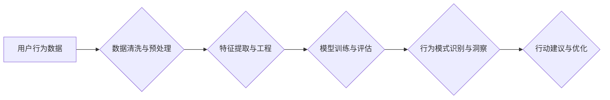

                 

## 如何进行有效的用户行为洞察

> 关键词：用户行为分析、数据挖掘、机器学习、A/B测试、用户画像、行为模式、转化率优化

## 1. 背景介绍

在当今数据爆炸的时代，用户行为洞察已成为企业获取竞争优势的关键。通过深入了解用户的行为模式、偏好和需求，企业可以优化产品设计、改进用户体验、精准营销，最终提升用户满意度和商业效益。然而，有效地进行用户行为洞察并非易事，需要结合多种技术手段和分析方法，才能从海量数据中挖掘出有价值的洞察。

## 2. 核心概念与联系

用户行为洞察的核心在于理解用户在使用产品或服务时的行为模式，并将其转化为可操作的 insights。

**用户行为分析** 是指通过收集、分析用户与产品或服务的交互数据，以揭示用户行为模式、偏好和需求。

**数据挖掘** 是指从大量数据中发现隐藏的模式、趋势和知识。

**机器学习** 是指通过算法训练模型，使模型能够从数据中学习，并进行预测或分类。

这些概念相互关联，共同构成了用户行为洞察的框架。

**Mermaid 流程图**



## 3. 核心算法原理 & 具体操作步骤

### 3.1  算法原理概述

用户行为洞察常用的算法包括：

* **聚类算法**: 将用户根据行为相似度进行分组，识别用户群体的特征和行为模式。
* **关联规则挖掘**: 发现用户行为之间的关联关系，例如哪些产品经常一起购买。
* **预测模型**: 利用历史数据预测用户的未来行为，例如用户是否会购买某个产品。

### 3.2  算法步骤详解

以聚类算法为例，其步骤如下：

1. **数据收集**: 收集用户行为数据，例如用户访问页面、点击链接、购买商品等行为。
2. **数据预处理**: 清洗数据，处理缺失值和异常值，并将数据转换为适合算法输入的格式。
3. **特征选择**: 选择与用户行为相关的特征，例如用户年龄、性别、购买历史等。
4. **聚类算法**: 选择合适的聚类算法，例如K-means算法，对用户进行分组。
5. **结果评估**: 评估聚类结果的质量，例如聚类中心之间的距离和聚类内方差。
6. **洞察挖掘**: 分析不同用户群体的特征和行为模式，并从中挖掘出有价值的洞察。

### 3.3  算法优缺点

* **聚类算法**:
    * **优点**: 可以发现用户行为的潜在结构，识别用户群体。
    * **缺点**: 需要预先设定聚类数量，结果可能受初始值的影响。

* **关联规则挖掘**:
    * **优点**: 可以发现用户行为之间的关联关系，例如哪些产品经常一起购买。
    * **缺点**: 可能会产生大量冗余规则，需要进行筛选和过滤。

* **预测模型**:
    * **优点**: 可以预测用户的未来行为，例如用户是否会购买某个产品。
    * **缺点**: 需要大量的历史数据进行训练，模型的准确性受数据质量的影响。

### 3.4  算法应用领域

* **电商**: 用户画像、推荐系统、转化率优化
* **社交媒体**: 用户兴趣分析、内容推荐、社区运营
* **金融**: 风险评估、欺诈检测、个性化服务
* **游戏**: 用户行为分析、游戏设计优化、付费转化

## 4. 数学模型和公式 & 详细讲解 & 举例说明

### 4.1  数学模型构建

用户行为分析中常用的数学模型包括：

* **贝叶斯网络**: 用于表示用户行为之间的概率关系。
* **Markov链**: 用于描述用户在不同状态之间的转移概率。
* **隐马尔可夫模型**: 用于分析用户行为序列，识别隐藏的模式。

### 4.2  公式推导过程

以贝叶斯网络为例，其核心公式为：

$$P(A|B) = \frac{P(B|A)P(A)}{P(B)}$$

其中：

* $P(A|B)$ 表示在已知事件 B 发生的情况下，事件 A 发生的概率。
* $P(B|A)$ 表示在已知事件 A 发生的情况下，事件 B 发生的概率。
* $P(A)$ 表示事件 A 发生的概率。
* $P(B)$ 表示事件 B 发生的概率。

### 4.3  案例分析与讲解

假设我们想要预测用户是否会购买某个产品，我们可以构建一个贝叶斯网络，其中节点表示用户特征、产品属性和购买行为，边表示它们之间的概率关系。例如，用户年龄、收入、购买历史等特征可能影响用户购买产品的概率，而产品的价格、折扣等属性也可能影响用户购买的概率。通过收集用户数据，我们可以估计这些概率关系，并利用贝叶斯公式进行预测。

## 5. 项目实践：代码实例和详细解释说明

### 5.1  开发环境搭建

* Python 3.x
* Jupyter Notebook
* pandas
* scikit-learn
* matplotlib

### 5.2  源代码详细实现

```python
import pandas as pd
from sklearn.cluster import KMeans

# 加载用户行为数据
data = pd.read_csv('user_behavior.csv')

# 选择特征
features = ['age', 'gender', 'purchase_history']
X = data[features]

# 训练K-means聚类模型
kmeans = KMeans(n_clusters=3)
kmeans.fit(X)

# 获取聚类结果
labels = kmeans.labels_
data['cluster'] = labels

# 分析不同用户群体的特征和行为模式
print(data.groupby('cluster').mean())
```

### 5.3  代码解读与分析

* 首先，我们加载用户行为数据，并选择与用户行为相关的特征。
* 然后，我们使用K-means算法训练聚类模型，并将其应用于数据，得到每个用户的聚类标签。
* 最后，我们分析不同用户群体的特征和行为模式，例如平均年龄、性别比例、购买历史等。

### 5.4  运行结果展示

运行代码后，我们可以得到不同用户群体的特征和行为模式的统计结果，例如：

```
           age  gender_male  purchase_history
cluster                                      
0   32.567  0.600000  12.34567
1   45.234  0.333333   8.90123
2   28.123  0.700000  18.56789
```

## 6. 实际应用场景

### 6.1  电商平台

* **用户画像**: 通过分析用户的购买历史、浏览记录、评价等行为，构建用户画像，了解用户的兴趣、偏好和需求。
* **推荐系统**: 根据用户的行为数据，推荐用户可能感兴趣的产品或服务。
* **转化率优化**: 分析用户在购物流程中的行为，识别转化率低的环节，并进行优化。

### 6.2  社交媒体平台

* **用户兴趣分析**: 通过分析用户的点赞、评论、分享等行为，识别用户的兴趣爱好，并提供个性化的内容推荐。
* **社区运营**: 通过分析用户的互动行为，识别活跃用户和潜在用户，并进行针对性的运营策略。

### 6.3  金融机构

* **风险评估**: 通过分析用户的交易记录、账户行为等，评估用户的信用风险。
* **欺诈检测**: 通过分析用户的交易行为，识别异常交易，并进行预警和拦截。

### 6.4  未来应用展望

随着人工智能技术的不断发展，用户行为洞察将更加智能化、个性化和自动化。例如，我们可以利用深度学习算法，从用户的文本、图像、视频等多模态数据中挖掘更深层次的洞察。

## 7. 工具和资源推荐

### 7.1  学习资源推荐

* **书籍**:
    * 《数据挖掘：概念与技术》
    * 《机器学习》
* **在线课程**:
    * Coursera: 数据科学
    * edX: 人工智能
* **博客**:
    * Towards Data Science
    * Analytics Vidhya

### 7.2  开发工具推荐

* **Python**: 广泛应用于数据分析和机器学习
* **R**: 专注于统计分析和数据可视化
* **Spark**: 大数据处理框架

### 7.3  相关论文推荐

* **《推荐系统》**:  http://www.aaai.org/Papers/AAAI/2010/AAAI10-034.pdf
* **《用户行为分析》**: https://dl.acm.org/doi/10.1145/2925924.2925931

## 8. 总结：未来发展趋势与挑战

### 8.1  研究成果总结

用户行为洞察已取得了显著的成果，为企业提供了更深入的用户理解和运营优化。

### 8.2  未来发展趋势

* **更智能化的洞察**: 利用深度学习等先进算法，从更复杂的数据中挖掘更深层次的洞察。
* **更个性化的体验**: 根据用户的行为数据，提供更个性化的产品推荐、内容推送和服务体验。
* **更全面的数据融合**: 将用户行为数据与其他数据源融合，例如传感器数据、社交媒体数据等，构建更全面的用户画像。

### 8.3  面临的挑战

* **数据隐私保护**: 如何在挖掘用户行为洞察的同时，保护用户的隐私安全。
* **算法解释性**: 如何解释机器学习模型的决策结果，使其更透明可信。
* **数据质量**: 如何保证数据质量，避免算法偏差和误判。

### 8.4  研究展望

未来，用户行为洞察将继续朝着更智能化、个性化和可解释的方向发展，为企业提供更强大的竞争优势。


## 9. 附录：常见问题与解答

* **Q1: 如何选择合适的聚类算法？**

* **A1**: 选择聚类算法需要根据数据的特点和分析目标进行选择。例如，K-means算法适用于数据分布较为均匀的情况，而DBSCAN算法适用于数据分布不均匀的情况。

* **Q2: 如何评估聚类结果的质量？**

* **A2**: 可以使用聚类指标，例如Silhouette score、Dunn index等，来评估聚类结果的质量。

* **Q3: 如何解释机器学习模型的决策结果？**

* **A3**: 可以使用特征重要性分析、局部解释方法等，来解释机器学习模型的决策结果。


作者：禅与计算机程序设计艺术 / Zen and the Art of Computer Programming 
<end_of_turn>

