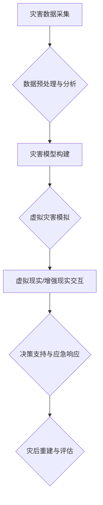

                 

## 2050年的全球减灾：从灾害元宇宙到全球减灾合作的减灾体系升级

> 关键词：灾害元宇宙、减灾体系、人工智能、大数据、预测模型、虚拟现实、增强现实、全球合作

### 1. 背景介绍

21世纪，气候变化、自然灾害频发，给全球社会带来了前所未有的挑战。传统减灾体系面临着数据孤岛、预警滞后、响应效率低等问题，难以有效应对日益复杂的灾害形势。

随着人工智能、大数据、虚拟现实（VR）、增强现实（AR）等技术的飞速发展，灾害元宇宙应运而生，为全球减灾提供了全新的思路和解决方案。灾害元宇宙是一个基于虚拟现实和增强现实技术的沉浸式数字环境，可以模拟真实世界灾害场景，实现灾害预警、应急演练、灾后重建等功能。

### 2. 核心概念与联系

灾害元宇宙的核心概念是将现实世界中的灾害信息、数据、模型等要素数字化，构建一个虚拟的灾害模拟环境。在这个环境中，我们可以进行灾害模拟、预警、演练、救援等多方面的操作，并通过虚拟现实和增强现实技术，让参与者身临其境地体验灾害场景，提高应对能力。

**灾害元宇宙架构**



**核心概念与联系：**

* **灾害数据采集:** 利用卫星遥感、地面传感器、社交媒体等多种途径收集灾害相关数据，包括气象数据、地质数据、人口数据、基础设施数据等。
* **数据预处理与分析:** 对采集到的数据进行清洗、整合、分析，提取关键信息，构建灾害特征数据库。
* **灾害模型构建:** 基于机器学习、深度学习等人工智能技术，构建灾害预警、模拟、评估等模型，预测灾害发生概率、范围、强度等。
* **虚拟灾害模拟:** 利用虚拟现实和增强现实技术，构建逼真的灾害模拟环境，模拟不同类型、不同强度、不同场景的灾害发生过程。
* **虚拟现实/增强现实交互:** 允许用户在虚拟环境中进行灾害演练、救援模拟、灾后重建规划等操作，提高应对能力。
* **决策支持与应急响应:** 为决策者提供实时灾害信息、预警分析、模拟结果等，支持快速、精准的应急决策和行动。
* **灾后重建与评估:** 利用灾害元宇宙模拟灾后重建场景，评估不同重建方案的优劣，优化灾后重建规划。

### 3. 核心算法原理 & 具体操作步骤

#### 3.1  算法原理概述

灾害元宇宙的核心算法包括灾害预测模型、虚拟环境渲染算法、用户交互算法等。

* **灾害预测模型:** 基于机器学习、深度学习等人工智能技术，利用历史灾害数据、气象数据、地质数据等，构建预测模型，预测灾害发生概率、范围、强度等。常见的算法包括支持向量机（SVM）、随机森林（RF）、深度神经网络（DNN）等。
* **虚拟环境渲染算法:** 利用图形学技术，渲染逼真的灾害场景，包括地形、建筑物、植被、天气等。常见的算法包括光线追踪、阴影渲染、纹理贴图等。
* **用户交互算法:** 实现用户与虚拟环境的交互，包括手势识别、语音识别、虚拟现实设备控制等。常见的算法包括计算机视觉、自然语言处理、人机交互等。

#### 3.2  算法步骤详解

**灾害预测模型算法步骤:**

1. **数据收集:** 收集历史灾害数据、气象数据、地质数据等。
2. **数据预处理:** 对数据进行清洗、整合、特征提取等操作。
3. **模型选择:** 选择合适的机器学习算法，例如SVM、RF、DNN等。
4. **模型训练:** 利用训练数据训练模型，调整模型参数。
5. **模型评估:** 利用测试数据评估模型性能，例如准确率、召回率、F1-score等。
6. **模型部署:** 将训练好的模型部署到灾害预警系统中。

**虚拟环境渲染算法步骤:**

1. **场景建模:** 建立灾害场景的3D模型，包括地形、建筑物、植被等。
2. **材质贴图:** 为模型添加材质贴图，模拟不同材质的表面效果。
3. **光照计算:** 计算光线照射到模型上的效果，模拟光影变化。
4. **渲染输出:** 将渲染结果输出到屏幕或虚拟现实设备。

**用户交互算法步骤:**

1. **传感器数据采集:** 收集用户手势、语音、眼动等传感器数据。
2. **数据处理:** 对传感器数据进行处理，提取用户意图。
3. **交互逻辑实现:** 根据用户意图，执行相应的交互操作，例如移动虚拟角色、选择虚拟物品等。
4. **反馈机制:** 向用户提供交互反馈，例如声音、视觉效果等。

#### 3.3  算法优缺点

**灾害预测模型算法:**

* **优点:** 可以准确预测灾害发生概率、范围、强度等，为决策者提供决策依据。
* **缺点:** 需要大量历史数据进行训练，对数据质量要求高，难以预测突发性灾害。

**虚拟环境渲染算法:**

* **优点:** 可以构建逼真的灾害场景，提高用户沉浸感和参与度。
* **缺点:** 渲染过程计算量大，对硬件性能要求高。

**用户交互算法:**

* **优点:** 可以实现用户与虚拟环境的自然交互，提高用户体验。
* **缺点:** 算法复杂度高，需要不断优化和改进。

#### 3.4  算法应用领域

灾害预测模型、虚拟环境渲染算法、用户交互算法等算法广泛应用于灾害预警、应急演练、灾后重建等领域。

* **灾害预警:** 利用灾害预测模型，预测灾害发生概率、范围、强度等，及时发布预警信息，提醒公众做好防灾准备。
* **应急演练:** 利用虚拟环境渲染算法，构建逼真的灾害场景，进行应急演练，提高救援人员的应急能力。
* **灾后重建:** 利用灾害元宇宙模拟灾后重建场景，评估不同重建方案的优劣，优化灾后重建规划。

### 4. 数学模型和公式 & 详细讲解 & 举例说明

#### 4.1  数学模型构建

灾害元宇宙的数学模型主要包括灾害预测模型、虚拟环境渲染模型、用户交互模型等。

* **灾害预测模型:** 可以使用统计模型、机器学习模型、深度学习模型等构建。例如，可以使用线性回归模型预测洪水水位，使用支持向量机模型预测地震强度。
* **虚拟环境渲染模型:** 可以使用光线追踪模型、阴影渲染模型、纹理贴图模型等构建。例如，可以使用光线追踪模型模拟光线在场景中的传播，使用阴影渲染模型模拟物体投射的阴影。
* **用户交互模型:** 可以使用计算机视觉模型、自然语言处理模型、人机交互模型等构建。例如，可以使用计算机视觉模型识别用户的手势，使用自然语言处理模型理解用户的语音指令。

#### 4.2  公式推导过程

灾害预测模型的公式推导过程具体取决于所使用的算法。例如，线性回归模型的公式如下：

$$y = \beta_0 + \beta_1x_1 + \beta_2x_2 + ... + \beta_nx_n + \epsilon$$

其中：

* $y$ 是预测值
* $\beta_0, \beta_1, ..., \beta_n$ 是模型参数
* $x_1, x_2, ..., x_n$ 是输入特征
* $\epsilon$ 是误差项

#### 4.3  案例分析与讲解

**案例：洪水预警系统**

可以使用灾害元宇宙构建一个洪水预警系统。系统可以收集气象数据、水位数据、地形数据等，构建洪水预测模型，预测洪水发生概率、范围、强度等。

当系统预测到洪水风险较高时，可以向受灾地区发布预警信息，提醒公众做好防灾准备。同时，系统还可以模拟洪水场景，帮助救援人员制定救援方案。

### 5. 项目实践：代码实例和详细解释说明

#### 5.1  开发环境搭建

灾害元宇宙的开发环境通常包括以下软件：

* **操作系统:** Windows、Linux、macOS等
* **编程语言:** Python、C++、Java等
* **虚拟现实/增强现实框架:** Unity、Unreal Engine、ARKit、ARCore等
* **数据库:** MySQL、PostgreSQL、MongoDB等
* **云计算平台:** AWS、Azure、GCP等

#### 5.2  源代码详细实现

由于篇幅限制，这里只提供灾害预测模型的代码示例，使用Python和Scikit-learn库。

```python
from sklearn.linear_model import LinearRegression
from sklearn.model_selection import train_test_split
from sklearn.metrics import mean_squared_error

# 准备数据
X = [[temperature, rainfall, wind_speed]]  # 输入特征
y = [flood_level]  # 目标值

# 划分训练集和测试集
X_train, X_test, y_train, y_test = train_test_split(X, y, test_size=0.2)

# 创建线性回归模型
model = LinearRegression()

# 训练模型
model.fit(X_train, y_train)

# 预测测试集数据
y_pred = model.predict(X_test)

# 计算模型性能
mse = mean_squared_error(y_test, y_pred)
print(f"Mean Squared Error: {mse}")
```

#### 5.3  代码解读与分析

这段代码首先准备了输入特征和目标值，然后将数据划分成训练集和测试集。接着创建了一个线性回归模型，并使用训练集训练模型。最后，使用测试集数据预测目标值，并计算模型的性能指标。

#### 5.4  运行结果展示

运行结果会显示模型的平均平方误差（MSE）值，该值越小，模型的预测精度越高。

### 6. 实际应用场景

灾害元宇宙的实际应用场景非常广泛，包括：

* **灾害预警:** 利用灾害预测模型，预测灾害发生概率、范围、强度等，及时发布预警信息，提醒公众做好防灾准备。
* **应急演练:** 利用虚拟环境渲染算法，构建逼真的灾害场景，进行应急演练，提高救援人员的应急能力。
* **灾后重建:** 利用灾害元宇宙模拟灾后重建场景，评估不同重建方案的优劣，优化灾后重建规划。
* **灾害教育:** 利用虚拟现实技术，让用户身临其境地体验灾害场景，提高公众的灾害意识和防灾知识。

#### 6.4  未来应用展望

未来，灾害元宇宙将更加智能化、个性化、交互式。

* **智能化:** 利用人工智能技术，实现灾害预测的自动化、精准化。
* **个性化:** 根据用户的需求和特点，定制化的灾害预警、应急演练、灾后重建方案。
* **交互式:** 利用虚拟现实、增强现实技术，实现更加沉浸式的灾害体验，提高用户参与度。

### 7. 工具和资源推荐

#### 7.1  学习资源推荐

* **书籍:**
    * 《灾害学》
    * 《人工智能》
    * 《虚拟现实技术》
* **在线课程:**
    * Coursera: 灾害管理、人工智能、虚拟现实
    * edX: 灾害预警、应急响应、灾后重建
* **网站:**
    * 联合国减灾办公室 (UNISDR)
    * 世界气象组织 (WMO)
    * 国际红十字会 (ICRC)

#### 7.2  开发工具推荐

* **编程语言:** Python, C++, Java
* **虚拟现实/增强现实框架:** Unity, Unreal Engine, ARKit, ARCore
* **数据库:** MySQL, PostgreSQL, MongoDB
* **云计算平台:** AWS, Azure, GCP

#### 7.3  相关论文推荐

* **灾害预测模型:**
    * "A Deep Learning Approach to Flood Forecasting"
    * "Machine Learning for Earthquake Early Warning"
* **虚拟环境渲染:**
    * "Real-Time Rendering"
    * "Computer Graphics: Principles and Practice"
* **用户交互:**
    * "Human-Computer Interaction"
    * "Virtual Reality and Augmented Reality"

### 8. 总结：未来发展趋势与挑战

#### 8.1  研究成果总结

灾害元宇宙的研究取得了显著成果，为全球减灾提供了新的思路和解决方案。

* **灾害预测模型:** 准确预测灾害发生概率、范围、强度等，为决策者提供决策依据。
* **虚拟环境渲染:** 构建逼真的灾害场景，提高用户沉浸感和参与度。
* **用户交互:** 实现用户与虚拟环境的自然交互，提高用户体验。

#### 8.2  未来发展趋势

未来，灾害元宇宙将朝着以下方向发展：

* **更加智能化:** 利用人工智能技术，实现灾害预测的自动化、精准化。
* **更加个性化:** 根据用户的需求和特点，定制化的灾害预警、应急演练、灾后重建方案。
* **更加交互式:** 利用虚拟现实、增强现实技术，实现更加沉浸式的灾害体验，提高用户参与度。

#### 8.3  面临的挑战

灾害元宇宙的发展也面临着一些挑战：

* **数据获取和处理:** 灾害数据往往分散、不完整、难以获取，需要开发新的数据采集、处理和分析技术。
* **模型精度:** 灾害预测模型的精度仍然存在一定局限性，需要不断改进模型算法和训练数据。
* **技术成本:** 灾害元宇宙的开发和部署需要投入大量的技术和资金资源。
* **伦理问题:** 灾害元宇宙的应用可能涉及到隐私、安全、责任等伦理问题，需要制定相应的规范和制度。

#### 8.4  研究展望

未来，我们将继续致力于灾害元宇宙的研究和应用，努力构建一个更加安全、更加可持续的未来。

### 9. 附录：常见问题与解答

**常见问题:**

* **灾害元宇宙和传统减灾体系有什么区别？**

灾害元宇宙与传统减灾体系相比，具有以下优势：

* **更加沉浸式:** 利用虚拟现实和增强现实技术，让用户身临其境地体验灾害场景，提高参与度和学习效果。
* **更加交互式:** 用户可以与虚拟环境进行交互，例如模拟救援行动、评估重建方案等，提高决策效率。
* **更加精准:** 利用人工智能技术，实现灾害预测的自动化、精准化。

* **灾害元宇宙的应用场景有哪些？**

灾害元宇宙的应用场景非常广泛，包括：

* 灾害预警
* 应急演练
* 灾后重建
* 灾害教育

* **灾害元宇宙的未来发展趋势是什么？**

未来，灾害元宇宙将朝着以下方向发展：

* **更加智能化:** 利用人工智能技术，实现灾害预测的自动化、精准化。
* **更加个性化:** 根据用户的需求和特点，定制化的灾害预警、应急演练、灾后重建方案。
* **更加交互式:** 利用虚拟现实、增强现实技术，实现更加沉浸式的灾害体验，提高用户参与度。

**作者：禅与计算机程序设计艺术 / Zen and the Art of Computer Programming**<end_of_turn>

