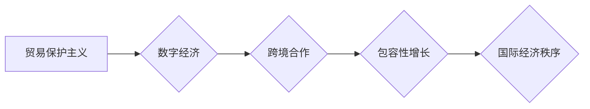

                 

## 2050年的全球贸易：从贸易保护主义到包容性增长的国际经济合作

> 关键词：全球贸易、人工智能、区块链、数据安全、跨境合作、包容性增长、数字经济、贸易规则、国际经济秩序

### 1. 背景介绍

21世纪初，全球化进程加速，贸易自由化成为世界经济发展的基石。然而，近年来，贸易保护主义抬头，地缘政治风险加剧，新冠疫情等突发事件也对全球贸易体系造成冲击。面对这些挑战，2050年的全球贸易将面临着前所未有的变革和机遇。

**1.1. 贸易保护主义的兴起**

近年来，一些国家出于自身利益考虑，采取了贸易保护主义措施，例如加征关税、限制进口、补贴本国企业等。这些措施虽然短期内可能带来一些经济利益，但长期来看会损害全球贸易自由化进程，阻碍经济增长。

**1.2. 数字经济的崛起**

数字经济的快速发展正在深刻地改变着全球贸易格局。电子商务、云计算、大数据等新兴技术为跨境贸易提供了新的平台和工具，但也带来了新的挑战，例如数据安全、知识产权保护等。

**1.3. 跨境合作的必要性**

面对全球性挑战，各国需要加强跨境合作，共同维护多边贸易体制，促进贸易自由化和经济全球化。

### 2. 核心概念与联系

2050年的全球贸易将以“包容性增长”为核心目标，强调公平、可持续和共同发展。

**2.1. 包容性增长**

包容性增长是指经济增长能够惠及所有社会成员，缩小贫富差距，促进社会公平正义。

**2.2. 数字经济**

数字经济是指以数字技术为基础，以数据为核心要素，以网络为平台，以智能化和数字化为特征的经济形态。

**2.3. 跨境合作**

跨境合作是指不同国家或地区之间在经济、贸易、科技等领域进行合作。

**2.4. 贸易规则**

贸易规则是指各国之间在贸易活动中遵循的共同规范和准则。

**2.5. 国际经济秩序**

国际经济秩序是指各国在经济活动中相互关系的总体框架和规则体系。

**Mermaid 流程图**



### 3. 核心算法原理 & 具体操作步骤

为了实现包容性增长的目标，2050年的全球贸易将需要采用新的算法和技术手段，例如人工智能、区块链等。

**3.1. 算法原理概述**

人工智能算法可以用于分析海量贸易数据，预测市场趋势，优化物流配送，提高贸易效率。区块链技术可以用于构建透明、安全、可追溯的贸易平台，防止贸易欺诈，提高贸易信赖度。

**3.2. 算法步骤详解**

**3.2.1. 人工智能算法**

1. 收集贸易数据，包括商品价格、供应链信息、消费者行为等。
2. 使用机器学习算法对数据进行分析，建立预测模型。
3. 根据预测模型，优化贸易决策，例如定价、库存管理、物流配送等。

**3.2.2. 区块链算法**

1. 建立一个分布式账本，记录所有贸易交易信息。
2. 使用加密技术确保交易数据的安全性和不可篡改性。
3. 通过智能合约自动执行贸易合同，提高交易效率。

**3.3. 算法优缺点**

**3.3.1. 人工智能算法**

* **优点:** 能够处理海量数据，提高预测精度，优化决策。
* **缺点:** 需要大量数据训练，算法解释性较差，存在算法偏见风险。

**3.3.2. 区块链算法**

* **优点:** 安全、透明、可追溯，提高交易效率和信赖度。
* **缺点:** 技术复杂，应用场景有限， scalability 问题。

**3.4. 算法应用领域**

* **人工智能算法:** 贸易预测、风险管理、供应链优化、客户服务等。
* **区块链算法:** 贸易融资、知识产权保护、供应链管理、跨境支付等。

### 4. 数学模型和公式 & 详细讲解 & 举例说明

为了量化包容性增长的目标，可以建立数学模型，并使用公式进行分析和预测。

**4.1. 数学模型构建**

假设一个国家的包容性增长指数为 $G$, 可以用以下公式表示:

$$G = \frac{Y_L - Y_P}{Y_L}$$

其中:

* $Y_L$ 是该国所有居民的总收入。
* $Y_P$ 是该国贫困人口的总收入。

**4.2. 公式推导过程**

该公式的推导过程如下:

1. 包容性增长是指经济增长能够惠及所有社会成员，因此需要考虑所有居民的收入变化。
2. 贫困人口的收入水平通常较低，因此需要将其单独考虑。
3. 通过计算所有居民收入与贫困人口收入的差值，可以衡量经济增长对不同收入群体的影响。
4. 将差值除以所有居民收入，可以得到一个衡量包容性增长的指标。

**4.3. 案例分析与讲解**

假设一个国家的总收入为 1000 亿元，贫困人口的总收入为 100 亿元。则该国的包容性增长指数为:

$$G = \frac{1000 - 100}{1000} = 0.9$$

该指数表示该国经济增长对所有居民的惠及程度为 90%。

### 5. 项目实践：代码实例和详细解释说明

为了更好地理解上述算法原理，可以进行实际项目实践，例如开发一个基于人工智能的贸易预测系统。

**5.1. 开发环境搭建**

需要准备以下开发环境:

* 计算机硬件: CPU、内存、硬盘等。
* 操作系统: Windows、Linux、macOS 等。
* 软件环境: Python、TensorFlow、PyTorch 等。

**5.2. 源代码详细实现**

以下是一个基于 TensorFlow 的贸易预测系统的源代码示例:

```python
import tensorflow as tf

# 构建模型
model = tf.keras.models.Sequential([
    tf.keras.layers.Dense(64, activation='relu', input_shape=(10,)),
    tf.keras.layers.Dense(32, activation='relu'),
    tf.keras.layers.Dense(1)
])

# 编译模型
model.compile(optimizer='adam', loss='mse')

# 训练模型
model.fit(X_train, y_train, epochs=10)

# 预测
predictions = model.predict(X_test)
```

**5.3. 代码解读与分析**

该代码示例构建了一个简单的深度学习模型，用于预测商品价格。

* `tf.keras.models.Sequential` 创建了一个顺序模型，即层级结构的模型。
* `tf.keras.layers.Dense` 创建了一个全连接层，连接所有输入节点和输出节点。
* `activation='relu'` 使用 ReLU 激活函数，提高模型的非线性表达能力。
* `optimizer='adam'` 使用 Adam 优化器，更新模型参数。
* `loss='mse'` 使用均方误差作为损失函数，衡量模型预测结果与真实值的差异。
* `model.fit()` 使用训练数据训练模型。
* `model.predict()` 使用测试数据预测商品价格。

**5.4. 运行结果展示**

训练完成后，可以将模型应用于实际数据，预测商品价格。

### 6. 实际应用场景

**6.1. 贸易预测**

人工智能算法可以分析历史贸易数据，预测未来商品价格、需求量等，帮助企业制定更有效的贸易策略。

**6.2. 风险管理**

区块链技术可以帮助企业追踪商品来源、物流信息等，降低贸易风险，防止欺诈行为。

**6.3. 供应链优化**

人工智能和区块链技术可以协同优化供应链，提高效率、降低成本。

**6.4. 未来应用展望**

未来，人工智能、区块链等技术将更加成熟，在全球贸易领域应用更加广泛，例如:

* **个性化贸易服务:** 根据消费者需求，提供个性化的商品推荐和交易服务。
* **跨境支付简化:** 使用区块链技术，实现快速、安全、低成本的跨境支付。
* **数字贸易平台:** 建立基于数字技术的贸易平台，连接全球买家和卖家。

### 7. 工具和资源推荐

**7.1. 学习资源推荐**

* **书籍:** 《人工智能简史》、《区块链技术入门》
* **在线课程:** Coursera、edX、Udacity 等平台提供人工智能、区块链等相关课程。
* **技术博客:** TensorFlow、PyTorch 等框架官方博客，以及一些技术博客网站，例如 Towards Data Science、Hacker Noon 等。

**7.2. 开发工具推荐**

* **Python:** 人工智能、区块链开发的常用编程语言。
* **TensorFlow:** 深度学习框架。
* **PyTorch:** 深度学习框架。
* **Hyperledger Fabric:** 区块链平台。

**7.3. 相关论文推荐**

* **人工智能:** 《Attention Is All You Need》、《BERT: Pre-training of Deep Bidirectional Transformers for Language Understanding》
* **区块链:** 《Bitcoin: A Peer-to-Peer Electronic Cash System》、《Ethereum: A Secure Decentralised General-Purpose Platform》

### 8. 总结：未来发展趋势与挑战

**8.1. 研究成果总结**

2050年的全球贸易将更加数字化、智能化和包容性。人工智能、区块链等技术将推动贸易效率提升、风险降低、公平性增强。

**8.2. 未来发展趋势**

* **数字贸易平台的普及:** 数字贸易平台将成为全球贸易的主要模式，连接全球买家和卖家。
* **人工智能驱动的贸易决策:** 人工智能将被广泛应用于贸易预测、风险管理、供应链优化等领域。
* **区块链技术的应用扩展:** 区块链技术将应用于更多贸易场景，例如贸易融资、知识产权保护等。

**8.3. 面临的挑战**

* **数据安全和隐私保护:** 数字化贸易需要处理大量数据，如何确保数据安全和隐私保护是关键挑战。
* **技术标准和互操作性:** 不同国家和地区的贸易平台和技术标准不统一，需要建立统一的标准和协议。
* **数字鸿沟:** 不同国家和地区的数字基础设施和技术水平差异较大，需要缩小数字鸿沟。

**8.4. 研究展望**

未来研究需要关注以下几个方面:

* **开发更安全、更可靠的数字贸易平台。**
* **研究人工智能和区块链技术的应用场景，并制定相应的政策法规。**
* **缩小数字鸿沟，促进全球贸易的公平发展。**

### 9. 附录：常见问题与解答

**9.1. 如何确保数字贸易的安全性？**

可以使用加密技术、身份验证机制、审计日志等技术手段，确保数字贸易的安全性。

**9.2. 如何解决跨境数据传输的问题？**

可以利用云计算、数据加密等技术，解决跨境数据传输的问题。

**9.3. 如何促进数字贸易的公平发展？**

需要制定相应的政策法规，鼓励中小企业参与数字贸易，缩小数字鸿沟。


作者：禅与计算机程序设计艺术 / Zen and the Art of Computer Programming 
<end_of_turn>

