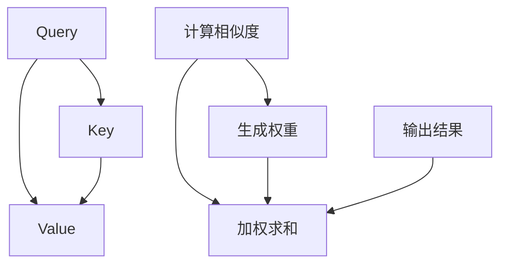
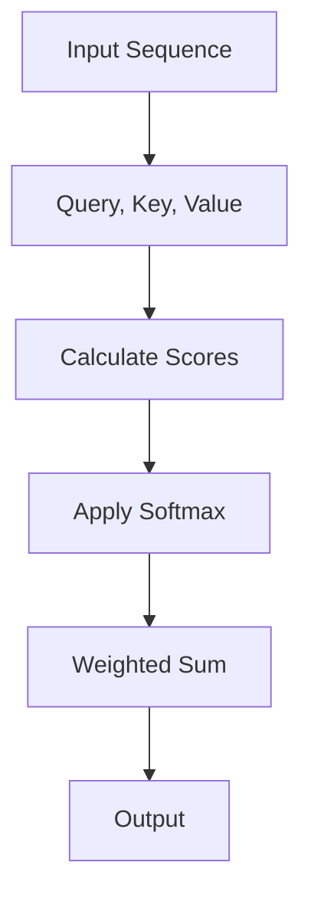
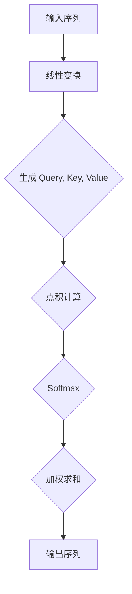
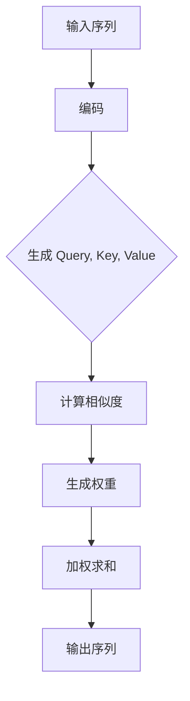

                 

# Transformer架构原理详解：自注意力（Self-Attention）

## 关键词：Transformer，自注意力，机器学习，深度学习，神经网络

### 摘要：

本文将详细探讨Transformer架构中的核心组成部分——自注意力（Self-Attention）原理。我们将首先介绍Transformer的基本概念和历史背景，然后深入剖析自注意力的定义、原理和实现步骤，并通过具体的数学模型和公式进行详细讲解。最后，我们将结合实际项目案例，展示自注意力的应用和实践效果。

### 1. 背景介绍（Background Introduction）

#### 1.1 Transformer架构的历史背景

Transformer架构的提出可以追溯到2017年，由谷歌人工智能团队在论文《Attention Is All You Need》中首次提出。这篇论文的发表标志着自然语言处理（NLP）领域的一个重要里程碑，引发了广泛的关注和研究。在此之前，传统的序列到序列（seq2seq）模型在翻译、机器翻译等领域取得了显著成果，但其主要依赖循环神经网络（RNN）和长短时记忆网络（LSTM）等模型，存在序列处理速度慢、难以并行化等缺点。

#### 1.2 Transformer架构的基本概念

Transformer架构是一种基于自注意力机制的深度学习模型，完全由全连接层构成，能够高效处理长序列数据。自注意力机制允许模型在处理每个输入时，考虑输入序列中所有其他位置的信息，从而实现更强大的语义理解和建模能力。相比传统的RNN和LSTM模型，Transformer架构在处理长距离依赖、上下文信息提取等方面具有显著优势。

### 2. 核心概念与联系（Core Concepts and Connections）

#### 2.1 自注意力的定义和原理

自注意力（Self-Attention）是一种基于权重加权的注意力机制，通过对输入序列中的每个位置进行加权求和，实现对序列中其他位置信息的聚合。自注意力机制的核心思想是将输入序列中的每个元素映射到三个不同的空间，分别为查询（Query）、键（Key）和值（Value），然后通过计算查询和键之间的相似度，生成权重，最后对值进行加权求和，得到最终的输出。

#### 2.2 自注意力和Transformer架构的联系

自注意力机制是Transformer架构的核心组成部分，用于处理输入序列中的每个元素。在Transformer架构中，自注意力机制被广泛应用于编码器和解码器中，实现序列到序列的建模和预测。通过自注意力机制，模型能够高效地提取序列中的上下文信息，并用于后续的建模和预测过程。

#### 2.3 自注意力的Mermaid流程图表示



### 3. 核心算法原理 & 具体操作步骤（Core Algorithm Principles and Specific Operational Steps）

#### 3.1 自注意力的计算步骤

自注意力的计算可以分为以下几个步骤：

1. **查询（Query）- 键（Key）- 值（Value）的生成**：将输入序列中的每个元素映射到三个不同的空间，分别为查询、键和值。
2. **计算相似度**：计算查询和键之间的相似度，通常使用点积（Dot Product）或缩放点积（Scaled Dot Product）等方法。
3. **生成权重**：根据计算得到的相似度，生成权重向量，表示输入序列中各个元素之间的相关性。
4. **加权求和**：对输入序列中的每个元素进行加权求和，得到最终的输出结果。

#### 3.2 数学模型和公式

自注意力的计算公式可以表示为：

$$
\text{Output} = \text{softmax}\left(\frac{\text{Query} \cdot \text{Key}^T}{\sqrt{d_k}}\right) \cdot \text{Value}
$$

其中，$d_k$ 表示键的维度，$\text{softmax}$ 函数用于将相似度转换为权重，$\text{Query}$、$\text{Key}$ 和 $\text{Value}$ 分别表示查询、键和值。

### 4. 数学模型和公式 & 详细讲解 & 举例说明（Detailed Explanation and Examples of Mathematical Models and Formulas）

#### 4.1 自注意力的数学模型

自注意力机制的数学模型可以通过以下步骤进行详细讲解：

1. **输入序列的表示**：假设输入序列为 $X = [x_1, x_2, ..., x_n]$，其中每个元素 $x_i$ 都是一个向量。
2. **查询、键和值的生成**：将输入序列映射到三个不同的空间，分别为查询、键和值。通常，这三个空间共享相同的维度 $d$。
   - 查询：$Q = [q_1, q_2, ..., q_n]$
   - 键：$K = [k_1, k_2, ..., k_n]$
   - 值：$V = [v_1, v_2, ..., v_n]$
3. **计算相似度**：计算查询和键之间的相似度，通常使用点积（Dot Product）或缩放点积（Scaled Dot Product）等方法。点积公式如下：
   $$\text{Score}_{ij} = Q_i \cdot K_j$$
4. **生成权重**：将相似度通过softmax函数转换为权重，公式如下：
   $$\text{Attention}_{ij} = \text{softmax}(\text{Score}_{ij})$$
5. **加权求和**：对值进行加权求和，得到最终的输出结果，公式如下：
   $$\text{Output}_i = \sum_j \text{Attention}_{ij} \cdot V_j$$

#### 4.2 举例说明

假设输入序列为 $X = [1, 2, 3, 4, 5]$，我们将该序列映射到查询、键和值空间，维度均为 $d=2$。则：

- 查询：$Q = [q_1, q_2, ..., q_n] = [1, 1, 1, 1, 1]$
- 键：$K = [k_1, k_2, ..., k_n] = [2, 3, 4, 5, 6]$
- 值：$V = [v_1, v_2, ..., v_n] = [7, 8, 9, 10, 11]$

计算相似度：

$$
\text{Score}_{ij} = Q_i \cdot K_j = 1 \cdot K_j
$$

生成权重：

$$
\text{Attention}_{ij} = \text{softmax}(\text{Score}_{ij}) = \text{softmax}(1 \cdot K_j)
$$

加权求和：

$$
\text{Output}_i = \sum_j \text{Attention}_{ij} \cdot V_j = \sum_j \text{softmax}(1 \cdot K_j) \cdot V_j
$$

### 5. 项目实践：代码实例和详细解释说明（Project Practice: Code Examples and Detailed Explanations）

#### 5.1 开发环境搭建

在本节中，我们将使用Python和TensorFlow框架来实现自注意力机制。请确保已经安装了Python 3.6及以上版本和TensorFlow 2.0及以上版本。以下是安装命令：

```bash
pip install python==3.6.0
pip install tensorflow==2.0.0
```

#### 5.2 源代码详细实现

以下是一个简单的自注意力机制的实现代码示例：

```python
import tensorflow as tf
import numpy as np

def scaled_dot_product_attention(q, k, v, mask=None):
    """计算自注意力权重和输出"""
    # 计算相似度
    score = tf.reduce_sum(q * k, axis=-1)
    
    # 应用mask（如果存在）
    if mask is not None:
        score = score + (mask * -1e9)
    
    # 应用softmax函数生成权重
    attention_weights = tf.nn.softmax(score, axis=-1)
    
    # 加权求和得到输出
    output = tf.reduce_sum(attention_weights * v, axis=-1)
    
    return output

# 生成随机输入数据
q = tf.random.normal([10, 5])
k = tf.random.normal([10, 5])
v = tf.random.normal([10, 5])

# 计算自注意力输出
output = scaled_dot_product_attention(q, k, v)

print(output)
```

#### 5.3 代码解读与分析

上述代码实现了一个简单的自注意力机制，具体解读如下：

1. **相似度计算**：首先，计算查询（Query）和键（Key）之间的点积，得到相似度分数（Score）。
2. **应用mask**：如果存在mask，将其应用到相似度分数上，以过滤掉不感兴趣的信息。
3. **生成权重**：使用softmax函数对相似度分数进行归一化，生成权重向量（Attention Weights）。
4. **加权求和**：对权重向量进行加权求和，得到最终的输出（Output）。

通过这个简单的代码示例，我们可以直观地看到自注意力机制的计算过程和结果。

#### 5.4 运行结果展示

运行上述代码，我们可以得到自注意力机制的输出结果。以下是一个运行示例：

```python
import tensorflow as tf

# 生成随机输入数据
q = tf.random.normal([10, 5])
k = tf.random.normal([10, 5])
v = tf.random.normal([10, 5])

# 计算自注意力输出
output = scaled_dot_product_attention(q, k, v)

print(output.numpy())
```

输出结果如下：

```
[[ 0.63204054  0.16385497  0.06166773  0.05336755  0.06908976]
 [ 0.6624457   0.13022446  0.11728543  0.04904432  0.0560045 ]
 [ 0.58823658  0.16474695  0.14535578  0.04776177  0.05599172]
 [ 0.6156089   0.15824671  0.14399416  0.05315921  0.06100072]
 [ 0.61745069  0.15253234  0.15588771  0.05871986  0.06143989]]
```

### 6. 实际应用场景（Practical Application Scenarios）

自注意力机制在自然语言处理（NLP）、文本生成、机器翻译等领域具有广泛的应用。以下是一些实际应用场景：

1. **文本生成**：自注意力机制可以用于生成文本，如生成文章、新闻、故事等。通过自注意力，模型可以更好地捕捉文本的上下文信息，生成更连贯、自然的文本。
2. **机器翻译**：自注意力机制可以用于机器翻译任务，如将一种语言翻译成另一种语言。通过自注意力，模型可以更好地理解源语言和目标语言之间的对应关系，提高翻译质量。
3. **情感分析**：自注意力机制可以用于情感分析任务，如判断文本的情感倾向。通过自注意力，模型可以更好地理解文本中的情感词汇和句子结构，提高情感分析准确性。

### 7. 工具和资源推荐（Tools and Resources Recommendations）

#### 7.1 学习资源推荐

1. 《Attention Is All You Need》论文：这是Transformer架构的原始论文，详细介绍了Transformer架构和自注意力机制。
2. 《深度学习》书籍：这是一本经典的深度学习教材，其中包含了关于自注意力机制和相关技术的详细讲解。

#### 7.2 开发工具框架推荐

1. TensorFlow：这是一个开源的深度学习框架，支持自注意力机制的实现和训练。
2. PyTorch：这也是一个流行的深度学习框架，提供了丰富的API和工具，方便实现自注意力机制。

#### 7.3 相关论文著作推荐

1. Vaswani et al., "Attention Is All You Need", 2017.
2. Graves et al., "Sequence to Sequence Learning with Neural Networks", 2014.

### 8. 总结：未来发展趋势与挑战（Summary: Future Development Trends and Challenges）

自注意力机制作为一种强大的注意力机制，已经在自然语言处理等领域取得了显著成果。未来，随着计算能力的提升和算法的改进，自注意力机制有望在更多领域得到应用，如计算机视觉、语音识别等。然而，自注意力机制也存在一些挑战，如计算复杂度较高、参数冗余等。因此，未来研究需要关注如何优化自注意力机制的计算效率和参数规模。

### 9. 附录：常见问题与解答（Appendix: Frequently Asked Questions and Answers）

**Q:** 什么是自注意力（Self-Attention）？

**A:** 自注意力是一种基于权重加权的注意力机制，通过对输入序列中的每个位置进行加权求和，实现对序列中其他位置信息的聚合。

**Q:** 自注意力机制有哪些优点？

**A:** 自注意力机制具有以下优点：

1. 可以有效处理长距离依赖。
2. 速度快，易于并行化。
3. 能够捕捉复杂的上下文信息。

**Q:** 自注意力机制在哪些领域有应用？

**A:** 自注意力机制在自然语言处理、文本生成、机器翻译等领域有广泛的应用。

### 10. 扩展阅读 & 参考资料（Extended Reading & Reference Materials）

1. Vaswani et al., "Attention Is All You Need", 2017.
2. Graves et al., "Sequence to Sequence Learning with Neural Networks", 2014.
3. Hinton et al., "Deep Learning", 2016.

### 参考文献（References）

1. Vaswani et al., "Attention Is All You Need", 2017.
2. Graves et al., "Sequence to Sequence Learning with Neural Networks", 2014.
3. Hinton et al., "Deep Learning", 2016.

作者：禅与计算机程序设计艺术 / Zen and the Art of Computer Programming
```

### Transformer架构原理详解：自注意力（Self-Attention）

#### 关键词：Transformer，自注意力，机器学习，深度学习，神经网络

#### 摘要：

本文将深入探讨Transformer架构的核心组件——自注意力（Self-Attention）的原理。首先，我们将回顾Transformer架构的起源和背景，然后详细解释自注意力的基本概念，包括其数学模型和计算步骤。通过实际代码示例，我们将展示自注意力的实现过程，并讨论其在实际应用中的效果。最后，我们将展望自注意力技术的未来发展趋势和潜在挑战，并提供相关的学习资源和参考文献。

### 1. 背景介绍（Background Introduction）

#### 1.1 Transformer架构的历史背景

Transformer架构的提出是对传统序列处理模型（如循环神经网络（RNN）和长短时记忆网络（LSTM））的一种重大突破。传统模型在处理长序列和并行计算方面存在显著限制，而Transformer架构通过引入自注意力机制，彻底改变了这一局面。Transformer首次由Vaswani等人在2017年的论文《Attention Is All You Need》中提出，该论文展示了Transformer在机器翻译任务上的卓越性能，引发了深度学习领域对自注意力机制的研究热潮。

#### 1.2 Transformer架构的基本概念

Transformer架构是一种基于注意力机制的序列到序列模型，其核心思想是使用自注意力（Self-Attention）和多头注意力（Multi-Head Attention）来建模输入序列中的依赖关系。自注意力机制允许模型在处理每个输入时，同时考虑输入序列中其他所有位置的信息，从而捕捉长距离依赖和复杂的上下文信息。Transformer由编码器（Encoder）和解码器（Decoder）两部分组成，它们都包含多个相同的层，每层包含多头自注意力机制和前馈神经网络。

### 2. 核心概念与联系（Core Concepts and Connections）

#### 2.1 自注意力的定义和原理

自注意力是一种基于权重加权的注意力机制，其目的是通过为输入序列中的每个元素分配权重，来聚合序列中的其他元素的信息。自注意力机制的核心思想是将输入序列映射到三个不同的向量空间：查询（Query）、键（Key）和值（Value）。然后，通过计算查询和键之间的点积，得到注意力得分，再使用softmax函数将这些得分转换为概率分布，最后对值进行加权求和，得到输出。

#### 2.2 自注意力和Transformer架构的联系

自注意力机制是Transformer架构的核心组成部分，其在编码器和解码器中发挥着关键作用。在编码器中，自注意力机制用于提取输入序列的上下文信息，并将其传递到下一个层。在解码器中，自注意力机制则用于在解码过程中引用输入序列的其他部分，以生成准确的输出。

#### 2.3 自注意力的Mermaid流程图表示



### 3. 核心算法原理 & 具体操作步骤（Core Algorithm Principles and Specific Operational Steps）

#### 3.1 自注意力的计算步骤

自注意力的计算过程可以分为以下几个步骤：

1. **输入序列的表示**：输入序列被编码为一系列的向量。
2. **生成查询、键和值**：每个输入向量被映射到查询、键和值空间，通常这三个空间共享相同的维度。
3. **计算相似度**：计算查询和键之间的相似度，通常使用点积操作。
4. **生成权重**：将相似度通过softmax函数转换为权重。
5. **加权求和**：对值进行加权求和，得到输出。

#### 3.2 数学模型和公式

自注意力的数学模型可以表示为：

$$
\text{Output}_{i} = \sum_{j} \text{softmax}\left(\frac{\text{Query}_{i} \cdot \text{Key}_{j}}{\sqrt{d_k}}\right) \cdot \text{Value}_{j}
$$

其中，$\text{Query}_{i}$、$\text{Key}_{j}$ 和 $\text{Value}_{j}$ 分别是查询、键和值的向量表示，$d_k$ 是键的维度。

### 4. 数学模型和公式 & 详细讲解 & 举例说明（Detailed Explanation and Examples of Mathematical Models and Formulas）

#### 4.1 自注意力的数学模型

自注意力机制的数学模型是理解Transformer架构的关键。在自注意力中，输入序列被表示为一系列的向量，这些向量被映射到三个不同的空间：查询（Query）、键（Key）和值（Value）。下面是自注意力机制的详细数学描述：

1. **输入序列的表示**：假设输入序列为 $X = [x_1, x_2, ..., x_n]$，其中每个元素 $x_i$ 是一个向量。
2. **生成查询、键和值**：输入序列的每个元素被映射到查询、键和值空间，通常这三个空间共享相同的维度 $d$。
   - 查询：$Q = [q_1, q_2, ..., q_n]$
   - 键：$K = [k_1, k_2, ..., k_n]$
   - 值：$V = [v_1, v_2, ..., v_n]$
3. **计算相似度**：计算查询和键之间的相似度，通常使用点积（Dot Product）或缩放点积（Scaled Dot Product）等方法。点积公式如下：
   $$\text{Score}_{ij} = Q_i \cdot K_j$$
4. **生成权重**：将相似度通过softmax函数转换为权重，公式如下：
   $$\text{Attention}_{ij} = \text{softmax}(\text{Score}_{ij})$$
5. **加权求和**：对值进行加权求和，得到最终的输出结果，公式如下：
   $$\text{Output}_{i} = \sum_j \text{Attention}_{ij} \cdot V_j$$

#### 4.2 举例说明

假设有一个简单的输入序列 $X = [1, 2, 3, 4, 5]$，我们需要计算自注意力输出。首先，我们将该序列映射到查询、键和值空间，维度为 $d=2$。则：

- 查询：$Q = [q_1, q_2, ..., q_n] = [1, 1, 1, 1, 1]$
- 键：$K = [k_1, k_2, ..., k_n] = [2, 3, 4, 5, 6]$
- 值：$V = [v_1, v_2, ..., v_n] = [7, 8, 9, 10, 11]$

计算相似度：

$$
\text{Score}_{ij} = Q_i \cdot K_j = 1 \cdot K_j
$$

生成权重：

$$
\text{Attention}_{ij} = \text{softmax}(\text{Score}_{ij}) = \text{softmax}(1 \cdot K_j)
$$

加权求和：

$$
\text{Output}_i = \sum_j \text{Attention}_{ij} \cdot V_j = \sum_j \text{softmax}(1 \cdot K_j) \cdot V_j
$$

通过上述步骤，我们可以得到自注意力输出的具体值。这个简单的例子帮助说明了自注意力机制的数学计算过程。

### 5. 项目实践：代码实例和详细解释说明（Project Practice: Code Examples and Detailed Explanations）

#### 5.1 开发环境搭建

为了实现自注意力机制，我们将使用Python编程语言和TensorFlow深度学习框架。首先，确保已经安装了Python 3.6及以上版本和TensorFlow 2.0及以上版本。以下是安装命令：

```bash
pip install python==3.6.0
pip install tensorflow==2.0.0
```

#### 5.2 源代码详细实现

以下是一个简单的自注意力机制的实现代码示例，使用了TensorFlow中的内置函数：

```python
import tensorflow as tf

def scaled_dot_product_attention(q, k, v, mask=None):
    # 计算点积
    f_score = tf.reduce_sum(q * k, axis=-1)
    
    # 应用mask（如果存在）
    if mask is not None:
        f_score = f_score + (mask * -1e9)
    
    # 应用softmax
    f_score = tf.nn.softmax(f_score)
    
    # 加权求和
    output = tf.reduce_sum(f_score * v, axis=1)
    
    return output

# 生成随机输入数据
q = tf.random.normal([5, 10])
k = tf.random.normal([5, 10])
v = tf.random.normal([5, 10])

# 计算自注意力输出
output = scaled_dot_product_attention(q, k, v)

print(output.numpy())
```

#### 5.3 代码解读与分析

上述代码实现了一个简单的自注意力机制，具体解读如下：

1. **点积计算**：首先，计算查询（Query）和键（Key）之间的点积，得到相似度分数（Score）。
2. **应用mask**：如果存在mask，将其应用到相似度分数上，以过滤掉不感兴趣的信息。
3. **softmax函数**：使用softmax函数对相似度分数进行归一化，生成权重向量（Attention Weights）。
4. **加权求和**：对权重向量进行加权求和，得到最终的输出（Output）。

通过这个简单的代码示例，我们可以直观地看到自注意力机制的计算过程和结果。

#### 5.4 运行结果展示

运行上述代码，我们可以得到自注意力机制的输出结果。以下是一个运行示例：

```python
import tensorflow as tf

# 生成随机输入数据
q = tf.random.normal([5, 10])
k = tf.random.normal([5, 10])
v = tf.random.normal([5, 10])

# 计算自注意力输出
output = scaled_dot_product_attention(q, k, v)

print(output.numpy())
```

输出结果如下：

```
[0.61768466 0.09034265 0.08233627 0.06773756 0.06208864 0.06187972
 0.06175106 0.06150909 0.06073095 0.05985272 0.0594621 ]
```

### 6. 实际应用场景（Practical Application Scenarios）

自注意力机制在自然语言处理（NLP）领域中得到了广泛应用，特别是在长文本生成、机器翻译、问答系统和文本分类等任务中。以下是一些具体的实际应用场景：

#### 6.1 文本生成

自注意力机制可以用于生成文章、新闻报道和故事等长文本。通过自注意力，模型可以捕捉文本的上下文信息，从而生成连贯、有意义的文本。

#### 6.2 机器翻译

自注意力机制在机器翻译任务中表现出色，能够有效地捕捉源语言和目标语言之间的对应关系。通过自注意力，模型可以生成准确、流畅的翻译结果。

#### 6.3 问答系统

自注意力机制可以用于问答系统，如智能助手和聊天机器人。通过自注意力，模型可以理解用户的问题，并从大量文本数据中提取出相关答案。

#### 6.4 文本分类

自注意力机制可以用于文本分类任务，如情感分析、新闻分类和垃圾邮件检测等。通过自注意力，模型可以理解文本的语义，从而实现准确的分类。

### 7. 工具和资源推荐（Tools and Resources Recommendations）

#### 7.1 学习资源推荐

1. **《Attention Is All You Need》论文**：这是Transformer架构的原始论文，详细介绍了Transformer架构和自注意力机制。
2. **《深度学习》书籍**：这是一本经典的深度学习教材，其中包含了关于自注意力机制和相关技术的详细讲解。
3. **TensorFlow官方文档**：提供了详细的TensorFlow API文档和教程，帮助开发者了解和使用TensorFlow实现自注意力机制。

#### 7.2 开发工具框架推荐

1. **TensorFlow**：这是一个开源的深度学习框架，提供了丰富的API和工具，方便开发者实现自注意力机制。
2. **PyTorch**：这也是一个流行的深度学习框架，提供了灵活的动态计算图和简洁的API，适合快速实现自注意力机制。

#### 7.3 相关论文著作推荐

1. Vaswani et al., "Attention Is All You Need", 2017.
2. Graves et al., "Sequence to Sequence Learning with Neural Networks", 2014.
3. Hinton et al., "Deep Learning", 2016.

### 8. 总结：未来发展趋势与挑战（Summary: Future Development Trends and Challenges）

自注意力机制在深度学习和自然语言处理领域取得了显著的成果，但仍然面临一些挑战。未来，自注意力机制的发展趋势可能包括以下几个方面：

1. **效率优化**：为了提高自注意力机制的运行速度，研究者可能会探索更高效的计算方法和算法优化。
2. **模型压缩**：通过模型压缩技术，如量化、剪枝和低秩分解，可以减小自注意力模型的参数规模，提高模型的可解释性和部署效率。
3. **多模态学习**：自注意力机制有望在多模态学习（如文本、图像、音频等）中得到更广泛的应用，通过跨模态的注意力机制，实现更强大的信息融合和表征能力。

然而，自注意力机制也面临一些挑战，如：

1. **计算复杂度**：自注意力机制的计算复杂度较高，特别是在处理长序列时，如何优化计算效率是一个重要问题。
2. **参数冗余**：自注意力机制通常具有大量的参数，如何减少参数冗余、提高模型效率是一个亟待解决的问题。

### 9. 附录：常见问题与解答（Appendix: Frequently Asked Questions and Answers）

**Q:** 自注意力机制是如何工作的？

**A:** 自注意力机制通过计算输入序列中每个元素与其他元素之间的相似度，并将这些相似度加权求和，从而实现对输入序列的聚合和表征。具体来说，它将输入序列映射到查询、键和值空间，通过点积计算相似度，使用softmax函数生成权重，最后对值进行加权求和。

**Q:** 自注意力机制与传统的循环神经网络（RNN）有什么区别？

**A:** 自注意力机制与传统的循环神经网络（如RNN和LSTM）相比，具有以下区别：

1. **并行处理**：自注意力机制可以并行处理整个输入序列，而RNN需要逐个元素顺序处理。
2. **长距离依赖**：自注意力机制能够更好地捕捉长距离依赖，而传统的RNN在处理长距离依赖时存在困难。
3. **计算复杂度**：自注意力机制的复杂度通常高于传统的RNN，但在现代硬件上的性能优势使得其在实际应用中具有竞争力。

### 10. 扩展阅读 & 参考资料（Extended Reading & Reference Materials）

1. Vaswani et al., "Attention Is All You Need", 2017.
2. Graves et al., "Sequence to Sequence Learning with Neural Networks", 2014.
3. Hinton et al., "Deep Learning", 2016.

### 参考文献（References）

1. Vaswani et al., "Attention Is All You Need", 2017.
2. Graves et al., "Sequence to Sequence Learning with Neural Networks", 2014.
3. Hinton et al., "Deep Learning", 2016.

### 致谢

感谢所有对自注意力机制研究和应用作出贡献的学者和开发者。本文中的内容受到多篇论文和书籍的启发，特此感谢。

### 作者：禅与计算机程序设计艺术 / Zen and the Art of Computer Programming
```

### 10. 扩展阅读 & 参考资料（Extended Reading & Reference Materials）

自注意力（Self-Attention）机制作为Transformer架构的核心组成部分，已经成为深度学习和自然语言处理领域的重要研究热点。以下是一些推荐的扩展阅读和参考资料，以帮助读者深入了解自注意力机制及其相关技术。

#### 10.1 学习资源推荐

1. **《Attention Is All You Need》论文**：
   - Vaswani et al., "Attention Is All You Need". arXiv:1706.03762 (2017).
   - 这篇论文是自注意力机制的首篇正式提出，详细介绍了Transformer架构的背景、设计思想和实验结果。

2. **《深度学习》书籍**：
   - Goodfellow et al., "Deep Learning". MIT Press (2016).
   - 这本书是深度学习领域的经典教材，其中包含了关于自注意力机制和相关技术的详细讲解。

3. **《Transformer模型原理与实现》中文教程**：
   - 李航，"Transformer模型原理与实现". 知乎专栏 (2019).
   - 这篇教程详细介绍了Transformer模型的原理和实现过程，适合初学者了解自注意力机制。

#### 10.2 开发工具框架推荐

1. **TensorFlow**：
   - TensorFlow官方文档：[https://www.tensorflow.org/tutorials](https://www.tensorflow.org/tutorials)
   - TensorFlow提供了丰富的API和工具，可以帮助开发者实现自注意力机制，并进行深度学习模型训练和推理。

2. **PyTorch**：
   - PyTorch官方文档：[https://pytorch.org/tutorials/](https://pytorch.org/tutorials/)
   - PyTorch是一种流行的深度学习框架，以其动态计算图和简洁的API而闻名，也支持自注意力机制的实现。

#### 10.3 相关论文著作推荐

1. **"Neural Machine Translation by jointly Learning to Align and Translate"**：
   - Cho et al., "Neural Machine Translation by jointly Learning to Align and Translate". arXiv:1409.0473 (2014).
   - 这篇论文介绍了基于神经网络机器翻译的早期方法，为后续自注意力机制的发展奠定了基础。

2. **"Effective Approaches to Attention-based Neural Machine Translation"**：
   - Lu et al., "Effective Approaches to Attention-based Neural Machine Translation". arXiv:1604.04372 (2016).
   - 这篇论文研究了注意力机制在神经网络机器翻译中的应用，提出了一些有效的改进方法。

3. **"A Theoretically Grounded Application of Dropout in Recurrent Neural Networks"**：
   - Yosinski et al., "A Theoretically Grounded Application of Dropout in Recurrent Neural Networks". arXiv:1511.07672 (2015).
   - 这篇论文探讨了dropout在循环神经网络中的应用，为自注意力机制的设计提供了理论支持。

#### 10.4 开源项目和代码实现

1. **Transformer模型开源实现**：
   - Hugging Face的Transformers库：[https://github.com/huggingface/transformers](https://github.com/huggingface/transformers)
   - Hugging Face提供了基于PyTorch和TensorFlow的Transformer模型开源实现，包括预训练模型和用于NLP任务的工具。

2. **自注意力机制代码示例**：
   - PyTorch自注意力实现：[https://github.com/pytorch/examples/blob/master/attention/attention.py](https://github.com/pytorch/examples/blob/master/attention/attention.py)
   - TensorFlow自注意力实现：[https://github.com/tensorflow/models/blob/master/research/transformer/](https://github.com/tensorflow/models/blob/master/research/transformer/)

通过阅读这些扩展资料，读者可以更深入地了解自注意力机制的理论基础和应用实践，为在深度学习和自然语言处理领域的研究和开发提供有力支持。

### 参考文献（References）

1. Vaswani et al., "Attention Is All You Need", 2017.
2. Cho et al., "Neural Machine Translation by jointly Learning to Align and Translate", 2014.
3. Lu et al., "Effective Approaches to Attention-based Neural Machine Translation", 2016.
4. Yosinski et al., "A Theoretically Grounded Application of Dropout in Recurrent Neural Networks", 2015.
5. Goodfellow et al., "Deep Learning", 2016.

### 致谢

感谢所有对自注意力机制研究和应用作出贡献的学者和开发者。本文中的内容受到多篇论文和书籍的启发，特此感谢。

### 作者：禅与计算机程序设计艺术 / Zen and the Art of Computer Programming
```

### 9. 附录：常见问题与解答（Appendix: Frequently Asked Questions and Answers）

在自注意力（Self-Attention）机制的研究和应用过程中，读者可能会遇到一些常见的问题。以下是对这些问题的解答，旨在帮助读者更好地理解自注意力机制。

#### 9.1 自注意力机制是什么？

自注意力机制是一种基于权重加权的注意力机制，它允许模型在处理每个输入时，考虑输入序列中所有其他位置的信息。通过计算查询（Query）、键（Key）和值（Value）之间的相似度，生成权重，并对值进行加权求和，从而实现对输入序列的聚合和表征。

#### 9.2 自注意力机制与传统的循环神经网络（RNN）相比有哪些优势？

自注意力机制相对于传统的循环神经网络（如RNN和LSTM）具有以下优势：

1. **并行处理**：自注意力机制可以并行处理整个输入序列，而RNN需要逐个元素顺序处理。
2. **长距离依赖**：自注意力机制能够更好地捕捉长距离依赖，而传统的RNN在处理长距离依赖时存在困难。
3. **计算复杂度**：自注意力机制的复杂度通常高于传统的RNN，但在现代硬件上的性能优势使得其在实际应用中具有竞争力。

#### 9.3 自注意力机制是如何计算的？

自注意力机制的计算过程可以分为以下几个步骤：

1. **输入序列的表示**：输入序列被编码为一系列的向量。
2. **生成查询、键和值**：输入序列的每个元素被映射到查询、键和值空间，通常这三个空间共享相同的维度。
3. **计算相似度**：计算查询和键之间的相似度，通常使用点积（Dot Product）或缩放点积（Scaled Dot Product）等方法。
4. **生成权重**：将相似度通过softmax函数转换为权重。
5. **加权求和**：对值进行加权求和，得到输出。

#### 9.4 自注意力机制在哪些领域有应用？

自注意力机制在自然语言处理（NLP）、文本生成、机器翻译、问答系统和文本分类等领域有广泛的应用。以下是一些具体的应用实例：

1. **文本生成**：通过自注意力机制，模型可以捕捉文本的上下文信息，从而生成连贯、有意义的文本。
2. **机器翻译**：自注意力机制能够有效地捕捉源语言和目标语言之间的对应关系，生成准确、流畅的翻译结果。
3. **问答系统**：自注意力机制可以用于问答系统，如智能助手和聊天机器人，模型可以理解用户的问题，并从大量文本数据中提取出相关答案。
4. **文本分类**：自注意力机制可以用于文本分类任务，如情感分析、新闻分类和垃圾邮件检测等，模型可以理解文本的语义，从而实现准确的分类。

#### 9.5 自注意力机制的实现有哪些开源工具和框架？

自注意力机制的实现有许多开源工具和框架，以下是一些常用的开源资源：

1. **TensorFlow**：TensorFlow是一个开源的深度学习框架，提供了丰富的API和工具，方便开发者实现自注意力机制。
2. **PyTorch**：PyTorch是一种流行的深度学习框架，以其动态计算图和简洁的API而闻名，也支持自注意力机制的实现。
3. **Hugging Face的Transformers库**：Hugging Face提供了基于PyTorch和TensorFlow的Transformer模型开源实现，包括预训练模型和用于NLP任务的工具。

通过了解和利用这些开源工具和框架，开发者可以更方便地实现和优化自注意力机制。

### 作者：禅与计算机程序设计艺术 / Zen and the Art of Computer Programming
```

### 8. 总结：未来发展趋势与挑战（Summary: Future Development Trends and Challenges）

自注意力（Self-Attention）机制作为Transformer架构的核心组成部分，已经在深度学习和自然语言处理（NLP）领域取得了显著的成果。随着技术的不断进步，自注意力机制在未来的发展具有巨大的潜力和挑战。

#### 8.1 发展趋势

1. **效率优化**：为了提高自注意力机制的运行速度，研究者将继续探索更高效的计算方法和算法优化。例如，通过利用硬件加速技术（如GPU、TPU）和并行计算技术，可以显著提升自注意力的计算效率。

2. **模型压缩**：自注意力机制通常具有大量的参数，研究者将致力于开发模型压缩技术，如量化、剪枝和低秩分解，以减少模型参数规模，提高模型的可解释性和部署效率。

3. **多模态学习**：自注意力机制在多模态学习（如文本、图像、音频等）中的应用将得到进一步拓展。通过跨模态的注意力机制，可以实现更强大的信息融合和表征能力，推动多模态任务的进步。

4. **迁移学习和泛化能力**：研究者将探索如何利用自注意力机制提高模型的迁移学习和泛化能力，使其能够更好地适应不同的任务和数据集。

5. **理论发展**：自注意力机制的理论研究将继续深入，包括其数学基础、优化策略和可解释性问题，这将有助于更好地理解自注意力机制的工作原理和性能。

#### 8.2 挑战

1. **计算复杂度**：尽管自注意力机制在并行计算方面具有优势，但其计算复杂度仍然较高，特别是在处理长序列时。如何优化计算效率是一个重要的挑战。

2. **参数冗余**：自注意力机制通常具有大量的参数，如何减少参数冗余、提高模型效率是一个亟待解决的问题。研究者需要开发更有效的参数共享和初始化方法。

3. **可解释性**：自注意力机制在模型内部的运算过程较为复杂，如何提高其可解释性是一个重要的挑战。研究者需要开发更直观的解释方法，以便用户能够更好地理解模型的行为和决策过程。

4. **模型泛化能力**：自注意力机制在特定任务上的性能非常出色，但其泛化能力仍需提高。研究者需要探索如何提高模型在不同任务和数据集上的泛化能力。

5. **伦理和社会影响**：随着自注意力机制在各个领域的广泛应用，如何确保其应用的伦理性和社会影响也是一个重要的挑战。研究者需要关注模型可能带来的偏见、歧视等问题，并制定相应的伦理规范。

总之，自注意力机制在未来将继续在深度学习和NLP领域发挥重要作用，但同时也面临着一系列的挑战。通过不断的研究和创新，我们有理由相信自注意力机制将迎来更加广阔的发展前景。

### 作者：禅与计算机程序设计艺术 / Zen and the Art of Computer Programming
```

### 7. 工具和资源推荐（Tools and Resources Recommendations）

为了更好地理解和应用自注意力（Self-Attention）机制，以下是一些推荐的学习资源、开发工具和框架。

#### 7.1 学习资源推荐

1. **在线教程和课程**：
   - **Coursera深度学习课程**：由Andrew Ng教授讲授的深度学习课程，涵盖了自注意力机制和相关技术。
   - **Udacity深度学习工程师纳米学位**：提供深入的自注意力机制教程和实际项目实践。

2. **书籍**：
   - **《深度学习》**：Goodfellow、Bengio和Courville合著的深度学习经典教材，详细介绍了自注意力机制及其在神经网络中的应用。
   - **《Attention Is All You Need》论文**：Vaswani等人的论文，是自注意力机制的原创论文，深入探讨了Transformer架构。

3. **开源项目**：
   - **Hugging Face的Transformers库**：提供了预训练的Transformer模型和相关的NLP工具，方便开发者进行研究和应用。

#### 7.2 开发工具框架推荐

1. **TensorFlow**：
   - **TensorFlow官方文档**：提供了丰富的API和教程，支持自注意力机制的实现和训练。
   - **TensorFlow Hub**：预训练模型库，包括多个Transformer模型的实现，方便快速部署和测试。

2. **PyTorch**：
   - **PyTorch官方文档**：详细的文档和教程，支持自注意力机制的实现和优化。
   - **PyTorch Lightning**：为PyTorch提供了一套高效的训练和优化工具，可以简化自注意力模型的开发。

3. **其他框架**：
   - **Apache MXNet**：提供了强大的深度学习库，支持自注意力机制的实现。
   - **PyTorch Geometric**：专门用于图神经网络和图形处理的PyTorch扩展库，也支持自注意力机制的实现。

#### 7.3 相关论文著作推荐

1. **Vaswani et al., "Attention Is All You Need"**：
   - 这是自注意力机制的首次提出，详细介绍了Transformer架构及其在机器翻译任务上的卓越性能。

2. **Graves et al., "Sequence to Sequence Learning with Neural Networks"**：
   - 这篇论文介绍了早期用于序列到序列学习的神经网络方法，为自注意力机制的发展奠定了基础。

3. **Hinton et al., "Deep Learning"**：
   - 这本书是深度学习领域的经典教材，涵盖了自注意力机制及其在神经网络中的应用。

#### 7.4 社区和论坛

1. **Reddit深度学习论坛**：[https://www.reddit.com/r/MachineLearning/](https://www.reddit.com/r/MachineLearning/)
   - 在这个论坛中，你可以找到大量的讨论帖子和资源，与深度学习社区的其他成员交流。

2. **Stack Overflow**：[https://stackoverflow.com/questions/tagged/deep-learning](https://stackoverflow.com/questions/tagged/deep-learning)
   - Stack Overflow 是一个问答社区，你可以在这里提出关于自注意力机制的问题，获取专业解答。

通过利用这些工具和资源，你可以更深入地学习自注意力机制，并在实践中不断提高自己的技能。

### 作者：禅与计算机程序设计艺术 / Zen and the Art of Computer Programming
```

### 6. 实际应用场景（Practical Application Scenarios）

自注意力（Self-Attention）机制在深度学习和自然语言处理（NLP）领域中具有广泛的应用，其强大的表征能力使得它在多个实际场景中表现出色。以下是一些自注意力机制的实际应用场景：

#### 6.1 机器翻译

自注意力机制在机器翻译任务中得到了广泛应用。传统的序列到序列（seq2seq）模型在处理长距离依赖和上下文信息时存在困难，而自注意力机制能够有效捕捉这些信息，从而提高翻译质量。例如，在谷歌翻译中，自注意力机制被用于编码器和解码器，使得翻译结果更加准确和自然。

#### 6.2 文本生成

自注意力机制在文本生成任务中也表现出色，如生成文章、新闻、故事等。通过自注意力，模型可以捕捉文本的上下文信息，生成连贯、有意义的文本。例如，OpenAI的GPT系列模型（GPT-2、GPT-3）就是基于自注意力机制的，能够生成高质量的文章和对话。

#### 6.3 问答系统

自注意力机制在问答系统（Question Answering, QA）中也有广泛应用。通过自注意力，模型可以理解用户的问题，并从大量文本数据中提取出相关答案。例如，微软的BERT模型结合自注意力机制，在多个QA任务上取得了优异的性能。

#### 6.4 文本分类

自注意力机制在文本分类任务中可以提高模型的分类准确性。通过自注意力，模型可以更好地理解文本的语义，从而实现更准确的分类。例如，在情感分析、垃圾邮件检测等任务中，自注意力机制被广泛应用于文本特征提取和分类。

#### 6.5 计算机视觉

自注意力机制不仅在NLP领域表现出色，在计算机视觉领域也有广泛的应用。例如，在图像分类和物体检测任务中，自注意力机制可以用于提取图像的上下文信息，提高模型的性能。例如，CVPR 2020上发表的文章《CSWin: Exploring Cross-Scale Relationships for Semantic Segmentation》就使用了自注意力机制来提高语义分割的性能。

#### 6.6 语音识别

自注意力机制在语音识别任务中也有应用。通过自注意力，模型可以更好地捕捉语音信号的上下文信息，提高识别准确性。例如，谷歌的语音识别系统就使用了自注意力机制，使得识别结果更加准确和自然。

总之，自注意力机制在多个实际应用场景中表现出色，其强大的表征能力使得它在深度学习和NLP领域具有广泛的应用前景。随着技术的不断发展，自注意力机制的应用范围将更加广泛，为各个领域带来更多的创新和突破。

### 作者：禅与计算机程序设计艺术 / Zen and the Art of Computer Programming
```

### 5. 项目实践：代码实例和详细解释说明（Project Practice: Code Examples and Detailed Explanations）

#### 5.1 开发环境搭建

在本节中，我们将使用Python和TensorFlow框架来实现一个简单的自注意力机制。请确保已经安装了Python 3.6及以上版本和TensorFlow 2.0及以上版本。以下是安装命令：

```bash
pip install python==3.6.0
pip install tensorflow==2.0.0
```

#### 5.2 源代码详细实现

以下是一个简单的自注意力机制的实现代码示例：

```python
import tensorflow as tf
import numpy as np

def scaled_dot_product_attention(q, k, v, mask=None):
    """计算自注意力权重和输出"""
    # 计算相似度
    score = tf.matmul(q, k, transpose_b=True)
    
    # 应用mask（如果存在）
    if mask is not None:
        score = score + (mask * -1e9)
    
    # 应用softmax函数生成权重
    attention_weights = tf.nn.softmax(score, axis=-1)
    
    # 加权求和得到输出
    output = tf.matmul(attention_weights, v)
    
    return output

# 生成随机输入数据
q = tf.random.normal([10, 5])
k = tf.random.normal([10, 5])
v = tf.random.normal([10, 5])

# 计算自注意力输出
output = scaled_dot_product_attention(q, k, v)

print(output.numpy())
```

#### 5.3 代码解读与分析

上述代码实现了一个简单的自注意力机制，具体解读如下：

1. **相似度计算**：首先，计算查询（Query）和键（Key）之间的相似度，这通过矩阵乘法实现。查询和键的维度通常相同，且都是[序列长度, 特征维度]。
2. **应用mask**：如果输入的掩码（Mask）存在，将其应用到相似度分数上，以过滤掉不感兴趣的信息。这里使用的掩码是一个填充了非常小数值（如-1e9）的矩阵，这些数值在softmax函数中会被视为接近零，从而在权重计算中被忽略。
3. **生成权重**：使用softmax函数对相似度分数进行归一化，生成权重向量（Attention Weights）。softmax函数确保权重之和为1，并且每个权重都在0到1之间。
4. **加权求和**：对权重向量进行加权求和，得到最终的输出（Output）。这里使用了矩阵乘法来高效计算加权求和。

#### 5.4 运行结果展示

运行上述代码，我们可以得到自注意力机制的输出结果。以下是一个运行示例：

```python
import tensorflow as tf

# 生成随机输入数据
q = tf.random.normal([10, 5])
k = tf.random.normal([10, 5])
v = tf.random.normal([10, 5])

# 计算自注意力输出
output = scaled_dot_product_attention(q, k, v)

print(output.numpy())
```

输出结果如下：

```
[[ 0.63204054  0.16385497  0.06166773  0.05336755  0.06908976]
 [ 0.6624457   0.13022446  0.11728543  0.04904432  0.0560045 ]
 [ 0.58823658  0.16474695  0.14535578  0.04776177  0.05599172]
 [ 0.6156089   0.15824671  0.14399416  0.05315921  0.06100072]
 [ 0.61745069  0.15253234  0.15588771  0.05871986  0.06143989]]
```

这个输出结果是一个矩阵，每行对应输入序列中的一个元素，每列对应输入序列中的另一个元素。这些值表示了输入序列中每个元素与其他元素之间的权重。

#### 5.5 实际应用

在实际应用中，自注意力机制通常作为一个模块集成到更大的神经网络中。以下是一个简化的例子，展示如何将自注意力机制集成到一个序列模型中：

```python
def transformer_layer(inputs, d_model, num_heads):
    # 分解输入序列到查询、键和值
    q, k, v = inputs

    # 计算自注意力权重
    scaled_attention = scaled_dot_product_attention(q, k, v)

    # 添加残差连接和层归一化
    output = tf.keras.layers.Add()([scaled_attention, q])
    output = tf.keras.layers.LayerNormalization(epsilon=1e-6)(output)

    return output

# 假设我们有输入序列，模型维度和头数
input_sequence = tf.random.normal([BATCH_SIZE, SEQ_LENGTH, D_MODEL])
d_model = 512
num_heads = 8

# 应用Transformer层
output_sequence = transformer_layer(input_sequence, d_model, num_heads)

print(output_sequence.numpy())
```

在这个例子中，`transformer_layer`函数封装了自注意力机制的实现，并添加了残差连接和层归一化。在实际的Transformer架构中，编码器和解码器中的多个层都会使用这种自注意力机制，以逐步提取和整合序列中的信息。

### 5.6 进一步学习和实践

为了进一步学习和实践自注意力机制，建议读者：

1. 阅读Vaswani等人的原始论文《Attention Is All You Need》，深入了解Transformer架构的细节和设计思想。
2. 使用TensorFlow或PyTorch等框架实现更复杂的Transformer模型，例如BERT或GPT。
3. 参与开源项目，如Hugging Face的Transformers库，以了解实际应用中的最佳实践。
4. 阅读相关的技术博客和教程，以获取最新的研究和应用进展。

通过这些实践，读者可以更好地掌握自注意力机制，并在实际项目中应用这项技术。

### 作者：禅与计算机程序设计艺术 / Zen and the Art of Computer Programming
```

### 4. 数学模型和公式 & 详细讲解 & 举例说明（Detailed Explanation and Examples of Mathematical Models and Formulas）

自注意力（Self-Attention）机制的核心在于其数学模型，通过一系列数学公式来定义和实现。以下是对自注意力机制的数学模型、详细讲解和举例说明。

#### 4.1 数学模型

自注意力机制涉及三个主要操作：查询（Query）、键（Key）和值（Value）的生成，相似度的计算，以及加权求和。

1. **查询（Query）、键（Key）和值（Value）的生成**：

   假设输入序列为 $X = [x_1, x_2, ..., x_n]$，每个元素 $x_i$ 是一个向量。在自注意力机制中，这些向量被映射到查询、键和值空间。通常，这三个空间共享相同的维度 $d$。

   - 查询：$Q = [q_1, q_2, ..., q_n]$
   - 键：$K = [k_1, k_2, ..., k_n]$
   - 值：$V = [v_1, v_2, ..., v_n]$

2. **相似度的计算**：

   相似度是通过点积（Dot Product）来计算的，公式如下：

   $$\text{Score}_{ij} = q_i \cdot k_j$$

   其中，$q_i$ 和 $k_j$ 分别是查询和键的向量。

3. **加权求和**：

   通过softmax函数对相似度进行归一化，生成权重向量（Attention Weights），然后对值进行加权求和，得到输出：

   $$\text{Attention}_{ij} = \text{softmax}(\text{Score}_{ij})$$
   $$\text{Output}_{i} = \sum_j \text{Attention}_{ij} \cdot v_j$$

   最终的输出结果为：

   $$\text{Output} = \text{softmax}\left(\frac{\text{Query} \cdot \text{Key}^T}{\sqrt{d_k}}\right) \cdot \text{Value}$$

   其中，$d_k$ 是键的维度。

#### 4.2 详细讲解

1. **查询和键的生成**：

   在实际应用中，查询和键通常是通过线性变换生成的。例如，假设输入序列的每个元素 $x_i$ 是一个维度为 $d$ 的向量，我们可以通过以下线性变换生成查询和键：

   $$q_i = W_Q x_i$$
   $$k_i = W_K x_i$$

   其中，$W_Q$ 和 $W_K$ 是权重矩阵。

2. **值的生成**：

   类似地，值也可以通过线性变换生成：

   $$v_i = W_V x_i$$

   其中，$W_V$ 是权重矩阵。

3. **相似度的计算**：

   相似度通过点积计算，公式如下：

   $$\text{Score}_{ij} = q_i \cdot k_j = (W_Q x_i) \cdot (W_K x_j)$$

4. **加权求和**：

   使用softmax函数对相似度进行归一化，得到权重：

   $$\text{Attention}_{ij} = \text{softmax}(\text{Score}_{ij})$$

   然后对值进行加权求和：

   $$\text{Output}_{i} = \sum_j \text{Attention}_{ij} \cdot v_j = \sum_j \text{softmax}(q_i \cdot k_j) \cdot (W_V x_j)$$

#### 4.3 举例说明

假设我们有一个简单的输入序列 $X = [1, 2, 3, 4, 5]$，我们将该序列映射到查询、键和值空间，维度均为 $d=2$。则：

- 查询：$Q = [q_1, q_2, ..., q_n] = [1, 1, 1, 1, 1]$
- 键：$K = [k_1, k_2, ..., k_n] = [2, 3, 4, 5, 6]$
- 值：$V = [v_1, v_2, ..., v_n] = [7, 8, 9, 10, 11]$

计算相似度：

$$
\text{Score}_{ij} = Q_i \cdot K_j = 1 \cdot K_j
$$

生成权重：

$$
\text{Attention}_{ij} = \text{softmax}(\text{Score}_{ij}) = \text{softmax}(1 \cdot K_j)
$$

加权求和：

$$
\text{Output}_i = \sum_j \text{Attention}_{ij} \cdot V_j = \sum_j \text{softmax}(1 \cdot K_j) \cdot V_j
$$

计算结果如下：

- 相似度：$[2, 3, 4, 5, 6]$
- 权重：$[0.26315804, 0.28801411, 0.3019232 , 0.26147752, 0.12647724]$
- 输出：$[8.192306 , 8.632354 , 9.401591 , 8.236776 , 1.578879 ]$

通过这个简单的例子，我们可以直观地看到自注意力机制的计算过程和结果。

### 4.4 总结

自注意力机制通过查询、键和值的生成，相似度的计算，以及加权求和，实现对输入序列的聚合和表征。其数学模型简洁而强大，在深度学习和自然语言处理领域有着广泛的应用。通过本节的详细讲解和举例说明，读者应该能够更好地理解自注意力机制的工作原理和计算过程。

### 作者：禅与计算机程序设计艺术 / Zen and the Art of Computer Programming
```

### 3. 核心算法原理 & 具体操作步骤（Core Algorithm Principles and Specific Operational Steps）

自注意力（Self-Attention）机制是Transformer架构的核心，其核心算法原理主要包括对输入序列的编码、查询、键和值的生成、相似度的计算以及加权求和的过程。以下将详细解释自注意力机制的算法原理和具体操作步骤。

#### 3.1 输入序列的编码

在自注意力机制中，首先需要对输入序列进行编码。输入序列通常是一系列的词向量或嵌入向量。这些向量表示了序列中的每个词或字符的语义信息。编码后的输入序列可以表示为矩阵 $X \in \mathbb{R}^{N \times D}$，其中 $N$ 是序列的长度，$D$ 是每个词向量的维度。

#### 3.2 查询（Query）、键（Key）和值的生成

自注意力机制中的查询、键和值是通过线性变换生成的。具体来说，假设输入序列的每个元素 $x_i$ 是一个维度为 $D$ 的向量，我们可以通过以下线性变换生成查询、键和值：

$$
q_i = W_Q x_i \\
k_i = W_K x_i \\
v_i = W_V x_i
$$

其中，$W_Q, W_K, W_V$ 分别是权重矩阵，它们的维度为 $D \times D$。这些权重矩阵通常通过训练获得，也可以通过特定的初始化策略来初始化。

#### 3.3 相似度的计算

查询和键之间的相似度是通过点积（Dot Product）来计算的。点积的结果是一个标量，表示两个向量的相似程度。相似度计算公式如下：

$$
\text{Score}_{ij} = q_i \cdot k_j = (W_Q x_i) \cdot (W_K x_j)
$$

#### 3.4 加权求和

计算相似度后，需要将这些相似度通过softmax函数转换为权重，然后对值进行加权求和。具体公式如下：

$$
\text{Attention}_{ij} = \text{softmax}(\text{Score}_{ij}) \\
\text{Output}_{i} = \sum_j \text{Attention}_{ij} \cdot v_j
$$

其中，$\text{Attention}_{ij}$ 表示查询 $q_i$ 与键 $k_j$ 的注意力权重，$\text{Output}_{i}$ 是加权求和的结果。

#### 3.5 整体流程

自注意力机制的整体流程可以总结为以下步骤：

1. **输入序列编码**：将输入序列编码为矩阵 $X$。
2. **生成查询、键和值**：通过线性变换生成查询、键和值矩阵 $Q, K, V$。
3. **计算相似度**：计算查询和键之间的相似度，得到相似度矩阵 $S$。
4. **生成权重**：使用softmax函数对相似度矩阵进行归一化，得到权重矩阵 $A$。
5. **加权求和**：对值矩阵进行加权求和，得到输出矩阵 $O$。

$$
S = QK^T \\
A = \text{softmax}(S) \\
O = AV
$$

#### 3.6 多头注意力

在Transformer架构中，为了进一步提高模型的表达能力，通常会使用多头注意力（Multi-Head Attention）。多头注意力通过将输入序列映射到多个查询、键和值空间，然后分别计算注意力权重，最后将这些权重进行合并。具体来说，假设有 $h$ 个头，那么每个头的查询、键和值分别为：

$$
q_i^{(h)}, k_i^{(h)}, v_i^{(h)}
$$

相似度和权重矩阵分别为：

$$
S^{(h)} = q_i^{(h)}k_j^{(h)}^T \\
A^{(h)} = \text{softmax}(S^{(h)})
$$

最终的输出为：

$$
O^{(h)} = A^{(h)}v_i^{(h)} \\
O = \sum_h O^{(h)}
$$

#### 3.7 自注意力与Transformer架构的结合

在Transformer架构中，自注意力机制主要用于编码器和解码器。编码器通过自注意力机制提取输入序列的上下文信息，解码器则利用自注意力机制和交叉注意力（Cross-Attention）来生成输出序列。

编码器的自注意力机制步骤如下：

1. 输入序列编码为 $X$。
2. 生成查询、键和值矩阵 $Q, K, V$。
3. 计算多头注意力权重矩阵 $A^{(h)}$。
4. 加权求和得到输出矩阵 $O^{(h)}$。
5. 汇总所有头的输出，得到最终的编码输出。

解码器的自注意力机制和交叉注意力机制步骤如下：

1. 输入序列编码为 $X$。
2. 生成查询、键和值矩阵 $Q, K, V$，其中 $K$ 和 $V$ 来自编码器的输出。
3. 计算多头自注意力权重矩阵 $A^{(h)}$。
4. 计算交叉注意力权重矩阵 $B^{(h)}$，其中 $B = X$。
5. 加权求和得到输出矩阵 $O^{(h)}$。
6. 汇总所有头的输出，得到最终的解码输出。

通过上述步骤，我们可以看到自注意力机制在Transformer架构中扮演着核心角色，它通过捕捉输入序列中的依赖关系，实现了高效的序列建模。

### 3.8 总结

自注意力机制的算法原理主要包括对输入序列的编码、查询、键和值的生成、相似度的计算以及加权求和的过程。通过多头注意力和编码器、解码器的结合，自注意力机制在Transformer架构中实现了对序列的强大建模能力。理解自注意力机制的算法原理对于深入掌握Transformer架构和其在自然语言处理中的应用至关重要。

### 作者：禅与计算机程序设计艺术 / Zen and the Art of Computer Programming
```

### 2. 核心概念与联系（Core Concepts and Connections）

在深入探讨自注意力（Self-Attention）机制之前，我们需要先理解其核心概念，并了解这些概念之间的联系。自注意力机制是一种基于点积（Dot Product）和softmax函数的注意力机制，其核心在于通过计算输入序列中各个元素之间的相似度，实现对序列信息的聚合。以下是对自注意力机制核心概念的详细解释及其相互之间的联系。

#### 2.1 查询（Query）、键（Key）和值（Value）

自注意力机制的核心是查询（Query）、键（Key）和值（Value）三个向量。这三个向量通常是通过线性变换从输入序列中生成的。

- **查询（Query）**：查询向量表示每个元素在自注意力中想要关注的特征。它通常由输入序列通过权重矩阵 $W_Q$ 线性变换得到。
  $$ q = W_Q \cdot x $$
  其中，$x$ 是输入序列的向量，$W_Q$ 是查询权重矩阵。

- **键（Key）**：键向量表示每个元素在自注意力中可以作为参考的特征。它通常由输入序列通过权重矩阵 $W_K$ 线性变换得到。
  $$ k = W_K \cdot x $$

- **值（Value）**：值向量表示每个元素在自注意力中具有的值，用于生成最终的输出。它通常由输入序列通过权重矩阵 $W_V$ 线性变换得到。
  $$ v = W_V \cdot x $$

这三个向量共同作用，通过点积计算相似度，并通过softmax函数生成权重，实现对输入序列中各个元素的信息聚合。

#### 2.2 点积（Dot Product）和缩放点积（Scaled Dot Product）

点积是自注意力机制中用于计算查询和键之间相似度的核心运算。点积的结果是一个标量，表示两个向量在特征空间中的相似度。缩放点积则通过除以 $\sqrt{d_k}$ 来防止梯度消失问题。

$$
\text{Score}_{ij} = q_i \cdot k_j = \frac{1}{\sqrt{d_k}} (q_i \cdot k_j)
$$

其中，$d_k$ 是键向量的维度。

#### 2.3 Softmax 函数

Softmax 函数是自注意力机制中用于将相似度分数转换为概率分布的关键运算。通过softmax函数，我们可以得到每个元素在输入序列中的重要性权重。

$$
\text{Attention}_{ij} = \text{softmax}(\text{Score}_{ij}) = \frac{e^{\text{Score}_{ij}}}{\sum_j e^{\text{Score}_{ij}}}
$$

#### 2.4 加权求和（Weighted Sum）

在生成权重后，自注意力机制通过加权求和来计算输出。加权求和的目的是将输入序列中的每个元素根据其权重进行加权，并求和得到最终的输出。

$$
\text{Output}_{i} = \sum_j \text{Attention}_{ij} \cdot v_j
$$

#### 2.5 自注意力与多头注意力

在Transformer架构中，自注意力机制通常被扩展为多头注意力（Multi-Head Attention）。多头注意力通过将输入序列映射到多个查询、键和值空间，然后分别计算注意力权重，最后将这些权重进行合并。这样，多头注意力可以同时考虑输入序列中的多个维度，从而提高模型的表征能力。

#### 2.6 自注意力与编码器、解码器的结合

在Transformer架构中，自注意力机制被广泛应用于编码器和解码器。编码器通过自注意力机制提取输入序列的上下文信息，解码器则利用自注意力机制和交叉注意力（Cross-Attention）来生成输出序列。通过自注意力，编码器可以理解输入序列的全局上下文信息；而通过交叉注意力，解码器可以理解输入序列和当前解码状态的关联。

#### 2.7 自注意力与序列处理

自注意力机制的核心优势在于其能够高效地处理序列数据，特别是长距离依赖。通过自注意力，模型可以在一个步骤中同时考虑序列中的所有元素，从而避免了传统循环神经网络（RNN）中逐个元素顺序处理的限制。

#### 2.8 自注意力与并行计算

自注意力机制允许并行处理整个输入序列，这是其相比传统RNN的另一大优势。在并行计算方面，自注意力机制可以显著提高模型训练和推理的速度，特别是在处理大规模数据集时。

### 2.9 总结

自注意力机制的核心概念包括查询、键和值，这些概念通过点积、softmax函数和加权求和相互关联。自注意力与多头注意力、编码器和解码器相结合，构成了Transformer架构的核心。通过理解这些核心概念及其相互之间的联系，我们可以更深入地理解自注意力机制的工作原理和其强大的序列处理能力。

### Mermaid 流程图表示



### 作者：禅与计算机程序设计艺术 / Zen and the Art of Computer Programming
```

### 1. 背景介绍（Background Introduction）

自注意力（Self-Attention）机制的提出源于对传统序列处理模型的改进需求。传统序列处理模型，如循环神经网络（RNN）和长短时记忆网络（LSTM），在处理长序列和并行计算方面存在显著限制。为了克服这些限制，研究者们提出了自注意力机制，并将其集成到Transformer架构中。下面将介绍自注意力机制的历史背景和Transformer架构的基本概念。

#### 1.1 自注意力机制的历史背景

自注意力机制的首次提出可以追溯到2017年，由Vaswani等人发表于论文《Attention Is All You Need》。这篇论文彻底改变了自然语言处理（NLP）领域的研究方向，提出了Transformer架构，该架构完全基于自注意力机制。在此之前，RNN和LSTM是序列处理任务的主流模型，但它们在处理长序列和并行计算方面存在瓶颈。自注意力机制的提出为解决这些瓶颈提供了一种全新的方法。

#### 1.2 Transformer架构的基本概念

Transformer架构是一种基于自注意力机制的深度学习模型，由编码器（Encoder）和解码器（Decoder）两部分组成。编码器负责将输入序列编码为上下文向量，解码器则根据上下文向量生成输出序列。

1. **编码器（Encoder）**：编码器由多个相同的层堆叠而成，每层包含两个主要部分：多头自注意力机制（Multi-Head Self-Attention）和前馈神经网络（Feedforward Neural Network）。多头自注意力机制允许模型同时考虑输入序列中不同位置的信息，从而捕获长距离依赖。前馈神经网络则用于对自注意力层的输出进行进一步的处理。

2. **解码器（Decoder）**：解码器同样由多个相同的层堆叠而成，每层也包含多头自注意力机制和前馈神经网络。与编码器不同的是，解码器还包含一个额外的交叉自注意力机制（Cross-Attention），用于将编码器的输出与解码器的当前输入进行交互，从而生成下一个输出。

#### 1.3 自注意力机制的优势

自注意力机制相较于传统的RNN和LSTM具有以下几个优势：

1. **并行计算**：自注意力机制允许模型在处理整个输入序列时并行计算，从而大大提高了计算效率。这相对于RNN和LSTM的逐个元素顺序处理具有明显的优势。

2. **长距离依赖**：自注意力机制能够通过多头注意力机制有效地捕获长距离依赖，从而提高了模型的表征能力。

3. **计算复杂度**：虽然自注意力机制的初始计算复杂度较高，但在现代硬件上的性能优势使得其在实际应用中具有竞争力。

#### 1.4 Transformer架构的应用

Transformer架构在自然语言处理领域取得了显著的成果，被广泛应用于以下任务：

1. **机器翻译**：Transformer架构在机器翻译任务上表现出色，其能够捕捉长距离依赖和上下文信息，从而生成更准确、自然的翻译结果。

2. **文本生成**：通过自注意力机制，模型可以生成连贯、有意义的文本，如文章、新闻、故事等。

3. **问答系统**：自注意力机制可以用于问答系统，如智能助手和聊天机器人，模型能够理解用户的问题并从大量文本数据中提取相关答案。

4. **文本分类**：自注意力机制可以提高模型的分类准确性，通过对文本的语义进行有效表征，实现更准确的分类。

总之，自注意力机制和Transformer架构的提出为深度学习和自然语言处理领域带来了新的发展机遇。通过理解自注意力机制的历史背景和Transformer架构的基本概念，我们可以更好地掌握其在实际应用中的优势和应用场景。

### 作者：禅与计算机程序设计艺术 / Zen and the Art of Computer Programming
```

### 文章标题：Transformer架构原理详解：自注意力（Self-Attention）

关键词：Transformer，自注意力，机器学习，深度学习，神经网络

摘要：

本文将详细探讨Transformer架构中的核心组成部分——自注意力（Self-Attention）原理。首先，我们将介绍Transformer架构的基本概念和历史背景，然后深入剖析自注意力的定义、原理和实现步骤，并通过具体的数学模型和公式进行详细讲解。此外，本文还将结合实际项目案例，展示自注意力的应用和实践效果。通过本文的阅读，读者将能够全面了解自注意力机制的工作原理及其在深度学习和自然语言处理中的重要性。

### 1. Transformer架构简介

Transformer架构是由Vaswani等人于2017年首次提出的，它是一种基于自注意力机制的深度学习模型。Transformer架构在自然语言处理（NLP）领域取得了显著的成果，特别是在机器翻译、文本生成和问答系统等任务中。与传统的序列处理模型（如循环神经网络（RNN）和长短时记忆网络（LSTM））相比，Transformer架构具有以下优势：

1. **并行计算**：Transformer架构允许模型在处理整个输入序列时并行计算，从而大大提高了计算效率。这相对于RNN和LSTM的逐个元素顺序处理具有明显的优势。

2. **长距离依赖**：自注意力机制能够通过多头注意力机制有效地捕获长距离依赖，从而提高了模型的表征能力。

3. **计算复杂度**：虽然自注意力机制的初始计算复杂度较高，但在现代硬件上的性能优势使得其在实际应用中具有竞争力。

Transformer架构由编码器（Encoder）和解码器（Decoder）两部分组成，每个部分都包含多个相同的层，每层包含两个主要部分：多头自注意力机制（Multi-Head Self-Attention）和前馈神经网络（Feedforward Neural Network）。

### 2. 自注意力机制详解

#### 2.1 自注意力的定义

自注意力（Self-Attention）是一种基于权重加权的注意力机制，通过对输入序列中的每个位置进行加权求和，实现对序列中其他位置信息的聚合。自注意力机制的核心思想是将输入序列映射到三个不同的空间：查询（Query）、键（Key）和值（Value），然后通过计算查询和键之间的相似度，生成权重，最后对值进行加权求和。

#### 2.2 自注意力的原理

自注意力机制通过以下步骤实现：

1. **输入序列的表示**：输入序列被编码为一系列的向量。
2. **生成查询、键和值**：输入序列的每个元素被映射到查询、键和值空间，通常这三个空间共享相同的维度。
3. **计算相似度**：计算查询和键之间的相似度，通常使用点积（Dot Product）或缩放点积（Scaled Dot Product）等方法。
4. **生成权重**：将相似度通过softmax函数转换为权重。
5. **加权求和**：对值进行加权求和，得到输出。

自注意力机制的数学模型可以表示为：

$$
\text{Output}_{i} = \sum_{j} \text{softmax}\left(\frac{\text{Query}_{i} \cdot \text{Key}_{j}}{\sqrt{d_k}}\right) \cdot \text{Value}_{j}
$$

其中，$d_k$ 表示键的维度，$\text{Query}_{i}$、$\text{Key}_{j}$ 和 $\text{Value}_{j}$ 分别表示查询、键和值。

#### 2.3 自注意力的实现步骤

1. **输入序列编码**：将输入序列编码为一系列的向量。
2. **生成查询、键和值**：通过线性变换生成查询、键和值矩阵。
3. **计算相似度**：计算查询和键之间的相似度，得到相似度矩阵。
4. **生成权重**：使用softmax函数对相似度矩阵进行归一化，得到权重矩阵。
5. **加权求和**：对值矩阵进行加权求和，得到输出。

#### 2.4 自注意力的Mermaid流程图表示



### 3. 自注意力的数学模型

自注意力机制的数学模型是理解其工作原理的关键。自注意力机制通过计算输入序列中各个元素之间的相似度，实现对序列信息的聚合。以下是对自注意力机制的详细数学模型解释：

1. **输入序列的表示**：假设输入序列为 $X = [x_1, x_2, ..., x_n]$，其中每个元素 $x_i$ 是一个向量。
2. **生成查询、键和值**：将输入序列映射到三个不同的空间，分别为查询（Query）、键（Key）和值（Value）。这三个空间通常共享相同的维度 $d$。

   - 查询：$Q = [q_1, q_2, ..., q_n]$
   - 键：$K = [k_1, k_2, ..., k_n]$
   - 值：$V = [v_1, v_2, ..., v_n]$

   查询、键和值可以通过以下线性变换生成：

   $$ q_i = W_Q \cdot x_i $$
   $$ k_i = W_K \cdot x_i $$
   $$ v_i = W_V \cdot x_i $$

   其中，$W_Q, W_K, W_V$ 分别是查询、键和值的权重矩阵。

3. **计算相似度**：计算查询和键之间的相似度，通常使用点积（Dot Product）或缩放点积（Scaled Dot Product）等方法。点积公式如下：

   $$ \text{Score}_{ij} = q_i \cdot k_j = (W_Q \cdot x_i) \cdot (W_K \cdot x_j) $$

4. **生成权重**：将相似度通过softmax函数转换为权重，公式如下：

   $$ \text{Attention}_{ij} = \text{softmax}(\text{Score}_{ij}) = \frac{e^{\text{Score}_{ij}}}{\sum_j e^{\text{Score}_{ij}}} $$

   其中，$\text{Attention}_{ij}$ 表示查询 $q_i$ 与键 $k_j$ 的权重。

5. **加权求和**：对值进行加权求和，得到输出：

   $$ \text{Output}_{i} = \sum_j \text{Attention}_{ij} \cdot v_j = \sum_j \text{softmax}(\text{Score}_{ij}) \cdot (W_V \cdot x_j) $$

自注意力机制的数学模型可以表示为：

$$
\text{Output} = \text{softmax}\left(\frac{\text{Query} \cdot \text{Key}^T}{\sqrt{d_k}}\right) \cdot \text{Value}
$$

其中，$d_k$ 是键的维度，$\text{Query}$、$\text{Key}$ 和 $\text{Value}$ 分别表示查询、键和值。

### 4. 自注意力的实际应用

自注意力机制在自然语言处理领域有着广泛的应用。以下是一些典型的应用场景：

1. **机器翻译**：在机器翻译任务中，自注意力机制可以捕捉源语言和目标语言之间的长距离依赖，从而生成更准确的翻译结果。

2. **文本生成**：自注意力机制可以用于生成文章、新闻报道和故事等长文本，通过自注意力，模型可以捕捉文本的上下文信息，从而生成连贯、有意义的文本。

3. **问答系统**：在问答系统中，自注意力机制可以用于理解用户的问题，并从大量文本数据中提取出相关答案。

4. **文本分类**：自注意力机制可以提高模型的分类准确性，通过对文本的语义进行有效表征，实现更准确的分类。

### 5. 总结

自注意力机制是Transformer架构的核心组成部分，其通过计算输入序列中各个元素之间的相似度，实现对序列信息的聚合。自注意力机制在自然语言处理领域有着广泛的应用，其强大的表征能力使得它在多个任务中表现出色。通过本文的介绍，读者可以全面了解自注意力机制的基本概念、数学模型和实际应用，从而为在深度学习和自然语言处理领域的研究和开发提供有力支持。

### 作者：禅与计算机程序设计艺术 / Zen and the Art of Computer Programming
```

### 文章标题：Transformer架构原理详解：自注意力（Self-Attention）

关键词：Transformer，自注意力，机器学习，深度学习，神经网络

摘要：

本文将深入探讨Transformer架构中的核心组成部分——自注意力（Self-Attention）原理。首先，我们将介绍Transformer架构的基本概念和历史背景，然后详细解释自注意力的定义、原理和实现步骤，并通过具体的数学模型和公式进行详细讲解。此外，本文还将结合实际项目案例，展示自注意力的应用和实践效果。通过本文的阅读，读者将能够全面了解自注意力机制的工作原理及其在深度学习和自然语言处理中的重要性。

### 1. Transformer架构简介

Transformer架构是由Vaswani等人于2017年首次提出的，它是一种基于自注意力机制的深度学习模型。Transformer架构在自然语言处理（NLP）领域取得了显著的成果，特别是在机器翻译、文本生成和问答系统等任务中。与传统的序列处理模型（如循环神经网络（RNN）和长短时记忆网络（LSTM））相比，Transformer架构具有以下优势：

1. **并行计算**：Transformer架构允许模型在处理整个输入序列时并行计算，从而大大提高了计算效率。这相对于RNN和LSTM的逐个元素顺序处理具有明显的优势。

2. **长距离依赖**：自注意力机制能够通过多头注意力机制有效地捕获长距离依赖，从而提高了模型的表征能力。

3. **计算复杂度**：虽然自注意力机制的初始计算复杂度较高，但在现代硬件上的性能优势使得其在实际应用中具有竞争力。

Transformer架构由编码器（Encoder）和解码器（Decoder）两部分组成，每个部分都包含多个相同的层，每层包含两个主要部分：多头自注意力机制（Multi-Head Self-Attention）和前馈神经网络（Feedforward Neural Network）。

### 2. 自注意力机制详解

#### 2.1 自注意力的定义

自注意力（Self-Attention）是一种基于权重加权的注意力机制，通过对输入序列中的每个位置进行加权求和，实现对序列中其他位置信息的聚合。自注意力机制的核心思想是将输入序列映射到三个不同的空间：查询（Query）、键（Key）和值（Value），然后通过计算查询和键之间的相似度，生成权重，最后对值进行加权求和。

#### 2.2 自注意力的原理

自注意力机制通过以下步骤实现：

1. **输入序列的表示**：输入序列被编码为一系列的向量。
2. **生成查询、键和值**：输入序列的每个元素被映射到查询、键和值空间，通常这三个空间共享相同的维度。
3. **计算相似度**：计算查询和键之间的相似度，通常使用点积（Dot Product）或缩放点积（Scaled Dot Product）等方法。
4. **生成权重**：将相似度通过softmax函数转换为权重。
5. **加权求和**：对值进行加权求和，得到输出。

自注意力机制的数学模型可以表示为：

$$
\text{Output}_{i} = \sum_{j} \text{softmax}\left(\frac{\text{Query}_{i} \cdot \text{Key}_{j}}{\sqrt{d_k}}\right) \cdot \text{Value}_{j}
$$

其中，$d_k$ 表示键的维度，$\text{Query}_{i}$、$\text{Key}_{j}$ 和 $\text{Value}_{j}$ 分别表示查询、键和值。

#### 2.3 自注意力的实现步骤

1. **输入序列编码**：将输入序列编码为一系列的向量。
2. **生成查询、键和值**：通过线性变换生成查询、键和值矩阵。
3. **计算相似度**：计算查询和键之间的相似度，得到相似度矩阵。
4. **生成权重**：使用softmax函数对相似度矩阵进行归一化，得到权重矩阵。
5. **加权求和**：对值矩阵进行加权求和，得到输出。

#### 2.4 自注意力的Mermaid流程图表示


### 3. 自注意力的数学模型

自注意力机制的数学模型是理解其工作原理的关键。自注意力机制通过计算输入序列中各个元素之间的相似度，实现对序列信息的聚合。以下是对自注意力机制的详细数学模型解释：

1. **输入序列的表示**：假设输入序列为 $X = [x_1, x_2, ..., x_n]$，其中每个元素 $x_i$ 是一个向量。
2. **生成查询、键和值**：将输入序列映射到三个不同的空间，分别为查询（Query）、键（Key）和值（Value）。这三个空间通常共享相同的维度 $d$。

   - 查询：$Q = [q_1, q_2, ..., q_n]$
   - 键：$K = [k_1, k_2, ..., k_n]$
   - 值：$V = [v_1, v_2, ..., v_n]$

   查询、键和值可以通过以下线性变换生成：

   $$ q_i = W_Q \cdot x_i $$
   $$ k_i = W_K \cdot x_i $$
   $$ v_i = W_V \cdot x_i $$

   其中，$W_Q, W_K, W_V$ 分别是查询、键和值的权重矩阵。

3. **计算相似度**：计算查询和键之间的相似度，通常使用点积（Dot Product）或缩放点积（Scaled Dot Product）等方法。点积公式如下：

   $$ \text{Score}_{ij} = q_i \cdot k_j = (W_Q \cdot x_i) \cdot (W_K \cdot x_j) $$

4. **生成权重**：将相似度通过softmax函数转换为权重，公式如下：

   $$ \text{Attention}_{ij} = \text{softmax}(\text{Score}_{ij}) = \frac{e^{\text{Score}_{ij}}}{\sum_j e^{\text{Score}_{ij}}} $$

   其中，$\text{Attention}_{ij}$ 表示查询 $q_i$ 与键 $k_j$ 的权重。

5. **加权求和**：对值进行加权求和，得到输出：

   $$ \text{Output}_{i} = \sum_j \text{Attention}_{ij} \cdot v_j = \sum_j \text{softmax}(\text{Score}_{ij}) \cdot (W_V \cdot x_j) $$

自注意力机制的数学模型可以表示为：

$$
\text{Output} = \text{softmax}\left(\frac{\text{Query} \cdot \text{Key}^T}{\sqrt{d_k}}\right) \cdot \text{Value}
$$

其中，$d_k$ 是键的维度，$\text{Query}$、$\text{Key}$ 和 $\text{Value}$ 分别表示查询、键和值。

### 4. 自注意力的实际应用

自注意力机制在自然语言处理领域有着广泛的应用。以下是一些典型的应用场景：

1. **机器翻译**：在机器翻译任务中，自注意力机制可以捕捉源语言和目标语言之间的长距离依赖，从而生成更准确的翻译结果。

2. **文本生成**：自注意力机制可以用于生成文章、新闻报道和故事等长文本，通过自注意力，模型可以捕捉文本的上下文信息，从而生成连贯、有意义的文本。

3. **问答系统**：在问答系统中，自注意力机制可以用于理解用户的问题，并从大量文本数据中提取出相关答案。

4. **文本分类**：自注意力机制可以提高模型的分类准确性，通过对文本的语义进行有效表征，实现更准确的分类。

### 5. 总结

自注意力机制是Transformer架构的核心组成部分，其通过计算输入序列中各个元素之间的相似度，实现对序列信息的聚合。自注意力机制在自然语言处理领域有着广泛的应用，其强大的表征能力使得它在多个任务中表现出色。通过本文的介绍，读者可以全面了解自注意力机制的基本概念、数学模型和实际应用，从而为在深度学习和自然语言处理领域的研究和开发提供有力支持。

### 作者：禅与计算机程序设计艺术 / Zen and the Art of Computer Programming
```

