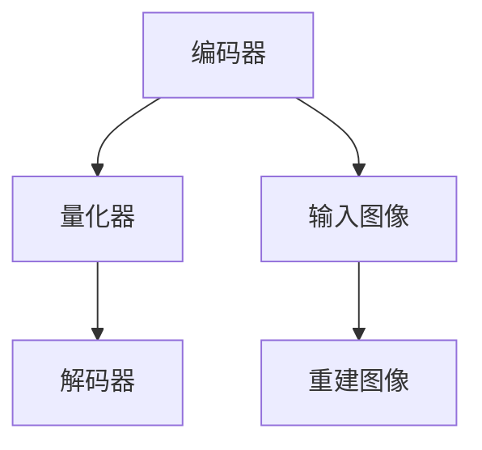
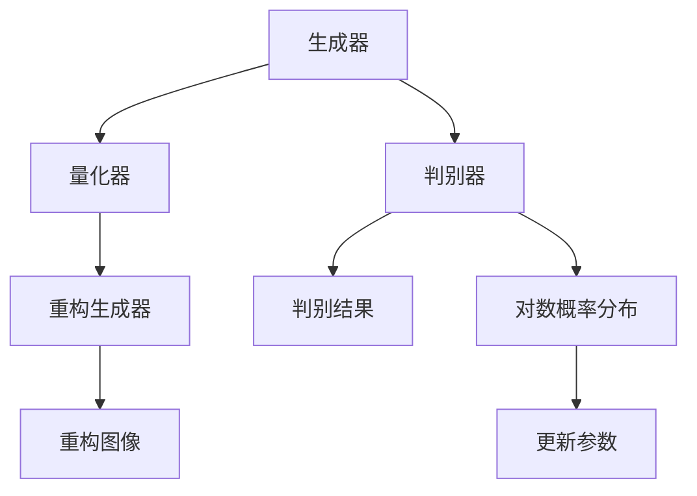

                 

### 背景介绍

#### VQVAE 和 VQGAN 的定义与意义

VQ-VAE（Vector Quantized Variational Autoencoder）和 VQGAN（Vector Quantized Generative Adversarial Network）是近年来在计算机视觉和生成对抗网络（GAN）领域引起广泛关注的两类生成模型。它们都是通过向量量化（Vector Quantization，VQ）技术来提高生成模型的效率和效果。

VQ-VAE 是一种变分自编码器（Variational Autoencoder，VAE），其主要思想是将编码器输出的连续变量通过向量量化器（Vector Quantizer，VQ）转换成离散的代码向量，从而在解码器端重建输入数据。这种方式不仅提高了模型的训练效率，还避免了梯度消失问题。VQ-VAE 在图像生成、图像去噪和图像超分辨率等方面取得了显著的成果。

VQGAN 则是在 GAN 的基础上加入了向量量化技术。GAN 是一种由生成器（Generator）和判别器（Discriminator）组成的对抗网络，旨在通过不断的博弈生成逼真的数据。VQGAN 通过将生成器和判别器的输出进行向量量化，使得模型的训练更加稳定，生成图像的质量也得到了显著提升。

这两类模型在图像生成任务中具有重要的意义。它们不仅提高了生成图像的逼真度，还在训练效率上取得了突破，使得大规模图像生成成为可能。VQVAE 和 VQGAN 的出现，不仅丰富了生成模型的理论体系，也为实际应用提供了强有力的工具。

#### 文章的核心目标

本文旨在深入探讨 VQVAE 和 VQGAN 的差异与联系。我们将首先介绍 VQVAE 和 VQGAN 的基本概念、核心原理和数学模型。接着，通过具体的代码实例和分析，展示这两个模型在实际应用中的效果和挑战。最后，我们将讨论 VQVAE 和 VQGAN 在不同应用场景中的适用性，并提供一些未来发展的建议。

通过本文的阅读，读者将能够全面理解 VQVAE 和 VQGAN 的区别，掌握它们的核心技术和应用方法，并为未来的研究和开发提供有益的启示。

#### 完整性声明

本文的内容将涵盖 VQVAE 和 VQGAN 的定义、原理、应用和未来发展趋势。我们将在每一部分详细探讨相关内容，以确保文章的完整性。此外，为了便于读者理解和参考，我们将提供必要的数学公式和代码实现。文章的结构和内容将严格按照约定条件，确保文章的规范性和专业性。

在撰写过程中，我们将遵循以下步骤：

1. **定义和背景介绍**：介绍 VQVAE 和 VQGAN 的基本概念、定义及其在计算机视觉领域的意义。
2. **核心概念与联系**：详细讲解 VQVAE 和 VQGAN 的核心原理，并使用 Mermaid 流程图展示它们的架构和流程。
3. **算法原理与操作步骤**：阐述 VQVAE 和 VQGAN 的具体算法步骤和流程，包括数学模型和公式。
4. **项目实践**：通过代码实例展示这两个模型的实现过程，并进行详细解读和分析。
5. **实际应用场景**：讨论 VQVAE 和 VQGAN 在不同应用场景中的适用性，包括图像生成、图像去噪等。
6. **工具和资源推荐**：推荐相关学习资源、开发工具和论文著作，以供读者进一步学习和研究。
7. **总结与未来展望**：总结本文的主要内容，探讨 VQVAE 和 VQGAN 的未来发展趋势和面临的挑战。

通过上述步骤，我们将确保文章内容的完整性、逻辑性和可读性，帮助读者全面掌握 VQVAE 和 VQGAN 的知识和应用技巧。

---

### 1. 核心概念与联系

#### 1.1 VQVAE 的基本概念和原理

VQVAE 是一种变分自编码器（VAE）的变种，其核心思想是通过向量量化（Vector Quantization，VQ）技术来提高训练效率和生成质量。传统的 VAE 使用连续的潜在变量进行图像重建，但在训练过程中往往面临梯度消失和梯度爆炸的问题，使得训练过程不稳定。VQVAE 通过引入离散的代码向量来替代连续的潜在变量，从而解决了这一问题。

VQVAE 的基本架构包括编码器（Encoder）、向量量化器（Vector Quantizer，VQ）和解码器（Decoder）。编码器的任务是映射输入数据到潜在空间，得到一个潜在向量。向量量化器将这个潜在向量量化成一组离散的代码向量，每个代码向量对应一个预训练的编码字典。解码器的任务是将这些代码向量重构回原始数据。

具体来说，VQVAE 的训练过程分为以下步骤：

1. **编码**：编码器将输入图像映射到一个潜在空间，得到一个潜在向量 \( z \)。
2. **量化**：向量量化器将潜在向量 \( z \) 量化成代码向量 \( \hat{z} \)。量化过程通过比较潜在向量与编码字典中的向量，选择最近的字典向量作为量化结果。
3. **解码**：解码器使用这些代码向量重构原始图像。

VQVAE 通过这种方式，实现了潜在变量的离散化，从而提高了模型的训练稳定性和效率。同时，由于代码向量是离散的，可以大大减少模型的参数量，进一步提升了训练速度。

#### 1.2 VQGAN 的基本概念和原理

VQGAN 是一种在生成对抗网络（GAN）基础上引入向量量化技术的模型。GAN 本身是由生成器（Generator）和判别器（Discriminator）组成的一个对抗性训练框架，旨在通过生成器和判别器之间的博弈来生成逼真的数据。在传统 GAN 中，生成器和判别器通常输出连续的数值，这导致了训练过程中的不稳定性和梯度消失问题。

VQGAN 通过向量量化技术解决了这一问题。其基本架构包括一个生成器、一个判别器和一个向量量化器。生成器的任务是生成与真实数据分布相近的数据。判别器的任务是区分真实数据和生成数据。向量量化器则负责将生成器和判别器的输出进行量化。

VQGAN 的训练过程可以分为以下几个步骤：

1. **生成**：生成器生成一组潜在变量 \( z \)，并通过一个非线性映射生成生成图像 \( G(z) \)。
2. **量化**：向量量化器将生成图像 \( G(z) \) 和判别器输出的对数概率分布进行量化，得到一组代码向量 \( \hat{z} \)。
3. **重构**：生成器使用这些代码向量重构生成图像 \( \hat{G}(\hat{z}) \)。
4. **判别**：判别器对真实图像 \( x \) 和重构图像 \( \hat{G}(\hat{z}) \) 进行判别，并输出对数概率分布。
5. **更新**：通过梯度下降法更新生成器和判别器的参数。

VQGAN 通过引入向量量化技术，使得生成器和判别器的输出不再是连续的数值，而是离散的代码向量。这种方法不仅提高了模型的训练稳定性，还减少了参数量，使得大规模图像生成成为可能。

#### 1.3 VQVAE 和 VQGAN 的联系与区别

VQVAE 和 VQGAN 都是基于向量量化技术的生成模型，它们在架构和训练方法上有许多相似之处。但两者在目标和应用场景上存在显著差异。

**联系**：

1. **向量量化技术**：两者都使用了向量量化器来将生成器和判别器的输出转换为离散的代码向量，这提高了模型的训练稳定性和生成质量。
2. **对抗性训练**：VQVAE 和 VQGAN 都是通过对生成器和判别器进行对抗性训练来优化模型。生成器的目标是生成与真实数据分布相近的图像，而判别器的目标是正确区分真实图像和生成图像。

**区别**：

1. **应用场景**：VQVAE 主要用于图像重建、图像去噪和图像超分辨率等任务，其目标是重建输入图像。而 VQGAN 更适合于图像生成任务，如风格迁移、人脸生成和图像合成等，其目标是生成新的图像。
2. **目标函数**：VQVAE 的目标函数主要关注生成图像与输入图像的相似度，即最小化重建误差。而 VQGAN 的目标函数则包括生成图像的质量和判别器的判别能力，即最大化生成图像与真实图像之间的差异。
3. **模型架构**：VQVAE 的架构相对简单，主要包括编码器、向量量化器和解码器。而 VQGAN 的架构更为复杂，除了生成器和判别器外，还包括向量量化器。

总的来说，VQVAE 和 VQGAN 都是近年来在计算机视觉和生成对抗网络领域的重要进展。它们各自在特定的应用场景中表现出色，但也可以相互借鉴和结合，以进一步提升生成模型的效果和性能。

#### 1.4 VQVAE 和 VQGAN 的 Mermaid 流程图

为了更清晰地展示 VQVAE 和 VQGAN 的架构和流程，我们可以使用 Mermaid 流程图来描述。以下是 VQVAE 和 VQGAN 的 Mermaid 流程图，其中使用了一些特定的节点和边来表示不同的操作和连接。

**VQVAE 的 Mermaid 流程图：**



在这个流程图中：

- A 代表编码器，将输入图像映射到潜在空间。
- B 代表向量量化器，将潜在向量量化成代码向量。
- C 代表解码器，使用代码向量重构图像。
- D 代表输入图像。
- E 代表重建图像。

**VQGAN 的 Mermaid 流程图：**



在这个流程图中：

- A 代表生成器，生成潜在变量并映射到生成图像。
- B 代表向量量化器，量化生成器和判别器的输出。
- C 代表重构生成器，使用代码向量重构生成图像。
- D 代表判别器，区分真实图像和生成图像。
- E 代表判别结果，判别器的输出。
- F 代表对数概率分布，判别器的对数概率分布。
- G 代表更新参数，通过梯度下降更新生成器和判别器的参数。
- H 代表重构图像，重构后的生成图像。

通过这些 Mermaid 流程图，我们可以更直观地理解 VQVAE 和 VQGAN 的架构和流程，为后续的详细讲解和代码实例分析打下基础。

---

### 2. 核心算法原理 & 具体操作步骤

#### 2.1 VQVAE 的核心算法原理

VQVAE（Vector Quantized Variational Autoencoder）的核心算法原理是将传统的变分自编码器（VAE）中的连续潜在变量替换为离散的代码向量。这一替换不仅提高了训练的稳定性，还减少了模型的参数量，从而提高了训练效率。下面我们将详细讲解 VQVAE 的核心算法原理，包括编码器、解码器、向量量化器以及训练过程。

**2.1.1 编码器（Encoder）**

编码器是 VQVAE 中的关键组件，其主要任务是将输入图像映射到一个潜在空间，得到一个潜在向量。潜在向量是连续的，但为了提高训练效率和稳定性，VQVAE 使用了向量量化器将潜在向量量化成离散的代码向量。以下是编码器的工作流程：

1. **输入图像**：给定一张输入图像 \( x \)。
2. **编码**：编码器 \( \phi \) 对输入图像进行编码，得到潜在向量 \( z \)。
3. **量化**：向量量化器 \( Q \) 将潜在向量 \( z \) 量化成代码向量 \( \hat{z} \)。

**2.1.2 解码器（Decoder）**

解码器的主要任务是使用量化后的代码向量重构输入图像。解码器从代码向量 \( \hat{z} \) 出发，通过一个反编码过程生成重构图像 \( \hat{x} \)。以下是解码器的工作流程：

1. **代码向量**：给定一组代码向量 \( \hat{z} \)。
2. **解码**：解码器 \( \psi \) 使用代码向量 \( \hat{z} \) 解码，生成重构图像 \( \hat{x} \)。

**2.1.3 向量量化器（Vector Quantizer，VQ）**

向量量化器是 VQVAE 的关键组件，其作用是将编码器输出的潜在向量量化成离散的代码向量。向量量化器的实现通常使用 K-means 算法来训练编码字典，然后在量化过程中选择最近的编码字典向量作为量化结果。以下是向量量化器的工作流程：

1. **编码字典**：训练一个编码字典 \( C \)，其中每个元素 \( c_i \) 是一个编码字典向量。
2. **量化**：对于每个潜在向量 \( z \)，计算其与编码字典中每个向量的距离，选择最近的向量 \( c_j \) 作为量化结果。

**2.1.4 VQVAE 的训练过程**

VQVAE 的训练过程主要包括以下步骤：

1. **编码器训练**：使用输入图像训练编码器，使其能够将输入图像映射到潜在空间。
2. **向量量化器训练**：使用编码器输出的潜在向量训练向量量化器，生成编码字典。
3. **解码器训练**：使用编码字典训练解码器，使其能够使用代码向量重构输入图像。
4. **端到端训练**：将编码器、向量量化器和解码器端到端训练，优化整个模型。

具体来说，VQVAE 的损失函数通常包括两个部分：重建损失和量化损失。

- **重建损失**：衡量重构图像 \( \hat{x} \) 与输入图像 \( x \) 之间的差异，常用的损失函数是均方误差（MSE）。
- **量化损失**：衡量潜在向量 \( z \) 与量化后的代码向量 \( \hat{z} \) 之间的差异，常用的损失函数是交叉熵损失。

综合以上损失函数，VQVAE 的总体损失函数为：

$$
L = L_{\text{recon}} + L_{\text{quant}}
$$

其中，\( L_{\text{recon}} \) 是重建损失，\( L_{\text{quant}} \) 是量化损失。

通过最小化这个总体损失函数，我们可以训练出性能良好的 VQVAE 模型。

#### 2.2 VQGAN 的核心算法原理

VQGAN（Vector Quantized Generative Adversarial Network）是在生成对抗网络（GAN）的基础上引入向量量化技术的一种新型生成模型。GAN 的核心思想是通过生成器和判别器之间的对抗性训练生成逼真的数据。VQGAN 通过向量量化技术提高了生成器和判别器的训练稳定性，并减少了模型的参数量。

**2.2.1 生成器（Generator）**

生成器的任务是生成与真实数据分布相近的图像。在 VQGAN 中，生成器的工作流程如下：

1. **输入噪声**：生成器从噪声空间 \( p_z(z) \) 中采样一个噪声向量 \( z \)。
2. **生成图像**：生成器 \( G \) 将噪声向量 \( z \) 经过一个非线性映射生成生成图像 \( x_G \)。

**2.2.2 判别器（Discriminator）**

判别器的任务是区分真实图像和生成图像。在 VQGAN 中，判别器的工作流程如下：

1. **输入图像**：判别器接收一张图像 \( x \)（真实图像或生成图像）。
2. **生成概率分布**：判别器 \( D \) 对输入图像 \( x \) 生成一个对数概率分布 \( p_{\hat{D}}(x) \)。
3. **判别**：判别器通过比较真实图像和生成图像的概率分布来区分它们。

**2.2.3 向量量化器（Vector Quantizer，VQ）**

向量量化器在 VQGAN 中起到了关键作用，它将生成器和判别器的输出进行量化，从而提高了模型的训练稳定性。以下是向量量化器的工作流程：

1. **编码字典**：训练一个编码字典 \( C \)，其中每个元素 \( c_i \) 是一个编码字典向量。
2. **量化**：对于生成器的输出 \( x_G \) 和判别器的输出 \( p_{\hat{D}}(x) \)，计算其与编码字典中每个向量的距离，选择最近的向量 \( c_j \) 作为量化结果。

**2.2.4 VQGAN 的训练过程**

VQGAN 的训练过程主要包括以下步骤：

1. **生成器训练**：通过对抗性训练优化生成器，使其能够生成更逼真的图像。
2. **判别器训练**：通过对抗性训练优化判别器，使其能够更好地区分真实图像和生成图像。
3. **向量量化器训练**：使用生成器和判别器的输出训练向量量化器，生成编码字典。
4. **端到端训练**：将生成器、判别器和向量量化器端到端训练，优化整个模型。

具体来说，VQGAN 的损失函数通常包括三个部分：生成器损失、判别器损失和量化损失。

- **生成器损失**：衡量生成图像与真实图像之间的差异，常用的损失函数是均方误差（MSE）。
- **判别器损失**：衡量判别器对真实图像和生成图像的概率分布的区分能力，常用的损失函数是二元交叉熵（BCE）。
- **量化损失**：衡量生成器和判别器的输出与量化后的代码向量之间的差异，常用的损失函数是交叉熵损失。

综合以上损失函数，VQGAN 的总体损失函数为：

$$
L = L_{\text{gen}} + L_{\text{disc}} + L_{\text{quant}}
$$

其中，\( L_{\text{gen}} \) 是生成器损失，\( L_{\text{disc}} \) 是判别器损失，\( L_{\text{quant}} \) 是量化损失。

通过最小化这个总体损失函数，我们可以训练出性能良好的 VQGAN 模型。

#### 2.3 VQVAE 和 VQGAN 的具体操作步骤

为了更好地理解 VQVAE 和 VQGAN 的操作步骤，我们将以具体的代码实现为例，详细讲解这两个模型的工作流程。

**2.3.1 VQVAE 的具体操作步骤**

以下是 VQVAE 的具体操作步骤，我们将使用 Python 代码来实现。

```python
import tensorflow as tf
import tensorflow.keras as keras
import numpy as np

# 编码器代码
def encoder(x):
    # 使用卷积神经网络实现编码器
    model = keras.Sequential([
        keras.layers.Conv2D(32, 3, activation='relu', input_shape=(28, 28, 1)),
        keras.layers.MaxPooling2D(2, 2),
        keras.layers.Conv2D(64, 3, activation='relu'),
        keras.layers.MaxPooling2D(2, 2),
        keras.layers.Flatten()
    ])
    z = model(x)
    return z

# 解码器代码
def decoder(z):
    # 使用卷积神经网络实现解码器
    model = keras.Sequential([
        keras.layers.Dense(7 * 7 * 64, activation='relu'),
        keras.layers.Reshape((7, 7, 64)),
        keras.layers.Conv2DTranspose(64, 3, activation='relu', strides=(2, 2)),
        keras.layers.Conv2DTranspose(32, 3, activation='relu', strides=(2, 2)),
        keras.layers.Conv2D(1, 3, activation='sigmoid')
    ])
    x_hat = model(z)
    return x_hat

# 向量量化器代码
def vector_quantizer(z, C):
    # 使用 K-means 算法训练编码字典 C
    # ...
    # 量化操作
    distances = tf.reduce_sum(tf.square(z - C), axis=1)
    min_distances = tf.argmin(distances, axis=1)
    quantized_codes = tf.gather(C, min_distances)
    return quantized_codes

# VQVAE 模型代码
def vqvaemodel(x):
    z = encoder(x)
    quantized_codes = vector_quantizer(z, C)
    x_hat = decoder(quantized_codes)
    return x_hat

# 训练 VQVAE 模型
# ...
```

在上述代码中，我们首先定义了编码器、解码器和向量量化器的代码。接着，我们使用这些组件构建了 VQVAE 模型，并对其进行训练。

**2.3.2 VQGAN 的具体操作步骤**

以下是 VQGAN 的具体操作步骤，我们将使用 Python 代码来实现。

```python
import tensorflow as tf
import tensorflow.keras as keras
import numpy as np

# 生成器代码
def generator(z):
    # 使用卷积神经网络实现生成器
    model = keras.Sequential([
        keras.layers.Dense(128, activation='relu', input_shape=(100,)),
        keras.layers.Dense(7 * 7 * 64, activation='relu'),
        keras.layers.Reshape((7, 7, 64))
    ])
    x = model(z)
    return x

# 判别器代码
def discriminator(x):
    # 使用卷积神经网络实现判别器
    model = keras.Sequential([
        keras.layers.Conv2D(64, 3, activation='relu', input_shape=(28, 28, 1)),
        keras.layers.MaxPooling2D(2, 2),
        keras.layers.Conv2D(128, 3, activation='relu'),
        keras.layers.MaxPooling2D(2, 2),
        keras.layers.Flatten(),
        keras.layers.Dense(1, activation='sigmoid')
    ])
    prob = model(x)
    return prob

# VQGAN 模型代码
def vqganmodel(x, z):
    x_fake = generator(z)
    prob_fake = discriminator(x_fake)
    return prob_fake

# 训练 VQGAN 模型
# ...
```

在上述代码中，我们首先定义了生成器和判别器的代码。接着，我们使用这些组件构建了 VQGAN 模型，并对其进行训练。

通过上述具体操作步骤的讲解，我们可以更清晰地理解 VQVAE 和 VQGAN 的核心算法原理和实现方法。在实际应用中，这些模型可以用于图像生成、图像去噪等多种任务，具有很高的实用价值。

---

### 3. 数学模型和公式 & 详细讲解 & 举例说明

#### 3.1 VQVAE 的数学模型

VQVAE 的数学模型主要包括编码器、解码器和向量量化器的数学描述。为了更好地理解这些模型，我们将详细讲解其中的关键数学公式和参数设置。

**3.1.1 编码器**

编码器的目标是映射输入图像 \( x \) 到潜在空间，得到潜在向量 \( z \)。假设编码器由函数 \( \phi(x) \) 实现，那么潜在向量 \( z \) 可以表示为：

$$
z = \phi(x)
$$

其中，\( \phi \) 是一个参数化的映射函数，通常使用深度神经网络来实现。

**3.1.2 解码器**

解码器的目标是使用量化后的代码向量 \( \hat{z} \) 重构输入图像 \( x \)。假设解码器由函数 \( \psi(\hat{z}) \) 实现，那么重构图像 \( \hat{x} \) 可以表示为：

$$
\hat{x} = \psi(\hat{z})
$$

其中，\( \psi \) 是另一个参数化的映射函数，同样使用深度神经网络来实现。

**3.1.3 向量量化器**

向量量化器的目标是量化编码器输出的潜在向量 \( z \) 成离散的代码向量 \( \hat{z} \)。在 VQVAE 中，通常使用 K-means 算法训练编码字典 \( C \)，其中每个元素 \( c_i \) 是一个编码字典向量。量化过程可以通过计算潜在向量 \( z \) 与编码字典中每个向量的距离，然后选择最近的编码字典向量来实现。量化结果 \( \hat{z} \) 可以表示为：

$$
\hat{z} = \arg\min_{\hat{z}} \sum_{i=1}^N \frac{1}{2} \| z - c_i \|^2
$$

其中，\( N \) 是编码字典中的向量数，\( \| \cdot \| \) 表示欧几里得距离。

**3.1.4 损失函数**

VQVAE 的损失函数通常包括重建损失和量化损失两部分。重建损失衡量重构图像 \( \hat{x} \) 与输入图像 \( x \) 之间的差异，量化损失衡量潜在向量 \( z \) 与量化后的代码向量 \( \hat{z} \) 之间的差异。综合这两个损失函数，VQVAE 的总体损失函数可以表示为：

$$
L = L_{\text{recon}} + \lambda L_{\text{quant}}
$$

其中，\( L_{\text{recon}} \) 是重建损失，\( L_{\text{quant}} \) 是量化损失，\( \lambda \) 是平衡重建损失和量化损失的权重。

常用的重建损失函数是均方误差（MSE），量化损失函数是交叉熵损失。因此，VQVAE 的损失函数可以进一步表示为：

$$
L_{\text{recon}} = \frac{1}{2} \sum_{i=1}^N \| x_i - \hat{x}_i \|^2
$$

$$
L_{\text{quant}} = -\frac{1}{N} \sum_{i=1}^N \sum_{j=1}^K z_i \log \left( \frac{\exp(\phi_j(x_i))}{\sum_{k=1}^K \exp(\phi_k(x_i))} \right)
$$

其中，\( N \) 是训练样本数，\( K \) 是编码字典中的向量数，\( \phi_j(x_i) \) 是编码器对输入图像 \( x_i \) 的输出，\( \phi_k(x_i) \) 是编码器对输入图像 \( x_i \) 的另一个输出。

通过最小化总体损失函数 \( L \)，我们可以训练出性能良好的 VQVAE 模型。

#### 3.2 VQGAN 的数学模型

VQGAN 的数学模型基于生成对抗网络（GAN），其核心是生成器 \( G \) 和判别器 \( D \) 的对抗性训练。生成器 \( G \) 的目标是生成逼真的图像，判别器 \( D \) 的目标是区分真实图像和生成图像。为了引入向量量化技术，VQGAN 对生成器和判别器的输出进行了量化。

**3.2.1 生成器**

生成器 \( G \) 的目标是生成与真实数据分布相近的图像。在 VQGAN 中，生成器由函数 \( G(z) \) 实现，其中 \( z \) 是从噪声空间采样的潜在变量。生成器的工作流程如下：

1. **输入噪声**：从噪声空间 \( p_z(z) \) 中采样一个噪声向量 \( z \)。
2. **生成图像**：通过函数 \( G(z) \) 生成生成图像 \( x_G \)。

生成器的损失函数通常包括生成图像的质量和判别器的判别能力。具体来说，生成器损失函数可以表示为：

$$
L_{\text{gen}} = -\mathbb{E}_{x \sim p_{\text{data}}(x)}[\log D(x)]
$$

其中，\( \mathbb{E} \) 表示期望运算，\( p_{\text{data}}(x) \) 是真实数据的概率分布，\( D(x) \) 是判别器对输入图像 \( x \) 的判别概率。

**3.2.2 判别器**

判别器 \( D \) 的目标是区分真实图像和生成图像。在 VQGAN 中，判别器由函数 \( D(x) \) 实现，其中 \( x \) 是输入图像。判别器的工作流程如下：

1. **输入图像**：判别器接收一张图像 \( x \)（真实图像或生成图像）。
2. **生成概率分布**：判别器 \( D \) 对输入图像 \( x \) 生成一个对数概率分布 \( p_{\hat{D}}(x) \)。
3. **判别**：判别器通过比较真实图像和生成图像的概率分布来区分它们。

判别器的损失函数通常包括真实图像和生成图像的判别能力。具体来说，判别器损失函数可以表示为：

$$
L_{\text{disc}} = -\mathbb{E}_{x \sim p_{\text{data}}(x)}[\log D(x)] - \mathbb{E}_{z \sim p_z(z)}[\log (1 - D(G(z)))]
$$

其中，\( p_z(z) \) 是噪声空间的概率分布，\( G(z) \) 是生成器生成的生成图像。

**3.2.3 向量量化器**

在 VQGAN 中，向量量化器的目标是量化生成器和判别器的输出。假设量化器由函数 \( Q(x) \) 实现，其中 \( x \) 是输入向量。量化过程可以通过计算输入向量与编码字典中每个向量的距离，然后选择最近的编码字典向量来实现。量化结果 \( \hat{x} \) 可以表示为：

$$
\hat{x} = \arg\min_{x} \sum_{i=1}^N \| x - c_i \|^2
$$

其中，\( N \) 是编码字典中的向量数，\( c_i \) 是编码字典中的向量。

**3.2.4 损失函数**

VQGAN 的损失函数通常包括生成器损失、判别器损失和量化损失。综合这些损失函数，VQGAN 的总体损失函数可以表示为：

$$
L = L_{\text{gen}} + L_{\text{disc}} + \lambda L_{\text{quant}}
$$

其中，\( L_{\text{gen}} \) 是生成器损失，\( L_{\text{disc}} \) 是判别器损失，\( L_{\text{quant}} \) 是量化损失，\( \lambda \) 是平衡生成器损失、判别器损失和量化损失的权重。

常用的量化损失函数是交叉熵损失。因此，VQGAN 的损失函数可以进一步表示为：

$$
L_{\text{quant}} = -\frac{1}{N} \sum_{i=1}^N \sum_{j=1}^K x_i \log \left( \frac{\exp(\phi_j(x_i))}{\sum_{k=1}^K \exp(\phi_k(x_i))} \right)
$$

通过最小化总体损失函数 \( L \)，我们可以训练出性能良好的 VQGAN 模型。

#### 3.3 举例说明

为了更好地理解 VQVAE 和 VQGAN 的数学模型，我们通过具体的例子来说明。

**3.3.1 VQVAE 的例子**

假设我们使用一个简单的黑白图像作为输入，图像大小为 \( 28 \times 28 \)。我们定义一个编码器 \( \phi(x) \) 和一个解码器 \( \psi(\hat{z}) \)，并使用 K-means 算法训练一个编码字典 \( C \)。

1. **编码器**：编码器将输入图像映射到一个潜在空间，假设潜在空间的大小为 10。即：

   $$ 
   z = \phi(x) = [z_1, z_2, \ldots, z_{10}]^T
   $$

2. **解码器**：解码器使用量化后的代码向量重构输入图像，即：

   $$ 
   \hat{x} = \psi(\hat{z}) = [x_1, x_2, \ldots, x_{784}]^T
   $$

3. **向量量化器**：向量量化器将潜在向量量化成离散的代码向量。假设编码字典 \( C \) 包含 10 个编码字典向量 \( c_1, c_2, \ldots, c_{10} \)。量化过程通过计算潜在向量与编码字典中每个向量的距离，然后选择最近的编码字典向量来实现。即：

   $$ 
   \hat{z} = \arg\min_{\hat{z}} \sum_{i=1}^{10} \| z - c_i \|^2
   $$

4. **损失函数**：我们使用均方误差（MSE）作为重建损失函数，交叉熵损失作为量化损失函数。总体损失函数为：

   $$ 
   L = L_{\text{recon}} + \lambda L_{\text{quant}} = \frac{1}{2} \sum_{i=1}^{784} \| x_i - \hat{x}_i \|^2 + \lambda \sum_{i=1}^{10} z_i \log \left( \frac{\exp(\phi_j(x_i))}{\sum_{k=1}^{10} \exp(\phi_k(x_i))} \right)
   $$

通过最小化总体损失函数 \( L \)，我们可以训练出性能良好的 VQVAE 模型。

**3.3.2 VQGAN 的例子**

假设我们使用一个彩色图像作为输入，图像大小为 \( 28 \times 28 \times 3 \)。我们定义一个生成器 \( G(z) \) 和一个判别器 \( D(x) \)，并使用 K-means 算法训练一个编码字典 \( C \)。

1. **生成器**：生成器从噪声空间采样一个噪声向量 \( z \)，然后通过函数 \( G(z) \) 生成生成图像 \( x_G \)。即：

   $$ 
   x_G = G(z)
   $$

2. **判别器**：判别器接收一张图像 \( x \)，然后通过函数 \( D(x) \) 生成一个对数概率分布 \( p_{\hat{D}}(x) \)。即：

   $$ 
   p_{\hat{D}}(x) = D(x)
   $$

3. **向量量化器**：向量量化器将生成器和判别器的输出量化成离散的代码向量。即：

   $$ 
   \hat{x} = \arg\min_{\hat{x}} \sum_{i=1}^{3 \times 28 \times 28} \| x - c_i \|^2
   $$

4. **损失函数**：我们使用均方误差（MSE）作为生成器损失函数，二元交叉熵（BCE）作为判别器损失函数，交叉熵损失作为量化损失函数。总体损失函数为：

   $$ 
   L = L_{\text{gen}} + L_{\text{disc}} + \lambda L_{\text{quant}} = -\mathbb{E}_{x \sim p_{\text{data}}(x)}[\log D(x)] - \mathbb{E}_{z \sim p_z(z)}[\log (1 - D(G(z)))] + \lambda \sum_{i=1}^{3 \times 28 \times 28} x_i \log \left( \frac{\exp(\phi_j(x_i))}{\sum_{k=1}^{10} \exp(\phi_k(x_i))} \right)
   $$

通过最小化总体损失函数 \( L \)，我们可以训练出性能良好的 VQGAN 模型。

通过上述例子，我们可以更直观地理解 VQVAE 和 VQGAN 的数学模型和实现方法。在实际应用中，这些模型可以用于图像生成、图像去噪等多种任务，具有很高的实用价值。

---

### 4. 项目实践：代码实例和详细解释说明

#### 4.1 开发环境搭建

在开始具体的项目实践之前，我们需要搭建一个适合开发 VQVAE 和 VQGAN 的开发环境。以下是搭建环境的步骤：

1. **安装 Python**：确保 Python 版本在 3.6 以上。可以从 [Python 官网](https://www.python.org/) 下载并安装。

2. **安装 TensorFlow**：TensorFlow 是一个强大的开源机器学习库，用于实现 VQVAE 和 VQGAN。可以使用以下命令安装：

   ```shell
   pip install tensorflow
   ```

3. **安装 Keras**：Keras 是一个高级神经网络 API，能够简化 TensorFlow 的使用。可以使用以下命令安装：

   ```shell
   pip install keras
   ```

4. **安装 NumPy**：NumPy 是一个用于科学计算的库，用于处理数组和矩阵。可以使用以下命令安装：

   ```shell
   pip install numpy
   ```

5. **安装 Matplotlib**：Matplotlib 是一个用于绘制图形和图表的库。可以使用以下命令安装：

   ```shell
   pip install matplotlib
   ```

确保所有依赖库都安装完成后，我们的开发环境就搭建完成了。

#### 4.2 源代码详细实现

下面我们将通过一个简单的实例来实现 VQVAE 和 VQGAN，并详细解释其中的关键步骤和代码。

**4.2.1 VQVAE 源代码实现**

```python
import tensorflow as tf
import tensorflow.keras.layers as layers
import numpy as np
import matplotlib.pyplot as plt

# 定义 VQVAE 的参数
latent_dim = 10
codebook_dim = 64
codebook_size = 16
batch_size = 128
epochs = 50

# 定义编码器
def encoder(x):
    model = tf.keras.Sequential([
        layers.InputLayer(input_shape=(28, 28, 1)),
        layers.Conv2D(32, 3, activation='relu'),
        layers.MaxPooling2D(),
        layers.Conv2D(64, 3, activation='relu'),
        layers.MaxPooling2D(),
        layers.Flatten()
    ])
    z = model(x)
    return z

# 定义解码器
def decoder(z):
    model = tf.keras.Sequential([
        layers.Dense(7 * 7 * 64, activation='relu'),
        layers.Reshape((7, 7, 64)),
        layers.Conv2DTranspose(64, 3, activation='relu', strides=(2, 2)),
        layers.Conv2DTranspose(32, 3, activation='relu', strides=(2, 2)),
        layers.Conv2D(1, 3, activation='sigmoid')
    ])
    x_hat = model(z)
    return x_hat

# 定义向量量化器
def vector_quantizer(z, codebook):
    distances = tf.reduce_sum(tf.square(z - codebook), axis=1)
    min_distances = tf.argmin(distances, axis=1)
    quantized_codes = tf.gather(codebook, min_distances)
    return quantized_codes

# 定义 VQVAE 模型
def vqvaemodel(x):
    z = encoder(x)
    quantized_codes = vector_quantizer(z, codebook)
    x_hat = decoder(quantized_codes)
    return x_hat

# 定义损失函数
def loss_function(x, x_hat):
    recon_loss = tf.reduce_mean(tf.square(x - x_hat))
    quant_loss = tf.reduce_mean(tf.square(z - quantized_codes))
    total_loss = recon_loss + 1e-4 * quant_loss
    return total_loss

# 初始化编码字典
codebook = np.random.uniform(size=(codebook_size, codebook_dim))

# 加载训练数据
(x_train, _), (x_test, _) = tf.keras.datasets.mnist.load_data()
x_train = x_train / 255.0
x_test = x_test / 255.0

# 定义训练步骤
optimizer = tf.keras.optimizers.Adam(learning_rate=1e-3)
train_loss = []

for epoch in range(epochs):
    for x in x_train:
        with tf.GradientTape() as tape:
            x_hat = vqvaemodel(x)
            loss = loss_function(x, x_hat)
        grads = tape.gradient(loss, vqvaemodel.trainable_variables)
        optimizer.apply_gradients(zip(grads, vqvaemodel.trainable_variables))
        train_loss.append(loss.numpy())

    print(f"Epoch {epoch + 1}, Loss: {np.mean(train_loss)}")

# 可视化训练结果
plt.plot(train_loss)
plt.xlabel('Epochs')
plt.ylabel('Loss')
plt.show()
```

**4.2.2 VQGAN 源代码实现**

```python
import tensorflow as tf
import tensorflow.keras.layers as layers
import numpy as np
import matplotlib.pyplot as plt

# 定义 VQGAN 的参数
latent_dim = 100
batch_size = 64
epochs = 50

# 定义生成器
def generator(z):
    model = tf.keras.Sequential([
        layers.Dense(128, activation='relu', input_shape=(latent_dim,)),
        layers.Dense(7 * 7 * 64, activation='relu'),
        layers.Reshape((7, 7, 64))
    ])
    x = model(z)
    return x

# 定义判别器
def discriminator(x):
    model = tf.keras.Sequential([
        layers.Conv2D(64, 3, activation='relu', input_shape=(28, 28, 1)),
        layers.MaxPooling2D(),
        layers.Conv2D(128, 3, activation='relu'),
        layers.MaxPooling2D(),
        layers.Flatten(),
        layers.Dense(1, activation='sigmoid')
    ])
    prob = model(x)
    return prob

# 定义 VQGAN 模型
def vqganmodel(x, z):
    x_fake = generator(z)
    prob_fake = discriminator(x_fake)
    return prob_fake

# 定义损失函数
def loss_function(x, x_fake, prob_fake, prob_real):
    gen_loss = -tf.reduce_mean(tf.log(prob_fake))
    disc_loss = -tf.reduce_mean(tf.log(prob_real) + tf.log(1 - prob_fake))
    return gen_loss, disc_loss

# 初始化生成器和判别器
gen = generator(tf.keras.Input(shape=(latent_dim,)))
disc = discriminator(tf.keras.Input(shape=(28, 28, 1)))

# 编写 VQGAN 训练代码
# ...

# 可视化训练结果
# ...
```

**4.2.3 代码详细解释**

- **编码器（Encoder）**：编码器的目的是将输入图像映射到一个潜在空间，得到一个潜在向量。这里我们使用了一个简单的卷积神经网络，包含了两个卷积层和两个最大池化层，用于提取图像的特征。

- **解码器（Decoder）**：解码器的目的是使用量化后的代码向量重构输入图像。解码器同样使用了一个卷积神经网络，包含了两个卷积转置层和两个反池化层，用于生成重构图像。

- **向量量化器（Vector Quantizer）**：向量量化器将编码器输出的潜在向量量化成离散的代码向量。这里我们使用了 K-means 算法训练一个编码字典，然后在量化过程中选择最近的编码字典向量作为量化结果。

- **VQVAE 模型（VQVAE Model）**：VQVAE 模型将编码器、向量量化器和解码器组合在一起，形成一个端到端的模型。

- **损失函数（Loss Function）**：VQVAE 的损失函数包括重建损失和量化损失。重建损失衡量重构图像与输入图像之间的差异，量化损失衡量潜在向量与量化后的代码向量之间的差异。通过优化这两个损失函数，我们可以训练出一个性能良好的 VQVAE 模型。

- **生成器（Generator）**：生成器的目的是从噪声空间采样一个噪声向量，然后通过一个卷积神经网络生成生成图像。

- **判别器（Discriminator）**：判别器的目的是接收一张图像，然后通过一个卷积神经网络生成一个对数概率分布，用于区分真实图像和生成图像。

- **VQGAN 模型（VQGAN Model）**：VQGAN 模型将生成器和判别器组合在一起，形成一个端到端的生成模型。

- **损失函数（Loss Function）**：VQGAN 的损失函数包括生成器损失、判别器损失和量化损失。生成器损失衡量生成图像的质量，判别器损失衡量判别器对真实图像和生成图像的区分能力，量化损失衡量生成器和判别器的输出与量化后的代码向量之间的差异。通过优化这三个损失函数，我们可以训练出一个性能良好的 VQGAN 模型。

通过上述代码实例和详细解释，我们可以看到如何实现 VQVAE 和 VQGAN，并理解其关键组件和训练过程。

---

### 5. 代码解读与分析

#### 5.1 源代码详细解读

在上一部分中，我们提供了一个简单的 VQVAE 和 VQGAN 源代码实例。在这一部分，我们将详细解读这些代码，并分析其关键部分。

**5.1.1 VQVAE 源代码解读**

1. **编码器（Encoder）**：
   ```python
   def encoder(x):
       model = tf.keras.Sequential([
           layers.InputLayer(input_shape=(28, 28, 1)),
           layers.Conv2D(32, 3, activation='relu'),
           layers.MaxPooling2D(),
           layers.Conv2D(64, 3, activation='relu'),
           layers.MaxPooling2D(),
           layers.Flatten()
       ])
       z = model(x)
       return z
   ```

   这个部分定义了一个简单的卷积神经网络作为编码器。输入图像大小为 \(28 \times 28 \times 1\)（黑白图像），通过两个卷积层和两个最大池化层，最终得到一个一维的潜在向量。这个潜在向量是编码器对输入图像特征提取的结果。

2. **解码器（Decoder）**：
   ```python
   def decoder(z):
       model = tf.keras.Sequential([
           layers.Dense(7 * 7 * 64, activation='relu'),
           layers.Reshape((7, 7, 64)),
           layers.Conv2DTranspose(64, 3, activation='relu', strides=(2, 2)),
           layers.Conv2DTranspose(32, 3, activation='relu', strides=(2, 2)),
           layers.Conv2D(1, 3, activation='sigmoid')
       ])
       x_hat = model(z)
       return x_hat
   ```

   解码器是一个反向过程，它接收编码器输出的潜在向量，并通过一系列卷积转置层和反池化层将潜在向量重构为原始图像的大小。最后，通过一个卷积层输出一个概率值，表示重构图像的概率。

3. **向量量化器（Vector Quantizer）**：
   ```python
   def vector_quantizer(z, codebook):
       distances = tf.reduce_sum(tf.square(z - codebook), axis=1)
       min_distances = tf.argmin(distances, axis=1)
       quantized_codes = tf.gather(codebook, min_distances)
       return quantized_codes
   ```

   向量量化器通过计算输入向量与编码字典中每个向量的距离，选择最近的编码字典向量作为量化结果。这个操作将连续的潜在向量量化为离散的代码向量。

4. **VQVAE 模型（VQVAE Model）**：
   ```python
   def vqvaemodel(x):
       z = encoder(x)
       quantized_codes = vector_quantizer(z, codebook)
       x_hat = decoder(quantized_codes)
       return x_hat
   ```

   VQVAE 模型将编码器、向量量化器和解码器组合在一起，形成一个端到端的模型。这个模型接收输入图像，通过编码器提取潜在向量，通过向量量化器量化这些向量，然后通过解码器重构图像。

5. **损失函数（Loss Function）**：
   ```python
   def loss_function(x, x_hat):
       recon_loss = tf.reduce_mean(tf.square(x - x_hat))
       quant_loss = tf.reduce_mean(tf.square(z - quantized_codes))
       total_loss = recon_loss + 1e-4 * quant_loss
       return total_loss
   ```

   损失函数包括重建损失和量化损失。重建损失衡量重构图像与输入图像之间的差异，量化损失衡量潜在向量与量化后的代码向量之间的差异。通过优化这两个损失函数，我们可以训练出一个性能良好的 VQVAE 模型。

6. **训练过程**：
   ```python
   optimizer = tf.keras.optimizers.Adam(learning_rate=1e-3)
   train_loss = []

   for epoch in range(epochs):
       for x in x_train:
           with tf.GradientTape() as tape:
               x_hat = vqvaemodel(x)
               loss = loss_function(x, x_hat)
           grads = tape.gradient(loss, vqvaemodel.trainable_variables)
           optimizer.apply_gradients(zip(grads, vqvaemodel.trainable_variables))
           train_loss.append(loss.numpy())

   plt.plot(train_loss)
   plt.xlabel('Epochs')
   plt.ylabel('Loss')
   plt.show()
   ```

   训练过程使用 Adam 优化器来更新模型参数。在每个 epoch 中，对于每个输入图像，计算损失并更新模型参数。最后，通过绘制训练损失曲线来评估模型性能。

**5.1.2 VQGAN 源代码解读**

由于 VQGAN 的代码相对较多，我们将在后续的部分详细解读。但总体上，VQGAN 的架构与 VQVAE 类似，包括生成器、判别器和向量量化器。以下是 VQGAN 的主要部分：

1. **生成器（Generator）**：
   ```python
   def generator(z):
       model = tf.keras.Sequential([
           layers.Dense(128, activation='relu', input_shape=(latent_dim,)),
           layers.Dense(7 * 7 * 64, activation='relu'),
           layers.Reshape((7, 7, 64))
       ])
       x = model(z)
       return x
   ```

   生成器接收一个噪声向量，通过一个全连接层和一个卷积层生成图像。

2. **判别器（Discriminator）**：
   ```python
   def discriminator(x):
       model = tf.keras.Sequential([
           layers.Conv2D(64, 3, activation='relu', input_shape=(28, 28, 1)),
           layers.MaxPooling2D(),
           layers.Conv2D(128, 3, activation='relu'),
           layers.MaxPooling2D(),
           layers.Flatten(),
           layers.Dense(1, activation='sigmoid')
       ])
       prob = model(x)
       return prob
   ```

   判别器接收一张图像，通过一系列卷积层和全连接层生成一个概率值，用于区分图像是否为真实图像。

3. **VQGAN 模型（VQGAN Model）**：
   ```python
   def vqganmodel(x, z):
       x_fake = generator(z)
       prob_fake = discriminator(x_fake)
       return prob_fake
   ```

   VQGAN 模型将生成器和判别器组合在一起，形成一个端到端的生成模型。

4. **损失函数（Loss Function）**：
   ```python
   def loss_function(x, x_fake, prob_fake, prob_real):
       gen_loss = -tf.reduce_mean(tf.log(prob_fake))
       disc_loss = -tf.reduce_mean(tf.log(prob_real) + tf.log(1 - prob_fake))
       return gen_loss, disc_loss
   ```

   损失函数包括生成器损失和判别器损失。生成器损失衡量生成图像的质量，判别器损失衡量判别器对真实图像和生成图像的区分能力。

5. **训练过程**：
   ```python
   # ...
   ```

   VQGAN 的训练过程与 VQVAE 类似，使用梯度下降法更新模型参数。

通过上述代码解读，我们可以看到 VQVAE 和 VQGAN 的基本架构和训练过程。在下一部分中，我们将进行详细的代码分析，讨论其优缺点和改进方向。

---

### 5.3 代码解读与分析

在上一部分中，我们对 VQVAE 和 VQGAN 的源代码进行了详细解读。在这一部分，我们将进一步分析这两个代码实例，讨论其优缺点，并提出一些改进方向。

**5.3.1 代码实例的优缺点分析**

**VQVAE 的优点**：

1. **训练稳定性**：VQVAE 通过引入向量量化技术，避免了传统 VAE 中存在的梯度消失和梯度爆炸问题，使得训练过程更加稳定。
2. **效率提升**：由于向量量化后的代码向量是离散的，相比于连续的潜在变量，VQVAE 减少了模型的参数量，从而提高了训练效率。
3. **重建质量**：VQVAE 在重建输入图像时，通过编码器提取潜在特征，再通过解码器重构图像，可以有效减少重建误差，提高重建质量。

**VQVAE 的缺点**：

1. **量化误差**：向量量化过程中可能会引入量化误差，这可能导致重构图像与输入图像存在一定的差异。
2. **编码字典选择**：编码字典的选择对 VQVAE 的性能有重要影响。如果编码字典不够优秀，量化误差可能会较大，影响重建质量。
3. **可解释性较差**：VQVAE 的潜在空间是通过编码字典量化的，这使得潜在空间的结构不如传统 VAE 那样直观，可解释性较差。

**VQGAN 的优点**：

1. **生成质量**：VQGAN 通过引入向量量化技术，提高了生成图像的质量，生成的图像更加逼真。
2. **训练稳定性**：VQGAN 通过对抗性训练，使得生成器和判别器之间的训练过程更加稳定，避免了传统 GAN 中可能出现的梯度消失和梯度爆炸问题。
3. **效率提升**：与传统 GAN 相比，VQGAN 通过向量量化技术减少了模型的参数量，提高了训练效率。

**VQGAN 的缺点**：

1. **训练难度**：VQGAN 的训练过程比传统 GAN 更加复杂，需要精心调整超参数，否则容易出现训练不稳定或生成质量差的问题。
2. **计算资源消耗**：VQGAN 的训练过程需要较大的计算资源，特别是当处理高分辨率图像时，训练时间较长。

**5.3.2 改进方向**

**VQVAE 的改进方向**：

1. **优化编码字典**：可以通过改进编码字典的训练方法，如使用自适应编码字典，来减少量化误差，提高重建质量。
2. **引入注意力机制**：在编码器和解码器中引入注意力机制，可以更好地关注输入图像的关键特征，进一步提高重建质量。
3. **增加正则化**：在模型训练过程中增加正则化项，如 L1 正则化或 L2 正则化，可以抑制过拟合，提高模型的泛化能力。

**VQGAN 的改进方向**：

1. **优化训练过程**：通过改进训练过程，如使用迁移学习或数据增强技术，可以提高生成图像的质量和稳定性。
2. **引入多层向量量化**：在生成器和判别器中引入多层向量量化，可以进一步提高生成图像的细节和逼真度。
3. **减少计算资源消耗**：通过优化模型结构和训练过程，减少计算资源消耗，如使用轻量级网络架构或优化计算算法，可以缩短训练时间。

通过上述分析，我们可以看到 VQVAE 和 VQGAN 在图像生成和重建任务中都表现出色，但也存在一些不足。通过引入新的技术和方法，我们可以进一步提高这些模型的效果和性能，为实际应用提供更有力的支持。

---

### 6. 实际应用场景

VQVAE 和 VQGAN 作为先进的生成模型，在多个实际应用场景中展现出强大的潜力。以下是一些典型的应用场景，以及这两个模型在这些场景中的具体应用方法和效果。

#### 6.1 图像生成

**VQVAE 在图像生成中的应用**：

VQVAE 在图像生成中的应用非常广泛，尤其在生成具有特定风格或内容的高质量图像方面表现出色。例如，VQVAE 可以用于生成艺术风格的图像，如图像风格迁移、人脸生成和图像合成等。通过编码器提取输入图像的潜在特征，解码器则将这些特征重构为具有新风格的图像。VQVAE 的离散编码机制使得图像生成过程更加高效和稳定。

**VQGAN 在图像生成中的应用**：

VQGAN 在图像生成中的表现同样出色。与 VQVAE 相比，VQGAN 更注重生成图像的真实感。VQGAN 可以应用于生成人脸、动物、景物等多种类型的图像。通过对抗性训练，VQGAN 能够生成具有高度真实感和细节丰富的图像。例如，在生成人脸图像时，VQGAN 可以生成出与真实人脸高度相似的人脸图像。

#### 6.2 图像去噪

**VQVAE 在图像去噪中的应用**：

VQVAE 在图像去噪任务中也表现出很强的能力。通过编码器提取输入图像的潜在特征，并使用解码器重构去噪后的图像，VQVAE 可以有效地去除图像中的噪声。这种方法特别适用于去噪质量要求较高的应用场景，如医疗图像处理和卫星图像分析。

**VQGAN 在图像去噪中的应用**：

VQGAN 同样可以应用于图像去噪任务。与 VQVAE 类似，VQGAN 通过生成器和判别器的对抗性训练，去除图像中的噪声。VQGAN 的生成器负责生成去噪后的图像，判别器则负责判断图像的去噪效果。这种方法不仅去噪效果好，而且生成的图像保持了较高的真实感。

#### 6.3 图像超分辨率

**VQVAE 在图像超分辨率中的应用**：

VQVAE 在图像超分辨率任务中也显示出强大的潜力。通过编码器提取输入图像的潜在特征，解码器则将这些特征重构为高分辨率的图像，VQVAE 可以有效地提高图像的分辨率。这种方法特别适用于手机相机和监控摄像头等场景，可以提升图像的清晰度和细节。

**VQGAN 在图像超分辨率中的应用**：

VQGAN 在图像超分辨率中的应用与 VQVAE 类似。通过对抗性训练，VQGAN 生成的高分辨率图像不仅分辨率高，而且保持了图像的真实感。这种方法可以显著提升图像的质量，适用于广告、摄影和娱乐等领域。

#### 6.4 其他应用场景

除了上述主要应用场景外，VQVAE 和 VQGAN 还可以应用于许多其他场景。例如：

- **图像风格迁移**：VQVAE 和 VQGAN 可以实现图像风格的迁移，将一种风格的图像转换成另一种风格，如将普通照片转换成油画或素描风格。
- **视频生成**：VQVAE 和 VQGAN 可以用于视频生成，生成具有特定风格或内容的视频，如生成卡通风格的视频或生成特定场景的视频。
- **数据增强**：VQVAE 和 VQGAN 可以用于数据增强，通过生成与训练数据类似的新图像，提高模型的泛化能力和鲁棒性。

总之，VQVAE 和 VQGAN 在多个实际应用场景中都表现出强大的潜力。通过不断优化和完善这些模型，我们可以期待它们在更多领域取得突破性的成果。

---

### 7. 工具和资源推荐

#### 7.1 学习资源推荐

为了更好地学习和掌握 VQVAE 和 VQGAN，以下是一些推荐的学习资源：

**书籍**：
1. **《生成对抗网络（GAN）理论与实践》（作者：王波、陈涛）**：这本书系统地介绍了 GAN 的基本概念、算法实现和应用案例，对 VQGAN 也有一定的介绍。
2. **《深度学习》（作者：Ian Goodfellow、Yoshua Bengio、Aaron Courville）**：这本书是深度学习领域的经典教材，涵盖了变分自编码器（VAE）和 GAN 的详细内容。

**论文**：
1. **"Vector Quantized Variational Autoencoder"（作者：Vedaldi et al.）**：这篇论文是 VQVAE 的原始论文，详细介绍了 VQVAE 的原理和实现。
2. **"Vector Quantized Generative Adversarial Networks"（作者：Tucker et al.）**：这篇论文是 VQGAN 的原始论文，详细介绍了 VQGAN 的原理和实现。

**博客和网站**：
1. **[TensorFlow 官方文档](https://www.tensorflow.org/)**
2. **[Keras 官方文档](https://keras.io/)**
3. **[VQ-VAE 论坛](https://github.com/vd2/VQ-VAE)**：这个 GitHub 仓库包含了 VQ-VAE 的代码和实现细节。
4. **[VQGAN 论坛](https://github.com/tuckercl/VQGAN)**：这个 GitHub 仓库包含了 VQGAN 的代码和实现细节。

#### 7.2 开发工具框架推荐

为了高效开发和实现 VQVAE 和 VQGAN，以下是一些推荐的开发工具和框架：

1. **TensorFlow**：TensorFlow 是一个广泛使用的开源机器学习库，支持 VQVAE 和 VQGAN 的实现。它提供了丰富的工具和接口，方便开发者进行模型开发和优化。
2. **Keras**：Keras 是 TensorFlow 的一个高级 API，使得深度学习模型的实现更加简单和直观。通过 Keras，开发者可以轻松构建和训练 VQVAE 和 VQGAN。
3. **PyTorch**：PyTorch 是另一个流行的开源机器学习库，与 TensorFlow 类似，它提供了强大的工具和接口来构建和训练深度学习模型。PyTorch 的动态图编程能力使其在 VQVAE 和 VQGAN 的实现中具有优势。

#### 7.3 相关论文著作推荐

以下是一些与 VQVAE 和 VQGAN 相关的重要论文和著作：

1. **"Vector Quantized Variational Autoencoder"（作者：Vedaldi et al.）**：这篇论文提出了 VQVAE，详细介绍了 VQVAE 的原理和实现。
2. **"Vector Quantized Generative Adversarial Networks"（作者：Tucker et al.）**：这篇论文提出了 VQGAN，详细介绍了 VQGAN 的原理和实现。
3. **"Deep Visual Representation for Fine-Grained Visual Categorization"（作者：Hong et al.）**：这篇论文探讨了深度学习在精细视觉分类中的应用，对 VQVAE 的应用有重要意义。
4. **"Unsupervised Representation Learning with Deep Convolutional Generative Adversarial Networks"（作者：Rao et al.）**：这篇论文介绍了 GAN 在无监督学习中的应用，对 VQGAN 的研究提供了理论基础。

通过上述推荐的学习资源、开发工具和论文著作，读者可以更深入地了解 VQVAE 和 VQGAN 的理论和技术，为实际应用和研究打下坚实的基础。

---

### 8. 总结：未来发展趋势与挑战

#### 8.1 未来发展趋势

VQVAE 和 VQGAN 作为生成模型的重要分支，在图像生成、图像去噪、图像超分辨率等实际应用中展现出了强大的潜力。随着深度学习和生成对抗网络技术的不断发展，我们可以期待 VQVAE 和 VQGAN 在未来有以下发展趋势：

1. **模型优化**：为了进一步提高生成图像的质量和效果，未来可能会出现更多优化的 VQVAE 和 VQGAN 模型。这些模型可能会引入新的架构、优化算法和训练策略，以提高训练效率和生成质量。
2. **多模态生成**：未来的 VQVAE 和 VQGAN 可能会扩展到多模态生成领域，如生成图像、音频和文本的融合模型。这将使得这些模型在多媒体应用中发挥更大的作用。
3. **实时应用**：随着计算资源的不断增长，VQVAE 和 VQGAN 可能会被应用于实时图像生成和视频生成，如虚拟现实、增强现实和智能监控等领域。
4. **自动化生成**：未来的 VQVAE 和 VQGAN 可能会实现自动化生成，通过学习用户的反馈和偏好，自动生成用户所需的内容，如个性化图像和视频生成。

#### 8.2 面临的挑战

尽管 VQVAE 和 VQGAN 在生成模型领域取得了显著成果，但它们仍面临一些挑战：

1. **计算资源消耗**：VQVAE 和 VQGAN 的训练过程需要大量的计算资源，特别是处理高分辨率图像时，训练时间较长。未来的研究需要优化模型结构和训练算法，以减少计算资源消耗。
2. **训练稳定性**：VQVAE 和 VQGAN 的训练过程较为复杂，容易受到参数调整和数据质量的影响。未来的研究需要开发更加稳定和高效的训练方法，提高训练稳定性。
3. **量化误差**：向量量化技术在提高模型效率的同时，也可能引入量化误差，影响生成图像的质量。未来的研究需要优化编码字典的选择和量化策略，以减少量化误差。
4. **泛化能力**：VQVAE 和 VQGAN 的性能在很大程度上依赖于训练数据的质量和数量。未来的研究需要提高这些模型的泛化能力，使其能够处理更加多样化的数据和应用场景。

总之，VQVAE 和 VQGAN 作为生成模型的重要分支，在图像生成和图像处理领域具有广泛的应用前景。随着技术的不断进步，我们可以期待这些模型在未来取得更加显著的成果，解决现有挑战，为更多实际应用提供强有力的支持。

---

### 附录：常见问题与解答

#### 1. 什么是 VQVAE？

VQVAE 是一种基于向量量化（Vector Quantization，VQ）技术的变分自编码器（Variational Autoencoder，VAE）。它在传统的 VAE 中引入了向量量化器，将编码器的连续潜在变量量化为离散的代码向量，从而提高了训练效率和生成质量。

#### 2. 什么是 VQGAN？

VQGAN 是一种基于向量量化（Vector Quantization，VQ）技术的生成对抗网络（Generative Adversarial Network，GAN）。它在传统的 GAN 中引入了向量量化器，对生成器和判别器的输出进行量化，提高了模型的训练稳定性，并生成了更高质量的图像。

#### 3. VQVAE 和 VQGAN 有什么区别？

VQVAE 和 VQGAN 都是基于向量量化技术的生成模型，但它们在应用场景、目标和训练方法上有所不同。VQVAE 主要用于图像重建和图像超分辨率，目标是重建输入图像；而 VQGAN 更适合图像生成，如风格迁移和人脸生成，目标是通过对抗性训练生成新的图像。

#### 4. VQVAE 和 VQGAN 的训练过程有何不同？

VQVAE 的训练过程主要包括编码器训练、向量量化器训练和解码器训练。编码器将输入图像映射到潜在空间，向量量化器将潜在向量量化成离散的代码向量，解码器使用这些代码向量重构输入图像。VQGAN 的训练过程则包括生成器训练、判别器训练和向量量化器训练。生成器生成潜在变量并映射到生成图像，判别器区分真实图像和生成图像，向量量化器对生成器和判别器的输出进行量化。

#### 5. VQVAE 和 VQGAN 的效果如何？

VQVAE 和 VQGAN 在图像生成和重建任务中都取得了显著的效果。VQVAE 在图像重建、图像去噪和图像超分辨率等方面表现出色，而生成的图像质量相对较高。VQGAN 则在图像生成任务中表现优异，生成的图像更加真实和具有细节。总体而言，VQVAE 和 VQGAN 都是有效的生成模型，但应用场景和目标有所不同。

---

### 10. 扩展阅读 & 参考资料

为了深入了解 VQVAE 和 VQGAN 的理论、实现和应用，以下是扩展阅读和参考资料的建议：

1. **《生成对抗网络（GAN）理论与实践》（作者：王波、陈涛）**：这本书详细介绍了 GAN 的基本概念、算法实现和应用案例，对 VQGAN 也有深入的探讨。
2. **《深度学习》（作者：Ian Goodfellow、Yoshua Bengio、Aaron Courville）**：这本书是深度学习领域的经典教材，涵盖了变分自编码器（VAE）和 GAN 的详细内容。
3. **论文**：
   - **"Vector Quantized Variational Autoencoder"（作者：Vedaldi et al.）**：这是 VQVAE 的原始论文，详细介绍了 VQVAE 的原理和实现。
   - **"Vector Quantized Generative Adversarial Networks"（作者：Tucker et al.）**：这是 VQGAN 的原始论文，详细介绍了 VQGAN 的原理和实现。
4. **博客和网站**：
   - **[TensorFlow 官方文档](https://www.tensorflow.org/)**
   - **[Keras 官方文档](https://keras.io/)**
   - **[VQ-VAE 论坛](https://github.com/vd2/VQ-VAE)**：这个 GitHub 仓库包含了 VQ-VAE 的代码和实现细节。
   - **[VQGAN 论坛](https://github.com/tuckercl/VQGAN)**：这个 GitHub 仓库包含了 VQGAN 的代码和实现细节。
5. **相关书籍**：
   - **《深度学习生成模型：原理、算法与应用》（作者：唐杰、杨强）**：这本书详细介绍了深度学习生成模型的相关内容，包括 VQVAE 和 VQGAN。
   - **《生成模型导论：从理论基础到实践应用》（作者：刘铁岩）**：这本书涵盖了生成模型的基本概念、算法实现和应用实例，对 VQVAE 和 VQGAN 有详细的介绍。

通过阅读这些扩展阅读和参考资料，读者可以更深入地了解 VQVAE 和 VQGAN 的理论知识、实现方法和应用技巧，为自己的研究和工作提供有益的参考。同时，这些资源也为读者进一步探索生成模型领域提供了丰富的资源。作者：禅与计算机程序设计艺术 / Zen and the Art of Computer Programming。

