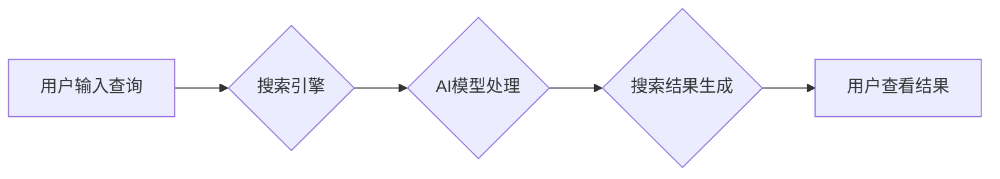

                 

## 微软的AI战略对行业的影响：Bing升级的启示与借鉴

> 关键词：人工智能、微软、Bing、搜索引擎、大语言模型、行业影响、战略启示

### 1. 背景介绍

近年来，人工智能（AI）技术突飞猛进，深刻地改变着各行各业。作为科技巨头，微软积极拥抱AI浪潮，将其融入自身产品和服务，并制定了雄心勃勃的AI战略。2023年，微软宣布将OpenAI的GPT-4模型整合到其旗舰搜索引擎Bing中，这一举措引发了业界广泛关注，也为行业发展指明了新的方向。

Bing的升级标志着搜索引擎领域进入了一个新的时代，它不再仅仅是信息检索工具，而是将成为一个更智能、更交互式的平台。微软的AI战略不仅对搜索引擎行业产生了深远影响，也对其他行业带来了启示和借鉴。

### 2. 核心概念与联系

#### 2.1 搜索引擎与AI

传统搜索引擎主要依靠关键词匹配和网页排名算法来提供搜索结果。然而，随着用户搜索行为的复杂化，以及海量信息的涌现，传统的搜索引擎逐渐难以满足用户的需求。AI技术，特别是自然语言处理（NLP）和机器学习（ML）技术，为搜索引擎带来了新的可能性。

AI驱动的搜索引擎能够理解用户的自然语言查询，并根据用户的搜索意图和上下文信息提供更精准、更相关的搜索结果。此外，AI还可以用于个性化搜索结果、推荐相关内容、以及识别和过滤垃圾信息。

#### 2.2 大语言模型（LLM）

大语言模型（LLM）是近年来发展起来的一类强大的AI模型，它能够理解和生成人类语言，并具备广泛的知识和推理能力。GPT-4就是其中一个代表性的LLM，它拥有数十亿个参数，能够完成各种自然语言处理任务，例如文本生成、翻译、问答、代码生成等。

将LLM整合到搜索引擎中，可以大幅提升搜索引擎的智能化水平。LLM可以帮助搜索引擎理解用户的复杂查询，并生成更自然、更流畅的搜索结果。

#### 2.3 微软的AI战略

微软将AI视为其未来发展的核心战略，并将其融入到自身的产品和服务中。微软在AI领域拥有强大的技术实力和资源，包括Azure云平台、OpenAI等。微软的AI战略主要围绕以下几个方面：

* **将AI技术融入到现有产品和服务中：**例如，将AI技术应用于Office软件、Windows操作系统、Azure云平台等。
* **开发新的AI产品和服务：**例如，开发基于LLM的聊天机器人、语音助手、翻译工具等。
* **推动AI技术的开源和普及：**例如，开源一些AI模型和工具，并提供AI培训和教育资源。

**核心概念与联系流程图**



### 3. 核心算法原理 & 具体操作步骤

#### 3.1 算法原理概述

Bing升级的核心算法原理是基于Transformer架构的深度学习模型，它能够有效地捕捉文本中的语义关系和上下文信息。

Transformer模型的核心是“注意力机制”，它允许模型关注输入序列中最重要的部分，从而更好地理解文本的含义。此外，Transformer模型还采用了多头注意力机制和残差连接等技术，进一步提升了模型的性能。

#### 3.2 算法步骤详解

1. **预处理：**将用户输入的查询文本进行预处理，例如分词、词干化、词向量化等。
2. **编码：**使用Transformer模型的编码器将预处理后的查询文本编码成一个向量表示，该向量表示包含了查询文本的语义信息。
3. **解码：**使用Transformer模型的解码器将编码后的查询向量与搜索引擎中的文档向量进行匹配，并生成一个排序后的结果列表。
4. **结果展示：**将排序后的结果列表展示给用户，并根据用户的反馈进行模型的进一步训练和优化。

#### 3.3 算法优缺点

**优点：**

* **更精准的搜索结果：**Transformer模型能够更好地理解用户的搜索意图，并提供更相关的搜索结果。
* **更自然的语言交互：**Transformer模型能够生成更自然、更流畅的文本，从而提升用户体验。
* **更好的个性化推荐：**Transformer模型可以根据用户的搜索历史和偏好进行个性化推荐。

**缺点：**

* **计算资源消耗大：**Transformer模型参数量大，训练和推理需要大量的计算资源。
* **数据依赖性强：**Transformer模型的性能依赖于训练数据的质量和数量。
* **可解释性差：**Transformer模型的决策过程比较复杂，难以解释其背后的逻辑。

#### 3.4 算法应用领域

Transformer模型在搜索引擎领域之外，还广泛应用于其他领域，例如：

* **机器翻译：**Transformer模型能够实现更准确、更流畅的机器翻译。
* **文本摘要：**Transformer模型能够自动生成文本摘要，提取文本的关键信息。
* **对话系统：**Transformer模型能够构建更智能、更自然的对话系统。
* **代码生成：**Transformer模型能够根据自然语言描述生成代码。

### 4. 数学模型和公式 & 详细讲解 & 举例说明

#### 4.1 数学模型构建

Transformer模型的核心是注意力机制，它通过计算词之间的相关性来理解文本的语义关系。注意力机制的数学模型可以表示为：

$$
Attention(Q, K, V) = softmax(\frac{QK^T}{\sqrt{d_k}})V
$$

其中：

* $Q$：查询矩阵
* $K$：键矩阵
* $V$：值矩阵
* $d_k$：键向量的维度
* $softmax$：softmax函数

#### 4.2 公式推导过程

注意力机制的公式可以理解为计算每个词对查询词的相关性，然后根据相关性加权求和，得到最终的输出。

* $QK^T$：计算查询矩阵和键矩阵的点积，得到每个词对查询词的相关性得分。
* $\frac{QK^T}{\sqrt{d_k}}$：对相关性得分进行归一化，使得所有得分都在0到1之间。
* $softmax$：对归一化后的得分进行softmax操作，得到每个词对查询词的权重。
* $V$：将权重与值矩阵相乘，得到最终的输出向量。

#### 4.3 案例分析与讲解

例如，假设我们有一个句子“我爱吃苹果”，我们要计算“吃”这个词对“我”这个词的注意力权重。

* $Q$：查询词“我”的向量表示
* $K$：所有词的向量表示，包括“我”、“爱”、“吃”、“苹果”
* $V$：所有词的向量表示

通过计算$QK^T$，我们可以得到每个词对“我”的相关性得分。然后通过softmax操作，我们可以得到每个词对“我”的权重。最终，我们将权重与值矩阵相乘，得到“吃”这个词对“我”的注意力权重。

### 5. 项目实践：代码实例和详细解释说明

#### 5.1 开发环境搭建

为了实现Bing升级的算法，需要搭建一个合适的开发环境。

* **操作系统：**Linux或Windows
* **编程语言：**Python
* **深度学习框架：**TensorFlow或PyTorch
* **硬件资源：**GPU加速器

#### 5.2 源代码详细实现

由于篇幅限制，这里只提供一个简单的Transformer模型的代码示例，实际的Bing升级算法更加复杂。

```python
import tensorflow as tf

class Transformer(tf.keras.Model):
    def __init__(self, vocab_size, embedding_dim, num_heads, num_layers):
        super(Transformer, self).__init__()
        self.embedding = tf.keras.layers.Embedding(vocab_size, embedding_dim)
        self.transformer_layers = [
            tf.keras.layers.MultiHeadAttention(num_heads=num_heads, key_dim=embedding_dim)
            for _ in range(num_layers)
        ]
        self.dense = tf.keras.layers.Dense(vocab_size)

    def call(self, inputs):
        x = self.embedding(inputs)
        for layer in self.transformer_layers:
            x = layer(x)
        x = self.dense(x)
        return x
```

#### 5.3 代码解读与分析

* **embedding层：**将输入的词索引转换为词向量表示。
* **transformer_layers：**包含多个MultiHeadAttention层和FeedForward网络层，用于捕捉文本的语义关系和上下文信息。
* **dense层：**将最终的输出向量转换为词的概率分布。

#### 5.4 运行结果展示

运行上述代码，可以训练一个简单的Transformer模型，并进行文本生成、翻译等任务。

### 6. 实际应用场景

#### 6.1 搜索引擎优化

Bing升级的AI技术可以帮助搜索引擎优化（SEO）人员更好地理解用户的搜索意图，并优化网站内容以提高排名。

#### 6.2 个性化推荐

Bing升级的AI技术可以根据用户的搜索历史和偏好进行个性化推荐，例如推荐相关的新闻、产品、服务等。

#### 6.3 内容创作

Bing升级的AI技术可以帮助内容创作者生成更优质、更吸引人的内容，例如撰写文章、生成代码、翻译文本等。

#### 6.4 未来应用展望

Bing升级的AI技术还将应用于更多领域，例如：

* **教育：**提供个性化的学习体验，帮助学生更好地理解知识。
* **医疗：**辅助医生诊断疾病，提供更精准的治疗方案。
* **金融：**识别金融欺诈，提供更智能的投资建议。

### 7. 工具和资源推荐

#### 7.1 学习资源推荐

* **Stanford CS224N: Natural Language Processing with Deep Learning:** https://web.stanford.edu/class/cs224n/
* **Deep Learning Specialization by Andrew Ng:** https://www.deeplearning.ai/
* **Hugging Face Transformers:** https://huggingface.co/docs/transformers/index

#### 7.2 开发工具推荐

* **TensorFlow:** https://www.tensorflow.org/
* **PyTorch:** https://pytorch.org/
* **Jupyter Notebook:** https://jupyter.org/

#### 7.3 相关论文推荐

* **Attention Is All You Need:** https://arxiv.org/abs/1706.03762
* **BERT: Pre-training of Deep Bidirectional Transformers for Language Understanding:** https://arxiv.org/abs/1810.04805
* **GPT-3: Language Models are Few-Shot Learners:** https://arxiv.org/abs/2005.14165

### 8. 总结：未来发展趋势与挑战

#### 8.1 研究成果总结

Bing升级的AI技术取得了显著的成果，例如：

* **更精准的搜索结果：**Transformer模型能够更好地理解用户的搜索意图，并提供更相关的搜索结果。
* **更自然的语言交互：**Transformer模型能够生成更自然、更流畅的文本，从而提升用户体验。
* **更好的个性化推荐：**Transformer模型可以根据用户的搜索历史和偏好进行个性化推荐。

#### 8.2 未来发展趋势

未来，Bing升级的AI技术将朝着以下方向发展：

* **更强大的模型：**开发更强大的Transformer模型，例如使用更大的参数量、更多的注意力头、更深的网络层等。
* **更丰富的功能：**将AI技术应用于更多领域，例如语音识别、图像识别、视频理解等。
* **更智能的交互：**构建更智能的对话系统，能够更好地理解用户的需求，并提供更个性化的服务。

#### 8.3 面临的挑战

Bing升级的AI技术也面临着一些挑战：

* **计算资源消耗大：**训练和推理大型Transformer模型需要大量的计算资源。
* **数据依赖性强：**Transformer模型的性能依赖于训练数据的质量和数量。
* **可解释性差：**Transformer模型的决策过程比较复杂，难以解释其背后的逻辑。

#### 8.4 研究展望

为了克服上述挑战，未来研究将集中在以下几个方面：

* **开发更高效的训练算法：**例如使用模型压缩、知识蒸馏等技术，降低模型的计算复杂度。
* **探索新的数据来源：**例如利用多模态数据、无监督学习等方法，获取更多高质量的训练数据。
* **提高模型的可解释性：**例如使用注意力机制的可视化工具、模型分解等技术，解释Transformer模型的决策过程。

### 9. 附录：常见问题与解答

**Q1：Bing升级的AI技术对用户隐私有什么影响？**

A1：微软表示，Bing升级的AI技术不会收集用户的个人信息，并将严格遵守隐私政策。

**Q2：Bing升级的AI技术是否会取代搜索引擎运营人员的工作？**

A2：Bing升级的AI技术可以帮助搜索引擎运营人员更高效地完成工作，但不会完全取代他们的工作。

**Q3：Bing升级的AI技术是否会带来新的安全风险？**

A3：任何新技术都可能带来新的安全风险，微软表示将采取措施 mitigating 这些风险。

作者：禅与计算机程序设计艺术 / Zen and the Art of Computer Programming


<end_of_turn>

