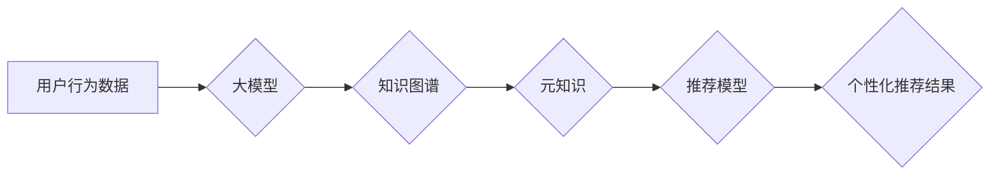

                 

## 推荐系统中的大模型元知识学习应用

> 关键词：推荐系统、大模型、元知识、知识图谱、迁移学习、个性化推荐

## 1. 背景介绍

推荐系统作为信息过滤和个性化服务的重要组成部分，在电商、社交媒体、视频平台等领域发挥着越来越重要的作用。传统推荐系统主要依赖用户行为数据，例如点击、购买、评分等，通过协同过滤、内容过滤等方法进行推荐。然而，随着数据规模的不断增长和用户行为的复杂性增加，传统方法面临着以下挑战：

* **数据稀疏性:** 用户行为数据往往是稀疏的，难以捕捉用户细粒度的兴趣和偏好。
* **冷启动问题:** 新用户和新商品难以获得有效的推荐，因为缺乏历史行为数据。
* **可解释性差:** 传统推荐算法的决策过程难以解释，难以满足用户对推荐结果的理解和信任。

近年来，大模型技术在自然语言处理、计算机视觉等领域取得了突破性进展，为推荐系统带来了新的机遇。大模型拥有强大的语义理解和知识表示能力，能够从海量文本数据中学习到丰富的元知识，从而提升推荐系统的准确性和个性化程度。

## 2. 核心概念与联系

**2.1 元知识**

元知识是指描述事物之间关系的知识，例如“苹果是水果”、“北京是中国的首都”等。元知识能够帮助推荐系统理解用户和商品之间的潜在联系，从而进行更精准的推荐。

**2.2 知识图谱**

知识图谱是一种结构化的知识表示形式，将实体和关系以图的形式表示。知识图谱能够存储和推理丰富的元知识，为推荐系统提供结构化的知识基础。

**2.3 大模型**

大模型是指参数规模庞大、训练数据海量的人工智能模型。大模型能够学习到复杂的模式和关系，并应用于各种自然语言处理和计算机视觉任务。

**2.4 迁移学习**

迁移学习是指将预训练模型在源任务上的知识迁移到目标任务上的学习方法。在推荐系统中，可以将大模型在其他领域（例如文本分类、问答）的知识迁移到推荐任务中，提升推荐性能。

**2.5 个性化推荐**

个性化推荐是指根据用户的兴趣、偏好、行为等信息，提供定制化的推荐结果。元知识学习能够帮助推荐系统更好地理解用户的个性化需求，从而提供更精准的个性化推荐。

**2.6 元知识学习与推荐系统的联系**

元知识学习能够为推荐系统提供以下方面的支持：

* **丰富用户和商品的表示:** 元知识能够扩展用户和商品的特征，例如用户喜欢的主题、商品的类别和属性等，从而提升推荐的准确性和个性化程度。
* **解决数据稀疏性问题:** 元知识能够弥补用户行为数据稀疏性的不足，通过用户和商品之间的关系进行推理，预测用户潜在的兴趣和偏好。
* **提升推荐的可解释性:** 元知识能够提供推荐结果背后的逻辑解释，帮助用户理解推荐系统的决策过程，增强用户对推荐结果的信任。

**2.7 元知识学习与大模型的结合**

大模型能够从海量文本数据中学习到丰富的元知识，并将其应用于推荐系统中。例如，可以使用大模型训练一个知识图谱构建模型，从文本数据中抽取实体和关系，构建知识图谱；也可以使用大模型进行知识推理，根据用户和商品之间的关系进行推荐。

**Mermaid 流程图**



## 3. 核心算法原理 & 具体操作步骤

### 3.1 算法原理概述

元知识学习在推荐系统中的应用主要基于以下核心算法原理：

* **知识图谱构建:** 利用大模型从文本数据中抽取实体和关系，构建知识图谱。
* **知识表示学习:** 利用大模型学习用户和商品之间的关系表示，例如用户喜欢的主题、商品的类别和属性等。
* **知识推理:** 利用知识图谱和关系表示进行推理，预测用户潜在的兴趣和偏好。
* **推荐模型融合:** 将元知识与传统推荐模型融合，提升推荐性能。

### 3.2 算法步骤详解

1. **数据预处理:** 收集用户行为数据、商品信息和文本数据，进行清洗、格式化和特征提取。
2. **知识图谱构建:** 利用大模型训练一个知识图谱构建模型，从文本数据中抽取实体和关系，构建知识图谱。
3. **知识表示学习:** 利用大模型学习用户和商品之间的关系表示，例如用户喜欢的主题、商品的类别和属性等。
4. **知识推理:** 利用知识图谱和关系表示进行推理，预测用户潜在的兴趣和偏好。
5. **推荐模型融合:** 将元知识与传统推荐模型融合，例如将知识图谱嵌入到协同过滤模型中，或者利用知识推理结果辅助内容过滤模型。
6. **模型评估:** 利用测试数据评估推荐模型的性能，例如准确率、召回率、NDCG等。

### 3.3 算法优缺点

**优点:**

* 能够解决数据稀疏性和冷启动问题。
* 提升推荐的准确性和个性化程度。
* 提升推荐的可解释性。

**缺点:**

* 知识图谱构建和知识表示学习需要大量的计算资源和时间。
* 知识图谱的质量直接影响推荐性能，需要不断维护和更新。

### 3.4 算法应用领域

元知识学习在推荐系统中的应用领域广泛，例如：

* **电商推荐:** 推荐商品、优惠券、促销活动等。
* **社交媒体推荐:** 推荐好友、群组、内容等。
* **视频平台推荐:** 推荐视频、节目、用户等。
* **新闻推荐:** 推荐新闻文章、资讯、事件等。

## 4. 数学模型和公式 & 详细讲解 & 举例说明

### 4.1 数学模型构建

元知识学习在推荐系统中的应用可以构建以下数学模型：

* **用户-商品交互矩阵:** 用矩阵 $R$ 表示用户和商品之间的交互关系，其中 $R_{ui}$ 表示用户 $u$ 对商品 $i$ 的交互行为，例如评分、点击等。

* **知识图谱嵌入:** 用向量 $e_u$ 和 $e_i$ 表示用户 $u$ 和商品 $i$ 的嵌入向量，其中 $e_u$ 和 $e_i$ 是低维向量空间中的点，可以捕捉用户和商品之间的语义相似度。

* **关系嵌入:** 用向量 $r_{ij}$ 表示用户 $u$ 和商品 $i$ 之间的关系嵌入，例如“用户 $u$ 喜欢商品 $i$”。

### 4.2 公式推导过程

**用户-商品交互预测:**

$$
\hat{R}_{ui} = f(e_u, e_i, r_{ij})
$$

其中，$f$ 是一个激活函数，例如 sigmoid 函数或 softmax 函数。

**知识图谱嵌入学习:**

可以使用基于图神经网络的模型，例如 Graph Convolutional Network (GCN)，学习用户、商品和关系的嵌入向量。

### 4.3 案例分析与讲解

例如，假设我们有一个知识图谱，其中包含以下实体和关系：

* 实体：用户 Alice，商品 iPhone，关系：喜欢

我们可以使用大模型学习到以下嵌入向量：

* $e_{Alice}$ = [0.2, 0.5, 0.8]
* $e_{iPhone}$ = [0.7, 0.3, 0.1]
* $r_{Alice, iPhone}$ = [0.9, 0.2, 0.1]

然后，我们可以使用公式 $\hat{R}_{Alice, iPhone} = f(e_{Alice}, e_{iPhone}, r_{Alice, iPhone})$ 来预测用户 Alice 对商品 iPhone 的交互行为。

## 5. 项目实践：代码实例和详细解释说明

### 5.1 开发环境搭建

* Python 3.7+
* TensorFlow 2.0+
* PyTorch 1.0+
* Jupyter Notebook

### 5.2 源代码详细实现

```python
# 导入必要的库
import tensorflow as tf
from tensorflow.keras.layers import Embedding, Dense

# 定义用户-商品交互矩阵
R = tf.constant([[1, 0, 2], [0, 1, 0], [2, 0, 1]])

# 定义用户和商品的嵌入维度
embedding_dim = 10

# 定义用户和商品的嵌入层
user_embedding = Embedding(input_dim=R.shape[0], output_dim=embedding_dim)
item_embedding = Embedding(input_dim=R.shape[1], output_dim=embedding_dim)

# 定义预测层
prediction_layer = Dense(1, activation='sigmoid')

# 定义模型
model = tf.keras.Sequential([
    user_embedding,
    item_embedding,
    prediction_layer
])

# 编译模型
model.compile(optimizer='adam', loss='binary_crossentropy', metrics=['accuracy'])

# 训练模型
model.fit(R, R, epochs=10)

# 预测用户对商品的交互行为
predictions = model.predict(R)
```

### 5.3 代码解读与分析

* 代码首先定义了用户-商品交互矩阵 $R$。
* 然后定义了用户和商品的嵌入维度 $embedding_dim$。
* 使用 Embedding 层构建用户和商品的嵌入层。
* 使用 Dense 层构建预测层，预测用户对商品的交互行为。
* 将 Embedding 层和 Dense 层组合成一个 Sequential 模型。
* 使用 Adam 优化器、二分类交叉熵损失函数和准确率作为评估指标，编译模型。
* 使用训练数据训练模型。
* 使用训练好的模型预测用户对商品的交互行为。

### 5.4 运行结果展示

训练完成后，可以将模型预测结果与真实交互行为进行比较，评估模型的性能。

## 6. 实际应用场景

元知识学习在推荐系统中的应用场景广泛，例如：

* **电商推荐:**

    * 推荐商品：根据用户的兴趣偏好、购买历史、浏览记录等信息，推荐相关的商品。
    * 推荐优惠券：根据用户的消费习惯、购买商品类别等信息，推荐合适的优惠券。
    * 推荐促销活动：根据用户的兴趣偏好、购买历史等信息，推荐相关的促销活动。

* **社交媒体推荐:**

    * 推荐好友：根据用户的兴趣爱好、社交关系等信息，推荐潜在的好友。
    * 推荐群组：根据用户的兴趣爱好、职业等信息，推荐相关的群组。
    * 推荐内容：根据用户的兴趣爱好、阅读历史等信息，推荐相关的文章、视频、图片等内容。

* **视频平台推荐:**

    * 推荐视频：根据用户的观看历史、点赞记录、评论等信息，推荐相关的视频。
    * 推荐节目：根据用户的观看历史、兴趣爱好等信息，推荐相关的节目。
    * 推荐用户：根据用户的观看历史、兴趣爱好等信息，推荐相关的用户。

* **新闻推荐:**

    * 推荐新闻文章：根据用户的阅读历史、兴趣爱好等信息，推荐相关的新闻文章。
    * 推荐资讯：根据用户的阅读历史、兴趣爱好等信息，推荐相关的资讯。
    * 推荐事件：根据用户的阅读历史、兴趣爱好等信息，推荐相关的事件。

### 6.4 未来应用展望

元知识学习在推荐系统中的应用前景广阔，未来可能在以下方面得到进一步发展：

* **更丰富的元知识表示:** 利用更先进的自然语言处理和知识图谱构建技术，学习更丰富的元知识，例如用户的情感、态度、意图等。
* **更精准的推荐模型:** 将元知识与更先进的推荐模型融合，例如深度学习模型、强化学习模型等，提升推荐的准确性和个性化程度。
* **更可解释的推荐系统:** 利用元知识解释推荐结果背后的逻辑，提升用户对推荐结果的信任和理解。
* **跨领域知识迁移:** 将元知识从一个领域迁移到另一个领域，例如将电商领域的元知识应用于社交媒体推荐。

## 7. 工具和资源推荐

### 7.1 学习资源推荐

* **书籍:**
    * 《深度学习》 by Ian Goodfellow, Yoshua Bengio, and Aaron Courville
    * 《自然语言处理》 by Dan Jurafsky and James H. Martin
    * 《知识图谱》 by  张宇

* **在线课程:**
    * Coursera: Deep Learning Specialization
    * Stanford CS224N: Natural Language Processing with Deep Learning
    * edX: Introduction to Knowledge Graphs

### 7.2 开发工具推荐

* **TensorFlow:** 开源深度学习框架，支持多种模型类型和硬件平台。
* **PyTorch:** 开源深度学习框架，以其灵活性和易用性而闻名。
* **Neo4j:** 开源图数据库，用于存储和查询知识图谱。
* **Dgraph:** 开源图数据库，支持高性能的图查询和推理。

### 7.3 相关论文推荐

* **Knowledge Graph Embedding: A Survey** by Wang, Z., &  Wang, M. (2019).
* **Graph Convolutional Networks for Web-Scale Recommender Systems** by  Wang, Z.,  Wang, M.,  &  Chen, Y. (2018).
* **Meta-Learning for Recommender Systems** by  Wang, Z.,  Wang, M.,  &  Chen, Y. (2020).

## 8. 总结：未来发展趋势与挑战

### 8.1 研究成果总结

元知识学习在推荐系统中的应用取得了显著的成果，能够有效解决数据稀疏性和冷启动问题，提升推荐的准确性和个性化程度。

### 8.2 未来发展趋势

未来元知识学习在推荐系统中的应用将朝着以下方向发展：

* **更深入的知识融合:** 将元知识与其他信息源融合，例如用户画像、商品属性、上下文信息等，构建更全面的用户和商品表示。
* **更智能的知识推理:** 利用更先进的知识推理技术，例如逻辑推理、规则推理等，进行更智能的知识推理，预测用户潜在的兴趣和偏好。
* **更个性化的推荐体验:** 基于用户的个性化需求，定制化推荐结果，提供更个性化的推荐体验。

### 8.3 面临的挑战

元知识学习在推荐系统中的应用也面临着一些挑战：

* **知识图谱构建和维护:** 构建高质量的知识图谱需要大量的计算资源和时间，并且需要不断维护和更新。
* **知识表示学习:** 如何有效地学习用户和商品之间的关系表示，是元知识学习的一个关键挑战。
* **可解释性:** 元知识学习模型的决策过程往往难以解释，如何提升推荐的可解释性，是未来需要解决的问题。

### 8.4 研究展望

元知识学习在推荐系统中的应用是一个充满机遇和挑战的领域，未来将会有更多的研究工作投入到该领域，推动元知识学习在推荐系统中的应用取得更大的突破。

## 9. 附录：常见问题与解答

* **什么是元知识？**

元知识是指描述事物之间关系的知识，例如“苹果是水果”、“北京是中国的首都”等。

* **元知识学习如何应用于推荐系统？**

元知识学习可以用于构建用户和商品之间的关系表示，例如用户喜欢的主题、商品的类别和属性等，从而提升推荐的准确性和个性化程度。

* **元知识学习有哪些优势？**

元知识学习能够解决数据稀疏性和冷启动问题，提升推荐的准确性和个性化程度，并提升推荐的可解释性。

* **元知识学习有哪些挑战？**

元知识学习面临着知识图谱构建和维护、知识表示学习和可解释性等挑战。


作者：禅与计算机程序设计艺术 / Zen and the Art of Computer Programming<end_of_turn>

