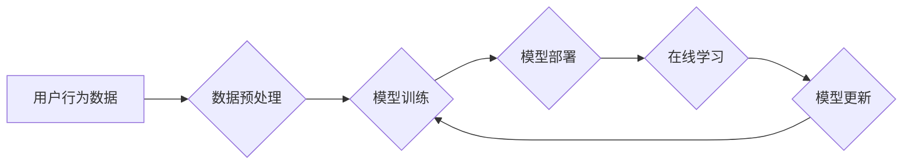

                 

## 推荐系统中的大模型终身学习与持续优化

> 关键词：推荐系统、大模型、终身学习、持续优化、迁移学习、联邦学习、数据冷启动、模型更新、在线学习

## 1. 背景介绍

推荐系统作为连接用户和内容的重要桥梁，在电商、社交媒体、视频平台等领域发挥着至关重要的作用。随着大模型技术的蓬勃发展，基于大模型的推荐系统展现出强大的个性化推荐能力和泛化能力。然而，大模型的训练成本高昂，且在部署后难以适应不断变化的用户偏好和内容更新。因此，如何实现大模型的终身学习和持续优化，使其能够在动态环境中保持高性能，成为一个亟待解决的关键问题。

传统的推荐系统通常采用离线训练的方式，在训练完成后，模型参数会被固定，直到下一次大规模更新。这种方法存在以下问题：

* **数据静态化:**  用户行为和内容特征会随着时间不断变化，而离线训练的模型无法及时捕捉这些变化，导致推荐效果下降。
* **训练成本高昂:**  大模型的训练需要消耗大量计算资源和时间，频繁的离线训练成本难以承受。
* **数据冷启动:**  对于新用户或新内容，由于缺乏历史数据，难以进行有效的训练，导致推荐效果不佳。

## 2. 核心概念与联系

大模型终身学习是指在模型部署后，通过持续学习和优化，使其能够不断适应环境变化，提升推荐性能。

**核心概念:**

* **大模型:** 指参数量庞大的深度学习模型，例如 Transformer、BERT 等。
* **终身学习:** 指模型在部署后能够持续学习和更新，适应不断变化的环境。
* **持续优化:** 指通过各种技术手段，不断提升模型的性能和效率。

**架构:**



**核心技术:**

* **迁移学习:** 利用预训练模型的知识，在新的任务或领域进行训练，降低训练成本和数据需求。
* **联邦学习:** 在不共享原始数据的情况下，通过模型参数的分布式更新，实现模型训练和优化。
* **在线学习:**  实时更新模型参数，根据用户反馈和新数据进行调整，实现模型的动态适应。

## 3. 核心算法原理 & 具体操作步骤

### 3.1  算法原理概述

大模型终身学习的核心算法原理是基于模型的在线更新和优化。通过收集用户反馈和新数据，不断调整模型参数，使其能够更好地适应环境变化。

### 3.2  算法步骤详解

1. **数据收集:** 收集用户行为数据，例如点击、评分、浏览等，以及新内容的特征信息。
2. **数据预处理:** 对收集到的数据进行清洗、转换和特征工程，使其能够被模型理解。
3. **模型加载:** 加载预训练的大模型，将其作为基础模型。
4. **在线学习:** 使用收集到的数据进行在线学习，更新模型参数。常用的在线学习算法包括梯度下降、随机梯度下降等。
5. **模型评估:** 定期评估模型的性能，例如准确率、召回率等，并根据评估结果进行调整。
6. **模型更新:** 根据模型评估结果和在线学习的反馈，更新模型参数，使其能够更好地适应环境变化。

### 3.3  算法优缺点

**优点:**

* **实时适应:**  能够实时更新模型参数，适应用户偏好和内容更新。
* **降低训练成本:**  相比于频繁的离线训练，在线学习可以降低训练成本。
* **数据冷启动缓解:**  可以通过在线学习的方式，逐步积累新用户和新内容的数据，缓解数据冷启动问题。

**缺点:**

* **数据质量依赖:**  在线学习的性能依赖于数据质量，如果数据存在噪声或偏差，会影响模型性能。
* **模型更新策略:**  需要设计合理的模型更新策略，避免模型过拟合或性能下降。
* **计算资源需求:**  在线学习需要持续收集和处理数据，对计算资源有一定的需求。

### 3.4  算法应用领域

大模型终身学习算法广泛应用于以下领域:

* **电商推荐:**  根据用户的购买历史、浏览记录等数据，推荐个性化的商品。
* **社交媒体推荐:**  根据用户的兴趣爱好、社交关系等数据，推荐相关的用户、内容和活动。
* **视频平台推荐:**  根据用户的观看历史、点赞记录等数据，推荐个性化的视频内容。
* **新闻推荐:**  根据用户的阅读习惯、新闻偏好等数据，推荐相关的新闻资讯。

## 4. 数学模型和公式 & 详细讲解 & 举例说明

### 4.1  数学模型构建

推荐系统的核心目标是预测用户对某个物品的评分或点击概率。可以使用以下数学模型来表示：

$$
r_{u,i} = f(u, i, \theta)
$$

其中：

* $r_{u,i}$ 表示用户 $u$ 对物品 $i$ 的评分或点击概率。
* $u$ 表示用户特征向量。
* $i$ 表示物品特征向量。
* $\theta$ 表示模型参数。
* $f$ 表示模型函数，例如线性回归、神经网络等。

### 4.2  公式推导过程

在线学习算法的目标是通过最小化模型预测误差，不断更新模型参数。常用的损失函数包括均方误差 (MSE) 和交叉熵损失 (Cross-Entropy Loss)。

**均方误差 (MSE):**

$$
L = \frac{1}{N} \sum_{u,i} (r_{u,i} - \hat{r}_{u,i})^2
$$

其中：

* $N$ 表示训练样本数量。
* $\hat{r}_{u,i}$ 表示模型预测的用户对物品 $i$ 的评分或点击概率。

**交叉熵损失 (Cross-Entropy Loss):**

$$
L = -\frac{1}{N} \sum_{u,i} r_{u,i} \log(\hat{r}_{u,i}) + (1-r_{u,i}) \log(1-\hat{r}_{u,i})
$$

通过梯度下降算法，可以更新模型参数：

$$
\theta = \theta - \alpha \nabla L(\theta)
$$

其中：

* $\alpha$ 表示学习率。
* $\nabla L(\theta)$ 表示损失函数对模型参数的梯度。

### 4.3  案例分析与讲解

假设我们有一个电商推荐系统，需要预测用户对商品的购买概率。可以使用一个基于神经网络的推荐模型，并采用交叉熵损失函数进行训练。

在训练过程中，模型会根据用户的历史购买记录、浏览记录等数据，学习到用户对不同商品的偏好。

在线学习阶段，模型会根据用户的实时行为数据，不断更新模型参数，使其能够更好地预测用户的购买概率。例如，如果用户最近购买了某个类型的商品，模型会根据这个信息，提高对该类型商品的推荐概率。

## 5. 项目实践：代码实例和详细解释说明

### 5.1  开发环境搭建

推荐系统开发环境通常包括以下组件:

* **编程语言:** Python 是推荐系统开发的常用语言，因为它拥有丰富的机器学习库和工具。
* **深度学习框架:** TensorFlow、PyTorch 等深度学习框架提供了高效的模型训练和推理能力。
* **数据存储:**  使用数据库或文件系统存储用户行为数据和物品特征信息。
* **计算资源:**  推荐系统训练和部署需要一定的计算资源，可以使用云计算平台或本地服务器。

### 5.2  源代码详细实现

以下是一个基于 TensorFlow 的简单推荐系统代码示例，演示了如何使用在线学习算法更新模型参数:

```python
import tensorflow as tf

# 定义模型
model = tf.keras.Sequential([
    tf.keras.layers.Embedding(input_dim=10000, output_dim=64),
    tf.keras.layers.Dense(units=32, activation='relu'),
    tf.keras.layers.Dense(units=1, activation='sigmoid')
])

# 定义损失函数和优化器
loss_fn = tf.keras.losses.BinaryCrossentropy()
optimizer = tf.keras.optimizers.Adam(learning_rate=0.001)

# 在线学习
def train_step(user_id, item_id, rating):
    with tf.GradientTape() as tape:
        prediction = model(user_id, item_id)
        loss = loss_fn(rating, prediction)
    gradients = tape.gradient(loss, model.trainable_variables)
    optimizer.apply_gradients(zip(gradients, model.trainable_variables))

# 训练数据
user_item_ratings = {
    (1, 1): 5,
    (1, 2): 3,
    (2, 1): 4,
    (2, 3): 2,
}

# 在线学习迭代
for epoch in range(10):
    for user_id, item_id, rating in user_item_ratings.items():
        train_step(user_id, item_id, rating)

# 模型评估
# ...
```

### 5.3  代码解读与分析

这段代码演示了如何使用 TensorFlow 实现一个简单的推荐系统，并使用在线学习算法更新模型参数。

* 模型定义: 使用了 Embedding 层和 Dense 层构建一个简单的推荐模型。
* 损失函数和优化器: 使用了 BinaryCrossentropy 损失函数和 Adam 优化器。
* 在线学习: 使用 `train_step` 函数实现在线学习，根据用户行为数据更新模型参数。
* 训练数据: 使用了一个简单的字典存储用户对物品的评分数据。
* 模型评估: 需要根据实际情况编写模型评估代码。

### 5.4  运行结果展示

运行这段代码后，模型会根据训练数据进行在线学习，并不断更新模型参数。最终，模型能够预测用户对物品的评分或点击概率。

## 6. 实际应用场景

### 6.1  电商推荐

大模型终身学习可以帮助电商平台提供更个性化的商品推荐，提高用户购物体验和转化率。例如，可以根据用户的浏览历史、购买记录、购物车内容等数据，推荐相关的商品，并根据用户的实时行为数据，动态调整推荐结果。

### 6.2  社交媒体推荐

大模型终身学习可以帮助社交媒体平台推荐更相关的用户、内容和活动，提高用户粘性和活跃度。例如，可以根据用户的兴趣爱好、社交关系、浏览记录等数据，推荐相关的用户，并根据用户的实时互动行为，动态调整推荐结果。

### 6.3  视频平台推荐

大模型终身学习可以帮助视频平台推荐更个性化的视频内容，提高用户观看时长和用户留存率。例如，可以根据用户的观看历史、点赞记录、评论内容等数据，推荐相关的视频，并根据用户的实时观看行为，动态调整推荐结果。

### 6.4  未来应用展望

大模型终身学习在推荐系统领域的应用前景广阔，未来可能在以下方面得到进一步发展:

* **多模态推荐:**  结合文本、图像、音频等多模态数据，提供更丰富的推荐体验。
* **个性化推荐增强:**  通过更深入的用户画像和行为分析，实现更精准的个性化推荐。
* **跨平台推荐:**  实现用户在不同平台的推荐内容互通，提供更连续的用户体验。

## 7. 工具和资源推荐

### 7.1  学习资源推荐

* **书籍:**
    * 《深度学习》 by Ian Goodfellow, Yoshua Bengio, Aaron Courville
    * 《推荐系统实践》 by  Paul Covington, Jay Parikh,  
* **在线课程:**
    * Coursera:  Machine Learning by Andrew Ng
    * Udacity:  Deep Learning Nanodegree
* **博客和网站:**
    * Towards Data Science
    * Machine Learning Mastery

### 7.2  开发工具推荐

* **深度学习框架:** TensorFlow, PyTorch, Keras
* **数据处理工具:** Pandas, NumPy
* **云计算平台:** AWS, Azure, Google Cloud

### 7.3  相关论文推荐

* **BERT:** Devlin, J., Chang, M. W., Lee, K., & Toutanova, K. (2018). BERT: Pre-training of deep bidirectional transformers for language understanding. arXiv preprint arXiv:1810.04805.
* **Transformer:** Vaswani, A., Shazeer, N., Parmar, N., Uszkoreit, J., Jones, L., Gomez, A. N., ... & Polosukhin, I. (2017). Attention is all you need. In Advances in neural information processing systems (pp. 5998-6008).
* **Federated Learning:** McMahan, B., Moore, E., Ramage, D., Hampson, S., & y Arcas, B. (2017). Communication-efficient learning of deep networks from decentralized data. In Proceedings of the 2017 ACM International Conference on Learning Representations (ICLR) (pp. 1-10).

## 8. 总结：未来发展趋势与挑战

### 8.1  研究成果总结

大模型终身学习为推荐系统带来了新的发展方向，能够有效解决传统推荐系统面临的挑战，提升推荐性能和用户体验。

### 8.2  未来发展趋势

* **模型架构创新:**  探索更有效的模型架构，例如 Transformer 的变体、图神经网络等，提升模型的表达能力和泛化能力。
* **数据增强技术:**  利用数据增强技术，例如文本生成、图像合成等，增加训练数据量和多样性，缓解数据冷启动问题。
* **联邦学习发展:**  进一步完善联邦学习算法，提高模型训练效率和隐私保护能力，推动大模型在多方数据环境下的应用。

### 8.3  面临的挑战

* **数据质量问题:**  在线学习算法依赖于高质量的数据，数据噪声和偏差会影响模型性能。
* **模型更新策略:**  需要设计合理的模型更新策略，避免模型过拟合或性能下降。
* **计算资源需求:**  大模型的在线学习需要大量的计算资源，成本较高。

### 8.4  研究展望

未来，大模型终身学习将在以下方面继续深入研究:

* **更有效的模型训练和更新算法:**  探索更有效的模型训练和更新算法，降低训练成本和提高模型性能。
* **更精准的用户画像和行为分析:**  利用更先进的机器学习和数据挖掘技术，构建更精准的用户画像和行为分析模型，实现更个性化的推荐。
* **跨平台和跨模态推荐:**  实现用户在不同平台和不同模态下的推荐内容互通，提供更连续的用户体验。

## 9. 附录：常见问题与解答

**Q1: 大模型终身学习与传统推荐系统的区别是什么？**

**A1:**  传统推荐系统通常采用离线训练的方式，模型参数在训练完成后会被固定。而大模型终身学习则能够在模型部署后，通过持续学习和优化，不断适应环境变化，提升推荐性能。

**Q2: 大模型终身学习有哪些技术挑战？**

**A2:**  大模型终身学习面临着数据质量问题、模型更新策略和计算资源需求等技术挑战。

**Q3: 大模型终身学习有哪些应用场景？**

**A3:**  大模型终身学习广泛应用于电商推荐、社交媒体推荐、视频平台推荐等领域。


作者：禅与计算机程序设计艺术 / Zen and the Art of Computer Programming<end_of_turn>

