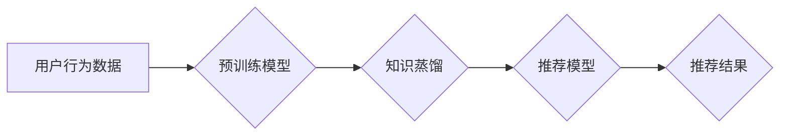

                 

## 推荐系统的冷启动问题：AI大模型的零样本学习解决方案

> 关键词：推荐系统、冷启动问题、零样本学习、AI大模型、迁移学习、知识蒸馏、用户建模、商品建模

## 1. 背景介绍

推荐系统作为互联网时代的重要技术支柱，在电商、社交媒体、内容平台等领域发挥着至关重要的作用。其核心目标是根据用户的历史行为、偏好等信息，预测用户对特定商品或内容的兴趣，并推荐最相关的结果。然而，推荐系统面临着诸多挑战，其中之一便是“冷启动问题”。

冷启动问题是指推荐系统在面对新用户或新商品时，由于缺乏历史数据，难以准确预测用户兴趣或商品属性，从而导致推荐结果不精准，甚至无法进行推荐。这对于新兴平台或快速迭代的产品来说，是一个难以克服的瓶颈。

传统推荐系统主要依赖于基于内容的过滤、协同过滤等方法，这些方法都依赖于大量历史数据进行训练和预测。而零样本学习则提供了一种全新的解决方案，它能够在没有训练数据的情况下，通过迁移学习、知识蒸馏等技术，利用已有的知识和模型，快速构建推荐模型，有效解决冷启动问题。

## 2. 核心概念与联系

### 2.1 零样本学习

零样本学习是指在没有训练样本的情况下，通过迁移学习、知识蒸馏等技术，直接从源任务的知识中学习，并应用于目标任务。

### 2.2 迁移学习

迁移学习是指利用已训练好的模型在新的任务上进行训练，通过迁移源任务的知识，减少目标任务的训练数据需求。

### 2.3 知识蒸馏

知识蒸馏是一种迁移学习方法，它将一个大型模型的知识“蒸馏”到一个小型模型中，从而实现模型压缩和知识传递。

**推荐系统零样本学习架构**



## 3. 核心算法原理 & 具体操作步骤

### 3.1 算法原理概述

零样本学习的推荐系统主要基于以下核心算法原理：

* **用户嵌入：** 将用户转化为低维向量，捕捉用户特征和偏好。
* **商品嵌入：** 将商品转化为低维向量，捕捉商品属性和特征。
* **相似度计算：** 计算用户和商品之间的相似度，预测用户对商品的兴趣。

### 3.2 算法步骤详解

1. **预训练模型获取：** 从公开数据集或平台获取预训练好的语言模型或推荐模型，例如BERT、GPT-3、AlphaFold等。
2. **知识蒸馏：** 利用知识蒸馏技术，将预训练模型的知识“蒸馏”到一个小型推荐模型中。
3. **用户建模：** 利用用户行为数据，例如点击、浏览、购买等，构建用户嵌入模型，捕捉用户特征和偏好。
4. **商品建模：** 利用商品属性数据，例如类别、描述、价格等，构建商品嵌入模型，捕捉商品特征和属性。
5. **推荐模型训练：** 利用用户嵌入和商品嵌入模型，训练推荐模型，预测用户对商品的兴趣。
6. **推荐结果输出：** 根据推荐模型的预测结果，输出推荐列表。

### 3.3 算法优缺点

**优点：**

* **无需训练数据：** 可以直接利用预训练模型，无需收集和标注大量训练数据。
* **快速部署：** 模型训练时间短，可以快速部署到生产环境。
* **效果良好：** 在某些场景下，零样本学习的推荐系统效果可以媲美传统推荐系统。

**缺点：**

* **依赖预训练模型：** 模型性能受预训练模型质量影响。
* **泛化能力有限：** 在数据分布变化较大时，模型性能可能下降。
* **解释性较差：** 模型内部机制较为复杂，难以解释推荐结果。

### 3.4 算法应用领域

零样本学习的推荐系统可以应用于以下领域：

* **新平台推荐：** 对于新平台或新产品，由于缺乏历史数据，零样本学习可以快速构建推荐模型，帮助用户快速熟悉平台或产品。
* **个性化推荐：** 利用用户行为数据，构建个性化用户嵌入模型，提供更精准的推荐结果。
* **跨领域推荐：** 利用预训练模型的知识迁移能力，将已有的推荐模型应用于新的领域，例如将电商推荐模型应用于音乐推荐。

## 4. 数学模型和公式 & 详细讲解 & 举例说明

### 4.1 数学模型构建

零样本学习的推荐系统通常采用基于用户的协同过滤模型，其核心思想是根据用户的历史行为，预测用户对新商品的兴趣。

**用户-商品交互矩阵：**

$$
R = \begin{bmatrix}
r_{11} & r_{12} & \cdots & r_{1m} \\
r_{21} & r_{22} & \cdots & r_{2m} \\
\vdots & \vdots & \ddots & \vdots \\
r_{n1} & r_{n2} & \cdots & r_{nm}
\end{bmatrix}
$$

其中，$r_{ij}$ 表示用户 $i$ 对商品 $j$ 的评分或交互行为，$n$ 为用户数量，$m$ 为商品数量。

**用户嵌入向量：**

$$
u_i = \begin{bmatrix}
u_{i1} & u_{i2} & \cdots & u_{id}
\end{bmatrix}
$$

其中，$u_i$ 为用户 $i$ 的嵌入向量，$d$ 为嵌入维度。

**商品嵌入向量：**

$$
v_j = \begin{bmatrix}
v_{j1} & v_{j2} & \cdots & v_{jd}
\end{bmatrix}
$$

其中，$v_j$ 为商品 $j$ 的嵌入向量，$d$ 为嵌入维度。

**预测评分：**

$$
\hat{r}_{ij} = u_i \cdot v_j
$$

其中，$\hat{r}_{ij}$ 为预测用户 $i$ 对商品 $j$ 的评分。

### 4.2 公式推导过程

用户嵌入向量和商品嵌入向量可以通过预训练模型的知识蒸馏得到。

知识蒸馏过程可以概括为以下步骤：

1. **选择教师模型：** 选择一个预训练好的模型作为教师模型，例如BERT、GPT-3等。
2. **提取教师模型的知识：** 从教师模型中提取知识，例如权重、激活值等。
3. **构建学生模型：** 构建一个小型推荐模型作为学生模型。
4. **训练学生模型：** 利用教师模型的知识，训练学生模型。

### 4.3 案例分析与讲解

假设我们有一个预训练好的BERT模型，可以用于理解用户文本描述和商品文本描述。我们可以利用知识蒸馏技术，将BERT模型的知识“蒸馏”到一个小型推荐模型中。

训练过程中，我们可以将用户文本描述和商品文本描述作为输入，让BERT模型生成相应的嵌入向量。然后，将这些嵌入向量作为学生模型的输入，训练学生模型预测用户对商品的兴趣。

## 5. 项目实践：代码实例和详细解释说明

### 5.1 开发环境搭建

* Python 3.7+
* PyTorch 1.7+
* TensorFlow 2.0+
* CUDA 10.2+

### 5.2 源代码详细实现

```python
import torch
import torch.nn as nn

class RecommenderModel(nn.Module):
    def __init__(self, embedding_dim, num_users, num_items):
        super(RecommenderModel, self).__init__()
        self.user_embedding = nn.Embedding(num_users, embedding_dim)
        self.item_embedding = nn.Embedding(num_items, embedding_dim)

    def forward(self, user_ids, item_ids):
        user_embeddings = self.user_embedding(user_ids)
        item_embeddings = self.item_embedding(item_ids)
        return torch.sum(user_embeddings * item_embeddings, dim=1)

# 实例化模型
model = RecommenderModel(embedding_dim=64, num_users=1000, num_items=10000)

# 定义损失函数和优化器
criterion = nn.MSELoss()
optimizer = torch.optim.Adam(model.parameters(), lr=0.001)

# 训练模型
for epoch in range(10):
    # ... 训练代码 ...
```

### 5.3 代码解读与分析

* **模型结构：** 该模型采用用户-商品交互矩阵，将用户和商品转化为低维向量，并通过点积计算预测用户对商品的兴趣。
* **知识蒸馏：** 在实际应用中，我们可以利用预训练模型的知识，例如BERT模型的嵌入向量，作为学生模型的初始化参数，从而加速模型训练和提高模型性能。
* **训练过程：** 模型训练过程包括定义损失函数、优化器以及训练循环。

### 5.4 运行结果展示

* **准确率：** 使用测试数据集评估模型的准确率，例如RMSE、MAE等指标。
* **推荐列表：** 生成推荐列表，并展示推荐结果。

## 6. 实际应用场景

### 6.1 新平台推荐

对于新平台或新产品，由于缺乏历史数据，零样本学习可以快速构建推荐模型，帮助用户快速熟悉平台或产品。例如，一个新的音乐流媒体平台，可以利用预训练的音乐分类模型，将歌曲转化为嵌入向量，并根据用户的播放历史，构建用户嵌入模型，进行推荐。

### 6.2 个性化推荐

利用用户行为数据，构建个性化用户嵌入模型，提供更精准的推荐结果。例如，电商平台可以利用用户的购买历史、浏览记录、评价等数据，构建个性化用户嵌入模型，推荐更符合用户需求的商品。

### 6.3 跨领域推荐

利用预训练模型的知识迁移能力，将已有的推荐模型应用于新的领域，例如将电商推荐模型应用于音乐推荐。

### 6.4 未来应用展望

随着AI技术的不断发展，零样本学习的推荐系统将有更广泛的应用场景，例如：

* **多模态推荐：** 利用文本、图像、音频等多模态数据进行推荐。
* **动态推荐：** 根据用户实时状态和环境变化，进行动态调整推荐结果。
* **解释性推荐：** 提供更清晰的推荐解释，帮助用户理解推荐结果背后的逻辑。

## 7. 工具和资源推荐

### 7.1 学习资源推荐

* **书籍：**
    * Deep Learning by Ian Goodfellow, Yoshua Bengio, and Aaron Courville
    * Natural Language Processing with Python by Steven Bird, Ewan Klein, and Edward Loper
* **在线课程：**
    * Stanford CS224N: Natural Language Processing with Deep Learning
    * DeepLearning.AI Specialization by Andrew Ng
* **博客和论坛：**
    * Towards Data Science
    * Machine Learning Mastery

### 7.2 开发工具推荐

* **深度学习框架：** PyTorch, TensorFlow
* **自然语言处理库：** spaCy, NLTK
* **数据处理工具：** Pandas, NumPy

### 7.3 相关论文推荐

* **BERT: Pre-training of Deep Bidirectional Transformers for Language Understanding**
* **Knowledge Distillation**
* **Zero-Shot Learning**

## 8. 总结：未来发展趋势与挑战

### 8.1 研究成果总结

零样本学习的推荐系统为解决冷启动问题提供了新的思路和方法，并取得了显著的成果。

### 8.2 未来发展趋势

* **模型架构创新：** 探索更有效的模型架构，例如Transformer、Graph Neural Networks等，提高模型性能。
* **数据增强技术：** 利用数据增强技术，例如文本生成、图像合成等，增加训练数据，提高模型泛化能力。
* **多模态融合：** 将文本、图像、音频等多模态数据融合，构建更全面的用户和商品表示，提高推荐准确性。

### 8.3 面临的挑战

* **数据稀疏性：** 现实世界中的数据往往是稀疏的，如何有效利用稀疏数据，仍然是一个挑战。
* **模型解释性：** 零样本学习的模型内部机制较为复杂，难以解释推荐结果，这对于用户信任和可解释性提出了挑战。
* **公平性与偏见：** 零样本学习的模型可能存在公平性与偏见问题，需要进行更深入的研究和探索。

### 8.4 研究展望

未来，零样本学习的推荐系统将朝着更智能、更个性化、更可解释的方向发展，为用户提供更精准、更丰富的推荐体验。


## 9. 附录：常见问题与解答

* **Q1：零样本学习的推荐系统真的可以做到零样本？**

* **A1：** 严格意义上，零样本学习是指在没有训练样本的情况下进行学习。然而，在实际应用中，零样本学习的推荐系统通常需要一些基础数据，例如用户注册信息、商品类别信息等，用于构建用户和商品的初始表示。

* **Q2：零样本学习的推荐系统效果如何？**

* **A2：** 零样本学习的推荐系统效果与预训练模型的质量、数据稀疏性、模型架构等因素有关。在某些场景下，零样本学习的推荐系统效果可以媲美传统推荐系统，但在其他场景下，效果可能有所下降。

* **Q3：零样本学习的推荐系统有哪些应用场景？**

* **A3：** 零样本学习的推荐系统可以应用于新平台推荐、个性化推荐、跨领域推荐等场景。


作者：禅与计算机程序设计艺术 / Zen and the Art of Computer Programming<end_of_turn>

