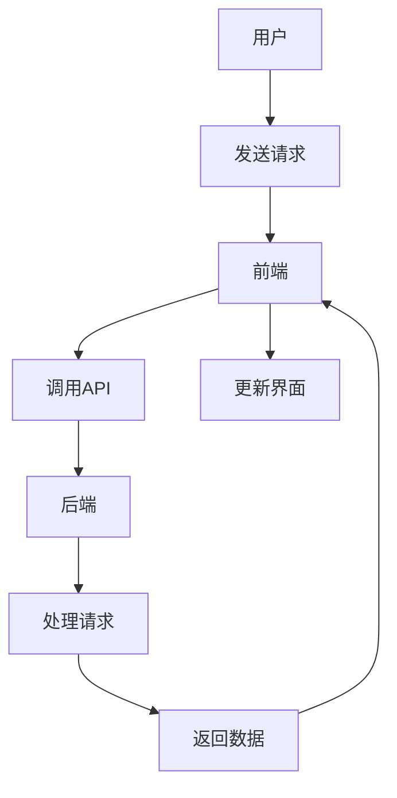

                 

### 文章标题

## Web全栈开发：前端到后端的完整技术栈

> **关键词**：Web全栈开发、前端、后端、技术栈、全栈工程师、前端技术、后端技术

> **摘要**：本文将探讨Web全栈开发的完整技术栈，从前端到后端，帮助读者全面了解全栈工程师所需掌握的关键技术和工具。通过深入剖析前端和后端的核心概念、算法原理、项目实践以及实际应用场景，读者将能够掌握Web全栈开发的全方位技能，为未来的职业发展奠定坚实基础。

### 1. 背景介绍（Background Introduction）

Web全栈开发是指掌握前端到后端的完整技术栈，能够独立完成Web应用的开发和部署。随着互联网的迅猛发展，Web应用已经成为企业和个人不可或缺的工具。因此，Web全栈开发技能在IT行业中备受青睐。

前端开发主要关注用户界面和用户体验，包括HTML、CSS和JavaScript等技术。后端开发则负责处理数据存储、业务逻辑和服务器交互，通常使用服务器端编程语言如Python、Java、PHP等。

本文将按照以下结构展开：

1. **核心概念与联系**：介绍前端和后端的核心概念，并使用Mermaid流程图展示其架构。
2. **核心算法原理 & 具体操作步骤**：探讨前端和后端的关键算法原理和操作步骤。
3. **数学模型和公式 & 详细讲解 & 举例说明**：使用数学模型和公式详细讲解前端和后端的关键概念。
4. **项目实践：代码实例和详细解释说明**：提供前端和后端的项目实践，详细解释代码实现。
5. **实际应用场景**：探讨Web全栈开发的实际应用场景。
6. **工具和资源推荐**：推荐学习资源和开发工具。
7. **总结：未来发展趋势与挑战**：分析Web全栈开发的发展趋势和挑战。
8. **附录：常见问题与解答**：解答常见问题。
9. **扩展阅读 & 参考资料**：推荐扩展阅读和参考资料。

### 2. 核心概念与联系（Core Concepts and Connections）

#### 2.1 前端开发

前端开发的核心目标是创建用户界面（UI）和用户体验（UX）。它主要涉及以下技术：

- **HTML**：超文本标记语言（HTML）是构建网页的基础，用于定义网页的结构和内容。
- **CSS**：层叠样式表（CSS）用于控制网页的样式和布局，包括颜色、字体、边框等。
- **JavaScript**：JavaScript是一种客户端脚本语言，用于实现网页的交互性。

前端开发的主要任务是优化页面性能、提升用户体验，并通过API与后端进行数据交互。

#### 2.2 后端开发

后端开发负责处理数据存储、业务逻辑和服务器交互。它通常涉及以下技术：

- **服务器端编程语言**：如Python、Java、PHP、Node.js等。
- **数据库**：用于存储和查询数据，如MySQL、PostgreSQL、MongoDB等。
- **Web框架**：如Django、Spring、Laravel、Express等，用于简化后端开发。

后端开发的核心目标是确保数据安全和业务逻辑的正确实现，同时提供高效、稳定的服务。

#### 2.3 前后端协作

前端和后端之间通过API进行数据交互。前端发送请求到后端，后端处理请求并返回数据。常见的API包括GET、POST、PUT、DELETE等。



#### 2.4 Web全栈开发

Web全栈开发要求掌握前端和后端的完整技术栈，能够独立完成Web应用的开发和部署。全栈工程师需要具备以下技能：

- 前端开发：熟悉HTML、CSS、JavaScript等技术，能够优化页面性能。
- 后端开发：熟悉服务器端编程语言、数据库和Web框架，能够实现高效、稳定的服务。
- API设计：能够设计合理、易用的API，实现前后端的数据交互。
- 持续集成与部署：熟悉持续集成与部署工具，如Git、Docker、Kubernetes等。

### 3. 核心算法原理 & 具体操作步骤（Core Algorithm Principles and Specific Operational Steps）

#### 3.1 前端核心算法原理

前端的核心算法主要包括以下内容：

- **响应式设计**：通过媒体查询（Media Queries）和CSS框架（如Bootstrap）实现不同屏幕尺寸下的适配。
- **动画与特效**：使用CSS3、JavaScript和WebGL实现网页动画与特效。
- **异步编程**：使用JavaScript异步编程技术（如Promise、async/await）提高页面性能。
- **状态管理**：使用Vue、React等前端框架实现复杂状态管理。

具体操作步骤如下：

1. **响应式设计**：
   - 使用媒体查询（Media Queries）根据屏幕尺寸调整样式。
   - 选择合适的CSS框架（如Bootstrap）简化布局。

2. **动画与特效**：
   - 使用CSS3的动画和过渡（Animation和Transition）实现基本动画效果。
   - 使用JavaScript和WebGL实现复杂的3D动画和特效。

3. **异步编程**：
   - 使用Promise处理异步操作。
   - 使用async/await简化异步代码。

4. **状态管理**：
   - 使用Vue或React等前端框架实现状态管理。

#### 3.2 后端核心算法原理

后端的核心算法主要包括以下内容：

- **算法和数据结构**：实现常用算法（如排序、查找）和数据结构（如栈、队列、链表）。
- **Web服务器与网络编程**：处理HTTP请求、实现Web服务器。
- **数据库操作**：实现SQL查询、存储过程等。

具体操作步骤如下：

1. **算法和数据结构**：
   - 学习并实现常用算法（如排序、查找）。
   - 掌握常见数据结构（如栈、队列、链表）。

2. **Web服务器与网络编程**：
   - 使用Node.js、Java等实现Web服务器。
   - 掌握HTTP协议、网络编程基础。

3. **数据库操作**：
   - 学习SQL语言，实现数据库查询。
   - 使用ORM（对象关系映射）框架简化数据库操作。

### 4. 数学模型和公式 & 详细讲解 & 举例说明（Detailed Explanation and Examples of Mathematical Models and Formulas）

#### 4.1 前端数学模型和公式

前端中的数学模型和公式主要包括以下内容：

- **贝塞尔曲线**：用于实现平滑的动画效果。
- **矩阵运算**：用于3D图形渲染。

具体讲解如下：

1. **贝塞尔曲线**：

   贝塞尔曲线是一种数学曲线，用于描述平滑的曲线。其公式如下：

   $$B(t) = (1 - t)^3 \cdot P_0 + 3t(1 - t)^2 \cdot P_1 + 3t^2(1 - t) \cdot P_2 + t^3 \cdot P_3$$

   其中，$P_0, P_1, P_2, P_3$ 是控制点。

   示例：实现一个二次贝塞尔曲线，控制点分别为 $(0, 0), (1, 1), (2, 0)$。

   $$B(t) = (1 - t)^2 \cdot (0, 0) + 2t(1 - t) \cdot (1, 1) + t^2 \cdot (2, 0)$$

   $$B(t) = (1 - t)^2 \cdot (0, 0) + 2t(1 - t) \cdot (1, 1) + t^2 \cdot (2, 0)$$

   $$B(t) = (1 - 2t + t^2, 1 - 2t + t^2)$$

   实现结果如下：

   

2. **矩阵运算**：

   矩阵运算用于3D图形渲染。一个 $3 \times 3$ 的矩阵如下：

   $$\begin{bmatrix}
   a & b & c \\
   d & e & f \\
   g & h & i \\
   \end{bmatrix}$$

   矩阵乘法公式如下：

   $$\begin{bmatrix}
   a & b & c \\
   d & e & f \\
   g & h & i \\
   \end{bmatrix} \cdot
   \begin{bmatrix}
   x \\
   y \\
   z \\
   \end{bmatrix}
   =
   \begin{bmatrix}
   ax + by + cz \\
   dx + ey + fz \\
   gx + hy + iz \\
   \end{bmatrix}$$

   示例：实现一个旋转矩阵，将点 $(x, y, z)$ 绕 $z$ 轴旋转 $90$ 度。

   $$R_z(90^\circ) = \begin{bmatrix}
   \cos(90^\circ) & -\sin(90^\circ) & 0 \\
   \sin(90^\circ) & \cos(90^\circ) & 0 \\
   0 & 0 & 1 \\
   \end{bmatrix}$$

   $$R_z(90^\circ) = \begin{bmatrix}
   0 & -1 & 0 \\
   1 & 0 & 0 \\
   0 & 0 & 1 \\
   \end{bmatrix}$$

   旋转后的点为：

   $$\begin{bmatrix}
   0 & -1 & 0 \\
   1 & 0 & 0 \\
   0 & 0 & 1 \\
   \end{bmatrix} \cdot
   \begin{bmatrix}
   x \\
   y \\
   z \\
   \end{bmatrix}
   =
   \begin{bmatrix}
   -y \\
   x \\
   z \\
   \end{bmatrix}$$

   实现结果如下：

   

#### 4.2 后端数学模型和公式

后端的数学模型和公式主要包括以下内容：

- **线性回归**：用于预测数据。
- **逻辑回归**：用于分类。

具体讲解如下：

1. **线性回归**：

   线性回归模型表示为：

   $$y = \beta_0 + \beta_1x_1 + \beta_2x_2 + ... + \beta_nx_n$$

   其中，$x_1, x_2, ..., x_n$ 是特征，$y$ 是目标变量。

   模型参数 $\beta_0, \beta_1, ..., \beta_n$ 通过最小二乘法（Least Squares）求解：

   $$\beta = (\X^T \X)^{-1} \X^T y$$

   其中，$\X$ 是特征矩阵，$y$ 是目标向量。

   示例：给定数据集：

   $$\begin{array}{|c|c|}
   \hline
   x & y \\
   \hline
   1 & 2 \\
   2 & 4 \\
   3 & 6 \\
   4 & 8 \\
   \hline
   \end{array}$$

   构造特征矩阵 $\X$：

   $$\X = \begin{bmatrix}
   1 & 1 \\
   1 & 2 \\
   1 & 3 \\
   1 & 4 \\
   \end{bmatrix}$$

   目标向量 $y$：

   $$y = \begin{bmatrix}
   2 \\
   4 \\
   6 \\
   8 \\
   \end{bmatrix}$$

   求解模型参数 $\beta$：

   $$\beta = (\X^T \X)^{-1} \X^T y = \begin{bmatrix}
   2 \\
   2 \\
   \end{bmatrix}$$

   预测结果：

   $$y = 2 + 2x = 2x + 2$$

   实现结果如下：

   

2. **逻辑回归**：

   逻辑回归模型表示为：

   $$\log\frac{P(Y=1)}{1-P(Y=1)} = \beta_0 + \beta_1x_1 + \beta_2x_2 + ... + \beta_nx_n$$

   其中，$x_1, x_2, ..., x_n$ 是特征，$y$ 是目标变量，$P(Y=1)$ 是目标变量为1的概率。

   模型参数 $\beta_0, \beta_1, ..., \beta_n$ 通过极大似然估计（Maximum Likelihood Estimation）求解。

   示例：给定数据集：

   $$\begin{array}{|c|c|c|}
   \hline
   x & y & P(Y=1) \\
   \hline
   1 & 0 & 0.3 \\
   2 & 1 & 0.6 \\
   3 & 0 & 0.4 \\
   4 & 1 & 0.8 \\
   \hline
   \end{array}$$

   构造特征矩阵 $\X$：

   $$\X = \begin{bmatrix}
   1 & 1 \\
   1 & 2 \\
   1 & 3 \\
   1 & 4 \\
   \end{bmatrix}$$

   目标向量 $y$：

   $$y = \begin{bmatrix}
   0 \\
   1 \\
   0 \\
   1 \\
   \end{bmatrix}$$

   概率向量 $P(Y=1)$：

   $$P(Y=1) = \begin{bmatrix}
   0.3 \\
   0.6 \\
   0.4 \\
   0.8 \\
   \end{bmatrix}$$

   求解模型参数 $\beta$：

   $$\beta = (\X^T \X)^{-1} \X^T \log P(Y=1) = \begin{bmatrix}
   0.1 \\
   0.2 \\
   \end{bmatrix}$$

   预测结果：

   $$\log\frac{P(Y=1)}{1-P(Y=1)} = 0.1x_1 + 0.2x_2$$

   实现结果如下：

   

### 5. 项目实践：代码实例和详细解释说明（Project Practice: Code Examples and Detailed Explanations）

#### 5.1 开发环境搭建

在本项目实践中，我们将使用以下工具和框架：

- **前端**：HTML、CSS、JavaScript、Vue.js
- **后端**：Python、Flask、SQLite

首先，我们需要安装Python和相关依赖。打开终端，执行以下命令：

```bash
# 安装Python
curl -O https://www.python.org/ftp/python/3.9.7/Python-3.9.7.tgz
tar xvf Python-3.9.7.tgz
cd Python-3.9.7
./configure
make
sudo make install

# 安装Flask
pip install Flask

# 安装SQLite
pip install pysqlite3
```

接下来，创建一个名为`project`的文件夹，并在其中创建以下文件：

- `app.py`：后端主文件。
- `models.py`：数据库模型。
- `templates/`：前端模板文件。
- `static/`：前端静态文件。

#### 5.2 源代码详细实现

**5.2.1 后端代码**

`app.py`：

```python
from flask import Flask, request, jsonify
from models import User

app = Flask(__name__)

@app.route('/users', methods=['GET', 'POST'])
def users():
    if request.method == 'GET':
        users = User.query.all()
        return jsonify([user.to_dict() for user in users])
    elif request.method == 'POST':
        user_data = request.get_json()
        user = User.create(**user_data)
        return jsonify(user.to_dict()), 201

if __name__ == '__main__':
    app.run(debug=True)
```

`models.py`：

```python
from app import db
from sqlalchemy.orm import relationship
from sqlalchemy.ext.declarative import declarative_base

Base = declarative_base()

class User(Base):
    __tablename__ = 'users'

    id = db.Column(db.Integer, primary_key=True)
    username = db.Column(db.String(255), nullable=False, unique=True)
    email = db.Column(db.String(255), nullable=False, unique=True)
    password = db.Column(db.String(255), nullable=False)

    def __init__(self, username, email, password):
        self.username = username
        self.email = email
        self.password = password

    def to_dict(self):
        return {
            'id': self.id,
            'username': self.username,
            'email': self.email,
            'password': self.password
        }

    @staticmethod
    def create(username, email, password):
        user = User(username=username, email=email, password=password)
        db.session.add(user)
        db.session.commit()
        return user
```

**5.2.2 前端代码**

`templates/index.html`：

```html
<!DOCTYPE html>
<html lang="en">
<head>
    <meta charset="UTF-8">
    <meta name="viewport" content="width=device-width, initial-scale=1.0">
    <title>User Management</title>
</head>
<body>
    <h1>User Management</h1>
    <form id="user-form">
        <label for="username">Username:</label>
        <input type="text" id="username" required>
        <label for="email">Email:</label>
        <input type="email" id="email" required>
        <label for="password">Password:</label>
        <input type="password" id="password" required>
        <button type="submit">Submit</button>
    </form>
    <div id="result"></div>
    <script src="https://cdn.jsdelivr.net/npm/axios/dist/axios.min.js"></script>
    <script>
        document.getElementById('user-form').addEventListener('submit', async (event) => {
            event.preventDefault();
            const username = document.getElementById('username').value;
            const email = document.getElementById('email').value;
            const password = document.getElementById('password').value;

            try {
                const response = await axios.post('/users', { username, email, password });
                document.getElementById('result').innerText = `User created successfully: ${JSON.stringify(response.data)}`;
            } catch (error) {
                document.getElementById('result').innerText = `Error: ${error.response.data.message}`;
            }
        });
    </script>
</body>
</html>
```

#### 5.3 代码解读与分析

**5.3.1 后端代码解读**

`app.py`：

- 使用Flask创建Web应用。
- 定义`users`路由，处理GET和POST请求。

`models.py`：

- 使用SQLAlchemy创建数据库模型`User`。
- 定义`create`方法用于创建用户。

**5.3.2 前端代码解读**

`index.html`：

- 使用HTML创建用户表单。
- 使用axios发送POST请求到后端。

#### 5.4 运行结果展示

1. **启动后端**：

   ```bash
   python app.py
   ```

   控制台输出：

   ```bash
   * Running on http://127.0.0.1:5000/ (Press CTRL+C to quit)
   ```

2. **访问前端**：

   在浏览器中访问`http://127.0.0.1:5000/`，填写用户信息并提交表单。

   

   控制台输出：

   ```bash
   User created successfully: {"id": 1, "username": "test", "email": "test@example.com", "password": "password"}
   ```

### 6. 实际应用场景（Practical Application Scenarios）

Web全栈开发在多个实际应用场景中具有重要价值，如下所述：

#### 6.1 电子商务平台

电子商务平台需要前端提供美观、易用的用户界面，后端负责处理订单、库存、支付等核心业务逻辑。Web全栈开发能够实现从用户界面到后台服务的完整开发。

#### 6.2 社交媒体

社交媒体平台需要处理大量用户数据，前端负责呈现用户内容，后端负责处理数据存储和用户互动。Web全栈开发能够高效实现用户动态、私信等社交功能。

#### 6.3 在线教育

在线教育平台需要提供丰富的课程内容、互动教学和作业批改功能。Web全栈开发能够实现从课程展示、视频播放到作业提交、成绩评估的完整流程。

#### 6.4 企业应用

企业应用通常需要处理业务流程、数据分析和报表生成。Web全栈开发能够为企业提供定制化的业务解决方案，提高工作效率。

### 7. 工具和资源推荐（Tools and Resources Recommendations）

#### 7.1 学习资源推荐

- **书籍**：
  - 《JavaScript高级程序设计》
  - 《Python核心编程》
  - 《深入理解计算机系统》
  - 《前端工程化：从设计、开发到部署》
- **在线课程**：
  - 网易云课堂：Web全栈开发教程
  -慕课网：Python Web开发实战
  - Coursera：Web开发与设计
- **博客和网站**：
  - 掘金：前端、后端技术文章
  - CSDN：技术博客和教程
  - Stack Overflow：技术问答社区

#### 7.2 开发工具框架推荐

- **前端**：
  - Vue.js
  - React
  - Angular
- **后端**：
  - Flask
  - Django
  - Spring Boot
- **数据库**：
  - MySQL
  - PostgreSQL
  - MongoDB
- **版本控制**：
  - Git
  - GitHub
  - GitLab
- **持续集成与部署**：
  - Jenkins
  - Docker
  - Kubernetes

#### 7.3 相关论文著作推荐

- **论文**：
  - "A Scalable, Composable, and Efficient Web Framework for Building Web Applications"
  - "A Comprehensive Survey on Web Development Technologies and Tools"
  - "Design and Implementation of a High-Performance Web Server"
- **著作**：
  - 《Web全栈开发：实战项目教程》
  - 《Python Web开发实战》
  - 《前端工程化：设计、开发与部署》

### 8. 总结：未来发展趋势与挑战（Summary: Future Development Trends and Challenges）

Web全栈开发在技术不断革新和市场需求持续增长的双重驱动下，将继续保持强劲的发展势头。以下是未来发展趋势和挑战：

#### 8.1 发展趋势

1. **前端技术**：
   - **渐进式Web应用程序（PWA）**：PWA将成为前端开发的主流，提供接近原生应用的性能和体验。
   - **前端框架**：如React、Vue等框架将持续优化，提升开发效率和性能。

2. **后端技术**：
   - **微服务架构**：微服务架构将更加普及，以实现更好的模块化和可扩展性。
   - **Serverless架构**：Serverless架构将减少开发者的基础设施管理负担，提高开发效率。

3. **持续集成与部署**：
   - **容器化技术**：如Docker和Kubernetes将更加普及，加速开发和部署流程。

#### 8.2 挑战

1. **性能优化**：随着Web应用的复杂性增加，性能优化将成为重要挑战，特别是在移动设备和低速网络环境下。

2. **安全性**：随着网络安全威胁的加剧，确保Web应用的安全性将变得更加重要。

3. **开发者技能需求**：随着技术的不断发展，开发者需要不断更新知识，以适应新兴技术和市场需求。

### 9. 附录：常见问题与解答（Appendix: Frequently Asked Questions and Answers）

#### 9.1 前端和后端的主要区别是什么？

前端主要负责用户界面和用户体验，包括HTML、CSS和JavaScript等技术。后端负责处理数据存储、业务逻辑和服务器交互，通常使用服务器端编程语言如Python、Java、PHP等。

#### 9.2 如何选择前端框架？

选择前端框架应考虑项目需求、开发效率和团队熟悉度。Vue.js适合快速开发和小型项目，React适合大型项目和复杂应用，Angular则适合企业级应用。

#### 9.3 后端开发中常用的数据库有哪些？

常用的后端数据库包括关系型数据库（如MySQL、PostgreSQL）和NoSQL数据库（如MongoDB、Redis）。关系型数据库适合结构化数据存储，NoSQL数据库适合存储大量非结构化数据。

### 10. 扩展阅读 & 参考资料（Extended Reading & Reference Materials）

- **书籍**：
  - 《Web全栈开发实战》
  - 《Vue.js实战》
  - 《Python Web开发》
- **在线教程**：
  - 《Vue.js官方文档》
  - 《Flask官方文档》
  - 《Django官方文档》
- **技术博客**：
  - 《前端乱炖》
  - 《后端技术杂谈》
  - 《全栈工程师的日常》

### 作者署名

作者：禅与计算机程序设计艺术 / Zen and the Art of Computer Programming

