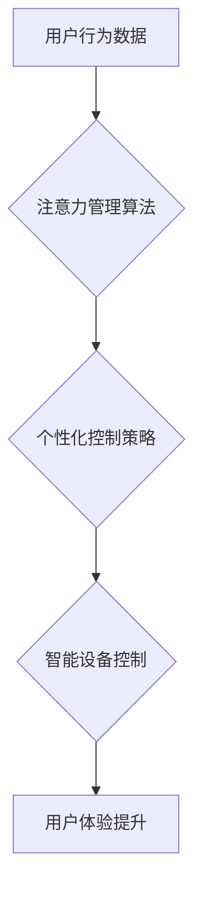

                 

## 智能家居的智能控制与注意力管理

> 关键词：智能家居、注意力管理、机器学习、自然语言处理、用户行为分析、个性化控制、隐私保护

## 1. 背景介绍

智能家居已成为现代生活的重要组成部分，它通过物联网、云计算和人工智能技术，将家庭中的各种设备和系统连接起来，实现自动化控制、远程管理和智能化服务。然而，随着智能家居设备数量的不断增加和功能的不断完善，如何有效地管理和控制这些设备，以及如何保护用户的隐私安全，成为了一个亟待解决的问题。

注意力管理是近年来备受关注的领域，它旨在帮助用户集中注意力，提高工作效率和生活质量。在智能家居场景下，注意力管理可以帮助用户更好地控制和管理智能设备，避免信息过载和决策疲劳。例如，智能家居系统可以根据用户的行为模式和偏好，自动调节灯光、温度、音乐等环境因素，营造舒适的居家氛围，并提醒用户完成重要任务，帮助用户提高注意力和效率。

## 2. 核心概念与联系

### 2.1 智能家居系统架构

智能家居系统通常由以下几个核心组件组成：

* **智能设备:** 包括各种传感器、执行器和智能终端设备，例如智能灯泡、智能音箱、智能门锁、智能空调等。
* **网络平台:** 提供设备之间的通信和数据传输，例如Wi-Fi、蓝牙、Zigbee等无线网络技术。
* **云平台:** 提供数据存储、处理和分析服务，以及用户账号管理、设备控制和远程管理等功能。
* **用户界面:** 提供用户与智能家居系统交互的界面，例如手机APP、语音助手、智能显示屏等。

### 2.2 注意力管理机制

注意力管理机制旨在帮助用户集中注意力，提高认知效率。常见的注意力管理机制包括：

* **时间管理:** 通过设定时间段和提醒机制，帮助用户合理安排时间，避免过度分心。
* **环境控制:** 通过调节灯光、温度、噪音等环境因素，营造舒适的学习或工作氛围，提高注意力集中度。
* **信息过滤:** 通过识别和过滤无关信息，减少信息干扰，帮助用户专注于重要任务。
* **行为反馈:** 通过记录用户行为数据，分析用户注意力集中度，并提供个性化的建议和反馈，帮助用户改进注意力管理策略。

### 2.3 智能家居与注意力管理的结合

智能家居系统可以结合注意力管理机制，为用户提供更加个性化、智能化的家居体验。例如，智能家居系统可以根据用户的行为模式和偏好，自动调节灯光、温度、音乐等环境因素，营造舒适的居家氛围，并提醒用户完成重要任务，帮助用户提高注意力和效率。

**Mermaid 流程图**



## 3. 核心算法原理 & 具体操作步骤

### 3.1 算法原理概述

智能家居的智能控制与注意力管理的核心算法通常基于机器学习和自然语言处理技术。

* **机器学习:** 通过训练模型，从用户行为数据中学习用户偏好和模式，并预测用户的需求和意图。
* **自然语言处理:** 理解用户的自然语言指令，并将其转换为智能设备可以执行的指令。

### 3.2 算法步骤详解

1. **数据采集:** 收集用户行为数据，例如设备使用频率、时间段、环境设置、用户反馈等。
2. **数据预处理:** 对收集到的数据进行清洗、转换和特征提取，以便于模型训练。
3. **模型训练:** 使用机器学习算法，训练模型以预测用户的需求和意图。
4. **策略生成:** 根据模型的预测结果，生成个性化的控制策略，例如自动调节灯光、温度、音乐等环境因素。
5. **设备控制:** 将控制策略发送到智能设备，执行相应的控制操作。
6. **反馈收集:** 收集用户反馈数据，并将其反馈到模型训练环节，不断优化模型性能。

### 3.3 算法优缺点

**优点:**

* **个性化控制:** 根据用户的行为模式和偏好，提供个性化的控制策略。
* **智能化服务:** 自动完成一些重复性的操作，例如自动调节灯光、温度等，提高用户体验。
* **提高效率:** 通过提醒用户完成重要任务，帮助用户提高注意力和效率。

**缺点:**

* **数据隐私:** 需要收集和处理用户的行为数据，需要确保数据的安全性和隐私性。
* **模型准确性:** 模型的准确性取决于训练数据的质量和模型的复杂度，需要不断优化模型算法和训练数据。
* **用户接受度:** 一些用户可能对智能家居系统的控制过于智能化感到不适，需要考虑用户的意愿和控制权。

### 3.4 算法应用领域

智能家居的智能控制与注意力管理算法可以应用于以下领域:

* **家庭自动化:** 自动控制灯光、温度、音乐等环境因素，营造舒适的居家氛围。
* **健康管理:** 通过监测用户的睡眠、运动、饮食等数据，提供个性化的健康建议。
* **教育辅助:** 通过智能设备和注意力管理机制，帮助用户提高学习效率和注意力集中度。
* **娱乐体验:** 通过个性化的内容推荐和环境控制，提升用户的娱乐体验。

## 4. 数学模型和公式 & 详细讲解 & 举例说明

### 4.1 数学模型构建

注意力管理算法通常使用贝叶斯网络或马尔科夫决策过程等数学模型来描述用户行为和注意力状态。

* **贝叶斯网络:** 用于表示用户行为之间的概率关系，可以根据用户的历史行为数据，预测用户的未来行为。
* **马尔科夫决策过程:** 用于描述用户与环境之间的交互过程，可以根据用户的行为和环境状态，预测用户的最佳决策。

### 4.2 公式推导过程

例如，可以使用贝叶斯网络来预测用户是否需要提醒完成重要任务。

* **状态变量:** 用户注意力状态 (A)、任务重要性 (T)、时间 (T)
* **概率分布:** P(A|T,T')、P(T)、P(T'|A,T)

其中:

* P(A|T,T') 表示用户注意力状态A在任务重要性T和时间T'下的条件概率。
* P(T) 表示任务重要性的概率分布。
* P(T'|A,T) 表示时间T'在用户注意力状态A和任务重要性T下的条件概率。

通过贝叶斯定理，可以推导出用户需要提醒完成重要任务的概率:

$$P(提醒|A,T,T') = \frac{P(A,T,T'|提醒) * P(提醒)}{P(A,T,T')}$$

### 4.3 案例分析与讲解

假设用户A在任务重要性T为高的情况下，注意力状态A为低，时间T'为下午2点，则可以使用上述公式计算用户A需要提醒完成重要任务的概率。

## 5. 项目实践：代码实例和详细解释说明

### 5.1 开发环境搭建

* 操作系统: Ubuntu 20.04
* Python 版本: 3.8
* 依赖库: TensorFlow, PyTorch, scikit-learn, NLTK

### 5.2 源代码详细实现

```python
# 导入必要的库
import tensorflow as tf
from sklearn.model_selection import train_test_split

# 定义模型结构
model = tf.keras.models.Sequential([
    tf.keras.layers.Dense(64, activation='relu', input_shape=(10,)),
    tf.keras.layers.Dense(32, activation='relu'),
    tf.keras.layers.Dense(1, activation='sigmoid')
])

# 编译模型
model.compile(optimizer='adam',
              loss='binary_crossentropy',
              metrics=['accuracy'])

# 加载训练数据
(x_train, y_train), (x_test, y_test) = train_test_split(data, labels, test_size=0.2)

# 训练模型
model.fit(x_train, y_train, epochs=10)

# 评估模型
loss, accuracy = model.evaluate(x_test, y_test)
print('Loss:', loss)
print('Accuracy:', accuracy)
```

### 5.3 代码解读与分析

* 该代码示例展示了使用TensorFlow框架训练一个简单的机器学习模型，用于预测用户是否需要提醒完成重要任务。
* 模型结构是一个多层感知机，包含三个全连接层和一个输出层。
* 训练数据包含用户的行为特征和任务重要性信息。
* 模型使用Adam优化器和二元交叉熵损失函数进行训练。
* 训练完成后，模型可以用于预测新的用户数据，并提供提醒建议。

### 5.4 运行结果展示

训练完成后，可以将模型应用于新的用户数据，并观察模型的预测结果。例如，如果模型预测用户需要提醒完成重要任务，则可以向用户发送提醒消息。

## 6. 实际应用场景

### 6.1 智能家居场景

* **个性化灯光控制:** 根据用户的活动时间和喜好，自动调节灯光亮度和色温，营造舒适的居家氛围。
* **智能温度控制:** 根据用户的温度偏好和环境温度，自动调节空调温度，保持舒适的室内温度。
* **智能音乐播放:** 根据用户的音乐偏好和活动场景，自动播放合适的音乐，提升用户的娱乐体验。

### 6.2 健康管理场景

* **睡眠监测:** 通过监测用户的睡眠时间、深度睡眠时间等数据，提供个性化的睡眠建议。
* **运动记录:** 通过监测用户的运动时间、运动强度等数据，提供个性化的运动计划。
* **饮食提醒:** 根据用户的饮食习惯和健康目标，提醒用户补充营养或控制饮食。

### 6.3 教育辅助场景

* **学习提醒:** 根据用户的学习计划和进度，提醒用户完成学习任务，提高学习效率。
* **专注力训练:** 通过调节环境因素和提供专注力训练游戏，帮助用户提高注意力集中度。
* **个性化学习:** 根据用户的学习风格和知识掌握情况，提供个性化的学习内容和学习方法。

### 6.4 未来应用展望

随着人工智能技术的不断发展，智能家居的智能控制与注意力管理将更加智能化和个性化。未来，智能家居系统将能够更加深入地理解用户的需求和意图，并提供更加精准的控制策略和个性化的服务。例如，智能家居系统将能够根据用户的情绪状态，自动调节环境因素，帮助用户放松身心；智能家居系统将能够根据用户的健康状况，提供个性化的健康建议和服务。

## 7. 工具和资源推荐

### 7.1 学习资源推荐

* **书籍:**
    * 《深度学习》 by Ian Goodfellow, Yoshua Bengio, Aaron Courville
    * 《机器学习》 by Tom Mitchell
    * 《自然语言处理》 by Jurafsky & Martin
* **在线课程:**
    * Coursera: Machine Learning, Deep Learning
    * edX: Artificial Intelligence, Natural Language Processing
    * Udacity: Artificial Intelligence Nanodegree

### 7.2 开发工具推荐

* **Python:** 广泛应用于人工智能开发，拥有丰富的库和框架。
* **TensorFlow:** Google开发的开源机器学习框架，支持多种深度学习模型。
* **PyTorch:** Facebook开发的开源机器学习框架，以其灵活性和易用性而闻名。
* **scikit-learn:** Python机器学习库，提供各种经典机器学习算法。
* **NLTK:** Python自然语言处理库，提供各种自然语言处理工具和资源。

### 7.3 相关论文推荐

* **Attention Is All You Need:** https://arxiv.org/abs/1706.03762
* **BERT: Pre-training of Deep Bidirectional Transformers for Language Understanding:** https://arxiv.org/abs/1810.04805
* **Generative Adversarial Networks:** https://arxiv.org/abs/1406.2661

## 8. 总结：未来发展趋势与挑战

### 8.1 研究成果总结

智能家居的智能控制与注意力管理领域取得了显著的进展，例如：

* 机器学习算法在用户行为预测和个性化控制方面取得了成功。
* 自然语言处理技术使得用户与智能家居系统之间的交互更加自然和便捷。
* 各种智能家居设备和平台的不断发展，为智能控制和注意力管理提供了更丰富的应用场景。

### 8.2 未来发展趋势

* **更智能的控制策略:** 利用更先进的机器学习算法和深度学习模型，开发更智能、更个性化的控制策略。
* **更深入的用户理解:** 通过更全面的用户数据收集和分析，更深入地理解用户的需求和意图。
* **更安全的隐私保护:** 开发更有效的隐私保护机制，确保用户数据的安全性和隐私性。
* **更广泛的应用场景:** 将智能家居的智能控制与注意力管理技术应用于更多领域，例如教育、医疗、娱乐等。

### 8.3 面临的挑战

* **数据隐私和安全:** 智能家居系统需要收集和处理大量的用户数据，如何确保数据的安全性和隐私性是一个重要的挑战。
* **模型准确性和鲁棒性:** 智能家居系统的模型需要能够准确预测用户的需求和意图，并能够应对各种复杂的环境变化，提高模型的鲁棒性是一个重要的挑战。
* **用户接受度和信任度:** 一些用户可能对智能家居系统的控制过于智能化感到不适，需要提高用户的接受度和信任度。

### 8.4 研究展望

未来，智能家居的智能控制与注意力管理将继续是一个重要的研究方向。随着人工智能技术的不断发展，我们相信智能家居将能够为用户提供更加智能、更加个性化的服务，提升用户的生活品质。

## 9. 附录：常见问题与解答

**Q1: 智能家居系统如何保护用户的隐私安全？**

**A1:** 智能家居系统通常采用以下措施来保护用户的隐私安全:

* 数据加密: 用户数据在传输和存储过程中进行加密，防止未经授权的访问。
* 数据匿名化: 将用户数据进行匿名处理，去除个人识别信息，保护用户的隐私。
* 数据访问控制: 设置严格的数据访问权限，只允许授权用户访问相关数据。
* 透明度和可控性: 向用户提供关于数据收集和使用方式的透明信息，并给予用户对数据访问和控制的权利。

**Q2: 智能家居系统如何避免过度控制用户？**

**A2:** 智能家居系统的设计应注重用户体验和控制权。

* 用户可自定义控制策略: 用户可以根据自己的喜好和需求，自定义智能家居系统的控制策略。
* 用户可随时关闭智能功能: 用户可以随时关闭智能家居系统的智能功能，恢复手动控制。
* 系统提供透明度和反馈: 系统应向用户提供关于智能控制决策的透明信息和反馈，帮助用户理解和信任系统。


作者：禅与计算机程序设计艺术 / Zen and the Art of Computer Programming<end_of_turn>

