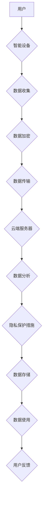

                 

## 智能设备隐私保护措施：安全处理个人信息

> 关键词：智能设备、隐私保护、数据安全、加密技术、联邦学习、差分隐私、匿名化、数据治理、隐私合规

## 1. 背景介绍

智能设备的普及，如智能手机、智能手表、智能家居等，为人们的生活带来了极大的便利。然而，这些设备也收集和处理大量个人信息，例如位置数据、健康数据、消费习惯等，这使得智能设备的隐私保护问题日益突出。

近年来，数据泄露事件频发，个人信息被滥用和出售的案例层出不穷，引发了公众对隐私安全的广泛关注。各国政府也相继出台了相关法律法规，加强对个人信息保护的监管。

智能设备的隐私保护需要从多个方面着手，包括技术层面、制度层面和用户层面。本文将重点探讨智能设备隐私保护的技术措施，旨在帮助开发者和用户更好地理解和应对智能设备带来的隐私风险。

## 2. 核心概念与联系

**2.1 核心概念**

* **个人信息:** 指识别特定自然人或可识别特定自然人的信息。
* **数据安全:** 指保护数据免受未经授权的访问、使用、披露、修改或销毁。
* **隐私保护:** 指保护个人信息免受侵犯，保障个人信息的使用权、披露权、修正权等。

**2.2 概念联系**

智能设备的隐私保护是数据安全和隐私保护的具体应用。

数据安全是保障个人信息不被恶意攻击和破坏的基础，而隐私保护则是对个人信息的使用和处理进行规范和控制，确保个人信息不被滥用和侵犯。

**2.3 架构流程图**



## 3. 核心算法原理 & 具体操作步骤

**3.1 算法原理概述**

智能设备隐私保护的核心算法主要包括：

* **加密技术:** 对个人信息进行加密，防止未经授权的访问和使用。
* **联邦学习:** 在不将原始数据传输到中央服务器的情况下，通过模型参数的迭代更新，实现机器学习模型的训练。
* **差分隐私:** 通过添加噪声，保护个人数据在聚合分析过程中的隐私。
* **匿名化:** 对个人信息进行脱敏处理，去除可识别个人身份的特征。

**3.2 算法步骤详解**

**3.2.1 加密技术**

1. 选择合适的加密算法，例如AES、RSA等。
2. 生成加密密钥。
3. 对个人信息进行加密，并将加密后的数据存储或传输。
4. 在解密时，使用相应的解密密钥解密数据。

**3.2.2 联邦学习**

1. 将训练数据分散存储在各个设备上。
2. 训练模型参数在设备上进行本地计算。
3. 将模型参数更新发送到中央服务器。
4. 中央服务器对所有设备的模型参数进行聚合，生成新的全局模型参数。
5. 将新的全局模型参数发送回各个设备，更新本地模型。
6. 重复步骤2-5，直到模型收敛。

**3.2.3 差分隐私**

1. 在数据聚合过程中，添加随机噪声。
2. 噪声的大小根据数据敏感度和隐私预算进行调整。
3. 噪声添加后，保证数据聚合结果的准确性，同时保护个体数据隐私。

**3.2.4 匿名化**

1. 识别个人信息中的敏感特征，例如姓名、身份证号码、地址等。
2. 对敏感特征进行脱敏处理，例如替换为随机值、模糊化等。
3. 确保脱敏后的数据无法识别出个体身份。

**3.3 算法优缺点**

| 算法 | 优点 | 缺点 |
|---|---|---|
| 加密技术 | 保护数据在传输和存储过程中的安全 | 加密解密过程需要消耗资源 |
| 联邦学习 | 保护原始数据不离开设备，提高隐私保护 | 模型训练效率较低 |
| 差分隐私 | 保护数据聚合过程中的隐私 | 可能影响数据聚合结果的准确性 |
| 匿名化 | 降低数据可识别性，保护个人隐私 | 可能丢失部分数据信息 |

**3.4 算法应用领域**

* **医疗保健:** 保护患者医疗记录的隐私。
* **金融服务:** 保护客户金融数据的安全。
* **智能家居:** 保护用户家庭活动数据的隐私。
* **物联网:** 保护设备传感器数据和用户行为数据的安全。

## 4. 数学模型和公式 & 详细讲解 & 举例说明

**4.1 数学模型构建**

差分隐私的数学模型基于概率论和信息论。

**4.1.1 隐私预算**

隐私预算ε是一个正实数，用来衡量允许的隐私泄露量。

**4.1.2 隐私损失**

隐私损失函数L(D,D')衡量两个数据集D和D'之间的差异。

**4.1.3 隐私预算满足条件**

一个算法满足ε-差分隐私，当且仅当对于任意两个数据集D和D'，满足以下条件：

$$
P(A(D) \neq A(D')) \leq exp(-\epsilon \cdot L(D,D'))
$$

其中A(D)表示算法A在数据集D上的输出。

**4.2 公式推导过程**

差分隐私的公式推导过程较为复杂，涉及到概率论、信息论和微积分等知识。

**4.3 案例分析与讲解**

假设我们有一个数据集包含n个用户的年龄信息，我们想计算数据集的平均年龄。

使用差分隐私算法，我们可以添加随机噪声到每个用户的年龄信息中，然后计算平均年龄。

噪声的大小根据隐私预算ε和数据集大小n进行调整。

通过添加噪声，我们可以保证平均年龄的准确性，同时保护每个用户的年龄信息隐私。

## 5. 项目实践：代码实例和详细解释说明

**5.1 开发环境搭建**

* 操作系统：Linux
* 编程语言：Python
* 库依赖：TensorFlow、PyTorch、Scikit-learn等

**5.2 源代码详细实现**

```python
# 使用TensorFlow实现联邦学习
import tensorflow as tf

# 定义模型
model = tf.keras.models.Sequential([
    tf.keras.layers.Dense(128, activation='relu'),
    tf.keras.layers.Dense(10, activation='softmax')
])

# 定义训练函数
def train_model(model, data):
    # ...

# 定义联邦学习训练流程
def federated_train(clients, epochs):
    for epoch in range(epochs):
        # ...

# 运行联邦学习训练
federated_train(clients, 10)
```

**5.3 代码解读与分析**

* 代码示例展示了使用TensorFlow实现联邦学习的简单流程。
* 训练函数负责在本地设备上训练模型。
* 联邦学习训练流程负责协调各个设备的模型训练，并更新全局模型参数。

**5.4 运行结果展示**

* 运行结果包括训练过程中模型的损失函数值和准确率等指标。
* 可以通过可视化工具展示模型训练过程中的变化趋势。

## 6. 实际应用场景

**6.1 智能家居**

智能家居设备收集用户的生活数据，例如温度、湿度、灯光控制等。

可以使用差分隐私技术保护用户隐私，例如匿名化用户行为数据，防止设备制造商或第三方获取用户个人信息。

**6.2 医疗保健**

医疗机构收集患者的医疗记录，例如病历、检查结果、治疗方案等。

可以使用加密技术保护患者医疗数据的安全，防止数据泄露和滥用。

**6.3 金融服务**

金融机构收集客户的金融数据，例如账户余额、交易记录、信用评分等。

可以使用联邦学习技术保护客户金融数据的隐私，例如在不将原始数据传输到中央服务器的情况下，训练欺诈检测模型。

**6.4 未来应用展望**

随着智能设备的普及和数据量的增长，智能设备隐私保护技术将面临更大的挑战。

未来，我们将看到更多创新性的隐私保护技术出现，例如：

* **可信计算:** 利用硬件安全机制，确保数据在计算过程中不被篡改。
* **区块链技术:** 利用区块链的去中心化和不可篡改特性，保护数据安全和隐私。
* **隐私增强计算:** 利用新的计算模型和算法，在不泄露敏感信息的情况下，实现数据分析和机器学习。

## 7. 工具和资源推荐

**7.1 学习资源推荐**

* **书籍:**

* 《隐私计算》
* 《联邦学习》

* **在线课程:**

* Coursera: 隐私计算
* edX: 联邦学习

**7.2 开发工具推荐**

* **TensorFlow Federated:** 用于联邦学习的开源框架。
* **PySyft:** 用于隐私增强计算的开源库。
* **OpenMined:** 用于隐私计算的开源平台。

**7.3 相关论文推荐**

* 《差分隐私》
* 《联邦学习》
* 《隐私增强机器学习》

## 8. 总结：未来发展趋势与挑战

**8.1 研究成果总结**

近年来，智能设备隐私保护技术取得了显著进展，例如差分隐私、联邦学习等技术已经应用于多个领域。

**8.2 未来发展趋势**

未来，智能设备隐私保护技术将朝着以下方向发展：

* **更加高效的隐私保护算法:** 提高隐私保护效率，降低计算成本。
* **更广泛的应用场景:** 将隐私保护技术应用于更多领域，例如金融、医疗、教育等。
* **更完善的隐私保护框架:** 建立更加完善的隐私保护法律法规和标准。

**8.3 面临的挑战**

智能设备隐私保护技术还面临着一些挑战：

* **技术复杂性:** 隐私保护算法的实现较为复杂，需要专业的技术人员进行开发和维护。
* **数据安全风险:** 即使使用了隐私保护技术，也无法完全保证数据安全。
* **用户隐私意识:** 用户对隐私保护的意识仍然不足，需要加强宣传和教育。

**8.4 研究展望**

未来，我们需要继续加强对智能设备隐私保护技术的研发和应用，以更好地保护用户的隐私安全。

## 9. 附录：常见问题与解答

**9.1 如何选择合适的隐私保护技术？**

选择合适的隐私保护技术需要根据具体应用场景和数据特点进行评估。

例如，对于需要保护敏感数据的应用场景，可以选择加密技术或差分隐私技术。

**9.2 如何评估隐私保护技术的有效性？**

可以通过隐私预算、隐私损失函数等指标来评估隐私保护技术的有效性。

**9.3 如何提高用户对隐私保护的意识？**

可以通过宣传教育、提供隐私设置选项、加强数据安全监管等方式来提高用户对隐私保护的意识。


作者：禅与计算机程序设计艺术 / Zen and the Art of Computer Programming 
<end_of_turn>

