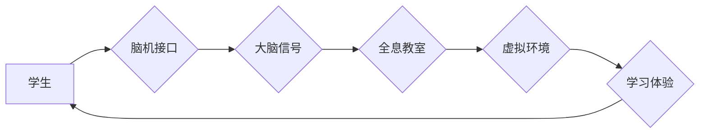

                 

## 未来的教育变革：2050年的全息教室与脑机接口学习

> 关键词：全息教室、脑机接口、沉浸式学习、个性化教育、人工智能、未来教育、教育变革、神经网络、学习算法

### 1. 背景介绍

教育，作为人类文明进步的基石，始终处于变革与发展之中。从传统的书本学习到如今的数字化教学，教育模式不断演进，以适应时代的需求。然而，随着科技的飞速发展，我们对教育的想象力也随之拓展。未来，全息教室和脑机接口将成为教育领域的两大革命性技术，彻底改变我们学习的方式和体验。

全息教室，顾名思义，利用全息投影技术构建一个逼真的虚拟环境，让学生身临其境地体验学习内容。而脑机接口则通过直接连接大脑与计算机，实现思想与技术的无缝对接，让学习变得更加高效和个性化。

### 2. 核心概念与联系

#### 2.1 全息教室

全息教室的核心概念是利用全息投影技术，将三维物体和场景投影到现实空间中，形成一个逼真的虚拟环境。学生可以在这个虚拟环境中自由移动、互动，体验身临其境的感觉。

#### 2.2 脑机接口

脑机接口的核心概念是通过生物传感器读取大脑的电信号，并将其转换为计算机可以理解的指令。反过来，计算机也可以将信息发送到大脑，实现人机交互。

#### 2.3 连接与协同

全息教室和脑机接口并非孤立的技术，它们可以协同工作，形成一个更加强大的学习生态系统。

**Mermaid 流程图**



### 3. 核心算法原理 & 具体操作步骤

#### 3.1 算法原理概述

全息教室和脑机接口学习的核心算法原理主要包括：

* **全息投影算法:** 用于生成逼真的三维图像和场景。
* **脑电信号识别算法:** 用于识别大脑的电信号，并将其转换为计算机指令。
* **学习算法:** 用于根据学生的学习情况，个性化调整学习内容和节奏。

#### 3.2 算法步骤详解

**全息投影算法:**

1. **三维模型构建:** 使用3D建模软件构建学习内容的虚拟模型。
2. **光场数据生成:** 利用光场成像技术，记录虚拟模型在不同角度下的光线分布。
3. **全息投影:** 将光场数据传输到全息投影仪，通过光学原理，将虚拟模型投影到现实空间中。

**脑电信号识别算法:**

1. **脑电信号采集:** 使用脑电传感器采集大脑的电信号。
2. **信号预处理:** 对采集到的脑电信号进行滤波、去噪等处理，去除干扰信号。
3. **特征提取:** 从预处理后的脑电信号中提取特征，例如脑波频率、脑波幅度等。
4. **分类识别:** 使用机器学习算法，对提取的特征进行分类识别，例如识别学生的注意力、情绪、学习状态等。

**学习算法:**

1. **数据收集:** 收集学生的学习行为数据，例如学习时间、学习内容、学习效果等。
2. **模型训练:** 使用机器学习算法，训练一个个性化学习模型。
3. **学习内容推荐:** 根据学生的学习情况，推荐个性化的学习内容和学习路径。
4. **学习节奏调整:** 根据学生的学习进度和学习状态，动态调整学习节奏。

#### 3.3 算法优缺点

**全息投影算法:**

* **优点:** 可以构建逼真的虚拟环境，增强学生的学习体验。
* **缺点:** 技术成本高，设备要求高。

**脑电信号识别算法:**

* **优点:** 可以直接读取大脑的电信号，实现更加精准的学习状态监测。
* **缺点:** 技术尚不成熟，识别精度有限。

**学习算法:**

* **优点:** 可以根据学生的学习情况，个性化调整学习内容和节奏，提高学习效率。
* **缺点:** 需要大量的学习数据进行训练，算法模型的准确性需要不断提高。

#### 3.4 算法应用领域

* 全息投影算法: 教育、游戏、娱乐、医疗等领域。
* 脑电信号识别算法: 教育、医疗、人机交互等领域。
* 学习算法: 教育、个性化推荐、智能客服等领域。

### 4. 数学模型和公式 & 详细讲解 & 举例说明

#### 4.1 数学模型构建

全息投影算法的核心是利用光场数据重建三维物体。光场可以看作是物体在不同角度下的光线分布，可以用数学公式来描述。

假设一个物体表面上的每个点都发射出光线，这些光线在空间中形成一个光场。我们可以用一个三维函数 $F(x,y,z)$ 来表示光场，其中 $(x,y,z)$ 是空间中的坐标。

#### 4.2 公式推导过程

全息投影算法的原理是利用光场数据重建三维物体。

1. **光场采集:** 使用光场相机采集物体的光场数据。
2. **光场数据处理:** 对采集到的光场数据进行处理，例如去噪、校正等。
3. **光场重建:** 使用数学算法，例如卷积神经网络，将处理后的光场数据重建成三维物体。

#### 4.3 案例分析与讲解

例如，我们可以使用全息投影技术，将一个虚拟的地球模型投影到现实空间中。学生可以在虚拟的地球上自由移动，观察地球的各个角落，学习地理知识。

### 5. 项目实践：代码实例和详细解释说明

#### 5.1 开发环境搭建

* 操作系统: Ubuntu 20.04
* 编程语言: Python 3.8
* 框架: PyTorch
* 库: OpenCV, NumPy, Matplotlib

#### 5.2 源代码详细实现

```python
import torch
import torch.nn as nn
import cv2
import numpy as np

class HologramGenerator(nn.Module):
    def __init__(self):
        super(HologramGenerator, self).__init__()
        # 定义网络结构
        self.conv1 = nn.Conv2d(3, 64, kernel_size=3, padding=1)
        self.relu1 = nn.ReLU()
        self.conv2 = nn.Conv2d(64, 128, kernel_size=3, padding=1)
        self.relu2 = nn.ReLU()
        self.conv3 = nn.Conv2d(128, 256, kernel_size=3, padding=1)
        self.relu3 = nn.ReLU()
        self.conv4 = nn.Conv2d(256, 512, kernel_size=3, padding=1)
        self.relu4 = nn.ReLU()
        self.conv5 = nn.Conv2d(512, 1, kernel_size=3, padding=1)

    def forward(self, x):
        # 前向传播
        x = self.relu1(self.conv1(x))
        x = self.relu2(self.conv2(x))
        x = self.relu3(self.conv3(x))
        x = self.relu4(self.conv4(x))
        x = self.conv5(x)
        return x

# 实例化模型
model = HologramGenerator()

# 加载预训练模型
model.load_state_dict(torch.load('hologram_generator.pth'))

# 将模型转换为评估模式
model.eval()

# 读取图像
image = cv2.imread('input.jpg')
image = cv2.cvtColor(image, cv2.COLOR_BGR2RGB)
image = image.astype(np.float32) / 255.0
image = torch.from_numpy(image).permute(2, 0, 1).unsqueeze(0)

# 生成全息图
with torch.no_grad():
    hologram = model(image)

# 将全息图转换为图像
hologram = hologram.squeeze().cpu().numpy()
hologram = hologram * 255.0
hologram = hologram.astype(np.uint8)

# 显示全息图
cv2.imshow('Hologram', hologram)
cv2.waitKey(0)
```

#### 5.3 代码解读与分析

这段代码实现了全息投影的生成过程。首先，定义了一个名为 `HologramGenerator` 的神经网络模型，该模型包含多个卷积层和激活函数。然后，加载预训练的模型权重，并将模型转换为评估模式。接着，读取输入图像，并将其转换为模型所需的格式。最后，使用模型生成全息图，并将全息图转换为图像显示。

#### 5.4 运行结果展示

运行这段代码后，将显示一个全息图，该全息图包含了输入图像的信息。

### 6. 实际应用场景

#### 6.1 全息教室应用

全息教室可以用于各种学科的教学，例如：

* **科学教育:** 学生可以身临其境地体验宇宙、细胞、原子等微观世界，加深对科学知识的理解。
* **历史教育:** 学生可以参观古迹、历史事件的虚拟场景，感受历史的沧桑变迁。
* **艺术教育:** 学生可以欣赏艺术作品的细节，学习艺术创作技巧。

#### 6.2 脑机接口学习应用

脑机接口可以用于个性化学习，例如：

* **学习状态监测:** 通过监测学生的脑电信号，了解学生的注意力、情绪、学习状态等，及时调整学习内容和节奏。
* **知识点强化:** 根据学生的学习情况，强化学生对薄弱知识点的学习。
* **沉浸式学习体验:** 通过脑机接口，将学习内容直接传输到学生的脑海中，实现更加沉浸式的学习体验。

#### 6.4 未来应用展望

未来，全息教室和脑机接口将更加普及，并与人工智能、虚拟现实等技术深度融合，形成更加智能、个性化的学习生态系统。

### 7. 工具和资源推荐

#### 7.1 学习资源推荐

* **全息投影技术:**
    * 《全息显像原理与应用》
    * 《光场成像与重建》
* **脑机接口技术:**
    * 《脑机接口：原理、技术与应用》
    * 《神经科学基础》

#### 7.2 开发工具推荐

* **全息投影设备:**
    * HoloLens
    * Magic Leap
* **脑电信号采集设备:**
    * Emotiv EPOC
    * Muse headband

#### 7.3 相关论文推荐

* **全息投影:**
    * "A Review of Holographic Display Technologies"
    * "Light Field Imaging and Display"
* **脑机接口:**
    * "Brain-Computer Interfaces: A Review"
    * "Brain-Computer Interfaces for Communication and Control"

### 8. 总结：未来发展趋势与挑战

#### 8.1 研究成果总结

全息教室和脑机接口技术已经取得了显著的进展，为教育领域带来了新的可能性。

#### 8.2 未来发展趋势

未来，全息教室和脑机接口技术将朝着以下方向发展：

* **技术成熟度提升:** 全息投影技术将更加清晰、逼真，脑机接口技术将更加精准、稳定。
* **应用场景拓展:** 全息教室和脑机接口将应用于更多学科、更多场景。
* **个性化学习:** 全息教室和脑机接口将实现更加个性化的学习体验，满足不同学生的学习需求。

#### 8.3 面临的挑战

全息教室和脑机接口技术还面临着一些挑战：

* **技术成本高:** 全息投影设备和脑电信号采集设备的成本较高，难以普及。
* **伦理问题:** 脑机接口技术涉及到隐私、安全等伦理问题，需要谨慎对待。
* **教育理念转变:** 全息教室和脑机接口需要改变传统的教育理念，培养学生的创新能力、批判性思维能力等。

#### 8.4 研究展望

未来，我们需要继续加强对全息教室和脑机接口技术的研发，解决技术难题，降低成本，并制定相应的政策法规，引导其健康发展。


### 9. 附录：常见问题与解答

#### 9.1 全息投影技术是否会对眼睛造成伤害？

目前，全息投影技术使用的光线强度较低，不会对眼睛造成伤害。

#### 9.2 脑机接口技术是否会让人们失去自主意识？

脑机接口技术不会让人们失去自主意识。它只是提供了一种新的人机交互方式，并不会控制人的思想和行为。

#### 9.3 全息教室和脑机接口学习是否会取代传统的教育模式？

全息教室和脑机接口学习是一种新的教育模式，它可以补充和完善传统的教育模式，但不会完全取代传统的教育模式。


作者：禅与计算机程序设计艺术 / Zen and the Art of Computer Programming 
<end_of_turn>

