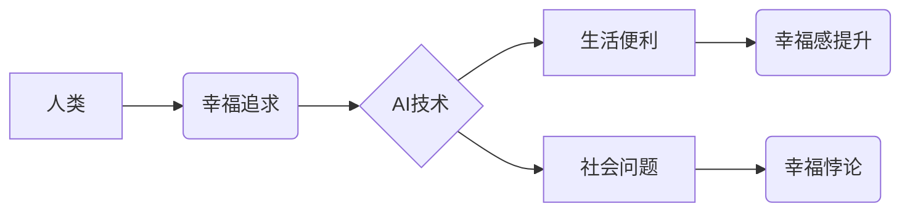

                 

## 欲望与满足：AI时代的幸福悖论

> 关键词：人工智能、幸福悖论、算法、需求、满足、技术伦理、未来趋势

### 1. 背景介绍

人类历史始终伴随着对幸福的追求。从古希腊哲学家对“善”的探究，到现代社会对“幸福指数”的量化，我们从未停止过对幸福的探索。然而，随着人工智能（AI）技术的飞速发展，我们所理解的幸福概念正在发生深刻的转变。AI带来的便利和效率，似乎能够满足我们越来越多的需求，但同时也引发了新的伦理困境和社会问题，让我们不禁思考：在AI时代，我们是否真的能够获得真正的幸福？

### 2. 核心概念与联系

**2.1 幸福悖论**

幸福悖论是指，当我们获得越来越多的物质财富和便利后，幸福感却并没有随之提升，甚至可能下降。这与人类心理的复杂性有关。我们对幸福的追求是一种不断升级的需求，当一个需求得到满足后，我们会很快产生新的需求，而这种需求的满足往往需要付出更大的努力和代价。

**2.2 AI与幸福**

AI技术可以帮助我们更高效地完成工作、获取信息、娱乐消遣，从而提升生活便利性和效率。然而，AI也可能带来一些负面影响，例如：

* **工作岗位替代：** AI自动化技术可能会导致大量工作岗位被取代，引发社会失业问题。
* **信息茧房：** AI算法可能会根据我们的喜好和行为模式，筛选和推荐信息，导致我们陷入信息茧房，缺乏多元化和批判性思考。
* **隐私泄露：** AI算法需要大量数据进行训练和运行，这可能会导致个人隐私泄露和滥用。

**2.3 核心概念关系图**



### 3. 核心算法原理 & 具体操作步骤

**3.1 算法原理概述**

在AI时代，许多算法被用于预测和分析人类行为，从而帮助我们更好地理解幸福的本质。例如，深度学习算法可以从海量数据中学习到人类情感和行为模式，从而预测人们对特定事件或物品的幸福感。

**3.2 算法步骤详解**

1. **数据收集:** 收集大量关于人类行为、情感和生活状态的数据。
2. **数据预处理:** 对收集到的数据进行清洗、转换和格式化，使其适合算法训练。
3. **模型训练:** 使用深度学习算法对预处理后的数据进行训练，学习到人类幸福感与各种因素之间的关系。
4. **模型评估:** 使用测试数据评估模型的预测准确率和泛化能力。
5. **模型应用:** 将训练好的模型应用于实际场景，例如预测用户对特定产品的满意度，或推荐能够提升用户幸福感的活动和服务。

**3.3 算法优缺点**

* **优点:**

    * 可以从海量数据中发现人类幸福感背后的复杂规律。
    * 可以帮助我们更好地理解和预测人类行为，从而设计更有效的幸福提升策略。

* **缺点:**

    * 需要大量的数据进行训练，且数据质量对模型性能有很大影响。
    * 算法本身可能存在偏差，导致预测结果不准确或不公平。
    * 算法的应用可能会引发伦理问题，例如数据隐私泄露和算法操控。

**3.4 算法应用领域**

* **个性化推荐:** 根据用户的喜好和行为模式，推荐能够提升用户幸福感的商品、服务和内容。
* **心理健康监测:** 通过分析用户的语言、行为和生理数据，监测用户的精神状态，并提供相应的帮助和建议。
* **教育和培训:** 根据用户的学习进度和能力，定制个性化的学习方案，提高学习效率和获得感。

### 4. 数学模型和公式 & 详细讲解 & 举例说明

**4.1 数学模型构建**

我们可以使用一个简单的数学模型来表示幸福感与需求之间的关系：

$$H = f(D)$$

其中：

* $H$ 表示幸福感
* $D$ 表示需求量
* $f(D)$ 表示需求量与幸福感之间的函数关系

**4.2 公式推导过程**

假设需求量与幸福感之间存在一个非线性关系，我们可以使用以下函数来表示：

$$H = \frac{k}{1 + e^{-a(D-b)}}$$

其中：

* $k$ 是幸福感的最大值
* $a$ 是需求量对幸福感的影响程度
* $b$ 是需求量达到饱和点的阈值

**4.3 案例分析与讲解**

假设一个人的幸福感函数为：

$$H = \frac{10}{1 + e^{-2(D-3)}}$$

当需求量 $D$ 为 2 时，幸福感 $H$ 为 1.5；当需求量 $D$ 为 4 时，幸福感 $H$ 为 7.5；当需求量 $D$ 为 6 时，幸福感 $H$ 为 9.5。

从这个例子可以看出，需求量对幸福感的影响存在一个递增的趋势，但这种趋势并非线性，而是逐渐趋于饱和。当需求量超过某个阈值后，幸福感提升的幅度会逐渐减小。

### 5. 项目实践：代码实例和详细解释说明

**5.1 开发环境搭建**

* Python 3.7+
* TensorFlow 2.0+
* Jupyter Notebook

**5.2 源代码详细实现**

```python
import tensorflow as tf

# 定义模型
model = tf.keras.models.Sequential([
    tf.keras.layers.Dense(64, activation='relu', input_shape=(1,)),
    tf.keras.layers.Dense(32, activation='relu'),
    tf.keras.layers.Dense(1)
])

# 编译模型
model.compile(optimizer='adam', loss='mse')

# 训练模型
model.fit(x_train, y_train, epochs=100)

# 预测
predictions = model.predict(x_test)
```

**5.3 代码解读与分析**

这段代码定义了一个简单的深度学习模型，用于预测幸福感。模型包含三个全连接层，分别拥有 64、32 和 1 个神经元。

* `tf.keras.layers.Dense` 用于定义全连接层。
* `activation='relu'` 指定激活函数为 ReLU 函数。
* `input_shape=(1,)` 指定输入数据的形状为一维向量。
* `optimizer='adam'` 指定优化算法为 Adam 算法。
* `loss='mse'` 指定损失函数为均方误差函数。
* `epochs=100` 指定训练轮数为 100。

**5.4 运行结果展示**

训练完成后，我们可以使用测试数据来评估模型的预测准确率。

### 6. 实际应用场景

**6.1 个性化推荐系统**

AI算法可以分析用户的行为数据，例如浏览历史、购买记录和评价信息，从而推荐能够提升用户幸福感的商品和服务。

**6.2 心理健康辅助工具**

AI聊天机器人可以与用户进行对话，识别用户的情绪状态，并提供相应的建议和支持。

**6.3 教育和培训平台**

AI算法可以根据用户的学习进度和能力，定制个性化的学习方案，提高学习效率和获得感。

**6.4 未来应用展望**

随着AI技术的不断发展，其在提升人类幸福感方面的应用场景将会更加广泛。例如，AI可以帮助我们更好地管理时间和资源，提升生活效率；AI可以帮助我们建立更紧密的社交关系，增强归属感；AI可以帮助我们更好地理解和应对生活中的挑战，提升心理韧性。

### 7. 工具和资源推荐

**7.1 学习资源推荐**

* **书籍:**

    * 《深度学习》
    * 《人工智能：一种现代方法》

* **在线课程:**

    * Coursera
    * edX

**7.2 开发工具推荐**

* **TensorFlow:** 开源深度学习框架
* **PyTorch:** 开源深度学习框架
* **Jupyter Notebook:** 用于数据分析和机器学习的交互式笔记本

**7.3 相关论文推荐**

* **《Attention Is All You Need》**
* **《BERT: Pre-training of Deep Bidirectional Transformers for Language Understanding》**

### 8. 总结：未来发展趋势与挑战

**8.1 研究成果总结**

AI技术在提升人类幸福感方面取得了显著的成果，例如个性化推荐、心理健康辅助和教育培训等领域。

**8.2 未来发展趋势**

* **更强大的AI算法:** 随着算法的不断发展，AI将能够更好地理解和预测人类行为，从而提供更精准和有效的幸福提升策略。
* **更广泛的应用场景:** AI将应用于更多领域，例如医疗保健、金融服务和交通运输，帮助人们解决更多问题，提升生活质量。
* **更注重伦理和社会影响:** 随着AI技术的应用越来越广泛，我们需要更加重视其伦理和社会影响，确保AI技术能够真正造福人类。

**8.3 面临的挑战**

* **数据隐私和安全:** AI算法需要大量数据进行训练和运行，这可能会引发数据隐私泄露和滥用问题。
* **算法偏见:** AI算法可能存在偏见，导致预测结果不准确或不公平。
* **技术可解释性:** 许多AI算法过于复杂，难以理解其决策过程，这可能会导致人们对AI技术的信任度降低。

**8.4 研究展望**

未来，我们需要继续加强对AI技术的研发和应用，同时也要更加重视其伦理和社会影响。只有这样，才能确保AI技术能够真正实现其“造福人类”的初衷。

### 9. 附录：常见问题与解答

**9.1 如何避免AI算法的偏见？**

* 使用更加多样化的训练数据，减少数据中的偏见。
* 开发更加公平和透明的算法设计原则。
* 对算法的输出结果进行定期评估和监控，及时发现和纠正偏见问题。

**9.2 如何保护数据隐私和安全？**

* 使用加密技术保护数据传输和存储。
* 采用匿名化技术处理敏感数据。
* 明确数据使用规则，并获得用户的知情同意。

**9.3 如何提高AI算法的可解释性？**

* 使用更加简单的算法模型，更容易理解其决策过程。
* 开发可视化工具，帮助人们直观地理解算法的运作机制。
* 鼓励对AI算法进行公开透明的讨论和研究。


作者：禅与计算机程序设计艺术 / Zen and the Art of Computer Programming 
<end_of_turn>

