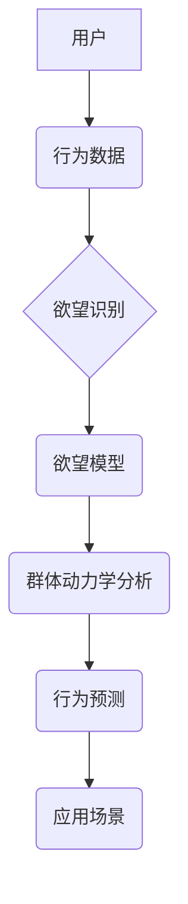

                 

## 欲望社会网络分析：AI驱动的群体动力学研究

> 关键词：社会网络分析、群体动力学、人工智能、机器学习、欲望预测、网络行为、数据挖掘、算法模型

## 1. 背景介绍

在当今信息爆炸的时代，社交网络平台已成为人们交流、分享和获取信息的重要场所。这些平台上的用户行为呈现出复杂的多样性，其中蕴含着丰富的群体动力学信息。理解用户行为背后的动机和规律，对于精准营销、舆情监测、社会治理等领域具有重要意义。

传统的社会网络分析主要关注用户之间的连接关系和信息传播路径，而对用户行为背后的“欲望”驱动机制的挖掘相对较少。随着人工智能技术的快速发展，特别是深度学习和自然语言处理领域的突破，我们能够利用海量用户数据，构建更精准的模型，预测和分析用户的欲望驱动行为。

本篇文章将探讨“欲望社会网络分析”这一新兴研究领域，介绍其核心概念、算法原理、实践案例以及未来发展趋势。

## 2. 核心概念与联系

**2.1 欲望的定义与特征**

在社会网络分析中，“欲望”指的是用户在网络平台上所追求的目标、需求和意愿。这些欲望可以是物质性的，例如购买商品、获取优惠信息；也可以是精神性的，例如获得关注、建立社交关系、表达自我。

欲望具有以下特征：

* **多层次性:** 用户的欲望可以是单一的，也可以是多方面的，相互关联和影响。
* **动态性:** 用户的欲望会随着时间推移、环境变化和个人经历而发生演变。
* **隐性性:** 用户的欲望并非总是显而易见的，需要通过行为分析和数据挖掘才能揭示。

**2.2 社会网络分析与群体动力学**

社会网络分析研究的是社会关系网络的结构和演化规律，而群体动力学则关注群体行为的产生、发展和影响因素。

欲望社会网络分析将这两者结合起来，试图通过分析用户之间的连接关系、信息传播路径以及用户行为背后的欲望驱动机制，理解群体行为的形成和演变。

**2.3 AI驱动的欲望预测**

人工智能技术，特别是机器学习和深度学习，为欲望预测提供了强大的工具。通过训练模型，我们可以从用户数据中学习出欲望与行为之间的关联规律，并预测用户的未来行为。

**2.4 核心概念架构**



## 3. 核心算法原理 & 具体操作步骤

**3.1 算法原理概述**

欲望社会网络分析的核心算法通常基于以下原理：

* **图论:** 将用户和他们的关系表示为图结构，分析节点之间的连接关系和路径。
* **机器学习:** 利用机器学习算法从用户行为数据中学习出欲望与行为之间的关联规律。
* **深度学习:** 使用深度神经网络模型，对复杂的用户行为进行更精准的预测。

**3.2 算法步骤详解**

1. **数据收集:** 收集用户在社交网络平台上的行为数据，例如用户发布的内容、点赞、评论、转发等。
2. **数据预处理:** 对收集到的数据进行清洗、转换和特征提取，例如去除噪声数据、将文本数据转换为数值向量等。
3. **欲望识别:** 利用自然语言处理技术，从用户行为数据中识别出用户的欲望，例如情感分析、主题提取、意图识别等。
4. **欲望模型构建:** 利用机器学习算法，构建一个欲望模型，将用户的欲望与行为数据进行关联。
5. **群体动力学分析:** 利用图论和网络分析方法，分析用户之间的连接关系和信息传播路径，理解群体行为的形成和演变。
6. **行为预测:** 利用训练好的模型，预测用户的未来行为，例如用户是否会购买某个商品、是否会转发某个信息等。

**3.3 算法优缺点**

**优点:**

* 能够更精准地预测用户的行为，为精准营销、舆情监测等领域提供支持。
* 可以揭示用户行为背后的欲望驱动机制，帮助我们更好地理解群体动力学。

**缺点:**

* 需要大量的用户数据进行训练，数据隐私和安全问题需要得到重视。
* 算法模型的准确性受到数据质量和算法复杂度的影响，需要不断改进和优化。

**3.4 算法应用领域**

* **精准营销:** 根据用户的欲望，精准推送广告和产品推荐。
* **舆情监测:** 监测用户对特定事件或产品的态度，及时发现潜在的风险。
* **社会治理:** 分析用户行为背后的动机，帮助政府制定更有效的政策。
* **教育研究:** 研究学生学习行为背后的动机，提高教育教学效果。

## 4. 数学模型和公式 & 详细讲解 & 举例说明

**4.1 数学模型构建**

我们可以使用图论和概率论构建一个数学模型来描述用户之间的关系和欲望驱动行为。

* **图论:** 将用户表示为节点，用户之间的关系表示为边。边权重可以表示用户之间的连接强度或相似度。
* **概率论:** 使用概率模型来描述用户行为的发生概率，例如用户点击广告的概率、用户转发信息的概率等。

**4.2 公式推导过程**

假设我们有一个包含N个用户和M条边的社交网络图。每个用户都有一个欲望向量，表示其在不同方面的欲望强度。我们可以使用以下公式来计算用户i的欲望得分：

$$
D_i = \sum_{j=1}^{M} w_{ij} * D_j
$$

其中：

* $D_i$ 是用户i的欲望得分
* $w_{ij}$ 是用户i和用户j之间的连接权重
* $D_j$ 是用户j的欲望向量

**4.3 案例分析与讲解**

例如，我们想分析用户对某个产品的购买欲望。我们可以收集用户在社交网络平台上的行为数据，例如用户对该产品的评论、点赞、转发等。

我们可以将用户表示为节点，用户之间的关系表示为边，边权重可以表示用户之间的相似度。我们可以使用上述公式计算每个用户的购买欲望得分。

通过分析用户的购买欲望得分，我们可以发现哪些用户对该产品更感兴趣，并针对这些用户进行精准营销。

## 5. 项目实践：代码实例和详细解释说明

**5.1 开发环境搭建**

* Python 3.x
* Jupyter Notebook
* NetworkX
* Scikit-learn
* TensorFlow/PyTorch

**5.2 源代码详细实现**

```python
import networkx as nx
from sklearn.linear_model import LogisticRegression
from tensorflow.keras.models import Sequential
from tensorflow.keras.layers import Dense

# 数据加载和预处理
# ...

# 图结构构建
graph = nx.Graph()
# ...

# 欲望识别
# ...

# 欲望模型构建
# 使用逻辑回归模型预测用户购买行为
model = LogisticRegression()
model.fit(X_train, y_train)

# 使用深度学习模型预测用户购买行为
model = Sequential()
model.add(Dense(64, activation='relu', input_shape=(X_train.shape[1],)))
model.add(Dense(1, activation='sigmoid'))
model.compile(loss='binary_crossentropy', optimizer='adam', metrics=['accuracy'])
model.fit(X_train, y_train, epochs=10)

# 群体动力学分析
# ...

# 行为预测
# ...
```

**5.3 代码解读与分析**

* 代码首先加载数据并进行预处理。
* 然后构建一个社交网络图，并将用户和他们的关系表示为节点和边。
* 使用机器学习算法识别用户的欲望，并构建一个欲望模型。
* 利用图论和网络分析方法进行群体动力学分析。
* 最后使用训练好的模型预测用户的未来行为。

**5.4 运行结果展示**

* 运行结果可以展示用户的购买欲望得分、群体行为趋势以及预测的购买行为。

## 6. 实际应用场景

**6.1 精准营销**

* 根据用户的欲望，精准推送广告和产品推荐。
* 例如，如果用户对某个品牌的服装感兴趣，可以推送该品牌的新品信息。

**6.2 舆情监测**

* 监测用户对特定事件或产品的态度，及时发现潜在的风险。
* 例如，如果用户对某个产品的质量出现负面评价，可以及时采取措施进行处理。

**6.3 社会治理**

* 分析用户行为背后的动机，帮助政府制定更有效的政策。
* 例如，分析用户对公共服务的满意度，可以帮助政府改进公共服务。

**6.4 未来应用展望**

* 随着人工智能技术的不断发展，欲望社会网络分析将在更多领域得到应用，例如个性化教育、医疗保健、金融服务等。


## 7. 工具和资源推荐

**7.1 学习资源推荐**

* **书籍:**
    * 《社会网络分析》
    * 《机器学习》
    * 《深度学习》
* **在线课程:**
    * Coursera: Social Network Analysis
    * edX: Machine Learning
    * Udacity: Deep Learning

**7.2 开发工具推荐**

* **Python:** 
    * NetworkX: 图论库
    * Scikit-learn: 机器学习库
    * TensorFlow/PyTorch: 深度学习库
* **其他工具:**
    * Gephi: 图像可视化工具
    * NodeXL: 社交网络分析工具

**7.3 相关论文推荐**

* **经典论文:**
    * Watts, D. J., & Strogatz, S. H. (1998). Collective dynamics of 'small-world' networks. Nature, 393(6684), 440-442.
    * Barabási, A.-L. (2005). The origin of hubs. Science, 302(5647), 469-472.
* **最新论文:**
    *  (搜索最新的欲望社会网络分析相关论文)

## 8. 总结：未来发展趋势与挑战

**8.1 研究成果总结**

欲望社会网络分析是一个新兴的研究领域，取得了一些重要的成果。

* 构建了新的数学模型和算法，能够更精准地预测用户的行为。
* 揭示了用户行为背后的欲望驱动机制，帮助我们更好地理解群体动力学。

**8.2 未来发展趋势**

* **多模态数据分析:** 将文本、图像、视频等多模态数据整合到欲望社会网络分析中，获得更全面的用户画像。
* **动态网络分析:** 研究用户关系和欲望随时间变化的动态演化规律。
* **解释性AI:** 提高欲望社会网络分析模型的解释性，帮助我们更好地理解模型的决策过程。

**8.3 面临的挑战**

* **数据隐私和安全:** 欲望社会网络分析需要大量用户数据，如何保护用户隐私和数据安全是一个重要的挑战。
* **算法公平性:** 确保欲望社会网络分析算法的公平性和公正性，避免算法歧视和偏见。
* **伦理问题:** 欲望社会网络分析可能会被用于操纵用户行为，需要认真考虑其伦理问题。

**8.4 研究展望**

欲望社会网络分析是一个充满机遇和挑战的领域，未来将会有更多的研究和应用。

## 9. 附录：常见问题与解答

* **Q1: 欲望社会网络分析与传统社会网络分析有什么区别？**

* **A1:** 传统的社会网络分析主要关注用户之间的连接关系和信息传播路径，而欲望社会网络分析则更注重用户行为背后的欲望驱动机制。

* **Q2: 欲望社会网络分析的应用场景有哪些？**

* **A2:** 欲望社会网络分析的应用场景包括精准营销、舆情监测、社会治理、个性化教育等。

* **Q3: 如何保护用户隐私和数据安全？**

* **A3:** 在进行欲望社会网络分析时，需要采取以下措施保护用户隐私和数据安全：
    *  anonymize 用户数据，去除个人识别信息。
    * 使用加密技术保护用户数据。
    * 获得用户的知情同意。

* **Q4: 欲望社会网络分析的伦理问题有哪些？**

* **A4:** 欲望社会网络分析可能会被用于操纵用户行为，例如推送虚假信息、诱导用户购买不必要的商品等。因此，需要认真考虑其伦理问题，并制定相应的规范和制度。


作者：禅与计算机程序设计艺术 / Zen and the Art of Computer Programming 
<end_of_turn>

