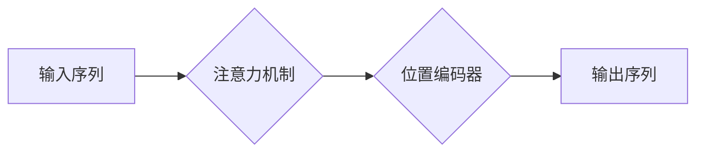

                 

## 1. 背景介绍

深度学习的蓬勃发展为人工智能领域带来了革命性的变革。其中，Transformer模型凭借其强大的序列建模能力，在自然语言处理、机器翻译、文本摘要等领域取得了突破性的进展。Transformer模型的核心在于**注意力机制**，它赋予模型理解上下文信息的能力，并有效地解决了传统循环神经网络（RNN）在长序列处理上的瓶颈。

然而，注意力机制的应用并非一帆风顺。原始的注意力机制存在一些局限性，例如：

* **缺乏位置信息：** 原始的注意力机制无法区分输入序列中词语的顺序，这对于理解句子结构和语义关系至关重要。
* **计算复杂度高：** 当序列长度较长时，注意力机制的计算复杂度会急剧增加，影响模型的效率。

为了克服这些问题，研究者们提出了许多改进方案，其中**位置编码器**和**softmax函数**扮演着至关重要的角色。

## 2. 核心概念与联系

### 2.1 注意力机制

注意力机制的核心思想是让模型关注输入序列中与当前任务最相关的部分。它通过计算每个词语与其他词语之间的相关性，并赋予每个词语不同的权重，从而突出重要信息。

### 2.2 Softmax函数

Softmax函数是一种常用的归一化函数，它将输入向量映射到一个概率分布。在注意力机制中，Softmax函数用于计算每个词语的注意力权重，使得权重之和为1，表示每个词语对当前任务的贡献程度。

### 2.3 位置编码器

位置编码器用于为输入序列中的每个词语添加位置信息。它将每个词语映射到一个向量，该向量包含该词语在序列中的位置信息。

**Mermaid 流程图**



## 3. 核心算法原理 & 具体操作步骤

### 3.1 算法原理概述

注意力机制的计算过程可以概括为以下步骤：

1. 计算每个词语与其他词语之间的相关性。
2. 使用Softmax函数将相关性值转换为注意力权重。
3. 根据注意力权重对输入序列进行加权求和，得到上下文向量。

位置编码器则将每个词语映射到一个包含位置信息的向量，并将其与词语的嵌入向量相加，形成最终的词语表示。

### 3.2 算法步骤详解

**注意力机制步骤：**

1. **计算查询（Query）、键（Key）和值（Value）:** 将输入序列中的每个词语分别映射到查询向量、键向量和值向量。
2. **计算注意力分数:** 计算每个查询向量与所有键向量的点积，得到注意力分数。
3. **归一化注意力分数:** 使用Softmax函数将注意力分数转换为注意力权重。
4. **加权求和:** 根据注意力权重对值向量进行加权求和，得到上下文向量。

**位置编码器步骤:**

1. **创建位置编码表:** 预先定义一个包含位置信息的向量表。
2. **根据词语位置获取位置编码:** 根据词语在序列中的位置，从位置编码表中获取对应的向量。
3. **将位置编码与词语嵌入向量相加:** 将位置编码向量与词语的嵌入向量相加，得到最终的词语表示。

### 3.3 算法优缺点

**优点:**

* 能够有效地捕捉长距离依赖关系。
* 能够并行计算，提高模型训练效率。
* 能够学习到更丰富的语义信息。

**缺点:**

* 计算复杂度较高，尤其是在处理长序列时。
* 训练数据量较大，需要大量的训练数据才能达到最佳效果。

### 3.4 算法应用领域

注意力机制在自然语言处理领域有着广泛的应用，例如：

* 机器翻译
* 文本摘要
* 问答系统
* 情感分析
* 代码生成

## 4. 数学模型和公式 & 详细讲解 & 举例说明

### 4.1 数学模型构建

**注意力机制的数学模型可以表示为：**

$$
\text{Attention}(Q, K, V) = \text{softmax}\left(\frac{Q K^T}{\sqrt{d_k}}\right) V
$$

其中：

* $Q$：查询矩阵
* $K$：键矩阵
* $V$：值矩阵
* $d_k$：键向量的维度
* $\text{softmax}$：Softmax函数

**位置编码器的数学模型可以表示为：**

$$
\text{Position Embedding}(pos) = PE(pos)
$$

其中：

* $pos$：词语在序列中的位置
* $PE(pos)$：预定义的位置编码向量

### 4.2 公式推导过程

**Softmax函数的推导过程:**

Softmax函数的目的是将输入向量映射到一个概率分布，即所有元素之和为1。其公式如下：

$$
\text{softmax}(x_i) = \frac{e^{x_i}}{\sum_{j=1}^{n} e^{x_j}}
$$

其中：

* $x_i$：输入向量的第i个元素
* $n$：输入向量的维度

**注意力分数的计算过程:**

注意力分数的计算是通过查询向量与键向量的点积来实现的。点积操作可以衡量两个向量的相似度。

$$
\text{Attention Score}(Q_i, K_j) = Q_i \cdot K_j
$$

其中：

* $Q_i$：查询向量的第i个元素
* $K_j$：键向量的第j个元素

### 4.3 案例分析与讲解

**举例说明:**

假设我们有一个句子“我爱学习编程”，我们想要计算每个词语对“学习”的注意力权重。

1. 将每个词语分别映射到查询向量、键向量和值向量。
2. 计算每个查询向量与所有键向量的点积，得到注意力分数。
3. 使用Softmax函数将注意力分数转换为注意力权重。
4. 根据注意力权重对值向量进行加权求和，得到“学习”的上下文向量。

通过分析上下文向量，我们可以了解“学习”这个词语在句子中的语义关系。

## 5. 项目实践：代码实例和详细解释说明

### 5.1 开发环境搭建

* Python 3.6+
* TensorFlow/PyTorch

### 5.2 源代码详细实现

```python
import tensorflow as tf

# 定义注意力机制
def attention_mechanism(query, key, value, mask=None):
    # 计算注意力分数
    scores = tf.matmul(query, key, transpose_b=True) / tf.math.sqrt(tf.shape(key)[-1])
    # 使用Softmax函数归一化注意力分数
    attention_weights = tf.nn.softmax(scores, axis=-1)
    # 根据注意力权重对值向量进行加权求和
    context_vector = tf.matmul(attention_weights, value)
    return context_vector

# 定义位置编码器
def position_embedding(pos, embedding_dim):
    # 预定义的位置编码表
    pe = tf.get_variable("pe", [10000, embedding_dim], initializer=tf.keras.initializers.glorot_uniform())
    # 根据词语位置获取位置编码向量
    pos_embedding = pe[pos]
    return pos_embedding

# 示例代码
query = tf.random.normal([3, 10])
key = tf.random.normal([3, 10])
value = tf.random.normal([3, 10])
mask = tf.zeros([3, 3])

context_vector = attention_mechanism(query, key, value, mask)
print(context_vector)

pos = tf.constant([0, 1, 2])
embedding_dim = 10
pos_embedding = position_embedding(pos, embedding_dim)
print(pos_embedding)
```

### 5.3 代码解读与分析

* `attention_mechanism`函数实现了注意力机制的核心计算过程，包括计算注意力分数、归一化注意力分数和加权求和。
* `position_embedding`函数实现了位置编码器的功能，根据词语位置获取对应的向量。
* 示例代码演示了如何使用这两个函数计算注意力权重和位置编码向量。

### 5.4 运行结果展示

运行代码后，会输出注意力权重和位置编码向量。

## 6. 实际应用场景

### 6.1 机器翻译

注意力机制可以帮助机器翻译模型更好地理解句子结构和语义关系，从而提高翻译质量。

### 6.2 文本摘要

注意力机制可以帮助文本摘要模型识别最重要的句子，并生成更准确的摘要。

### 6.3 问答系统

注意力机制可以帮助问答系统更好地理解问题和上下文，从而给出更准确的答案。

### 6.4 未来应用展望

注意力机制在未来将有更广泛的应用，例如：

* 代码生成
* 图像识别
* 语音识别

## 7. 工具和资源推荐

### 7.1 学习资源推荐

* **论文:**
    * Vaswani, A., Shazeer, N., Parmar, N., Uszkoreit, J., Jones, L., Gomez, A. N., ... & Polosukhin, I. (2017). Attention is all you need. In Advances in neural information processing systems (pp. 5998-6008).
* **博客:**
    * Jay Alammar's Blog: https://jalammar.github.io/
* **在线课程:**
    * DeepLearning.AI: https://www.deeplearning.ai/

### 7.2 开发工具推荐

* **TensorFlow:** https://www.tensorflow.org/
* **PyTorch:** https://pytorch.org/

### 7.3 相关论文推荐

* **BERT:** Devlin, J., Chang, M. W., Lee, K., & Toutanova, K. (2018). Bert: Pre-training of deep bidirectional transformers for language understanding. arXiv preprint arXiv:1810.04805.
* **GPT-3:** Brown, T. B., Mann, B., Ryder, N., Subbiah, M., Kaplan, J., Dhariwal, P., ... & Amodei, D. (2020). Language models are few-shot learners. arXiv preprint arXiv:2005.14165.

## 8. 总结：未来发展趋势与挑战

### 8.1 研究成果总结

注意力机制的提出和发展为深度学习领域带来了革命性的变革，显著提升了模型的性能。

### 8.2 未来发展趋势

* **更有效的注意力机制:** 研究者们将继续探索更有效的注意力机制，例如自注意力机制、多头注意力机制等。
* **注意力机制的应用扩展:** 注意力机制将应用于更多领域，例如计算机视觉、语音识别等。
* **注意力机制的理论研究:** 对注意力机制的理论研究将更加深入，例如注意力机制的生物学基础、注意力机制的泛化能力等。

### 8.3 面临的挑战

* **计算复杂度:** 当序列长度较长时，注意力机制的计算复杂度会急剧增加，这限制了模型的应用范围。
* **数据需求:** 注意力机制的训练需要大量的训练数据，这对于一些小规模数据集来说是一个挑战。
* **可解释性:** 注意力机制的决策过程相对复杂，难以解释模型的决策机制。

### 8.4 研究展望

未来，注意力机制的研究将更加注重以下几个方面：

* **降低计算复杂度:** 研究更有效的注意力机制，例如稀疏注意力机制、局部注意力机制等。
* **减少数据需求:** 研究更有效的训练方法，例如迁移学习、知识蒸馏等。
* **提高可解释性:** 研究注意力机制的可解释性方法，例如可视化注意力权重、分析注意力机制的决策过程等。

## 9. 附录：常见问题与解答

**常见问题:**

* **注意力机制的原理是什么？**

注意力机制的核心思想是让模型关注输入序列中与当前任务最相关的部分。

* **注意力机制的应用场景有哪些？**

注意力机制在自然语言处理领域有着广泛的应用，例如机器翻译、文本摘要、问答系统等。

* **如何理解位置编码器？**

位置编码器用于为输入序列中的每个词语添加位置信息，帮助模型理解词语的顺序。

* **注意力机制的计算复杂度如何？**

注意力机制的计算复杂度与序列长度成正比，当序列长度较长时，计算复杂度会急剧增加。

* **如何降低注意力机制的计算复杂度？**

研究更有效的注意力机制，例如稀疏注意力机制、局部注意力机制等。

**作者：禅与计算机程序设计艺术 / Zen and the Art of Computer Programming**<end_of_turn>

