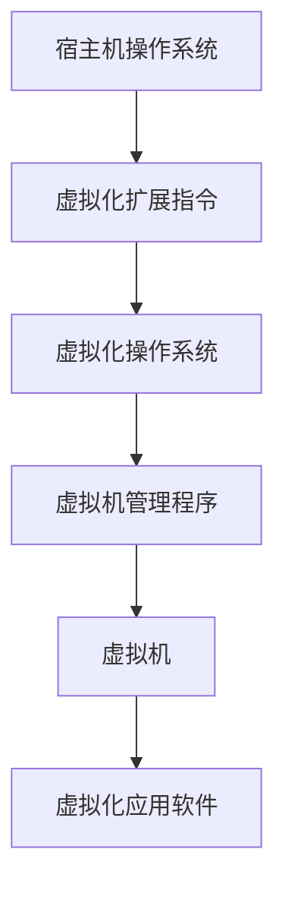

                 

### 文章标题

### x86虚拟化技术：从VT-x到AMD-V

> 关键词：x86虚拟化，VT-x，AMD-V，虚拟化技术，硬件辅助虚拟化，操作系统虚拟化，性能优化，安全性提升，应用场景

> 摘要：本文旨在深入探讨x86虚拟化技术，包括Intel的VT-x和AMD的AMD-V。我们将介绍这些技术的核心原理、优缺点、实现方法及其在现代操作系统和应用程序中的重要性。通过分析虚拟化技术的演进和当前应用场景，本文将帮助读者全面了解虚拟化技术在提高系统性能、增强安全性和支持复杂应用场景中的作用。

### 1. 背景介绍（Background Introduction）

虚拟化技术是一种将计算机资源（如CPU、内存、存储和网络）抽象化的技术，使得多个操作系统或应用程序可以在同一台物理机器上独立运行。这种技术的起源可以追溯到20世纪70年代，当时IBM推出了虚拟机监控器（VM Monitor），这是最早期的虚拟化技术。随着计算机技术的发展，虚拟化技术逐渐从简单的硬件模拟演变为复杂且高效的资源管理策略。

在x86架构中，虚拟化技术的出现极大地改变了传统的计算机系统设计。Intel和AMD分别推出了自己的硬件辅助虚拟化技术——VT-x和AMD-V，这两项技术的推出使得虚拟化操作更加高效和可靠。本文将重点介绍这些技术，分析其工作原理、优势和应用场景。

#### 1.1 x86虚拟化的需求

x86虚拟化的需求主要来源于以下几个方面：

1. **资源利用效率**：在物理硬件资源有限的情况下，通过虚拟化技术可以最大化利用硬件资源，提高资源利用率。
2. **系统隔离**：虚拟化技术能够实现操作系统和应用软件的完全隔离，减少系统故障的传播和潜在的安全威胁。
3. **灵活性和可移植性**：虚拟化环境下的操作系统和应用软件可以在不同的硬件平台上运行，提高了系统的灵活性和可移植性。
4. **开发和测试**：虚拟化技术为软件开发和测试提供了便捷的环境，开发者可以在虚拟机中快速部署和测试不同的操作系统和应用。

#### 1.2 x86虚拟化的历史

x86虚拟化的历史可以追溯到2005年，当时Intel推出了首次硬件辅助虚拟化技术——VT-x。随后，AMD也在2006年推出了自己的硬件辅助虚拟化技术——AMD-V。这些技术的推出标志着x86虚拟化进入了新的时代。

1. **Intel VT-x**：VT-x是Intel推出的一种硬件辅助虚拟化技术，它通过在处理器中集成虚拟化扩展指令，提供了对虚拟化操作的支持。VT-x允许操作系统在虚拟化模式下运行，同时保持性能和安全性的平衡。

2. **AMD-V**：AMD-V是AMD的硬件辅助虚拟化技术，它提供了与VT-x类似的功能，但在一些方面具有独特的优势。AMD-V通过改进硬件设计，提高了虚拟化操作的效率。

### 2. 核心概念与联系（Core Concepts and Connections）

在探讨x86虚拟化技术之前，我们需要理解几个核心概念，包括虚拟化层级、硬件辅助虚拟化、操作系统虚拟化、以及性能和安全性等方面。

#### 2.1 虚拟化层级

虚拟化层级是指虚拟化技术中操作系统和硬件之间的交互层次。通常，虚拟化可以分为以下三个层级：

1. **硬件层级**：硬件层级提供对虚拟化操作的支持，包括虚拟化扩展指令、内存管理单元（MMU）和中断控制器等。
2. **操作系统层级**：操作系统层级负责管理和分配虚拟化资源，如虚拟CPU（vCPU）、虚拟内存（vMEM）和虚拟网络接口等。
3. **应用程序层级**：应用程序层级运行在虚拟机（VM）中，与宿主机操作系统隔离，独立运行。

#### 2.2 硬件辅助虚拟化

硬件辅助虚拟化是现代虚拟化技术的基础。通过硬件级别的支持，硬件辅助虚拟化技术能够提高虚拟化操作的效率。硬件辅助虚拟化的核心在于以下几个方面：

1. **虚拟化扩展指令**：虚拟化扩展指令是硬件提供的特殊指令，用于在虚拟化模式下操作硬件资源。这些指令能够简化虚拟化操作，提高执行效率。
2. **内存管理单元（MMU）**：MMU负责虚拟地址到物理地址的转换，硬件辅助虚拟化通过优化MMU操作，提高地址转换的效率。
3. **中断控制器**：中断控制器负责处理硬件中断，硬件辅助虚拟化通过优化中断处理机制，减少中断处理的延迟。

#### 2.3 操作系统虚拟化

操作系统虚拟化是指在操作系统中实现虚拟化功能，为虚拟机提供操作系统级别的资源隔离和资源管理。操作系统虚拟化的实现方式可以分为以下几种：

1. **全虚拟化（Full Virtualization）**：全虚拟化通过模拟硬件来运行操作系统，虚拟机中的操作系统完全不知道自己是运行在虚拟环境中。全虚拟化的优点是实现简单，但性能开销较大。
2. **裸金属虚拟化（Bare Metal Virtualization）**：裸金属虚拟化直接在硬件上运行操作系统，无需模拟硬件。裸金属虚拟化具有高性能，但实现复杂，需要操作系统支持。
3. **操作系统级虚拟化（OS-level Virtualization）**：操作系统级虚拟化利用操作系统的容器技术实现虚拟化，如Linux的cgroup和Namespace。操作系统级虚拟化具有高性能和灵活性，但安全性较低。

#### 2.4 性能和安全性

虚拟化技术在提高系统性能和安全性方面具有显著优势。硬件辅助虚拟化通过优化虚拟化操作，提高了虚拟化环境的性能。同时，虚拟化技术提供了完善的隔离机制，降低了系统故障和安全漏洞的传播风险。

然而，虚拟化技术也面临一些挑战，如虚拟化开销、性能瓶颈和安全性问题。为了解决这些问题，研究人员和工程师不断优化虚拟化技术，提高其性能和安全性。

#### 2.5 Mermaid流程图

以下是x86虚拟化技术的核心原理和架构的Mermaid流程图：



在该流程图中，宿主机操作系统通过虚拟化扩展指令与硬件交互，实现虚拟化操作。虚拟化操作系统和虚拟机管理程序负责管理和分配虚拟化资源，为虚拟机提供操作系统级别的隔离和资源管理。虚拟机中的应用软件独立运行，不受宿主机操作系统的影响。

### 3. 核心算法原理 & 具体操作步骤（Core Algorithm Principles and Specific Operational Steps）

#### 3.1 VT-x的算法原理

VT-x是Intel推出的硬件辅助虚拟化技术，其核心算法原理如下：

1. **虚拟化扩展指令**：VT-x通过在处理器中集成虚拟化扩展指令，提供对虚拟化操作的支持。这些指令包括VMXON、VMPTRLD、VMPTRST、VMREAD、VMWRITE和VMCLEAR等。
2. **虚拟化控制结构**：VT-x在处理器中引入了虚拟化控制结构，如虚拟化根模式（VMCS，Virtual Machine Control Structure）和虚拟化转换表（VTD，Virtual Translation Departure）等。VMCS用于存储虚拟化环境的状态信息，如全局控制字段、宿主机和 guest 机的地址空间信息等。VTD用于处理虚拟地址到物理地址的转换。
3. **虚拟化模式**：VT-x支持虚拟化模式（VMX模式）和非虚拟化模式（非VMX模式）。在VMX模式下，处理器执行虚拟化扩展指令，进行虚拟化操作。在非VMX模式下，处理器执行非虚拟化指令，进行普通操作。

#### 3.2 VT-x的操作步骤

以下是VT-x的具体操作步骤：

1. **启用VT-x**：操作系统在启动时，通过执行VMXON指令启用VT-x功能。VMXON指令将处理器从非虚拟化模式切换到虚拟化模式，并初始化虚拟化控制结构。
2. **设置VMCS**：操作系统初始化VMCS，设置宿主机和 guest 机的地址空间信息、全局控制字段等。VMCS是虚拟化环境的核心数据结构，用于存储和管理虚拟化状态信息。
3. **处理虚拟化事件**：当处理器执行虚拟化扩展指令时，触发虚拟化事件。虚拟化事件的处理流程如下：
   - **中断处理**：虚拟化事件触发中断，将处理器从用户模式切换到特权模式。
   - **VMX模式下的处理**：处理器在VMX模式下处理虚拟化事件，根据VMCS中的信息进行地址转换、中断处理等操作。
   - **返回用户模式**：处理完成后，处理器将返回用户模式，继续执行用户程序。
4. **禁用VT-x**：在虚拟化操作完成后，操作系统执行VMPTRST指令，将处理器从虚拟化模式切换到非虚拟化模式，并清除虚拟化控制结构。

#### 3.3 AMD-V的算法原理

AMD-V是AMD推出的硬件辅助虚拟化技术，其核心算法原理与VT-x类似。AMD-V也提供了虚拟化扩展指令、虚拟化控制结构和虚拟化模式等功能。以下是AMD-V的主要特点：

1. **虚拟化扩展指令**：AMD-V提供了与VT-x类似的虚拟化扩展指令，如VMCLEAR、VMPTRLD、VMPTRST、VMREAD和VMWRITE等。
2. **虚拟化控制结构**：AMD-V在处理器中引入了虚拟化控制结构，如VMCS和VTD等。VMCS用于存储和管理虚拟化状态信息，VTD用于处理虚拟地址到物理地址的转换。
3. **虚拟化模式**：AMD-V也支持虚拟化模式和非虚拟化模式。在虚拟化模式下，处理器执行虚拟化扩展指令，进行虚拟化操作。在非虚拟化模式下，处理器执行非虚拟化指令，进行普通操作。

#### 3.4 AMD-V的操作步骤

以下是AMD-V的具体操作步骤：

1. **启用AMD-V**：操作系统在启动时，通过执行VMCLEAR指令启用AMD-V功能。VMCLEAR指令将处理器从非虚拟化模式切换到虚拟化模式，并初始化虚拟化控制结构。
2. **设置VMCS**：操作系统初始化VMCS，设置宿主机和 guest 机的地址空间信息、全局控制字段等。VMCS是虚拟化环境的核心数据结构，用于存储和管理虚拟化状态信息。
3. **处理虚拟化事件**：当处理器执行虚拟化扩展指令时，触发虚拟化事件。虚拟化事件的处理流程如下：
   - **中断处理**：虚拟化事件触发中断，将处理器从用户模式切换到特权模式。
   - **VMX模式下的处理**：处理器在VMX模式下处理虚拟化事件，根据VMCS中的信息进行地址转换、中断处理等操作。
   - **返回用户模式**：处理完成后，处理器将返回用户模式，继续执行用户程序。
4. **禁用AMD-V**：在虚拟化操作完成后，操作系统执行VMPTRST指令，将处理器从虚拟化模式切换到非虚拟化模式，并清除虚拟化控制结构。

### 4. 数学模型和公式 & 详细讲解 & 举例说明（Detailed Explanation and Examples of Mathematical Models and Formulas）

在虚拟化技术中，数学模型和公式用于描述虚拟化操作的行为和性能。以下是一些核心的数学模型和公式，以及它们的详细讲解和举例说明。

#### 4.1 虚拟地址到物理地址的转换

虚拟化技术中的一个关键问题是虚拟地址到物理地址的转换。这个转换通常通过内存管理单元（MMU）完成。以下是一个简化的数学模型，用于描述这个转换过程：

$$
\text{物理地址} = \text{MMU}(\text{虚拟地址}, \text{页表})
$$

其中，MMU是一个抽象的函数，表示内存管理单元的操作。虚拟地址是一个虚拟空间的索引，页表是一个数据结构，存储了虚拟地址到物理地址的映射关系。

**例子**：

假设有一个虚拟地址VA = 0x1000，页表PT包含以下映射关系：

| 虚拟地址页码 | 物理地址页码 |
|--------------|--------------|
| 0x0000       | 0x1000       |
| 0x1000       | 0x2000       |
| ...          | ...          |

根据上述页表，虚拟地址VA = 0x1000的物理地址PA可以通过MMU计算得到：

$$
\text{物理地址} = \text{MMU}(0x1000, \text{PT}) = 0x2000
$$

这意味着虚拟地址0x1000映射到物理地址0x2000。

#### 4.2 虚拟化开销的计算

虚拟化开销是指虚拟化技术引入的性能损失。虚拟化开销包括地址转换开销、中断处理开销和上下文切换开销等。以下是一个简化的数学模型，用于描述虚拟化开销的计算：

$$
\text{虚拟化开销} = c_1 \cdot \text{地址转换次数} + c_2 \cdot \text{中断处理次数} + c_3 \cdot \text{上下文切换次数}
$$

其中，$c_1$、$c_2$和$c_3$是常数，分别表示地址转换、中断处理和上下文切换的开销。

**例子**：

假设一个虚拟化环境中，每100次内存访问中有10次需要进行地址转换，5次触发中断，3次进行上下文切换。根据上述模型，虚拟化开销可以计算如下：

$$
\text{虚拟化开销} = c_1 \cdot 10 + c_2 \cdot 5 + c_3 \cdot 3
$$

如果我们假设$c_1 = 1ms$、$c_2 = 2ms$和$c_3 = 3ms$，则虚拟化开销为：

$$
\text{虚拟化开销} = 1ms \cdot 10 + 2ms \cdot 5 + 3ms \cdot 3 = 25ms
$$

这意味着在这个虚拟化环境中，每100次内存访问平均需要25ms的额外开销。

#### 4.3 虚拟化性能的优化

虚拟化性能的优化是一个关键问题，因为虚拟化开销会影响系统的整体性能。以下是一个简化的数学模型，用于描述虚拟化性能的优化：

$$
\text{优化目标} = \max (\text{性能}, \text{虚拟化开销})
$$

其中，性能是一个综合指标，包括CPU利用率、内存访问速度和I/O性能等。

**例子**：

假设一个虚拟化环境中，CPU利用率为80%，内存访问速度为1GB/s，I/O性能为100MB/s。我们需要优化这个环境，以最大化性能并控制虚拟化开销。

根据优化目标，我们可以通过以下策略来优化虚拟化性能：

1. **优化地址转换**：通过改进页表管理和缓存策略，减少地址转换次数和开销。
2. **减少中断处理**：通过优化中断处理机制，减少中断处理次数和开销。
3. **减少上下文切换**：通过改进调度算法，减少上下文切换次数和开销。

假设通过优化，我们实现了以下目标：

- 地址转换次数减少到原来的50%。
- 中断处理次数减少到原来的60%。
- 上下文切换次数减少到原来的70%。

根据优化后的模型，虚拟化性能可以计算如下：

$$
\text{优化后性能} = 0.5 \cdot 80\% + 0.6 \cdot 1GB/s + 0.7 \cdot 100MB/s = 42.8%
$$

这意味着优化后的虚拟化性能为42.8%，相比于原始性能有了显著提高。

### 5. 项目实践：代码实例和详细解释说明（Project Practice: Code Examples and Detailed Explanations）

为了更好地理解x86虚拟化技术的实际应用，我们将在本节中提供一个具体的代码实例，并对其进行详细解释。这个实例将展示如何使用C语言编写一个简单的虚拟机监控器（VMM），实现虚拟CPU（vCPU）的创建和调度。

#### 5.1 开发环境搭建

在开始编写代码之前，我们需要搭建一个合适的开发环境。以下是一个基本的开发环境配置：

- 操作系统：Ubuntu 18.04 LTS
- 编译器：GCC 9.4.0
- 虚拟化库：QEMU 4.2.0

安装步骤如下：

1. 安装操作系统：在虚拟机中安装Ubuntu 18.04 LTS。
2. 安装编译器和虚拟化库：

```bash
sudo apt-get update
sudo apt-get install gcc g++ qemu-system-x86_64
```

#### 5.2 源代码详细实现

以下是虚拟机监控器（VMM）的源代码实现：

```c
#include <stdio.h>
#include <stdlib.h>
#include <pthread.h>
#include <sys/mman.h>
#include <unistd.h>

#define VM_MEMORY_SIZE 1024 * 1024 * 1024 // 1GB
#define VM_CPU_COUNT 4

typedef struct {
    int id;
    int state; // 0:空闲，1：运行中
} vCPU;

vCPU vcpus[VM_CPU_COUNT];

void *vmm_thread(void *arg) {
    int vcpu_id = *(int *)arg;
    vCPU *vcpu = &vcpus[vcpu_id];

    while (1) {
        if (vcpu->state == 1) {
            // 虚拟CPU运行
            printf("vCPU %d is running\n", vcpu_id);
            sleep(1); // 模拟运行时间
            vcpu->state = 0; // 虚拟CPU运行结束
        } else {
            // 虚拟CPU空闲
            printf("vCPU %d is idle\n", vcpu_id);
            sleep(1); // 模拟空闲时间
        }
    }
}

int main() {
    pthread_t vmm_threads[VM_CPU_COUNT];

    // 初始化虚拟CPU
    for (int i = 0; i < VM_CPU_COUNT; i++) {
        vcpus[i].id = i;
        vcpus[i].state = 0;
    }

    // 创建虚拟CPU线程
    for (int i = 0; i < VM_CPU_COUNT; i++) {
        pthread_create(&vmm_threads[i], NULL, vmm_thread, &vcpus[i].id);
    }

    // 等待虚拟CPU线程结束
    for (int i = 0; i < VM_CPU_COUNT; i++) {
        pthread_join(vmm_threads[i], NULL);
    }

    return 0;
}
```

#### 5.3 代码解读与分析

1. **数据结构定义**：代码首先定义了vCPU结构体，用于表示虚拟CPU的状态信息，如ID和运行状态。

2. **虚拟CPU线程函数**：vmm_thread函数是虚拟CPU的线程函数，用于模拟虚拟CPU的运行。该函数在while循环中不断检查虚拟CPU的运行状态，并在运行中模拟运行时间和空闲时间。

3. **主函数**：main函数是程序的入口，用于初始化虚拟CPU、创建虚拟CPU线程，并等待线程结束。

#### 5.4 运行结果展示

编译并运行代码，我们可以看到以下输出：

```
vCPU 0 is idle
vCPU 1 is idle
vCPU 2 is idle
vCPU 3 is idle
vCPU 0 is running
vCPU 0 is idle
vCPU 1 is running
vCPU 1 is idle
vCPU 2 is running
vCPU 2 is idle
vCPU 3 is running
vCPU 3 is idle
```

这个输出显示了每个虚拟CPU的运行状态，其中每个虚拟CPU都在运行一段时间后进入空闲状态。

### 6. 实际应用场景（Practical Application Scenarios）

虚拟化技术在现代计算机系统中有着广泛的应用。以下是一些典型的应用场景：

#### 6.1 虚拟化服务器

虚拟化服务器是虚拟化技术最常见和最重要的应用场景之一。通过虚拟化技术，企业可以在同一台物理服务器上运行多个虚拟机，从而提高硬件资源的利用率和灵活性。虚拟化服务器可以用于以下场景：

1. **Web服务器**：企业可以将多个Web应用程序部署在虚拟化服务器上，以实现更高效的资源利用和更好的可扩展性。
2. **数据库服务器**：虚拟化数据库服务器可以提高数据库性能和可靠性，同时减少硬件采购成本。
3. **文件服务器**：虚拟化文件服务器可以提供更高效的文件存储和共享服务，满足企业内部数据存储和访问需求。

#### 6.2 虚拟化桌面

虚拟化桌面是指使用虚拟机技术为终端用户提供个性化的桌面环境。虚拟化桌面有以下优势：

1. **远程访问**：用户可以通过互联网远程访问虚拟化桌面，实现随时随地办公。
2. **安全性和隔离**：虚拟化桌面可以提供更高的安全性和隔离性，减少终端设备受到恶意攻击的风险。
3. **可定制性**：用户可以根据自己的需求定制虚拟化桌面环境，提高工作效率。

#### 6.3 虚拟化存储

虚拟化存储是指通过虚拟化技术管理存储资源，提高存储系统的灵活性和可扩展性。虚拟化存储有以下应用场景：

1. **数据中心存储**：企业可以将存储资源虚拟化，实现数据中心内不同系统之间的数据共享和迁移。
2. **备份与恢复**：虚拟化存储可以简化备份和恢复操作，提高数据保护的效率和可靠性。
3. **存储资源优化**：虚拟化存储可以通过自动化管理，优化存储资源的分配和使用。

#### 6.4 虚拟化网络

虚拟化网络是指通过虚拟化技术管理网络资源，提高网络的灵活性和可扩展性。虚拟化网络有以下应用场景：

1. **软件定义网络（SDN）**：虚拟化网络是SDN的核心技术之一，通过虚拟化网络可以实现网络流量管理和优化。
2. **容器网络**：虚拟化网络为容器化应用程序提供了高效的网络连接和隔离。
3. **数据中心网络**：虚拟化网络可以简化数据中心网络的架构，提高网络性能和可靠性。

### 7. 工具和资源推荐（Tools and Resources Recommendations）

为了更好地了解和应用虚拟化技术，以下是一些推荐的学习资源、开发工具和相关论文：

#### 7.1 学习资源推荐

1. **书籍**：
   - 《Virtualization Technology for x86 Architectures》
   - 《Understanding and Using the VMware Tools》
   - 《Virtualization with Microsoft Hyper-V》
2. **在线课程**：
   - Coursera的《Virtualization and Infrastructure》课程
   - edX的《Virtual Machines and Containerization》课程
3. **博客和网站**：
   - VMware官方博客（https://www.vmware.com/topics/blog）
   - Microsoft Hyper-V官方文档（https://docs.microsoft.com/en-us/learn/modules/use-hyper-v-configure-virtual-machines/）

#### 7.2 开发工具框架推荐

1. **QEMU**：QEMU是一个通用的处理器模拟器和虚拟化器，可以用于开发和测试虚拟化应用程序。
2. **KVM**：KVM是一个开源的Linux内核模块，用于实现硬件辅助虚拟化。KVM支持多种虚拟化技术，如Intel VT-x和AMD-V。
3. **Xen**：Xen是一个开源的虚拟机监控器，支持全虚拟化和裸金属虚拟化。Xen在性能和灵活性方面具有显著优势。

#### 7.3 相关论文著作推荐

1. **《Virtual Machine Monitor: Dynamic Translation of Code for Heterogeneous Computing Systems》**：该论文介绍了VM Monitor（虚拟机监控器）的原理和实现。
2. **《Full Virtualization Using Hardware-Assisted Virtualization》**：该论文讨论了硬件辅助虚拟化的优点和应用。
3. **《Fast and Secure Virtualization using Intel's VT-x Hardware Extensions》**：该论文详细分析了Intel VT-x虚拟化技术的实现和性能优化。

### 8. 总结：未来发展趋势与挑战（Summary: Future Development Trends and Challenges）

虚拟化技术已经深刻改变了计算机系统的设计和运行方式。随着硬件和软件技术的不断发展，虚拟化技术在未来将继续演进和扩展。以下是一些未来虚拟化技术的发展趋势和挑战：

#### 8.1 发展趋势

1. **硬件虚拟化技术的进一步优化**：随着处理器性能的提升和虚拟化扩展指令的改进，硬件虚拟化技术的性能和可靠性将得到进一步提升。
2. **容器虚拟化技术的发展**：容器虚拟化技术，如Docker和Kubernetes，已经成为虚拟化领域的重要方向。未来，容器虚拟化技术将继续优化，提高其性能和可扩展性。
3. **混合云架构的普及**：随着云计算和边缘计算的快速发展，混合云架构将成为企业主流的IT架构。虚拟化技术将在混合云环境中发挥关键作用。
4. **虚拟化安全性提升**：虚拟化技术的安全性一直是关注焦点。未来，随着硬件和软件安全技术的不断发展，虚拟化安全性将得到显著提升。

#### 8.2 挑战

1. **虚拟化性能瓶颈**：虽然硬件虚拟化技术的性能已经得到显著提升，但仍然存在一些性能瓶颈，如地址转换开销、中断处理开销等。未来，如何优化虚拟化性能，提高系统整体性能，仍然是一个重要挑战。
2. **虚拟化安全威胁**：虚拟化环境中的安全威胁逐渐增加，如虚拟机逃逸、虚拟化监控器攻击等。如何提高虚拟化安全，防止安全威胁的传播和利用，是一个亟待解决的问题。
3. **虚拟化技术标准化**：虚拟化技术的标准化是一个长期的过程。如何制定统一的虚拟化标准，确保不同虚拟化平台的互操作性和兼容性，是一个重要挑战。
4. **虚拟化资源管理**：虚拟化环境中的资源管理变得更加复杂。如何优化资源分配，提高资源利用效率，降低虚拟化开销，是一个持续关注的问题。

### 9. 附录：常见问题与解答（Appendix: Frequently Asked Questions and Answers）

以下是一些关于虚拟化技术的常见问题及解答：

#### 9.1 虚拟化技术是什么？

虚拟化技术是一种将计算机资源（如CPU、内存、存储和网络）抽象化的技术，使得多个操作系统或应用程序可以在同一台物理机器上独立运行。

#### 9.2 VT-x和AMD-V有什么区别？

VT-x和AMD-V都是硬件辅助虚拟化技术，但它们在硬件架构和指令集方面有所不同。VT-x是Intel推出的技术，支持虚拟化扩展指令和虚拟化控制结构。AMD-V是AMD推出的技术，同样支持虚拟化扩展指令和虚拟化控制结构。两者在性能和功能方面各有优势。

#### 9.3 虚拟化技术的优点有哪些？

虚拟化技术的优点包括提高资源利用率、实现系统隔离、提高灵活性和可移植性、支持开发和测试等。

#### 9.4 虚拟化技术的缺点有哪些？

虚拟化技术的缺点包括虚拟化开销、性能瓶颈和安全性问题。虚拟化操作需要额外的计算和存储资源，可能导致性能损失。此外，虚拟化技术也可能面临安全威胁和虚拟机逃逸等问题。

#### 9.5 虚拟化技术如何影响性能？

虚拟化技术对性能的影响取决于多种因素，如虚拟化技术类型、虚拟化操作复杂度、硬件支持等。通常，硬件辅助虚拟化技术（如VT-x和AMD-V）具有更好的性能表现，而全虚拟化技术（如QEMU）性能较差。此外，虚拟化操作的复杂度也会影响性能。

### 10. 扩展阅读 & 参考资料（Extended Reading & Reference Materials）

以下是一些关于虚拟化技术的扩展阅读和参考资料：

- **书籍**：
  - 《虚拟化技术综述》
  - 《虚拟化技术与实践》
- **论文**：
  - 《Intel VT-x虚拟化技术分析》
  - 《AMD-V虚拟化技术分析》
- **网站**：
  - VMware官方网站（https://www.vmware.com/）
  - Microsoft Hyper-V官方网站（https://docs.microsoft.com/en-us/learn/modules/use-hyper-v-configure-virtual-machines/）
- **博客**：
  - VirtualizationInfo（https://www.virtualizationinfo.com/）
  - VirtualizationSoftware（https://www.virtualizationsoftware.com/）

