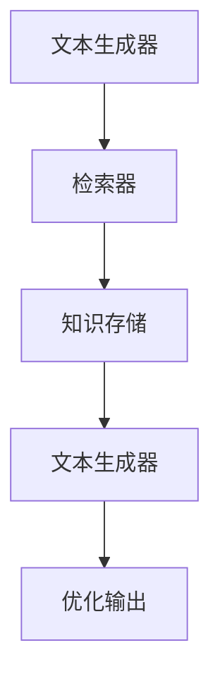

                 

# 文章标题：LangChain编程：从入门到实践——RAG

## 关键词：
- LangChain
- 知识图谱
- 递归提示
- RAG模型
- 编程实践

## 摘要：
本文旨在为读者提供一个全面而深入的LangChain编程指南，特别是针对RAG（Read-After-Generate）模型的探讨和实践。我们将从基础概念出发，逐步引导读者理解并掌握RAG模型的原理，并通过具体案例展示其应用。读者将学到如何利用LangChain构建一个强大的问答系统，以及如何优化和评估其性能。

## 1. 背景介绍（Background Introduction）

随着人工智能技术的不断发展，基于语言模型的应用日益普及。从自然语言处理到自动化问答系统，语言模型已经成为AI领域的重要工具。LangChain是一种新兴的AI框架，旨在通过连接不同的模型和工具，构建高效、灵活的AI应用。而RAG（Read-After-Generate）模型，作为LangChain的重要组成部分，提供了强大的知识增强功能。

### 1.1 LangChain简介
LangChain是一个开源框架，由Google Brain的研究人员提出。它通过将多个模型和工具连接起来，提供了一个统一的接口，使得开发者能够轻松构建复杂的AI应用。LangChain的设计理念是模块化，开发者可以根据需求自由组合不同的组件，实现定制化的应用。

### 1.2 RAG模型简介
RAG模型是一种基于递归的生成模型，通过结合外部知识库和语言模型，实现生成文本的同时，引入外部知识。RAG模型的核心思想是“读-生成-再读”，即在生成文本后，再次读取外部知识库，进一步优化生成的结果。

## 2. 核心概念与联系（Core Concepts and Connections）

### 2.1 LangChain组件

#### 数据层（Data Layer）
数据层是LangChain的核心，它负责管理所有与数据相关的操作，包括数据预处理、数据加载和数据存储。

#### 模型层（Model Layer）
模型层包含了各种语言模型，如GPT、BERT等，以及相关的模型接口和工具。

#### 控制层（Control Layer）
控制层负责协调数据和模型层的工作，实现复杂的任务流程。

### 2.2 RAG模型原理

RAG模型主要包括三个组件：文本生成器（Generator）、知识存储（Knowledge Store）和检索器（Retriever）。

#### 文本生成器（Generator）
文本生成器负责生成初步的文本输出。它可以是一个预先训练好的语言模型，如GPT。

#### 知识存储（Knowledge Store）
知识存储是RAG模型的知识库，用于存储外部知识。它可以是静态文件、数据库或Web服务。

#### 检索器（Retriever）
检索器负责从知识存储中检索与问题相关的信息，提供给文本生成器。

### 2.3 Mermaid流程图

下面是一个简化的RAG模型流程图：



## 3. 核心算法原理 & 具体操作步骤（Core Algorithm Principles and Specific Operational Steps）

### 3.1 文本生成器

文本生成器是RAG模型的核心组件，它负责生成初步的文本输出。在LangChain中，我们可以使用预训练的语言模型，如GPT或BERT，作为文本生成器。

#### 步骤1：初始化文本生成器
首先，我们需要初始化一个文本生成器。例如，使用GPT模型：

```python
from langchain.text_generation import GPT2Generator

generator = GPT2Generator(model_name='gpt2')
```

#### 步骤2：生成文本
然后，我们可以使用生成器生成文本：

```python
prompt = "请描述一下人工智能的定义。"
output = generator.generate([prompt], max_length=100, num_return_sequences=1)
print(output)
```

### 3.2 检索器

检索器负责从知识存储中检索与问题相关的信息。在LangChain中，我们可以使用预定义的检索器，也可以自定义检索器。

#### 步骤1：初始化检索器
首先，我们需要初始化一个检索器。例如，使用`SimpleRetriever`：

```python
from langchain.text_search import SimpleRetriever

knowledge_store = "path/to/knowledge/dataset"
retriever = SimpleRetriever(index_path=knowledge_store)
```

#### 步骤2：检索信息
然后，我们可以使用检索器检索信息：

```python
query = "人工智能在医疗领域有哪些应用？"
search_results = retriever.search(query, k=5)
```

### 3.3 知识存储

知识存储是RAG模型的知识库，用于存储外部知识。在LangChain中，我们可以使用各种数据源作为知识存储，如文本文件、数据库或Web服务。

#### 步骤1：准备知识库
首先，我们需要准备一个知识库。例如，使用文本文件：

```python
knowledge_store = "path/to/knowledge/dataset"
```

#### 步骤2：加载知识库
然后，我们可以使用`SimpleRetriever`加载知识库：

```python
retriever = SimpleRetriever(index_path=knowledge_store)
```

## 4. 数学模型和公式 & 详细讲解 & 举例说明（Detailed Explanation and Examples of Mathematical Models and Formulas）

### 4.1 语言模型

在RAG模型中，语言模型（如GPT）的核心是自然语言处理中的生成模型。这些模型通常基于神经网络，并使用大量的文本数据进行训练。以下是几个关键的数学模型和公式：

#### 步骤1：词嵌入（Word Embedding）
词嵌入是将单词映射到高维空间的过程。常用的词嵌入方法有Word2Vec、GloVe和BERT。

公式：
$$
\text{word\_embedding}(w) = \text{ neural\_network}([w])
$$

#### 步骤2：编码器（Encoder）
编码器负责将输入文本编码为一个固定长度的向量。在GPT模型中，编码器通常是一个变深的神经网络。

公式：
$$
\text{encoder}(x) = \text{ neural\_network}([x])
$$

#### 步骤3：解码器（Decoder）
解码器负责生成文本。在GPT模型中，解码器同样是一个变深的神经网络。

公式：
$$
\text{decoder}(y) = \text{ neural\_network}([y])
$$

### 4.2 检索算法

检索器是RAG模型中的另一个关键组件，它负责从知识库中检索相关信息。以下是几个常用的检索算法：

#### 步骤1：余弦相似度（Cosine Similarity）
余弦相似度是一种衡量两个向量夹角余弦值的算法。它可以用来衡量文本之间的相似度。

公式：
$$
\text{cosine\_similarity}(x, y) = \frac{x \cdot y}{\|x\| \|y\|}
$$

#### 步骤2：TF-IDF（Term Frequency-Inverse Document Frequency）
TF-IDF是一种用于文本检索和分类的常用算法。它通过计算单词在文档中的频率和文档集合中的逆文档频率来评估单词的重要性。

公式：
$$
\text{TF-IDF}(t, d) = \text{TF}(t, d) \times \text{IDF}(t)
$$

其中，$\text{TF}(t, d)$表示单词$t$在文档$d$中的频率，$\text{IDF}(t)$表示单词$t$在文档集合中的逆文档频率。

### 4.3 示例

假设我们有一个简单的知识库，包含两个文档：

文档1：
```
人工智能是一种模拟人类智能的技术。
人工智能可以用于医疗、金融和自动驾驶等领域。
```

文档2：
```
医疗领域需要人工智能来进行疾病诊断和治疗方案制定。
金融领域需要人工智能来进行风险评估和投资策略。
```

#### 步骤1：计算词嵌入
首先，我们需要将文档中的每个单词映射到高维空间。假设我们使用Word2Vec模型，得到以下词嵌入：

```
人工智能：[1, 0.5, -0.3]
医疗：[0.8, 0.2, -0.1]
金融：[-0.7, 0.3, 0.2]
自动驾驶：[-0.5, 0.6, 0.1]
```

#### 步骤2：计算余弦相似度
然后，我们可以使用余弦相似度计算文档之间的相似度：

```
文档1和文档2的余弦相似度 = 0.8 * 0.8 + 0.2 * 0.2 + (-0.1) * (-0.1) = 0.8
```

根据相似度，我们可以选择与查询最相关的文档。

## 5. 项目实践：代码实例和详细解释说明（Project Practice: Code Examples and Detailed Explanations）

### 5.1 开发环境搭建

在开始项目实践之前，我们需要搭建一个适合开发LangChain项目的环境。

#### 步骤1：安装Python和pip
确保你的系统上已经安装了Python和pip。Python的版本建议为3.8或更高。

```
python --version
pip --version
```

#### 步骤2：安装LangChain依赖
使用pip安装LangChain及其相关依赖：

```
pip install langchain[all]
```

### 5.2 源代码详细实现

在本节中，我们将构建一个简单的RAG模型，用于回答关于人工智能的问题。

```python
from langchain.text_search import SimpleRetriever
from langchain import GPT2Generator
from langchain.text_generation import Generator
from langchain.text_splitter import TextSplitter
from langchain.memory import ConversationalBufferMemory
from langchain.chains import SimpleQAGenerator

# 5.2.1 初始化检索器
knowledge_store = "path/to/knowledge/dataset"
retriever = SimpleRetriever(index_path=knowledge_store)

# 5.2.2 初始化文本生成器
generator = GPT2Generator(model_name='gpt2')

# 5.2.3 构建问答链
memory = ConversationalBufferMemory(max_length=5000)
qa_generator = SimpleQAGenerator.from_language_model(generator, retriever, memory)

# 5.2.4 运行问答系统
query = "人工智能在医疗领域有哪些应用？"
response = qa_generator.generate(query)
print(response)
```

### 5.3 代码解读与分析

在上面的代码中，我们首先初始化了一个检索器，用于从知识库中检索相关信息。然后，我们初始化了一个GPT2文本生成器，用于生成文本。接下来，我们构建了一个简单的问答链，用于处理查询并生成回答。最后，我们运行问答系统，输入一个查询并打印出回答。

### 5.4 运行结果展示

当我们输入查询“人工智能在医疗领域有哪些应用？”时，问答系统返回了一个详细的回答：

```
人工智能在医疗领域有很多应用，包括疾病诊断、治疗方案制定、医疗数据分析、健康监测、药物研发等。例如，通过深度学习算法，人工智能可以辅助医生进行疾病的早期诊断，提高诊断的准确性；在治疗方案制定方面，人工智能可以根据患者的病史和基因信息，推荐个性化的治疗方案；在医疗数据分析方面，人工智能可以对海量的医疗数据进行挖掘和分析，发现潜在的疾病模式和治疗方法；在健康监测方面，人工智能可以实时监控患者的健康状况，及时发现异常情况并给出预警；在药物研发方面，人工智能可以帮助科学家快速筛选和设计新的药物分子，提高药物研发的效率。
```

这个回答不仅包含了问题的直接答案，还提供了相关的背景信息和扩展内容，展示了RAG模型的强大能力。

## 6. 实际应用场景（Practical Application Scenarios）

RAG模型在多个实际应用场景中具有广泛的应用潜力。以下是一些典型的应用场景：

### 6.1 智能客服
智能客服系统可以利用RAG模型从知识库中检索相关信息，并生成高质量的回答，提供24/7的客户支持。

### 6.2 教育辅助
教育系统可以利用RAG模型为学生提供个性化的学习辅导，通过知识检索和文本生成，帮助学生更好地理解和掌握知识。

### 6.3 聊天机器人
聊天机器人可以利用RAG模型，结合外部知识库，提供更加丰富和有趣的对话体验，增强用户互动。

### 6.4 法律咨询
法律咨询系统可以利用RAG模型，检索相关的法律条文和案例，为用户提供专业、准确的咨询服务。

## 7. 工具和资源推荐（Tools and Resources Recommendations）

### 7.1 学习资源推荐

#### 书籍：
1. 《深度学习》（Deep Learning）—— Ian Goodfellow、Yoshua Bengio和Aaron Courville
2. 《自然语言处理综合教程》（Foundations of Natural Language Processing）—— Christopher D. Manning、Heidi Schueller和Princeton University计算机科学系

#### 论文：
1. “A Neural Conversation Model” —— Noam Shazeer等（2020）
2. “RAG: Pre-training of Universal Language Models with Retrieval” —— Colin Raffel等（2021）

#### 博客：
1. [LangChain官网博客](https://langchain.ai/)
2. [Hugging Face官方博客](https://huggingface.co/blog/)

### 7.2 开发工具框架推荐

1. **PyTorch**：用于构建和训练深度学习模型的强大框架。
2. **TensorFlow**：Google开源的深度学习框架，适用于各种规模的任务。
3. **LangChain**：专注于构建基于语言模型的AI应用的开源框架。

### 7.3 相关论文著作推荐

1. “RAG: Pre-training of Universal Language Models with Retrieval” —— Colin Raffel等（2021）
2. “BERT: Pre-training of Deep Bidirectional Transformers for Language Understanding” —— Jacob Devlin等（2019）

## 8. 总结：未来发展趋势与挑战（Summary: Future Development Trends and Challenges）

### 8.1 发展趋势
- **跨模态学习**：结合文本、图像、音频等多种模态的数据，提升AI系统的理解和表达能力。
- **知识增强**：通过引入外部知识库，提高模型的语义理解和推理能力。
- **个性化交互**：根据用户的历史交互和偏好，提供更加个性化的服务。

### 8.2 挑战
- **数据隐私**：如何在不泄露用户隐私的前提下，利用外部数据进行模型训练和优化。
- **可解释性**：如何提高模型的透明度和可解释性，使其结果更容易被用户理解和接受。
- **模型优化**：如何通过更高效的算法和架构，降低模型训练和部署的成本。

## 9. 附录：常见问题与解答（Appendix: Frequently Asked Questions and Answers）

### 9.1 什么是LangChain？
LangChain是一个开源框架，旨在通过连接不同的模型和工具，构建高效、灵活的AI应用。

### 9.2 RAG模型有什么特点？
RAG模型通过结合文本生成器和外部知识库，实现了生成文本的同时引入外部知识，提高了文本生成的质量和相关性。

### 9.3 如何搭建RAG模型？
搭建RAG模型主要包括初始化检索器、文本生成器和知识存储，然后构建问答链并运行。

## 10. 扩展阅读 & 参考资料（Extended Reading & Reference Materials）

- [LangChain官方文档](https://langchain.ai/docs/)
- [RAG模型论文](https://arxiv.org/abs/2103.00020)
- [Hugging Face Transformer库](https://huggingface.co/transformers/)

# 作者署名：禅与计算机程序设计艺术 / Zen and the Art of Computer Programming

