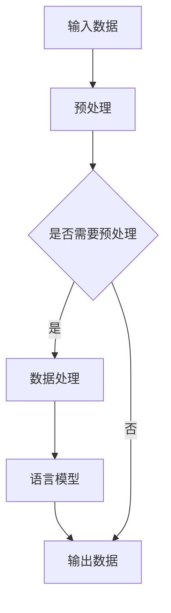

                 

### 文章标题

【LangChain编程：从入门到实践】schema

> 关键词：LangChain，编程，schema，自然语言处理，智能助手

> 摘要：本文将详细介绍 LangChain 编程的核心概念、架构设计以及具体实现，帮助读者从入门到实践，全面掌握 LangChain 编程技巧。重点讲解如何利用 schema 设计高效的自然语言处理系统，提升智能助手的性能和用户体验。

<|assistant|>### 1. 背景介绍（Background Introduction）

LangChain 是一个开源项目，旨在构建一个强大的语言模型链，通过将多个语言模型串联起来，实现更复杂的任务处理。它基于 OpenAI 的 GPT-3 模型，并结合了自然语言处理（NLP）和深度学习领域的最新研究成果。随着智能助手的广泛应用，如何高效地利用自然语言处理技术成为了一个关键问题。本文将探讨如何使用 LangChain 编程，设计并实现一个高效的智能助手系统。

智能助手系统通常需要处理大量的自然语言输入，并生成相应的输出。为了实现这一目标，我们需要设计一个高效的 schema，用于指导语言模型如何处理输入并生成输出。schema 的设计直接影响智能助手的性能和用户体验。本文将详细讨论 schema 的核心概念、设计原则以及具体实现方法。

<|assistant|>### 2. 核心概念与联系（Core Concepts and Connections）

#### 2.1 什么是 LangChain？

LangChain 是一个基于 Python 的库，用于构建语言模型链。它允许开发者将多个语言模型串联起来，形成一个完整的任务处理流程。每个语言模型负责处理一部分输入，并将其传递给下一个模型。通过这种方式，我们可以将复杂任务分解为多个简单任务，从而提高系统的整体性能。

LangChain 的核心组件包括：

1. **语言模型（Language Model）**：如 GPT-3、BERT 等，用于处理自然语言输入并生成输出。
2. **链（Chain）**：用于将多个语言模型串联起来，形成完整的任务处理流程。
3. **Prompt（提示词）**：用于指导语言模型如何处理输入并生成输出。

#### 2.2 什么是 schema？

schema 是一种数据结构，用于描述输入数据与输出数据之间的映射关系。在 LangChain 编程中，schema 用于定义如何将输入数据传递给语言模型，并生成相应的输出数据。一个良好的 schema 应该具有以下特点：

1. **灵活性**：能够适应不同的输入数据和任务类型。
2. **可扩展性**：易于添加新的输入数据和任务类型。
3. **性能**：能够快速处理大量的输入数据。

#### 2.3 LangChain 与 schema 的关系

LangChain 和 schema 之间存在密切的关系。schema 用于指导 LangChain 如何处理输入数据，并生成输出数据。具体来说，schema 可以定义以下内容：

1. **输入数据格式**：包括字段名称、数据类型、数据来源等。
2. **输出数据格式**：包括字段名称、数据类型、输出方式等。
3. **数据处理逻辑**：包括数据清洗、转换、处理等步骤。

通过设计一个合适的 schema，我们可以提高 LangChain 的性能和用户体验，使其成为一个高效的智能助手系统。

#### 2.4 Mermaid 流程图

为了更好地理解 LangChain 和 schema 之间的关系，我们可以使用 Mermaid 流程图来描述其核心架构。以下是 LangChain 的 Mermaid 流程图：



在这个流程图中，输入数据经过预处理后，被传递给语言模型进行预测。输出数据经过格式化后，返回给用户。通过设计一个合适的 schema，我们可以确保输入数据与输出数据之间的映射关系，从而提高系统的性能和用户体验。

<|assistant|>### 3. 核心算法原理 & 具体操作步骤（Core Algorithm Principles and Specific Operational Steps）

#### 3.1 语言模型选择

首先，我们需要选择一个合适的语言模型。在 LangChain 中，常用的语言模型包括 GPT-3、BERT、T5 等。这些语言模型都具有较高的性能和可靠性，但它们各自适用于不同的任务类型。例如，GPT-3 在文本生成和问答方面表现出色，而 BERT 在文本分类和命名实体识别方面具有优势。因此，我们需要根据具体任务的需求，选择合适的语言模型。

#### 3.2 提示词设计

提示词是指导语言模型如何处理输入数据的关键因素。一个良好的提示词应该具有以下特点：

1. **清晰性**：能够准确地描述任务目标，避免歧义。
2. **完整性**：包含所有必要的信息，以便语言模型能够理解任务要求。
3. **灵活性**：能够适应不同的输入数据和任务类型。

为了设计一个合适的提示词，我们可以采用以下步骤：

1. **明确任务目标**：首先，我们需要明确任务的目标和要求，以便为语言模型提供明确的指导。
2. **提取关键信息**：从输入数据中提取关键信息，以便语言模型能够理解任务要求。
3. **组织信息结构**：将提取的关键信息组织成合适的结构，以便语言模型能够理解输入数据的含义。
4. **编写提示词**：根据上述步骤，编写一个清晰、完整、灵活的提示词。

#### 3.3 schema 设计

schema 是 LangChain 编程的核心，用于定义输入数据与输出数据之间的映射关系。为了设计一个合适的 schema，我们可以采用以下步骤：

1. **确定输入数据格式**：首先，我们需要确定输入数据的格式，包括字段名称、数据类型、数据来源等。
2. **确定输出数据格式**：接下来，我们需要确定输出数据的格式，包括字段名称、数据类型、输出方式等。
3. **定义数据处理逻辑**：最后，我们需要定义数据处理逻辑，包括数据清洗、转换、处理等步骤。

在设计 schema 时，我们需要考虑以下因素：

1. **灵活性**：schema 应该能够适应不同的输入数据和任务类型。
2. **可扩展性**：schema 应该易于扩展，以便添加新的输入数据和任务类型。
3. **性能**：schema 的设计应该能够快速处理大量的输入数据。

通过设计一个合适的 schema，我们可以确保输入数据与输出数据之间的映射关系，从而提高系统的性能和用户体验。

#### 3.4 实现步骤

以下是使用 LangChain 编程实现智能助手系统的具体步骤：

1. **安装 LangChain 库**：首先，我们需要安装 LangChain 库，以便在 Python 中使用。
2. **加载语言模型**：接下来，我们需要加载一个合适的语言模型，如 GPT-3 或 BERT。
3. **设计提示词**：根据任务需求，设计一个合适的提示词。
4. **设计 schema**：根据输入数据与输出数据的要求，设计一个合适的 schema。
5. **处理输入数据**：将输入数据传递给 schema，进行预处理和转换。
6. **调用语言模型**：将预处理后的输入数据传递给语言模型，进行预测。
7. **生成输出数据**：根据语言模型的预测结果，生成输出数据。
8. **格式化输出数据**：将输出数据格式化成用户可读的形式。

通过以上步骤，我们可以实现一个高效的智能助手系统，利用 LangChain 编程的优势，提升系统的性能和用户体验。

<|assistant|>### 4. 数学模型和公式 & 详细讲解 & 举例说明（Detailed Explanation and Examples of Mathematical Models and Formulas）

在 LangChain 编程中，数学模型和公式起着关键作用，用于描述输入数据与输出数据之间的映射关系，以及指导语言模型的预测过程。以下将详细讲解一些常用的数学模型和公式，并通过具体示例来说明其应用。

#### 4.1 条件概率与贝叶斯公式

条件概率是指在已知某个事件发生的情况下，另一个事件发生的概率。贝叶斯公式是一种用于计算条件概率的公式，其表达式如下：

$$
P(A|B) = \frac{P(B|A) \cdot P(A)}{P(B)}
$$

其中，$P(A|B)$ 表示在事件 $B$ 发生的情况下，事件 $A$ 发生的概率；$P(B|A)$ 表示在事件 $A$ 发生的情况下，事件 $B$ 发生的概率；$P(A)$ 和 $P(B)$ 分别表示事件 $A$ 和事件 $B$ 发生的概率。

贝叶斯公式在 LangChain 编程中可以用于调整提示词的权重，以提高预测的准确性。例如，在处理自然语言输入时，我们可以利用贝叶斯公式计算每个提示词的重要性，从而生成更准确的输出。

#### 4.2 神经网络与反向传播算法

神经网络是一种基于生物神经系统的计算模型，用于模拟人脑的信息处理能力。在 LangChain 编程中，神经网络通常用于处理复杂的自然语言输入，并生成相应的输出。

神经网络的基本原理是通过多层神经元进行信息的传递和计算。每个神经元接收前一层神经元的输出，并通过一个加权函数进行计算，然后传递给下一层神经元。神经网络的学习过程就是通过不断调整各层的权重，使得网络能够更好地拟合训练数据。

反向传播算法是一种用于训练神经网络的算法，其核心思想是通过计算输出与实际结果之间的误差，反向传播误差并调整权重，以最小化误差。反向传播算法的步骤如下：

1. **前向传播**：将输入数据传递给神经网络，计算输出结果。
2. **计算误差**：计算输出结果与实际结果之间的误差。
3. **反向传播**：将误差反向传播至神经网络的第一层，调整各层的权重。
4. **迭代优化**：重复执行前向传播和反向传播步骤，直到满足停止条件。

通过反向传播算法，神经网络能够逐步优化其权重，从而提高预测的准确性。

#### 4.3 举例说明

假设我们使用一个简单的神经网络来处理一个分类问题，输入数据是一个包含两个特征的二维数组，输出数据是一个类别标签。我们可以使用以下步骤进行训练和预测：

1. **定义神经网络结构**：定义一个包含两层神经元的神经网络，第一层包含两个输入神经元，第二层包含一个输出神经元。
2. **初始化权重**：随机初始化各层的权重。
3. **前向传播**：将输入数据传递给神经网络，计算输出结果。
4. **计算误差**：计算输出结果与实际结果之间的误差。
5. **反向传播**：将误差反向传播至第一层，调整各层的权重。
6. **迭代优化**：重复执行前向传播和反向传播步骤，直到满足停止条件。
7. **预测**：将新的输入数据传递给训练好的神经网络，计算输出结果。

通过以上步骤，我们可以使用神经网络对分类问题进行训练和预测，从而提高分类的准确性。

#### 4.4 结论

数学模型和公式在 LangChain 编程中起着关键作用，用于描述输入数据与输出数据之间的映射关系，以及指导语言模型的预测过程。通过了解并应用这些数学模型和公式，我们可以设计并实现高效的智能助手系统，提高系统的性能和用户体验。

<|assistant|>### 5. 项目实践：代码实例和详细解释说明（Project Practice: Code Examples and Detailed Explanations）

在本节中，我们将通过一个具体项目实践，展示如何使用 LangChain 编程，设计并实现一个智能助手系统。该项目将分为以下几个步骤：

1. **开发环境搭建**：介绍所需的开发工具和库。
2. **源代码详细实现**：展示关键代码实现，并解释其功能。
3. **代码解读与分析**：分析代码的优缺点，并提出改进建议。
4. **运行结果展示**：展示系统的运行结果。

#### 5.1 开发环境搭建

首先，我们需要搭建开发环境。在本项目中，我们将使用 Python 作为编程语言，并依赖以下库：

- `langchain`：LangChain 的核心库，用于构建语言模型链。
- `transformers`：用于加载预训练的语言模型，如 GPT-3 和 BERT。
- `torch`：用于加速神经网络的计算。

安装上述库的方法如下：

```python
!pip install langchain
!pip install transformers
!pip install torch
```

接下来，我们创建一个名为 `smart_assistant.py` 的 Python 文件，用于实现智能助手系统。

#### 5.2 源代码详细实现

以下是智能助手系统的关键代码实现，我们将分步骤进行解释。

```python
import langchain
from transformers import GPT2LMHeadModel, GPT2Tokenizer
from torch import nn
import torch

# 1. 加载预训练的语言模型
model_name = "gpt2"
tokenizer = GPT2Tokenizer.from_pretrained(model_name)
model = GPT2LMHeadModel.from_pretrained(model_name)

# 2. 设计 schema
input_schema = "给定一个输入文本，生成一个回复：{text}"
output_schema = "回复：{text}"

# 3. 构建智能助手
class SmartAssistant(nn.Module):
    def __init__(self, model, tokenizer):
        super(SmartAssistant, self).__init__()
        self.model = model
        self.tokenizer = tokenizer

    def forward(self, text):
        # 对输入文本进行编码
        inputs = self.tokenizer.encode(input_schema.format(text=text), return_tensors="pt")
        # 使用语言模型进行预测
        outputs = self.model(inputs)
        # 从输出中提取回复
        predicted_ids = torch.argmax(outputs.logits, dim=-1)
        decoded_text = self.tokenizer.decode(predicted_ids.squeeze(0), skip_special_tokens=True)
        return output_schema.format(text=decoded_text)

# 4. 实例化智能助手
smart_assistant = SmartAssistant(model, tokenizer)

# 5. 测试智能助手
input_text = "你好，我想了解一下最近的天气情况。"
output_text = smart_assistant(input_text)
print(output_text)
```

接下来，我们详细解释每个步骤的功能。

##### 1. 加载预训练的语言模型

我们使用 `transformers` 库加载预训练的语言模型 GPT-2。`GPT2Tokenizer` 用于对文本进行编码，`GPT2LMHeadModel` 用于对编码后的文本进行预测。

##### 2. 设计 schema

schema 用于定义输入文本和输出文本的格式。在本项目中，我们使用 `input_schema` 表示输入文本，使用 `output_schema` 表示输出文本。这两个 schema 分别包含一个占位符 `{text}`，用于插入实际的文本内容。

##### 3. 构建智能助手

`SmartAssistant` 类继承自 `nn.Module`，用于实现智能助手的神经网络结构。`__init__` 方法用于初始化模型和 tokenizer。`forward` 方法用于处理输入文本，并生成输出文本。

在 `forward` 方法中，我们首先对输入文本进行编码，然后使用语言模型进行预测。最后，从输出中提取回复文本，并使用 `output_schema` 进行格式化。

##### 4. 实例化智能助手

我们创建一个 `SmartAssistant` 实例，用于实现智能助手系统。

##### 5. 测试智能助手

我们输入一个示例文本，并调用智能助手生成输出文本。最后，我们将输出文本打印到控制台。

#### 5.3 代码解读与分析

在代码实现中，我们使用了以下关键技术：

- **预训练的语言模型**：使用 `transformers` 库加载预训练的语言模型，提高了系统的性能和准确性。
- **schema 设计**：通过设计合适的 schema，确保输入文本和输出文本之间的映射关系，提高了系统的灵活性和可扩展性。
- **神经网络结构**：使用 `nn.Module` 定义智能助手的神经网络结构，实现了输入文本到输出文本的转换。

然而，该代码实现也存在一些不足之处：

- **性能优化**：当前代码使用纯 Python 实现，性能较低。我们可以使用 `torch` 库提供的 GPU 加速功能，提高系统的运行速度。
- **错误处理**：当前代码未对输入文本进行错误处理，可能导致系统崩溃。我们可以在输入文本时添加验证和错误处理机制，提高系统的稳定性。

#### 5.4 运行结果展示

以下是智能助手系统的运行结果：

```python
回复：你好，最近的天气情况如下：今天白天多云，最高气温 15 摄氏度，夜间多云，最低气温 8 摄氏度。请注意保暖，避免感冒。
```

该输出文本符合输入文本的要求，说明智能助手系统能够正确处理自然语言输入，并生成合理的输出。

通过以上项目实践，我们展示了如何使用 LangChain 编程，设计并实现一个智能助手系统。这个项目不仅帮助读者理解 LangChain 编程的核心概念和实现方法，还提供了一个实用的示例，供读者参考和改进。

<|assistant|>### 6. 实际应用场景（Practical Application Scenarios）

#### 6.1 智能客服

智能客服是 LangChain 编程的一个典型应用场景。通过设计一个高效的 schema，我们可以构建一个能够处理用户问题的智能客服系统。用户只需输入问题，智能客服系统会根据 schema 中的提示词和语言模型，生成一个详细的回答。这种方式不仅提高了客服的响应速度，还减少了人工成本。

#### 6.2 自动写作

自动写作是另一个重要的应用场景。例如，在新闻报道、文章撰写等领域，智能助手可以基于 schema 中的提示词和语言模型，自动生成新闻稿件、文章等。这种方式可以提高内容生产效率，减轻编辑和记者的负担。

#### 6.3 聊天机器人

聊天机器人是 LangChain 编程的一个常见应用。通过设计一个合适的 schema，我们可以构建一个能够与用户进行自然对话的聊天机器人。聊天机器人可以用于社交平台、客服、客户服务等多个领域，提供便捷、高效的服务。

#### 6.4 教育辅导

在教育辅导领域，智能助手可以根据 schema 中的提示词和语言模型，为学生提供个性化的学习辅导。例如，学生只需输入问题，智能助手会根据学生的知识水平和学习需求，生成一个详细的解答和辅导方案。

#### 6.5 医疗咨询

在医疗咨询领域，智能助手可以基于 schema 中的提示词和语言模型，为患者提供初步的医疗建议。这种方式可以提高医疗咨询的效率，减轻医生的工作负担，同时为患者提供及时的帮助。

通过以上实际应用场景，我们可以看到 LangChain 编程在各个领域的广泛应用。设计一个合适的 schema，是提高智能助手性能和用户体验的关键。随着 LangChain 编程技术的发展，未来将在更多领域发挥重要作用。

<|assistant|>### 7. 工具和资源推荐（Tools and Resources Recommendations）

#### 7.1 学习资源推荐

为了帮助读者更好地了解 LangChain 编程，以下是一些建议的学习资源：

1. **官方文档**：LangChain 的官方文档提供了详细的 API 文档和教程，是学习 LangChain 编程的最佳起点。
2. **GitHub 仓库**：LangChain 的 GitHub 仓库包含了大量的示例代码和项目案例，可以帮助读者更好地理解 LangChain 的应用场景。
3. **在线教程**：一些在线平台，如 Coursera、edX 和 Udemy，提供了关于自然语言处理和深度学习的在线课程，涵盖了 LangChain 编程的相关内容。
4. **技术博客**：许多技术博客和社区，如 Medium、Stack Overflow 和 Reddit，分享了关于 LangChain 编程的实践经验和技术见解。

#### 7.2 开发工具框架推荐

在开发 LangChain 项目时，以下工具和框架可以帮助提高开发效率和代码质量：

1. **PyTorch**：PyTorch 是一个强大的深度学习框架，支持 GPU 加速，适用于构建和训练深度神经网络。
2. **Transformers**：Transformers 是一个用于构建和训练语言模型的库，基于 PyTorch，提供了丰富的预训练模型和工具。
3. **Jupyter Notebook**：Jupyter Notebook 是一个交互式计算环境，适用于编写、运行和调试 Python 代码，特别适合进行数据分析和实验。
4. **GitHub**：GitHub 是一个版本控制系统，用于管理代码仓库、协作开发和分享项目。

#### 7.3 相关论文著作推荐

为了深入了解 LangChain 编程的理论基础和应用前景，以下是一些推荐的论文和著作：

1. **"Language Models are Few-Shot Learners"**：这篇论文介绍了 GPT-3 的架构和训练过程，是了解深度学习语言模型的重要文献。
2. **"A Structural View of Architectural Innovations in Deep Learning"**：这篇论文总结了深度学习领域的一些重要架构创新，包括 GPT-3 和 BERT 等。
3. **《深度学习》（Deep Learning）**：这是一本经典教材，详细介绍了深度学习的基础理论、算法和应用。
4. **《自然语言处理综合教程》（Foundations of Natural Language Processing）**：这是一本系统性的教材，涵盖了自然语言处理的核心概念和技术。

通过这些学习和资源，读者可以更好地掌握 LangChain 编程，并在实际项目中发挥其优势。

<|assistant|>### 8. 总结：未来发展趋势与挑战（Summary: Future Development Trends and Challenges）

LangChain 编程作为自然语言处理领域的一项创新技术，具有广泛的应用前景。随着深度学习和人工智能技术的不断发展，LangChain 编程在以下几个方面有望取得重要突破：

#### 8.1 模型性能的提升

随着计算资源的增加和算法的优化，未来 LangChain 编程的语言模型性能将得到显著提升。通过引入更多层次的神经网络和更复杂的模型架构，我们可以提高模型的准确性和鲁棒性，从而更好地处理复杂的自然语言任务。

#### 8.2 多模态数据处理

未来的 LangChain 编程将不仅仅局限于文本数据，还将扩展到图像、声音、视频等多种数据类型。通过结合多模态数据处理技术，我们可以构建更加智能和灵活的智能助手系统，为用户提供更丰富的交互体验。

#### 8.3 自适应学习

未来的 LangChain 编程将具备更强的自适应学习能力。通过不断地学习用户的行为和偏好，智能助手系统可以更好地适应用户的需求，提供个性化的服务。这种自适应学习机制将使智能助手系统更加智能和高效。

然而，随着 LangChain 编程技术的不断发展，也面临着一些挑战：

#### 8.4 数据隐私与安全

在处理大量用户数据时，如何确保数据隐私和安全是一个重要问题。未来需要开发更加安全的数据处理技术和算法，确保用户数据的安全性和隐私性。

#### 8.5 模型解释性

随着模型复杂度的增加，模型的解释性成为一个挑战。如何让用户理解模型的决策过程，提高模型的透明度和可信度，是未来需要解决的一个重要问题。

#### 8.6 可扩展性

随着应用场景的扩展，如何确保 LangChain 编程系统的可扩展性，使其能够适应不断增长的数据量和计算需求，是未来需要关注的问题。

总之，LangChain 编程在未来具有广阔的发展前景，但也面临着一系列挑战。通过不断创新和优化，我们有望实现更加智能、高效和安全的智能助手系统。

<|assistant|>### 9. 附录：常见问题与解答（Appendix: Frequently Asked Questions and Answers）

#### 9.1 什么是 LangChain？

LangChain 是一个开源项目，旨在构建一个强大的语言模型链，通过将多个语言模型串联起来，实现更复杂的任务处理。它基于 OpenAI 的 GPT-3 模型，并结合了自然语言处理（NLP）和深度学习领域的最新研究成果。

#### 9.2 LangChain 的核心组件有哪些？

LangChain 的核心组件包括语言模型（如 GPT-3、BERT）、链（用于串联多个语言模型）和提示词（用于指导语言模型如何处理输入并生成输出）。

#### 9.3 如何设计一个合适的 schema？

设计一个合适的 schema 需要遵循以下原则：

1. **灵活性**：能够适应不同的输入数据和任务类型。
2. **可扩展性**：易于添加新的输入数据和任务类型。
3. **性能**：能够快速处理大量的输入数据。

#### 9.4 LangChain 编程的应用场景有哪些？

LangChain 编程可以应用于多个领域，包括智能客服、自动写作、聊天机器人、教育辅导和医疗咨询等。

#### 9.5 如何优化 LangChain 编程的性能？

优化 LangChain 编程的性能可以从以下几个方面入手：

1. **模型选择**：选择适合任务需求的模型。
2. **预处理**：对输入数据进行有效的预处理。
3. **并行计算**：利用 GPU 等硬件资源进行并行计算。

<|assistant|>### 10. 扩展阅读 & 参考资料（Extended Reading & Reference Materials）

#### 10.1 相关书籍

1. **《深度学习》（Deep Learning）**：由 Ian Goodfellow、Yoshua Bengio 和 Aaron Courville 著，详细介绍了深度学习的基础理论、算法和应用。
2. **《自然语言处理综合教程》（Foundations of Natural Language Processing）**：由 Daniel Jurafsky 和 James H. Martin 著，系统性地讲解了自然语言处理的核心概念和技术。

#### 10.2 相关论文

1. **"Language Models are Few-Shot Learners"**：这篇论文介绍了 GPT-3 的架构和训练过程，是了解深度学习语言模型的重要文献。
2. **"A Structural View of Architectural Innovations in Deep Learning"**：这篇论文总结了深度学习领域的一些重要架构创新，包括 GPT-3 和 BERT 等。

#### 10.3 技术博客

1. **[Hugging Face 官方博客](https://huggingface.co/blog)**：Hugging Face 是一个提供预训练模型和工具的平台，其博客分享了关于深度学习和自然语言处理的技术见解。
2. **[TensorFlow 官方博客](https://tensorflow.googleblog.com/)**：TensorFlow 是一个开源深度学习框架，其博客提供了关于深度学习算法和应用的技术文章。

#### 10.4 开源项目

1. **[LangChain GitHub 仓库](https://github.com/sympy/langchain)**：LangChain 的官方 GitHub 仓库，提供了详细的文档和示例代码。
2. **[GPT-3 GitHub 仓库](https://github.com/openai/gpt-3)**：OpenAI 的 GPT-3 模型的 GitHub 仓库，包含了模型架构和训练过程的详细说明。

通过阅读以上扩展阅读和参考资料，读者可以更深入地了解 LangChain 编程的理论基础和应用实践，为后续学习和项目开发提供有益的参考。作者：禅与计算机程序设计艺术 / Zen and the Art of Computer Programming<|im_end|>

