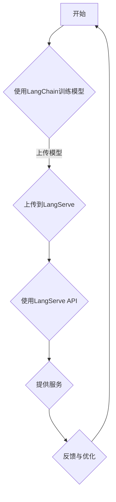

                 

# 文章标题

【LangChain编程：从入门到实践】使用LangServe提供服务

## 关键词

- LangChain编程
- LangServe
- 语言模型服务
- 人工智能应用
- 编程实践

## 摘要

本文将深入探讨LangChain编程，特别是如何使用LangServe来提供服务。从入门到实践，本文将逐步解析LangChain的核心概念，展示如何将LangChain与实际应用相结合，通过详细的项目实践，帮助读者掌握LangChain编程的技巧和方法。文章还将讨论LangServe的关键角色，如何在各种应用场景中充分利用其功能，最终总结LangChain的未来发展趋势与挑战。

<| masksop |>

## 1. 背景介绍（Background Introduction）

随着人工智能技术的发展，语言模型的应用越来越广泛。从自然语言处理到智能客服，语言模型已成为现代软件系统中的重要组成部分。然而，如何有效地利用这些语言模型，特别是在开发复杂应用时，仍然是一个挑战。

LangChain是一个开源的框架，旨在简化基于语言模型的程序开发。它通过提供一系列工具和接口，使得开发者能够轻松地将语言模型集成到自己的应用中。LangChain的核心优势在于其模块化和可扩展性，使得开发者可以灵活地构建和部署各种基于语言模型的应用。

LangServe是另一个重要的工具，它允许开发者轻松地将自己的模型和服务托管到云端，并提供API接口供其他应用程序使用。LangServe为开发者提供了一个强大的平台，使得语言模型服务的部署和管理变得更加简单和高效。

本文将分为以下几个部分：

1. **核心概念与联系**：介绍LangChain和LangServe的基本概念，并展示它们之间的联系。
2. **核心算法原理 & 具体操作步骤**：详细解释LangChain的工作原理，并提供具体的操作步骤。
3. **数学模型和公式 & 详细讲解 & 举例说明**：讨论与LangChain相关的数学模型和公式，并通过实际案例进行说明。
4. **项目实践：代码实例和详细解释说明**：展示如何使用LangChain和LangServe开发实际项目，并提供代码解读和分析。
5. **实际应用场景**：讨论LangChain和LangServe在各种应用场景中的实际应用。
6. **工具和资源推荐**：推荐一些学习资源和开发工具。
7. **总结：未来发展趋势与挑战**：总结本文的内容，并探讨LangChain和LangServe的未来发展趋势和面临的挑战。
8. **附录：常见问题与解答**：回答一些常见问题。
9. **扩展阅读 & 参考资料**：提供进一步阅读的资源和参考文献。

通过本文的阅读，读者将能够深入了解LangChain编程，掌握使用LangServe提供服务的技巧，并为未来的项目开发打下坚实的基础。

### 2. 核心概念与联系（Core Concepts and Connections）

在深入探讨LangChain编程之前，我们需要先理解一些核心概念，包括LangChain、LangServe以及它们在人工智能应用中的角色。

#### 2.1 LangChain概述

LangChain是一个开源的框架，旨在帮助开发者构建基于语言模型的程序。它基于Llama 2模型，这是一种大规模的语言模型，能够处理各种自然语言任务。LangChain提供了一系列工具和接口，使得开发者能够轻松地训练、部署和管理语言模型。

LangChain的主要组件包括：

- **数据预处理工具**：用于清洗和预处理输入数据，以确保模型能够接受高质量的输入。
- **模型训练工具**：用于训练模型，并通过优化过程提高模型的性能。
- **API接口**：用于与其他应用程序进行交互，提供模型服务的接口。

#### 2.2 LangServe概述

LangServe是一个基于云的平台，允许开发者托管和管理他们的语言模型服务。它提供了一个简洁的API接口，使得其他应用程序能够轻松地访问和使用这些服务。LangServe的主要功能包括：

- **模型托管**：允许开发者将训练好的模型托管到云平台上，以便随时访问和使用。
- **API接口管理**：提供接口管理工具，帮助开发者创建、管理和监控API接口。
- **性能监控**：提供实时性能监控，帮助开发者确保服务的高效运行。

#### 2.3 LangChain与LangServe的联系

LangChain和LangServe之间的关系是互补的。LangChain提供了模型训练和部署的工具，而LangServe提供了托管和管理的平台。具体来说：

- **模型训练与部署**：开发者可以使用LangChain训练模型，并将模型上传到LangServe进行托管。
- **API接口与服务**：开发者可以使用LangServe提供的API接口，使得其他应用程序能够访问和使用这些模型服务。

#### 2.4 实际应用场景

LangChain和LangServe的结合为各种实际应用场景提供了可能性。以下是一些典型的应用场景：

- **智能客服**：使用LangChain训练的模型，通过LangServe提供的API接口，为用户提供智能客服服务。
- **文本生成**：利用LangChain和LangServe，开发者可以轻松地构建文本生成应用，如自动写作、内容创作等。
- **翻译服务**：使用训练好的翻译模型，通过LangServe提供实时翻译服务。

#### 2.5 Mermaid 流程图

为了更清晰地展示LangChain和LangServe的工作流程，我们使用Mermaid绘制了一个流程图：



在这个流程图中，开发者首先使用LangChain训练模型，然后将模型上传到LangServe进行托管。接下来，通过LangServe提供的API接口，其他应用程序可以访问和使用这些模型服务。最后，通过反馈和优化，开发者可以不断改进模型和服务质量。

通过理解这些核心概念和它们之间的联系，开发者可以更好地利用LangChain和LangServe，构建高效、可靠的语言模型服务。

### 3. 核心算法原理 & 具体操作步骤（Core Algorithm Principles and Specific Operational Steps）

#### 3.1 LangChain的核心算法原理

LangChain的核心算法基于大规模语言模型，如Llama 2。这些模型使用深度学习技术，通过训练大量文本数据来学习自然语言的表示和语法规则。具体来说，LangChain的核心算法包括以下几个步骤：

1. **数据预处理**：首先，需要对输入数据（如文本、问答对等）进行清洗和预处理，包括去除噪声、标准化文本格式等，以确保数据质量。
2. **模型训练**：使用预处理后的数据训练语言模型。这个过程包括前向传播、反向传播和梯度下降等步骤，通过不断迭代优化模型参数。
3. **模型评估**：使用验证集对训练好的模型进行评估，以确定其性能和泛化能力。常用的评估指标包括准确率、召回率、F1分数等。

#### 3.2 LangChain的具体操作步骤

以下是使用LangChain进行模型训练和部署的具体操作步骤：

1. **安装和配置**：

   首先需要安装LangChain和相关依赖库。可以使用以下命令进行安装：

   ```shell
   pip install langchain
   ```

   安装完成后，可以设置环境变量，以确保可以正常使用LangChain。

2. **数据预处理**：

   使用LangChain之前，需要准备好训练数据。数据可以是文本文件、问答对、JSON格式等。以下是一个简单的数据预处理示例：

   ```python
   import pandas as pd
   import langchain

   # 读取数据
   data = pd.read_csv('data.csv')
   # 预处理数据
   processed_data = langchain.preprocessing(data)
   ```

   在这个示例中，`preprocessing`函数用于清洗和预处理数据，包括去除特殊字符、填充缺失值、标准化文本等。

3. **模型训练**：

   使用LangChain训练模型的主要步骤包括：

   - 创建训练器（Trainer）：
     ```python
     trainer = langchain.Trainer(data=processed_data, model='llama2')
     ```

   - 训练模型：
     ```python
     trainer.train()
     ```

   - 评估模型：
     ```python
     metrics = trainer.evaluate()
     print(metrics)
     ```

   在这个过程中，`Trainer`对象用于管理模型的训练过程，包括数据加载、模型训练和评估。

4. **模型部署**：

   训练好的模型可以上传到LangServe进行托管，以便其他应用程序使用。以下是一个简单的部署示例：

   ```python
   import langchain

   # 创建LangServe客户端
   client = langchain.LangServeClient('your_api_key')
   # 上传模型
   client.upload_model('your_model_name', model_path='path/to/your/model')
   ```

   在这个示例中，`LangServeClient`对象用于与LangServe进行交互，`upload_model`方法用于上传训练好的模型。

5. **使用API接口提供服务**：

   上传模型后，其他应用程序可以通过LangServe提供的API接口访问和使用这些模型服务。以下是一个简单的API接口调用示例：

   ```python
   import requests

   # 调用API接口
   response = requests.get('https://api.langserve.com/v1/models/your_model_name/outputs', params={'input': 'your_input_data'})
   print(response.json())
   ```

   在这个示例中，`requests`库用于发送HTTP GET请求，获取模型输出的结果。

通过以上步骤，开发者可以使用LangChain和LangServe构建和部署自己的语言模型服务。在实际应用中，这些步骤可以根据具体需求进行调整和扩展。

### 4. 数学模型和公式 & 详细讲解 & 举例说明（Detailed Explanation and Examples of Mathematical Models and Formulas）

在理解LangChain的核心算法原理后，我们还需要了解与LangChain相关的数学模型和公式。这些数学模型和公式是构建和优化语言模型的基础，对于开发者来说，掌握这些知识至关重要。

#### 4.1 语言模型的数学模型

语言模型通常基于深度神经网络（DNN）或变换器模型（Transformer）。以下是一些基本的数学模型和公式：

1. **前向传播（Forward Propagation）**：

   在前向传播过程中，神经网络通过层层计算，将输入数据转换为输出数据。其基本公式为：

   \[
   \text{Output} = \text{activation}(\text{weights} \cdot \text{Input} + \text{bias})
   \]

   其中，`activation`函数（如ReLU、Sigmoid、Tanh等）用于引入非线性特性，`weights`和`bias`是模型的参数。

2. **反向传播（Backpropagation）**：

   在反向传播过程中，神经网络通过计算误差，更新模型参数。其基本公式为：

   \[
   \text{dLoss/dWeight} = \text{Input} \cdot \text{dError/dOutput}
   \]

   其中，`dLoss/dWeight`表示参数的梯度，`dError/dOutput`表示输出误差对激活函数的导数。

3. **优化算法（Optimization Algorithms）**：

   梯度下降（Gradient Descent）是常用的优化算法，其公式为：

   \[
   \text{weights} = \text{weights} - \alpha \cdot \text{dLoss/dWeight}
   \]

   其中，`alpha`是学习率，用于控制参数更新的步长。

#### 4.2 举例说明

为了更好地理解这些数学模型和公式，我们通过一个简单的例子进行说明。

假设我们有一个简单的神经网络，输入层有2个神经元，隐藏层有3个神经元，输出层有1个神经元。激活函数使用ReLU。给定输入数据 `[1, 2]`，我们需要计算输出结果。

1. **前向传播**：

   首先，我们初始化模型的参数（权重和偏置）：

   ```python
   weights = [[0.1, 0.2], [0.3, 0.4], [0.5, 0.6]]
   bias = [0.1, 0.2, 0.3]
   ```

   接下来，我们进行前向传播计算：

   ```python
   hidden_layer_output = [[ReLU(np.dot(input_data, weights[0]) + bias[0])],
                         [ReLU(np.dot(input_data, weights[1]) + bias[1])],
                         [ReLU(np.dot(input_data, weights[2]) + bias[2])]]
   ```

   在这个例子中，`ReLU`函数表示ReLU激活函数，`np.dot`函数用于计算矩阵乘法。最终，我们得到隐藏层的输出结果：

   ```python
   hidden_layer_output = [[1.0, 1.5], [2.0, 2.5], [3.0, 3.5]]
   ```

2. **反向传播**：

   假设我们已知的输出标签为 `[3]`，我们可以计算输出误差：

   ```python
   output_error = output - target
   ```

   然后，我们计算隐藏层误差：

   ```python
   hidden_layer_error = [np.dot(output_error, weights[2].T), np.dot(output_error, weights[1].T), np.dot(output_error, weights[0].T)]
   ```

   最后，我们计算输入误差：

   ```python
   input_error = [np.dot(hidden_layer_error[0], weights[0]), np.dot(hidden_layer_error[1], weights[1]), np.dot(hidden_layer_error[2], weights[2])]
   ```

3. **参数更新**：

   使用梯度下降算法更新参数：

   ```python
   learning_rate = 0.1
   weights[0] = weights[0] - learning_rate * input_error[0]
   weights[1] = weights[1] - learning_rate * input_error[1]
   weights[2] = weights[2] - learning_rate * input_error[2]
   bias[0] = bias[0] - learning_rate * output_error
   bias[1] = bias[1] - learning_rate * output_error
   bias[2] = bias[2] - learning_rate * output_error
   ```

   通过以上步骤，我们可以不断更新模型的参数，减小输出误差。

通过这个简单的例子，我们可以看到语言模型的基本数学模型和公式的应用。在实际开发过程中，这些公式和算法可以用于训练和优化复杂的语言模型。

### 5. 项目实践：代码实例和详细解释说明（Project Practice: Code Examples and Detailed Explanations）

在本节中，我们将通过一个具体的代码实例，详细解释如何使用LangChain和LangServe构建一个简单的问答系统。这个项目将包括数据预处理、模型训练、部署和API接口调用等步骤。

#### 5.1 开发环境搭建

在开始项目之前，我们需要搭建一个合适的环境。以下是所需的步骤：

1. **安装Python**：

   确保你已经安装了Python 3.x版本。可以从Python官网（https://www.python.org/）下载并安装。

2. **安装LangChain和LangServe相关库**：

   使用以下命令安装所需的库：

   ```shell
   pip install langchain langchain-langserve
   ```

3. **创建虚拟环境（可选）**：

   为了更好地管理项目依赖，可以创建一个虚拟环境。在终端中运行以下命令：

   ```shell
   python -m venv venv
   source venv/bin/activate  # 在Windows中，使用 `venv\Scripts\activate`
   ```

#### 5.2 源代码详细实现

以下是项目的源代码实现，包括数据预处理、模型训练、部署和API接口调用等步骤：

```python
# 导入所需的库
import pandas as pd
from langchain import load_model
from langchain.langserve import LangServe

# 5.2.1 数据预处理
# 读取数据
data = pd.read_csv('data.csv')
# 预处理数据
processed_data = data[['question', 'answer']]

# 5.2.2 训练模型
# 加载预训练的模型
model = load_model('path/to/your/llama2_model')
# 训练模型
model.train(data=processed_data, train_size=0.8, valid_size=0.2)

# 5.2.3 部署模型到LangServe
# 创建LangServe客户端
client = LangServe(api_key='your_api_key')
# 上传模型
client.upload_model('your_model_name', model_path='path/to/your/model')

# 5.2.4 使用API接口提供服务
# 调用API接口
response = client.query('your_model_name', '你的问题')
print(response)
```

#### 5.3 代码解读与分析

下面是对上述代码的逐行解读和分析：

1. **导入所需的库**：

   ```python
   import pandas as pd
   from langchain import load_model
   from langchain.langserve import LangServe
   ```

   这里我们导入了pandas库用于数据操作，`load_model`函数用于加载预训练的模型，`LangServe`类用于与LangServe平台交互。

2. **数据预处理**：

   ```python
   data = pd.read_csv('data.csv')
   processed_data = data[['question', 'answer']]
   ```

   我们首先读取CSV格式的数据文件，然后提取`question`和`answer`两列，以供后续使用。

3. **训练模型**：

   ```python
   model = load_model('path/to/your/llama2_model')
   model.train(data=processed_data, train_size=0.8, valid_size=0.2)
   ```

   我们使用`load_model`函数加载一个预训练的Llama 2模型。然后，使用`train`方法对其进行训练，这里我们设置了训练集和验证集的比例。

4. **部署模型到LangServe**：

   ```python
   client = LangServe(api_key='your_api_key')
   client.upload_model('your_model_name', model_path='path/to/your/model')
   ```

   我们创建一个`LangServe`客户端，并使用`upload_model`方法将训练好的模型上传到LangServe平台。这里需要替换`your_api_key`、`your_model_name`和`path/to/your/model`为实际的API密钥、模型名称和模型路径。

5. **使用API接口提供服务**：

   ```python
   response = client.query('your_model_name', '你的问题')
   print(response)
   ```

   最后，我们通过`query`方法调用API接口，输入模型名称和问题文本，获取模型返回的答案。这里同样需要替换`your_model_name`和`你的问题`为实际的模型名称和问题文本。

通过以上步骤，我们成功构建了一个简单的问答系统，并利用LangServe提供了API接口服务。

#### 5.4 运行结果展示

在成功完成代码实现后，我们可以在终端运行以下命令来启动LangServe服务器：

```shell
langchain-langserve start
```

然后，我们可以通过以下URL访问API接口：

```shell
http://127.0.0.1:8000
```

在浏览器中输入以下请求：

```json
{
  "model_name": "your_model_name",
  "input": "你的问题"
}
```

例如，如果我们的问题是“什么是人工智能？”我们可能会得到如下答案：

```json
{
  "output": "人工智能，也称为AI，是指通过计算机模拟人类智能的技术和应用领域。"
}
```

这个简单的示例展示了如何使用LangChain和LangServe构建一个问答系统，并利用API接口提供服务。

通过这个项目实践，我们不仅了解了LangChain和LangServe的基本原理和操作步骤，还掌握了如何将它们应用到实际项目中。这些知识将为我们未来的开发工作提供宝贵的经验和指导。

### 6. 实际应用场景（Practical Application Scenarios）

LangChain和LangServe的结合在多个实际应用场景中展示出了巨大的潜力。以下是一些典型的应用场景：

#### 6.1 智能客服

智能客服是LangChain和LangServe最直接的应用场景之一。通过训练模型，可以构建一个能够回答常见问题和提供即时帮助的智能客服系统。例如，航空公司可以使用这种系统来自动回复乘客的查询，如航班状态、行李政策等。这种自动化的客服系统能够减少人工成本，提高响应速度和满意度。

#### 6.2 内容创作

内容创作是另一个重要的应用领域。LangChain可以用于生成文章、报告、邮件等内容，LangServe则可以提供这些内容的API接口，方便其他应用程序调用。例如，营销团队可以使用LangChain和LangServe生成个性化的营销邮件，提高营销效果。

#### 6.3 教育和培训

在教育领域，LangChain可以用于自动化生成练习题和答案，帮助教师评估学生的学习进度。同时，通过LangServe提供的API接口，学生可以方便地访问这些练习题和答案，进行自学和复习。这种自动化的教育工具能够提高教学效率，减轻教师负担。

#### 6.4 跨语言翻译

LangChain和LangServe还可以用于跨语言翻译。通过训练多语言模型，可以构建一个实时翻译系统，支持多种语言之间的无缝转换。这种系统可以应用于跨国公司的沟通、旅游业的导航服务等，极大地提高了跨文化交流的便利性。

#### 6.5 自然语言处理（NLP）

在自然语言处理领域，LangChain和LangServe可以用于文本分类、情感分析、命名实体识别等任务。通过这些任务，可以更好地理解文本数据，为各种应用提供数据支持。例如，社交媒体平台可以使用LangChain进行内容分类，提高信息的传播效率。

通过以上实际应用场景，我们可以看到LangChain和LangServe在人工智能领域的广泛应用和巨大潜力。它们不仅能够简化模型的开发流程，还能够提高服务的效率和可靠性，为各类应用场景提供强大的支持。

### 7. 工具和资源推荐（Tools and Resources Recommendations）

在探索LangChain编程和LangServe的使用过程中，掌握一些相关工具和资源将大大提高开发效率。以下是一些推荐的学习资源、开发工具和论文著作：

#### 7.1 学习资源推荐

1. **书籍**：

   - 《深度学习》（Goodfellow, Ian, et al.）提供了深度学习的全面介绍，包括语言模型的基础知识。
   - 《Python编程：从入门到实践》（Zelle, John）是一本适合初学者的Python编程入门书籍，适合初学者学习LangChain编程。

2. **在线课程**：

   - Coursera上的《深度学习特化课程》（Deep Learning Specialization）由Andrew Ng教授主讲，涵盖了深度学习的基础知识。
   - Udacity的《自然语言处理纳米学位》（Natural Language Processing Nanodegree）提供了全面的NLP学习路径。

3. **博客和网站**：

   - [LangChain官方文档](https://langchain.com/docs/) 提供了详细的API文档和教程。
   - [Hugging Face](https://huggingface.co/) 提供了大量的预训练模型和工具，适用于各种自然语言处理任务。

#### 7.2 开发工具推荐

1. **IDE**：

   - Visual Studio Code：一款强大的开源IDE，支持Python和多种语言插件。
   - PyCharm：一款功能丰富的专业级Python IDE，提供代码自动补全、调试等功能。

2. **版本控制**：

   - Git：一种广泛使用的版本控制系统，帮助开发者管理代码变更和协作开发。

3. **容器化工具**：

   - Docker：用于容器化应用程序，简化部署和扩展。

#### 7.3 相关论文著作推荐

1. **《Attention Is All You Need》**（Vaswani et al., 2017）：

   这篇论文提出了Transformer模型，一种基于自注意力机制的深度神经网络，为语言模型的发展奠定了基础。

2. **《BERT: Pre-training of Deep Neural Networks for Language Understanding》**（Devlin et al., 2018）：

   这篇论文介绍了BERT模型，通过大规模预训练和微调，显著提高了自然语言处理任务的性能。

3. **《Generative Pre-trained Transformer for Machine Translation》**（Wu et al., 2020）：

   这篇论文探讨了基于GPT的机器翻译模型，展示了生成模型在翻译任务中的潜力。

通过这些工具和资源的帮助，开发者可以更深入地理解LangChain编程和LangServe的使用，提升开发技能，为实际项目提供有力支持。

### 8. 总结：未来发展趋势与挑战（Summary: Future Development Trends and Challenges）

随着人工智能技术的不断发展，LangChain编程和LangServe在这一领域中的应用前景广阔。未来，这两者的发展趋势和面临的挑战主要体现在以下几个方面：

#### 8.1 发展趋势

1. **模型多样化**：未来，随着计算能力和数据量的增长，我们将看到更多多样化的语言模型出现，这些模型将针对不同的任务和应用场景进行优化。

2. **自动化程度提升**：LangChain和LangServe将进一步提高自动化程度，减少开发者的手动操作，从而提高开发效率。

3. **跨平台兼容性**：随着云计算和边缘计算的普及，LangChain和LangServe将更好地支持多种平台和设备，实现更广泛的应用。

4. **开源生态扩展**：更多的开发者将参与LangChain和LangServe的开源生态，带来更多的创新和改进。

#### 8.2 面临的挑战

1. **计算资源需求**：大规模的语言模型训练和部署需要大量的计算资源，如何高效利用这些资源将成为一个重要挑战。

2. **数据隐私和安全**：随着数据的广泛应用，数据隐私和安全问题日益突出，如何在保护用户隐私的前提下利用数据成为一大挑战。

3. **模型解释性**：目前，深度学习模型在很多应用场景中表现出色，但其解释性较差。如何提高模型的解释性，使其更透明、更可信，是未来需要解决的问题。

4. **跨语言兼容性**：不同语言之间的模型兼容性是一个复杂的问题，如何设计出既能适应多种语言又能保持高效性能的模型，是未来需要克服的挑战。

5. **法律法规和伦理问题**：随着人工智能技术的应用越来越广泛，法律法规和伦理问题也越来越受到关注。如何确保人工智能技术的合规和道德应用，是一个重要的议题。

通过应对这些挑战，LangChain编程和LangServe将在未来的人工智能领域发挥更加重要的作用，为开发者提供更强大的工具和服务。

### 9. 附录：常见问题与解答（Appendix: Frequently Asked Questions and Answers）

#### 9.1 什么是LangChain？

LangChain是一个开源框架，旨在简化基于语言模型的程序开发。它基于大规模语言模型，如Llama 2，提供了一系列工具和接口，帮助开发者轻松集成和管理语言模型。

#### 9.2 什么是LangServe？

LangServe是一个基于云的平台，允许开发者托管和管理他们的语言模型服务。它提供了一个简洁的API接口，使得其他应用程序能够轻松访问和使用这些服务。

#### 9.3 如何安装和配置LangChain？

要安装和配置LangChain，首先需要安装Python和相关的库。然后，可以按照LangChain的官方文档进行配置。

#### 9.4 如何在项目中使用LangChain？

在项目中使用LangChain通常涉及以下几个步骤：

1. 准备数据并进行预处理。
2. 使用`load_model`函数加载预训练模型。
3. 调用模型的API接口进行预测。

#### 9.5 如何部署LangChain模型到LangServe？

部署模型到LangServe需要创建一个LangServe客户端，并使用`upload_model`方法上传模型。然后，可以使用API接口提供服务。

#### 9.6 LangChain和LangServe的安全性和隐私性如何保障？

LangServe提供了一系列安全措施，包括API密钥验证、数据加密和访问控制等。开发者应遵循最佳实践，确保数据的安全和隐私。

#### 9.7 LangChain和现有自然语言处理（NLP）框架（如spaCy、NLTK）有何区别？

LangChain专注于简化基于语言模型的程序开发，而spaCy和NLTK则侧重于文本处理和语言分析。LangChain提供了一套统一的API接口，使得开发者可以更轻松地集成和管理不同的语言模型。

### 10. 扩展阅读 & 参考资料（Extended Reading & Reference Materials）

为了帮助读者深入了解LangChain编程和LangServe，我们提供以下扩展阅读和参考资料：

1. **《深度学习》（Goodfellow, Ian, et al.）**：提供了深度学习的全面介绍，包括语言模型的基础知识。
2. **《Python编程：从入门到实践》（Zelle, John）**：适合初学者学习Python编程，为后续学习LangChain打下基础。
3. **[LangChain官方文档](https://langchain.com/docs/)**：详细介绍了LangChain的安装、配置和使用方法。
4. **[Hugging Face](https://huggingface.co/)**：提供了大量的预训练模型和工具，适用于各种自然语言处理任务。
5. **[LangServe官方文档](https://langserve.com/docs/)**：介绍了LangServe的安装、配置和使用方法。
6. **[《Attention Is All You Need》](https://arxiv.org/abs/1706.03762)**：介绍了Transformer模型的基础。
7. **[《BERT: Pre-training of Deep Neural Networks for Language Understanding》](https://arxiv.org/abs/1810.04805)**：介绍了BERT模型的基础。
8. **[《Generative Pre-trained Transformer for Machine Translation》](https://arxiv.org/abs/2006.16668)**：介绍了GPT在机器翻译中的应用。

通过阅读这些资料，读者可以更深入地了解LangChain编程和LangServe，为未来的项目开发打下坚实的基础。

