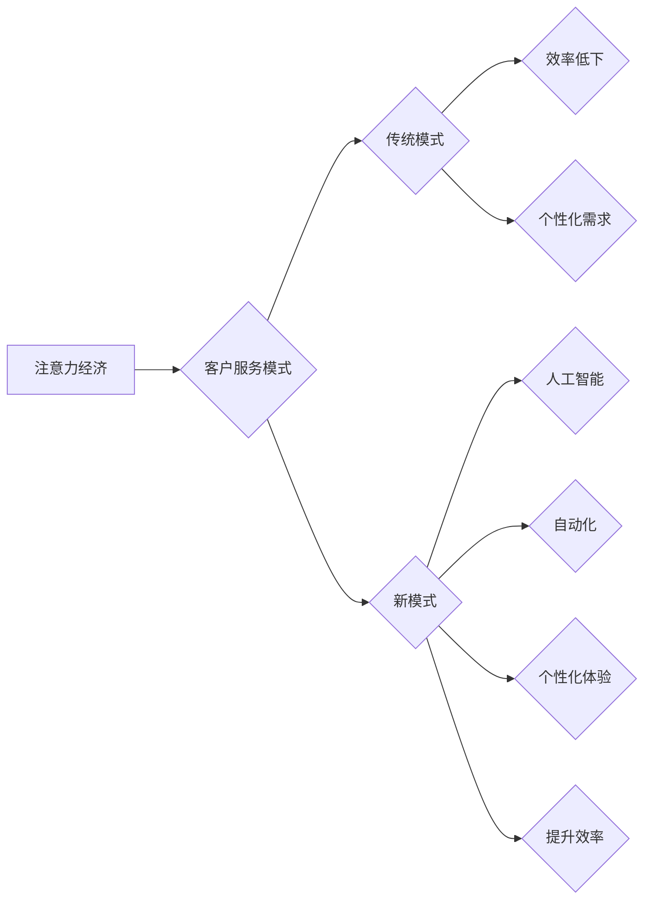

                 

##  注意力经济对企业客户服务模式的改变

> 关键词：注意力经济、客户服务、人工智能、机器学习、个性化、自动化、体验优化

### 1. 背景介绍

在当今信息爆炸的时代，人们面临着来自各方信息的冲击，注意力成为了稀缺的资源。这种“注意力经济”的到来，深刻地改变了人们获取信息、消费内容和进行交互的方式。企业客户服务也面临着前所未有的挑战和机遇。传统的客户服务模式，往往依赖于大量的人力投入和标准化的流程，难以满足客户日益个性化的需求和对快速响应的期待。

### 2. 核心概念与联系

#### 2.1 注意力经济

注意力经济是指在信息过载的时代，人们对信息的筛选和选择能力成为重要的经济资源。注意力是有限的，而信息则是无限的，因此，获取和保持用户注意力成为了企业竞争的关键。

#### 2.2 客户服务模式

客户服务是指企业为客户提供各种支持和帮助，以提升客户满意度和忠诚度。传统的客户服务模式主要包括电话客服、邮件客服、在线客服等，这些模式往往以人工为主，效率相对较低，难以满足个性化需求。

#### 2.3 连接

注意力经济的到来，对企业客户服务模式提出了新的要求。企业需要利用技术手段，提高客户服务效率，提供个性化体验，并最终赢得客户的注意力。

**Mermaid 流程图**



### 3. 核心算法原理 & 具体操作步骤

#### 3.1 算法原理概述

在注意力经济下，企业客户服务模式的转变主要依赖于人工智能（AI）和机器学习（ML）技术的应用。这些技术可以帮助企业实现以下功能：

* **智能客服：** 利用自然语言处理（NLP）技术，让机器能够理解和回复客户的自然语言问题，提供24/7的在线服务。
* **个性化推荐：** 根据客户的历史行为和偏好，推荐相关产品或服务，提升客户体验。
* **预测分析：** 利用机器学习算法，预测客户的潜在需求，提前提供解决方案。
* **自动化流程：** 自动化重复性任务，例如订单处理、售后服务等，提高效率。

#### 3.2 算法步骤详解

以智能客服为例，其核心算法步骤如下：

1. **数据收集：** 收集客户与客服交互的历史数据，包括文本对话、语音记录、用户行为等。
2. **数据预处理：** 对收集到的数据进行清洗、格式化和标注，以便机器学习模型的训练。
3. **模型训练：** 利用深度学习算法，例如循环神经网络（RNN）或Transformer，训练智能客服模型。
4. **模型评估：** 使用测试数据评估模型的性能，例如准确率、召回率、F1-score等。
5. **模型部署：** 将训练好的模型部署到线上环境，提供智能客服服务。

#### 3.3 算法优缺点

**优点：**

* **24/7服务：** 智能客服可以全天候提供服务，不受时间限制。
* **快速响应：** 机器可以快速处理客户请求，缩短响应时间。
* **个性化体验：** 基于客户历史数据，智能客服可以提供个性化的服务建议。
* **提高效率：** 自动化重复性任务，释放人工客服的精力，提高整体效率。

**缺点：**

* **理解能力有限：** 当前的AI技术仍然无法完全理解复杂的自然语言，可能会出现误解或无法解答的问题。
* **缺乏情感共鸣：** 机器无法像人类一样理解和表达情感，可能会导致客户体验不佳。
* **数据安全问题：** 智能客服需要处理大量客户数据，需要确保数据安全和隐私保护。

#### 3.4 算法应用领域

智能客服、个性化推荐、预测分析等AI技术在企业客户服务领域有着广泛的应用，例如：

* **电商平台：** 提供智能客服、个性化商品推荐、订单预警等服务。
* **金融机构：** 提供智能理财咨询、风险预警、欺诈检测等服务。
* **医疗机构：** 提供智能问诊、预约挂号、病历分析等服务。
* **制造业：** 提供智能故障诊断、设备维护预警等服务。

### 4. 数学模型和公式 & 详细讲解 & 举例说明

#### 4.1 数学模型构建

在注意力经济下，企业客户服务模式的转变可以看作是一个优化问题，目标是最大化客户满意度和忠诚度，同时最小化服务成本。

我们可以构建一个数学模型来描述这个优化问题：

**目标函数：**

$$
Maximize \quad Customer \quad Satisfaction \quad (CS)
$$

**约束条件：**

$$
Cost \quad (C) \leq Budget
$$

其中，CS代表客户满意度，C代表服务成本，Budget代表企业的预算。

#### 4.2 公式推导过程

为了最大化CS，我们需要考虑以下因素：

* **响应时间：** 响应时间越短，客户满意度越高。
* **解决问题的能力：** 客服能够有效解决客户问题的能力，直接影响客户满意度。
* **个性化程度：** 提供个性化服务，能够提升客户体验和满意度。
* **服务成本：** 服务成本过高，会降低企业的利润。

我们可以将这些因素量化，并构建相应的公式，例如：

$$
CS = f(Response \quad Time, \quad Problem \quad Solving \quad Rate, \quad Personalization \quad Level)
$$

$$
C = g(Staff \quad Number, \quad Technology \quad Cost, \quad Operational \quad Cost)
$$

其中，f和g分别代表客户满意度和服务成本的函数。

#### 4.3 案例分析与讲解

例如，一家电商平台想要提高客户满意度，可以采用以下策略：

* **利用AI技术实现智能客服，缩短响应时间。**
* **根据客户历史数据，提供个性化商品推荐，提升购物体验。**
* **利用机器学习算法，预测客户的潜在问题，提前提供解决方案。**

通过这些策略，电商平台可以提高客户满意度，同时降低服务成本。

### 5. 项目实践：代码实例和详细解释说明

#### 5.1 开发环境搭建

为了实现智能客服功能，我们可以使用以下开发环境：

* **编程语言：** Python
* **深度学习框架：** TensorFlow或PyTorch
* **自然语言处理库：** NLTK或spaCy
* **云平台：** AWS、Azure或GCP

#### 5.2 源代码详细实现

以下是一个简单的智能客服代码示例，使用Python和TensorFlow框架实现：

```python
import tensorflow as tf

# 定义模型结构
model = tf.keras.Sequential([
    tf.keras.layers.Embedding(input_dim=10000, output_dim=128),
    tf.keras.layers.LSTM(units=64),
    tf.keras.layers.Dense(units=100, activation='relu'),
    tf.keras.layers.Dense(units=num_classes, activation='softmax')
])

# 编译模型
model.compile(optimizer='adam',
              loss='sparse_categorical_crossentropy',
              metrics=['accuracy'])

# 训练模型
model.fit(x_train, y_train, epochs=10)

# 预测
predictions = model.predict(x_test)
```

#### 5.3 代码解读与分析

这段代码定义了一个简单的循环神经网络（RNN）模型，用于进行文本分类。

* `Embedding`层将单词转换为向量表示。
* `LSTM`层用于处理序列数据，捕捉文本中的上下文信息。
* `Dense`层用于分类，输出每个类别的概率。

#### 5.4 运行结果展示

训练完成后，我们可以使用测试数据评估模型的性能，例如准确率、召回率等。

### 6. 实际应用场景

#### 6.1 电商平台

电商平台可以利用AI技术实现智能客服，为客户提供24/7的在线服务，并根据客户的历史购买记录和浏览行为，提供个性化的商品推荐。

#### 6.2 金融机构

金融机构可以利用AI技术进行风险预警、欺诈检测和智能理财咨询，提高服务效率和安全性。

#### 6.3 医疗机构

医疗机构可以利用AI技术实现智能问诊、预约挂号和病历分析，提高医疗服务效率和准确性。

#### 6.4 未来应用展望

随着AI技术的不断发展，未来企业客户服务模式将更加智能化、个性化和自动化。例如：

* **虚拟助手：** 利用AI技术，打造更加智能的虚拟助手，能够理解和响应客户的复杂需求。
* **情感识别：** 利用AI技术识别客户的情感状态，提供更加人性化的服务。
* **预测性维护：** 利用AI技术预测客户设备的潜在故障，提前提供解决方案。

### 7. 工具和资源推荐

#### 7.1 学习资源推荐

* **在线课程：** Coursera、edX、Udacity等平台提供丰富的AI和机器学习课程。
* **书籍：** 《深度学习》、《机器学习实战》等书籍是学习AI和机器学习的经典教材。
* **开源项目：** TensorFlow、PyTorch等开源项目提供了丰富的代码示例和学习资源。

#### 7.2 开发工具推荐

* **编程语言：** Python
* **深度学习框架：** TensorFlow、PyTorch
* **自然语言处理库：** NLTK、spaCy
* **云平台：** AWS、Azure、GCP

#### 7.3 相关论文推荐

* **Attention Is All You Need:** https://arxiv.org/abs/1706.03762
* **BERT: Pre-training of Deep Bidirectional Transformers for Language Understanding:** https://arxiv.org/abs/1810.04805

### 8. 总结：未来发展趋势与挑战

#### 8.1 研究成果总结

注意力经济对企业客户服务模式的转变，是人工智能和机器学习技术应用的必然结果。通过利用这些技术，企业可以提高客户服务效率，提供个性化体验，并最终赢得客户的注意力。

#### 8.2 未来发展趋势

未来，企业客户服务模式将更加智能化、个性化和自动化。虚拟助手、情感识别、预测性维护等技术将得到更广泛的应用。

#### 8.3 面临的挑战

* **数据安全和隐私保护：** AI技术需要处理大量客户数据，需要确保数据安全和隐私保护。
* **算法偏见：** AI算法可能会存在偏见，导致服务不公平。
* **技术成本：** 采用AI技术需要一定的技术成本和投入。

#### 8.4 研究展望

未来研究方向包括：

* **开发更加安全、可靠和公平的AI算法。**
* **探索新的AI应用场景，提升客户服务体验。**
* **降低AI技术的成本，使其更易于普及。**

### 9. 附录：常见问题与解答

#### 9.1 如何选择合适的AI技术？

选择合适的AI技术需要根据企业的具体需求和业务场景进行评估。例如，对于需要处理大量文本数据的企业，可以选择自然语言处理技术；对于需要预测客户行为的企业，可以选择机器学习技术。

#### 9.2 如何确保AI技术的安全性？

确保AI技术的安全性需要从多个方面进行考虑，例如：

* **数据加密和安全存储。**
* **算法透明度和可解释性。**
* **安全审计和监控。**

#### 9.3 如何应对AI技术的挑战？

应对AI技术的挑战需要企业积极探索，不断学习和改进。例如：

* **加强数据安全和隐私保护意识。**
* **关注AI算法的公平性和可解释性。**
* **积极参与行业标准制定和技术交流。**


作者：禅与计算机程序设计艺术 / Zen and the Art of Computer Programming 
<end_of_turn>

