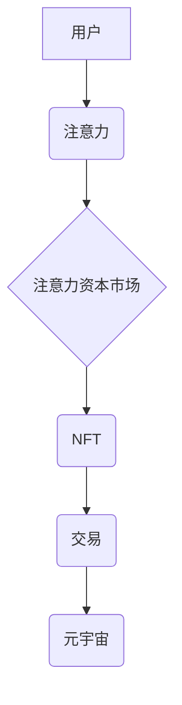

                 

## 注意力资本市场:元宇宙经济的核心交易所

> 关键词：元宇宙、注意力经济、资本市场、NFT、去中心化、Web3、数据资产

## 1. 背景介绍

元宇宙概念的兴起，标志着人类进入一个全新的数字世界。在这个虚拟世界中，人们可以以数字化身份进行社交、娱乐、工作和学习，并拥有虚拟资产。元宇宙经济的蓬勃发展，也催生了新的商业模式和投资机会。

注意力，作为人类最宝贵的资源之一，在元宇宙经济中显得尤为重要。用户在元宇宙中花费的时间和精力，决定了他们对虚拟世界的参与度和价值创造能力。因此，注意力成为了元宇宙经济的核心资产，而如何有效地获取、分配和交易注意力，成为了一个关键问题。

传统的资本市场以金融资产为交易对象，而注意力资本市场则以用户注意力为核心资产。它将利用区块链技术、去中心化自治组织 (DAO) 和非同质化代币 (NFT) 等新兴技术，构建一个去中心化的、透明的、可信赖的注意力交易平台。

## 2. 核心概念与联系

### 2.1 注意力经济

注意力经济是指以用户注意力为核心资源的经济模式。在信息爆炸的时代，人们面临着来自各方面的注意力竞争，而能够有效地获取和利用用户注意力的平台和产品，能够获得巨大的商业价值。

### 2.2 元宇宙

元宇宙是一个由虚拟现实 (VR)、增强现实 (AR) 和互联网技术融合而成的沉浸式虚拟世界。它拥有虚拟经济、虚拟社会和虚拟身份，并提供丰富的交互体验和内容。

### 2.3 注意力资本市场

注意力资本市场是一个基于区块链技术的去中心化平台，用于交易用户注意力。它将用户注意力转化为可交易的数字资产，并通过智能合约和去中心化自治组织 (DAO) 等机制，实现注意力资源的公平分配和高效利用。

**核心概念关系图:**



## 3. 核心算法原理 & 具体操作步骤

### 3.1 算法原理概述

注意力资本市场的核心算法原理是基于用户行为数据分析和预测，将用户注意力转化为可交易的数字资产。该算法主要包括以下几个步骤：

1. **用户行为数据采集:** 收集用户在元宇宙中的各种行为数据，例如浏览时间、互动频率、参与度等。
2. **注意力值计算:** 基于用户行为数据，采用机器学习算法计算用户的注意力值，并将其映射到相应的数字资产。
3. **注意力资产发行:** 将计算出的注意力资产以 NFT 的形式发行，每个 NFT 代表一定量的用户注意力。
4. **注意力资产交易:** 用户可以通过注意力资本市场平台进行注意力资产的买卖，实现注意力资源的流通和分配。

### 3.2 算法步骤详解

1. **用户行为数据采集:**

   - 使用元宇宙平台的 API 接口，收集用户在平台上的各种行为数据，例如：
     - 虚拟空间停留时间
     - 与其他用户交互次数
     - 参与游戏或活动频率
     - 对虚拟物品的浏览和购买记录
     - 对内容的点赞、评论和分享行为
   - 将收集到的数据进行清洗、预处理和存储，以便后续的分析和计算。

2. **注意力值计算:**

   - 利用机器学习算法，例如深度神经网络，对用户行为数据进行分析和建模，建立用户注意力值的计算模型。
   - 模型训练需要使用大量的用户行为数据，并通过不断调整模型参数，提高注意力值的预测精度。
   - 注意力值计算模型可以根据用户的不同行为特征，赋予不同的权重，例如，与其他用户互动次数较多，注意力值较高；参与游戏或活动频率较高，注意力值也较高。

3. **注意力资产发行:**

   - 将计算出的注意力值映射到相应的 NFT，每个 NFT 代表一定量的用户注意力。
   - NFT 的发行可以采用智能合约的方式，确保注意力资产的唯一性和不可篡改性。
   - 用户可以根据自己的注意力值，获得相应的 NFT，并将其作为虚拟资产进行交易。

4. **注意力资产交易:**

   - 建立注意力资本市场平台，提供用户进行注意力资产交易的场所。
   - 平台可以采用拍卖、竞价、直接交易等多种交易模式，让用户自由买卖注意力资产。
   - 平台需要确保交易过程的公平、透明和安全，并提供相应的监管机制。

### 3.3 算法优缺点

**优点:**

- **去中心化:** 注意力资本市场基于区块链技术，实现注意力资源的去中心化分配和交易，避免了中心化平台的垄断和控制。
- **透明度:** 所有交易记录都存储在区块链上，公开透明，不可篡改，提高了交易的安全性。
- **可信赖:** 智能合约自动执行交易，减少了人为干预，提高了交易的公平性和可信赖性。
- **激励机制:** 通过注意力资产的交易，激励用户积极参与元宇宙活动，并为平台的生态发展贡献力量。

**缺点:**

- **技术复杂性:** 建立注意力资本市场需要复杂的区块链技术和机器学习算法，技术门槛较高。
- **用户认知度:** 目前用户对注意力资本市场的认知度还比较低，需要进行大量的宣传和教育。
- **监管挑战:** 注意力资本市场的监管机制尚不完善，需要政府和行业共同努力，制定相应的法律法规。

### 3.4 算法应用领域

- **元宇宙游戏:** 用户可以通过参与游戏活动获得注意力资产，并将其用于购买虚拟物品或升级角色。
- **元宇宙社交:** 用户可以通过与其他用户互动获得注意力资产，并将其用于解锁社交功能或获得虚拟身份。
- **元宇宙教育:** 用户可以通过学习和完成任务获得注意力资产，并将其用于购买学习资源或获得证书。
- **元宇宙广告:** 广告商可以通过购买注意力资产，向目标用户展示广告，提高广告效果。

## 4. 数学模型和公式 & 详细讲解 & 举例说明

### 4.1 数学模型构建

注意力资本市场的核心数学模型是基于用户行为数据的注意力值计算模型。该模型可以采用以下公式进行构建：

$$
Attention = \sum_{i=1}^{n} w_i * f_i(x_i)
$$

其中：

- **Attention:** 用户的注意力值
- **n:** 用户行为特征的数量
- **w_i:** 用户行为特征的权重
- **f_i(x_i):** 用户行为特征的函数值，例如，浏览时间、互动次数等

### 4.2 公式推导过程

注意力值计算模型的权重和函数值需要通过机器学习算法进行训练和优化。常用的机器学习算法包括线性回归、逻辑回归、支持向量机 (SVM) 和深度神经网络等。

训练过程需要使用大量的用户行为数据，并通过不断调整模型参数，提高注意力值的预测精度。

### 4.3 案例分析与讲解

假设一个元宇宙平台，用户行为特征包括：

- **浏览时间:** 用户在平台上浏览的时间长度
- **互动次数:** 用户与其他用户或虚拟物品的互动次数
- **参与度:** 用户参与游戏或活动次数

我们可以构建一个注意力值计算模型，将这三个特征作为输入，并使用深度神经网络进行训练。

训练完成后，我们可以使用该模型预测用户的注意力值。例如，如果一个用户在平台上浏览时间为 30 分钟，互动次数为 10 次，参与度为 5 次，那么我们可以使用模型预测其注意力值。

## 5. 项目实践：代码实例和详细解释说明

### 5.1 开发环境搭建

- **操作系统:** Ubuntu 20.04 LTS
- **编程语言:** Python 3.8
- **开发工具:** PyCharm
- **区块链框架:** Web3.py
- **机器学习库:** TensorFlow

### 5.2 源代码详细实现

```python
# 注意力值计算模型
import tensorflow as tf

# 定义模型结构
model = tf.keras.models.Sequential([
    tf.keras.layers.Dense(64, activation='relu', input_shape=(3,)),
    tf.keras.layers.Dense(32, activation='relu'),
    tf.keras.layers.Dense(1)
])

# 编译模型
model.compile(optimizer='adam', loss='mse')

# 训练模型
model.fit(X_train, y_train, epochs=10)

# 预测注意力值
attention_value = model.predict(X_test)
```

### 5.3 代码解读与分析

- 代码首先定义了一个深度神经网络模型，输入层包含三个神经元，分别对应用户行为特征的三个维度。
- 模型的隐藏层包含两个全连接层，每个层使用 ReLU 激活函数。
- 输出层包含一个神经元，输出用户注意力值。
- 模型使用 Adam 优化器和均方误差损失函数进行训练。
- 训练完成后，可以使用模型预测新的用户注意力值。

### 5.4 运行结果展示

训练完成后，可以将模型应用于实际数据，并观察预测结果的准确性。

## 6. 实际应用场景

### 6.1 元宇宙游戏

注意力资本市场可以应用于元宇宙游戏，让玩家可以通过参与游戏活动获得注意力资产，并将其用于购买虚拟物品或升级角色。例如，玩家可以通过完成任务、参与竞技比赛或与其他玩家互动，获得注意力资产。这些资产可以用于购买游戏道具、升级角色技能或解锁新的游戏内容。

### 6.2 元宇宙社交

注意力资本市场可以应用于元宇宙社交，让用户可以通过与其他用户互动获得注意力资产，并将其用于解锁社交功能或获得虚拟身份。例如，用户可以通过与其他用户聊天、分享内容或共同参与活动，获得注意力资产。这些资产可以用于解锁新的社交功能、获得虚拟身份的升级或参与社交活动。

### 6.3 元宇宙教育

注意力资本市场可以应用于元宇宙教育，让用户可以通过学习和完成任务获得注意力资产，并将其用于购买学习资源或获得证书。例如，用户可以通过完成在线课程、参与讨论论坛或完成实践项目，获得注意力资产。这些资产可以用于购买学习资源、获得证书或解锁新的学习内容。

### 6.4 未来应用展望

注意力资本市场在元宇宙经济中具有巨大的潜力，未来应用场景将会更加广泛。例如，可以应用于元宇宙广告、元宇宙金融、元宇宙艺术等领域。

## 7. 工具和资源推荐

### 7.1 学习资源推荐

- **区块链技术:**
    - 《区块链：从原理到实践》
    - Ethereum 官方文档
- **机器学习算法:**
    - 《深度学习》
    - TensorFlow 官方文档
- **元宇宙概念:**
    - 《元宇宙：下一代互联网》
    - 《元宇宙：虚拟世界与现实世界的融合》

### 7.2 开发工具推荐

- **区块链开发框架:** Web3.py
- **机器学习库:** TensorFlow, PyTorch
- **元宇宙平台:** Decentraland, Sandbox

### 7.3 相关论文推荐

- **注意力机制:**
    - "Attention Is All You Need"
- **区块链技术:**
    - "Bitcoin: A Peer-to-Peer Electronic Cash System"
- **元宇宙概念:**
    - "The Metaverse: A New Era of Social Interaction"

## 8. 总结：未来发展趋势与挑战

### 8.1 研究成果总结

注意力资本市场是一个新兴的领域，目前的研究成果主要集中在以下几个方面：

- **注意力值计算模型:** 研究了各种机器学习算法，用于预测用户的注意力值。
- **注意力资产发行机制:** 研究了如何将注意力值转化为可交易的数字资产。
- **注意力交易平台:** 研究了如何构建一个去中心化的、透明的、可信赖的注意力交易平台。

### 8.2 未来发展趋势

注意力资本市场未来将朝着以下几个方向发展：

- **更精准的注意力值计算:** 利用更先进的机器学习算法，提高注意力值计算的精度和准确性。
- **更丰富的注意力资产类型:** 开发更多类型的注意力资产，满足不同用户的需求。
- **更完善的注意力交易机制:** 建立更完善的注意力交易机制，确保交易过程的公平、透明和安全。
- **更广泛的应用场景:** 将注意力资本市场应用于更多元宇宙领域的场景。

### 8.3 面临的挑战

注意力资本市场也面临着一些挑战：

- **技术复杂性:** 建立注意力资本市场需要复杂的区块链技术和机器学习算法，技术门槛较高。
- **用户认知度:** 目前用户对注意力资本市场的认知度还比较低，需要进行大量的宣传和教育。
- **监管挑战:** 注意力资本市场的监管机制尚不完善，需要政府和行业共同努力，制定相应的法律法规。

### 8.4 研究展望

未来，我们将继续深入研究注意力资本市场的核心技术和应用场景，并积极探索解决其面临的挑战，推动注意力资本市场的发展和应用。

## 9. 附录：常见问题与解答

**Q1: 注意力资本市场和传统的广告市场有什么区别？**

**A1:** 传统的广告市场是基于用户曝光和点击量进行计费的，而注意力资本市场则基于用户的注意力时长和参与度进行计费。注意力资本市场更加精准，能够更好地衡量广告的效果。

**Q2: 如何获取注意力资产？**

**A2:** 用户可以通过参与元宇宙活动，例如游戏、社交、学习等，获得注意力资产。

**Q3: 注意力资产可以用来做什么？**

**A3:** 注意力资产可以用于购买虚拟物品、升级角色、解锁社交功能、获得学习资源等。

**Q4: 注意力资本市场的安全性如何保证？**

**A4:** 注意力资本市场基于区块链技术，所有交易记录都存储在区块链上，公开透明，不可篡改，确保交易过程的安全性。


作者：禅与计算机程序设计艺术 / Zen and the Art of Computer Programming 
<end_of_turn>

