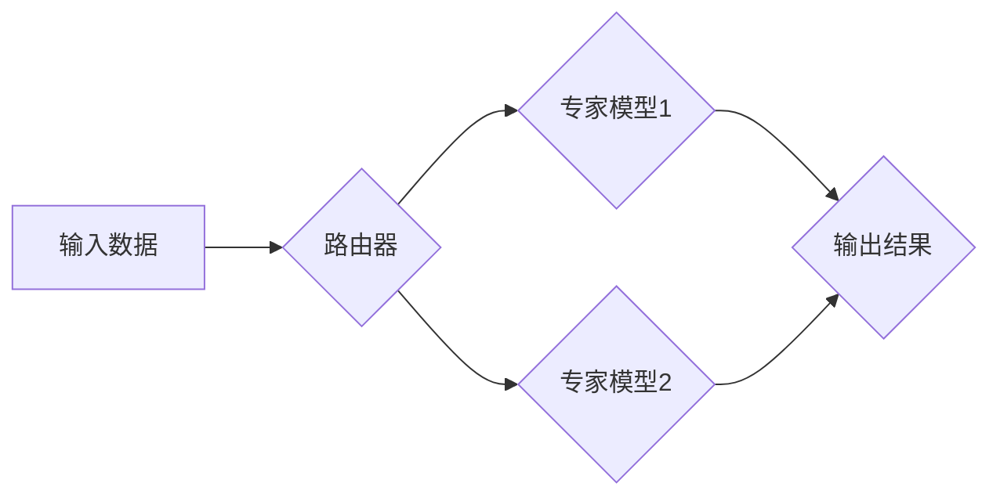

                 

## 混合专家系统：AI的模块化与可扩展性

> 关键词：混合专家系统、模块化、可扩展性、AI、深度学习、模型组合、高效训练

### 1. 背景介绍

近年来，深度学习在人工智能领域取得了显著成就，但同时也面临着一些挑战。其中之一就是模型规模的不断膨胀。大型语言模型（LLM）的训练成本高昂，部署也需要强大的计算资源。此外，单个模型的泛化能力和适应性有限，难以应对复杂多变的任务需求。

为了解决这些问题，混合专家系统（Modular Expert Systems，MES）应运而生。MES是一种将多个专家模型组合在一起的架构，每个专家模型专注于特定的任务或领域。通过模块化设计，MES可以实现以下优势：

* **可扩展性:**  可以根据需要添加新的专家模型，扩展系统的功能和能力。
* **高效训练:**  每个专家模型只需要训练特定任务的数据，降低了整体训练成本和时间。
* **提高泛化能力:**  通过组合多个模型的优势，可以提高系统的整体泛化能力和鲁棒性。
* **任务灵活性:**  可以根据任务需求灵活地选择和组合专家模型，实现对不同任务的适应性。

### 2. 核心概念与联系

混合专家系统的核心概念是将多个专家模型组合在一起，形成一个更强大的整体。每个专家模型都专注于特定的任务或领域，并通过特定的路由机制进行调用。

**架构图:**



**核心概念:**

* **专家模型:**  针对特定任务或领域进行训练的深度学习模型。
* **路由器:**  根据输入数据特征，将数据路由到相应的专家模型。
* **组合机制:**  将多个专家模型的输出结果进行融合，生成最终的输出结果。

### 3. 核心算法原理 & 具体操作步骤

#### 3.1  算法原理概述

混合专家系统的核心算法原理是将多个专家模型组合在一起，形成一个更强大的整体。每个专家模型都专注于特定的任务或领域，并通过特定的路由机制进行调用。

#### 3.2  算法步骤详解

1. **专家模型训练:**  针对不同的任务或领域，分别训练不同的专家模型。
2. **路由器设计:**  设计一个路由器，根据输入数据特征，将数据路由到相应的专家模型。
3. **组合机制选择:**  选择合适的组合机制，将多个专家模型的输出结果进行融合，生成最终的输出结果。
4. **系统训练:**  使用训练数据对整个混合专家系统进行训练，优化路由器和组合机制的参数。

#### 3.3  算法优缺点

**优点:**

* **可扩展性:**  可以根据需要添加新的专家模型，扩展系统的功能和能力。
* **高效训练:**  每个专家模型只需要训练特定任务的数据，降低了整体训练成本和时间。
* **提高泛化能力:**  通过组合多个模型的优势，可以提高系统的整体泛化能力和鲁棒性。
* **任务灵活性:**  可以根据任务需求灵活地选择和组合专家模型，实现对不同任务的适应性。

**缺点:**

* **复杂性:**  设计和训练混合专家系统比单个模型更复杂。
* **路由器设计:**  路由器的设计对系统的性能有重要影响，需要精心设计。
* **组合机制选择:**  选择合适的组合机制对系统的性能也有重要影响。

#### 3.4  算法应用领域

混合专家系统在许多领域都有应用，例如：

* **自然语言处理:**  例如文本分类、机器翻译、问答系统等。
* **计算机视觉:**  例如图像识别、目标检测、图像分割等。
* **语音识别:**  例如语音转文本、语音合成等。
* **推荐系统:**  根据用户的兴趣和行为，推荐相关的商品或服务。

### 4. 数学模型和公式 & 详细讲解 & 举例说明

#### 4.1  数学模型构建

混合专家系统的数学模型可以表示为一个多层神经网络，其中每一层都对应一个专家模型。输入数据首先经过路由器处理，然后被路由到相应的专家模型进行处理。每个专家模型的输出结果再经过组合机制进行融合，最终生成最终的输出结果。

#### 4.2  公式推导过程

假设有N个专家模型，每个专家模型的输出结果为 $y_i$，其中 $i = 1, 2, ..., N$。组合机制可以采用加权平均的方式，公式如下：

$$
y = \sum_{i=1}^{N} w_i y_i
$$

其中 $w_i$ 为专家模型 $i$ 的权重，满足 $\sum_{i=1}^{N} w_i = 1$。

#### 4.3  案例分析与讲解

例如，在一个文本分类任务中，我们可以使用三个专家模型分别负责情感分析、主题分类和事实验证。输入文本经过路由器处理后，分别被路由到这三个专家模型进行处理。每个专家模型的输出结果分别为情感类别、主题类别和事实标签。最终，通过加权平均的方式将这三个输出结果融合，得到最终的文本分类结果。

### 5. 项目实践：代码实例和详细解释说明

#### 5.1  开发环境搭建

* Python 3.7+
* TensorFlow 2.0+
* PyTorch 1.0+
* CUDA Toolkit (可选)

#### 5.2  源代码详细实现

```python
import tensorflow as tf

# 定义专家模型
class ExpertModel1(tf.keras.Model):
    def __init__(self):
        super(ExpertModel1, self).__init__()
        # 模型结构定义

    def call(self, inputs):
        # 模型前向传播

class ExpertModel2(tf.keras.Model):
    def __init__(self):
        super(ExpertModel2, self).__init__()
        # 模型结构定义

    def call(self, inputs):
        # 模型前向传播

# 定义路由器
class Router(tf.keras.Model):
    def __init__(self):
        super(Router, self).__init__()
        # 路由器结构定义

    def call(self, inputs):
        # 路由器前向传播

# 定义组合机制
class Combiner(tf.keras.Model):
    def __init__(self):
        super(Combiner, self).__init__()
        # 组合机制结构定义

    def call(self, inputs):
        # 组合机制前向传播

# 创建混合专家系统
mes = tf.keras.Sequential([
    Router(),
    ExpertModel1(),
    ExpertModel2(),
    Combiner()
])

# 训练混合专家系统
mes.compile(optimizer='adam', loss='categorical_crossentropy', metrics=['accuracy'])
mes.fit(train_data, train_labels, epochs=10)

# 预测
predictions = mes.predict(test_data)
```

#### 5.3  代码解读与分析

* 每个专家模型都定义为一个独立的类，负责处理特定的任务。
* 路由器负责根据输入数据特征，将数据路由到相应的专家模型。
* 组合机制负责将多个专家模型的输出结果进行融合，生成最终的输出结果。
* 整个混合专家系统被封装成一个Sequential模型，方便训练和使用。

#### 5.4  运行结果展示

运行代码后，可以得到混合专家系统的训练结果和预测结果。

### 6. 实际应用场景

混合专家系统在许多实际应用场景中都有展现出其优势。例如：

* **医疗诊断:**  可以将多个专家模型组合在一起，实现对疾病的更准确诊断。
* **金融风险评估:**  可以根据用户的财务数据和行为特征，评估其金融风险。
* **智能客服:**  可以根据用户的咨询内容，路由到相应的专家模型，提供更精准的解答。

#### 6.4  未来应用展望

随着人工智能技术的不断发展，混合专家系统将有更广泛的应用前景。例如：

* **个性化推荐:**  可以根据用户的兴趣和偏好，推荐个性化的商品或服务。
* **自动驾驶:**  可以将多个专家模型组合在一起，实现更安全的自动驾驶功能。
* **科学研究:**  可以用于加速科学研究，例如药物研发、材料科学等。

### 7. 工具和资源推荐

#### 7.1  学习资源推荐

* **论文:**  
    * "Modular Neural Networks" by  Hinton et al.
    * "Mixture of Experts" by Jacobs et al.
* **博客:**  
    * https://towardsdatascience.com/
    * https://blog.openai.com/

#### 7.2  开发工具推荐

* **TensorFlow:**  https://www.tensorflow.org/
* **PyTorch:**  https://pytorch.org/
* **Keras:**  https://keras.io/

#### 7.3  相关论文推荐

* "Scaling Language Modeling with Mixture of Experts" by Google AI
* "Efficient Mixture-of-Experts Training with Dynamic Routing" by Facebook AI Research

### 8. 总结：未来发展趋势与挑战

#### 8.1  研究成果总结

混合专家系统是一种高效、可扩展的AI架构，在许多领域都有着广泛的应用前景。

#### 8.2  未来发展趋势

* **模型规模的进一步扩大:**  随着计算资源的不断提升，混合专家系统将能够训练更大型的模型，从而提高其性能。
* **路由机制的优化:**  研究更有效的路由机制，能够更精准地将数据路由到相应的专家模型，提高系统的效率。
* **组合机制的创新:**  探索新的组合机制，能够更好地融合多个专家模型的输出结果，提高系统的泛化能力。

#### 8.3  面临的挑战

* **训练复杂度:**  训练混合专家系统比单个模型更复杂，需要更强大的计算资源和更 sophisticated 的训练算法。
* **路由器设计:**  路由器的设计对系统的性能有重要影响，需要精心设计和优化。
* **组合机制选择:**  选择合适的组合机制对系统的性能也有重要影响，需要根据具体任务进行选择和调整。

#### 8.4  研究展望

未来，混合专家系统将继续朝着更强大、更灵活、更可扩展的方向发展。随着人工智能技术的不断进步，混合专家系统将成为人工智能领域的重要研究方向之一。

### 9. 附录：常见问题与解答

* **Q1:  混合专家系统与深度神经网络有什么区别？**

* **A1:**  深度神经网络是一个整体的模型，而混合专家系统是由多个专家模型组合在一起的。

* **Q2:  如何选择合适的专家模型？**

* **A2:**  根据具体的任务需求选择合适的专家模型。例如，对于文本分类任务，可以分别使用情感分析、主题分类和事实验证的专家模型。

* **Q3:  如何设计路由器？**

* **A3:**  路由器的设计需要根据输入数据的特征和专家模型的专业领域进行设计。

* **Q4:  如何选择合适的组合机制？**

* **A4:**  根据具体的任务需求和专家模型的输出结果选择合适的组合机制。例如，可以使用加权平均、投票机制等。


作者：禅与计算机程序设计艺术 / Zen and the Art of Computer Programming 
<end_of_turn>

