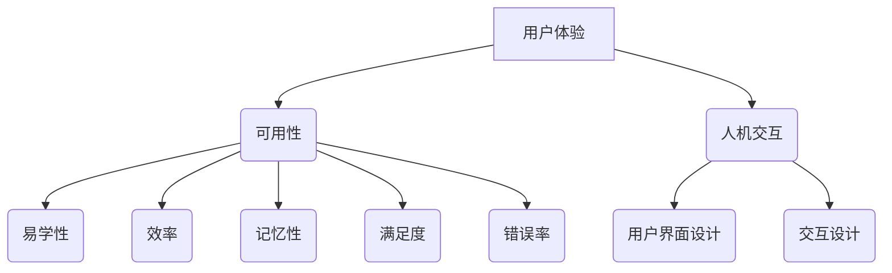

                 

## 用户界面设计：打造友好易用的人机交互

> 关键词：用户界面设计，人机交互，可用性，用户体验，信息架构，交互设计，视觉设计，用户研究

### 1. 背景介绍

在当今数字时代，用户界面（UI）设计已成为至关重要的领域。随着科技的飞速发展，人们与计算机的交互方式日益多样化，从传统的鼠标键盘操作到如今的触摸屏、语音识别、甚至脑机接口，UI设计需要不断适应新的交互模式和用户需求。

一个优秀的UI设计不仅能提升用户体验，还能有效地传达信息、引导用户完成任务，并增强用户对产品的满意度和忠诚度。然而，设计一个友好易用的UI并非易事，它需要设计师具备深厚的理论知识、丰富的实践经验以及对用户心理和行为的深刻理解。

### 2. 核心概念与联系

#### 2.1 用户体验（UX）

用户体验是指用户与产品或系统交互时所感受到的整体感受。它涵盖了用户对产品的易用性、可用性、美观度、效率、愉悦感等方面的感知。

#### 2.2 可用性（Usability）

可用性是指用户能够轻松、有效地使用产品或系统完成目标任务的能力。它包括以下几个方面：

* **易学性：** 新用户能够快速理解并开始使用产品。
* **效率：** 熟悉用户能够快速高效地完成任务。
* **记忆性：** 用户能够记住如何使用产品，即使长时间未使用。
* **满足度：** 用户对使用产品的感受是愉快的。
* **错误率：** 用户在使用过程中犯错的频率和严重程度。

#### 2.3 人机交互（HCI）

人机交互是指人与计算机系统之间进行信息交换和操作的整个过程。它涉及到用户界面设计、交互设计、认知心理学、计算机科学等多个领域。

**核心概念关系图**



### 3. 核心算法原理 & 具体操作步骤

#### 3.1 算法原理概述

UI设计中，并没有固定的算法，而是需要设计师根据用户需求、产品功能、设计原则等因素进行综合考虑和决策。然而，一些设计模式和原则可以帮助设计师提高UI设计的效率和质量。

#### 3.2 算法步骤详解

1. **用户研究:** 了解目标用户群体、他们的需求、行为模式、偏好等。
2. **信息架构:**  规划和组织产品信息，使其易于理解和导航。
3. **交互设计:** 设计用户与产品交互的方式，包括按钮、菜单、导航等元素。
4. **视觉设计:**  确定产品的外观风格、颜色、字体、布局等视觉元素。
5. **原型制作:**  创建交互原型，用于测试和验证设计方案。
6. **用户测试:**  邀请用户使用原型进行测试，收集反馈并进行迭代优化。
7. **开发和发布:**  将最终的设计方案转化为可运行的产品。

#### 3.3 算法优缺点

* **优点:** 

    * 能够提高UI设计的效率和质量。
    * 能够更好地满足用户需求。
    * 能够降低开发成本和时间。

* **缺点:** 

    * 需要设计师具备一定的专业知识和经验。
    * 需要投入时间和资源进行用户研究和测试。
    * 设计方案需要不断迭代优化，才能最终达到理想效果。

#### 3.4 算法应用领域

UI设计算法广泛应用于各种领域，例如：

* **移动应用:**  设计简洁易用的手机应用界面。
* **网站设计:**  打造用户体验良好的网站。
* **游戏设计:**  创造沉浸式的游戏界面。
* **软件开发:**  设计友好的软件用户界面。

### 4. 数学模型和公式 & 详细讲解 & 举例说明

#### 4.1 数学模型构建

在UI设计中，可以使用数学模型来分析用户行为、评估设计方案的有效性等。例如，可以使用用户行为模型来预测用户在不同界面上的操作路径，从而优化界面结构和导航设计。

#### 4.2 公式推导过程

例如，可以使用点击率（Click-Through Rate，CTR）来衡量用户点击某个元素的概率。CTR的公式如下：

$$CTR = \frac{点击次数}{展示次数}$$

#### 4.3 案例分析与讲解

假设一个网站的banner广告展示了1000次，其中有200次被用户点击，那么该banner广告的CTR为：

$$CTR = \frac{200}{1000} = 0.2$$

这意味着20%的用户点击了该banner广告。

### 5. 项目实践：代码实例和详细解释说明

#### 5.1 开发环境搭建

UI设计通常使用设计软件和开发工具进行实现。常见的UI设计软件包括Figma、Sketch、Adobe XD等，而开发工具则包括HTML、CSS、JavaScript等。

#### 5.2 源代码详细实现

以下是一个简单的HTML代码示例，展示了一个基本的按钮：

```html
<button>点击我</button>
```

#### 5.3 代码解读与分析

这段代码定义了一个按钮元素，文本内容为“点击我”。用户可以点击这个按钮来触发相应的事件。

#### 5.4 运行结果展示

当浏览器加载这段代码时，会显示一个“点击我”的按钮。用户点击按钮后，可以根据JavaScript代码实现相应的逻辑操作。

### 6. 实际应用场景

#### 6.1 移动应用

UI设计在移动应用中至关重要，因为它直接影响着用户的使用体验。例如，一个电商应用需要设计简洁易用的商品列表页面、流畅的购物车流程、安全的支付界面等。

#### 6.2 网站设计

网站UI设计需要考虑用户导航、信息架构、视觉美感等多个方面。例如，一个新闻网站需要设计清晰的栏目结构、易于阅读的新闻内容、方便的搜索功能等。

#### 6.3 游戏设计

游戏UI设计需要考虑游戏玩法、用户操作、游戏氛围等因素。例如，一个动作游戏需要设计清晰的技能按钮、直观的血量条、流畅的战斗界面等。

#### 6.4 未来应用展望

随着科技的发展，UI设计将更加智能化、个性化、沉浸式。例如，人工智能可以帮助设计师自动生成UI设计方案，虚拟现实和增强现实技术可以创造更加逼真的交互体验。

### 7. 工具和资源推荐

#### 7.1 学习资源推荐

* **书籍:**

    * 《Don't Make Me Think》 by Steve Krug
    * 《The Design of Everyday Things》 by Don Norman
    * 《Lean UX》 by Jeff Gothelf

* **网站:**

    * Nielsen Norman Group (nngroup.com)
    * UX Collective (uxdesign.cc)
    * Smashing Magazine (smashingmagazine.com)

#### 7.2 开发工具推荐

* **设计软件:**

    * Figma (figma.com)
    * Sketch (sketch.com)
    * Adobe XD (adobe.com/products/xd.html)

* **开发工具:**

    * HTML (w3schools.com/html)
    * CSS (w3schools.com/css)
    * JavaScript (w3schools.com/js)

#### 7.3 相关论文推荐

* **论文:**

    * "The Design of Everyday Things" by Don Norman
    * "Usability Engineering" by Jakob Nielsen
    * "Information Architecture for the World Wide Web" by Peter Morville

### 8. 总结：未来发展趋势与挑战

#### 8.1 研究成果总结

UI设计已经取得了长足的进步，从传统的桌面应用到如今的移动应用、游戏、虚拟现实等，UI设计不断适应新的交互模式和用户需求。

#### 8.2 未来发展趋势

* **智能化:**  人工智能将被广泛应用于UI设计，例如自动生成设计方案、个性化定制界面等。
* **个性化:**  UI设计将更加注重用户的个性化需求，例如根据用户的喜好、行为模式等定制界面。
* **沉浸式:**  虚拟现实和增强现实技术将创造更加沉浸式的交互体验。

#### 8.3 面临的挑战

* **跨平台兼容性:**  随着不同平台和设备的不断涌现，UI设计需要考虑跨平台兼容性问题。
* **用户隐私保护:**  随着UI设计越来越智能化，用户隐私保护问题也日益重要。
* **设计伦理:**  随着AI技术的应用，UI设计需要考虑伦理问题，例如算法偏见、数据安全等。

#### 8.4 研究展望

未来UI设计的研究方向将更加注重用户体验、人工智能、跨平台兼容性、用户隐私保护等方面。


### 9. 附录：常见问题与解答

#### 9.1 如何提高UI设计的可用性？

* **进行用户研究:**  了解目标用户群体、他们的需求、行为模式等。
* **遵循设计原则:**  例如，一致性、可预测性、可控制性等。
* **进行用户测试:**  邀请用户使用原型进行测试，收集反馈并进行迭代优化。

#### 9.2 如何设计一个友好的移动应用界面？

* **简洁明了:**  避免过多的信息和元素，保持界面简洁易懂。
* **直观易用:**  设计清晰的导航结构、直观的交互方式。
* **响应式设计:**  确保界面在不同屏幕尺寸上都能正常显示和交互。

#### 9.3 如何使用AI技术辅助UI设计？

* **自动生成设计方案:**  使用AI算法生成多种设计方案供设计师选择。
* **个性化定制界面:**  根据用户的喜好、行为模式等定制个性化的界面。
* **优化设计方案:**  使用AI算法分析用户行为数据，优化设计方案的有效性。


作者：禅与计算机程序设计艺术 / Zen and the Art of Computer Programming 
<end_of_turn>

