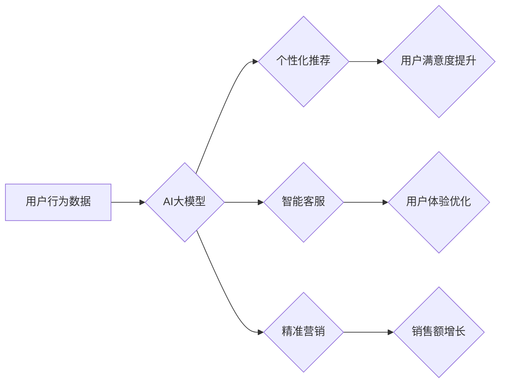

                 

## 电商平台中的AI大模型：从单一推荐到全场景智能化

> 关键词：电商平台、AI大模型、推荐系统、自然语言处理、计算机视觉、智能客服、个性化服务、场景化应用

## 1. 背景介绍

随着电商平台的蓬勃发展，用户对个性化、智能化服务的需求日益增长。传统电商平台依靠规则引擎和简单的机器学习算法难以满足用户多样化的需求。而AI大模型的出现，为电商平台带来了全新的机遇，使其能够提供更精准、更智能、更全面的服务体验。

AI大模型，是指在海量数据上训练的深度学习模型，拥有强大的泛化能力和学习能力。它能够理解和处理复杂的文本、图像、音频等数据，并从中提取有价值的信息。在电商平台的应用场景中，AI大模型可以实现从单一推荐到全场景智能化的转变，为用户提供更加个性化、智能化的购物体验。

## 2. 核心概念与联系

### 2.1  AI大模型

AI大模型是指在海量数据上训练的深度学习模型，其参数量通常在数十亿甚至数千亿级别。它能够学习复杂的模式和关系，并应用于各种自然语言处理、计算机视觉、语音识别等任务。

### 2.2  电商平台场景

电商平台是一个复杂的系统，包含用户、商品、订单、支付、物流等多个模块。用户在电商平台上进行商品浏览、搜索、购买、评价等行为，平台需要收集和分析这些数据，以提供个性化推荐、智能客服、精准营销等服务。

### 2.3  AI大模型与电商平台的结合

AI大模型可以应用于电商平台的多个场景，例如：

* **商品推荐:** 基于用户的历史购买记录、浏览记录、兴趣偏好等数据，推荐用户可能感兴趣的商品。
* **搜索引擎优化:** 理解用户搜索意图，提供更精准的搜索结果。
* **智能客服:** 利用自然语言处理技术，自动回复用户咨询，解决用户问题。
* **个性化营销:** 根据用户的行为数据，进行精准的营销推送。
* **内容生成:** 自动生成商品描述、促销文案等内容。

**Mermaid 流程图**



## 3. 核心算法原理 & 具体操作步骤

### 3.1  算法原理概述

在电商平台中，常用的AI大模型算法包括：

* **Transformer:**  一种基于注意力机制的深度学习模型，能够处理长文本序列，在自然语言处理任务中表现出色。
* **BERT:**  一种基于Transformer的预训练语言模型，能够理解上下文信息，在文本分类、问答等任务中取得优异效果。
* **Recurrent Neural Networks (RNN):**  一种能够处理序列数据的深度学习模型，常用于推荐系统和文本生成任务。
* **Graph Neural Networks (GNN):**  一种能够处理图结构数据的深度学习模型，常用于社交网络分析和商品关系挖掘。

### 3.2  算法步骤详解

以商品推荐为例，使用Transformer模型进行推荐的具体步骤如下：

1. **数据预处理:** 收集用户行为数据，例如浏览记录、购买记录、评分等，并进行清洗、转换、编码等操作。
2. **模型训练:** 使用预训练的Transformer模型，在准备好的数据上进行微调，训练出能够预测用户兴趣的模型参数。
3. **模型预测:** 将用户的历史行为数据作为输入，模型根据训练好的参数预测用户可能感兴趣的商品。
4. **结果排序:** 对预测结果进行排序，将用户可能感兴趣的商品排在前面。
5. **展示推荐:** 将排序后的商品推荐给用户。

### 3.3  算法优缺点

**优点:**

* **精准度高:**  AI大模型能够学习用户复杂的兴趣偏好，提供更精准的推荐。
* **个性化强:**  AI大模型能够根据用户的不同特征，提供个性化的推荐服务。
* **自动化程度高:**  AI大模型能够自动完成推荐任务，降低人工成本。

**缺点:**

* **数据依赖性强:**  AI大模型需要海量数据进行训练，否则效果难以保证。
* **计算资源消耗大:**  训练AI大模型需要大量的计算资源，成本较高。
* **可解释性差:**  AI大模型的决策过程较为复杂，难以解释其推荐结果。

### 3.4  算法应用领域

AI大模型在电商平台的应用领域非常广泛，例如：

* **商品推荐:**  根据用户的历史行为数据，推荐用户可能感兴趣的商品。
* **搜索引擎优化:**  理解用户搜索意图，提供更精准的搜索结果。
* **智能客服:**  利用自然语言处理技术，自动回复用户咨询，解决用户问题。
* **个性化营销:**  根据用户的行为数据，进行精准的营销推送。
* **内容生成:**  自动生成商品描述、促销文案等内容。

## 4. 数学模型和公式 & 详细讲解 & 举例说明

### 4.1  数学模型构建

在商品推荐系统中，可以使用协同过滤算法构建数学模型。协同过滤算法基于用户的历史行为数据，预测用户对商品的评分或购买意愿。

**用户-商品评分矩阵:**

用户-商品评分矩阵是一个二维矩阵，其中每一行代表一个用户，每一列代表一个商品。矩阵中的每个元素表示用户对商品的评分或购买行为。

**公式:**

$$
r_{ui} = f(u, i, \theta_u, \theta_i)
$$

其中：

* $r_{ui}$ 表示用户 $u$ 对商品 $i$ 的评分或购买行为。
* $f$ 是一个评分函数，例如线性回归函数或神经网络函数。
* $\theta_u$ 是用户 $u$ 的特征向量。
* $\theta_i$ 是商品 $i$ 的特征向量。

### 4.2  公式推导过程

协同过滤算法的目标是学习用户和商品的特征向量，以便预测用户对商品的评分或购买行为。可以使用梯度下降算法来优化评分函数的参数，使得预测结果与实际评分或购买行为尽可能接近。

**梯度下降算法:**

$$
\theta_u = \theta_u - \alpha \frac{\partial L}{\partial \theta_u}
$$

$$
\theta_i = \theta_i - \alpha \frac{\partial L}{\partial \theta_i}
$$

其中：

* $\alpha$ 是学习率。
* $L$ 是损失函数，例如均方误差函数。

### 4.3  案例分析与讲解

假设有一个用户-商品评分矩阵，其中包含了用户对电影的评分数据。可以使用协同过滤算法来预测用户对某个电影的评分。

例如，用户 $A$ 对电影 $X$ 和电影 $Y$ 的评分分别为 5 和 4，用户 $B$ 对电影 $X$ 和电影 $Z$ 的评分分别为 4 和 3。

可以使用协同过滤算法学习用户 $A$ 和用户 $B$ 的特征向量，以及电影 $X$、电影 $Y$ 和电影 $Z$ 的特征向量。然后，可以利用这些特征向量来预测用户 $A$ 对电影 $Z$ 的评分。

## 5. 项目实践：代码实例和详细解释说明

### 5.1  开发环境搭建

* **操作系统:**  Linux 或 macOS
* **编程语言:**  Python
* **深度学习框架:**  TensorFlow 或 PyTorch
* **其他工具:**  Git、Jupyter Notebook

### 5.2  源代码详细实现

```python
# 使用 TensorFlow 实现商品推荐系统

import tensorflow as tf

# 定义用户-商品评分矩阵
ratings = tf.constant([[5, 4, 0],
                      [4, 3, 5],
                      [0, 5, 4]])

# 定义用户和商品的特征向量
user_embeddings = tf.Variable(tf.random.normal([3, 10]))
item_embeddings = tf.Variable(tf.random.normal([3, 10]))

# 计算预测评分
predictions = tf.reduce_sum(user_embeddings * item_embeddings, axis=1)

# 定义损失函数
loss = tf.reduce_mean(tf.square(predictions - ratings))

# 定义优化器
optimizer = tf.keras.optimizers.Adam()

# 训练模型
for epoch in range(100):
    with tf.GradientTape() as tape:
        loss_value = loss
    gradients = tape.gradient(loss_value, [user_embeddings, item_embeddings])
    optimizer.apply_gradients(zip(gradients, [user_embeddings, item_embeddings]))

# 打印训练结果
print(loss_value)
```

### 5.3  代码解读与分析

* 代码首先定义了用户-商品评分矩阵和用户、商品的特征向量。
* 然后，使用 TensorFlow 的张量运算来计算预测评分。
* 定义了均方误差作为损失函数，并使用 Adam 优化器进行模型训练。
* 训练过程迭代更新用户和商品的特征向量，使得预测评分与实际评分尽可能接近。

### 5.4  运行结果展示

训练完成后，可以将训练好的模型用于预测用户对新商品的评分。

## 6. 实际应用场景

### 6.1  个性化推荐

AI大模型可以根据用户的历史购买记录、浏览记录、兴趣偏好等数据，推荐用户可能感兴趣的商品。例如，电商平台可以根据用户的购物历史，推荐用户可能喜欢的商品类别、品牌、款式等。

### 6.2  智能客服

AI大模型可以利用自然语言处理技术，自动回复用户咨询，解决用户问题。例如，电商平台可以部署智能客服机器人，帮助用户查询订单状态、退换货流程、商品信息等。

### 6.3  精准营销

AI大模型可以根据用户的行为数据，进行精准的营销推送。例如，电商平台可以根据用户的购物习惯，推送个性化的优惠券、促销活动、新品推荐等。

### 6.4  未来应用展望

随着AI技术的不断发展，AI大模型在电商平台的应用场景将更加广泛，例如：

* **视觉搜索:**  用户可以通过拍摄商品图片，进行视觉搜索，找到与之相似的商品。
* **虚拟试衣间:**  用户可以通过虚拟试衣间，试穿不同的衣服，选择最适合自己的服装。
* **个性化商品设计:**  用户可以根据自己的喜好，定制个性化的商品。

## 7. 工具和资源推荐

### 7.1  学习资源推荐

* **书籍:**
    * 《深度学习》
    * 《自然语言处理》
    * 《机器学习》
* **在线课程:**
    * Coursera
    * edX
    * Udacity

### 7.2  开发工具推荐

* **深度学习框架:**
    * TensorFlow
    * PyTorch
* **数据处理工具:**
    * Pandas
    * NumPy
* **可视化工具:**
    * Matplotlib
    * Seaborn

### 7.3  相关论文推荐

* BERT: Pre-training of Deep Bidirectional Transformers for Language Understanding
* Transformer: Attention Is All You Need
* Graph Convolutional Networks for Web-Scale Recommender Systems

## 8. 总结：未来发展趋势与挑战

### 8.1  研究成果总结

AI大模型在电商平台的应用取得了显著成果，例如：

* **推荐精度提升:**  AI大模型能够提供更精准的商品推荐，提升用户购物体验。
* **客服效率提升:**  智能客服机器人能够自动回复用户咨询，提高客服效率。
* **营销精准度提升:**  AI大模型能够进行精准的营销推送，提升营销效果。

### 8.2  未来发展趋势

* **模型规模化:**  未来AI大模型的规模将进一步扩大，拥有更多的参数，能够处理更复杂的数据。
* **多模态融合:**  未来AI大模型将融合文本、图像、音频等多模态数据，提供更全面的服务体验。
* **场景化应用:**  未来AI大模型将更加场景化，针对不同的电商平台场景，提供定制化的解决方案。

### 8.3  面临的挑战

* **数据隐私保护:**  AI大模型需要海量数据进行训练，如何保护用户数据隐私是一个重要的挑战。
* **算法可解释性:**  AI大模型的决策过程较为复杂，难以解释其推荐结果，如何提高算法可解释性是一个重要的研究方向。
* **模型部署成本:**  训练和部署大型AI模型需要大量的计算资源，成本较高。

### 8.4  研究展望

未来，AI大模型在电商平台的应用将更加广泛，更加智能化，为用户提供更加个性化、便捷、智能化的购物体验。


## 9. 附录：常见问题与解答

**Q1:  AI大模型的训练需要多少数据？**

**A1:**  AI大模型的训练数据量取决于模型的复杂度和任务的难度。一般来说，需要海量数据才能训练出效果良好的AI大模型。

**Q2:  如何评估AI大模型的性能？**

**A2:**  可以使用各种指标来评估AI大模型的性能，例如准确率、召回率、F1-score等。

**Q3:  如何解决AI大模型的算法可解释性问题？**

**A3:**  目前，一些研究方法可以提高AI大模型的算法可解释性，例如：

* **注意力机制:**  通过分析模型的注意力权重，可以了解模型在哪些方面关注用户数据。
* **局部解释方法:**  例如LIME和SHAP，可以解释单个预测结果背后的决策过程。

**Q4:  AI大模型的部署成本高吗？**

**A4:**  是的，训练和部署大型AI模型需要大量的计算资源，成本较高。但是，随着云计算技术的不断发展，部署AI模型的成本也在逐渐降低。


作者：禅与计算机程序设计艺术 / Zen and the Art of Computer Programming<end_of_turn>

