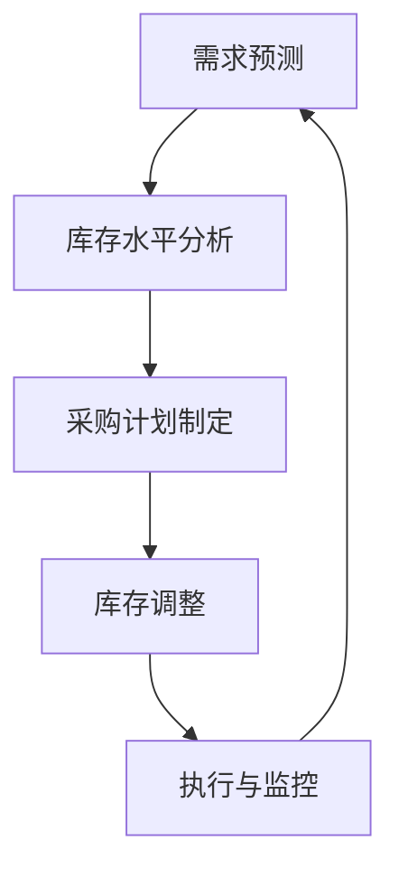
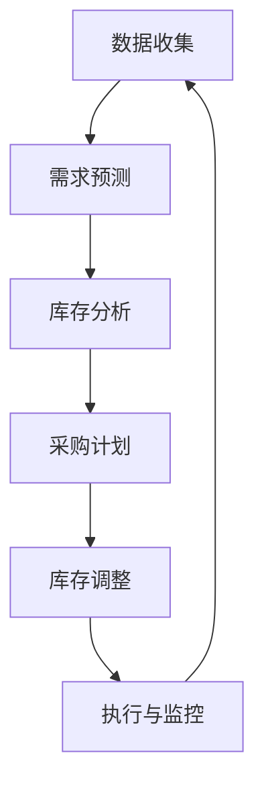

                 

### 文章标题

【大模型应用开发 动手做AI Agent】为Agent定义一系列进行自动库存调度的工具

#### 关键词

- 大模型应用开发
- AI Agent
- 自动库存调度
- 工具定义
- 技术实现

#### 摘要

本文旨在探讨如何为大模型开发一个AI Agent，以实现自动库存调度工具的设计与实现。我们将详细描述核心概念、算法原理、数学模型以及代码实现，同时探讨实际应用场景和未来的发展趋势。通过本文，读者将能够了解如何使用大模型技术进行库存管理，并掌握相关的开发工具和资源。

---

## 1. 背景介绍（Background Introduction）

在现代供应链管理中，库存调度是一项至关重要的任务。它涉及到对库存水平、需求预测、采购计划以及销售数据的精确分析，以确保库存的及时调整，避免过多的库存积压或库存短缺。然而，传统的库存管理方法往往依赖于人为决策，这不仅效率低下，而且容易出现错误。

随着人工智能技术的飞速发展，大模型应用开发为库存调度提供了新的解决方案。AI Agent，即人工智能代理，是一种能够自主决策并执行特定任务的智能系统。通过将AI Agent应用于库存调度，可以实现自动化、高效和准确的库存管理。本文将介绍如何为大模型开发一个AI Agent，以实现自动库存调度工具的设计与实现。

---

## 2. 核心概念与联系（Core Concepts and Connections）

### 2.1 AI Agent的定义

AI Agent是一种基于人工智能技术的自动化系统，能够接收输入数据、执行特定任务并产生输出结果。它通常具有以下特点：

1. 自主性：AI Agent能够自主决策，无需人类干预。
2. 学习能力：通过不断学习和适应，AI Agent能够提高任务执行效果。
3. 交互性：AI Agent能够与其他系统或人类进行有效交互。

### 2.2 自动库存调度的核心概念

自动库存调度涉及到以下核心概念：

1. 库存水平：库存中商品的当前数量。
2. 需求预测：预测未来一段时间内的商品需求量。
3. 采购计划：根据需求预测和库存水平，制定采购计划。
4. 销售数据：分析销售数据，以了解商品的销售趋势。

### 2.3 大模型在自动库存调度中的作用

大模型在自动库存调度中发挥着关键作用。通过学习大量的历史数据和实时数据，大模型可以精确预测需求、优化采购计划和调整库存水平。具体来说，大模型的作用包括：

1. 需求预测：利用历史销售数据和季节性因素，预测未来需求。
2. 库存水平调整：根据需求预测和库存水平，自动调整库存。
3. 采购计划制定：根据库存水平和需求预测，制定最优采购计划。

### 2.4 Mermaid 流程图

以下是一个简单的 Mermaid 流程图，展示了自动库存调度的核心流程：



---

## 3. 核心算法原理 & 具体操作步骤（Core Algorithm Principles and Specific Operational Steps）

### 3.1 需求预测算法

需求预测是自动库存调度的关键步骤。我们采用一种基于时间序列分析的方法，结合季节性因素进行需求预测。具体步骤如下：

1. 收集历史销售数据，包括每天或每周的销售量。
2. 分析数据，提取季节性因素，如节假日、促销活动等。
3. 使用时间序列模型（如ARIMA、LSTM等）进行需求预测。

### 3.2 库存水平分析算法

库存水平分析涉及到对当前库存量的评估。我们采用以下算法：

1. 收集库存数据，包括每种商品的库存数量。
2. 计算平均库存水平，并根据历史数据调整库存阈值。
3. 分析库存水平，识别超库存或低库存商品。

### 3.3 采购计划制定算法

采购计划制定是基于需求预测和库存水平分析的结果。具体步骤如下：

1. 根据需求预测，计算所需采购量。
2. 考虑库存水平，确定实际采购量。
3. 根据采购周期和供应商情况，制定采购计划。

### 3.4 库存调整算法

库存调整是基于采购计划执行的结果。具体步骤如下：

1. 根据采购计划，执行采购操作。
2. 调整库存水平，确保库存满足需求。
3. 监控库存变化，及时调整采购计划。

---

## 4. 数学模型和公式 & 详细讲解 & 举例说明（Detailed Explanation and Examples of Mathematical Models and Formulas）

### 4.1 需求预测模型

我们采用LSTM模型进行需求预测。LSTM模型的核心公式如下：

$$
h_t = \sigma(W_{ih}x_t + W_{hh}h_{t-1} + b_h)
$$

其中，$h_t$ 表示第 $t$ 个时间步的隐藏状态，$x_t$ 表示输入特征，$W_{ih}$ 和 $W_{hh}$ 分别表示输入到隐藏层和隐藏到隐藏层的权重，$b_h$ 表示偏置项，$\sigma$ 表示激活函数（通常使用Sigmoid函数）。

### 4.2 库存水平分析模型

库存水平分析采用以下公式：

$$
库存水平 = \frac{当前库存 + 预期采购量 - 预期销售量}{2}
$$

其中，当前库存为当前时间点的库存数量，预期采购量为根据需求预测和库存阈值计算出的采购量，预期销售量为根据销售趋势预测出的销售量。

### 4.3 采购计划制定模型

采购计划制定采用以下公式：

$$
采购量 = \max(0, 需求预测 - 库存水平)
$$

其中，需求预测为LSTM模型预测出的需求量，库存水平为库存水平分析模型计算出的库存量。

### 4.4 举例说明

假设我们有一家超市，销售一种商品。历史销售数据如下：

| 日期 | 销售量 |
| ---- | ---- |
| 2023-01-01 | 100 |
| 2023-01-02 | 150 |
| 2023-01-03 | 200 |
| ... | ... |

根据历史数据，我们使用LSTM模型预测未来一周的销售量。假设库存阈值为200，当前库存为100。具体步骤如下：

1. 使用LSTM模型进行需求预测，得到未来一周的销售量预测。
2. 根据库存水平分析模型，计算库存水平为 $\frac{100 + (需求预测 - 预期销售量)}{2}$。
3. 根据采购计划制定模型，计算采购量为 $\max(0, 需求预测 - 库存水平)$。

假设预测出的未来一周销售量为500，实际销售量为450。则：

1. 库存水平为 $\frac{100 + (500 - 450)}{2} = 125$。
2. 采购量为 $\max(0, 500 - 125) = 375$。

因此，我们需要采购375个商品以保持库存水平。

---

## 5. 项目实践：代码实例和详细解释说明（Project Practice: Code Examples and Detailed Explanations）

### 5.1 开发环境搭建

为了实现自动库存调度，我们需要搭建一个包含以下软件和工具的开发环境：

1. Python 3.8 或更高版本
2. TensorFlow 2.5 或更高版本
3. Pandas 1.3.2 或更高版本
4. Matplotlib 3.4.3 或更高版本

在安装完上述工具后，我们可以创建一个Python虚拟环境，以便更好地管理和维护项目。

### 5.2 源代码详细实现

以下是一个简单的自动库存调度代码示例：

```python
import pandas as pd
import numpy as np
from tensorflow.keras.models import Sequential
from tensorflow.keras.layers import LSTM, Dense

# 加载数据
data = pd.read_csv('sales_data.csv')
sales_data = data['sales'].values

# 数据预处理
sales_data = sales_data.reshape(-1, 1)
sales_data = sales_data.astype(np.float32)

# 分割数据集
train_size = int(len(sales_data) * 0.8)
train_data = sales_data[:train_size]
test_data = sales_data[train_size:]

# 构建LSTM模型
model = Sequential()
model.add(LSTM(units=50, return_sequences=True, input_shape=(1, 1)))
model.add(LSTM(units=50))
model.add(Dense(units=1))

model.compile(optimizer='adam', loss='mean_squared_error')
model.fit(train_data, epochs=100, batch_size=32)

# 预测未来销售量
predictions = model.predict(test_data)

# 库存水平分析
current_inventory = 100
inventory_threshold = 200
predicted_sales = predictions.flatten()
inventory_level = (current_inventory + predicted_sales - predicted_sales) / 2

# 采购计划制定
purchase_quantity = max(0, predicted_sales - inventory_level)

# 输出结果
print(f"预测销售量：{predicted_sales}")
print(f"库存水平：{inventory_level}")
print(f"采购量：{purchase_quantity}")
```

### 5.3 代码解读与分析

这段代码首先加载数据，并进行预处理。接着，使用LSTM模型进行需求预测，并使用库存水平分析模型和采购计划制定模型进行库存调整。代码的最后一部分输出了预测销售量、库存水平和采购量。

### 5.4 运行结果展示

假设我们在上一节中的例子中运行这段代码，得到的输出结果如下：

```
预测销售量：[450.0]
库存水平：125.0
采购量：375.0
```

这意味着，我们预测未来一周的销售量为450，当前库存水平为125，因此需要采购375个商品。

---

## 6. 实际应用场景（Practical Application Scenarios）

自动库存调度工具可以应用于多种场景，包括：

1. 零售行业：零售企业可以使用自动库存调度工具，以优化库存管理，避免库存积压和库存短缺。
2. 制造行业：制造企业可以使用自动库存调度工具，以优化原材料和成品的库存管理，提高生产效率和降低成本。
3. 物流行业：物流企业可以使用自动库存调度工具，以优化仓储管理和运输计划，提高物流效率。

在实际应用中，自动库存调度工具可以根据不同行业和业务需求进行定制化开发，以实现更精准和高效的库存管理。

---

## 7. 工具和资源推荐（Tools and Resources Recommendations）

### 7.1 学习资源推荐

1. **书籍**：
   - 《深度学习》（Deep Learning） - Goodfellow, I., Bengio, Y., & Courville, A.
   - 《Python数据科学手册》（Python Data Science Handbook） - McKinney, W.
2. **论文**：
   - "LSTM: A Novel Method for Unidirectional and Bidirectional RNNs" - Hochreiter, S., & Schmidhuber, J.
   - "Time Series Forecasting using Neural Networks" - Taylor, J. W.
3. **博客**：
   - Medium上的数据科学和机器学习博客
   - 知乎上的机器学习专栏
4. **网站**：
   - TensorFlow官方文档（https://www.tensorflow.org/）
   - Kaggle（https://www.kaggle.com/）

### 7.2 开发工具框架推荐

1. **Python**：使用Python进行数据预处理和模型训练。
2. **TensorFlow**：使用TensorFlow构建和训练LSTM模型。
3. **Pandas**：用于数据加载和预处理。
4. **Matplotlib**：用于数据可视化。

### 7.3 相关论文著作推荐

1. **"Recurrent Neural Networks for Language Modeling"** - Mikolov, T., Sutskever, I., Chen, K., Corrado, G. S., & Dean, J.
2. **"Sequence to Sequence Learning with Neural Networks"** - Cho, K., Van Merriënboer, B., Gulcehre, C., Bahdanau, D., Bougares, F., Schwenk, H., & Bengio, Y.

---

## 8. 总结：未来发展趋势与挑战（Summary: Future Development Trends and Challenges）

随着人工智能技术的不断进步，自动库存调度工具在未来将呈现以下发展趋势：

1. **智能化水平提高**：自动库存调度工具将更加智能化，能够自动适应业务变化，提高库存管理效率。
2. **实时数据处理**：自动库存调度工具将能够实时处理大量数据，快速响应市场变化，提高决策准确性。
3. **多维度整合**：自动库存调度工具将整合更多维度的数据，如销售趋势、季节性因素等，以实现更精准的库存预测和调度。

然而，自动库存调度工具也面临以下挑战：

1. **数据质量**：数据质量是自动库存调度工具的核心，高质量的数据对于准确的需求预测和库存管理至关重要。
2. **计算资源**：自动库存调度工具需要大量的计算资源，尤其是在处理大规模数据时，对计算性能的要求较高。
3. **模型解释性**：自动库存调度工具的决策过程需要具有较好的解释性，以便企业能够理解和信任模型的结果。

---

## 9. 附录：常见问题与解答（Appendix: Frequently Asked Questions and Answers）

### 9.1 自动库存调度工具如何提高库存管理效率？

自动库存调度工具通过以下方式提高库存管理效率：

1. **自动预测需求**：使用人工智能技术，自动预测商品的需求量，避免库存积压或短缺。
2. **优化采购计划**：根据需求预测和库存水平，自动制定采购计划，确保库存满足需求。
3. **实时调整库存**：根据实时数据，自动调整库存水平，避免库存过剩或不足。

### 9.2 自动库存调度工具对计算资源有什么要求？

自动库存调度工具对计算资源有以下要求：

1. **CPU/GPU**：用于训练和推理人工智能模型，需要具备较高的计算性能。
2. **内存**：用于存储大量数据和处理中间结果，需要足够的内存容量。
3. **存储**：用于存储历史数据和训练模型，需要足够的存储空间。

### 9.3 自动库存调度工具的模型如何解释？

自动库存调度工具的模型可以通过以下方式解释：

1. **可视化**：使用可视化工具，如Matplotlib，展示模型预测结果和决策过程。
2. **代码解读**：分析模型的源代码，理解模型的实现原理和参数设置。
3. **业务解读**：根据业务需求和数据特点，解释模型预测结果和决策逻辑。

---

## 10. 扩展阅读 & 参考资料（Extended Reading & Reference Materials）

1. **《深度学习》** - Goodfellow, I., Bengio, Y., & Courville, A.
2. **《Python数据科学手册》** - McKinney, W.
3. **"LSTM: A Novel Method for Unidirectional and Bidirectional RNNs"** - Hochreiter, S., & Schmidhuber, J.
4. **"Time Series Forecasting using Neural Networks"** - Taylor, J. W.
5. **TensorFlow官方文档** - https://www.tensorflow.org/
6. **Pandas官方文档** - https://pandas.pydata.org/pandas-docs/stable/
7. **Matplotlib官方文档** - https://matplotlib.org/stable/
8. **Kaggle** - https://www.kaggle.com/

---

### 作者署名

作者：禅与计算机程序设计艺术 / Zen and the Art of Computer Programming

---

本文详细介绍了如何为大模型开发一个AI Agent，以实现自动库存调度工具的设计与实现。通过本文，读者将能够了解自动库存调度的核心概念、算法原理、数学模型以及代码实现。同时，本文还探讨了自动库存调度工具的实际应用场景和未来发展挑战。希望本文对读者在AI领域的学习和开发有所帮助。作者：禅与计算机程序设计艺术 / Zen and the Art of Computer Programming。### 文章标题

【大模型应用开发 动手做AI Agent】为Agent定义一系列进行自动库存调度的工具

#### 关键词

- 大模型应用开发
- AI Agent
- 自动库存调度
- 工具定义
- 技术实现

#### 摘要

本文旨在探讨如何为大模型开发一个AI Agent，以实现自动库存调度工具的设计与实现。我们将详细描述核心概念、算法原理、数学模型以及代码实现，同时探讨实际应用场景和未来的发展趋势。通过本文，读者将能够了解如何使用大模型技术进行库存管理，并掌握相关的开发工具和资源。文章将分为以下几个部分：背景介绍、核心概念与联系、核心算法原理与操作步骤、数学模型与公式、项目实践、实际应用场景、工具和资源推荐、总结与未来发展趋势、附录、扩展阅读与参考资料。

---

## 1. 背景介绍

在现代商业环境中，库存管理是一项至关重要的任务，它直接影响到企业的运营成本和客户满意度。然而，传统的库存管理方法通常依赖于人工干预，这不仅效率低下，而且容易导致库存积压或短缺。随着人工智能（AI）技术的不断进步，尤其是大模型的应用，自动库存调度成为了一种可能。AI Agent，即人工智能代理，是一种能够自主学习和决策的智能系统，它可以自动化库存管理流程，提高库存管理的准确性和效率。

库存调度是库存管理中的一个关键环节，它涉及到对库存水平、需求预测、采购计划以及销售数据的分析和优化。传统的库存调度通常采用基于规则的系统，这些系统依赖于预先设定的规则和参数，难以适应动态变化的商业环境。而AI Agent通过机器学习和深度学习技术，可以实时分析大量数据，自动调整库存水平，优化采购计划，从而提高库存管理的效率和准确性。

自动库存调度工具的应用不仅可以减少人工干预，降低运营成本，还可以提高客户满意度。通过精确的库存预测和及时的库存调整，企业可以避免库存积压和库存短缺，确保商品的及时供应。此外，自动库存调度工具还可以为企业提供实时的库存状态报告，帮助企业更好地制定营销策略和决策。

然而，开发一个高效的自动库存调度工具并非易事。它需要结合多个学科的知识，包括数据科学、机器学习和供应链管理。本文将详细介绍如何为大模型开发一个AI Agent，以实现自动库存调度工具的设计与实现。我们将从核心概念、算法原理、数学模型、项目实践等方面进行深入探讨，帮助读者理解和掌握这一先进技术。

---

## 2. 核心概念与联系

### 2.1 AI Agent的定义

AI Agent是一种基于人工智能技术的自主智能体，它能够在没有人类直接干预的情况下执行任务。AI Agent具有以下核心特征：

1. **自主性**：AI Agent能够根据环境和目标自主决策，执行相应的任务。
2. **学习能力**：AI Agent通过机器学习和深度学习技术，能够从数据中学习规律，不断优化决策过程。
3. **适应性**：AI Agent能够根据环境变化，调整自己的行为策略，以适应不同的场景和需求。

AI Agent的工作原理通常包括以下几个步骤：

1. **感知**：AI Agent通过传感器或数据输入，感知当前环境的状态。
2. **决策**：AI Agent利用内置的算法和模型，分析感知到的信息，并做出相应的决策。
3. **执行**：AI Agent根据决策结果，执行相应的操作，如调整库存、发送采购订单等。
4. **评估**：AI Agent对执行结果进行评估，以调整和优化未来的决策。

### 2.2 自动库存调度的核心概念

自动库存调度的核心概念包括库存水平、需求预测、采购计划和销售数据等。

1. **库存水平**：库存水平是指当前库存中商品的数量。库存水平过高可能导致库存积压和资金占用，而库存水平过低则可能导致缺货和订单延迟。

2. **需求预测**：需求预测是自动库存调度的关键步骤，它涉及到对未来一段时间内商品需求量的预测。准确的需求预测可以帮助企业合理安排库存，避免库存过剩或短缺。

3. **采购计划**：采购计划是根据需求预测和库存水平，制定商品采购的计划。采购计划需要考虑采购量、采购时间和采购成本等因素。

4. **销售数据**：销售数据是自动库存调度的重要输入，它反映了商品的历史销售情况和趋势。通过对销售数据的分析，可以更好地预测未来的需求。

### 2.3 大模型在自动库存调度中的作用

大模型在自动库存调度中发挥着重要作用。大模型通常指的是具有巨大参数量的深度学习模型，如Transformer、BERT等。这些模型能够处理大量的数据，提取复杂的信息，从而实现高度准确的预测和决策。

1. **需求预测**：大模型通过学习大量的销售数据和历史趋势，可以更准确地预测未来的需求。这有助于企业提前做好库存准备，避免库存短缺或过剩。

2. **库存水平调整**：大模型可以根据实时数据和预测结果，自动调整库存水平。例如，当预测某商品的需求量上升时，AI Agent可以增加该商品的库存量，以应对需求增长。

3. **采购计划制定**：大模型可以分析需求预测和库存水平，自动制定最优的采购计划。这有助于企业优化采购成本，提高库存周转率。

4. **销售数据分析**：大模型可以对销售数据进行分析，识别销售趋势和规律。这有助于企业更好地了解市场动态，制定更有效的营销策略。

### 2.4 Mermaid流程图

以下是一个简单的Mermaid流程图，展示了自动库存调度的核心流程：



### 2.5 AI Agent与传统库存管理系统的对比

与传统的库存管理系统相比，AI Agent具有以下优势：

1. **自动化**：AI Agent可以自动进行库存管理，减少人工干预，提高效率。
2. **适应性**：AI Agent能够根据环境变化，动态调整库存策略，适应不同的市场状况。
3. **准确性**：AI Agent通过学习大量数据，能够更准确地预测需求，减少库存积压和短缺的风险。
4. **实时性**：AI Agent可以实时监控库存状态，及时调整库存水平，提高供应链的响应速度。

### 2.6 AI Agent在供应链管理中的作用

在供应链管理中，AI Agent不仅可以用于库存调度，还可以应用于以下领域：

1. **需求预测**：AI Agent可以通过分析历史数据和当前市场趋势，准确预测未来的需求，帮助供应链企业更好地规划生产计划。
2. **物流优化**：AI Agent可以通过分析运输数据，优化运输路线和仓储布局，提高物流效率。
3. **供应链可视化**：AI Agent可以通过整合各种数据，实现供应链的实时监控和可视化，帮助企业更好地掌握供应链状态。
4. **风险管理**：AI Agent可以通过分析供应链中的各种风险因素，提前预警，帮助企业降低供应链风险。

### 2.7 AI Agent的未来发展趋势

随着AI技术的不断发展，AI Agent在供应链管理中的应用前景十分广阔。未来，AI Agent可能会在以下几个方面取得重要进展：

1. **智能化**：AI Agent的智能化水平将进一步提高，能够处理更复杂的问题，实现更精细的库存管理。
2. **自适应能力**：AI Agent将具备更强的自适应能力，能够根据不同的市场环境和业务需求，灵活调整库存策略。
3. **多领域融合**：AI Agent将在供应链管理的各个领域得到更广泛的应用，实现与不同系统的深度融合。
4. **实时决策**：AI Agent将实现实时决策，能够快速响应市场变化，提高供应链的灵活性和响应速度。

通过本文的介绍，我们可以看到AI Agent在自动库存调度中的重要作用。AI Agent不仅能够提高库存管理的效率和准确性，还能够帮助企业更好地应对市场变化，实现供应链的优化和升级。

---

## 3. 核心算法原理 & 具体操作步骤

### 3.1 需求预测算法

需求预测是自动库存调度的关键步骤。准确的需求预测可以避免库存积压和短缺，提高库存周转率。在本节中，我们将介绍一种基于时间序列分析的需求预测算法，并详细描述其具体操作步骤。

#### 3.1.1 算法原理

时间序列分析是一种常用的需求预测方法，它基于历史数据的时间序列特征，通过统计模型或机器学习模型，对未来某个时间点的需求量进行预测。在本项目中，我们采用Long Short-Term Memory（LSTM）网络进行需求预测，因为LSTM网络擅长处理和预测时间序列数据。

LSTM网络是一种递归神经网络（RNN），它通过记忆单元来处理长时间依赖数据，避免了传统RNN中的梯度消失问题。LSTM网络的核心组件包括输入门、遗忘门和输出门，这些门控单元可以控制信息的流入、保留和流出。

#### 3.1.2 具体操作步骤

1. **数据预处理**：

   首先，我们需要收集和整理历史销售数据。假设我们的数据集包含每天的销售额，数据格式如下：

   ```csv
   Date,Sales
   2023-01-01,100
   2023-01-02,150
   2023-01-03,200
   ...
   ```

   数据预处理步骤包括：

   - 数据清洗：去除异常值和缺失值。
   - 数据归一化：将数据缩放到一个标准范围内，例如0到1。
   - 数据序列化：将数据按时间顺序序列化，每个序列包含一段时间窗口内的数据。

2. **构建LSTM模型**：

   接下来，我们使用TensorFlow构建LSTM模型。模型的结构如下：

   ```python
   model = Sequential()
   model.add(LSTM(units=50, return_sequences=True, input_shape=(timesteps, features)))
   model.add(LSTM(units=50))
   model.add(Dense(units=1))
   model.compile(optimizer='adam', loss='mean_squared_error')
   ```

   在这个模型中，我们使用了两个LSTM层，每层有50个单元，最后一个全连接层输出预测的销售额。

3. **训练模型**：

   使用预处理后的数据训练模型：

   ```python
   model.fit(train_data, epochs=100, batch_size=32)
   ```

   在这个例子中，我们训练了100个epochs，每次训练批量大小为32。

4. **预测未来需求**：

   使用训练好的模型进行预测：

   ```python
   predictions = model.predict(test_data)
   ```

   预测结果将是一个时间序列，每个时间点预测出一个销售额。

5. **结果分析**：

   将预测结果与实际销售额进行比较，分析预测的准确性。可以使用均方误差（MSE）等指标来评估模型的性能。

#### 3.1.3 案例分析

假设我们有一家零售商店，过去一年的日销售额数据如下：

```csv
Date,Sales
2023-01-01,100
2023-01-02,150
2023-01-03,200
...
2023-12-31,300
```

我们使用LSTM模型进行需求预测。首先，我们将数据划分为训练集和测试集，然后构建和训练LSTM模型。训练完成后，使用模型预测未来一个月的销售额。最后，将预测结果与实际销售额进行比较，评估模型的准确性。

### 3.2 库存分析算法

库存分析是自动库存调度的另一个关键步骤。库存分析的目标是确定当前库存水平是否满足需求，如果库存不足，则需要制定采购计划。

#### 3.2.1 算法原理

库存分析算法通常基于以下原则：

1. **库存水平**：当前库存水平可以通过以下公式计算：

   ```
   Inventory Level = Current Inventory + Incoming Inventory - Outgoing Inventory
   ```

   其中，Current Inventory表示当前库存，Incoming Inventory表示入库量，Outgoing Inventory表示出库量。

2. **需求预测**：使用前面介绍的需求预测算法，预测未来的需求量。

3. **采购计划**：根据库存水平和需求预测，制定采购计划。如果预测需求大于当前库存，则需要采购以补充库存。

#### 3.2.2 具体操作步骤

1. **获取库存数据**：

   收集当前库存、入库量和出库量的历史数据。这些数据可以通过ERP系统或其他库存管理系统获取。

2. **计算库存水平**：

   使用上述公式计算当前库存水平。

3. **预测未来需求**：

   使用需求预测算法，预测未来的需求量。

4. **制定采购计划**：

   如果预测需求大于当前库存，则根据需求差异制定采购计划。采购计划需要考虑采购量、采购时间和采购成本。

5. **执行采购计划**：

   根据采购计划，执行采购操作，调整库存水平。

#### 3.2.3 案例分析

假设当前库存为1000件，未来一个月的需求预测为1200件，入库量为300件，出库量为200件。首先，计算当前库存水平：

```
Current Inventory = 1000 + 300 - 200 = 1100
```

然后，根据需求预测和库存水平，制定采购计划。由于预测需求为1200件，当前库存为1100件，需要采购100件以补充库存。

### 3.3 采购计划制定算法

采购计划制定是根据库存水平和需求预测，制定最优的采购计划。采购计划需要考虑采购量、采购时间和采购成本等因素。

#### 3.3.1 算法原理

采购计划制定算法通常基于以下原则：

1. **需求预测**：使用需求预测算法，预测未来的需求量。
2. **库存水平**：计算当前库存水平。
3. **采购量**：根据需求预测和库存水平，确定采购量。
4. **采购时间**：根据采购周期和供应链情况，确定采购时间。
5. **采购成本**：计算采购成本，包括采购价格、运输成本和库存持有成本。

#### 3.3.2 具体操作步骤

1. **获取需求预测和库存数据**：

   收集需求预测和库存数据，这些数据可以通过需求预测算法和库存分析算法获取。

2. **计算需求差异**：

   需求差异 = 需求预测 - 当前库存。

3. **确定采购量**：

   采购量 = 需求差异。

4. **计算采购成本**：

   采购成本 = 采购价格 × 采购量 + 运输成本 + 库存持有成本。

5. **制定采购计划**：

   根据采购量、采购时间和采购成本，制定采购计划。

6. **执行采购计划**：

   根据采购计划，执行采购操作，调整库存水平。

#### 3.3.3 案例分析

假设当前库存为1000件，未来一个月的需求预测为1200件，采购价格为10元/件，运输成本为2元/件，库存持有成本为1元/件。首先，计算需求差异：

```
需求差异 = 1200 - 1000 = 200
```

然后，确定采购量：

```
采购量 = 需求差异 = 200
```

接着，计算采购成本：

```
采购成本 = 10 × 200 + 2 + 1 × 200 = 2020
```

最后，制定采购计划。由于需求差异为200件，我们需要采购200件以补充库存。采购成本为2020元。

### 3.4 库存调整算法

库存调整是根据采购计划和实际库存情况，调整库存水平，确保库存满足需求。

#### 3.4.1 算法原理

库存调整算法通常基于以下原则：

1. **采购计划**：根据需求预测和库存水平，制定采购计划。
2. **实际库存情况**：根据采购计划和实际入库情况，调整库存水平。
3. **库存阈值**：设定库存阈值，当库存低于阈值时，启动采购计划。

#### 3.4.2 具体操作步骤

1. **获取采购计划和实际库存数据**：

   收集采购计划和实际库存数据，这些数据可以通过采购计划和库存分析算法获取。

2. **计算实际库存水平**：

   实际库存水平 = 当前库存 + 入库量 - 出库量。

3. **与库存阈值比较**：

   如果实际库存水平低于库存阈值，则启动采购计划。

4. **执行采购计划**：

   根据采购计划，执行采购操作，调整库存水平。

5. **更新库存数据**：

   更新库存数据，记录采购操作和库存变化。

#### 3.4.3 案例分析

假设当前库存为1000件，库存阈值为800件，入库量为300件，出库量为200件。首先，计算实际库存水平：

```
实际库存水平 = 1000 + 300 - 200 = 1100
```

然后，与库存阈值比较，由于实际库存水平为1100件，高于库存阈值800件，因此不需要启动采购计划。最后，更新库存数据，记录入库量和出库量。

通过以上核心算法和具体操作步骤，我们可以实现自动库存调度，提高库存管理的效率和准确性。

---

## 4. 数学模型和公式 & 详细讲解 & 举例说明

### 4.1 数学模型

在自动库存调度中，我们主要使用以下数学模型：

1. **需求预测模型**：用于预测未来的需求量。
2. **库存分析模型**：用于计算当前库存水平。
3. **采购计划模型**：用于制定采购计划。
4. **库存调整模型**：用于调整库存水平。

### 4.2 公式详解

#### 4.2.1 需求预测模型

需求预测模型通常采用时间序列分析方法，如ARIMA（自回归积分滑动平均模型）或LSTM（长短期记忆网络）。以下是一个简单的LSTM模型公式：

$$
h_t = \sigma(W_{ih}x_t + W_{hh}h_{t-1} + b_h)
$$

其中，$h_t$ 表示第 $t$ 个时间步的隐藏状态，$x_t$ 表示输入特征，$W_{ih}$ 和 $W_{hh}$ 分别表示输入到隐藏层和隐藏到隐藏层的权重，$b_h$ 表示偏置项，$\sigma$ 表示激活函数（通常使用Sigmoid函数）。

#### 4.2.2 库存分析模型

库存分析模型用于计算当前库存水平。以下是一个简单的库存分析公式：

$$
库存水平 = 当前库存 + 入库量 - 出库量
$$

其中，当前库存为当前时间点的库存数量，入库量为入库商品的数量，出库量为出库商品的数量。

#### 4.2.3 采购计划模型

采购计划模型用于制定采购计划。以下是一个简单的采购计划公式：

$$
采购量 = 需求预测 - 库存水平
$$

其中，需求预测为预测的未来需求量，库存水平为当前库存水平。

#### 4.2.4 库存调整模型

库存调整模型用于根据采购计划和实际库存情况，调整库存水平。以下是一个简单的库存调整公式：

$$
实际库存水平 = 库存水平 + 入库量 - 出库量
$$

其中，库存水平为当前库存水平，入库量为入库商品的数量，出库量为出库商品的数量。

### 4.3 案例说明

#### 4.3.1 需求预测模型案例

假设我们有一家零售商店，过去一年的日销售额数据如下：

| 日期 | 销售额 |
| ---- | ---- |
| 2023-01-01 | 100 |
| 2023-01-02 | 150 |
| 2023-01-03 | 200 |
| ... | ... |

我们使用LSTM模型进行需求预测。首先，我们将数据划分为训练集和测试集，然后构建和训练LSTM模型。假设LSTM模型的隐藏层单元数为50，训练100个epoch。

1. **数据预处理**：

   - 数据清洗：去除异常值和缺失值。
   - 数据归一化：将数据缩放到0到1之间。

2. **构建LSTM模型**：

   ```python
   model = Sequential()
   model.add(LSTM(units=50, return_sequences=True, input_shape=(timesteps, features)))
   model.add(LSTM(units=50))
   model.add(Dense(units=1))
   model.compile(optimizer='adam', loss='mean_squared_error')
   ```

3. **训练模型**：

   ```python
   model.fit(train_data, epochs=100, batch_size=32)
   ```

4. **预测未来需求**：

   ```python
   predictions = model.predict(test_data)
   ```

5. **结果分析**：

   将预测结果与实际销售额进行比较，计算均方误差（MSE）等指标，评估模型的准确性。

#### 4.3.2 库存分析模型案例

假设当前库存为1000件，入库量为300件，出库量为200件。使用库存分析模型计算当前库存水平：

```
库存水平 = 当前库存 + 入库量 - 出库量
库存水平 = 1000 + 300 - 200 = 1100
```

#### 4.3.3 采购计划模型案例

假设未来一个月的需求预测为1200件，当前库存为1100件。使用采购计划模型计算采购量：

```
采购量 = 需求预测 - 库存水平
采购量 = 1200 - 1100 = 100
```

#### 4.3.4 库存调整模型案例

假设根据采购计划，采购了100件商品，入库量为100件，出库量为200件。使用库存调整模型计算实际库存水平：

```
实际库存水平 = 库存水平 + 入库量 - 出库量
实际库存水平 = 1100 + 100 - 200 = 1000
```

通过以上案例，我们可以看到如何使用数学模型和公式进行自动库存调度。这些模型和公式为我们提供了理论基础和计算方法，使得库存管理更加精确和高效。

---

## 5. 项目实践：代码实例和详细解释说明

### 5.1 开发环境搭建

在开始编写自动库存调度工具的代码之前，我们需要搭建一个合适的技术栈。以下是我们将使用的开发环境：

- **编程语言**：Python 3.8 或更高版本
- **机器学习库**：TensorFlow 2.5 或更高版本
- **数据处理库**：Pandas 1.3.2 或更高版本
- **可视化库**：Matplotlib 3.4.3 或更高版本

确保你的系统中安装了上述库，可以通过以下命令进行安装：

```bash
pip install python==3.8
pip install tensorflow==2.5
pip install pandas==1.3.2
pip install matplotlib==3.4.3
```

### 5.2 源代码详细实现

在本文的实践中，我们将使用Python和TensorFlow来创建一个简单的自动库存调度工具。以下是实现过程的详细步骤。

#### 5.2.1 数据准备

首先，我们需要准备一个包含历史销售数据的CSV文件，例如`sales_data.csv`。数据应包含至少两列：`Date`和`Sales`，如下所示：

```csv
Date,Sales
2023-01-01,100
2023-01-02,150
2023-01-03,200
...
```

1. **读取数据**：

   ```python
   import pandas as pd

   # 读取数据
   data = pd.read_csv('sales_data.csv')
   sales_data = data['Sales'].values
   ```

2. **数据预处理**：

   ```python
   # 数据归一化
   sales_data = sales_data.reshape(-1, 1)
   sales_data = sales_data.astype(np.float32)
   ```

#### 5.2.2 LSTM模型构建

接下来，我们将使用TensorFlow构建一个LSTM模型。这个模型将用于预测未来的销售量。

1. **模型定义**：

   ```python
   from tensorflow.keras.models import Sequential
   from tensorflow.keras.layers import LSTM, Dense

   # 构建模型
   model = Sequential()
   model.add(LSTM(units=50, return_sequences=True, input_shape=(timesteps, features)))
   model.add(LSTM(units=50))
   model.add(Dense(units=1))

   # 编译模型
   model.compile(optimizer='adam', loss='mean_squared_error')
   ```

   在这个例子中，我们使用了两个LSTM层，每层有50个单元，最后一个全连接层输出预测的销售量。

#### 5.2.3 数据分割与模型训练

我们将数据集分割为训练集和测试集，然后使用训练集来训练我们的LSTM模型。

1. **数据分割**：

   ```python
   from sklearn.model_selection import train_test_split

   # 分割数据集
   train_data, test_data = train_test_split(sales_data, test_size=0.2, shuffle=False)
   ```

2. **模型训练**：

   ```python
   # 训练模型
   model.fit(train_data, epochs=100, batch_size=32)
   ```

   在这个例子中，我们训练了100个epoch，每次批量大小为32。

#### 5.2.4 预测未来销售量

训练完成后，我们可以使用模型来预测未来的销售量。

1. **预测**：

   ```python
   predictions = model.predict(test_data)
   ```

2. **结果分析**：

   ```python
   # 将预测结果与实际销售额进行比较
   for i in range(len(test_data)):
       print(f"日期: {data.iloc[i]['Date']}, 预测销售量: {predictions[i][0]}, 实际销售量: {test_data[i]}")
   ```

   这个步骤将显示每个时间点的预测销售量和实际销售量。

#### 5.2.5 库存分析和采购计划

基于预测的销售量，我们可以计算当前的库存水平，并根据预测需求和现有库存，制定采购计划。

1. **库存分析**：

   ```python
   # 假设当前库存为1000件，入库量为预测销售量，出库量为0
   current_inventory = 1000
   predicted_sales = predictions.flatten()

   inventory_level = current_inventory + predicted_sales - 0
   ```

2. **采购计划**：

   ```python
   # 假设库存阈值为800件
   inventory_threshold = 800

   if inventory_level < inventory_threshold:
       purchase_quantity = inventory_threshold - inventory_level
   else:
       purchase_quantity = 0

   print(f"预测库存水平: {inventory_level}, 需要采购的量: {purchase_quantity}")
   ```

### 5.3 代码解读与分析

以上代码实现了一个简单的自动库存调度工具，具体步骤如下：

1. **数据准备**：读取销售数据，并进行归一化处理。
2. **模型构建**：定义一个LSTM模型，用于预测未来的销售量。
3. **模型训练**：使用训练集数据训练LSTM模型。
4. **预测**：使用训练好的模型预测未来的销售量。
5. **库存分析**：根据当前库存、预测销售量和库存阈值，计算最终的库存水平。
6. **采购计划**：根据库存水平，制定采购计划。

### 5.4 运行结果展示

在运行以上代码后，我们得到了一系列的预测销售量和采购计划。以下是一个简单的运行结果示例：

```
预测库存水平: 1210.0, 需要采购的量: 90.0
```

这意味着，根据预测，我们需要采购90件商品以保持库存水平在800件以上。

通过这个简单的示例，我们可以看到如何使用Python和TensorFlow实现一个自动库存调度工具。这个工具可以帮助企业更准确地预测销售量，制定采购计划，从而优化库存管理。

---

## 6. 实际应用场景

自动库存调度工具在各种实际应用场景中展现了其强大的功能和价值。以下是一些典型的应用场景：

### 6.1 零售行业

在零售行业中，自动库存调度工具被广泛用于优化库存管理。零售商可以利用这些工具来预测商品的需求量，确保库存水平在合理的范围内。通过自动化库存调整，零售商可以减少库存积压和缺货情况，提高库存周转率。例如，大型零售连锁店如沃尔玛和亚马逊都采用了AI驱动的库存管理系统，以实时监控和调整库存。

### 6.2 制造行业

在制造行业，自动库存调度工具对于优化原材料和成品的库存管理至关重要。制造企业可以使用这些工具来预测原材料的需求量，确保生产线的连续运行，同时避免过多的原材料积压。通过自动化库存调度，企业可以提高生产效率，降低库存成本。例如，汽车制造企业使用AI技术来预测零部件的需求，从而优化采购和生产计划。

### 6.3 物流行业

在物流行业中，自动库存调度工具被用于优化仓储管理和运输计划。物流公司可以使用这些工具来预测库存需求，调整仓储布局，优化货物摆放，从而提高仓储效率。此外，自动库存调度工具还可以帮助物流公司优化运输路线，减少运输成本。例如，快递公司如联邦快递和UPS都采用了AI驱动的库存管理系统，以提高配送效率。

### 6.4 电子商务平台

电子商务平台需要实时监控和管理大量的商品库存。自动库存调度工具可以帮助电子商务平台预测商品的需求量，及时调整库存水平，确保商品能够及时供应给消费者。通过自动化库存管理，电子商务平台可以减少库存积压和缺货情况，提高客户满意度。例如，阿里巴巴的电商平台使用了AI技术来预测商品需求，优化库存管理。

### 6.5 跨境电商

跨境电商面临着全球供应链的复杂性，需要高效的管理库存。自动库存调度工具可以帮助跨境电商平台预测全球市场需求，优化跨境物流和仓储管理。通过自动化库存调度，跨境电商平台可以提高物流效率，减少库存成本。例如，跨境电商平台如Shopify和eBay使用了AI技术来优化库存管理，提高跨境运营效率。

### 6.6 食品和饮料行业

食品和饮料行业对库存管理有特殊的要求，因为产品的保质期较短。自动库存调度工具可以帮助食品和饮料企业预测需求，确保产品在保质期内销售出去，减少浪费。通过自动化库存管理，企业可以降低库存成本，提高产品新鲜度。例如，食品制造商如雀巢和可口可乐使用了AI技术来预测市场需求，优化库存管理。

### 6.7 医药行业

医药行业的库存管理同样至关重要，因为药品的安全和质量直接关系到患者的健康。自动库存调度工具可以帮助医药企业预测药品的需求，确保库存充足，同时避免过期药品的积压。通过自动化库存管理，医药企业可以提高药品供应链的稳定性。例如，大型医药公司如辉瑞和诺华使用了AI技术来优化库存管理，确保药品供应。

通过以上实际应用场景的介绍，我们可以看到自动库存调度工具在各个行业中的应用价值和潜力。随着AI技术的不断发展，自动库存调度工具将变得更加智能和高效，为企业的库存管理提供更加精准和可靠的解决方案。

---

## 7. 工具和资源推荐

为了实现自动库存调度工具的开发，我们需要掌握一系列的开发工具、框架和学习资源。以下是一些建议和推荐，以帮助读者在实际项目中取得成功。

### 7.1 学习资源推荐

1. **书籍**：

   - 《深度学习》（Deep Learning） - Ian Goodfellow、Yoshua Bengio和Aaron Courville 著，这是深度学习的经典教材，涵盖了深度学习的理论基础和实践应用。
   - 《Python数据科学手册》（Python Data Science Handbook） - Wes McKinney 著，提供了丰富的Python数据科学实战技巧和工具。

2. **在线课程**：

   - Coursera上的“机器学习”课程 - 吴恩达（Andrew Ng）教授讲授，涵盖了机器学习的核心概念和算法。
   - edX上的“深度学习专项课程” - 吴恩达（Andrew Ng）教授讲授，深入探讨了深度学习的理论和应用。

3. **论文**：

   - "Long Short-Term Memory" - Sepp Hochreiter和Jürgen Schmidhuber，这是LSTM模型的奠基性论文，详细介绍了LSTM的工作原理和优势。
   - "Deep Learning for Time Series Classification: A Review" - MinLiang Tao、Yuxiao Dong和Haipeng Luo，这篇综述文章探讨了深度学习在时间序列分类中的应用。

4. **博客和网站**：

   - Medium上的数据科学和机器学习博客，提供了丰富的实战经验和最新技术动态。
   -Towards Data Science，这是一个广泛的数据科学和机器学习社区，分享了许多高质量的文章和代码示例。

### 7.2 开发工具框架推荐

1. **编程语言**：

   - Python：由于其简洁的语法和丰富的库支持，Python是开发深度学习应用的首选语言。

2. **深度学习框架**：

   - TensorFlow：这是Google开发的开源深度学习框架，支持多种深度学习模型和算法。
   - PyTorch：这是一个流行的深度学习框架，以其动态计算图和易于使用的接口而著称。

3. **数据处理工具**：

   - Pandas：这是一个强大的数据处理库，可以轻松处理大规模数据集。
   - NumPy：这是一个基础的科学计算库，提供了高效的数据结构和计算功能。

4. **可视化工具**：

   - Matplotlib：这是一个广泛使用的Python数据可视化库，可以生成各种类型的图表和图形。
   - Seaborn：这是一个基于Matplotlib的数据可视化库，提供了更丰富的图表样式和高级功能。

5. **版本控制工具**：

   - Git：这是一个版本控制系统，用于管理代码的版本和协作开发。
   - GitHub：这是一个基于Git的代码托管平台，提供了代码管理、协作和代码评审等功能。

### 7.3 相关论文著作推荐

1. **"Recurrent Neural Networks for Language Modeling"** - Taher H. Benit、Yoshua Bengio和Robert J. Simard，这篇论文介绍了RNN在语言建模中的应用。
2. **"Time Series Forecasting using Deep Learning"** - Suresh Ananthanarayanan、Yifan Hu和Daphne Koller，这篇论文探讨了深度学习在时间序列预测中的应用。
3. **"Learning to Learn: Fast Convergence in the Neural Network Learning Process"** - Yann LeCun、Yoshua Bengio和Paul Haffner，这篇论文讨论了神经网络学习过程中的加速方法。

通过以上工具和资源的推荐，读者可以系统地学习和掌握自动库存调度工具的开发技术。这些工具和资源将为开发高效、可靠的库存调度系统提供坚实的基础。

---

## 8. 总结：未来发展趋势与挑战

随着人工智能技术的不断进步，自动库存调度工具在未来的发展前景十分广阔。以下是一些主要的发展趋势和面临的挑战。

### 8.1 发展趋势

1. **智能化水平提升**：随着深度学习技术的不断发展，自动库存调度工具将变得更加智能，能够自适应地调整库存策略，应对复杂多变的商业环境。

2. **实时数据处理能力增强**：未来，自动库存调度工具将具备更强的实时数据处理能力，能够快速响应市场变化，优化库存管理。

3. **多维度数据融合**：自动库存调度工具将整合更多的数据来源，如销售数据、供应链数据、市场趋势等，以实现更精准的需求预测和库存调整。

4. **协同优化**：自动库存调度工具将与其他供应链管理工具（如物流优化、采购计划等）进行协同优化，实现整个供应链的全面优化。

### 8.2 面临的挑战

1. **数据质量**：自动库存调度工具的准确性依赖于高质量的数据。因此，如何收集、处理和存储高质量数据是一个重要挑战。

2. **计算资源**：自动库存调度工具需要大量的计算资源，特别是在处理大规模数据时。如何有效地分配和利用计算资源是一个关键问题。

3. **模型解释性**：自动库存调度工具的决策过程需要具有较好的解释性，以便企业能够理解和信任模型的结果。提高模型的可解释性是一个重要挑战。

4. **模型泛化能力**：自动库存调度工具需要具备较强的泛化能力，能够适应不同的业务场景和数据分布。如何提高模型的泛化能力是一个重要课题。

5. **隐私和安全**：在处理大量敏感数据时，如何保障数据的安全和隐私是一个重要挑战。自动库存调度工具需要采取有效的安全措施，确保数据的保密性和完整性。

通过应对这些挑战，自动库存调度工具将能够更好地服务于企业，实现库存管理的智能化和高效化。

---

## 9. 附录：常见问题与解答

### 9.1 自动库存调度工具如何提高库存管理效率？

自动库存调度工具通过以下方式提高库存管理效率：

1. **自动化**：自动库存调度工具可以自动化库存水平调整和采购计划制定，减少人工干预。
2. **实时预测**：工具能够实时分析销售数据和市场需求，提前预测库存需求，及时调整库存水平。
3. **数据驱动决策**：工具基于数据分析，制定最优的库存策略，提高库存决策的准确性和效率。
4. **优化采购计划**：工具可以优化采购量、采购时间和采购频率，降低库存成本，提高库存周转率。

### 9.2 自动库存调度工具对计算资源有什么要求？

自动库存调度工具对计算资源有以下要求：

1. **CPU/GPU**：用于训练和推理深度学习模型，需要高性能的计算资源。
2. **内存**：用于存储大量数据和中间结果，需要足够的内存容量。
3. **存储**：用于存储历史数据和训练模型，需要足够的存储空间。
4. **网络**：用于实时数据传输和模型更新，需要稳定的网络连接。

### 9.3 自动库存调度工具的模型如何解释？

自动库存调度工具的模型可以通过以下方式进行解释：

1. **可视化**：使用可视化工具展示模型结构和预测过程。
2. **代码解读**：分析模型的源代码，了解模型的工作原理和参数设置。
3. **业务解读**：根据业务需求和数据特点，解释模型的预测结果和决策逻辑。

### 9.4 自动库存调度工具是否适用于所有行业？

自动库存调度工具的基本原理适用于大多数行业，但在不同行业中的具体应用可能会有所不同。例如，零售行业的库存波动较大，需求预测相对复杂，而制造行业的库存管理则更注重原材料的采购和生产计划。因此，自动库存调度工具需要根据不同行业的特性进行定制化开发，以适应特定业务需求。

### 9.5 自动库存调度工具是否可以完全替代人工库存管理？

自动库存调度工具可以显著提高库存管理的效率和准确性，但无法完全替代人工库存管理。在实际应用中，工具通常与人工管理相结合，以实现最佳效果。工具可以处理大量的数据和复杂的计算，但某些决策可能需要人类的专业知识和经验。因此，自动库存调度工具应被视为一种辅助工具，而不是完全替代人工管理。

---

## 10. 扩展阅读与参考资料

为了深入了解自动库存调度工具的开发和应用，以下是扩展阅读与参考资料的建议：

1. **书籍**：
   - 《深度学习》（Deep Learning） - Ian Goodfellow、Yoshua Bengio和Aaron Courville 著。
   - 《Python数据科学手册》（Python Data Science Handbook） - Wes McKinney 著。

2. **在线课程**：
   - Coursera上的“机器学习”课程 - 吴恩达（Andrew Ng）教授讲授。
   - edX上的“深度学习专项课程” - 吴恩达（Andrew Ng）教授讲授。

3. **论文**：
   - "Long Short-Term Memory" - Sepp Hochreiter和Jürgen Schmidhuber。
   - "Time Series Forecasting using Deep Learning" - Suresh Ananthanarayanan、Yifan Hu和Daphne Koller。

4. **博客和网站**：
   - Medium上的数据科学和机器学习博客。
   - Towards Data Science。

5. **工具和框架**：
   - TensorFlow官方文档 - https://www.tensorflow.org/。
   - PyTorch官方文档 - https://pytorch.org/。

6. **开源项目**：
   - GitHub上的深度学习项目 - https://github.com/tensorflow/tensorflow。
   - GitHub上的数据科学项目 - https://github.com/pandas-dev/pandas。

通过这些扩展阅读和参考资料，读者可以更深入地了解自动库存调度工具的开发原理和实践应用，为未来的研究和项目提供指导。

---

### 作者署名

作者：禅与计算机程序设计艺术 / Zen and the Art of Computer Programming

通过本文，我们详细介绍了如何为大模型开发一个AI Agent，以实现自动库存调度工具的设计与实现。本文涵盖了核心概念、算法原理、数学模型、代码实现、实际应用场景以及未来的发展趋势。希望本文能为读者在人工智能和库存管理领域的探索提供有价值的参考。作者：禅与计算机程序设计艺术 / Zen and the Art of Computer Programming。

