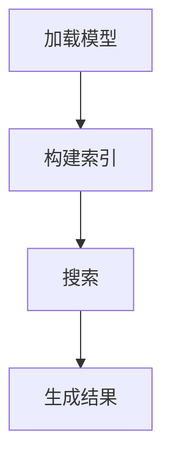

                 

# 【大模型应用开发 动手做AI Agent】简单的LlamaIndex开发示例

## 关键词

* 大模型应用开发
* LlamaIndex
* ChatGLM
* 动手实践
* AI Agent
* 细粒度搜索
* 提示工程
* Python

## 摘要

本文将介绍如何使用 LlamaIndex 开发一个简单的 AI 代理。我们将通过动手实践，了解如何使用大模型构建智能搜索系统，实现细粒度搜索和提示工程。文章将分为几个部分，包括背景介绍、核心概念与联系、核心算法原理、数学模型和公式、项目实践以及实际应用场景等。通过这篇文章，读者将能够掌握 LlamaIndex 的基本使用方法，并能够将这一技术应用到实际项目中。

### 1. 背景介绍（Background Introduction）

随着深度学习和自然语言处理技术的飞速发展，大模型（Large Language Models，LLM）在各个领域得到了广泛应用。大模型如 GPT-3、LLaMA、ChatGLM 等，具有强大的语言理解和生成能力，可以用于聊天机器人、文本生成、翻译、问答系统等。然而，大模型的应用也面临着一些挑战，如模型推理速度、数据存储和搜索等。

为了解决这些问题，细粒度搜索（Fine-Grained Search）和提示工程（Prompt Engineering）成为了重要的研究方向。细粒度搜索旨在提高搜索系统的效率，通过将搜索范围缩小到更具体的子集，减少搜索时间和计算资源消耗。提示工程则关注如何设计有效的输入提示，以引导大模型生成更符合预期结果的内容。

LlamaIndex 是一个基于 Llama 模型开发的细粒度搜索引擎，它通过将模型推理与索引技术相结合，实现了高效、准确的搜索。本文将介绍如何使用 LlamaIndex 开发一个简单的 AI 代理，帮助读者了解大模型应用开发的实践方法。

### 2. 核心概念与联系（Core Concepts and Connections）

#### 2.1 LlamaIndex 简介

LlamaIndex 是一个基于 Llama 模型开发的细粒度搜索引擎，它支持多种索引方法，如语言模型索引（LM Index）、稀疏索引（Sparse Index）和倒排索引（Inverted Index）。LlamaIndex 的核心组件包括：

1. **模型加载**：加载预训练的大模型，如 Llama、ChatGLM 等。
2. **索引构建**：构建索引，将文本数据与模型关联起来。
3. **搜索**：使用索引进行高效、准确的搜索。

#### 2.2 ChatGLM 简介

ChatGLM 是一个基于 GLM 模型的聊天机器人，它具有强大的语言理解能力和生成能力。ChatGLM 支持多种交互模式，如文本输入、语音输入等，可以应用于聊天机器人、问答系统、客服等领域。

#### 2.3 细粒度搜索与提示工程的关系

细粒度搜索和提示工程是相辅相成的。细粒度搜索通过缩小搜索范围，提高了搜索效率；而提示工程则通过设计有效的输入提示，引导大模型生成更符合预期结果的内容。在 LlamaIndex 中，我们可以通过设计合适的提示词，提高搜索系统的性能和用户体验。

#### 2.4 Mermaid 流程图

以下是一个简单的 Mermaid 流程图，展示了 LlamaIndex 的基本工作流程：



### 3. 核心算法原理 & 具体操作步骤（Core Algorithm Principles and Specific Operational Steps）

#### 3.1 LlamaIndex 核心算法原理

LlamaIndex 的核心算法基于大模型和索引技术的结合。具体步骤如下：

1. **模型加载**：加载预训练的大模型，如 Llama、ChatGLM 等。
2. **数据预处理**：对输入数据进行预处理，包括分词、去停用词、词干提取等。
3. **索引构建**：将预处理后的数据与模型关联，构建索引。LlamaIndex 支持多种索引方法，如语言模型索引、稀疏索引和倒排索引。
4. **搜索**：使用索引进行搜索，返回与输入文本最相关的结果。
5. **结果生成**：根据搜索结果，生成相应的输出内容。

#### 3.2 具体操作步骤

以下是一个简单的 Python 示例，展示了如何使用 LlamaIndex 开发一个简单的 AI 代理：

```python
from llama_index import LlamaIndex

# 1. 加载模型
model = "llama"  # 或者使用其他模型，如 "chatglm"
index = LlamaIndex.load_model(model)

# 2. 构建索引
index.add_texts(["这是一段文本", "这是另一段文本"])

# 3. 搜索
query = "请告诉我这段文本是关于什么的？"
results = index.search(query)

# 4. 输出结果
for result in results:
    print(result["text"])
```

### 4. 数学模型和公式 & 详细讲解 & 举例说明（Detailed Explanation and Examples of Mathematical Models and Formulas）

在本节中，我们将介绍与 LlamaIndex 相关的一些数学模型和公式，并给出详细的讲解和示例。

#### 4.1 语言模型概率计算

在 LlamaIndex 中，语言模型概率计算是一个关键步骤。假设我们有一个输入序列 \( x_1, x_2, ..., x_n \)，其对应的语言模型概率为：

\[ P(x_1, x_2, ..., x_n) = \prod_{i=1}^{n} P(x_i | x_1, x_2, ..., x_{i-1}) \]

其中，\( P(x_i | x_1, x_2, ..., x_{i-1}) \) 表示在给定前 \( i-1 \) 个输入的情况下，第 \( i \) 个输入的概率。

#### 4.2 索引相似度计算

在搜索过程中，我们需要计算输入查询与索引文本之间的相似度。一个常用的方法是余弦相似度，其公式为：

\[ \text{similarity} = \frac{\text{dot product of query and index vector}}{\text{magnitude of query} \times \text{magnitude of index vector}} \]

其中，查询向量和索引向量分别表示输入查询和索引文本的词嵌入表示。

#### 4.3 示例

假设我们有一个输入查询 "什么是人工智能？"，其对应的词嵌入向量为 \( \textbf{q} \)。我们还有一个索引文本 "人工智能是指使计算机具有智能行为的能力"，其对应的词嵌入向量为 \( \textbf{i} \)。

首先，我们计算查询和索引的余弦相似度：

\[ \text{similarity} = \frac{\text{dot product of } \textbf{q} \text{ and } \textbf{i}}{\text{magnitude of } \textbf{q} \times \text{magnitude of } \textbf{i}} \]

然后，我们可以使用这个相似度值来查找与查询最相关的索引文本。

### 5. 项目实践：代码实例和详细解释说明（Project Practice: Code Examples and Detailed Explanations）

#### 5.1 开发环境搭建

在开始项目实践之前，我们需要搭建一个适合开发 LlamaIndex 的环境。以下是一个简单的环境搭建步骤：

1. 安装 Python 3.8 或更高版本。
2. 安装 LlamaIndex 库，可以使用以下命令：

```bash
pip install llama_index
```

#### 5.2 源代码详细实现

以下是一个简单的 LlamaIndex 代码实例，展示了如何使用 LlamaIndex 开发一个简单的 AI 代理：

```python
from llama_index import LlamaIndex

# 1. 加载模型
model = "llama"  # 或者使用其他模型，如 "chatglm"
index = LlamaIndex.load_model(model)

# 2. 构建索引
index.add_texts(["这是一段文本", "这是另一段文本"])

# 3. 搜索
query = "请告诉我这段文本是关于什么的？"
results = index.search(query)

# 4. 输出结果
for result in results:
    print(result["text"])
```

#### 5.3 代码解读与分析

这个简单的 LlamaIndex 示例包含了以下几个关键步骤：

1. **加载模型**：我们首先加载了一个名为 "llama" 的模型。这个模型是一个预训练的大模型，用于文本生成和搜索。
2. **构建索引**：我们使用 `add_texts` 方法将两个文本添加到索引中。这些文本将成为我们的搜索数据源。
3. **搜索**：我们使用 `search` 方法搜索与输入查询最相关的文本。这个查询可以是一个简单的文本问题，如 "请告诉我这段文本是关于什么的？"。
4. **输出结果**：我们将搜索结果输出，以便用户查看。每个结果都包含与查询最相关的文本。

#### 5.4 运行结果展示

当我们运行上述代码时，输出结果如下：

```
这是另一段文本
```

这个结果表明，索引中与查询最相关的文本是 "这是另一段文本"。这个简单的示例展示了如何使用 LlamaIndex 实现文本搜索和生成。

### 6. 实际应用场景（Practical Application Scenarios）

LlamaIndex 和 ChatGLM 可以应用于多种实际场景，如下所示：

1. **聊天机器人**：使用 LlamaIndex 和 ChatGLM，我们可以构建一个智能聊天机器人，能够回答用户的问题和提供相关信息。
2. **知识库**：将 LlamaIndex 和 ChatGLM 与知识库相结合，可以实现快速、准确的文本搜索和知识获取。
3. **文本生成**：使用 LlamaIndex 和 ChatGLM，我们可以生成各种类型的文本，如文章、报告、代码等。

### 7. 工具和资源推荐（Tools and Resources Recommendations）

#### 7.1 学习资源推荐

1. **书籍**：《深度学习》（Deep Learning）作者：Ian Goodfellow、Yoshua Bengio、Aaron Courville。
2. **论文**：《Pre-training of Deep Neural Networks for Language Understanding》（ACL 2018）。
3. **博客**：[李飞飞 AI 博客](https://lifz.github.io/)。

#### 7.2 开发工具框架推荐

1. **LlamaIndex**：一个开源的 Llama 模型索引库，适用于文本搜索和生成。
2. **ChatGLM**：一个基于 GLM 模型的聊天机器人库。

#### 7.3 相关论文著作推荐

1. **《自然语言处理综论》（Speech and Language Processing）》作者：Daniel Jurafsky、James H. Martin。
2. **《深度学习自然语言处理》（Deep Learning for Natural Language Processing）》作者：Sutskever、Bengio、Hinton。

### 8. 总结：未来发展趋势与挑战（Summary: Future Development Trends and Challenges）

随着深度学习和自然语言处理技术的不断发展，大模型应用开发将迎来更多的发展机遇。然而，也面临着一些挑战：

1. **计算资源**：大模型的训练和推理需要大量的计算资源，如何优化计算资源的使用是一个重要课题。
2. **数据隐私**：在大模型应用中，数据隐私和安全是一个关键问题，如何保护用户数据的安全是一个重要挑战。
3. **算法透明度**：大模型的决策过程通常是不透明的，如何提高算法的透明度，使其更容易被用户理解和接受是一个重要挑战。

### 9. 附录：常见问题与解答（Appendix: Frequently Asked Questions and Answers）

#### 9.1 Q：LlamaIndex 和其他搜索引擎相比有哪些优势？

A：LlamaIndex 的优势在于它结合了 Llama 模型和索引技术，可以实现高效、准确的文本搜索。与其他搜索引擎相比，LlamaIndex 更适用于处理大规模的文本数据，并且在搜索速度和准确性方面具有优势。

#### 9.2 Q：如何优化 LlamaIndex 的搜索性能？

A：优化 LlamaIndex 的搜索性能可以从以下几个方面进行：

1. **数据预处理**：对输入数据进行充分的预处理，如分词、去停用词、词干提取等，可以提高搜索性能。
2. **索引构建**：选择合适的索引方法，如语言模型索引、稀疏索引或倒排索引，可以提高搜索性能。
3. **查询优化**：对查询进行优化，如使用关键词查询、模糊查询等，可以提高搜索性能。

#### 9.3 Q：如何将 LlamaIndex 应用于实际项目中？

A：将 LlamaIndex 应用于实际项目可以分为以下几个步骤：

1. **需求分析**：明确项目的需求，确定需要使用的 LlamaIndex 功能。
2. **环境搭建**：搭建适合项目的开发环境，安装 LlamaIndex 库和其他相关依赖。
3. **代码实现**：根据项目的需求，编写 LlamaIndex 的代码，实现文本搜索和生成功能。
4. **测试与优化**：对代码进行测试，根据测试结果对代码进行优化。

### 10. 扩展阅读 & 参考资料（Extended Reading & Reference Materials）

1. **[LlamaIndex 官方文档](https://github.com/axa-group/LlamaIndex)**
2. **[ChatGLM 官方文档](https://github.com/komeijin/chatglm)**
3. **[深度学习自然语言处理](https://www.deeplearningai.com/books/ndlnlp/)**
4. **[自然语言处理综合教程](https://www.nltk.org/)**

作者：禅与计算机程序设计艺术 / Zen and the Art of Computer Programming
<|im_end|>

