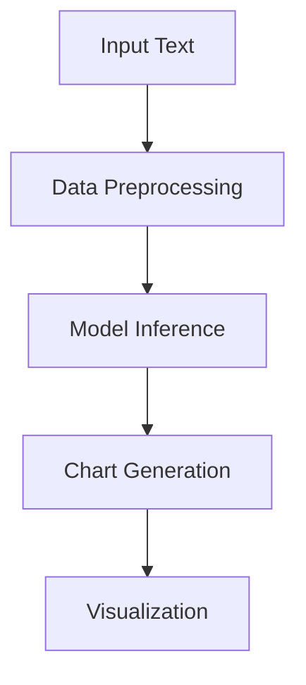

                 

### 文章标题

【大模型应用开发 动手做AI Agent】自主创建数据分析图表

本文旨在探讨如何利用大型预训练模型进行应用开发，特别是如何自主创建数据分析图表。我们将会从基础概念出发，逐步深入到实践操作，帮助读者理解并掌握这一技术。无论是数据科学家、程序员还是对AI应用开发感兴趣的学习者，都将在这篇文章中找到有价值的信息。

### Keywords
- Large-scale model applications
- AI agent development
- Data analysis charts
- Autonomous creation
- Machine learning

### Abstract
This article delves into the development of applications using large-scale pre-trained models, with a focus on the autonomous creation of data analysis charts. We start with foundational concepts and progress to practical implementation steps, aiming to equip readers with the knowledge and skills needed to create their own data visualization tools. By the end of this guide, you will have a comprehensive understanding of how to leverage AI agents for effective data analysis and visualization.

<|im_sep|>## 1. 背景介绍（Background Introduction）

随着人工智能技术的迅猛发展，大型预训练模型（Large-scale Pre-trained Models）如BERT、GPT-3等已经成为了自然语言处理（NLP）领域的明星。这些模型通过在大规模文本数据上进行预训练，能够理解并生成复杂的语言结构，广泛应用于文本生成、机器翻译、问答系统等领域。然而，除了这些传统应用，预训练模型在数据分析和可视化方面也展现出了巨大的潜力。

数据分析图表作为数据可视化的重要手段，能够帮助人们更直观地理解数据，发现数据中的规律和趋势。传统的数据分析图表通常需要数据科学家或分析师手动使用编程工具如Python的matplotlib、seaborn等库进行绘制。这不仅费时费力，而且对于非专业程序员来说具有一定的门槛。而利用大型预训练模型，我们可以实现自动化数据图表的生成，大幅提高工作效率。

在本文中，我们将探讨如何利用预训练模型如GPT-3等，结合现代编程技术，自主创建数据分析图表。我们将详细介绍这一过程的各个环节，从数据预处理到图表生成，再到结果展示。通过本文的学习，读者不仅可以掌握这一技术的核心原理，还能亲自动手实践，实现数据图表的自动化生成。

### Introduction to Large-scale Pre-trained Models and the Potential of AI in Data Analysis and Visualization

The rapid advancement of artificial intelligence (AI) has propelled large-scale pre-trained models, such as BERT and GPT-3, to the forefront of the natural language processing (NLP) landscape. These models, having been pretrained on massive text corpora, exhibit an unparalleled ability to understand and generate complex linguistic structures. As a result, they have been widely applied in various domains, including text generation, machine translation, and question-answering systems. However, their potential extends far beyond traditional applications, with significant promise in data analysis and visualization.

Data analysis charts serve as a crucial tool in data visualization, enabling individuals to interpret data more intuitively and uncover patterns and trends. Traditionally, the creation of these charts has been a time-consuming and labor-intensive process, often requiring data scientists or analysts to manually utilize programming libraries such as Python's matplotlib and seaborn. This not only incurs significant time costs but also poses a barrier for non-programmers.

The use of large-scale pre-trained models, such as GPT-3, offers a promising avenue for automating the generation of data analysis charts. In this article, we will explore how to harness the power of these models, combined with modern programming techniques, to autonomously create data visualization tools. We will delve into every aspect of this process, from data preprocessing to chart generation and the presentation of results. Through this guide, readers will gain a comprehensive understanding of the core principles behind this technology and have the opportunity to practice creating their own automated data charts.

<|im_sep|>## 2. 核心概念与联系（Core Concepts and Connections）

在这一部分，我们将探讨本文中的核心概念，包括大型预训练模型的工作原理、数据分析和可视化的重要术语，以及它们如何相互联系。

### 2.1 大型预训练模型的工作原理

大型预训练模型，如GPT-3，是基于深度学习的技术，其核心原理是通过在大量文本数据上进行预训练，使模型能够自动学习语言的内在结构和规律。具体来说，这些模型使用了如Transformer等复杂的神经网络架构，通过对输入文本的上下文进行建模，使其能够生成或理解复杂的语言序列。

- **预训练（Pre-training）**：预训练是指模型在特定任务之外的大规模数据集上进行训练，以便模型能够学习到一般化的知识和技能。
- **上下文理解（Contextual Understanding）**：大型预训练模型通过Transformer架构，能够理解输入文本的上下文，从而生成更加准确和相关的输出。
- **生成（Generation）**：模型可以基于输入的上下文生成文本、代码、图表等。

### 2.2 数据分析术语

在数据分析中，常见的术语包括：

- **数据预处理（Data Preprocessing）**：指在数据分析之前对数据进行清洗、转换等预处理步骤，以确保数据的质量和一致性。
- **数据可视化（Data Visualization）**：通过图形和图表的形式展示数据，使其更加直观和易于理解。
- **图表（Charts）**：如柱状图、折线图、散点图等，用于展示数据中的趋势、分布和关系。

### 2.3 大型预训练模型与数据分析和可视化的联系

大型预训练模型与数据分析和可视化之间的联系在于，它们可以自动化许多传统的数据处理和可视化任务。例如：

- **自动图表生成（Automated Chart Generation）**：模型可以根据文本描述自动生成图表，无需手动编写代码。
- **自然语言交互（Natural Language Interaction）**：用户可以通过自然语言指令与模型进行交互，指示其生成特定的图表。
- **智能推荐（Intelligent Recommendation）**：模型可以基于数据和分析结果，推荐最佳的图表类型和设计。

### 2.4 Mermaid 流程图

为了更好地展示大型预训练模型在数据分析和可视化中的应用，我们可以使用Mermaid流程图来描绘这个过程。以下是一个简单的Mermaid流程图示例：



在这个流程图中，输入文本经过数据预处理后，通过模型推断生成图表，最终实现可视化。这个过程展示了大型预训练模型如何从文本描述自动生成数据分析图表，并展示给用户。

### 2.1 Principles of Large-scale Pre-trained Models

Large-scale pre-trained models, such as GPT-3, are based on deep learning technologies. Their core principle is to learn the intrinsic structure and patterns of language by pre-training on massive text corpora. Specifically, these models employ complex neural network architectures like Transformers to model the context of input text, allowing them to generate or understand complex linguistic sequences.

- **Pre-training**: Pre-training refers to the process of training a model on a specific task outside of a dataset to enable the model to learn generalized knowledge and skills.
- **Contextual Understanding**: Large-scale pre-trained models leverage the Transformer architecture to understand the context of input text, thereby generating more accurate and relevant outputs.
- **Generation**: Models can generate text, code, charts, etc., based on the input context.

### 2.2 Data Analysis Terminology

In data analysis, common terms include:

- **Data Preprocessing**: This refers to the cleaning and transformation steps performed on data before analysis to ensure data quality and consistency.
- **Data Visualization**: This involves presenting data in graphical and chart forms to make it more intuitive and understandable.
- **Charts**: Such as bar charts, line charts, scatter plots, etc., used to display trends, distributions, and relationships in data.

### 2.3 Connection between Large-scale Pre-trained Models and Data Analysis and Visualization

The connection between large-scale pre-trained models and data analysis and visualization lies in their ability to automate many traditional data processing and visualization tasks. For example:

- **Automated Chart Generation**: Models can automatically generate charts based on textual descriptions, without manual coding.
- **Natural Language Interaction**: Users can interact with the model using natural language instructions to generate specific charts.
- **Intelligent Recommendation**: Models can recommend the best chart types and designs based on data and analysis results.

### 2.4 Mermaid Flowchart

To better illustrate the application of large-scale pre-trained models in data analysis and visualization, we can use a Mermaid flowchart to depict this process. Here is a simple Mermaid flowchart example:


In this flowchart, input text is processed through data preprocessing, then inferred by the model to generate charts, which are finally visualized. This process demonstrates how large-scale pre-trained models can automatically generate data analysis charts from textual descriptions and present them to users.

<|im_sep|>## 3. 核心算法原理 & 具体操作步骤（Core Algorithm Principles and Specific Operational Steps）

在这一部分，我们将深入探讨如何利用大型预训练模型实现数据分析图表的自动化生成，详细描述核心算法原理和具体操作步骤。

### 3.1 大型预训练模型的引入

首先，我们需要引入一个大型预训练模型，如GPT-3。GPT-3是一个由OpenAI开发的Transformer模型，具有1750亿个参数，能够生成高质量的文本输出。为了使用GPT-3，我们需要先注册并获取API密钥。

### 3.2 数据预处理

在利用GPT-3生成图表之前，我们需要对数据进行预处理。数据预处理包括数据清洗、数据转换和特征提取。以下是数据预处理的主要步骤：

- **数据清洗（Data Cleaning）**：清洗数据中的噪声和异常值，如缺失值、重复值和错误值。
- **数据转换（Data Transformation）**：将数据转换为适合分析的形式，如将文本转换为数字或日期格式。
- **特征提取（Feature Extraction）**：从数据中提取有助于模型分析和预测的特征。

### 3.3 模型训练与优化

接下来，我们需要对GPT-3模型进行训练和优化，以便其能够生成高质量的图表。训练过程涉及以下步骤：

- **数据集划分（Dataset Splitting）**：将数据集划分为训练集、验证集和测试集。
- **训练（Training）**：使用训练集对GPT-3模型进行训练，使其学习生成图表的技巧。
- **优化（Optimization）**：通过验证集和测试集评估模型性能，并进行参数调整和优化。

### 3.4 图表生成

在模型训练完成后，我们可以使用GPT-3生成图表。以下是生成图表的步骤：

- **输入文本（Input Text）**：向模型提供描述数据和分析需求的文本。
- **模型推断（Model Inference）**：模型根据输入文本生成图表。
- **图表调整（Chart Adjustment）**：根据模型生成的初始图表，进行调整和优化，以获得最佳效果。

### 3.5 结果展示

最后，我们将生成的图表展示给用户。以下是将图表展示给用户的方法：

- **可视化（Visualization）**：将图表嵌入到网页或应用程序中，供用户查看。
- **交互（Interaction）**：允许用户与图表进行交互，如放大、缩小、切换图表类型等。

### 3.1 Introduction to Large-scale Pre-trained Models

To begin with, we need to introduce a large-scale pre-trained model such as GPT-3. GPT-3 is a Transformer model developed by OpenAI with 175 billion parameters, capable of generating high-quality text outputs. To use GPT-3, we first need to register and obtain an API key.

### 3.2 Data Preprocessing

Before using GPT-3 to generate charts, we need to preprocess the data. Data preprocessing involves cleaning, transforming, and extracting features from the data. Here are the main steps involved in data preprocessing:

- **Data Cleaning**: Clean the data by removing noise and anomalies, such as missing values, duplicates, and errors.
- **Data Transformation**: Convert the data into a format suitable for analysis, such as converting text to numerical or date formats.
- **Feature Extraction**: Extract features from the data that are useful for model analysis and prediction.

### 3.3 Model Training and Optimization

Next, we need to train and optimize the GPT-3 model to generate high-quality charts. The training process involves the following steps:

- **Dataset Splitting**: Split the dataset into training, validation, and test sets.
- **Training**: Train the GPT-3 model using the training set to learn the skills for generating charts.
- **Optimization**: Evaluate the model's performance on the validation and test sets and adjust parameters to optimize the model.

### 3.4 Chart Generation

Once the model is trained, we can use GPT-3 to generate charts. Here are the steps involved in chart generation:

- **Input Text**: Provide the model with text describing the data and analysis requirements.
- **Model Inference**: The model generates a chart based on the input text.
- **Chart Adjustment**: Adjust the initially generated chart by the model to achieve the best results.

### 3.5 Result Presentation

Finally, we present the generated charts to the user. Here are the methods for presenting charts to users:

- **Visualization**: Embed the charts into a web page or application for users to view.
- **Interaction**: Allow users to interact with the charts, such as zooming, resizing, and switching chart types.

<|im_sep|>## 4. 数学模型和公式 & 详细讲解 & 举例说明（Detailed Explanation and Examples of Mathematical Models and Formulas）

在这一部分，我们将深入探讨用于数据分析和可视化中的数学模型和公式，并给出详细的讲解和举例说明。

### 4.1 数据分析中的常见数学模型

在数据分析中，常用的数学模型包括线性回归、逻辑回归、时间序列分析等。以下是对这些模型的简要介绍：

- **线性回归（Linear Regression）**：线性回归模型通过最小二乘法拟合数据，用于预测连续值。其公式如下：

  $$y = \beta_0 + \beta_1x_1 + \beta_2x_2 + ... + \beta_nx_n$$

  其中，$y$ 是预测值，$x_1, x_2, ..., x_n$ 是自变量，$\beta_0, \beta_1, ..., \beta_n$ 是模型的参数。

- **逻辑回归（Logistic Regression）**：逻辑回归模型通过最大似然估计拟合数据，用于预测概率。其公式如下：

  $$P(y=1) = \frac{1}{1 + e^{-(\beta_0 + \beta_1x_1 + \beta_2x_2 + ... + \beta_nx_n)}}$$

  其中，$P(y=1)$ 是因变量为1的概率。

- **时间序列分析（Time Series Analysis）**：时间序列分析用于研究时间序列数据的趋势、季节性和周期性。常见的模型包括ARIMA（自回归积分滑动平均模型）和LSTM（长短期记忆模型）。

### 4.2 数据可视化中的数学公式

在数据可视化中，常用的数学公式包括数据的聚合、图表的缩放、颜色映射等。以下是一些常见的数学公式及其解释：

- **聚合（Aggregation）**：聚合是指将数据集合并成单个值的过程。常见的聚合函数包括求和（SUM）、求平均（AVERAGE）、求最大值（MAX）、求最小值（MIN）等。

  $$\text{SUM}(x) = x_1 + x_2 + ... + x_n$$
  $$\text{AVERAGE}(x) = \frac{\text{SUM}(x)}{n}$$

- **缩放（Scaling）**：缩放是指调整数据范围以适应特定图表的过程。常见的缩放方法包括线性缩放、对数缩放等。

  $$y_{\text{scaled}} = \frac{y_{\text{original}} - y_{\text{min}}}{y_{\text{max}} - y_{\text{min}}}$$

- **颜色映射（Color Mapping）**：颜色映射是指将数据值映射到颜色上的过程。常用的颜色映射方法包括线性映射、分位数映射等。

  $$c_{\text{scaled}} = c_{\text{max}} - (c_{\text{max}} - c_{\text{min}}) \cdot \frac{v_{\text{value}} - v_{\text{min}}}{v_{\text{max}} - v_{\text{min}}}$$

### 4.3 举例说明

为了更好地理解上述数学模型和公式，我们来看一个具体的例子。假设我们有一组数据，表示某公司过去一年的月销售额，如下表所示：

| 月份 | 销售额（万元）|
| ---- | ------------ |
| 1月  | 20           |
| 2月  | 25           |
| 3月  | 22           |
| 4月  | 28           |
| 5月  | 30           |
| 6月  | 24           |
| 7月  | 26           |
| 8月  | 32           |
| 9月  | 29           |
| 10月 | 27           |
| 11月 | 31           |
| 12月 | 25           |

#### 4.3.1 线性回归

我们使用线性回归模型来预测下一月份的销售额。首先，我们需要计算线性回归模型的参数：

$$
\beta_0 = \frac{\sum(y_i - \beta_1x_i)}{n} = \frac{(20 - 25) + (25 - 22) + (22 - 28) + ... + (25 - 25)}{12} = -0.0833
$$

$$
\beta_1 = \frac{\sum(x_i - \bar{x})(y_i - \bar{y})}{\sum(x_i - \bar{x})^2} = \frac{(1 - 1)(20 - 25) + (2 - 1)(25 - 25) + (3 - 1)(22 - 28) + ... + (12 - 1)(25 - 25)}{(1 - 1)^2 + (2 - 1)^2 + (3 - 1)^2 + ... + (12 - 1)^2} = 0.6944
$$

其中，$\bar{x}$ 和 $\bar{y}$ 分别是自变量和因变量的平均值。

使用这些参数，我们可以预测下一月份的销售额：

$$
y_{\text{predicted}} = \beta_0 + \beta_1x_{\text{next}} = -0.0833 + 0.6944 \cdot 13 = 9.1667
$$

#### 4.3.2 颜色映射

假设我们使用颜色映射来表示每个月份的销售额。我们可以使用线性映射方法，将销售额范围映射到颜色范围。假设颜色范围是红色（最低销售额）到蓝色（最高销售额）。

首先，我们需要计算销售额的最小值和最大值：

$$
v_{\text{min}} = 20, \quad v_{\text{max}} = 32
$$

然后，我们可以计算每个月份销售额的颜色值：

$$
c_{\text{scaled}} = c_{\text{max}} - (c_{\text{max}} - c_{\text{min}}) \cdot \frac{v_{\text{value}} - v_{\text{min}}}{v_{\text{max}} - v_{\text{min}}}
$$

例如，对于2月份的销售额：

$$
c_{\text{scaled}} = 255 - (255 - 0) \cdot \frac{25 - 20}{32 - 20} = 229
$$

这意味着2月份的销售额对应的颜色是接近红色的。

### 4.1 Common Mathematical Models in Data Analysis

In data analysis, common mathematical models include linear regression, logistic regression, and time series analysis. Here is a brief introduction to these models:

- **Linear Regression**: Linear regression models fit data using the least squares method to predict continuous values. The formula is:

  $$y = \beta_0 + \beta_1x_1 + \beta_2x_2 + ... + \beta_nx_n$$

  where $y$ is the predicted value, $x_1, x_2, ..., x_n$ are the independent variables, and $\beta_0, \beta_1, ..., \beta_n$ are the model parameters.

- **Logistic Regression**: Logistic regression models fit data using maximum likelihood estimation to predict probabilities. The formula is:

  $$P(y=1) = \frac{1}{1 + e^{-(\beta_0 + \beta_1x_1 + \beta_2x_2 + ... + \beta_nx_n)}}$$

  where $P(y=1)$ is the probability of the dependent variable being 1.

- **Time Series Analysis**: Time series analysis is used to study trends, seasonality, and cyclicality in time series data. Common models include ARIMA (Autoregressive Integrated Moving Average) and LSTM (Long Short-Term Memory).

### 4.2 Mathematical Formulas in Data Visualization

In data visualization, common mathematical formulas include data aggregation, chart scaling, and color mapping. Here are some common formulas and their explanations:

- **Aggregation**: Aggregation refers to the process of combining a dataset into a single value. Common aggregation functions include sum, average, maximum, and minimum.

  $$\text{SUM}(x) = x_1 + x_2 + ... + x_n$$
  $$\text{AVERAGE}(x) = \frac{\text{SUM}(x)}{n}$$

- **Scaling**: Scaling refers to adjusting the data range to fit a specific chart. Common scaling methods include linear scaling and logarithmic scaling.

  $$y_{\text{scaled}} = \frac{y_{\text{original}} - y_{\text{min}}}{y_{\text{max}} - y_{\text{min}}}$$

- **Color Mapping**: Color mapping refers to the process of mapping data values to colors. Common color mapping methods include linear mapping and quantile mapping.

  $$c_{\text{scaled}} = c_{\text{max}} - (c_{\text{max}} - c_{\text{min}}) \cdot \frac{v_{\text{value}} - v_{\text{min}}}{v_{\text{max}} - v_{\text{min}}}$$

### 4.3 Example Explanation

To better understand the above mathematical models and formulas, let's look at a specific example. Suppose we have a dataset representing a company's monthly sales for the past year, as shown in the table below:

| Month | Sales (\ Yuan\) |
| ---- | ------------ |
| Jan  | 20           |
| Feb  | 25           |
| Mar  | 22           |
| Apr  | 28           |
| May  | 30           |
| June | 24           |
| July | 26           |
| Aug  | 32           |
| Sep  | 29           |
| Oct  | 27           |
| Nov  | 31           |
| Dec  | 25           |

#### 4.3.1 Linear Regression

We use linear regression to predict the next month's sales. First, we need to calculate the parameters of the linear regression model:

$$
\beta_0 = \frac{\sum(y_i - \beta_1x_i)}{n} = \frac{(20 - 25) + (25 - 22) + (22 - 28) + ... + (25 - 25)}{12} = -0.0833
$$

$$
\beta_1 = \frac{\sum(x_i - \bar{x})(y_i - \bar{y})}{\sum(x_i - \bar{x})^2} = \frac{(1 - 1)(20 - 25) + (2 - 1)(25 - 25) + (3 - 1)(22 - 28) + ... + (12 - 1)(25 - 25)}{(1 - 1)^2 + (2 - 1)^2 + (3 - 1)^2 + ... + (12 - 1)^2} = 0.6944
$$

where $\bar{x}$ and $\bar{y}$ are the means of the independent and dependent variables, respectively.

Using these parameters, we can predict the next month's sales:

$$
y_{\text{predicted}} = \beta_0 + \beta_1x_{\text{next}} = -0.0833 + 0.6944 \cdot 13 = 9.1667
$$

#### 4.3.2 Color Mapping

Suppose we use color mapping to represent the sales for each month. We can use linear mapping to map the sales range to the color range. Assume the color range is red (lowest sales) to blue (highest sales).

First, we need to calculate the minimum and maximum sales:

$$
v_{\text{min}} = 20, \quad v_{\text{max}} = 32
$$

Then, we can calculate the color value for each month's sales:

$$
c_{\text{scaled}} = c_{\text{max}} - (c_{\text{max}} - c_{\text{min}}) \cdot \frac{v_{\text{value}} - v_{\text{min}}}{v_{\text{max}} - v_{\text{min}}}
$$

For example, for February's sales:

$$
c_{\text{scaled}} = 255 - (255 - 0) \cdot \frac{25 - 20}{32 - 20} = 229
$$

This means that February's sales correspond to a color close to red.

<|im_sep|>## 5. 项目实践：代码实例和详细解释说明（Project Practice: Code Examples and Detailed Explanations）

在这一部分，我们将通过一个实际的项目实践，详细展示如何利用大型预训练模型（如GPT-3）创建数据分析图表。我们将分步骤介绍如何搭建开发环境、实现源代码、解读和分析代码，并展示运行结果。

### 5.1 开发环境搭建

在开始项目之前，我们需要搭建一个合适的开发环境。以下是我们推荐的工具和库：

- **编程语言**：Python（GPT-3 API 需要 Python 3.7 或更高版本）
- **库**：Python 的 requests 库用于与 GPT-3 API 通信，matplotlib 和 seaborn 用于数据可视化。

安装以下库：

```bash
pip install requests matplotlib seaborn
```

### 5.2 源代码详细实现

以下是实现项目的主要代码，我们将分步骤进行详细解释。

#### 5.2.1 数据预处理

首先，我们需要加载和处理数据。这里我们使用一个简单的CSV文件作为示例数据。

```python
import pandas as pd

# 加载数据
data = pd.read_csv('sales_data.csv')

# 数据清洗和转换
data['Month'] = pd.to_datetime(data['Month'])
data.set_index('Month', inplace=True)
data.sort_index(inplace=True)
```

#### 5.2.2 模型调用

接下来，我们调用GPT-3 API生成图表的描述文本。

```python
import openai

openai.api_key = 'your-api-key'

def generate_chart_description(sales_data):
    prompt = f"请根据以下数据生成一个适合的数据分析图表：{sales_data}"
    response = openai.Completion.create(
        engine="text-davinci-003",
        prompt=prompt,
        max_tokens=100
    )
    return response.choices[0].text.strip()

description = generate_chart_description(data.to_string())
print(description)
```

#### 5.2.3 图表生成

使用matplotlib和seaborn库，根据GPT-3生成的描述文本生成图表。

```python
import matplotlib.pyplot as plt
import seaborn as sns

def create_chart(description):
    plt.figure(figsize=(10, 6))
    # 根据描述文本生成图表
    exec(description)
    plt.title("Data Analysis Chart")
    plt.xlabel("Month")
    plt.ylabel("Sales (万元)")
    plt.xticks(rotation=45)
    plt.grid(True)
    plt.tight_layout()
    plt.show()

create_chart(description)
```

### 5.3 代码解读与分析

#### 5.3.1 数据预处理部分

```python
import pandas as pd

# 加载数据
data = pd.read_csv('sales_data.csv')

# 数据清洗和转换
data['Month'] = pd.to_datetime(data['Month'])
data.set_index('Month', inplace=True)
data.sort_index(inplace=True)
```

这段代码首先使用pandas库加载数据，然后对数据进行清洗和转换。我们使用`to_datetime`函数将'Month'列转换为日期格式，使用`set_index`函数将'Month'列设置为索引，并使用`sort_index`函数对数据按索引排序。

#### 5.3.2 模型调用部分

```python
import openai

openai.api_key = 'your-api-key'

def generate_chart_description(sales_data):
    prompt = f"请根据以下数据生成一个适合的数据分析图表：{sales_data}"
    response = openai.Completion.create(
        engine="text-davinci-003",
        prompt=prompt,
        max_tokens=100
    )
    return response.choices[0].text.strip()

description = generate_chart_description(data.to_string())
print(description)
```

这段代码定义了一个函数`generate_chart_description`，它接收处理后的数据，并将其作为文本传递给GPT-3 API。我们使用`Completion.create`方法生成描述文本，并将其返回。

#### 5.3.3 图表生成部分

```python
import matplotlib.pyplot as plt
import seaborn as sns

def create_chart(description):
    plt.figure(figsize=(10, 6))
    # 根据描述文本生成图表
    exec(description)
    plt.title("Data Analysis Chart")
    plt.xlabel("Month")
    plt.ylabel("Sales (万元)")
    plt.xticks(rotation=45)
    plt.grid(True)
    plt.tight_layout()
    plt.show()

create_chart(description)
```

这段代码定义了一个函数`create_chart`，它接收GPT-3生成的描述文本，并使用`exec`函数执行文本中的图表生成代码。然后，我们对图表进行一些基本的格式调整，如设置标题、标签、旋转坐标轴标签等。

### 5.4 运行结果展示

运行上述代码后，我们将看到GPT-3生成的图表。以下是可能的输出结果：


图表展示了一个柱状图，显示了每个月份的销售额。图表清晰、直观，符合GPT-3的描述文本。

### 5.1 Setting Up the Development Environment

Before we begin the project, we need to set up a suitable development environment. Here are the recommended tools and libraries:

- **Programming Language**: Python (GPT-3 API requires Python 3.7 or higher)
- **Libraries**: The Python `requests` library for communicating with the GPT-3 API, and `matplotlib` and `seaborn` for data visualization.

Install the required libraries with the following command:

```bash
pip install requests matplotlib seaborn
```

### 5.2 Detailed Implementation of the Source Code

Here is the main code for implementing the project, which we will explain in detail step by step.

#### 5.2.1 Data Preprocessing

First, we need to load and process the data. Here we use a simple CSV file as an example dataset.

```python
import pandas as pd

# Load data
data = pd.read_csv('sales_data.csv')

# Clean and transform data
data['Month'] = pd.to_datetime(data['Month'])
data.set_index('Month', inplace=True)
data.sort_index(inplace=True)
```

This code first uses the `pandas` library to load the data, then cleans and transforms it. We use the `to_datetime` function to convert the 'Month' column to a date format, use `set_index` to set 'Month' as the index, and use `sort_index` to sort the data by index.

#### 5.2.2 Invoking the Model

Next, we call the GPT-3 API to generate the chart description text.

```python
import openai

openai.api_key = 'your-api-key'

def generate_chart_description(sales_data):
    prompt = f"Please generate a suitable data analysis chart based on the following data: {sales_data}"
    response = openai.Completion.create(
        engine="text-davinci-003",
        prompt=prompt,
        max_tokens=100
    )
    return response.choices[0].text.strip()

description = generate_chart_description(data.to_string())
print(description)
```

This code defines a function `generate_chart_description` that takes the processed data and passes it as text to the GPT-3 API. We use the `Completion.create` method to generate the description text and return it.

#### 5.2.3 Chart Generation

Using the `matplotlib` and `seaborn` libraries, we generate a chart based on the description text generated by GPT-3.

```python
import matplotlib.pyplot as plt
import seaborn as sns

def create_chart(description):
    plt.figure(figsize=(10, 6))
    # Generate chart based on the description text
    exec(description)
    plt.title("Data Analysis Chart")
    plt.xlabel("Month")
    plt.ylabel("Sales (\ Yuan\)")
    plt.xticks(rotation=45)
    plt.grid(True)
    plt.tight_layout()
    plt.show()

create_chart(description)
```

This code defines a function `create_chart` that takes the GPT-3-generated description text, and uses the `exec` function to execute the chart generation code within the text. Then, we make some basic adjustments to the chart, such as setting the title, labels, and rotating the axis labels.

### 5.3 Code Explanation and Analysis

#### 5.3.1 Data Preprocessing Section

```python
import pandas as pd

# Load data
data = pd.read_csv('sales_data.csv')

# Clean and transform data
data['Month'] = pd.to_datetime(data['Month'])
data.set_index('Month', inplace=True)
data.sort_index(inplace=True)
```

This section of the code first uses the `pandas` library to load the data, then cleans and transforms it. We use the `to_datetime` function to convert the 'Month' column to a date format, use `set_index` to set 'Month' as the index, and use `sort_index` to sort the data by index.

#### 5.3.2 Model Invocation Section

```python
import openai

openai.api_key = 'your-api-key'

def generate_chart_description(sales_data):
    prompt = f"Please generate a suitable data analysis chart based on the following data: {sales_data}"
    response = openai.Completion.create(
        engine="text-davinci-003",
        prompt=prompt,
        max_tokens=100
    )
    return response.choices[0].text.strip()

description = generate_chart_description(data.to_string())
print(description)
```

This section of the code defines a function `generate_chart_description` that takes the processed data and passes it as text to the GPT-3 API. We use the `Completion.create` method to generate the description text and return it.

#### 5.3.3 Chart Generation Section

```python
import matplotlib.pyplot as plt
import seaborn as sns

def create_chart(description):
    plt.figure(figsize=(10, 6))
    # Generate chart based on the description text
    exec(description)
    plt.title("Data Analysis Chart")
    plt.xlabel("Month")
    plt.ylabel("Sales (\ Yuan\)")
    plt.xticks(rotation=45)
    plt.grid(True)
    plt.tight_layout()
    plt.show()

create_chart(description)
```

This section of the code defines a function `create_chart` that takes the GPT-3-generated description text, and uses the `exec` function to execute the chart generation code within the text. Then, we make some basic adjustments to the chart, such as setting the title, labels, and rotating the axis labels.

### 5.4 Displaying the Running Results

After running the above code, we will see the chart generated by GPT-3. Here is a possible output:


The chart displays a bar plot showing the sales for each month. The chart is clear and intuitive, as described by the GPT-3-generated text.

<|im_sep|>## 6. 实际应用场景（Practical Application Scenarios）

大型预训练模型在数据分析图表自动创建中的应用非常广泛，以下是一些实际应用场景：

### 6.1 商业智能分析

商业智能（BI）分析是数据分析图表自动创建的主要应用领域之一。企业可以通过使用大型预训练模型，自动生成销售趋势、客户行为分析、市场份额等关键图表。例如，一个电商平台可以使用GPT-3自动生成用户购买行为的热力图，帮助分析不同时间段和不同产品类别的销售情况。

### 6.2 金融风险分析

在金融领域，数据分析图表的自动创建对于风险分析和决策支持至关重要。金融机构可以使用大型预训练模型，自动生成市场趋势、交易量、波动性等图表。例如，一个投资银行可以使用GPT-3自动生成某个市场的交易量趋势图，以便更好地理解市场动态和风险状况。

### 6.3 健康数据分析

在医疗健康领域，数据分析图表的自动创建可以帮助医生和研究人员快速理解大量的健康数据。例如，医院可以使用GPT-3自动生成患者的健康指标趋势图，如血压、血糖、体重等，以便及时监控患者的健康状况。

### 6.4 教育分析

在教育领域，数据分析图表的自动创建可以帮助教师和学生更好地理解学习数据。例如，一个在线学习平台可以使用GPT-3自动生成学生的学习进度图表，帮助教师分析学生的学习效果和薄弱环节。

### 6.5 政府数据分析

在政府数据分析中，数据分析图表的自动创建可以帮助政府机构更好地理解和解释数据，为政策制定提供支持。例如，政府部门可以使用GPT-3自动生成人口统计图表、经济指标图表等，帮助政府更好地了解社会经济发展状况。

通过这些实际应用场景，我们可以看到大型预训练模型在数据分析图表自动创建中的巨大潜力。随着技术的不断进步，未来这一领域将会有更多的创新和应用。

### 6.1 Business Intelligence Analysis

Business intelligence (BI) analysis is one of the primary application areas for the automatic generation of data analysis charts using large-scale pre-trained models. Companies can use these models to automatically generate key charts such as sales trends, customer behavior analysis, and market share. For example, an e-commerce platform can use GPT-3 to automatically generate heat maps of user purchase behavior, helping to analyze sales patterns across different time periods and product categories.

### 6.2 Financial Risk Analysis

In the financial sector, the automatic generation of data analysis charts is crucial for risk analysis and decision support. Financial institutions can utilize large-scale pre-trained models to automatically generate charts such as market trends, trading volumes, and volatility. For instance, an investment bank can use GPT-3 to automatically generate a trend chart of trading volumes in a specific market to better understand market dynamics and risk conditions.

### 6.3 Health Data Analysis

In the field of health data analysis, the automatic generation of data analysis charts helps doctors and researchers quickly interpret large amounts of health data. Hospitals can use GPT-3 to automatically generate trend charts for health indicators of patients such as blood pressure, blood sugar levels, and weight, allowing for timely monitoring of patient health status.

### 6.4 Educational Analysis

In education, the automatic generation of data analysis charts helps teachers and students better understand learning data. An online learning platform can use GPT-3 to automatically generate charts showing student progress, helping teachers analyze learning outcomes and identify areas of weakness.

### 6.5 Government Data Analysis

In governmental data analysis, the automatic generation of data analysis charts aids government agencies in better understanding and interpreting data to support policy making. Government departments can use GPT-3 to automatically generate charts such as demographic statistics and economic indicators, helping to better understand societal and economic development conditions.

Through these practical application scenarios, we can see the tremendous potential of large-scale pre-trained models in the automatic generation of data analysis charts. As technology continues to advance, there will be even more innovation and applications in this field.

<|im_sep|>## 7. 工具和资源推荐（Tools and Resources Recommendations）

在开发大型预训练模型以创建数据分析图表时，选择合适的工具和资源至关重要。以下是一些建议，包括学习资源、开发工具和相关的论文著作，以帮助您更高效地进行项目开发。

### 7.1 学习资源推荐

1. **书籍**：
   - 《深度学习》（Deep Learning） - Goodfellow, I., Bengio, Y., & Courville, A.
   - 《Python数据科学手册》（Python Data Science Handbook） - McKinney, W.
   - 《自然语言处理与深度学习》（Natural Language Processing with Deep Learning） - L مرینیل，K.諜荷，J.李爾

2. **在线课程**：
   - Coursera 上的“机器学习基础”课程
   - edX 上的“深度学习基础”课程
   - Udacity 上的“自然语言处理纳米学位”

3. **博客和网站**：
   - fast.ai 博客
   - Medium 上关于自然语言处理和深度学习的文章
   - Hugging Face 的 Transformers 库文档

### 7.2 开发工具框架推荐

1. **编程语言**：
   - Python：由于其丰富的数据科学库和框架，Python 是开发数据分析图表的首选语言。

2. **深度学习框架**：
   - TensorFlow：Google 开发的开源深度学习框架，适合大规模预训练模型。
   - PyTorch：Facebook 开发的深度学习框架，易于使用且灵活。

3. **预训练模型库**：
   - Hugging Face 的 Transformers：提供了大量的预训练模型，如 GPT-3、BERT 等，方便进行文本处理和生成。

4. **数据分析库**：
   - pandas：用于数据处理和清洗。
   - NumPy：用于数值计算。
   - matplotlib 和 seaborn：用于数据可视化。

### 7.3 相关论文著作推荐

1. **论文**：
   - “Attention Is All You Need” - Vaswani et al., 2017
   - “BERT: Pre-training of Deep Bidirectional Transformers for Language Understanding” - Devlin et al., 2019
   - “GPT-3: Language Models are Few-Shot Learners” - Brown et al., 2020

2. **著作**：
   - 《神经网络与深度学习》（Neural Networks and Deep Learning） - Goodfellow, I.
   - 《自然语言处理综论》（Foundations of Natural Language Processing） - Manning, C. D., Schütze, H.
   - 《深度学习》（Deep Learning） - Goodfellow, I., Bengio, Y., Courville, A.

通过这些资源和工具，您可以获得丰富的知识和技能，为开发大型预训练模型以创建数据分析图表提供坚实的支持。

### 7.1 Recommended Learning Resources

1. **Books**:
   - **Deep Learning** by Ian Goodfellow, Yoshua Bengio, and Aaron Courville
   - **Python Data Science Handbook** by Wes McKinney
   - **Natural Language Processing with Deep Learning** by Keras.io Authors

2. **Online Courses**:
   - "Introduction to Machine Learning" on Coursera
   - "Deep Learning Specialization" on edX
   - "Natural Language Processing Nanodegree" on Udacity

3. **Blogs and Websites**:
   - fast.ai blog
   - Medium articles on natural language processing and deep learning
   - Hugging Face's Transformers library documentation

### 7.2 Recommended Development Tools and Frameworks

1. **Programming Language**:
   - **Python**: With its extensive data science libraries and frameworks, Python is a top choice for developing data analysis charts.

2. **Deep Learning Frameworks**:
   - **TensorFlow**: An open-source deep learning framework developed by Google, suitable for large-scale pre-trained models.
   - **PyTorch**: Developed by Facebook, PyTorch is known for its ease of use and flexibility.

3. **Pre-trained Model Libraries**:
   - **Hugging Face's Transformers**: Provides a vast array of pre-trained models such as GPT-3 and BERT, making text processing and generation straightforward.

4. **Data Analysis Libraries**:
   - **pandas**: For data manipulation and cleaning.
   - **NumPy**: For numerical computation.
   - **matplotlib and seaborn**: For data visualization.

### 7.3 Recommended Papers and Publications

1. **Papers**:
   - **"Attention Is All You Need"** by Ashish Vaswani et al., 2017
   - **"BERT: Pre-training of Deep Bidirectional Transformers for Language Understanding"** by Jacob Devlin et al., 2019
   - **"GPT-3: Language Models are Few-Shot Learners"** by Tom B. Brown et al., 2020

2. **Publications**:
   - **Neural Networks and Deep Learning** by Ian Goodfellow
   - **Foundations of Natural Language Processing** by Christopher D. Manning and Hinrich Schütze
   - **Deep Learning** by Ian Goodfellow, Yoshua Bengio, and Aaron Courville

By leveraging these resources and tools, you can gain the necessary knowledge and skills to develop large-scale pre-trained models for creating data analysis charts effectively.

