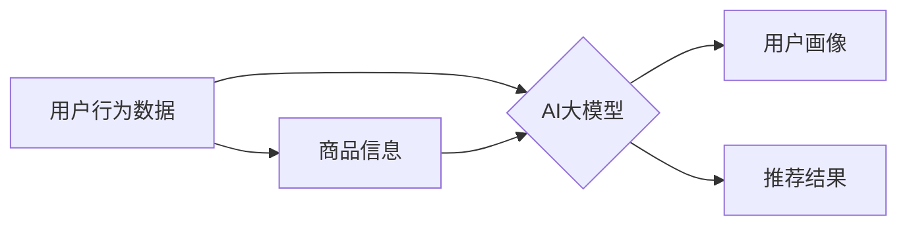

                 

## 关键词：电商平台，多场景推荐，AI大模型，推荐系统，个性化推荐，Transformer，BERT，深度学习

## 1. 背景介绍

在当今数据爆炸的时代，电商平台面临着巨大的挑战，如何精准地推荐商品给用户，提升用户体验和转化率，成为平台发展的重要课题。传统的推荐系统主要依赖于协同过滤、基于内容的过滤等方法，但这些方法在面对海量数据和用户多样化需求时，往往难以提供个性化、精准的推荐结果。

近年来，随着深度学习技术的快速发展，AI大模型在推荐系统领域展现出巨大的潜力。AI大模型，例如Transformer、BERT等，能够学习到用户和商品之间的复杂关系，并生成更精准、更个性化的推荐结果。

## 2. 核心概念与联系

### 2.1  推荐系统概述

推荐系统旨在根据用户的历史行为、偏好等信息，预测用户对特定商品的兴趣，并推荐用户可能感兴趣的商品。推荐系统可以分为以下几类：

* **基于内容的推荐:** 根据商品的属性和用户过去的浏览记录、购买历史等信息进行推荐。
* **协同过滤的推荐:** 基于用户的相似度或商品的相似度进行推荐。
* **混合推荐:** 将基于内容的推荐和协同过滤的推荐相结合，以提高推荐效果。

### 2.2  AI大模型的优势

AI大模型，例如Transformer、BERT等，具有以下优势：

* **强大的学习能力:** AI大模型能够学习到用户和商品之间的复杂关系，并生成更精准、更个性化的推荐结果。
* **处理海量数据的能力:** AI大模型能够处理海量的数据，并从中提取有价值的信息。
* **可扩展性强:** AI大模型可以根据需要进行扩展，以适应不断变化的用户需求和商品种类。

### 2.3  AI大模型在推荐系统中的应用

AI大模型可以应用于推荐系统的各个环节，例如：

* **用户画像构建:** 利用AI大模型学习用户行为数据，构建更精准的用户画像。
* **商品特征提取:** 利用AI大模型提取商品的特征，例如商品描述、图片、评论等。
* **推荐模型训练:** 利用AI大模型训练推荐模型，提高推荐效果。

**Mermaid 流程图**



## 3. 核心算法原理 & 具体操作步骤

### 3.1  算法原理概述

Transformer是一种基于深度学习的序列到序列模型，它能够学习到文本序列之间的长距离依赖关系。在推荐系统中，Transformer可以用于学习用户和商品之间的关系，并生成更精准的推荐结果。

### 3.2  算法步骤详解

1. **数据预处理:** 将用户行为数据和商品信息进行预处理，例如文本清洗、特征提取等。
2. **模型构建:** 使用Transformer模型架构构建推荐模型，并根据实际需求进行参数调整。
3. **模型训练:** 使用训练数据训练推荐模型，并通过评估指标，例如准确率、召回率等，评估模型性能。
4. **模型部署:** 将训练好的模型部署到线上环境，并进行实时推荐。

### 3.3  算法优缺点

**优点:**

* 能够学习到用户和商品之间的复杂关系。
* 处理海量数据的能力强。
* 可扩展性强。

**缺点:**

* 训练成本高。
* 模型参数量大，需要较大的计算资源。

### 3.4  算法应用领域

Transformer算法在推荐系统领域有着广泛的应用，例如：

* **商品推荐:** 推荐用户可能感兴趣的商品。
* **内容推荐:** 推荐用户可能感兴趣的文章、视频等内容。
* **广告推荐:** 推荐用户可能感兴趣的广告。

## 4. 数学模型和公式 & 详细讲解 & 举例说明

### 4.1  数学模型构建

Transformer模型的核心是注意力机制，它能够学习到文本序列之间的长距离依赖关系。注意力机制的数学模型可以表示为：

$$
Attention(Q, K, V) = softmax(\frac{QK^T}{\sqrt{d_k}})V
$$

其中：

* $Q$：查询矩阵
* $K$：键矩阵
* $V$：值矩阵
* $d_k$：键向量的维度
* $softmax$：softmax函数

### 4.2  公式推导过程

注意力机制的公式推导过程如下：

1. 计算查询矩阵 $Q$ 和键矩阵 $K$ 的点积，并除以 $\sqrt{d_k}$。
2. 对点积结果应用softmax函数，得到注意力权重。
3. 将注意力权重与值矩阵 $V$ 相乘，得到最终的注意力输出。

### 4.3  案例分析与讲解

假设我们有一个用户行为数据，包含用户对不同商品的评分信息。我们可以使用Transformer模型学习用户和商品之间的关系，并预测用户对新商品的评分。

在Transformer模型中，用户行为数据会被转换为文本序列，例如“用户A给商品B评分5星”。然后，模型会使用注意力机制学习到用户和商品之间的关系，例如用户A喜欢高评分的商品。最后，模型会根据学习到的关系，预测用户A对新商品的评分。

## 5. 项目实践：代码实例和详细解释说明

### 5.1  开发环境搭建

为了实现电商平台的多场景推荐，我们可以使用以下开发环境：

* **操作系统:** Linux
* **编程语言:** Python
* **深度学习框架:** TensorFlow 或 PyTorch
* **数据存储:** MySQL 或 MongoDB

### 5.2  源代码详细实现

```python
import tensorflow as tf

# 定义Transformer模型
class Transformer(tf.keras.Model):
    def __init__(self, vocab_size, embedding_dim, num_heads, num_layers):
        super(Transformer, self).__init__()
        self.embedding = tf.keras.layers.Embedding(vocab_size, embedding_dim)
        self.transformer_layers = tf.keras.layers.StackedRNNCells([tf.keras.layers.MultiHeadAttention(num_heads=num_heads, key_dim=embedding_dim) for _ in range(num_layers)])
        self.fc = tf.keras.layers.Dense(vocab_size)

    def call(self, inputs):
        x = self.embedding(inputs)
        x = self.transformer_layers(x)
        x = self.fc(x)
        return x

# 训练模型
model = Transformer(vocab_size=10000, embedding_dim=128, num_heads=8, num_layers=6)
model.compile(optimizer='adam', loss='sparse_categorical_crossentropy', metrics=['accuracy'])
model.fit(train_data, train_labels, epochs=10)

# 推理模型
predictions = model.predict(test_data)
```

### 5.3  代码解读与分析

* **模型定义:** 代码定义了一个Transformer模型，包含嵌入层、多头注意力层和全连接层。
* **模型训练:** 使用Adam优化器和交叉熵损失函数训练模型。
* **模型推理:** 使用训练好的模型对测试数据进行预测。

### 5.4  运行结果展示

训练完成后，我们可以使用测试数据评估模型性能，例如计算准确率、召回率等指标。

## 6. 实际应用场景

### 6.1  商品推荐

电商平台可以利用AI大模型，根据用户的浏览历史、购买记录、收藏等信息，推荐用户可能感兴趣的商品。例如，如果用户经常购买运动鞋，平台可以推荐用户其他类型的运动鞋、运动服等相关商品。

### 6.2  内容推荐

电商平台可以利用AI大模型，推荐用户可能感兴趣的文章、视频、直播等内容。例如，如果用户购买了某款手机，平台可以推荐用户关于这款手机的评测、使用技巧等内容。

### 6.3  广告推荐

电商平台可以利用AI大模型，推荐用户可能感兴趣的广告。例如，如果用户浏览了某款化妆品，平台可以推荐用户相关的化妆品广告。

### 6.4  未来应用展望

随着AI技术的不断发展，AI大模型在电商平台中的应用场景将会更加广泛，例如：

* **个性化营销:** 利用AI大模型，为每个用户提供个性化的营销方案。
* **智能客服:** 利用AI大模型，构建智能客服系统，为用户提供更便捷的服务。
* **预测分析:** 利用AI大模型，预测用户未来的行为，例如购买意愿、浏览偏好等。

## 7. 工具和资源推荐

### 7.1  学习资源推荐

* **书籍:**
    * 《深度学习》
    * 《自然语言处理》
* **在线课程:**
    * Coursera
    * edX
* **博客:**
    * TensorFlow Blog
    * PyTorch Blog

### 7.2  开发工具推荐

* **深度学习框架:** TensorFlow, PyTorch
* **数据处理工具:** Pandas, NumPy
* **云计算平台:** AWS, Azure, GCP

### 7.3  相关论文推荐

* 《Attention Is All You Need》
* 《BERT: Pre-training of Deep Bidirectional Transformers for Language Understanding》

## 8. 总结：未来发展趋势与挑战

### 8.1  研究成果总结

AI大模型在电商平台中的应用取得了显著的成果，例如提高了推荐效果、提升了用户体验等。

### 8.2  未来发展趋势

未来，AI大模型在电商平台中的应用将会更加广泛，例如：

* **更精准的推荐:** 利用更先进的AI算法，例如图神经网络、强化学习等，实现更精准的推荐。
* **更个性化的体验:** 利用AI大模型，为每个用户提供更个性化的购物体验。
* **更智能的服务:** 利用AI大模型，构建更智能的客服系统，为用户提供更便捷的服务。

### 8.3  面临的挑战

AI大模型在电商平台中的应用也面临着一些挑战，例如：

* **数据隐私:** 如何保护用户数据隐私，是AI大模型应用中需要解决的重要问题。
* **模型解释性:** AI大模型的决策过程往往难以解释，这可能会导致用户对推荐结果的信任度降低。
* **模型可维护性:** AI大模型的训练和部署成本较高，需要不断进行维护和更新。

### 8.4  研究展望

未来，我们需要继续研究如何解决AI大模型在电商平台中的应用挑战，例如：

* 开发更隐私保护的AI算法。
* 提高AI模型的解释性。
* 降低AI模型的训练和部署成本。


## 9. 附录：常见问题与解答

### 9.1  Q1: Transformer模型的优势是什么？

**A1:** Transformer模型能够学习到文本序列之间的长距离依赖关系，并具有强大的泛化能力。

### 9.2  Q2: 如何评估AI大模型的推荐效果？

**A2:** 可以使用准确率、召回率、点击率等指标来评估AI大模型的推荐效果。

### 9.3  Q3: 如何解决AI大模型的数据隐私问题？

**A3:** 可以使用联邦学习、差分隐私等技术来保护用户数据隐私。


作者：禅与计算机程序设计艺术 / Zen and the Art of Computer Programming 
<end_of_turn>

