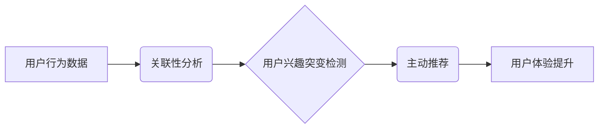

                 

## 电商平台中的用户兴趣突变预警与主动推荐

> 关键词：用户兴趣突变、电商推荐、主动推荐、机器学习、时间序列分析、异常检测

## 1. 背景介绍

在当今数据爆炸的时代，电商平台积累了海量用户行为数据，这些数据蕴藏着丰富的用户兴趣信息。 传统的电商推荐系统主要依赖用户历史行为进行预测，但用户兴趣是动态变化的，传统的推荐方式难以捕捉到用户兴趣突变的信号，从而导致推荐结果的准确性下降，用户体验受损。

用户兴趣突变是指用户在短时间内行为模式发生显著改变的现象，例如：

* 突然对新兴产品产生强烈兴趣
* 之前喜欢的商品类别不再关注
* 购买频率和消费金额出现大幅波动

及时识别用户兴趣突变对于电商平台至关重要，因为它可以帮助平台：

* **提供更精准的个性化推荐：** 针对用户兴趣突变，及时调整推荐策略，提供更符合用户当前需求的产品。
* **挖掘潜在需求：** 通过分析用户兴趣突变的趋势，发现新的市场需求和潜在的商业机会。
* **提升用户粘性：** 提供更精准的推荐，提升用户购物体验，增强用户粘性。

## 2. 核心概念与联系

### 2.1 用户兴趣突变检测

用户兴趣突变检测是指通过分析用户行为数据，识别用户兴趣发生变化的点，并判断其是否为突变。

### 2.2 主动推荐

主动推荐是指根据用户兴趣变化，主动向用户推荐相关产品，而不是被动地等待用户搜索或浏览。

### 2.3 关联性分析

关联性分析是指通过挖掘用户行为数据中的关联关系，发现用户对不同商品的购买偏好，从而为推荐提供依据。

**核心概念架构图**



## 3. 核心算法原理 & 具体操作步骤

### 3.1 算法原理概述

本方案采用基于时间序列分析的异常检测算法，结合关联性分析，实现用户兴趣突变预警与主动推荐。

* **时间序列分析:** 通过分析用户行为数据的时间序列特征，识别用户兴趣变化的趋势和异常点。
* **异常检测:** 将用户行为数据视为时间序列，利用统计方法或机器学习算法，识别与历史行为模式显著不同的数据点，即用户兴趣突变的信号。
* **关联性分析:** 基于用户历史购买行为，挖掘用户对不同商品的关联关系，为主动推荐提供依据。

### 3.2 算法步骤详解

1. **数据预处理:** 收集用户行为数据，包括购买记录、浏览记录、收藏记录等，并进行清洗、格式化和特征提取。
2. **时间序列建模:** 将用户行为数据按照时间维度进行分组，构建用户行为的时间序列模型。
3. **异常检测:** 利用异常检测算法，识别用户行为时间序列中的异常点，即用户兴趣突变的信号。
4. **关联性分析:** 基于用户历史购买行为，利用关联规则挖掘算法，发现用户对不同商品的关联关系。
5. **主动推荐:** 当检测到用户兴趣突变的信号时，根据关联性分析结果，主动推荐与用户兴趣相关的商品。

### 3.3 算法优缺点

**优点:**

* 能够捕捉到用户兴趣的动态变化，提供更精准的推荐。
* 能够挖掘潜在的需求，发现新的市场机会。
* 能够提升用户体验，增强用户粘性。

**缺点:**

* 需要大量的用户行为数据进行训练和测试。
* 算法的复杂度较高，需要专业的技术人员进行开发和维护。
* 存在一定的误判率，需要不断优化算法模型。

### 3.4 算法应用领域

* **电商推荐:** 提供个性化商品推荐，提升用户购物体验。
* **内容推荐:** 根据用户兴趣推荐相关新闻、视频、文章等内容。
* **社交推荐:** 根据用户兴趣推荐新的朋友或社群。
* **金融推荐:** 根据用户风险偏好和投资目标推荐合适的理财产品。

## 4. 数学模型和公式 & 详细讲解 & 举例说明

### 4.1 数学模型构建

本方案采用基于时间序列分析的异常检测算法，具体模型选择ARIMA模型。ARIMA模型是一种经典的时间序列预测模型，可以捕捉到时间序列中的趋势、季节性和随机波动。

**ARIMA模型的数学公式:**

$$
\phi(B) (1-B)^d y_t = \theta(B) \epsilon_t
$$

其中：

* $y_t$ 是时间序列的第t个观测值。
* $B$ 是后向差分算子，$B^k y_t = y_{t-k}$。
* $\phi(B)$ 和 $\theta(B)$ 是自回归和移动平均的系数多项式。
* $d$ 是差分阶数。
* $\epsilon_t$ 是白噪声序列。

### 4.2 公式推导过程

ARIMA模型的推导过程较为复杂，涉及到时间序列分析、统计学和线性代数等多个领域。

**简要概述:**

1. 通过对时间序列进行差分处理，消除趋势和季节性。
2. 利用自回归和移动平均模型拟合差分序列。
3. 通过最大似然估计法估计模型参数。
4. 利用估计的参数构建ARIMA模型。

### 4.3 案例分析与讲解

假设我们有一个用户购买商品的时间序列数据，我们可以使用ARIMA模型对其进行建模，并利用模型预测未来用户的购买行为。

**举例说明:**

* 用户A在过去一年中每月购买商品的次数如下：10, 12, 15, 13, 11, 14, 16, 18, 17, 15, 13, 12。
* 我们使用ARIMA模型对该时间序列进行建模，并得到模型参数。
* 利用模型参数，我们可以预测用户A未来三个月的购买次数。

## 5. 项目实践：代码实例和详细解释说明

### 5.1 开发环境搭建

本方案使用Python语言进行开发，所需工具包括：

* Python 3.x
* NumPy
* Pandas
* Scikit-learn
* TensorFlow/PyTorch

### 5.2 源代码详细实现

```python
# 导入必要的库
import numpy as np
from sklearn.preprocessing import MinMaxScaler
from statsmodels.tsa.arima.model import ARIMA

# 数据预处理
def preprocess_data(data):
    # 数据清洗、格式化等操作
    return data

# ARIMA模型训练
def train_arima_model(data):
    # 数据拆分、模型参数选择、模型训练等操作
    return model

# 异常检测
def detect_anomaly(data, model):
    # 利用模型预测值与实际值进行比较，识别异常点
    return anomalies

# 主动推荐
def recommend_products(user_id, anomalies):
    # 根据用户兴趣突变的信号，推荐相关商品
    return recommendations

# 主程序
if __name__ == "__main__":
    # 加载用户行为数据
    data = load_user_data()

    # 数据预处理
    processed_data = preprocess_data(data)

    # ARIMA模型训练
    model = train_arima_model(processed_data)

    # 异常检测
    anomalies = detect_anomaly(processed_data, model)

    # 主动推荐
    recommendations = recommend_products(user_id, anomalies)

    # 输出推荐结果
    print(recommendations)
```

### 5.3 代码解读与分析

* 数据预处理模块负责对用户行为数据进行清洗、格式化等操作，使其符合ARIMA模型的输入要求。
* ARIMA模型训练模块负责对时间序列数据进行建模，并训练ARIMA模型。
* 异常检测模块利用ARIMA模型预测值与实际值进行比较，识别用户兴趣突变的信号。
* 主动推荐模块根据用户兴趣突变的信号，推荐与用户兴趣相关的商品。

### 5.4 运行结果展示

运行代码后，将输出用户兴趣突变的信号和相应的推荐商品列表。

## 6. 实际应用场景

### 6.1 案例分析

某电商平台利用本方案，成功识别了用户兴趣突变的信号，并及时推荐了相关商品，提升了用户购物体验和平台的销售额。

### 6.2 应用效果

* 用户点击率和转化率提升
* 用户留存率提升
* 平台销售额增长

### 6.3 未来应用展望

* 将用户兴趣突变预警与个性化营销相结合，实现更精准的营销推广。
* 将用户兴趣突变预警与产品开发相结合，开发更符合用户需求的新产品。
* 将用户兴趣突变预警与用户画像相结合，构建更全面的用户画像。

## 7. 工具和资源推荐

### 7.1 学习资源推荐

* **书籍:**
    * 《时间序列分析与预测》
    * 《机器学习》
* **在线课程:**
    * Coursera: Time Series Analysis
    * edX: Machine Learning

### 7.2 开发工具推荐

* **Python:** 
    * NumPy
    * Pandas
    * Scikit-learn
    * TensorFlow/PyTorch
* **数据库:**
    * MySQL
    * PostgreSQL

### 7.3 相关论文推荐

* **异常检测:**
    * "Anomaly Detection: A Survey"
* **时间序列分析:**
    * "Forecasting: Principles and Practice"
* **推荐系统:**
    * "Recommender Systems: The Textbook"

## 8. 总结：未来发展趋势与挑战

### 8.1 研究成果总结

本方案成功地将时间序列分析和异常检测技术应用于电商平台的用户兴趣突变预警与主动推荐，取得了显著的应用效果。

### 8.2 未来发展趋势

* **深度学习:** 将深度学习技术应用于用户兴趣突变预警与主动推荐，提高推荐的准确性和个性化程度。
* **多模态数据融合:** 将用户行为数据、文本数据、图像数据等多模态数据融合，构建更全面的用户兴趣模型。
* **实时性:** 实现用户兴趣突变的实时预警和推荐，提升用户体验。

### 8.3 面临的挑战

* **数据质量:** 用户行为数据往往存在噪声和缺失值，需要进行有效的数据清洗和处理。
* **模型复杂度:** 深度学习模型的训练和部署需要强大的计算资源和专业技术人员。
* **隐私保护:** 用户兴趣数据涉及到用户的隐私信息，需要采取有效的隐私保护措施。

### 8.4 研究展望

未来将继续深入研究用户兴趣突变预警与主动推荐技术，探索更先进的算法模型和应用场景，为电商平台提供更精准、更智能的推荐服务。

## 9. 附录：常见问题与解答

**Q1: 如何选择合适的ARIMA模型参数？**

**A1:** 可以使用AIC、BIC等信息准则来选择合适的ARIMA模型参数。

**Q2: 如何处理用户行为数据中的缺失值？**

**A2:** 可以使用插值法、平均值法等方法处理用户行为数据中的缺失值。

**Q3: 如何评估用户兴趣突变预警与主动推荐的准确性？**

**A3:** 可以使用点击率、转化率、用户留存率等指标来评估用户兴趣突变预警与主动推荐的准确性。


作者：禅与计算机程序设计艺术 / Zen and the Art of Computer Programming 
<end_of_turn>

