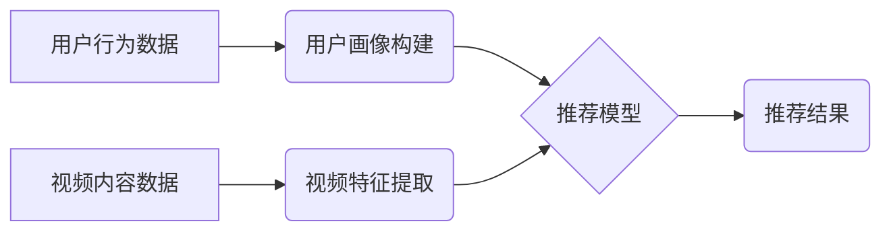

                 

## 电商平台中的视频推荐算法与应用

> 关键词：视频推荐算法、电商平台、协同过滤、内容推荐、深度学习、用户画像、推荐系统

## 1. 背景介绍

随着互联网技术的飞速发展和移动设备的普及，视频内容在电商平台上扮演着越来越重要的角色。视频能够更直观地展示商品特性，提升用户购物体验，从而促进销售转化。然而，海量视频内容的涌现也带来了新的挑战：如何精准推荐用户感兴趣的视频，提升用户粘性和转化率。

视频推荐算法应运而生，旨在根据用户的历史行为、偏好、上下文等信息，推荐最符合用户需求的视频内容。 

电商平台的视频推荐算法与传统的商品推荐算法存在着显著差异。 

* **内容的多样性:** 视频内容更加丰富多样，包含商品展示、用户评价、品牌故事、教程讲解等多种类型。
* **用户体验的复杂性:** 视频观看行为更加复杂，包括观看时长、暂停、跳过、点赞等多种交互行为。
* **推荐场景的多样性:** 视频推荐场景更加多样，包括商品详情页、首页推荐、分类页推荐、用户中心推荐等。

## 2. 核心概念与联系

视频推荐算法的核心是理解用户需求并匹配合适的视频内容。 

**2.1 核心概念**

* **用户画像:** 通过分析用户的历史行为、偏好、属性等信息，构建用户的个性化画像，以便更精准地推荐视频。
* **视频特征:** 对视频内容进行分析，提取其主题、类别、风格、时长等特征，以便更好地理解视频内容。
* **推荐模型:** 基于用户画像和视频特征，构建推荐模型，预测用户对视频的兴趣程度。

**2.2 架构图**



**2.3 联系**

用户画像和视频特征是推荐模型的基础，推荐模型根据这两个要素预测用户对视频的兴趣，最终输出推荐结果。

## 3. 核心算法原理 & 具体操作步骤

### 3.1 算法原理概述

视频推荐算法主要分为以下几种类型：

* **协同过滤:** 基于用户的历史行为和相似用户对视频的偏好，预测用户对视频的兴趣。
* **内容推荐:** 基于视频的特征和用户的兴趣偏好，推荐用户可能感兴趣的视频。
* **深度学习:** 利用深度神经网络学习用户和视频之间的复杂关系，进行更精准的推荐。

### 3.2 算法步骤详解

**3.2.1 协同过滤算法**

1. **数据收集:** 收集用户对视频的评分、观看记录、点赞等行为数据。
2. **用户相似度计算:** 使用余弦相似度、皮尔逊相关系数等方法计算用户之间的相似度。
3. **推荐视频:** 对于目标用户，找到与其相似度最高的邻居用户，并推荐邻居用户喜欢的视频。

**3.2.2 内容推荐算法**

1. **视频特征提取:** 使用文本分析、图像识别、音频分析等技术提取视频的主题、类别、风格、时长等特征。
2. **用户兴趣建模:** 根据用户的历史行为和偏好，构建用户的兴趣模型。
3. **推荐视频:** 计算视频特征与用户兴趣模型之间的匹配度，推荐匹配度最高的视频。

**3.2.3 深度学习算法**

1. **数据预处理:** 对用户行为数据和视频特征数据进行清洗、转换、编码等预处理。
2. **模型构建:** 使用深度神经网络，例如协同过滤网络、内容推荐网络、深度强化学习网络等，构建推荐模型。
3. **模型训练:** 使用训练数据训练推荐模型，优化模型参数。
4. **推荐视频:** 将训练好的模型应用于新的用户行为数据和视频特征数据，预测用户对视频的兴趣，并输出推荐结果。

### 3.3 算法优缺点

| 算法类型 | 优点 | 缺点 |
|---|---|---|
| 协同过滤 | 能够发现用户之间的隐性关系，推荐个性化视频 | 需要大量用户行为数据，容易陷入数据稀疏问题 |
| 内容推荐 | 不依赖于用户行为数据，能够推荐新视频 | 难以捕捉用户细微的兴趣偏好 |
| 深度学习 | 能够学习用户和视频之间的复杂关系，推荐更精准的视频 | 需要大量数据和计算资源，模型解释性较差 |

### 3.4 算法应用领域

视频推荐算法广泛应用于电商平台、视频网站、社交媒体等领域，例如：

* **商品推荐:** 在商品详情页推荐相关视频，帮助用户了解商品特性。
* **首页推荐:** 在首页推荐热门视频、用户感兴趣的视频，提升用户粘性。
* **分类页推荐:** 在分类页推荐相关视频，帮助用户发现新商品。
* **用户中心推荐:** 在用户中心推荐用户观看历史、收藏的视频，提供个性化服务。

## 4. 数学模型和公式 & 详细讲解 & 举例说明

### 4.1 数学模型构建

协同过滤算法的核心是用户-物品交互矩阵，该矩阵表示用户对物品的评分或行为。

**用户-物品交互矩阵:**

```
| 用户1 | 用户2 | 用户3 | ... | 用户N |
|---|---|---|---|---|
| 物品1 |  评分1 |  评分2 | ... |  评分N |
| 物品2 |  评分1 |  评分2 | ... |  评分N |
| 物品3 |  评分1 |  评分2 | ... |  评分N |
| ... | ... | ... | ... | ... |
| 物品M |  评分1 |  评分2 | ... |  评分N |
```

其中，评分表示用户对物品的喜好程度，例如1-5星评分，或观看时长、点赞次数等。

### 4.2 公式推导过程

**余弦相似度:**

$$
\text{相似度}(u,v) = \frac{u \cdot v}{||u|| ||v||}
$$

其中，$u$ 和 $v$ 是两个用户的向量表示，$u \cdot v$ 是两个向量的点积，$||u||$ 和 $||v||$ 是两个向量的模长。

**皮尔逊相关系数:**

$$
\text{相关系数}(u,v) = \frac{\sum_{i=1}^{M}(u_i - \bar{u})(v_i - \bar{v})}{\sqrt{\sum_{i=1}^{M}(u_i - \bar{u})^2} \sqrt{\sum_{i=1}^{M}(v_i - \bar{v})^2}}
$$

其中，$u_i$ 和 $v_i$ 是两个用户对物品 $i$ 的评分，$\bar{u}$ 和 $\bar{v}$ 是两个用户的平均评分。

### 4.3 案例分析与讲解

假设有两个用户 $u$ 和 $v$，他们的评分矩阵如下：

| 物品 | $u$ | $v$ |
|---|---|---|
| 物品1 | 4 | 5 |
| 物品2 | 3 | 2 |
| 物品3 | 5 | 4 |

我们可以使用余弦相似度计算 $u$ 和 $v$ 的相似度：

$$
\text{相似度}(u,v) = \frac{(4 \cdot 5) + (3 \cdot 2) + (5 \cdot 4)}{\sqrt{4^2 + 3^2 + 5^2} \sqrt{5^2 + 2^2 + 4^2}} = \frac{47}{\sqrt{50} \sqrt{45}} \approx 0.94
$$

结果表明，$u$ 和 $v$ 的相似度较高，因此我们可以推荐 $v$ 喜欢但 $u$ 没有观看的视频。

## 5. 项目实践：代码实例和详细解释说明

### 5.1 开发环境搭建

* Python 3.x
* TensorFlow 或 PyTorch
* Scikit-learn

### 5.2 源代码详细实现

```python
# 协同过滤推荐
from sklearn.metrics.pairwise import cosine_similarity

# 用户-物品交互矩阵
user_item_matrix = ...

# 计算用户相似度
user_similarity = cosine_similarity(user_item_matrix)

# 获取目标用户
target_user = 1

# 获取与目标用户相似度最高的邻居用户
neighbors = user_similarity[target_user].argsort()[-5:][::-1]

# 推荐邻居用户喜欢的视频
recommended_items = []
for neighbor in neighbors:
    for item in range(user_item_matrix.shape[1]):
        if user_item_matrix[neighbor, item] > 0 and user_item_matrix[target_user, item] == 0:
            recommended_items.append(item)

print(recommended_items)
```

### 5.3 代码解读与分析

* 首先，我们定义了用户-物品交互矩阵，该矩阵包含用户对物品的评分或行为数据。
* 然后，我们使用 Scikit-learn 库的 `cosine_similarity` 函数计算用户之间的相似度。
* 接下来，我们获取目标用户，并找到与目标用户相似度最高的邻居用户。
* 最后，我们推荐邻居用户喜欢的但目标用户没有观看的视频。

### 5.4 运行结果展示

运行代码后，将输出目标用户可能感兴趣的视频列表。

## 6. 实际应用场景

### 6.1 电商平台商品详情页推荐

在商品详情页，可以根据用户浏览历史、购买记录等信息，推荐与当前商品相关的视频，例如商品使用教程、用户评价视频、品牌故事视频等。

### 6.2 电商平台首页推荐

在电商平台首页，可以根据用户的兴趣偏好、浏览历史、购买记录等信息，推荐热门视频、新上架视频、用户感兴趣的视频等，提升用户粘性和转化率。

### 6.3 电商平台分类页推荐

在电商平台分类页，可以根据用户的浏览历史、购买记录等信息，推荐与当前分类相关的视频，例如商品展示视频、品牌故事视频、用户评价视频等，帮助用户发现新商品。

### 6.4 未来应用展望

随着人工智能技术的不断发展，视频推荐算法将更加精准、个性化。未来，视频推荐算法可能应用于以下场景：

* **个性化视频剪辑:** 根据用户的兴趣偏好，自动剪辑出用户感兴趣的视频片段。
* **视频内容生成:** 利用深度学习技术，自动生成符合用户需求的视频内容。
* **视频广告推荐:** 根据用户的兴趣偏好，推荐更精准的视频广告。

## 7. 工具和资源推荐

### 7.1 学习资源推荐

* **书籍:**
    * 《推荐系统实践》
    * 《深度学习》
* **在线课程:**
    * Coursera: Recommender Systems
    * Udacity: Deep Learning Nanodegree

### 7.2 开发工具推荐

* **Python:** 
    * TensorFlow
    * PyTorch
    * Scikit-learn
* **数据库:**
    * MySQL
    * MongoDB

### 7.3 相关论文推荐

* **协同过滤:**
    * "Collaborative Filtering: A User-Based Approach"
* **内容推荐:**
    * "Content-Based Recommendation Systems"
* **深度学习:**
    * "Neural Collaborative Filtering"

## 8. 总结：未来发展趋势与挑战

### 8.1 研究成果总结

视频推荐算法在电商平台的应用取得了显著成果，能够提升用户体验、促进销售转化。

### 8.2 未来发展趋势

* **更精准的推荐:** 利用更先进的机器学习算法和深度学习技术，实现更精准的视频推荐。
* **更个性化的推荐:** 结合用户画像、行为数据、上下文信息等多方面因素，提供更个性化的视频推荐。
* **更丰富的交互:** 支持用户对视频的评论、点赞、分享等交互行为，提升用户参与度。

### 8.3 面临的挑战

* **数据稀疏问题:** 视频数据往往存在稀疏性，难以训练出准确的推荐模型。
* **冷启动问题:** 新用户和新视频难以获得推荐，需要开发新的算法解决冷启动问题。
* **模型解释性问题:** 深度学习模型的内部机制难以解释，难以理解模型推荐的原因。

### 8.4 研究展望

未来，视频推荐算法的研究将更加注重以下方面:

* **解决数据稀疏问题:** 利用迁移学习、知识蒸馏等技术，提高模型的泛化能力。
* **开发新的冷启动算法:** 利用用户画像、视频特征等信息，为新用户和新视频提供推荐。
* **提升模型解释性:** 研究可解释性机器学习算法，提高模型的透明度和可信度。

## 9. 附录：常见问题与解答

### 9.1 如何评估视频推荐算法的性能？

常用的评估指标包括：

* **准确率:** 推荐结果与用户真实偏好的一致性。
* **召回率:** 推荐结果覆盖了用户真实偏好的视频比例。
* **NDCG:** 考虑了推荐结果的排序，衡量推荐结果的质量。

### 9.2 如何处理视频数据中的噪声？

可以使用以下方法处理视频数据中的噪声：

* **数据清洗:** 删除异常数据、重复数据等。
* **数据降噪:** 使用滤波、平滑等技术去除噪声。
* **数据增强:** 生成新的视频数据，增加训练数据的规模和多样性。

### 9.3 如何提高视频推荐算法的个性化程度？

可以使用以下方法提高视频推荐算法的个性化程度：

* **构建更精细的用户画像:** 结合用户行为数据、兴趣偏好、上下文信息等多方面因素，构建更精细的用户画像。
* **使用个性化推荐算法:** 例如基于用户的协同过滤、基于内容的推荐、混合推荐等算法。
* **提供用户反馈机制:** 允许用户对推荐结果进行评分、点赞、分享等操作，根据用户反馈不断优化推荐算法。


作者：禅与计算机程序设计艺术 / Zen and the Art of Computer Programming<end_of_turn>

