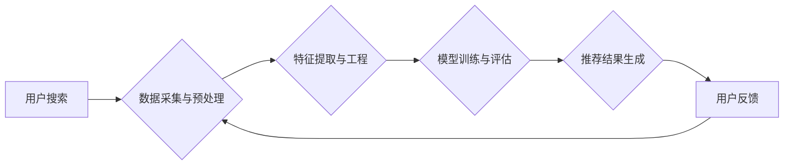

                 

## 电商平台的AI 大模型实践：搜索推荐系统是核心，数据质量控制与处理效率

> 关键词：电商平台、AI大模型、搜索推荐系统、数据质量控制、处理效率、推荐算法、深度学习、自然语言处理、机器学习

## 1. 背景介绍

在当今数据爆炸的时代，电商平台面临着巨大的挑战和机遇。用户数量的激增、商品种类繁多以及个性化需求的不断提高，使得传统的搜索和推荐系统难以满足用户的体验需求。因此，电商平台迫切需要借助人工智能（AI）大模型的力量，提升用户体验、提高转化率和促进商业发展。

AI大模型在电商平台的应用前景广阔，其中搜索推荐系统是核心应用场景之一。搜索推荐系统能够根据用户的历史行为、偏好和上下文信息，精准推荐相关商品，提升用户购物体验，并为电商平台带来更高的商业价值。

## 2. 核心概念与联系

### 2.1 搜索推荐系统

搜索推荐系统是将搜索引擎和推荐引擎相结合的系统，旨在为用户提供更精准、更个性化的商品推荐。它通过分析用户的搜索行为、浏览历史、购买记录等数据，并结合商品的属性信息、用户画像等，预测用户潜在的兴趣，并推荐相关商品。

### 2.2 AI大模型

AI大模型是指在海量数据上训练的深度学习模型，具有强大的泛化能力和学习能力。它能够从海量数据中提取复杂特征，并进行智能推理和决策，在自然语言处理、计算机视觉、语音识别等领域展现出强大的应用潜力。

### 2.3 数据质量控制与处理效率

数据质量是AI大模型训练和应用的关键因素。高质量的数据能够保证模型的准确性和可靠性，而低质量的数据则会导致模型的性能下降甚至失效。因此，数据质量控制和处理效率是构建高效的搜索推荐系统的重要环节。

**核心概念与联系流程图**



## 3. 核心算法原理 & 具体操作步骤

### 3.1 算法原理概述

电商平台的搜索推荐系统通常采用基于协同过滤、基于内容过滤和基于混合方法的推荐算法。

* **协同过滤算法:** 

根据用户的历史行为数据，预测用户对商品的潜在兴趣。它通过分析用户对相似商品的评分或购买行为，推荐用户可能感兴趣的商品。

* **内容过滤算法:** 

根据商品的属性信息和用户偏好，推荐用户可能感兴趣的商品。它通过分析商品的类别、描述、价格等信息，并结合用户的历史购买记录和浏览记录，推荐用户可能感兴趣的商品。

* **混合方法:** 

结合协同过滤和内容过滤算法的优点，构建更精准的推荐系统。

### 3.2 算法步骤详解

**协同过滤算法步骤:**

1. **数据收集:** 收集用户对商品的评分、购买记录等行为数据。
2. **用户相似度计算:** 计算用户之间的相似度，例如使用余弦相似度或皮尔逊相关系数。
3. **商品推荐:** 根据用户相似度，推荐用户可能感兴趣的商品。

**内容过滤算法步骤:**

1. **商品特征提取:** 从商品的属性信息中提取特征，例如类别、描述、价格等。
2. **用户偏好建模:** 根据用户的历史行为数据，构建用户偏好的模型，例如使用朴素贝叶斯或逻辑回归。
3. **商品推荐:** 根据商品特征和用户偏好模型，推荐用户可能感兴趣的商品。

**混合方法步骤:**

1. **协同过滤和内容过滤模型训练:** 训练协同过滤和内容过滤模型。
2. **模型融合:** 将协同过滤和内容过滤模型的推荐结果进行融合，例如使用加权平均或投票机制。
3. **推荐结果输出:** 输出最终的推荐结果。

### 3.3 算法优缺点

**协同过滤算法:**

* **优点:** 能够发现用户之间的隐性关系，推荐个性化商品。
* **缺点:** 数据稀疏性问题，新用户和新商品推荐效果较差。

**内容过滤算法:**

* **优点:** 不需要用户历史行为数据，能够推荐新商品。
* **缺点:** 难以捕捉用户之间的隐性关系，推荐结果可能缺乏个性化。

**混合方法:**

* **优点:** 结合协同过滤和内容过滤算法的优点，能够提高推荐效果。
* **缺点:** 模型训练复杂度较高。

### 3.4 算法应用领域

搜索推荐算法广泛应用于电商平台、社交媒体、音乐平台、视频平台等领域，例如：

* **商品推荐:** 根据用户的兴趣和行为，推荐相关商品。
* **内容推荐:** 根据用户的兴趣和行为，推荐相关内容，例如文章、视频、音乐等。
* **用户画像:** 根据用户的行为数据，构建用户画像，了解用户的兴趣和偏好。

## 4. 数学模型和公式 & 详细讲解 & 举例说明

### 4.1 数学模型构建

协同过滤算法通常使用矩阵分解模型，将用户-商品交互矩阵分解成两个低维矩阵，分别表示用户特征和商品特征。

假设用户集合为U，商品集合为I，用户-商品交互矩阵为R，其中R(u,i)表示用户u对商品i的评分或购买行为。

则矩阵分解模型可以表示为：

$$R \approx U V^T$$

其中，U为用户特征矩阵，V为商品特征矩阵。

### 4.2 公式推导过程

矩阵分解模型的目标是最小化用户-商品交互矩阵与预测矩阵之间的误差。常用的损失函数为均方误差（MSE）：

$$Loss = \frac{1}{N} \sum_{u \in U, i \in I} (R(u,i) - \hat{R}(u,i))^2$$

其中，N为用户-商品交互矩阵中的非零元素个数，$\hat{R}(u,i)$为预测的评分或购买行为。

通过梯度下降算法，可以迭代更新用户特征矩阵U和商品特征矩阵V，使得损失函数最小化。

### 4.3 案例分析与讲解

假设有一个用户-商品交互矩阵，其中用户集合为{u1, u2, u3}, 商品集合为{i1, i2, i3}, 矩阵元素表示用户对商品的评分。

$$R = \begin{bmatrix}
5 & 3 & 4 \\
4 & 5 & 2 \\
3 & 2 & 5
\end{bmatrix}$$

通过矩阵分解模型，可以将用户-商品交互矩阵分解成两个低维矩阵，例如：

$$U = \begin{bmatrix}
0.8 & 0.6 & 0.2 \\
0.6 & 0.8 & 0.4 \\
0.4 & 0.6 & 0.8
\end{bmatrix}, V = \begin{bmatrix}
0.8 & 0.6 & 0.4 \\
0.6 & 0.8 & 0.4 \\
0.4 & 0.6 & 0.8
\end{bmatrix}$$

通过这两个低维矩阵，可以预测用户对商品的评分，例如：

$$\hat{R}(u1, i1) = U(u1,:) \cdot V(i1,:)^T = 0.8 \cdot 0.8 + 0.6 \cdot 0.6 + 0.2 \cdot 0.4 = 0.96$$

## 5. 项目实践：代码实例和详细解释说明

### 5.1 开发环境搭建

* **操作系统:** Linux/macOS/Windows
* **编程语言:** Python
* **深度学习框架:** TensorFlow/PyTorch
* **数据处理库:** Pandas/NumPy
* **工具:** Git/Docker

### 5.2 源代码详细实现

```python
import tensorflow as tf

# 定义用户-商品交互矩阵
R = tf.constant([[5, 3, 4],
                 [4, 5, 2],
                 [3, 2, 5]])

# 定义用户特征矩阵和商品特征矩阵
U = tf.Variable(tf.random.normal([3, 2]))
V = tf.Variable(tf.random.normal([3, 2]))

# 计算预测评分
predictions = tf.matmul(U, V, transpose_b=True)

# 定义损失函数
loss = tf.reduce_mean(tf.square(R - predictions))

# 定义优化器
optimizer = tf.keras.optimizers.Adam()

# 训练模型
for epoch in range(100):
    with tf.GradientTape() as tape:
        loss_value = loss
    gradients = tape.gradient(loss_value, [U, V])
    optimizer.apply_gradients(zip(gradients, [U, V]))

    print(f"Epoch {epoch + 1}, Loss: {loss_value.numpy()}")

# 打印训练后的用户特征矩阵和商品特征矩阵
print("User Features:")
print(U.numpy())
print("Item Features:")
print(V.numpy())
```

### 5.3 代码解读与分析

* 代码首先定义用户-商品交互矩阵R，以及用户特征矩阵U和商品特征矩阵V。
* 然后计算预测评分，并定义损失函数和优化器。
* 最后使用梯度下降算法训练模型，并打印训练后的用户特征矩阵和商品特征矩阵。

### 5.4 运行结果展示

训练完成后，可以观察到用户特征矩阵和商品特征矩阵的权重值，这些权重值代表了用户和商品的潜在特征。

## 6. 实际应用场景

### 6.1 电商平台商品推荐

电商平台可以利用搜索推荐系统，根据用户的浏览历史、购买记录、收藏夹等数据，推荐用户可能感兴趣的商品。

### 6.2 个性化广告推荐

搜索推荐系统可以根据用户的兴趣和行为，推荐个性化的广告，提高广告点击率和转化率。

### 6.3 内容推荐

搜索推荐系统可以用于推荐新闻、文章、视频、音乐等内容，提升用户体验和内容发现率。

### 6.4 未来应用展望

随着AI技术的不断发展，搜索推荐系统将更加智能化、个性化和精准化。未来，搜索推荐系统将应用于更多领域，例如：

* **医疗保健:** 推荐相关疾病信息、治疗方案和医疗机构。
* **教育:** 推荐个性化的学习资源和课程。
* **金融:** 推荐理财产品和投资建议。

## 7. 工具和资源推荐

### 7.1 学习资源推荐

* **书籍:**
    * 《推荐系统实践》
    * 《深度学习》
* **在线课程:**
    * Coursera: Recommender Systems
    * Udacity: Deep Learning Nanodegree

### 7.2 开发工具推荐

* **深度学习框架:** TensorFlow, PyTorch
* **数据处理库:** Pandas, NumPy
* **云平台:** AWS, Azure, GCP

### 7.3 相关论文推荐

* **协同过滤:**
    * "Collaborative Filtering: A User-Based Approach"
    * "Memory-Based Collaborative Filtering"
* **内容过滤:**
    * "Content-Based Recommendation Systems"
    * "A Hybrid Approach to Content-Based and Collaborative Filtering"
* **深度学习推荐:**
    * "Deep Learning for Recommender Systems"
    * "Neural Collaborative Filtering"

## 8. 总结：未来发展趋势与挑战

### 8.1 研究成果总结

电商平台的搜索推荐系统已经取得了显著的成果，能够为用户提供更精准、更个性化的商品推荐，提升用户体验和商业价值。

### 8.2 未来发展趋势

* **更精准的推荐:** 利用更先进的机器学习算法和深度学习模型，提高推荐的精准度和个性化程度。
* **更丰富的推荐场景:** 将搜索推荐系统应用于更多场景，例如个性化广告推荐、内容推荐、医疗保健推荐等。
* **更智能的交互:** 利用自然语言处理技术，实现更智能的交互，例如语音搜索和对话推荐。

### 8.3 面临的挑战

* **数据质量控制:** 确保推荐系统的训练数据质量，避免低质量数据导致模型性能下降。
* **处理效率:** 提升推荐系统的处理效率，能够实时响应用户的需求。
* **用户隐私保护:** 确保用户数据的安全和隐私，避免数据泄露和滥用。

### 8.4 研究展望

未来，搜索推荐系统将继续朝着更智能、更精准、更个性化的方向发展，为用户提供更丰富的体验和价值。


## 9. 附录：常见问题与解答

### 9.1 如何评估推荐系统的性能？

常用的评估指标包括：

* **准确率:** 推荐结果中正确预测的用户偏好的比例。
* **召回率:** 推荐结果中包含所有用户偏好的比例。
* **F1-score:** 准确率和召回率的调和平均值。
* **点击率:** 用户点击推荐结果的比例。
* **转化率:** 用户点击推荐结果后完成购买或其他目标行为的比例。

### 9.2 如何处理数据稀疏性问题？

数据稀疏性问题是协同过滤算法面临的常见挑战。常用的解决方案包括：

* **矩阵分解:** 将用户-商品交互矩阵分解成两个低维矩阵，降低数据维度。
* **基于内容过滤:** 利用商品的属性信息和用户偏好，推荐新商品。
* **混合方法:** 结合协同过滤和内容过滤算法，提高推荐效果。

### 9.3 如何保证用户隐私？

在构建搜索推荐系统时，需要采取措施保护用户隐私，例如：

* **匿名化数据:** 将用户数据匿名化，避免直接识别用户身份。
* **数据加密:** 对用户数据进行加密，防止数据泄露。
* **最小化数据收集:** 只收集必要的用户数据，避免过度收集用户隐私信息。


作者：禅与计算机程序设计艺术 / Zen and the Art of Computer Programming 
<end_of_turn>

