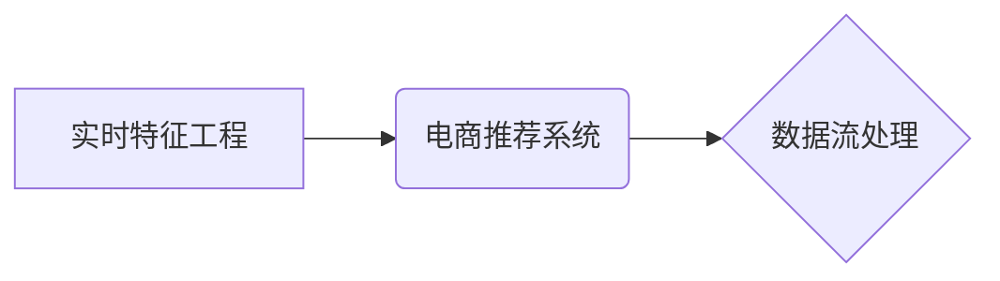

                 

## 电商推荐系统中的实时特征工程技术

> 关键词：实时特征工程、电商推荐系统、机器学习、数据流处理、模型训练、特征选择、模型评估

## 1. 背景介绍

在当今数据爆炸的时代，电商推荐系统已成为电商平台的核心竞争力之一。推荐系统通过分析用户的行为数据、商品信息等，为用户提供个性化的商品推荐，从而提升用户体验、促进交易转化。然而，传统的特征工程方法往往依赖于离线数据处理，无法及时捕捉用户行为的动态变化，导致推荐效果下降。

实时特征工程技术应运而生，它通过对实时数据流进行高效处理和特征提取，能够动态更新推荐模型，从而实现更精准、更个性化的商品推荐。

## 2. 核心概念与联系

### 2.1 实时特征工程

实时特征工程是指在数据流处理环境下，对实时数据进行特征提取、转换和组合，以生成用于机器学习模型训练和预测的特征向量。

### 2.2 电商推荐系统

电商推荐系统是指利用机器学习算法，根据用户的历史行为、商品属性等信息，预测用户对商品的兴趣，并推荐相关商品的系统。

### 2.3 数据流处理

数据流处理是指对持续不断的数据流进行实时处理和分析，并根据处理结果做出决策或触发其他操作。

**核心概念关系图:**



## 3. 核心算法原理 & 具体操作步骤

### 3.1 算法原理概述

实时特征工程算法通常基于以下核心原理：

* **数据流处理框架:** 利用数据流处理框架，例如 Apache Kafka、Apache Flink 等，实现对实时数据的接收、存储和处理。
* **特征提取引擎:** 使用预定义的特征提取规则或机器学习模型，从实时数据流中提取特征。
* **特征转换和组合:** 对提取的特征进行转换和组合，生成用于机器学习模型训练的特征向量。
* **模型训练和更新:** 利用训练好的机器学习模型，对实时数据流进行预测，并根据预测结果更新推荐模型。

### 3.2 算法步骤详解

1. **数据采集:** 从电商平台的各种数据源，例如用户行为日志、商品信息库、订单数据等，采集实时数据流。
2. **数据清洗和预处理:** 对采集到的实时数据进行清洗和预处理，例如去除重复数据、处理缺失值、格式转换等。
3. **特征提取:** 使用预定义的特征提取规则或机器学习模型，从数据流中提取特征，例如用户浏览历史、购买记录、商品类别、价格等。
4. **特征转换和组合:** 对提取的特征进行转换和组合，生成用于机器学习模型训练的特征向量，例如用户兴趣标签、商品相似度等。
5. **模型训练和更新:** 利用训练好的机器学习模型，对实时数据流进行预测，并根据预测结果更新推荐模型，例如调整推荐权重、添加新的推荐规则等。
6. **推荐结果输出:** 将模型预测结果输出到推荐引擎，为用户提供个性化的商品推荐。

### 3.3 算法优缺点

**优点:**

* **实时性:** 可以及时捕捉用户行为的动态变化，实现更精准的推荐。
* **个性化:** 可以根据用户的实时行为和偏好，提供更个性化的商品推荐。
* **迭代优化:** 可以根据用户的反馈和推荐效果，不断迭代优化推荐模型。

**缺点:**

* **复杂度高:** 实时特征工程需要处理大量实时数据，算法复杂度较高。
* **资源消耗:** 实时数据处理需要消耗大量的计算资源和存储资源。
* **模型更新:** 模型更新需要频繁进行，需要保证模型的稳定性和可靠性。

### 3.4 算法应用领域

实时特征工程技术广泛应用于电商推荐系统、广告推荐系统、金融风险控制系统、医疗诊断系统等领域。

## 4. 数学模型和公式 & 详细讲解 & 举例说明

### 4.1 数学模型构建

在电商推荐系统中，常用的数学模型包括协同过滤模型、内容过滤模型和混合模型。

* **协同过滤模型:** 基于用户的历史行为数据，预测用户对商品的兴趣。
* **内容过滤模型:** 基于商品的属性信息，预测用户对商品的兴趣。
* **混合模型:** 将协同过滤模型和内容过滤模型相结合，提高推荐效果。

### 4.2 公式推导过程

协同过滤模型中常用的算法是基于矩阵分解的算法，例如 Singular Value Decomposition (SVD) 和 Alternating Least Squares (ALS)。

**SVD 公式:**

$$
R = U \Sigma V^T
$$

其中：

* $R$ 是用户-商品评分矩阵。
* $U$ 是用户特征矩阵。
* $\Sigma$ 是奇异值矩阵。
* $V^T$ 是商品特征矩阵的转置。

**ALS 公式:**

$$
\begin{aligned}
U &= \arg \min_U \left\| R - UV^T \right\|_F^2 \\
V &= \arg \min_V \left\| R - UV^T \right\|_F^2
\end{aligned}
$$

其中：

* $U$ 是用户特征矩阵。
* $V$ 是商品特征矩阵。
* $R$ 是用户-商品评分矩阵。
* $\left\| \cdot \right\|_F^2$ 表示 Frobenius 范数的平方。

### 4.3 案例分析与讲解

假设有一个用户-商品评分矩阵 $R$，其中每个元素表示用户对商品的评分。可以使用 SVD 或 ALS 算法对该矩阵进行分解，得到用户特征矩阵 $U$ 和商品特征矩阵 $V$。

然后，可以利用这些特征矩阵，预测用户对未评分的商品的兴趣。例如，如果用户 $u$ 对商品 $i$ 的评分未知，可以计算 $u$ 和 $i$ 的特征向量之间的内积，作为预测评分。

## 5. 项目实践：代码实例和详细解释说明

### 5.1 开发环境搭建

* **操作系统:** Linux
* **编程语言:** Python
* **数据流处理框架:** Apache Flink
* **机器学习库:** scikit-learn

### 5.2 源代码详细实现

```python
# 导入必要的库
from pyspark.sql import SparkSession
from pyspark.sql.functions import col, udf
from pyspark.sql.types import IntegerType

# 初始化 SparkSession
spark = SparkSession.builder.appName("RealTimeFeatureEngineering").getOrCreate()

# 读取实时数据流
data_stream = spark.readStream.format("kafka").option("kafka.bootstrap.servers", "localhost:9092").option("subscribe", "user_behavior_topic").load()

# 定义特征提取函数
@udf(returnType=IntegerType())
def extract_user_interest(user_id, product_id):
    # 根据用户ID和商品ID，提取用户兴趣标签
    # ...

# 使用特征提取函数提取特征
data_stream = data_stream.withColumn("user_interest", extract_user_interest(col("user_id"), col("product_id")))

# 将数据流写入数据库
data_stream.writeStream.format("jdbc").option("url", "jdbc:mysql://localhost:3306/ecommerce").option("dbtable", "user_behavior").option("user", "root").option("password", "password").start()
```

### 5.3 代码解读与分析

* 代码首先使用 SparkSession 初始化 Spark 应用程序。
* 然后使用 `readStream` 方法读取实时数据流，并指定 Kafka 的连接信息和订阅主题。
* 定义了一个 `extract_user_interest` 函数，用于根据用户ID和商品ID提取用户兴趣标签。
* 使用 `withColumn` 方法将提取的特征添加到数据流中。
* 最后使用 `writeStream` 方法将数据流写入数据库。

### 5.4 运行结果展示

运行代码后，实时数据流中的用户行为数据将被实时处理，并提取出用户兴趣标签，最终写入数据库。

## 6. 实际应用场景

### 6.1 用户画像构建

实时特征工程可以帮助构建更精准的用户画像，例如用户的兴趣爱好、消费习惯、购买偏好等。

### 6.2 商品推荐

实时特征工程可以根据用户的实时行为数据，动态更新商品推荐模型，提供更个性化的商品推荐。

### 6.3 个性化营销

实时特征工程可以帮助实现个性化营销，例如根据用户的兴趣爱好和购买历史，推送相关的促销活动和广告。

### 6.4 风险控制

实时特征工程可以用于金融风险控制，例如检测异常交易行为、识别欺诈行为等。

### 6.4 未来应用展望

随着数据流处理技术的不断发展，实时特征工程技术将在更多领域得到应用，例如智能客服、自动驾驶、医疗诊断等。

## 7. 工具和资源推荐

### 7.1 学习资源推荐

* **书籍:**
    * 《Spark Streaming实战》
    * 《机器学习实战》
* **在线课程:**
    * Coursera: Machine Learning
    * Udacity: Deep Learning Nanodegree

### 7.2 开发工具推荐

* **数据流处理框架:** Apache Flink, Apache Kafka
* **机器学习库:** scikit-learn, TensorFlow, PyTorch

### 7.3 相关论文推荐

* **Real-Time Feature Engineering for Recommender Systems**
* **Streaming Feature Engineering for Machine Learning**

## 8. 总结：未来发展趋势与挑战

### 8.1 研究成果总结

实时特征工程技术在电商推荐系统中取得了显著的成果，能够提高推荐效果、个性化程度和实时性。

### 8.2 未来发展趋势

* **模型效率提升:** 研究更轻量级、更高效的机器学习模型，以降低实时特征工程的计算成本。
* **自动化特征工程:** 研究自动化特征工程的方法，减少人工干预，提高效率。
* **联邦学习:** 研究联邦学习技术，实现数据隐私保护的同时进行实时特征工程。

### 8.3 面临的挑战

* **数据质量:** 实时数据流的数据质量难以保证，需要开发有效的清洗和预处理方法。
* **模型稳定性:** 实时数据流的动态变化会导致模型稳定性下降，需要开发有效的模型更新和维护方法。
* **资源消耗:** 实时特征工程需要消耗大量的计算资源和存储资源，需要开发更有效的资源管理方法。

### 8.4 研究展望

未来，实时特征工程技术将继续朝着更智能、更自动化、更安全的方向发展，为电商推荐系统和其他领域提供更强大的支持。

## 9. 附录：常见问题与解答

**1. 实时特征工程与离线特征工程有什么区别？**

实时特征工程处理的是实时数据流，能够及时捕捉用户行为的动态变化，而离线特征工程处理的是历史数据，无法及时更新推荐模型。

**2. 实时特征工程有哪些常用的算法？**

常用的算法包括基于矩阵分解的算法、基于树模型的算法、基于深度学习的算法等。

**3. 实时特征工程有哪些挑战？**

挑战包括数据质量、模型稳定性、资源消耗等。


作者：禅与计算机程序设计艺术 / Zen and the Art of Computer Programming 
<end_of_turn>

