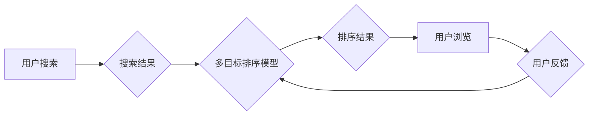

                 

## 电商搜索中的多目标排序深度优化

> 关键词：电商搜索、多目标排序、深度学习、推荐系统、排序算法、用户体验、个性化

## 1. 背景介绍

电商平台搜索是用户获取商品信息和完成购买的关键环节。高效、精准的搜索结果排序直接影响着用户体验和平台转化率。传统的排序算法往往基于单一目标，如点击率或转化率，难以兼顾用户多样化的需求和平台的商业目标。随着深度学习技术的快速发展，多目标排序深度优化成为电商搜索领域的研究热点。

近年来，深度学习在推荐系统和排序算法领域取得了显著的成果。基于深度学习的多目标排序模型能够学习用户行为、商品特征和平台业务目标之间的复杂关系，实现更精准、更个性化的排序结果。

## 2. 核心概念与联系

### 2.1 多目标排序

多目标排序是指同时考虑多个目标函数进行排序，例如点击率、转化率、用户满意度等。传统的排序算法往往只关注单一目标，而多目标排序能够更全面地反映用户需求和平台目标。

### 2.2 深度学习

深度学习是一种机器学习方法，利用多层神经网络模拟人类大脑的学习过程。深度学习模型能够从海量数据中学习复杂的特征表示，并进行精准的预测和分类。

### 2.3 电商搜索

电商搜索是指用户在电商平台上输入关键词或商品信息，平台根据用户的搜索意图返回相关商品的搜索结果。电商搜索的排序算法直接影响着用户体验和平台转化率。

**核心概念与联系流程图**



## 3. 核心算法原理 & 具体操作步骤

### 3.1 算法原理概述

多目标排序深度优化算法通常基于深度神经网络，将用户行为、商品特征和平台业务目标作为输入，学习出一个能够同时优化多个目标函数的排序模型。常见的深度学习模型包括深度神经网络（DNN）、卷积神经网络（CNN）、循环神经网络（RNN）等。

### 3.2 算法步骤详解

1. **数据预处理:** 收集用户行为数据、商品特征数据和平台业务目标数据，进行清洗、转换和特征工程。
2. **模型构建:** 选择合适的深度学习模型，并根据多目标排序需求设计模型结构和损失函数。
3. **模型训练:** 利用训练数据训练深度学习模型，并通过反向传播算法优化模型参数。
4. **模型评估:** 使用测试数据评估模型性能，并根据评估结果进行模型调优。
5. **模型部署:** 将训练好的模型部署到线上环境，用于实时排序搜索结果。

### 3.3 算法优缺点

**优点:**

* 能够同时优化多个目标函数，实现更精准、更个性化的排序结果。
* 学习能力强，能够从海量数据中学习复杂的特征表示。
* 可扩展性强，能够适应不断变化的用户需求和平台业务目标。

**缺点:**

* 训练数据量大，需要大量的计算资源和时间。
* 模型复杂度高，需要专业的机器学习知识和经验。
* 算法解释性差，难以理解模型的决策过程。

### 3.4 算法应用领域

多目标排序深度优化算法广泛应用于电商搜索、推荐系统、广告排序等领域。

## 4. 数学模型和公式 & 详细讲解 & 举例说明

### 4.1 数学模型构建

多目标排序深度优化模型通常采用多任务学习框架，将多个目标函数作为不同的任务，并共享一部分模型参数。

假设我们有N个商品，每个商品都有m个特征，用户有u个特征。

* **商品特征向量:** $x_i \in R^m$，其中i=1,2,...,N
* **用户特征向量:** $u \in R^u$
* **目标函数:** $f_j(x_i, u)$，其中j=1,2,...,k，k为目标函数数量

**模型输出:** $y_i \in R^k$，其中$y_i$为商品i在每个目标函数上的排序分数。

### 4.2 公式推导过程

多任务学习框架的目标是学习一个共享参数的模型，能够同时优化多个目标函数。常用的损失函数包括：

* **加权平均损失函数:** $L = \sum_{j=1}^{k} \omega_j L_j$，其中$\omega_j$为目标函数j的权重，$L_j$为目标函数j的损失函数。

* **多目标优化损失函数:** $L = \sum_{i=1}^{N} \sum_{j=1}^{k} \mathcal{L}_j(y_{ij}, f_{ij})$，其中$\mathcal{L}_j$为目标函数j的损失函数，$y_{ij}$为模型输出，$f_{ij}$为真实目标函数值。

### 4.3 案例分析与讲解

假设我们有一个电商平台，需要对商品进行排序，同时考虑点击率和转化率两个目标函数。

* **点击率目标函数:** $f_1(x_i, u)$，表示商品i被用户点击的概率。
* **转化率目标函数:** $f_2(x_i, u)$，表示用户点击商品i后购买商品的概率。

我们可以使用加权平均损失函数，将点击率和转化率的权重设置为0.6和0.4，分别表示这两个目标函数的重要性。

## 5. 项目实践：代码实例和详细解释说明

### 5.1 开发环境搭建

* Python 3.6+
* TensorFlow/PyTorch
* CUDA Toolkit

### 5.2 源代码详细实现

```python
import tensorflow as tf

# 定义模型结构
class MultiObjectiveSortModel(tf.keras.Model):
    def __init__(self, num_features, num_users, num_objectives):
        super(MultiObjectiveSortModel, self).__init__()
        # ...

    def call(self, inputs):
        # ...

# 构建模型实例
model = MultiObjectiveSortModel(num_features=100, num_users=50, num_objectives=2)

# 定义损失函数
def multi_objective_loss(y_true, y_pred):
    # ...

# 训练模型
model.compile(optimizer='adam', loss=multi_objective_loss)
model.fit(x_train, y_train, epochs=10)

# 预测排序结果
predictions = model.predict(x_test)
```

### 5.3 代码解读与分析

* 模型结构: 模型结构可以根据具体需求进行设计，常用的结构包括DNN、CNN、RNN等。
* 损失函数: 损失函数用于衡量模型预测结果与真实目标函数值的差距。
* 训练过程: 使用训练数据训练模型，并通过反向传播算法优化模型参数。
* 预测过程: 使用训练好的模型预测新的数据，并根据模型输出进行排序。

### 5.4 运行结果展示

* 可视化排序结果
* 评估模型性能

## 6. 实际应用场景

### 6.1 电商搜索排序

* 根据用户搜索历史、浏览记录、购买行为等信息，个性化推荐商品排序结果。
* 优化商品展示位置，提高用户点击率和转化率。

### 6.2 推荐系统

* 基于用户兴趣、行为偏好等信息，推荐个性化商品、内容或服务。
* 提高用户活跃度和留存率。

### 6.3 广告排序

* 根据用户画像、广告特征等信息，精准匹配广告和用户，提高广告点击率和转化率。
* 优化广告投放效果，降低广告成本。

### 6.4 未来应用展望

* 多目标排序深度优化算法将应用于更多领域，例如医疗诊断、金融风险评估、教育推荐等。
* 算法模型将更加复杂，能够学习更丰富的用户特征和业务目标。
* 算法解释性将得到提升，能够更好地理解模型的决策过程。

## 7. 工具和资源推荐

### 7.1 学习资源推荐

* 深度学习书籍：
    * Deep Learning by Ian Goodfellow, Yoshua Bengio, and Aaron Courville
    * Hands-On Machine Learning with Scikit-Learn, Keras & TensorFlow by Aurélien Géron
* 在线课程：
    * TensorFlow Tutorials: https://www.tensorflow.org/tutorials
    * PyTorch Tutorials: https://pytorch.org/tutorials/

### 7.2 开发工具推荐

* TensorFlow: https://www.tensorflow.org/
* PyTorch: https://pytorch.org/
* Keras: https://keras.io/

### 7.3 相关论文推荐

* Multi-Objective Learning for Recommender Systems: https://arxiv.org/abs/1806.04948
* Deep Multi-Objective Ranking: https://arxiv.org/abs/1901.01824

## 8. 总结：未来发展趋势与挑战

### 8.1 研究成果总结

多目标排序深度优化算法取得了显著的成果，能够有效地提升电商搜索、推荐系统和广告排序的性能。

### 8.2 未来发展趋势

* 模型复杂度提升: 探索更复杂的深度学习模型，例如Transformer、Graph Neural Networks等，提升模型的学习能力和表达能力。
* 算法解释性增强: 研究更有效的算法解释方法，提高对模型决策过程的理解。
* 跨模态排序: 将文本、图像、视频等多模态信息融合到排序模型中，实现更精准的排序。

### 8.3 面临的挑战

* 数据稀疏性: 许多电商平台面临数据稀疏性问题，难以训练出有效的深度学习模型。
* 算法可解释性: 深度学习模型的决策过程难以解释，难以获得用户的信任。
* 算法公平性: 算法可能存在偏见，导致不公平的排序结果。

### 8.4 研究展望

未来，多目标排序深度优化算法将继续朝着更智能、更公平、更可解释的方向发展。


## 9. 附录：常见问题与解答

* **Q1: 多目标排序深度优化算法与传统的排序算法相比有什么优势？**

* **A1:** 多目标排序深度优化算法能够同时优化多个目标函数，实现更精准、更个性化的排序结果，而传统的排序算法往往只关注单一目标。

* **Q2: 如何选择合适的深度学习模型？**

* **A2:** 选择合适的深度学习模型需要根据具体需求和数据特点进行选择。常用的模型包括DNN、CNN、RNN等。

* **Q3: 如何解决数据稀疏性问题？**

* **A3:** 可以使用数据增强、迁移学习等技术来解决数据稀疏性问题。

* **Q4: 如何评估多目标排序深度优化算法的性能？**

* **A4:** 可以使用多种指标来评估模型性能，例如NDCG、MAP、AUC等。

* **Q5: 如何保证算法的公平性？**

* **A5:** 可以使用公平性约束、对抗训练等技术来保证算法的公平性。


作者：禅与计算机程序设计艺术 / Zen and the Art of Computer Programming 
<end_of_turn>

