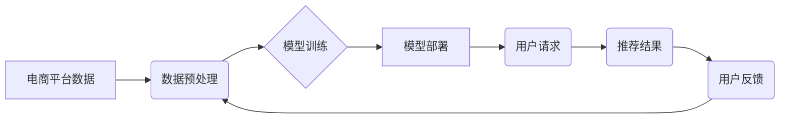

                 

## 电商搜索推荐中的AI大模型数据增量更新策略

> 关键词：电商搜索推荐、AI大模型、数据增量更新、模型训练、在线学习、效率优化、推荐算法

## 1. 背景介绍

在当今数据爆炸的时代，电商平台面临着海量商品和用户数据，如何精准推荐用户感兴趣的商品成为了提升用户体验和商业效益的关键。AI大模型凭借其强大的学习能力和泛化能力，在电商搜索推荐领域展现出巨大的潜力。然而，AI大模型的训练需要海量数据，而电商平台数据更新速度快，模型训练周期长，难以满足实时推荐的需求。因此，高效的AI大模型数据增量更新策略显得尤为重要。

传统的电商搜索推荐系统通常采用离线训练的方式，定期更新模型参数。这种方法存在以下问题：

* **训练成本高:** 每次模型更新都需要重新训练整个模型，消耗大量计算资源和时间。
* **实时性差:** 模型更新周期长，难以适应数据变化的快速节奏，导致推荐结果不及时。
* **数据冗余:** 每次训练都需要使用全部数据，导致数据冗余，降低训练效率。

数据增量更新策略旨在解决上述问题，通过只更新模型中需要更新的部分，降低训练成本，提高实时性，并提高训练效率。

## 2. 核心概念与联系

### 2.1  核心概念

* **AI大模型:** 指规模庞大、参数数量众多的深度学习模型，例如Transformer、BERT等。
* **数据增量更新:** 指只更新模型中需要更新的部分，而不是重新训练整个模型。
* **在线学习:** 指模型在接收到新数据后，实时更新模型参数，实现持续学习。

### 2.2  架构关系



## 3. 核心算法原理 & 具体操作步骤

### 3.1  算法原理概述

数据增量更新策略的核心思想是利用模型的微调机制，只更新模型中与新数据相关的参数，从而降低训练成本和时间。常见的算法包括：

* **梯度累积:** 将新数据的梯度累积起来，并在一定时间间隔后更新模型参数。
* **在线学习:** 在接收到新数据后，实时更新模型参数。
* **联邦学习:** 将模型参数分散在多个设备上，通过聚合更新参数的方式实现模型训练。

### 3.2  算法步骤详解

以梯度累积为例，其具体操作步骤如下：

1. **数据预处理:** 对新数据进行预处理，例如文本清洗、特征提取等。
2. **梯度计算:** 使用新数据计算模型参数的梯度。
3. **梯度累积:** 将新数据的梯度累积到一个缓冲区中。
4. **模型更新:** 在一定时间间隔后，将缓冲区中的梯度累积值用于更新模型参数。

### 3.3  算法优缺点

| 算法 | 优点 | 缺点 |
|---|---|---|
| 梯度累积 | 训练成本低，实时性较好 | 需要设置累积时间间隔，参数更新频率较低 |
| 在线学习 | 实时性高，能够快速适应数据变化 | 容易出现过拟合问题，需要谨慎设置学习率 |
| 联邦学习 | 保护数据隐私，能够训练更大规模的模型 | 通信成本高，训练效率较低 |

### 3.4  算法应用领域

数据增量更新策略广泛应用于电商搜索推荐、自然语言处理、计算机视觉等领域，例如：

* **电商搜索推荐:** 实时更新商品推荐模型，提高推荐精准度和用户体验。
* **个性化推荐:** 根据用户的行为数据，实时更新用户的兴趣偏好模型，提供个性化推荐。
* **广告投放:** 根据用户的行为数据，实时更新广告投放模型，提高广告点击率和转化率。

## 4. 数学模型和公式 & 详细讲解 & 举例说明

### 4.1  数学模型构建

假设我们有一个电商搜索推荐模型，其目标是预测用户对商品的点击概率。我们可以使用以下数学模型来表示模型的预测结果：

$$
P(click|user, item) = sigmoid(w^T * h(user, item))
$$

其中：

* $P(click|user, item)$ 表示用户对商品的点击概率。
* $w$ 是模型参数向量。
* $h(user, item)$ 是用户和商品的特征向量。
* $sigmoid(x)$ 是 sigmoid 函数，用于将预测结果映射到 [0, 1] 的区间内。

### 4.2  公式推导过程

模型参数 $w$ 的更新可以通过梯度下降算法实现。梯度下降算法的目标是找到使模型预测结果与真实结果误差最小的参数值。

梯度下降算法的更新公式如下：

$$
w = w - \alpha * \frac{\partial Loss(w)}{\partial w}
$$

其中：

* $\alpha$ 是学习率，控制参数更新的步长。
* $Loss(w)$ 是模型的损失函数，用于衡量模型预测结果与真实结果的误差。

### 4.3  案例分析与讲解

假设我们有一个电商平台，用户点击商品的真实概率为 0.2。模型预测的用户点击概率为 0.3，损失函数为均方误差。

$$
Loss(w) = (0.3 - 0.2)^2 = 0.01
$$

根据梯度下降算法，模型参数 $w$ 将会朝着降低损失函数的方向更新。

## 5. 项目实践：代码实例和详细解释说明

### 5.1  开发环境搭建

* Python 3.7+
* TensorFlow 2.0+
* PyTorch 1.0+

### 5.2  源代码详细实现

```python
import tensorflow as tf

# 定义模型
model = tf.keras.Sequential([
    tf.keras.layers.Embedding(input_dim=10000, output_dim=128),
    tf.keras.layers.Dense(64, activation='relu'),
    tf.keras.layers.Dense(1, activation='sigmoid')
])

# 定义损失函数和优化器
loss_fn = tf.keras.losses.BinaryCrossentropy()
optimizer = tf.keras.optimizers.Adam(learning_rate=0.001)

# 定义训练步骤
@tf.function
def train_step(user_ids, item_ids, labels):
    with tf.GradientTape() as tape:
        predictions = model(user_ids, item_ids)
        loss = loss_fn(labels, predictions)
    gradients = tape.gradient(loss, model.trainable_variables)
    optimizer.apply_gradients(zip(gradients, model.trainable_variables))
    return loss

# 数据加载和训练
# ...

# 模型评估
# ...
```

### 5.3  代码解读与分析

* 代码首先定义了一个简单的电商搜索推荐模型，使用 Embedding 层将用户和商品的 ID 映射到向量空间，然后使用 Dense 层进行特征提取和分类。
* 损失函数使用 BinaryCrossentropy，优化器使用 Adam。
* `train_step` 函数定义了模型的训练步骤，使用 GradientTape 记录梯度信息，并使用 optimizer 更新模型参数。
* 数据加载和训练步骤需要根据实际情况进行实现。

### 5.4  运行结果展示

* 模型训练完成后，可以使用测试数据评估模型的性能，例如计算准确率、AUC 等指标。
* 可以使用可视化工具展示模型的训练过程和预测结果。

## 6. 实际应用场景

### 6.1  电商搜索推荐

数据增量更新策略可以用于实时更新电商平台的商品推荐模型，提高推荐精准度和用户体验。例如，可以根据用户的浏览历史、购买记录等数据，实时更新用户的兴趣偏好模型，提供个性化商品推荐。

### 6.2  个性化推荐

数据增量更新策略可以用于个性化推荐系统，根据用户的行为数据，实时更新用户的兴趣偏好模型，提供个性化推荐。例如，可以根据用户的阅读习惯、观看历史等数据，实时更新用户的兴趣偏好模型，推荐相关的书籍、电影等内容。

### 6.3  广告投放

数据增量更新策略可以用于广告投放系统，根据用户的行为数据，实时更新广告投放模型，提高广告点击率和转化率。例如，可以根据用户的浏览历史、搜索记录等数据，实时更新用户的兴趣偏好模型，推荐相关的广告。

### 6.4  未来应用展望

随着人工智能技术的不断发展，数据增量更新策略将在更多领域得到应用，例如：

* **医疗诊断:** 实时更新医疗诊断模型，提高诊断准确率。
* **金融风险控制:** 实时更新金融风险控制模型，降低金融风险。
* **自动驾驶:** 实时更新自动驾驶模型，提高驾驶安全性。

## 7. 工具和资源推荐

### 7.1  学习资源推荐

* **书籍:**
    * 深度学习
    * 自然语言处理
    * 机器学习实战
* **在线课程:**
    * Coursera
    * edX
    * Udacity

### 7.2  开发工具推荐

* **TensorFlow:** 开源深度学习框架
* **PyTorch:** 开源深度学习框架
* **Scikit-learn:** 机器学习库

### 7.3  相关论文推荐

* **BERT: Pre-training of Deep Bidirectional Transformers for Language Understanding**
* **Attention Is All You Need**
* **EfficientNet: Rethinking Model Scaling for Convolutional Neural Networks**

## 8. 总结：未来发展趋势与挑战

### 8.1  研究成果总结

数据增量更新策略为AI大模型的训练和部署提供了新的思路，有效降低了训练成本和时间，提高了模型的实时性。

### 8.2  未来发展趋势

* **模型压缩:** 研究更有效的模型压缩技术，降低模型参数量，提高模型的效率。
* **联邦学习:** 研究更有效的联邦学习算法，提高模型训练效率和数据隐私保护能力。
* **迁移学习:** 研究更有效的迁移学习方法，将预训练模型应用于新的任务和领域。

### 8.3  面临的挑战

* **数据质量:** 数据增量更新策略对数据质量要求较高，需要保证新数据的质量和代表性。
* **模型稳定性:** 模型更新需要谨慎控制，避免模型过拟合或性能下降。
* **计算资源:** 数据增量更新策略仍然需要一定的计算资源，需要寻找更有效的计算资源利用方式。

### 8.4  研究展望

未来，数据增量更新策略将继续是AI大模型研究的重要方向，随着人工智能技术的不断发展，数据增量更新策略将更加高效、智能、安全。

## 9. 附录：常见问题与解答

* **Q1: 数据增量更新策略与传统模型训练相比有什么优势？**

* **A1:** 数据增量更新策略可以降低模型训练成本和时间，提高模型的实时性，并提高训练效率。

* **Q2: 数据增量更新策略有哪些常见的算法？**

* **A2:** 常见的算法包括梯度累积、在线学习和联邦学习。

* **Q3: 数据增量更新策略有哪些应用场景？**

* **A3:** 数据增量更新策略广泛应用于电商搜索推荐、个性化推荐、广告投放等领域。


作者：禅与计算机程序设计艺术 / Zen and the Art of Computer Programming 
<end_of_turn>

