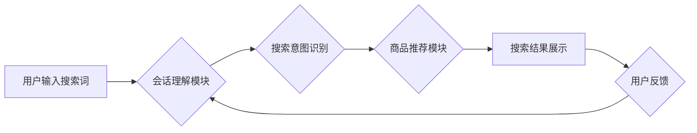

                 

## 电商搜索的搜索会话理解与满意度估计

> 关键词：电商搜索、会话理解、满意度估计、自然语言处理、推荐系统、用户体验

## 1. 背景介绍

电商平台作为现代商业的重要组成部分，其搜索引擎扮演着至关重要的角色。用户通过搜索引擎查找所需商品，而搜索引擎需要准确理解用户的搜索意图，并提供最相关的商品推荐。传统的电商搜索引擎主要依赖关键词匹配，但随着用户搜索行为的复杂化，单纯依靠关键词匹配已难以满足用户需求。

搜索会话理解是指对用户在搜索过程中进行的多轮交互行为进行理解，包括用户输入的搜索词、点击的商品、浏览的历史等信息。通过对会话的理解，搜索引擎可以更准确地把握用户的搜索意图，提供更个性化、更精准的商品推荐。

用户满意度是衡量电商搜索引擎性能的重要指标。用户满意度不仅取决于商品推荐的准确性，还包括搜索结果的展示形式、用户界面设计等方面。

## 2. 核心概念与联系

**2.1 核心概念**

* **会话理解:**  理解用户在搜索过程中进行的多轮交互行为，包括用户输入的搜索词、点击的商品、浏览的历史等信息。
* **搜索意图:** 用户通过搜索引擎想要获取的信息或完成的任务。
* **满意度估计:**  评估用户对搜索结果的满意程度，通常通过点击率、停留时间、转化率等指标进行衡量。

**2.2  架构图**



**2.3 核心联系**

电商搜索的会话理解与满意度估计相互关联，形成一个闭环。会话理解模块通过分析用户搜索行为，识别用户的搜索意图，并将其传递给商品推荐模块。商品推荐模块根据用户的搜索意图，推荐相关的商品。用户对搜索结果的满意程度会反馈给会话理解模块，帮助其不断优化用户体验。

## 3. 核心算法原理 & 具体操作步骤

**3.1 算法原理概述**

会话理解与满意度估计通常采用深度学习算法，例如循环神经网络（RNN）、长短期记忆网络（LSTM）和Transformer等。这些算法能够学习用户搜索行为的复杂模式，并对用户搜索意图进行准确识别。

**3.2 算法步骤详解**

1. **数据预处理:**  收集用户搜索数据，包括搜索词、点击记录、浏览历史等信息。对数据进行清洗、格式化和编码处理。
2. **特征提取:**  从用户搜索数据中提取特征，例如关键词、词性、语义关系等。可以使用词嵌入技术，将单词映射到低维向量空间，以便于算法学习。
3. **模型训练:**  使用深度学习算法训练模型，例如RNN、LSTM或Transformer。模型的输入是用户搜索会话的历史信息，输出是用户的搜索意图或满意度预测。
4. **模型评估:**  使用测试数据评估模型的性能，例如准确率、召回率和F1-score。根据评估结果，调整模型参数或选择更合适的算法。
5. **模型部署:**  将训练好的模型部署到电商平台的搜索引擎中，用于实时处理用户搜索请求。

**3.3 算法优缺点**

* **优点:** 深度学习算法能够学习用户搜索行为的复杂模式，并对用户搜索意图进行准确识别。
* **缺点:** 深度学习算法需要大量的训练数据，并且训练过程比较耗时。

**3.4 算法应用领域**

* **电商搜索:**  理解用户搜索意图，提供个性化商品推荐。
* **客服机器人:**  理解用户问题，提供准确的回复。
* **内容推荐:**  根据用户的兴趣爱好，推荐相关的文章、视频等内容。

## 4. 数学模型和公式 & 详细讲解 & 举例说明

**4.1 数学模型构建**

假设用户搜索会话包含N个交互行为，每个交互行为包含一个搜索词。我们可以将用户搜索会话表示为一个序列：

$$S = (w_1, w_2, ..., w_N)$$

其中，$w_i$表示第i个交互行为的搜索词。

**4.2 公式推导过程**

可以使用RNN或LSTM等循环神经网络模型来学习用户搜索会话的语义表示。模型的输出是一个隐藏状态向量，该向量可以表示用户的搜索意图。

$$h_t = f(W_xh_t-1 + W_xs_t + b)$$

其中，$h_t$表示第t个时间步的隐藏状态向量，$W_x$和$W_h$是权重矩阵，$s_t$是第t个时间步的输入向量，$b$是偏置项，$f$是激活函数。

**4.3 案例分析与讲解**

例如，用户搜索“苹果手机”，然后点击了“iPhone 13 Pro”，最后浏览了“iPhone 13 Pro 128GB”。我们可以将这个搜索会话表示为：

$$S = ("苹果手机", "iPhone 13 Pro", "iPhone 13 Pro 128GB")$$

通过RNN或LSTM模型，我们可以学习到这个搜索会话的语义表示，并推断出用户的搜索意图是购买iPhone 13 Pro 128GB。

## 5. 项目实践：代码实例和详细解释说明

**5.1 开发环境搭建**

* Python 3.6+
* TensorFlow/PyTorch
* NLTK/SpaCy

**5.2 源代码详细实现**

```python
import tensorflow as tf

# 定义RNN模型
model = tf.keras.Sequential([
    tf.keras.layers.Embedding(input_dim=vocab_size, output_dim=embedding_dim),
    tf.keras.layers.LSTM(units=128),
    tf.keras.layers.Dense(units=num_classes, activation='softmax')
])

# 编译模型
model.compile(optimizer='adam',
              loss='sparse_categorical_crossentropy',
              metrics=['accuracy'])

# 训练模型
model.fit(x_train, y_train, epochs=10)

# 评估模型
loss, accuracy = model.evaluate(x_test, y_test)
print('Loss:', loss)
print('Accuracy:', accuracy)
```

**5.3 代码解读与分析**

* 首先，我们定义了一个RNN模型，包含嵌入层、LSTM层和全连接层。
* 嵌入层将单词映射到低维向量空间。
* LSTM层能够学习用户搜索会话的语义表示。
* 全连接层将隐藏状态向量映射到搜索意图的类别。
* 然后，我们编译模型，并使用训练数据训练模型。
* 最后，我们评估模型的性能，并打印损失和准确率。

**5.4 运行结果展示**

训练完成后，我们可以使用模型预测新的用户搜索会话的搜索意图。

## 6. 实际应用场景

**6.1 电商搜索推荐**

电商平台可以利用会话理解技术，根据用户的搜索历史和浏览记录，推荐更相关的商品。例如，如果用户搜索了“运动鞋”，然后点击了“Nike Air Max”，那么电商平台可以推荐其他Nike品牌的运动鞋。

**6.2 个性化内容推荐**

社交媒体平台和新闻网站可以利用会话理解技术，根据用户的阅读历史和点赞记录，推荐更个性化的内容。例如，如果用户经常阅读科技新闻，那么平台可以推荐更多科技相关的文章。

**6.3 智能客服机器人**

智能客服机器人可以利用会话理解技术，理解用户的咨询问题，并提供准确的回复。例如，如果用户咨询“退货流程”，那么机器人可以提供相应的退货流程信息。

**6.4 未来应用展望**

随着人工智能技术的不断发展，会话理解和满意度估计将在更多领域得到应用，例如：

* **医疗保健:**  理解患者的症状和需求，提供更精准的医疗建议。
* **教育:**  理解学生的学习情况，提供个性化的学习方案。
* **金融:**  理解用户的金融需求，提供更合适的金融产品和服务。

## 7. 工具和资源推荐

**7.1 学习资源推荐**

* **书籍:**
    * 《深度学习》
    * 《自然语言处理》
* **在线课程:**
    * Coursera: 自然语言处理
    * Udacity: 深度学习

**7.2 开发工具推荐**

* **TensorFlow:**  开源深度学习框架
* **PyTorch:**  开源深度学习框架
* **NLTK:**  自然语言处理工具包
* **SpaCy:**  自然语言处理工具包

**7.3 相关论文推荐**

* **BERT: Pre-training of Deep Bidirectional Transformers for Language Understanding**
* **XLNet: Generalized Autoregressive Pretraining for Language Understanding**
* **Transformer: Attention Is All You Need**

## 8. 总结：未来发展趋势与挑战

**8.1 研究成果总结**

会话理解和满意度估计领域取得了显著进展，深度学习算法在理解用户搜索行为和预测用户满意度方面取得了优异的性能。

**8.2 未来发展趋势**

* **多模态会话理解:**  融合文本、图像、音频等多模态信息，更全面地理解用户意图。
* **跨语言会话理解:**  突破语言障碍，实现跨语言的会话理解。
* **个性化会话理解:**  根据用户的个人特征和偏好，提供更个性化的会话体验。

**8.3 面临的挑战**

* **数据稀缺性:**  高质量的会话数据往往比较稀缺，这限制了模型的训练效果。
* **模型复杂度:**  深度学习模型的复杂度较高，训练和部署成本较高。
* **解释性问题:**  深度学习模型的决策过程难以解释，这使得模型的可信度和可解释性受到挑战。

**8.4 研究展望**

未来，会话理解和满意度估计领域将继续朝着更智能、更个性化、更可解释的方向发展。


## 9. 附录：常见问题与解答

**9.1 如何处理用户输入的噪声数据？**

可以使用自然语言处理技术，例如词性标注、依存句法分析等，对用户输入的数据进行清洗和预处理，去除噪声数据。

**9.2 如何评估会话理解模型的性能？**

可以使用准确率、召回率、F1-score等指标来评估会话理解模型的性能。

**9.3 如何提高模型的解释性？**

可以使用注意力机制等技术，分析模型在处理用户输入数据时，哪些部分更重要，从而提高模型的解释性。


作者：禅与计算机程序设计艺术 / Zen and the Art of Computer Programming 
<end_of_turn>

