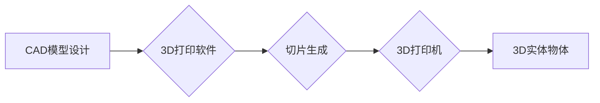

                 

## 知识产权与3D打印技术的挑战

> 关键词：3D打印、知识产权、版权、专利、设计权、逆向工程、数字版权管理、法律挑战、伦理挑战

## 1. 背景介绍

3D打印技术，也称为增材制造，近年来发展迅速，其能够将数字模型直接转化为实体物体的特性，使其在各个领域都展现出巨大的应用潜力。从医疗器械和航空航天部件到艺术品和消费品，3D打印技术正在改变着我们生产和消费的方式。然而，3D打印技术的普及也带来了新的挑战，其中知识产权问题尤为突出。

传统的知识产权保护机制主要针对物理实体，而3D打印技术使得数字模型可以被轻易复制和共享，这使得知识产权的保护变得更加复杂。 

## 2. 核心概念与联系

### 2.1 知识产权

知识产权是指个人或组织对创造性成果享有的排他性权利。常见的知识产权类型包括：

* **专利权:**  对发明创造的独占权利，允许专利持有人在一定期限内阻止他人制造、使用、销售其发明。
* **版权:** 对文学、艺术、音乐等作品的独占权利，允许版权持有人控制作品的复制、发行、表演等行为。
* **商标权:** 对商品或服务的标识享有的独占权利，允许商标持有人阻止他人使用与其相似的标识。
* **商业秘密:**  对商业上具有价值的非公开信息享有的保护，例如配方、客户名单等。

### 2.2 3D打印技术

3D打印技术是一种利用计算机辅助设计 (CAD) 模型，通过逐层堆积材料来制造三维实体物体的技术。 

**3D打印流程:**



### 2.3 知识产权与3D打印的冲突

3D打印技术使得数字模型可以被轻易复制和共享，这与传统的知识产权保护机制存在冲突。 

* **容易复制:** 3D打印模型可以被轻松地复制和分发，这使得知识产权的保护变得更加困难。
* **逆向工程:** 3D打印出的实体物体可以被逆向工程，从而获取其内部结构和设计信息，这可能侵犯专利权和商业秘密。
* **数字版权管理的挑战:**  传统的数字版权管理技术难以应用于3D打印领域，因为3D模型本身不是数字文件，而是可以被物理复制的实体。

## 3. 核心算法原理 & 具体操作步骤

### 3.1 算法原理概述

3D打印的核心算法原理是将三维模型转化为一系列二维切片，然后逐层堆积材料来制造实体物体。 

* **三维建模:**  首先需要使用CAD软件设计三维模型。
* **切片生成:**  将三维模型分割成一系列二维切片，每个切片代表一个打印层。
* **路径规划:**  为打印头规划打印路径，以确保材料被精确地堆积在正确的位置。
* **控制系统:**  控制打印头的运动和材料喷射，实现模型的逐层打印。

### 3.2 算法步骤详解

1. **模型导入:** 将三维模型导入到3D打印软件中。
2. **模型预处理:** 软件会对模型进行预处理，例如修复模型缺陷、简化模型结构等。
3. **切片生成:** 软件将模型分割成一系列二维切片，每个切片代表一个打印层。
4. **路径规划:** 软件会为打印头规划打印路径，以确保材料被精确地堆积在正确的位置。
5. **G代码生成:** 软件将打印路径和打印参数生成G代码，这是3D打印机可以理解的指令语言。
6. **打印执行:** 3D打印机读取G代码，控制打印头的运动和材料喷射，逐层打印模型。

### 3.3 算法优缺点

**优点:**

* **高精度:** 3D打印技术可以实现高精度的模型制造。
* **复杂形状:** 可以制造复杂形状的模型，难以通过传统制造方法实现。
* **个性化定制:** 可以根据用户的需求定制模型。

**缺点:**

* **速度慢:** 3D打印速度相对较慢，尤其对于大型模型。
* **材料限制:** 3D打印材料种类有限，且某些材料的性能不如传统材料。
* **成本高:** 3D打印设备和材料成本较高。

### 3.4 算法应用领域

* **医疗:**  制造医疗器械、假肢、组织模型等。
* **航空航天:**  制造航空航天部件、模型等。
* **汽车:**  制造汽车零部件、模型等。
* **教育:**  制造教学模型、实验装置等。
* **艺术:**  制造艺术品、雕塑等。

## 4. 数学模型和公式 & 详细讲解 & 举例说明

### 4.1 数学模型构建

3D打印算法的数学模型主要涉及以下几个方面：

* **三维空间坐标系:**  用于描述模型的几何形状。
* **切片生成算法:**  用于将三维模型分割成二维切片。常用的切片算法包括水平切片、倾斜切片等。
* **路径规划算法:**  用于规划打印头的运动路径，以确保材料被精确地堆积在正确的位置。常用的路径规划算法包括最短路径算法、A*算法等。

### 4.2 公式推导过程

* **切片生成算法:**  假设模型的厚度为$h$, 则每个切片的厚度为$h$. 

* **路径规划算法:**  假设打印头从起点$A$到终点$B$的距离为$d$, 则最短路径的长度为$d$.

### 4.3 案例分析与讲解

**案例:**  假设我们要打印一个简单的立方体模型，边长为10cm。

* **切片生成:**  我们可以将立方体模型分割成100个厚度为0.1cm的切片。
* **路径规划:**  我们可以使用最短路径算法规划打印头的运动路径，以确保材料被精确地堆积在每个切片上。

## 5. 项目实践：代码实例和详细解释说明

### 5.1 开发环境搭建

* **操作系统:**  Windows, macOS, Linux
* **编程语言:**  Python, C++, Java
* **3D打印软件:**  Cura, Simplify3D, PrusaSlicer
* **3D打印机:**  Creality Ender 3, Prusa i3 MK3S, Ultimaker S5

### 5.2 源代码详细实现

```python
# 这是一个简单的3D打印模型切片生成代码示例

import numpy as np

def generate_slices(model, slice_thickness):
  """
  将3D模型切成一系列二维切片

  Args:
    model: 三维模型数据
    slice_thickness: 切片厚度

  Returns:
    切片列表
  """
  slices = []
  for z in np.arange(0, model.height, slice_thickness):
    slice_data = model.get_slice_at_z(z)
    slices.append(slice_data)
  return slices

# ... 其他代码 ...
```

### 5.3 代码解读与分析

* **`generate_slices()` 函数:**  该函数接受3D模型数据和切片厚度作为输入，并返回一个切片列表。
* **`model.get_slice_at_z(z)`:**  该函数用于从模型中获取指定高度的二维切片数据。

### 5.4 运行结果展示

运行上述代码后，将生成一系列二维切片数据，这些数据可以被3D打印机用于制造模型。

## 6. 实际应用场景

### 6.1 医疗领域

* **定制化医疗器械:**  3D打印技术可以制造个性化的医疗器械，例如假肢、义肢、矫形器等，以满足患者的特定需求。
* **组织模型:**  3D打印可以制造人体组织模型，用于医学教育、手术模拟和药物研发。
* **生物打印:**  利用生物材料进行3D打印，可以制造人工器官和组织，为器官移植提供新的解决方案。

### 6.2 工业领域

* **快速原型制作:**  3D打印技术可以快速制作产品原型，用于产品设计和测试。
* **个性化定制:**  可以根据客户需求定制产品，例如手机壳、珠宝首饰等。
* **零部件制造:**  3D打印可以制造复杂形状的零部件，例如航空航天部件、汽车零部件等。

### 6.3 教育领域

* **教学模型:**  3D打印可以制造各种教学模型，例如人体模型、动物模型、植物模型等，用于教学和科研。
* **实验装置:**  可以制造各种实验装置，例如物理实验装置、化学实验装置等，用于教学和科研。
* **学生项目:**  学生可以利用3D打印技术进行创意设计和制作项目，培养他们的创新能力和动手能力。

### 6.4 未来应用展望

* **智能制造:**  3D打印技术将与人工智能、机器学习等技术结合，实现智能化制造。
* **可持续发展:**  3D打印可以减少材料浪费和运输成本，促进可持续发展。
* **个性化医疗:**  3D打印技术将推动个性化医疗的发展，为患者提供更加精准的医疗服务。

## 7. 工具和资源推荐

### 7.1 学习资源推荐

* **书籍:**  《3D打印技术入门》、《3D打印设计与制造》
* **在线课程:**  Coursera, edX, Udemy
* **网站:**  Thingiverse, MyMiniFactory, GrabCAD

### 7.2 开发工具推荐

* **3D建模软件:**  Blender, Fusion 360, Solidworks
* **3D打印软件:**  Cura, Simplify3D, PrusaSlicer
* **编程语言:**  Python, C++, Java

### 7.3 相关论文推荐

* **3D打印与知识产权保护:**  [https://www.researchgate.net/publication/333975934_3D_Printing_and_Intellectual_Property_Rights_Protection](https://www.researchgate.net/publication/333975934_3D_Printing_and_Intellectual_Property_Rights_Protection)
* **3D打印技术在医疗领域的应用:**  [https://www.ncbi.nlm.nih.gov/pmc/articles/PMC6394798/](https://www.ncbi.nlm.nih.gov/pmc/articles/PMC6394798/)

## 8. 总结：未来发展趋势与挑战

### 8.1 研究成果总结

3D打印技术已经取得了长足的进步，在各个领域都展现出巨大的应用潜力。 

* **技术发展:**  3D打印技术不断发展，材料种类、打印精度、打印速度等方面都在不断提升。
* **应用领域拓展:**  3D打印技术应用领域不断拓展，从医疗、工业到教育、艺术等各个领域都看到了3D打印的应用。

### 8.2 未来发展趋势

* **智能化制造:**  3D打印技术将与人工智能、机器学习等技术结合，实现智能化制造。
* **可持续发展:**  3D打印可以减少材料浪费和运输成本，促进可持续发展。
* **个性化定制:**  3D打印技术将推动个性化定制的发展，为消费者提供更加个性化的产品和服务。

### 8.3 面临的挑战

* **知识产权保护:**  3D打印技术的普及也带来了新的知识产权挑战，如何有效保护知识产权成为一个重要问题。
* **材料限制:**  3D打印材料种类有限，且某些材料的性能不如传统材料。
* **成本高:**  3D打印设备和材料成本较高，限制了其在一些领域的应用。

### 8.4 研究展望

* **开发新型3D打印材料:**  开发性能更优、更环保的3D打印材料。
* **提高3D打印精度和速度:**  不断提高3D打印的精度和速度，使其更适用于工业生产。
* **完善知识产权保护机制:**  制定完善的知识产权保护机制，应对3D打印带来的挑战。


## 9. 附录：常见问题与解答

**Q1: 3D打印可以打印任何东西吗？**

**A1:**  目前3D打印技术还不能打印任何东西。 3D打印的材料种类有限，且有些材料的性能不如传统材料。

**Q2: 3D打印的成本高吗？**

**A2:**  3D打印的成本取决于打印机类型、材料类型和打印复杂度等因素。 

**Q3: 3D打印技术对知识产权有什么影响？**

**A3:**  3D打印技术使得数字模型可以被轻易复制和共享，这可能侵犯知识产权。 


作者：禅与计算机程序设计艺术 / Zen and the Art of Computer Programming 
<end_of_turn>

