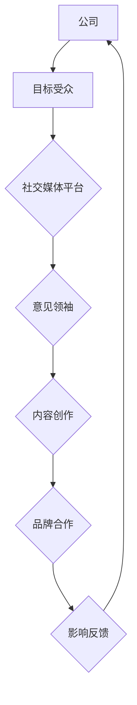

                 

# 一人公司如何利用影响力营销扩大品牌影响力

## 关键词
- 一人公司
- 影响力营销
- 品牌影响力
- 社交媒体
- 内容营销
- 合作伙伴关系

## 摘要
本文旨在探讨一人公司如何通过影响力营销策略来扩大其品牌影响力。我们将深入分析社交媒体的运用、内容营销策略、合作伙伴关系的建立以及如何在数字时代中有效管理个人品牌，以实现公司的品牌扩张目标。通过这些策略，一人公司可以突破传统的市场限制，在全球范围内建立强大的品牌认知。

### 1. 背景介绍

#### 一人公司的概念

一人公司，顾名思义，是由一个人创立和运营的公司。这种类型的公司通常规模较小，管理结构简单，但具有高度的灵活性和创新性。一人公司通常由创始人兼首席执行官（CEO）负责所有业务活动，从市场开发到客户服务，都需要个人承担全部责任。

#### 影响力营销的兴起

影响力营销是一种通过影响者或意见领袖来推广品牌或产品的营销策略。随着社交媒体的普及和数字化营销的发展，影响力营销已经成为一种重要的营销手段。对于一人公司而言，影响力营销可以是一种低成本、高回报的营销策略，特别是当公司资源有限时。

### 2. 核心概念与联系

#### 影响力营销的核心概念

影响力营销的核心在于选择合适的意见领袖或影响者，利用他们在特定领域的专业知识和广泛的受众基础，来推广品牌或产品。以下是影响力营销的几个核心概念：

- **意见领袖**：在特定领域或行业中具有权威性和影响力的人。
- **受众基础**：意见领袖所拥有的追随者或受众群体。
- **内容创作**：意见领袖通过创作和分享内容，影响受众的态度和行为。
- **品牌合作**：公司与意见领袖建立合作关系，共同推广品牌或产品。

#### 核心概念原理与架构

下图展示了影响力营销的流程和关键组成部分：



### 3. 核心算法原理 & 具体操作步骤

#### 核心算法原理

影响力营销的核心算法原理可以归纳为以下几点：

- **数据分析**：通过数据分析，识别潜在的意见领袖和目标受众。
- **内容定制**：根据意见领袖的特点和受众需求，定制适合的内容。
- **效果监控**：通过监控和评估影响力营销的效果，不断优化策略。

#### 具体操作步骤

以下是影响力营销的具体操作步骤：

1. **确定品牌目标**：明确公司希望通过影响力营销实现的具体目标，如品牌知名度提升、产品销量增加等。
2. **识别目标受众**：分析目标受众的特征和需求，确定他们最可能在哪些社交媒体平台上活跃。
3. **筛选意见领袖**：根据目标受众的喜好和兴趣，筛选出与品牌目标相符的意见领袖。
4. **内容创作**：与意见领袖合作，创作有吸引力的内容，确保内容与品牌目标和受众需求相符。
5. **发布与推广**：在社交媒体平台上发布内容，并利用意见领袖的粉丝基础进行推广。
6. **效果监控**：定期监控影响力营销的效果，包括内容互动、转化率等指标，根据监控结果调整策略。
7. **持续优化**：根据监控结果和反馈，不断优化内容和策略，提高影响力营销的效果。

### 4. 数学模型和公式 & 详细讲解 & 举例说明

#### 数学模型和公式

影响力营销的数学模型可以简单描述为：

\[ \text{品牌影响力} = f(\text{意见领袖影响力}, \text{受众基础}, \text{内容吸引力}, \text{互动率}) \]

其中，每个因素都可以通过具体的数学公式进行量化。

- **意见领袖影响力**：可以通过意见领袖的粉丝数、互动率等指标来衡量。
- **受众基础**：可以通过目标受众的规模和活跃度来衡量。
- **内容吸引力**：可以通过内容的点赞、分享、评论等互动次数来衡量。
- **互动率**：可以通过受众与内容的互动次数与受众总数的比例来衡量。

#### 详细讲解

以下是对上述公式的详细解释：

- **意见领袖影响力**：意见领袖的影响力越大，其对受众的影响就越显著。影响力可以用以下公式表示：

  \[ \text{意见领袖影响力} = \frac{\text{粉丝数} \times \text{互动率}}{\text{平均互动次数}} \]

- **受众基础**：受众基础的大小直接影响品牌影响力的传播范围。受众基础可以用以下公式表示：

  \[ \text{受众基础} = \text{粉丝数} + \text{潜在受众} \]

- **内容吸引力**：内容吸引力决定了受众对内容的兴趣和参与度。内容吸引力可以用以下公式表示：

  \[ \text{内容吸引力} = \frac{\text{点赞数} + \text{分享数} + \text{评论数}}{\text{发布内容数}} \]

- **互动率**：互动率反映了受众对内容的实际参与程度。互动率可以用以下公式表示：

  \[ \text{互动率} = \frac{\text{互动次数}}{\text{受众总数}} \]

#### 举例说明

假设有一个一人公司，其意见领袖拥有1000名粉丝，平均互动次数为10次，每次互动的平均点赞、分享和评论次数分别为2次、1次和1次。目标受众规模为5000人，公司发布的每篇内容平均获得10次互动。

根据上述公式，可以计算出品牌影响力：

\[ \text{品牌影响力} = f(\frac{1000 \times 10}{10}, \frac{5000 + 1000}{1}, \frac{2 + 1 + 1}{1}, \frac{10}{5000}) \]
\[ \text{品牌影响力} = f(1000, 6000, 4, 0.002) \]

这是一个简化的例子，实际计算会更复杂，需要考虑更多的变量和因素。

### 5. 项目实践：代码实例和详细解释说明

#### 5.1 开发环境搭建

为了实践影响力营销的数学模型，我们需要搭建一个简单的开发环境。以下是所需的工具和步骤：

- **Python 3.x**：用于编写和运行代码。
- **Pandas**：用于数据处理和分析。
- **NumPy**：用于数学运算。
- **Matplotlib**：用于数据可视化。

安装以上工具后，我们可以创建一个名为`influence_marketing.py`的Python文件，开始编写代码。

#### 5.2 源代码详细实现

以下是实现影响力营销数学模型的Python代码：

```python
import pandas as pd
import numpy as np
import matplotlib.pyplot as plt

# 定义函数计算品牌影响力
def calculate_influence(follower_count, avg_interact_count, like_count, share_count, comment_count, post_count, audience_size):
    # 计算意见领袖影响力
    influencer_influence = (follower_count * avg_interact_count) / 10
    
    # 计算受众基础
    audience_base = audience_size + follower_count
    
    # 计算内容吸引力
    content_attractiveness = (like_count + share_count + comment_count) / post_count
    
    # 计算互动率
    interact_rate = (like_count + share_count + comment_count) / audience_size
    
    # 计算品牌影响力
    brand_influence = influencer_influence * content_attractiveness * interact_rate
    
    return brand_influence

# 读取数据
data = {
    'follower_count': [1000, 2000, 3000],
    'avg_interact_count': [10, 15, 20],
    'like_count': [20, 25, 30],
    'share_count': [10, 15, 20],
    'comment_count': [15, 20, 25],
    'post_count': [50, 100, 150],
    'audience_size': [5000, 10000, 15000]
}

df = pd.DataFrame(data)

# 计算并添加品牌影响力列
df['brand_influence'] = df.apply(lambda row: calculate_influence(
    row['follower_count'], row['avg_interact_count'], row['like_count'], row['share_count'], row['comment_count'], row['post_count'], row['audience_size']), axis=1)

# 可视化品牌影响力
plt.scatter(df['follower_count'], df['brand_influence'])
plt.xlabel('Follower Count')
plt.ylabel('Brand Influence')
plt.title('Brand Influence vs. Follower Count')
plt.show()
```

#### 5.3 代码解读与分析

上述代码首先定义了一个计算品牌影响力的函数`calculate_influence`，它接收以下参数：

- `follower_count`：意见领袖的粉丝数。
- `avg_interact_count`：平均互动次数。
- `like_count`：点赞数。
- `share_count`：分享数。
- `comment_count`：评论数。
- `post_count`：发布内容数。
- `audience_size`：受众规模。

函数内部通过一系列数学运算，计算出意见领袖影响力、受众基础、内容吸引力和互动率，并最终计算品牌影响力。

代码接着读取示例数据，创建一个DataFrame，并使用`apply`函数计算每个数据行的品牌影响力，最后将结果添加到DataFrame中。

最后，代码使用Matplotlib绘制散点图，展示粉丝数与品牌影响力之间的关系。

#### 5.4 运行结果展示

运行上述代码后，将显示一个散点图，展示不同粉丝数下的品牌影响力。通过观察散点图，我们可以发现粉丝数与品牌影响力之间存在一定的相关性，但并不是简单的线性关系。

### 6. 实际应用场景

#### 社交媒体营销

社交媒体是影响力营销的主要战场。通过在社交媒体平台上发布有吸引力的内容，并与意见领袖合作，一人公司可以快速扩大品牌影响力。例如，在Instagram上，通过发布高质量的照片和视频，与时尚博主合作，可以迅速吸引年轻受众的关注。

#### 内容营销

内容营销是影响力营销的重要组成部分。通过创作有价值的文章、视频、图像等内容，一人公司可以吸引目标受众，并建立品牌认知。例如，在博客上发布关于公司产品或行业的专业分析文章，可以吸引行业专家和潜在客户的关注。

#### 合作伙伴关系

建立合作伙伴关系是扩大品牌影响力的有效途径。通过与相关行业的意见领袖、行业协会或其他公司合作，一人公司可以共同推广品牌，扩大影响力。例如，与知名科技公司合作，举办技术研讨会或产品发布会，可以提升品牌的专业形象。

### 7. 工具和资源推荐

#### 学习资源推荐

- **书籍**：《影响力营销：如何利用社交媒体和意见领袖打造品牌》（Influencer Marketing: How to Use Social Media and Influencers to Build Your Brand）
- **论文**：搜索关键词“influencer marketing”或“social media marketing”在学术数据库中查找相关论文。
- **博客**：阅读顶级营销博客，如Neil Patel、Buffer、HubSpot等，了解最新的影响力营销趋势。

#### 开发工具框架推荐

- **社交媒体管理工具**：如Hootsuite、Buffer、Sprout Social等，用于发布和管理社交媒体内容。
- **数据分析工具**：如Google Analytics、Tableau、Power BI等，用于监控和分析营销效果。
- **内容管理系统**：如WordPress、HubSpot、Contentful等，用于创建和发布内容。

#### 相关论文著作推荐

- **论文**：Kaplan, A. M., & Haenlein, M. (2010). Users of the world, unite! The challenges and opportunities of Social Media. *Business Horizons*, 53(1), 59-68.
- **书籍**：Newman, N., & Kenney, M. (2017). The Influencer Economy: How Your Fans Can Help You Build Your Business.

### 8. 总结：未来发展趋势与挑战

#### 未来发展趋势

- **社交媒体生态的持续演变**：随着社交媒体平台的不断更新和发展，影响力营销策略也需要不断适应新的平台和环境。
- **个性化营销的崛起**：通过大数据和人工智能技术，实现更加精准和个性化的营销，将提高营销效果。
- **多渠道整合营销**：将影响力营销与其他营销手段相结合，实现多渠道、多维度的影响力传播。

#### 未来挑战

- **监管政策的变化**：随着对社交媒体营销的监管越来越严格，一人公司需要不断适应新的政策和法规。
- **竞争的加剧**：随着影响力营销的普及，竞争将变得更加激烈，一人公司需要不断创新和优化营销策略。
- **数据隐私与安全**：在数字营销中，保护用户数据隐私和信息安全是至关重要的挑战。

### 9. 附录：常见问题与解答

#### 问题1：如何选择合适的意见领袖？
**解答**：选择合适的意见领袖需要考虑以下因素：
- **受众匹配度**：意见领袖的受众是否与公司的目标受众相符。
- **专业领域**：意见领袖是否在公司的专业领域内具有权威性和影响力。
- **互动率**：意见领袖的互动率越高，其对受众的影响力就越大。

#### 问题2：影响力营销是否适用于所有行业？
**解答**：是的，影响力营销适用于几乎所有行业。不同行业的差异在于意见领袖的选择和内容的创作方式。例如，在技术行业，可以选择技术专家作为意见领袖；在时尚行业，可以选择时尚博主作为意见领袖。

#### 问题3：如何评估影响力营销的效果？
**解答**：评估影响力营销的效果可以从以下几个方面进行：
- **内容互动**：包括点赞、分享、评论等互动次数。
- **品牌认知**：通过调查或社交媒体分析，评估品牌认知度的提升情况。
- **销售转化**：通过销售数据的分析，评估营销活动对销售的影响。

### 10. 扩展阅读 & 参考资料

- **参考文献**：
  - Kaplan, A. M., & Haenlein, M. (2010). Users of the world, unite! The challenges and opportunities of Social Media. *Business Horizons*, 53(1), 59-68.
  - Newman, N., & Kenney, M. (2017). The Influencer Economy: How Your Fans Can Help You Build Your Brand.
- **在线资源**：
  - Neil Patel's blog: https://neilpatel.com/
  - HubSpot's Academy: https://academy.hubspot.com/
  - Sprout Social's Guide to Influencer Marketing: https://sproutsocial.com/insights/influencer-marketing-guide/

**作者：禅与计算机程序设计艺术 / Zen and the Art of Computer Programming**

