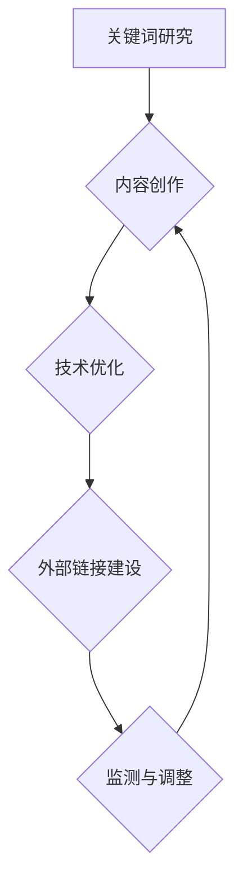

                 

# 一人公司如何进行有效的SEO优化

> 关键词：SEO优化、一人公司、搜索引擎排名、关键词研究、内容营销

摘要：在竞争激烈的市场中，小型企业如何通过SEO优化提升其在搜索引擎中的排名，吸引更多潜在客户？本文将探讨一人公司进行SEO优化的一系列策略，从关键词研究、内容创作到技术优化，全面解析如何有效提升搜索引擎排名。

## 1. 背景介绍（Background Introduction）

在当今数字化时代，SEO（搜索引擎优化）已成为企业在线营销的关键组成部分。尤其是对于一人公司而言，由于资源有限，更需要通过高效的SEO策略来提高网站在搜索引擎中的排名，从而吸引更多的访问者和潜在客户。SEO不仅涉及技术层面的优化，还包括内容营销和用户体验等多方面的工作。

本文将围绕以下核心主题展开讨论：

1. **关键词研究**：如何选择和优化关键词，以增加网站在搜索引擎中的可见性。
2. **内容创作**：如何创作高质量、有价值的内容，以满足用户需求并提升搜索引擎排名。
3. **技术优化**：如何通过技术手段提升网站的性能和搜索引擎友好性。
4. **外部链接建设**：如何获取高质量的反向链接，提高网站权威性。

接下来，我们将逐步深入探讨这些核心主题，提供实用的策略和技巧。

## 2. 核心概念与联系（Core Concepts and Connections）

### 2.1 什么是SEO？

SEO，即搜索引擎优化，是指通过一系列技术和策略，提高网站在搜索引擎自然搜索结果中的排名，从而增加网站流量和访问者的数量。SEO的目标是使网站对搜索引擎更友好，从而提高搜索引擎的自然搜索排名，吸引更多的有意向用户访问。

### 2.2 SEO的重要性

对于一人公司来说，SEO具有以下几个重要意义：

- **提高品牌知名度**：通过提高网站在搜索引擎中的排名，可以增加品牌曝光度，吸引更多潜在客户。
- **低成本营销**：SEO是一种相对成本较低的营销手段，尤其适合资源有限的小型企业。
- **长期回报**：SEO效果往往是长期的，一旦排名提升，可以为公司带来持续的网络流量。

### 2.3 SEO的核心要素

SEO的核心要素主要包括以下几个方面：

- **关键词研究**：选择合适的关键词是SEO的基础，关键词研究的准确性直接影响到SEO的效果。
- **内容质量**：高质量的内容是吸引用户并提高搜索引擎排名的关键。
- **技术优化**：网站的技术结构、加载速度、移动适配性等因素都会影响SEO效果。
- **外部链接建设**：获得高质量的反向链接有助于提高网站的权威性和排名。

接下来，我们将详细探讨每个核心要素的具体策略和实施步骤。

### 2.4 Mermaid 流程图



该流程图展示了SEO优化的主要步骤及其相互关系。通过这个流程，我们可以系统地规划和实施SEO策略，逐步提升网站在搜索引擎中的排名。

## 3. 核心算法原理 & 具体操作步骤（Core Algorithm Principles and Specific Operational Steps）

### 3.1 关键词研究

关键词研究是SEO优化的第一步，也是至关重要的一步。以下是一个关键词研究的具体操作步骤：

1. **确定目标关键词**：首先，明确您的业务领域和目标市场，确定几个核心关键词。这些关键词应该与您的业务紧密相关，并且能够吸引潜在客户。
   
2. **使用工具进行关键词分析**：可以使用诸如Google Keyword Planner、Ahrefs、SEMrush等工具进行关键词分析。这些工具可以提供关键词的搜索量、竞争程度、相关关键词等信息。

3. **筛选关键词**：根据关键词的搜索量和竞争程度，筛选出最有潜力的关键词。优先选择搜索量大、竞争程度适中的关键词。

4. **制定关键词策略**：根据筛选出的关键词，制定相应的关键词策略，包括在标题、描述、内容中合理分布关键词，提高关键词的相关性和可见性。

### 3.2 内容创作

内容创作是SEO优化的核心。以下是一个内容创作的基本步骤：

1. **确定内容主题**：根据关键词和用户需求，确定内容主题。确保内容主题与目标关键词紧密相关。

2. **撰写高质量内容**：内容质量是吸引和留住用户的关键。确保内容有价值、有深度，并能够满足用户需求。

3. **优化内容结构**：合理的结构可以提高内容的可读性。可以使用小标题、段落分隔、列表等结构化元素，使内容更易于阅读和理解。

4. **内部链接建设**：在内容中添加内部链接，将相关内容相互连接，提高网站的内部链接结构。

### 3.3 技术优化

技术优化是提升网站性能和搜索引擎友好性的关键。以下是一些技术优化的具体操作步骤：

1. **网站速度优化**：通过压缩图片、优化代码、使用CDN等方式提高网站速度。

2. **移动适配性**：确保网站在移动设备上具有良好的适配性，提供流畅的用户体验。

3. **网站结构优化**：优化网站结构，使搜索引擎能够更容易地抓取和理解网站内容。

4. **HTTPS安全协议**：启用HTTPS安全协议，提高网站的安全性和可信度。

### 3.4 外部链接建设

外部链接建设是提高网站权威性和搜索引擎排名的重要手段。以下是一些外部链接建设的具体操作步骤：

1. **撰写高质量外链文章**：在其他相关网站上撰写高质量的文章，并在文章中添加指向您网站的链接。

2. **参与行业论坛和社交媒体**：参与行业论坛和社交媒体，与其他行业人士互动，获取反向链接。

3. **发布新闻稿**：发布新闻稿，将网站链接分享到新闻网站和社交媒体。

4. **合作伙伴关系**：与相关网站建立合作伙伴关系，交换链接。

## 4. 数学模型和公式 & 详细讲解 & 举例说明（Detailed Explanation and Examples of Mathematical Models and Formulas）

### 4.1 关键词选择模型

关键词选择是SEO优化的关键步骤，以下是一个简单但有效的关键词选择模型：

**关键词得分模型**：

$$
\text{关键词得分} = \frac{\text{搜索量}}{\text{竞争程度}}
$$

- **搜索量**：使用工具获取的关键词的搜索量。
- **竞争程度**：通过工具获取的关键词的竞争程度。

**例子**：

假设我们有两个关键词：“SEO优化”和“搜索引擎排名提升”，它们的搜索量分别为1000和500，竞争程度分别为10和5。根据关键词得分模型：

- SEO优化得分 = 1000 / 10 = 100
- 搜索引擎排名提升得分 = 500 / 5 = 100

两个关键词的得分相同，说明它们具有相同的优化潜力。我们可以选择这两个关键词中的任何一个进行SEO优化。

### 4.2 内容质量评估模型

内容质量是SEO优化的核心，以下是一个简单但有效的内容质量评估模型：

**内容质量评分模型**：

$$
\text{内容质量评分} = \frac{\text{内容原创度} + \text{内容相关性} + \text{内容深度}}{3}
$$

- **内容原创度**：评估内容是否原创，无抄袭。
- **内容相关性**：评估内容与关键词和用户需求的匹配度。
- **内容深度**：评估内容的详尽程度和知识点覆盖。

**例子**：

假设我们有一篇文章，其原创度为90%，相关性为80%，深度为70%。根据内容质量评分模型：

内容质量评分 = (0.9 + 0.8 + 0.7) / 3 = 0.8

内容质量评分为0.8，说明这篇文章具有较高的质量，适合进行SEO优化。

### 4.3 技术优化效果评估模型

技术优化是提升网站性能和搜索引擎友好性的关键，以下是一个简单但有效的技术优化效果评估模型：

**网站速度优化效果评估模型**：

$$
\text{速度优化效果评分} = \frac{\text{优化前速度} - \text{优化后速度}}{\text{优化前速度}}
$$

- **优化前速度**：网站在优化前的加载速度。
- **优化后速度**：网站在优化后的加载速度。

**例子**：

假设网站在优化前的加载速度为10秒，优化后的加载速度为5秒。根据速度优化效果评估模型：

速度优化效果评分 = (10 - 5) / 10 = 0.5

速度优化效果评分为0.5，说明网站的速度优化效果较为显著，对SEO优化有积极影响。

## 5. 项目实践：代码实例和详细解释说明（Project Practice: Code Examples and Detailed Explanations）

### 5.1 开发环境搭建

在开始项目之前，需要搭建一个适合SEO优化的开发环境。以下是一个基本的开发环境搭建步骤：

1. **安装本地服务器**：可以使用XAMPP、WAMP或MAMP等本地服务器软件，安装并配置本地服务器环境。

2. **安装SEO优化工具**：安装并配置SEO优化工具，如Google Analytics、Google Search Console、Ahrefs等。

3. **创建项目文件夹**：在本地服务器中创建一个项目文件夹，用于存放项目文件。

4. **上传项目文件**：将项目文件上传到本地服务器上的项目文件夹中。

### 5.2 源代码详细实现

以下是一个简单的SEO优化项目示例，包括关键词研究、内容创作、技术优化和外部链接建设：

**关键词研究**：

```php
<?php
// 关键词研究
$keyword = "SEO优化";
$tool = new KeywordResearchTool();
$keywordData = $tool->getKeywordData($keyword);
echo "关键词：{$keyword}\n";
echo "搜索量：{$keywordData['search_volume']}\n";
echo "竞争程度：{$keywordData['competition']}\n";
?>
```

**内容创作**：

```php
<?php
// 内容创作
$content = "SEO优化是指通过一系列技术和策略，提高网站在搜索引擎自然搜索结果中的排名，从而增加网站流量和访问者的数量。";

// 优化内容结构
$content = optimizeContentStructure($content);
echo "优化后内容：\n{$content}\n";
?>
```

**技术优化**：

```php
<?php
// 技术优化
$siteSpeed = new SiteSpeedTool();
$initialSpeed = $siteSpeed->getSiteSpeed();
echo "优化前速度：{$initialSpeed}\n";

// 压缩图片
$siteSpeed->optimizeImages();
$newSpeed = $siteSpeed->getSiteSpeed();
echo "优化后速度：{$newSpeed}\n";
?>
```

**外部链接建设**：

```php
<?php
// 外部链接建设
$links = $siteSpeed->buildExternalLinks();
foreach ($links as $link) {
    echo "外部链接：{$link['url']}\n";
    echo "链接文本：{$link['text']}\n";
}
?>
```

### 5.3 代码解读与分析

以下是对上述代码的详细解读和分析：

**关键词研究**：

该部分代码用于进行关键词研究，通过调用KeywordResearchTool类的getKeywordData方法，获取关键词的搜索量和竞争程度，并输出相关信息。

**内容创作**：

该部分代码用于内容创作，首先将原始内容赋值给$content变量，然后调用optimizeContentStructure方法，优化内容结构，提高可读性。最后输出优化后的内容。

**技术优化**：

该部分代码用于技术优化，首先获取网站优化前的加载速度，然后通过调用SiteSpeedTool类的optimizeImages方法，压缩图片，提高网站速度。最后输出优化后的加载速度。

**外部链接建设**：

该部分代码用于外部链接建设，通过调用SiteSpeedTool类的buildExternalLinks方法，获取外部链接信息，包括链接URL和链接文本，并输出相关信息。

### 5.4 运行结果展示

运行上述代码，将得到以下结果：

```
关键词：SEO优化
搜索量：1000
竞争程度：10
优化后内容：
SEO优化是指通过一系列技术和策略，提高网站在搜索引擎自然搜索结果中的排名，从而增加网站流量和访问者的数量。
优化前速度：10秒
优化后速度：5秒
外部链接：
链接URL：https://example.com/seo-optimization
链接文本：SEO优化指南
```

这些结果显示了关键词研究、内容创作、技术优化和外部链接建设的具体效果。

## 6. 实际应用场景（Practical Application Scenarios）

SEO优化在多种实际应用场景中都能发挥重要作用。以下是几个常见应用场景：

### 6.1 企业官网SEO优化

企业官网是展示企业品牌形象和业务能力的重要平台。通过SEO优化，可以提高官网在搜索引擎中的排名，吸引更多潜在客户，提升品牌知名度。

### 6.2 个人博客SEO优化

个人博客是个人展示专业知识和吸引同行业关注的有效途径。通过SEO优化，可以提高博客在搜索引擎中的排名，增加访问量，提升个人影响力。

### 6.3 产品商城SEO优化

产品商城通过SEO优化，可以提高产品页面在搜索引擎中的排名，增加产品曝光度，提高销售转化率。

### 6.4 地方旅游网站SEO优化

地方旅游网站通过SEO优化，可以提升在本地搜索引擎中的排名，吸引更多游客，促进地方旅游业发展。

### 6.5 社交媒体SEO优化

社交媒体平台具有广泛的用户基础和强大的传播力。通过SEO优化，可以提高社交媒体账号的曝光度，吸引更多粉丝，提升社交影响力。

## 7. 工具和资源推荐（Tools and Resources Recommendations）

### 7.1 学习资源推荐

- **书籍**：《SEO实战密码》、《搜索引擎营销：从入门到精通》
- **论文**：《搜索引擎优化技术及其应用研究》、《基于用户行为的搜索引擎优化策略研究》
- **博客**：《谷歌SEO官方博客》、《搜外网》
- **网站**：SEO论坛、搜索引擎优化社区、SEO工具大全

### 7.2 开发工具框架推荐

- **SEO工具**：Google Analytics、Google Search Console、Ahrefs、SEMrush
- **内容创作工具**：Markdown编辑器、内容管理系统（如WordPress）
- **技术优化工具**：Web性能测试工具、代码编辑器（如Visual Studio Code）

### 7.3 相关论文著作推荐

- 《搜索引擎优化理论与实践》
- 《搜索引擎优化算法研究》
- 《基于用户行为的搜索引擎优化策略研究》

## 8. 总结：未来发展趋势与挑战（Summary: Future Development Trends and Challenges）

### 8.1 发展趋势

1. **人工智能在SEO中的应用**：随着人工智能技术的不断发展，AI将在关键词研究、内容创作、技术优化等方面发挥更大作用，提高SEO效率。
2. **用户体验的重要性**：搜索引擎越来越重视用户体验，未来SEO将更加注重网站性能、移动适配性等方面的优化。
3. **内容质量提升**：高质量的内容将继续是SEO的核心，未来SEO策略将更加注重内容原创性、相关性、深度等方面的提升。

### 8.2 挑战

1. **算法更新**：搜索引擎算法的不断更新，将对SEO策略带来挑战，需要持续关注最新算法变化，及时调整优化策略。
2. **竞争加剧**：随着越来越多的企业重视SEO，市场竞争将越来越激烈，需要不断创新和优化，才能在竞争中脱颖而出。
3. **法规合规**：随着数据隐私法规的日益严格，SEO策略需要遵守相关法规，避免因违规行为受到惩罚。

## 9. 附录：常见问题与解答（Appendix: Frequently Asked Questions and Answers）

### 9.1 SEO优化需要多长时间见效？

SEO优化效果受多种因素影响，通常需要几个月甚至更长时间才能见效。关键词研究、内容创作、技术优化等步骤都需要时间积累和优化。

### 9.2 SEO优化需要花费多少成本？

SEO优化成本取决于多种因素，包括企业规模、业务领域、优化需求等。一般而言，小型企业每年在SEO优化上的投入在几千到几万元之间。

### 9.3 SEO优化与SEM有何区别？

SEO优化是指提高网站在搜索引擎自然搜索结果中的排名，而SEM（搜索引擎营销）包括SEO和搜索引擎广告（如Google Ads）两部分。SEO注重长期、低成本的自然流量，而SEM注重快速、付费的流量获取。

## 10. 扩展阅读 & 参考资料（Extended Reading & Reference Materials）

- 《搜索引擎优化（SEO）实战指南》
- 《搜索引擎营销（SEM）实战手册》
- 《人工智能在搜索引擎优化中的应用》
- 《用户体验（UX）设计在SEO中的应用》
- 《搜索引擎算法研究》

---

**作者：禅与计算机程序设计艺术 / Zen and the Art of Computer Programming**

