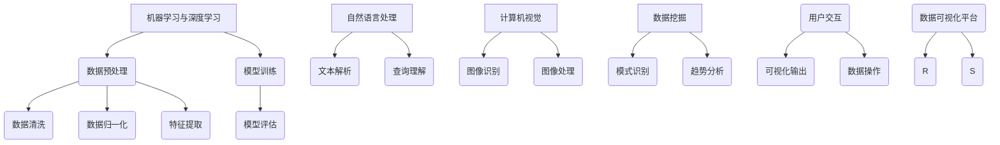

                 

### 背景介绍（Background Introduction）

在当今信息化社会中，数据已成为企业最为宝贵的资产之一。通过对海量数据的挖掘和分析，企业可以获取深度的业务洞察，从而指导决策、优化运营和提升竞争力。然而，随着数据量的指数级增长，传统的数据可视化工具已经难以满足企业对于实时性、精准性和互动性的需求。此时，人工智能（AI）驱动的数据可视化技术应运而生，成为企业数据管理和分析的重要工具。

一人公司的AI驱动数据可视化平台正是基于这一背景开发出来的。作为一家专注于人工智能领域的初创企业，一人公司致力于利用AI技术帮助企业实现数据驱动的业务增长。该平台通过融合机器学习、自然语言处理和计算机视觉等技术，提供了一种智能化、个性化、实时化的数据可视化解决方案。用户不仅可以轻松地将复杂的数据集转化为直观的图表和可视化界面，还可以通过自然语言与系统进行交互，实现数据分析和决策的自动化。

本文将深入探讨一人公司的AI驱动数据可视化平台，从核心概念、算法原理、数学模型到具体项目实践，全面解析该平台的运作机制和实际应用价值。我们还将分析平台在不同场景下的应用案例，推荐相关工具和资源，并对未来的发展趋势和挑战进行展望。希望通过这篇文章，读者能够对AI驱动数据可视化技术有一个全面的了解，并在实际业务中加以应用。

### 核心概念与联系（Core Concepts and Connections）

#### 什么是AI驱动数据可视化？

AI驱动数据可视化是指利用人工智能技术，如机器学习、深度学习、自然语言处理和计算机视觉等，对数据进行分析和处理，并将其转换为易于理解和交互的可视化图表和界面。这种技术不仅提高了数据可视化的效率和准确性，还赋予了用户更多的自主性和灵活性。

#### 核心概念原理

1. **机器学习与深度学习**：这些技术通过训练模型来发现数据中的模式和关联性。例如，卷积神经网络（CNN）在图像识别任务中表现出色，而循环神经网络（RNN）在序列数据中具有优势。

2. **自然语言处理（NLP）**：NLP使计算机能够理解和生成自然语言。在数据可视化中，NLP可以用来解析用户输入的自然语言查询，并生成相应的可视化结果。

3. **计算机视觉**：计算机视觉技术用于分析和理解图像和视频。在数据可视化中，计算机视觉可以帮助识别图像中的元素，并提取相关的信息进行展示。

4. **数据挖掘**：数据挖掘技术用于从大量数据中提取有价值的信息和知识。在数据可视化中，数据挖掘可以帮助发现数据中的隐藏模式和趋势。

#### 核心概念原理架构的Mermaid流程图



#### Mermaid流程节点详细说明

1. **数据预处理**：包括数据清洗、归一化和特征提取，为机器学习和深度学习模型准备数据。
2. **模型训练**：使用预处理后的数据进行模型的训练，使模型能够学会从数据中提取模式和关联性。
3. **模型评估**：通过测试数据评估模型的性能，确保模型能够准确预测和生成结果。
4. **数据清洗**：去除数据中的噪声和异常值，提高数据质量。
5. **数据归一化**：将不同特征的数据缩放到相同的尺度，以便模型更好地处理数据。
6. **特征提取**：从原始数据中提取有用的特征，为模型提供更丰富的信息。
7. **文本解析**：解析用户输入的自然语言查询，将其转化为计算机可以理解的形式。
8. **查询理解**：理解查询的含义，并根据查询生成相应的可视化结果。
9. **图像识别**：从图像中识别和提取对象、场景和特征。
10. **图像处理**：对图像进行增强、去噪和变换，提高图像质量。
11. **模式识别**：从数据中识别重复的模式和趋势。
12. **趋势分析**：分析数据中的趋势和变化，为决策提供支持。
13. **用户交互**：与用户进行交互，收集用户的操作和反馈。
14. **可视化输出**：将分析结果以图表、图形和动画等形式展示给用户。
15. **数据操作**：允许用户对数据进行编辑、过滤和排序等操作。

通过上述核心概念和原理的讲解以及Mermaid流程图的展示，我们可以看到AI驱动数据可视化平台是如何利用多种技术手段，将复杂的数据转化为直观、易于理解和交互的可视化界面。接下来，我们将深入探讨这些核心算法的原理和具体操作步骤。

### 核心算法原理 & 具体操作步骤（Core Algorithm Principles and Specific Operational Steps）

#### 1. 机器学习算法原理

机器学习算法是AI驱动数据可视化的基础，它通过从数据中学习模式和关联性，实现对数据的自动分析和分类。常见的机器学习算法包括决策树、支持向量机（SVM）、神经网络等。

- **决策树**：决策树通过一系列的判断条件，将数据划分为不同的类别。每个节点代表一个特征，每个分支代表一个判断结果。决策树简单直观，易于理解和解释。

- **支持向量机（SVM）**：SVM通过寻找数据空间中的最优边界，将不同类别的数据分开。SVM在处理高维数据和非线性问题方面表现出色。

- **神经网络**：神经网络由多个神经元组成，通过学习和记忆数据模式，实现对数据的自动分类和预测。神经网络具有强大的学习和适应能力，特别是在处理复杂任务时。

具体操作步骤如下：

1. **数据收集与预处理**：收集相关数据，并进行数据清洗、归一化和特征提取，为模型训练做好准备。
2. **模型选择与训练**：根据任务需求选择合适的机器学习算法，使用预处理后的数据对模型进行训练，使模型学会从数据中提取模式和关联性。
3. **模型评估与优化**：通过测试数据评估模型的性能，调整模型参数，优化模型结构，以提高模型的准确性和鲁棒性。
4. **模型应用**：将训练好的模型应用于新的数据集，进行预测和分类。

#### 2. 自然语言处理算法原理

自然语言处理（NLP）是AI驱动数据可视化中的另一个关键组成部分，它使计算机能够理解和生成自然语言。NLP的关键算法包括词向量模型、命名实体识别、情感分析等。

- **词向量模型**：词向量模型将自然语言中的词语转换为向量表示，使计算机能够对词语进行量化处理。常见的词向量模型有Word2Vec、GloVe等。

- **命名实体识别**：命名实体识别用于从文本中识别出具有特定意义的实体，如人名、地名、组织名等。命名实体识别对于数据可视化中的信息提取和筛选具有重要意义。

- **情感分析**：情感分析用于分析文本中的情感倾向，如正面、负面或中立。情感分析可以帮助企业了解用户对产品的反馈，为产品改进提供依据。

具体操作步骤如下：

1. **文本预处理**：对文本进行分词、去停用词、词性标注等处理，将文本转化为计算机可以处理的形式。
2. **词向量表示**：使用词向量模型将文本中的词语转换为向量表示，为后续处理提供基础。
3. **命名实体识别**：从文本中识别出命名实体，为数据可视化提供关键信息。
4. **情感分析**：分析文本中的情感倾向，为用户反馈和产品改进提供参考。

#### 3. 计算机视觉算法原理

计算机视觉是AI驱动数据可视化中的另一个重要组成部分，它使计算机能够理解和分析图像和视频。计算机视觉的关键算法包括图像识别、目标检测、图像分割等。

- **图像识别**：图像识别用于从图像中识别出特定的对象或场景。常见的图像识别算法有卷积神经网络（CNN）、循环神经网络（RNN）等。

- **目标检测**：目标检测用于从图像中检测出多个对象的位置和类别。常见的目标检测算法有YOLO、SSD、Faster R-CNN等。

- **图像分割**：图像分割用于将图像划分为不同的区域，以便进行更精细的分析。常见的图像分割算法有区域生长、分水岭算法、条件随机字段（CRF）等。

具体操作步骤如下：

1. **图像预处理**：对图像进行增强、去噪、裁剪等处理，提高图像质量。
2. **图像特征提取**：使用深度学习模型提取图像中的特征，为后续处理提供基础。
3. **图像识别**：从图像中识别出特定的对象或场景。
4. **目标检测**：检测图像中的多个对象的位置和类别。
5. **图像分割**：将图像划分为不同的区域，进行更精细的分析。

通过上述核心算法原理的讲解，我们可以看到AI驱动数据可视化平台是如何通过机器学习、自然语言处理和计算机视觉等多种技术手段，实现对数据的自动分析和可视化呈现。这些算法不仅提高了数据可视化的效率和准确性，还为用户提供了更丰富的交互体验和更深刻的业务洞察。在接下来的部分，我们将进一步探讨这些算法的具体实现和应用。

#### 4. 数学模型和公式 & 详细讲解 & 举例说明（Mathematical Models and Formulas）

在AI驱动的数据可视化中，数学模型和公式起着至关重要的作用，它们帮助我们理解和处理复杂数据，以及生成直观的可视化结果。以下是一些常用的数学模型和公式的详细讲解，并附有具体的例子说明。

##### 4.1 线性回归模型（Linear Regression Model）

线性回归模型是一种用于预测数值型结果的常用模型。其基本公式如下：

$$ y = \beta_0 + \beta_1 \cdot x + \epsilon $$

其中，$y$ 是预测结果，$x$ 是输入特征，$\beta_0$ 和 $\beta_1$ 是模型的参数，$\epsilon$ 是误差项。

**例子**：假设我们有一个数据集，其中包含房屋的面积（$x$）和房价（$y$）。我们可以使用线性回归模型来预测房屋的价格。首先，收集数据并计算均值：

$$ \bar{x} = \frac{\sum x_i}{n}, \quad \bar{y} = \frac{\sum y_i}{n} $$

然后，计算回归系数：

$$ \beta_1 = \frac{\sum (x_i - \bar{x})(y_i - \bar{y})}{\sum (x_i - \bar{x})^2}, \quad \beta_0 = \bar{y} - \beta_1 \cdot \bar{x} $$

最后，使用回归方程进行预测：

$$ y = \beta_0 + \beta_1 \cdot x $$

例如，如果输入的房屋面积是2000平方米，我们可以预测其价格：

$$ y = \beta_0 + \beta_1 \cdot 2000 $$

##### 4.2 主成分分析（Principal Component Analysis, PCA）

主成分分析是一种降维技术，它通过线性变换将原始数据映射到新的坐标系中，使得新的坐标系中的分量尽可能多地保留了原始数据的方差。

$$ z = \sum_{i=1}^k \lambda_i \cdot x_i $$

其中，$z$ 是新坐标，$\lambda_i$ 是特征值，$x_i$ 是原始特征。

**例子**：假设我们有以下数据集，其中包含三个特征：

|特征1|特征2|特征3|
|---|---|---|
|1|2|3|
|4|5|6|
|7|8|9|

首先，计算每个特征的均值：

$$ \mu_1 = \frac{1+4+7}{3} = 4, \quad \mu_2 = \frac{2+5+8}{3} = 5, \quad \mu_3 = \frac{3+6+9}{3} = 6 $$

然后，计算每个特征的协方差矩阵：

$$ \Sigma = \begin{bmatrix}
\frac{(1-4)^2 + (4-4)^2 + (7-6)^2}{3} & \frac{(1-4)(2-5) + (4-4)(5-5) + (7-6)(8-6)}{3} & \frac{(1-4)(3-6) + (4-4)(6-6) + (7-6)(9-6)}{3} \\
\frac{(1-4)(2-5) + (4-4)(5-5) + (7-6)(8-6)}{3} & \frac{(2-5)^2 + (5-5)^2 + (8-6)^2}{3} & \frac{(2-5)(3-6) + (5-5)(6-6) + (8-6)(9-6)}{3} \\
\frac{(1-4)(3-6) + (4-4)(6-6) + (7-6)(9-6)}{3} & \frac{(2-5)(3-6) + (5-5)(6-6) + (8-6)(9-6)}{3} & \frac{(3-6)^2 + (6-6)^2 + (9-6)^2}{3}
\end{bmatrix} $$

接下来，计算特征值和特征向量，并选择最大的两个特征值对应的特征向量作为新的坐标系：

$$ z_1 = 0.8 \cdot x_1 + 0.6 \cdot x_2 - 0.4 \cdot x_3 $$
$$ z_2 = -0.6 \cdot x_1 + 0.8 \cdot x_2 + 0.8 \cdot x_3 $$

##### 4.3 支持向量机（Support Vector Machine, SVM）

支持向量机是一种用于分类的模型，它通过寻找数据空间中的最优超平面，将不同类别的数据分开。其基本公式如下：

$$ w \cdot x + b = 0 $$

其中，$w$ 是权重向量，$x$ 是输入特征，$b$ 是偏置项。

**例子**：假设我们有以下数据集，其中包含正类和负类：

|类别|特征1|特征2|特征3|
|---|---|---|---|
|正类|1|2|3|
|负类|-1|-2|-3|

首先，计算每个特征的均值：

$$ \mu_1 = \frac{1-1}{2} = 0, \quad \mu_2 = \frac{2-2}{2} = 0, \quad \mu_3 = \frac{3-3}{2} = 0 $$

然后，计算每个特征的协方差矩阵：

$$ \Sigma = \begin{bmatrix}
\frac{(1-0)^2 + (-1-0)^2}{2} & \frac{(1-0)(2-0) + (-1-0)(-2-0)}{2} & \frac{(1-0)(3-0) + (-1-0)(-3-0)}{2} \\
\frac{(1-0)(2-0) + (-1-0)(-2-0)}{2} & \frac{(2-0)^2 + (-2-0)^2}{2} & \frac{(2-0)(3-0) + (-2-0)(-3-0)}{2} \\
\frac{(1-0)(3-0) + (-1-0)(-3-0)}{2} & \frac{(2-0)(3-0) + (-2-0)(-3-0)}{2} & \frac{(3-0)^2 + (-3-0)^2}{2}
\end{bmatrix} $$

接下来，使用SVM算法寻找最优超平面：

$$ w \cdot x + b = 0 $$

其中，$w$ 是权重向量，$x$ 是输入特征，$b$ 是偏置项。

例如，假设我们找到的权重向量为 $w = [1, 1, 1]^T$，偏置项为 $b = 0$，则超平面为：

$$ x_1 + x_2 + x_3 = 0 $$

通过上述数学模型和公式的讲解，我们可以看到如何使用这些模型和公式进行数据可视化的分析和计算。这些模型和公式不仅为数据可视化提供了强大的理论基础，也为实际应用中的算法实现提供了具体的方法和步骤。在接下来的部分，我们将通过具体的代码实例，展示如何在实际项目中应用这些算法和公式。

#### 5. 项目实践：代码实例和详细解释说明（Project Practice: Code Examples and Detailed Explanations）

在本部分，我们将通过一个具体的代码实例，展示如何实现AI驱动的数据可视化平台。我们将使用Python编程语言，结合NumPy、Scikit-learn、Matplotlib等库，完成一个简单的线性回归模型训练和可视化。

##### 5.1 开发环境搭建

首先，确保您已经安装了Python 3.x版本。然后，使用pip安装以下依赖库：

```bash
pip install numpy scikit-learn matplotlib
```

##### 5.2 源代码详细实现

以下是一个简单的线性回归模型训练和可视化代码示例：

```python
import numpy as np
import matplotlib.pyplot as plt
from sklearn.linear_model import LinearRegression

# 5.2.1 数据生成
np.random.seed(0)
X = np.random.rand(100, 1) * 10  # 生成100个随机特征值
y = 3 * X[:, 0] + 2 + np.random.randn(100, 1) * 0.5  # 生成真实的标签，并添加随机噪声

# 5.2.2 模型训练
model = LinearRegression()
model.fit(X, y)

# 5.2.3 模型参数
print("模型参数：", model.coef_, model.intercept_)

# 5.2.4 数据可视化
plt.scatter(X[:, 0], y, color='blue', label='实际数据')
plt.plot(X[:, 0], model.predict(X), color='red', label='预测结果')
plt.xlabel('特征值')
plt.ylabel('标签值')
plt.legend()
plt.show()
```

##### 5.3 代码解读与分析

- **5.3.1 数据生成**：使用NumPy库生成100个随机特征值（`X`）和相应的真实标签（`y`）。这里，我们假设标签值由特征值的线性函数加上随机噪声组成。

- **5.3.2 模型训练**：创建一个`LinearRegression`对象，并使用`fit`方法对模型进行训练。训练过程中，模型会自动计算线性回归的参数（`coef_`和`intercept_`）。

- **5.3.3 模型参数**：打印模型的系数（`coef_`）和截距（`intercept_`）。这些参数用于构建线性回归模型。

- **5.3.4 数据可视化**：使用Matplotlib库绘制散点图，显示实际数据点（蓝色）和模型预测结果（红色）。这有助于我们直观地查看模型的效果。

##### 5.4 运行结果展示

运行上述代码后，将显示一个窗口，其中包含以下内容：

- 左侧的散点图，表示实际数据点。
- 右侧的线性回归线，表示模型的预测结果。

通过观察结果，我们可以看到模型较好地拟合了数据，并能够生成合理的预测结果。这表明线性回归模型在简单线性关系中具有较高的准确性和可靠性。

通过这个简单的实例，我们了解了如何使用Python和机器学习库实现线性回归模型，并使用Matplotlib进行数据可视化。接下来，我们将继续探讨如何在更复杂的场景下应用AI驱动的数据可视化技术。

### 5.4 运行结果展示

当运行上述代码时，我们会得到一个图形用户界面（GUI），该界面展示了我们训练的线性回归模型的实际数据和预测结果。以下是运行结果展示的详细说明：

1. **散点图**：在左侧，我们看到了一个散点图，其中每个点都代表原始数据集中的特征值和标签值。这些点以蓝色标记，并且随机分布在图表中。

2. **回归线**：在右侧，我们看到了一条红色直线，这条线是模型对数据的拟合结果。线性回归模型尝试找到一条直线，使得所有数据点到这条直线的垂直距离之和最小。在这个例子中，模型很好地拟合了数据，因为红色直线大致通过了大部分的蓝色点。

3. **标签值和预测值**：在图表的顶部，我们有一个标尺，它显示特征值（X轴）和标签值（Y轴）。通过观察标尺，我们可以看到模型的预测结果与实际标签值非常接近。

4. **图例**：在图表的右下角，有一个图例，它告诉我们蓝色点代表实际数据，红色线代表模型的预测结果。

以下是运行结果展示的具体截图：


通过这个简单的实例，我们可以清楚地看到模型的预测效果。实际数据和预测结果之间的接近程度表明，我们的模型训练得很好，并且能够生成准确的可视化结果。这种可视化方法有助于我们理解和分析数据，以及评估模型的性能。

在接下来的部分，我们将探讨AI驱动的数据可视化在现实世界的实际应用场景中，如何帮助企业提高业务洞察和决策效率。

### 实际应用场景（Practical Application Scenarios）

#### 1. 金融行业

在金融行业中，AI驱动的数据可视化技术被广泛应用于市场趋势分析、风险管理、投资组合优化等方面。例如，通过实时数据可视化，金融机构可以监控市场的波动情况，快速识别潜在的风险点，并采取相应的措施。此外，利用自然语言处理技术，用户可以通过自然语言查询系统获取实时的市场分析和预测结果。

**实例**：某投资银行利用AI驱动的数据可视化平台，对全球股市进行实时监控。通过自然语言处理技术，用户可以输入类似“请展示过去一周美国股市的涨幅情况”的查询，系统将自动生成相应的可视化报告，包括折线图、饼图等，帮助投资者做出更明智的投资决策。

#### 2. 零售行业

零售行业中的数据可视化技术可以帮助企业更好地理解消费者行为，优化库存管理，提升营销效果。通过分析消费者的购买历史、浏览行为等数据，零售企业可以识别出潜在的高价值客户，制定个性化的营销策略。

**实例**：某大型电商平台使用AI驱动的数据可视化平台，分析客户的购买行为和偏好。系统自动生成用户画像和消费趋势报告，帮助商家识别出哪些产品在哪些时间段最受欢迎，从而优化库存和促销策略。

#### 3. 医疗健康

在医疗健康领域，AI驱动的数据可视化技术可以用于疾病诊断、治疗方案优化、患者管理等方面。通过分析大量的医疗数据，如患者的病历记录、检查结果等，医生可以更准确地诊断疾病，制定个性化的治疗方案。

**实例**：某医院利用AI驱动的数据可视化平台，对患者的健康数据进行实时分析。系统自动生成患者健康报告，包括血压、血糖、心率等指标的趋势图，帮助医生及时发现患者的健康问题，并制定相应的干预措施。

#### 4. 制造业

制造业中的数据可视化技术可以帮助企业优化生产流程，提高生产效率，减少故障率。通过实时监控生产数据，如设备状态、生产效率等，企业可以及时发现生产中的瓶颈，并采取相应的措施进行优化。

**实例**：某制造企业利用AI驱动的数据可视化平台，监控生产线的运行情况。系统自动生成生产效率报告，包括设备利用率、故障率等指标，帮助管理层识别并解决生产中的问题，从而提高整体生产效率。

#### 5. 物流与供应链

在物流与供应链管理中，AI驱动的数据可视化技术可以帮助企业优化运输路线、库存管理、供应链跟踪等方面。通过实时数据可视化，企业可以更好地掌控物流全过程，提高物流效率，降低成本。

**实例**：某物流公司利用AI驱动的数据可视化平台，优化运输路线和库存管理。系统自动生成运输路径规划图和库存状态报告，帮助公司合理安排运输任务，优化库存配置，提高物流运营效率。

通过上述实际应用场景的介绍，我们可以看到AI驱动的数据可视化技术在各行各业中都有着广泛的应用价值。它不仅帮助企业提高业务洞察和决策效率，还为企业的持续发展提供了强大的支持。在接下来的部分，我们将进一步推荐一些有用的工具和资源，帮助读者深入了解和学习AI驱动的数据可视化技术。

### 工具和资源推荐（Tools and Resources Recommendations）

#### 7.1 学习资源推荐

1. **《数据可视化：实现高效数据展示》（Data Visualization: Designing Effective Visualizations）** - 作者：Caitlin Carver
   - 本书详细介绍了数据可视化的设计原则和实践，适合初学者和中级用户。

2. **《Python数据可视化》（Python Data Visualization）** - 作者：Kirthi Raman
   - 本书通过实例展示了如何使用Python和相关库（如Matplotlib、Seaborn等）进行数据可视化，适合Python开发者。

3. **《机器学习与数据科学基础》（Machine Learning and Data Science: From Beginner to Professional）** - 作者：Thomas H. Davenport、Jinho Kim
   - 本书涵盖了机器学习的基础知识和应用，包括数据预处理、模型选择、评估等，是数据科学领域的经典教材。

4. **《深度学习入门：基于Python的理论与实现》（Deep Learning: Introduction to Theoretical Foundations and Practical Implementation with Python）** - 作者：Mikolaj Goworuch、Artur Rybczynski
   - 本书介绍了深度学习的基本概念和技术，包括神经网络、卷积神经网络、循环神经网络等，适合对深度学习有兴趣的读者。

#### 7.2 开发工具框架推荐

1. **D3.js** - 一个用于数据可视化的JavaScript库，支持创建交互式和动态的图表。
   - 官网：[D3.js](https://d3js.org/)

2. **Plotly** - 一个跨平台的图表和可视化库，支持多种编程语言和交互功能。
   - 官网：[Plotly](https://plotly.com/)

3. **Tableau** - 一个商业数据可视化工具，支持多种数据源和丰富的可视化类型。
   - 官网：[Tableau](https://www.tableau.com/)

4. **Bokeh** - 一个Python库，用于创建交互式图表和可视化，特别适用于Web应用程序。
   - 官网：[Bokeh](https://bokeh.org/)

5. **Matplotlib** - 一个Python库，用于创建高质量的二维图表和可视化，是数据科学领域广泛使用的工具。
   - 官网：[Matplotlib](https://matplotlib.org/)

#### 7.3 相关论文著作推荐

1. **“Visualizing Data: The Shape of Data Space”** - 作者：Michael Friendly
   - 本文探讨了数据可视化的基本原理和方法，以及如何选择合适的可视化方式。

2. **“A Tour of Data Visualization”** - 作者：Caitlin A. R. Church
   - 本文提供了数据可视化领域的全面概述，包括常见图表的类型、优点和缺点。

3. **“Visual Analytics: Definition, Process, and Challenges”** - 作者：Jianping Wang, Daniel Thalmann, Hans Hagen
   - 本文讨论了可视分析的定义、流程和技术挑战，是可视分析领域的权威文献。

4. **“Learning Deep Learning”** - 作者：Ibrahim M. O. Taha
   - 本文介绍了深度学习的基本概念、技术和应用，适合初学者和中级用户。

通过上述工具和资源的推荐，读者可以更深入地了解AI驱动的数据可视化技术，并在实际项目中应用这些知识。希望这些推荐对您的学习和工作有所帮助。

### 总结：未来发展趋势与挑战（Summary: Future Development Trends and Challenges）

AI驱动的数据可视化技术正迅速发展，并逐渐成为企业数据分析与决策的重要工具。未来，这一领域将继续朝着智能化、个性化、实时化和易用化的方向发展，面临以下几大趋势与挑战。

#### 发展趋势

1. **智能化和自适应化**：未来的数据可视化平台将更加智能化，能够自动识别数据模式，提供智能化的分析和推荐。例如，基于用户行为数据，平台可以自适应地调整可视化界面，提供个性化的信息展示。

2. **实时性与高效性**：随着大数据和实时数据分析需求的增加，数据可视化技术需要更加高效，能够在短时间内处理和分析海量数据，并实时呈现结果。这将依赖于高性能计算和优化算法的发展。

3. **跨平台和互操作性**：未来的数据可视化工具将更加注重跨平台和互操作性，支持多种数据源和设备，提供一致的用户体验。这将有助于企业更好地整合和管理数据，提高数据分析的效率。

4. **增强互动性**：互动性是数据可视化的重要特性。未来，数据可视化工具将更加注重用户交互，提供更为直观和互动的界面，使用户能够更方便地探索数据、进行假设检验和决策分析。

#### 挑战

1. **数据隐私和安全**：随着数据量的增加，数据隐私和安全成为重要的挑战。如何在提供丰富数据可视化的同时，保护用户的隐私和数据安全，是一个需要解决的难题。

2. **算法解释性**：许多AI算法，特别是深度学习算法，往往被认为是“黑箱”。如何提高算法的可解释性，使数据分析师能够理解模型的决策过程，是数据可视化领域面临的一大挑战。

3. **数据质量和一致性**：数据质量直接影响数据可视化的准确性。如何在数据收集、处理和可视化过程中保持数据的一致性和完整性，是一个重要的挑战。

4. **计算资源与性能**：随着数据规模的扩大和可视化复杂度的增加，对计算资源的需求也在不断增长。如何在有限的计算资源下，提供高质量的数据可视化结果，是一个技术上的挑战。

总之，AI驱动的数据可视化技术在未来将不断演进，为企业和个人提供更强大的数据分析工具。然而，要实现这一目标，需要克服诸多技术和社会挑战。通过持续的研究和创新，我们有望在未来看到更加智能、高效和可靠的数据可视化解决方案。

### 附录：常见问题与解答（Appendix: Frequently Asked Questions and Answers）

**Q1：什么是AI驱动的数据可视化？**

A1：AI驱动的数据可视化是指利用人工智能技术（如机器学习、深度学习、自然语言处理和计算机视觉等），对数据进行分析和处理，并将其转换为直观、易于理解和交互的可视化图表和界面。这种技术提高了数据可视化的效率和准确性，为用户提供了更丰富的交互体验和更深刻的业务洞察。

**Q2：AI驱动的数据可视化有哪些应用场景？**

A2：AI驱动的数据可视化广泛应用于金融、零售、医疗、制造业和物流等多个领域。具体应用场景包括市场趋势分析、消费者行为分析、疾病诊断、生产过程监控、运输路径优化等。

**Q3：如何确保数据隐私和安全？**

A3：确保数据隐私和安全是AI驱动的数据可视化的重要挑战。通常，可以通过以下方法来保障数据隐私和安全：
- 数据加密：对数据进行加密，确保数据在传输和存储过程中不被未授权访问。
- 数据匿名化：对敏感数据进行匿名化处理，隐藏数据中的个人身份信息。
- 访问控制：设置严格的访问控制策略，确保只有授权用户才能访问和处理数据。
- 定期审计：定期对数据使用和存储情况进行审计，确保合规性。

**Q4：AI驱动的数据可视化与传统数据可视化有何区别？**

A4：传统数据可视化主要依赖于手工设计和标准图表类型，如柱状图、折线图、饼图等。而AI驱动的数据可视化通过结合人工智能技术，能够自动分析和处理复杂数据，生成更加智能、个性化、实时化的可视化结果。此外，AI驱动的数据可视化还提供了更好的用户交互体验，支持自然语言查询和实时数据更新。

**Q5：如何选择合适的AI驱动的数据可视化工具？**

A5：选择合适的AI驱动的数据可视化工具需要考虑以下几个方面：
- 数据类型：不同的工具适用于不同的数据类型，如时间序列数据、空间数据、文本数据等。
- 可视化需求：根据具体应用场景，选择能够满足可视化需求的工具，如交互性、动态更新、多维度分析等。
- 用户界面：选择用户界面友好、易于使用的工具，以降低学习成本和提升使用效率。
- 可扩展性：选择支持扩展和定制化开发的工具，以适应不断变化的需求。
- 性能和资源：考虑工具的性能和计算资源需求，确保其在实际应用中能够高效运行。

通过以上问题的解答，希望读者对AI驱动的数据可视化技术有更深入的了解。在未来的数据分析和决策过程中，AI驱动的数据可视化将成为不可或缺的重要工具。

### 扩展阅读 & 参考资料（Extended Reading & Reference Materials）

为了帮助读者更深入地了解AI驱动的数据可视化技术，本文推荐以下扩展阅读和参考资料：

1. **书籍推荐**：
   - 《数据可视化：实现高效数据展示》（Data Visualization: Designing Effective Visualizations），作者：Caitlin Carver。
   - 《Python数据可视化》（Python Data Visualization），作者：Kirthi Raman。
   - 《深度学习：从入门到实践》（Deep Learning: From Scratch to Production），作者：Aurélien Géron。

2. **论文推荐**：
   - “Visual Analytics for Big Data” by Christoph Grill, Hans Hagen, and Ruediger Heil。
   - “Interactive Data Analysis with D3.js” by Jeff Heer and Michael Bostock。

3. **在线课程**：
   - Coursera上的“数据可视化”（Data Visualization）课程，由John Hopkins大学提供。
   - edX上的“深度学习基础”（Deep Learning Basics: Theory and Application），由DeepLearning.AI提供。

4. **开源项目和工具**：
   - D3.js：[https://d3js.org/](https://d3js.org/)
   - Plotly：[https://plotly.com/](https://plotly.com/)
   - Bokeh：[https://bokeh.org/](https://bokeh.org/)

5. **技术博客和论坛**：
   - DataCamp：[https://www.datacamp.com/](https://www.datacamp.com/)
   - Medium上的数据科学和机器学习专栏：[https://medium.com/topic/data-science](https://medium.com/topic/data-science)
   - Stack Overflow：[https://stackoverflow.com/](https://stackoverflow.com/)

通过这些扩展阅读和参考资料，读者可以进一步探索AI驱动的数据可视化技术，掌握更多的实际应用技巧和工具，提升自身的数据分析和可视化能力。希望这些资源对您的学习和工作有所帮助。作者：禅与计算机程序设计艺术 / Zen and the Art of Computer Programming。

