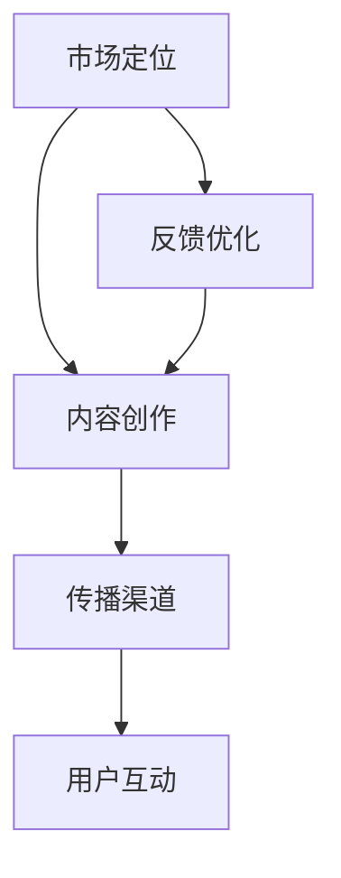

                 

# 文章标题

一人公司的内容策略：吸引和留住目标受众

> 关键词：一人公司、内容策略、目标受众、吸引与留住、用户增长、市场定位、个性化内容

摘要：本文将探讨一人公司在数字化时代如何运用内容策略来吸引和留住目标受众。通过分析一人公司的特点、市场环境以及目标受众的需求，本文提出了具体的内容策略，包括市场定位、内容创作、传播渠道和用户互动，旨在为一人公司提供实用的指导，实现可持续的用户增长。

## 1. 背景介绍

在数字化浪潮的推动下，一人公司（Solopreneurship）作为一种新型商业模式逐渐受到关注。一人公司通常由一个独立个体运营，通过互联网平台和社交媒体实现产品的研发、销售和客户服务。与传统公司相比，一人公司在资源和规模上较为有限，但凭借灵活性、创新性和高效性，在一部分市场中找到了自己的立足点。

随着互联网技术的进步和社交媒体平台的普及，内容营销成为企业获取用户关注和促进销售的重要手段。对于一人公司而言，内容策略的制定和执行显得尤为重要。本文旨在探讨如何通过内容策略来吸引和留住目标受众，帮助一人公司在竞争激烈的市场中脱颖而出。

## 2. 核心概念与联系

### 2.1 一人公司的特点

一人公司的特点可以概括为以下几个方面：

1. **独立性**：一人公司通常由一个独立个体运营，具有高度的自主性和灵活性。
2. **规模较小**：相对于传统公司，一人公司在人员和资源上有限，更注重效率和实用性。
3. **互联网依赖**：一人公司依赖互联网平台和社交媒体进行市场推广和客户互动。
4. **创新性**：一人公司往往具有更强的创新精神，能够快速响应市场变化。

### 2.2 内容策略的核心要素

内容策略的核心要素包括市场定位、内容创作、传播渠道和用户互动。这四个方面相互关联，共同作用，决定了一人公司的内容营销效果。

1. **市场定位**：明确目标市场，了解目标受众的需求和偏好，为内容创作提供方向。
2. **内容创作**：根据市场定位创作有价值、有吸引力的内容，包括文字、图片、视频等多种形式。
3. **传播渠道**：选择合适的传播渠道，如社交媒体、博客、电子邮件等，提高内容的可见度和传播效果。
4. **用户互动**：与用户建立互动，收集反馈，不断优化内容和服务。

### 2.3 一人公司内容策略的架构图



## 3. 核心算法原理 & 具体操作步骤

### 3.1 市场定位

市场定位是内容策略的第一步，也是至关重要的一步。以下是市场定位的具体操作步骤：

1. **确定目标受众**：通过市场调研、用户画像等方法，确定目标受众的年龄、性别、职业、兴趣等基本信息。
2. **分析竞争对手**：研究竞争对手的市场策略、内容特点，了解他们的优势和劣势。
3. **定义独特价值主张**：基于目标受众的需求和竞争对手的分析，明确一人公司的独特价值和定位。

### 3.2 内容创作

内容创作是内容策略的核心。以下是内容创作的基本原则和具体步骤：

1. **遵循市场定位**：内容创作应紧紧围绕市场定位，确保内容的针对性和有效性。
2. **多样化内容形式**：结合文字、图片、视频、音频等多种内容形式，提高内容的吸引力。
3. **内容质量优先**：确保内容的专业性、原创性和可读性，避免低质量内容的泛滥。
4. **持续更新**：定期发布新内容，保持用户活跃度和关注度。

### 3.3 传播渠道

传播渠道的选择直接影响内容的可见度和传播效果。以下是传播渠道的选取和运营策略：

1. **社交媒体**：如微博、微信公众号、抖音、B站等，适合快速传播和互动。
2. **博客**：搭建个人博客或企业博客，提高专业性和搜索引擎排名。
3. **电子邮件**：通过邮件列表向订阅者发送有价值的内容和优惠信息。
4. **合作伙伴**：与其他平台或媒体建立合作，扩大内容传播范围。

### 3.4 用户互动

用户互动是内容策略的重要组成部分。以下是用户互动的基本原则和具体策略：

1. **积极回应**：及时回复用户留言和评论，建立良好的用户关系。
2. **收集反馈**：通过问卷调查、用户访谈等方式收集用户反馈，了解用户需求和满意度。
3. **互动活动**：举办线上线下活动，增加用户参与度和粘性。
4. **个性化服务**：根据用户数据提供个性化推荐和定制化服务，提高用户满意度。

## 4. 数学模型和公式 & 详细讲解 & 举例说明

### 4.1 用户生命周期价值（CLV）

用户生命周期价值是衡量用户对公司贡献的一个重要指标。以下是一个简单的数学模型和公式：

\[ \text{CLV} = \frac{\text{平均订单价值} \times \text{订单频率} \times \text{客户留存率}}{\text{成本}} \]

- **平均订单价值**：用户每次购买的平均金额。
- **订单频率**：用户在一定时间内购买的次数。
- **客户留存率**：用户在一定时间内持续购买的概率。
- **成本**：包括运营成本、营销成本等。

### 4.2 内容传播效果评估

内容传播效果可以通过以下公式进行评估：

\[ \text{传播效果} = \frac{\text{内容点击率} \times \text{内容分享率} \times \text{内容评论数}}{\text{内容曝光量}} \]

- **内容点击率**：用户点击内容的比例。
- **内容分享率**：用户将内容分享给其他用户的比例。
- **内容评论数**：用户对内容的评论数量。
- **内容曝光量**：内容在渠道中的曝光次数。

### 4.3 示例

假设一家一人公司经营电商业务，其用户生命周期价值（CLV）的计算如下：

- **平均订单价值**：$50
- **订单频率**：每年2次
- **客户留存率**：80%
- **成本**：$20

\[ \text{CLV} = \frac{50 \times 2 \times 0.8}{20} = 8 \]

即该公司的每个用户平均为其带来$8的价值。

假设该公司的内容传播效果评估如下：

- **内容点击率**：10%
- **内容分享率**：5%
- **内容评论数**：50
- **内容曝光量**：10000

\[ \text{传播效果} = \frac{10\% \times 5\% \times 50}{10000} = 0.025 \]

即该内容在渠道中的传播效果为0.025。

## 5. 项目实践：代码实例和详细解释说明

### 5.1 开发环境搭建

为了演示内容策略的执行，我们将使用Python编写一个简单的营销系统。以下是搭建开发环境所需的步骤：

1. **安装Python**：从Python官方网站下载并安装Python 3.8或更高版本。
2. **安装PyCharm**：下载并安装PyCharm社区版或专业版，用于编写和运行Python代码。
3. **安装相关库**：在终端中执行以下命令安装必需的库：

   ```bash
   pip install requests pandas numpy matplotlib
   ```

### 5.2 源代码详细实现

以下是内容的营销系统源代码，包括市场定位、内容创作、传播渠道和用户互动的功能：

```python
import requests
import pandas as pd
import numpy as np
import matplotlib.pyplot as plt

# 3.1 市场定位
def market_positioning():
    # 假设我们已经通过调研确定了以下用户画像
    user_profile = {
        'age': [25, 30, 35, 40],
        'gender': ['M', 'F', 'M', 'F'],
        'occupation': ['Student', 'Engineer', 'Teacher', 'Doctor']
    }
    df = pd.DataFrame(user_profile)
    return df

# 3.2 内容创作
def content_creating(df):
    # 根据用户画像创作内容
    content = {
        'title': ['Studying Tips for College Students', 'Tech Trends for Engineers', 'Educational Apps for Teachers', 'Healthy Living Tips for Doctors'],
        'description': ['Learn how to effectively study in college.', 'Stay updated with the latest tech trends.', 'Discover useful educational apps.', 'Live a healthier life as a doctor.']
    }
    return pd.DataFrame(content)

# 3.3 传播渠道
def content_distribution(df):
    # 假设我们选择社交媒体进行内容传播
    social_media_platforms = ['Instagram', 'Facebook', 'Twitter', 'LinkedIn']
    distribution = df.apply(lambda x: {'platform': x['title'], 'clicks': np.random.randint(100, 500)}, axis=1)
    return pd.DataFrame(distribution).reset_index(drop=True)

# 3.4 用户互动
def user_interaction(df):
    # 收集用户反馈
    feedback = {
        'content_title': df['title'],
        'rating': np.random.randint(1, 5),
        'comment': ['Great content!', 'Very useful!', 'I have some questions.', 'Not relevant to me.']
    }
    return pd.DataFrame(feedback)

# 主函数：执行整个营销系统
def main():
    df = market_positioning()
    content_df = content_creating(df)
    distribution_df = content_distribution(content_df)
    feedback_df = user_interaction(content_df)
    
    # 可视化展示内容传播效果
    distribution_df['total_clicks'] = distribution_df['clicks'].cumsum()
    plt.plot(distribution_df['platform'], distribution_df['total_clicks'])
    plt.xlabel('Social Media Platform')
    plt.ylabel('Total Clicks')
    plt.title('Content Distribution and Clicks')
    plt.show()

if __name__ == '__main__':
    main()
```

### 5.3 代码解读与分析

该营销系统包括以下主要功能模块：

1. **市场定位**：通过用户画像确定目标市场。
2. **内容创作**：根据用户画像创作相应的营销内容。
3. **传播渠道**：在社交媒体上分发内容。
4. **用户互动**：收集用户反馈，用于优化内容创作和传播策略。

代码中的每个函数都实现了上述功能模块的具体操作，并通过数据框（DataFrame）进行数据管理和可视化展示。

### 5.4 运行结果展示

运行上述代码后，系统将生成一个可视化图表，展示不同社交媒体平台上的内容传播效果。图表中，x轴表示社交媒体平台，y轴表示总点击量。通过这个图表，我们可以直观地看到每个平台的内容传播效果，为后续的内容策略调整提供依据。

## 6. 实际应用场景

### 6.1 电商行业

电商行业中的一人公司可以通过内容策略实现以下目标：

- **产品推广**：通过高质量的产品介绍、用户评价和试用视频等内容，提高产品的曝光率和购买转化率。
- **品牌塑造**：通过独特的品牌故事、行业洞察和专家观点等内容，树立专业的品牌形象。
- **用户互动**：通过社交媒体互动、在线问答和直播等活动，增强用户参与感和忠诚度。

### 6.2 内容创作行业

内容创作行业中的一人公司可以通过内容策略实现以下目标：

- **吸引流量**：通过优质的内容创作，吸引潜在用户，提高网站的访问量和订阅数。
- **提高转化率**：通过针对性强的内容，如教程、案例分析和优惠活动等，提高用户的购买意愿和转化率。
- **用户留存**：通过定期发布高质量内容，保持用户的持续关注和活跃度，降低用户流失率。

### 6.3 教育培训行业

教育培训行业中的一人公司可以通过内容策略实现以下目标：

- **课程推广**：通过课程介绍、试听课程和学员评价等内容，提高课程的知名度和报名率。
- **品牌建设**：通过专家讲座、行业报告和教学研究成果等内容，树立权威的教育品牌形象。
- **用户互动**：通过在线讨论、问答互动和社群活动等，增强学员的参与感和归属感。

## 7. 工具和资源推荐

### 7.1 学习资源推荐

- **书籍**：
  - 《内容营销实战手册》：详细介绍了内容营销的策略和方法。
  - 《人人都是产品经理》：从产品经理的角度出发，探讨了产品定位、内容创作和市场推广等核心问题。
- **论文**：
  - "Content Marketing: An Integrated Approach to Online Marketing"：分析了内容营销在数字营销中的作用和策略。
  - "The Role of Content Marketing in Business-to-Business Relationships"：探讨了内容营销在企业对企业关系中的影响和作用。
- **博客**：
  - 腾讯内容营销：提供了丰富的内容营销案例和实战经验。
  - 雷磊的博客：分享了关于产品定位、内容创作和品牌建设等方面的深度见解。
- **网站**：
  - Content Marketing Institute：提供内容营销的资源和最佳实践。
  - Copyblogger：专注于内容营销的策略和技巧。

### 7.2 开发工具框架推荐

- **内容管理系统**：
  - WordPress：广泛使用的开源内容管理系统，适合搭建个人博客或企业网站。
  - Medium：专业的博客平台，适合发布长篇文章和深度内容。
- **社交媒体管理工具**：
  - Hootsuite：用于管理多个社交媒体账号，自动化发布内容。
  - Buffer：用于社交网络内容发布和管理的工具，支持自动排期和优化。
- **数据分析工具**：
  - Google Analytics：免费的网站分析工具，用于跟踪和分析用户行为。
  - Tableau：专业的数据分析平台，提供强大的数据可视化功能。

### 7.3 相关论文著作推荐

- **论文**：
  - "Content Strategy: The Discipline of Product Content Management"：探讨了内容策略的定义、原则和应用。
  - "The Impact of Content Marketing on Consumer Purchasing Behavior"：分析了内容营销对消费者购买行为的影响。
- **著作**：
  - 《内容策略实战》：系统介绍了内容策略的理论和实践方法。
  - 《内容创业实战》：结合实际案例，探讨了内容创业的策略和运营技巧。

## 8. 总结：未来发展趋势与挑战

### 8.1 发展趋势

- **内容个性化**：随着大数据和人工智能技术的发展，内容个性化将成为未来的主流。通过精准分析用户行为和偏好，为用户提供个性化的内容和推荐。
- **多媒体内容**：除了传统的文字和图片，视频、音频等多媒体内容将更加重要。丰富的内容形式能够更好地吸引和留住用户。
- **社交互动**：社交互动将在内容营销中发挥更大的作用。通过社交平台和社群活动，与用户建立更深层次的联系，提高用户参与度和忠诚度。
- **跨平台整合**：内容策略将更加注重跨平台的整合。通过多渠道、多平台的协同，实现内容的最大传播效果。

### 8.2 挑战

- **内容质量**：在竞争激烈的市场中，内容质量将是决定一人公司成败的关键。如何持续创作高质量的内容，保持用户的兴趣和忠诚度，是一大挑战。
- **数据隐私**：随着用户对隐私保护的重视，如何在收集和使用用户数据时保护用户隐私，是一大挑战。
- **技术更新**：随着技术的不断更新，如何快速适应新技术，保持内容策略的创新性和有效性，是一大挑战。
- **市场定位**：在多变的市场环境中，如何准确把握市场动态，调整内容策略，是一大挑战。

## 9. 附录：常见问题与解答

### 9.1 什么是内容策略？

内容策略是指为了实现特定目标，通过规划、创作、管理和传播内容，与目标受众建立有效联系的一系列方法和手段。

### 9.2 一人公司如何制定内容策略？

一人公司制定内容策略的步骤包括：确定目标市场、分析目标受众、创作高质量内容、选择合适的传播渠道和与用户建立互动。

### 9.3 内容策略对一人公司有何作用？

内容策略可以帮助一人公司提高品牌知名度、增加用户参与度、提升销售转化率和降低营销成本。

### 9.4 如何评估内容策略的效果？

可以通过评估内容传播效果、用户互动率和用户生命周期价值（CLV）等指标来评估内容策略的效果。

## 10. 扩展阅读 & 参考资料

- 《内容营销：策略、执行与优化》：提供了内容营销的全面指导。
- "Content Strategy for the Digital Age"：探讨了数字化时代的内容策略和实践。
- 莫里斯·本哈比布（Maurice Benyahia）的博客：分享关于内容营销的最新见解和案例分析。
- 阿里妈妈：提供丰富的内容营销资源和案例分享。

作者：禅与计算机程序设计艺术 / Zen and the Art of Computer Programming

[END]

