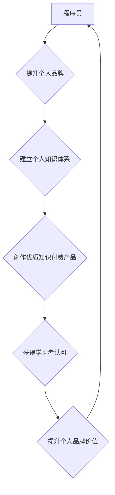

                 

## 知识付费与程序员个人品牌建设

> 关键词：知识付费、程序员、个人品牌、内容创作、社区运营、技术博客、在线课程、付费订阅

### 1. 背景介绍

在当今数字化时代，技术人才需求日益增长，程序员作为科技发展的重要力量，面临着前所未有的机遇和挑战。传统的求职模式逐渐被打破，程序员需要不断提升自身价值，打造个人品牌，才能在激烈的竞争中脱颖而出。知识付费作为一种新型的商业模式，为程序员提供了新的途径，帮助他们将专业知识和技能转化为经济价值，同时也为学习者提供了更高质量、更个性化的学习体验。

### 2. 核心概念与联系

#### 2.1 知识付费

知识付费是指通过互联网平台，将知识、技能、经验等信息以付费的形式提供给学习者，是一种以知识为核心、以价值交换为基础的商业模式。

#### 2.2 个人品牌

个人品牌是指个人在特定领域或行业内建立的独特形象和声誉，它包含个人价值观、技能、经验、作品等多方面要素。

#### 2.3 连接

知识付费与个人品牌建设相互促进，形成了良性循环：

* **个人品牌建设为知识付费提供基础：** 拥有良好个人品牌的程序员更容易获得学习者的信任和认可，从而更容易销售知识付费产品。
* **知识付费提升个人品牌价值：** 通过知识付费，程序员可以展示自己的专业能力和价值，提升个人品牌影响力，吸引更多学习者和合作机会。

**Mermaid 流程图**



### 3. 核心算法原理 & 具体操作步骤

#### 3.1 算法原理概述

个人品牌建设是一个迭代优化过程，需要不断积累和提升个人价值。核心算法原理可以概括为：

* **内容创作：** 持续输出高质量的技术博客文章、视频教程、开源项目等内容，展示专业知识和技能。
* **社区运营：** 积极参与技术社区，与其他程序员交流学习，建立人脉关系。
* **品牌推广：** 利用社交媒体、线上线下活动等渠道，推广个人品牌，扩大影响力。

#### 3.2 算法步骤详解

1. **明确目标用户和定位：** 确定目标用户群体，分析他们的需求和痛点，明确个人品牌定位。
2. **构建个人知识体系：** 深入学习技术领域，积累专业知识和技能，形成自己的知识体系。
3. **创作优质内容：** 根据目标用户需求，创作高质量的技术博客文章、视频教程、开源项目等内容，并进行有效推广。
4. **积极参与社区运营：** 积极参与技术社区，回答问题、分享经验、参与讨论，建立人脉关系。
5. **建立个人品牌形象：** 通过个人网站、社交媒体等平台，打造个人品牌形象，展现专业能力和价值观。
6. **持续优化和迭代：** 关注用户反馈，不断优化内容和运营策略，提升个人品牌价值。

#### 3.3 算法优缺点

* **优点：** 
    * 能够有效提升个人价值和影响力。
    * 提供了新的商业模式，帮助程序员实现自我价值。
    * 能够促进技术交流和学习，推动行业发展。
* **缺点：** 
    * 需要投入大量时间和精力进行内容创作和运营。
    * 需要具备一定的市场营销和推广能力。
    * 竞争激烈，需要不断创新和提升才能脱颖而出。

#### 3.4 算法应用领域

* **技术博客：** 程序员可以通过技术博客分享自己的技术经验和见解，建立个人品牌，吸引读者和潜在雇主。
* **在线课程：** 程序员可以利用自己的专业知识，录制在线课程，通过知识付费平台销售课程，获得收益。
* **开源项目：** 程序员可以通过开源项目展示自己的技术能力，积累贡献，提升个人品牌影响力。
* **技术社区：** 程序员可以通过积极参与技术社区，回答问题、分享经验，建立人脉关系，提升个人品牌知名度。

### 4. 数学模型和公式 & 详细讲解 & 举例说明

#### 4.1 数学模型构建

个人品牌价值可以看作是一个动态变化的函数，受多种因素影响，例如：

* **内容质量：** 内容的原创性、实用性、深度等因素都会影响个人品牌价值。
* **内容传播量：** 内容的阅读量、分享量、评论量等指标反映了内容的影响力，进而影响个人品牌价值。
* **社区活跃度：** 程序员在社区中的参与度、贡献度、影响力等因素都会提升个人品牌价值。
* **个人形象：** 程序员的专业能力、个人魅力、品牌形象等因素都会影响个人品牌价值。

我们可以用以下数学模型来表示个人品牌价值：

$$
V = f(C, P, A, I)
$$

其中：

* $V$ 代表个人品牌价值
* $C$ 代表内容质量
* $P$ 代表内容传播量
* $A$ 代表社区活跃度
* $I$ 代表个人形象

#### 4.2 公式推导过程

由于个人品牌价值是一个复杂的多因素影响系统，很难用简单的公式精确计算。我们可以通过分析各个因素之间的关系，建立相应的权重模型，对个人品牌价值进行评估。例如，我们可以根据以下公式计算个人品牌价值的权重：

$$
V = w_C * C + w_P * P + w_A * A + w_I * I
$$

其中：

* $w_C$, $w_P$, $w_A$, $w_I$ 分别代表内容质量、内容传播量、社区活跃度、个人形象的权重系数。

#### 4.3 案例分析与讲解

假设我们有一个程序员，他的内容质量较高，但传播量较低，社区活跃度中等，个人形象良好。我们可以根据实际情况，设置相应的权重系数，例如：

* $w_C = 0.4$
* $w_P = 0.3$
* $w_A = 0.2$
* $w_I = 0.1$

然后根据公式计算他的个人品牌价值。

### 5. 项目实践：代码实例和详细解释说明

#### 5.1 开发环境搭建

* **操作系统：** Linux/macOS/Windows
* **编程语言：** Python/JavaScript/Go
* **开发工具：** VS Code/Atom/Sublime Text
* **版本控制系统：** Git

#### 5.2 源代码详细实现

以下是一个简单的技术博客网站的代码示例，使用 Python 和 Flask 框架开发：

```python
from flask import Flask, render_template

app = Flask(__name__)

@app.route('/')
def index():
    return render_template('index.html')

if __name__ == '__main__':
    app.run(debug=True)
```

**index.html**

```html
<!DOCTYPE html>
<html>
<head>
    <title>我的技术博客</title>
</head>
<body>
    <h1>欢迎来到我的技术博客</h1>
    <p>这里将分享我的技术经验和见解。</p>
</body>
</html>
```

#### 5.3 代码解读与分析

* **Flask 框架：** Flask 是一个轻量级的 Python Web 框架，易于学习和使用。
* **路由：** `@app.route('/')` 定义了网站首页的路由规则，当访问网站根路径时，会执行 `index()` 函数。
* **模板引擎：** Flask 使用 Jinja2 模板引擎，可以将 Python 代码嵌入 HTML 模板中，实现动态内容渲染。

#### 5.4 运行结果展示

运行上述代码，访问 `http://127.0.0.1:5000/`，即可看到简单的技术博客网站首页。

### 6. 实际应用场景

#### 6.1 技术博客

程序员可以通过技术博客分享自己的技术经验和见解，建立个人品牌，吸引读者和潜在雇主。

#### 6.2 在线课程

程序员可以利用自己的专业知识，录制在线课程，通过知识付费平台销售课程，获得收益。

#### 6.3 开源项目

程序员可以通过开源项目展示自己的技术能力，积累贡献，提升个人品牌影响力。

#### 6.4 社区运营

程序员可以通过积极参与技术社区，回答问题、分享经验，建立人脉关系，提升个人品牌知名度。

#### 6.5 未来应用展望

随着互联网技术的不断发展，知识付费和个人品牌建设将更加深入融合，形成更加完善的生态系统。未来，我们将看到更多创新型知识付费模式和个人品牌建设策略的出现，为程序员提供更多发展机遇。

### 7. 工具和资源推荐

#### 7.1 学习资源推荐

* **在线学习平台：** Coursera、Udemy、Udacity、edX
* **技术博客网站：** Hacker News、Medium、Dev.to
* **技术社区：** Stack Overflow、GitHub、Reddit

#### 7.2 开发工具推荐

* **代码编辑器：** VS Code、Atom、Sublime Text
* **版本控制系统：** Git
* **云平台：** AWS、Azure、GCP

#### 7.3 相关论文推荐

* **The Economics of Online Education**
* **The Impact of Social Media on Personal Branding**
* **The Future of Knowledge Sharing**

### 8. 总结：未来发展趋势与挑战

#### 8.1 研究成果总结

知识付费与个人品牌建设相互促进，为程序员提供了新的发展路径。通过持续输出优质内容、积极参与社区运营、打造个人品牌形象，程序员可以提升自身价值，实现自我价值。

#### 8.2 未来发展趋势

* **个性化学习：** 知识付费平台将更加注重用户个性化需求，提供定制化的学习方案。
* **沉浸式体验：** 知识付费内容将更加注重交互性和沉浸感，例如 VR/AR 技术的应用。
* **社区化学习：** 知识付费平台将更加注重社区建设，提供学习者之间的交流和合作机会。

#### 8.3 面临的挑战

* **内容质量控制：** 知识付费平台需要加强内容质量控制，避免低质量内容泛滥。
* **知识产权保护：** 知识付费平台需要加强知识产权保护，保障创作者权益。
* **用户信任问题：** 知识付费平台需要建立用户信任机制，避免虚假宣传和欺诈行为。

#### 8.4 研究展望

未来，我们需要进一步研究知识付费与个人品牌建设的交互机制，探索更加有效的知识传播和个人价值提升模式。

### 9. 附录：常见问题与解答

#### 9.1 如何打造个人品牌？

* **明确目标用户和定位：** 确定目标用户群体，分析他们的需求和痛点，明确个人品牌定位。
* **构建个人知识体系：** 深入学习技术领域，积累专业知识和技能，形成自己的知识体系。
* **创作优质内容：** 根据目标用户需求，创作高质量的技术博客文章、视频教程、开源项目等内容，并进行有效推广。
* **积极参与社区运营：** 积极参与技术社区，回答问题、分享经验、参与讨论，建立人脉关系。
* **建立个人品牌形象：** 通过个人网站、社交媒体等平台，打造个人品牌形象，展现专业能力和价值观。

#### 9.2 如何进行知识付费？

* **选择合适的平台：** 不同的知识付费平台有不同的特点和用户群体，需要根据自身情况选择合适的平台。
* **确定知识付费模式：** 常见的知识付费模式包括在线课程、付费订阅、电子书等。
* **制作高质量内容：** 知识付费内容需要高质量、实用、有价值，才能吸引用户付费。
* **进行有效推广：** 需要通过多种渠道推广知识付费产品，例如社交媒体、技术社区、邮件营销等。


作者：禅与计算机程序设计艺术 / Zen and the Art of Computer Programming 
<end_of_turn>

