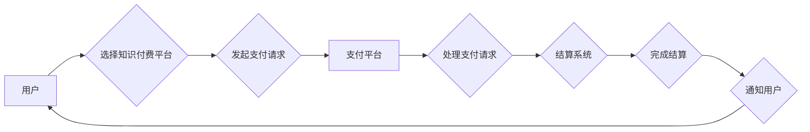

                 

## 知识付费如何实现跨平台支付与结算？

> 关键词：知识付费、跨平台支付、结算系统、API接口、安全保障、用户体验、区块链技术

## 1. 背景介绍

知识付费作为一种新型的商业模式，近年来发展迅速，其核心在于通过提供优质的知识产权内容，获取用户付费。随着互联网的普及和移动设备的广泛应用，知识付费平台呈现出多元化发展趋势，用户也更加倾向于跨平台消费知识内容。然而，跨平台支付与结算的实现对知识付费平台的稳定性和用户体验提出了新的挑战。

传统知识付费平台通常采用单一平台的支付体系，用户只能在该平台内进行支付和消费。随着平台之间的竞争加剧，用户希望能够在不同平台之间自由选择和消费知识内容，这促使跨平台支付与结算的需求日益凸显。

## 2. 核心概念与联系

跨平台支付与结算是指用户在不同平台之间进行支付和消费，并能够实现资金的顺利流转和结算。其核心概念包括：

* **支付平台:** 提供支付服务的第三方平台，例如支付宝、微信支付、Stripe等。
* **结算系统:** 用于处理支付平台之间的资金结算，确保资金的安全和准确性。
* **API接口:** 允许不同平台之间进行数据交互和资金流转的接口。
* **用户账户:** 用户在不同平台上的账户信息，用于记录用户资金和消费记录。

**跨平台支付与结算架构流程图:**



## 3. 核心算法原理 & 具体操作步骤

### 3.1  算法原理概述

跨平台支付与结算的核心算法原理在于实现不同平台之间的数据交互和资金流转的安全性、效率和可靠性。主要算法包括：

* **加密算法:** 用于保护用户支付信息和资金安全。
* **数字签名算法:** 用于验证支付请求的合法性。
* **哈希算法:** 用于生成支付交易的唯一标识符。
* **分布式账本技术:** 用于记录和验证支付交易的完整性和不可篡改性。

### 3.2  算法步骤详解

1. **用户发起支付请求:** 用户选择知识付费平台，并发起支付请求，包含支付金额、平台信息、用户账户信息等。
2. **支付平台处理请求:** 支付平台接收用户支付请求，并进行身份验证和资金校验。
3. **加密和签名:** 支付平台对支付请求进行加密和数字签名，确保支付信息的安全性。
4. **API接口调用:** 支付平台调用结算系统的API接口，发送加密后的支付请求。
5. **结算系统处理请求:** 结算系统接收支付请求，进行验证和处理。
6. **资金转账:** 结算系统根据支付请求信息，将资金从用户账户转入知识付费平台账户。
7. **交易记录生成:** 结算系统生成支付交易记录，并将其存储在分布式账本中。
8. **通知用户:** 结算系统通知用户支付成功，并提供交易记录信息。

### 3.3  算法优缺点

**优点:**

* **安全性高:** 加密算法和数字签名算法确保支付信息的安全性。
* **效率高:** API接口调用实现快速的数据交互和资金流转。
* **可靠性高:** 分布式账本技术保证交易记录的完整性和不可篡改性。

**缺点:**

* **技术复杂:** 需要对多种算法和技术进行深入理解和掌握。
* **成本高:** 需要投入大量资金和人力资源进行系统开发和维护。
* **兼容性问题:** 不同平台的API接口可能存在兼容性问题。

### 3.4  算法应用领域

跨平台支付与结算算法广泛应用于：

* **电商平台:** 用户在不同电商平台之间进行商品购买和支付。
* **金融服务:** 用户在不同金融机构之间进行资金转账和支付。
* **游戏平台:** 用户在不同游戏平台之间进行虚拟货币交易。
* **社交平台:** 用户在不同社交平台之间进行虚拟礼物购买和支付。

## 4. 数学模型和公式 & 详细讲解 & 举例说明

### 4.1  数学模型构建

跨平台支付与结算的数学模型可以描述为一个多方交互的网络系统，其中每个节点代表一个平台或用户，边代表资金流转的路径。

**节点:**

* **用户节点:** 代表用户，拥有资金账户和支付请求信息。
* **平台节点:** 代表知识付费平台，拥有支付处理能力和资金账户。
* **结算系统节点:** 代表结算系统，负责处理平台之间的资金结算。

**边:**

* **支付请求边:** 代表用户发起支付请求的路径。
* **资金流转边:** 代表资金从用户账户到平台账户的流转路径。
* **结算边:** 代表平台之间进行资金结算的路径。

### 4.2  公式推导过程

**支付金额计算公式:**

$$
P = A \times R
$$

其中:

* $P$ 代表支付金额。
* $A$ 代表知识付费内容的单价。
* $R$ 代表用户购买的数量。

**资金结算公式:**

$$
S = \sum_{i=1}^{n} P_i - \sum_{j=1}^{m} C_j
$$

其中:

* $S$ 代表平台之间的资金结算金额。
* $P_i$ 代表第 $i$ 个平台收到的支付金额。
* $C_j$ 代表第 $j$ 个平台支付的费用。

### 4.3  案例分析与讲解

假设用户在平台 A 上购买价值 10 元的知识付费内容，平台 A 收取 1 元的平台服务费，平台 B 收取 0.5 元的支付手续费。

根据支付金额计算公式，用户支付金额 $P = 10 \times 1 = 10$ 元。

根据资金结算公式，平台 A 的结算金额为 $10 - 1 = 9$ 元，平台 B 的结算金额为 $-0.5$ 元。

## 5. 项目实践：代码实例和详细解释说明

### 5.1  开发环境搭建

* **操作系统:** Linux 或 macOS
* **编程语言:** Python
* **开发框架:** Flask 或 Django
* **数据库:** MySQL 或 PostgreSQL
* **支付平台 SDK:** 支付宝、微信支付、Stripe 等

### 5.2  源代码详细实现

```python
# 支付请求处理函数
def handle_payment_request(request):
    # 获取用户支付信息
    user_id = request.POST.get('user_id')
    amount = request.POST.get('amount')
    platform_id = request.POST.get('platform_id')

    # 调用支付平台 API 接口
    payment_response = payment_gateway.process_payment(user_id, amount, platform_id)

    # 处理支付结果
    if payment_response.status == 'success':
        # 更新用户账户余额
        update_user_balance(user_id, -amount)

        # 通知用户支付成功
        send_payment_success_notification(user_id)
    else:
        # 处理支付失败
        send_payment_failure_notification(user_id)

# 资金结算函数
def settle_funds():
    # 获取平台之间需要结算的资金
    platform_balances = get_platform_balances()

    # 计算平台之间的资金差额
    net_balances = calculate_net_balances(platform_balances)

    # 将资金转账到相应的平台账户
    transfer_funds(net_balances)

```

### 5.3  代码解读与分析

* `handle_payment_request()` 函数处理用户发起支付请求，获取用户支付信息，调用支付平台 API 接口进行支付处理，并根据支付结果更新用户账户余额和通知用户。
* `settle_funds()` 函数处理平台之间的资金结算，获取平台之间的资金余额，计算资金差额，并进行资金转账。

### 5.4  运行结果展示

* 用户在知识付费平台上成功支付知识付费内容。
* 平台之间进行资金结算，确保资金的安全和准确性。

## 6. 实际应用场景

跨平台支付与结算在知识付费领域具有广泛的应用场景：

* **跨平台内容消费:** 用户可以在不同平台之间自由选择和消费知识付费内容，享受更丰富的学习体验。
* **内容创作者收益:** 内容创作者可以将知识付费内容发布到多个平台，扩大受众群体，提高收益。
* **平台合作:** 不同平台可以合作，实现知识付费内容的共享和互推，促进行业发展。

### 6.4  未来应用展望

随着区块链技术的成熟和应用，跨平台支付与结算将更加安全、透明和高效。未来，知识付费平台将更加注重用户体验，提供更个性化和定制化的学习服务。

## 7. 工具和资源推荐

### 7.1  学习资源推荐

* **区块链技术入门:** 《区块链技术入门》
* **支付平台 API 开发:** 支付宝、微信支付、Stripe 等官方文档

### 7.2  开发工具推荐

* **Python 开发环境:** PyCharm、VS Code
* **数据库管理工具:** MySQL Workbench、pgAdmin

### 7.3  相关论文推荐

* **跨平台支付与结算系统设计:** 《基于区块链技术的跨平台支付与结算系统设计》
* **知识付费平台发展趋势:** 《知识付费平台发展趋势及未来展望》

## 8. 总结：未来发展趋势与挑战

### 8.1  研究成果总结

跨平台支付与结算是知识付费平台发展的重要方向，其核心算法原理和技术实现方案已经较为成熟。

### 8.2  未来发展趋势

* **区块链技术应用:** 利用区块链技术实现更安全、透明和高效的跨平台支付与结算。
* **人工智能技术应用:** 利用人工智能技术提供更个性化和定制化的学习服务。
* **跨平台内容生态建设:** 促进不同平台之间合作，构建更完善的知识付费内容生态。

### 8.3  面临的挑战

* **技术复杂性:** 跨平台支付与结算系统涉及多种技术，开发和维护难度较大。
* **安全风险:** 跨平台支付与结算系统面临着资金安全和用户隐私保护的挑战。
* **监管政策:** 跨平台支付与结算需要遵守相关法律法规和监管政策。

### 8.4  研究展望

未来，我们将继续研究跨平台支付与结算的最新技术和应用，探索更安全、高效和便捷的知识付费模式，为用户提供更优质的学习体验。

## 9. 附录：常见问题与解答

* **Q1: 如何确保跨平台支付与结算的安全性？**

* **A1:** 通过加密算法、数字签名算法和分布式账本技术，确保支付信息的安全性、交易记录的完整性和不可篡改性。

* **Q2: 如何解决不同平台之间API接口的兼容性问题？**

* **A2:** 通过标准化API接口和数据格式，实现不同平台之间的互操作性。

* **Q3: 如何处理跨平台支付与结算中的资金纠纷？**

* **A3:** 建立完善的资金结算机制和争议解决机制，确保资金的安全和用户权益的保护。


作者：禅与计算机程序设计艺术 / Zen and the Art of Computer Programming 
<end_of_turn>

