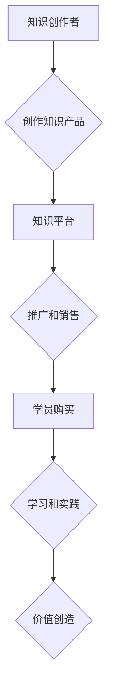

                 

## 知识付费帮助学员实现知识的应用价值

> 关键词：知识付费、在线教育、知识应用、技能提升、实践项目、价值创造

### 1. 背景介绍

在当今信息爆炸的时代，知识的获取变得前所未有便捷。互联网平台、在线课程、电子书籍等资源充斥着各个领域，为人们提供了海量学习机会。然而，知识的获取仅仅是第一步，真正重要的在于如何将所学知识转化为实际的应用价值。

传统教育模式往往侧重于知识的传授，而缺乏对知识应用的引导和实践机会。这导致许多人即使掌握了丰富的知识，也难以将其运用到实际工作或生活中。知识付费应运而生，它以知识为核心，通过线上平台提供更精准、更有效的学习体验，并强调知识的应用和实践，帮助学员将知识转化为实际技能和价值。

### 2. 核心概念与联系

**2.1 知识付费的核心概念**

知识付费是指以知识为产品或服务，通过线上平台向用户收取费用的一种商业模式。它涵盖了各种形式的知识产品，例如：

* **在线课程:** 包含视频讲座、课件、练习题等，提供系统化的知识学习体验。
* **电子书籍:** 提供深度解析、案例分析等内容，帮助用户深入理解特定领域知识。
* **付费咨询:** 提供一对一或小班制的知识解答和指导，解决用户遇到的具体问题。
* **会员社区:** 提供知识分享、交流互动、资源下载等服务，构建知识学习的社群氛围。

**2.2 知识付费与在线教育的联系**

知识付费是在线教育的重要组成部分，两者相互促进、共同发展。在线教育平台为知识付费提供了传播和推广的渠道，而知识付费则为在线教育提供了新的商业模式和盈利方式。

**2.3 知识付费与价值创造的联系**

知识付费的核心价值在于帮助用户提升技能、创造价值。通过学习和实践，用户可以将所学知识应用到实际工作或生活中，从而获得经济效益、社会效益或个人成长。

**2.4 知识付费的价值链**

知识付费的价值链包括以下环节：

* **知识创作者:** 拥有专业知识和技能，创作优质的知识产品。
* **知识平台:** 提供线上平台和技术支持，帮助知识创作者推广和销售知识产品。
* **学员:** 购买和学习知识产品，提升技能和创造价值。

**2.5 知识付费的流程图**



### 3. 核心算法原理 & 具体操作步骤

**3.1 算法原理概述**

知识付费平台的运营需要依赖于一系列算法，例如推荐算法、内容分发算法、用户画像算法等。这些算法通过分析用户行为、知识内容特征等数据，实现个性化推荐、内容优化、用户精准营销等功能，从而提升用户体验和平台运营效率。

**3.2 算法步骤详解**

* **数据采集:** 收集用户行为数据、知识内容数据等，例如用户浏览记录、学习进度、评价反馈、知识标签、作者信息等。
* **数据预处理:** 对采集到的数据进行清洗、转换、整合等处理，使其符合算法模型的输入要求。
* **特征提取:** 从数据中提取用户兴趣、知识偏好、学习风格等特征，以及知识内容的主题、难度、受欢迎程度等特征。
* **模型训练:** 利用机器学习算法，训练推荐模型、内容分发模型、用户画像模型等，使其能够根据特征预测用户行为和知识内容的匹配度。
* **模型评估:** 对训练好的模型进行评估，测试其准确率、召回率、覆盖率等指标，并根据评估结果进行模型优化和调整。
* **模型部署:** 将训练好的模型部署到线上平台，实时进行推荐、分发、分析等操作。

**3.3 算法优缺点**

* **优点:** 能够实现个性化推荐、内容优化、用户精准营销等功能，提升用户体验和平台运营效率。
* **缺点:** 需要大量的数据支持，算法模型的训练和优化需要专业技术人员，存在算法偏差和数据安全等问题。

**3.4 算法应用领域**

* **在线教育平台:** 个性化推荐课程、内容分发、用户画像分析等。
* **电商平台:** 商品推荐、广告投放、用户行为分析等。
* **社交媒体平台:** 内容推荐、用户匹配、社区运营等。

### 4. 数学模型和公式 & 详细讲解 & 举例说明

**4.1 数学模型构建**

知识推荐算法通常基于协同过滤、内容过滤或混合模型等数学模型。

* **协同过滤:** 基于用户对相似物品的评分或行为进行预测。
* **内容过滤:** 基于物品的特征和用户偏好进行预测。
* **混合模型:** 将协同过滤和内容过滤相结合，提高推荐效果。

**4.2 公式推导过程**

例如，协同过滤算法中常用的**用户-物品评分矩阵**可以表示为：

$$
R = \begin{bmatrix}
r_{11} & r_{12} & \cdots & r_{1m} \\
r_{21} & r_{22} & \cdots & r_{2m} \\
\vdots & \vdots & \ddots & \vdots \\
r_{n1} & r_{n2} & \cdots & r_{nm}
\end{bmatrix}
$$

其中，$r_{ij}$表示用户$i$对物品$j$的评分，$n$为用户数量，$m$为物品数量。

**4.3 案例分析与讲解**

假设用户A和用户B都对电影A和电影B评分较高，而用户C对电影A评分较高，对电影B评分较低。根据协同过滤算法，可以推断用户A和用户B可能对电影C也评分较高。

### 5. 项目实践：代码实例和详细解释说明

**5.1 开发环境搭建**

* Python 3.x
* Jupyter Notebook
* scikit-learn

**5.2 源代码详细实现**

```python
from sklearn.metrics.pairwise import cosine_similarity

# 用户-物品评分矩阵
ratings = {
    'user1': {'movie1': 5, 'movie2': 3, 'movie3': 4},
    'user2': {'movie1': 4, 'movie2': 5, 'movie3': 2},
    'user3': {'movie1': 3, 'movie2': 1, 'movie3': 5},
}

# 将评分矩阵转换为用户-物品评分矩阵
user_item_matrix = pd.DataFrame(ratings).transpose()

# 计算用户之间的余弦相似度
user_similarity = cosine_similarity(user_item_matrix)

# 获取用户1与其他用户的相似度
user1_similarity = user_similarity[0]

# 获取与用户1相似度最高的两个用户
top_similar_users = user1_similarity.argsort()[-2:][::-1]

# 获取与用户1相似用户喜欢的电影
similar_users_ratings = user_item_matrix.iloc[top_similar_users].mean(axis=0)

# 推荐给用户1的电影
recommended_movies = similar_users_ratings.sort_values(ascending=False).index
```

**5.3 代码解读与分析**

* 代码首先构建用户-物品评分矩阵，并将评分数据转换为可用于计算相似度的矩阵形式。
* 然后使用余弦相似度算法计算用户之间的相似度，并获取与用户1相似度最高的两个用户。
* 最后根据相似用户的评分数据，推荐给用户1的电影。

**5.4 运行结果展示**

运行代码后，可以得到用户1与其他用户的相似度排序，以及推荐给用户1的电影列表。

### 6. 实际应用场景

**6.1 在线课程推荐**

知识付费平台可以根据用户的学习历史、兴趣偏好、学习风格等数据，推荐个性化的课程，帮助用户找到最适合自己的学习内容。

**6.2 内容分发优化**

平台可以根据用户兴趣和内容受欢迎程度，优化内容的展示顺序和推荐策略，提高用户参与度和学习效果。

**6.3 用户画像分析**

通过分析用户的学习行为、评价反馈等数据，平台可以构建用户画像，了解用户的学习特点、需求和痛点，从而提供更精准的知识服务。

**6.4 未来应用展望**

随着人工智能技术的不断发展，知识付费平台将更加智能化、个性化。例如，未来可能出现基于深度学习的个性化学习路径推荐、虚拟导师辅助学习等应用场景。

### 7. 工具和资源推荐

**7.1 学习资源推荐**

* **在线课程平台:** Coursera、edX、Udemy、Udacity等
* **知识付费社区:** 知乎、豆瓣、Bilibili等
* **技术博客:** CSDN、博客园、SegmentFault等

**7.2 开发工具推荐**

* **Python:** 广泛应用于数据分析、机器学习等领域
* **scikit-learn:** Python机器学习库
* **TensorFlow:** 深度学习框架

**7.3 相关论文推荐**

* **Collaborative Filtering for Implicit Feedback Datasets**
* **Content-Based Recommendation Systems**
* **Hybrid Recommender Systems**

### 8. 总结：未来发展趋势与挑战

**8.1 研究成果总结**

知识付费模式在教育领域取得了显著的成果，为用户提供了便捷、高效的学习方式，并为知识创作者提供了新的商业模式。

**8.2 未来发展趋势**

* **个性化学习:** 基于人工智能技术的个性化学习路径推荐、虚拟导师辅助学习等应用场景将更加普及。
* **沉浸式学习:** VR/AR技术将为用户提供更加沉浸式的学习体验。
* **跨界融合:** 知识付费将与其他领域，例如游戏、娱乐、社交等融合，形成新的学习模式。

**8.3 面临的挑战**

* **数据安全:** 知识付费平台需要妥善处理用户数据，保障用户隐私安全。
* **算法偏差:** 算法模型可能存在偏差，导致推荐结果不准确或不公平。
* **内容质量:** 平台需要加强对知识内容的审核和监管，确保内容质量和真实性。

**8.4 研究展望**

未来研究方向包括：

* 开发更精准、更有效的推荐算法。
* 构建更完善的用户画像模型，提供更个性化的学习服务。
* 探索新的知识付费模式和商业模式。


### 9. 附录：常见问题与解答

**9.1 如何选择合适的知识付费课程？**

* 确定自己的学习目标和需求。
* 阅读课程介绍、评价和学员反馈。
* 了解课程内容、授课老师和平台口碑。

**9.2 如何提高知识付费学习的效率？**

* 制定学习计划，并坚持执行。
* 积极参与课程互动，与老师和同学交流。
* 将所学知识应用到实际工作或生活中。

**9.3 知识付费平台如何保障知识内容的质量？**

* 平台通常会对知识内容进行审核和筛选。
* 平台会鼓励学员评价和反馈课程内容。
* 平台会与优质的知识创作者合作。


作者：禅与计算机程序设计艺术 / Zen and the Art of Computer Programming 
<end_of_turn>

