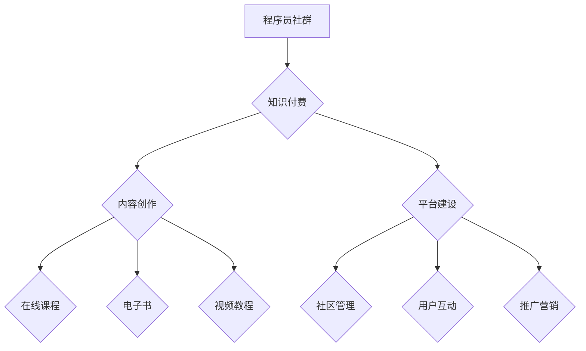

                 

## 知识付费：程序员的社群运营攻略

> 关键词：知识付费、程序员社群、运营策略、内容创作、社区建设、技术分享、商业模式

## 1. 背景介绍

在当今数字化时代，知识已成为最宝贵的资源之一。程序员作为科技领域的先锋，拥有丰富的技术经验和专业技能，他们积累的知识和洞察力对其他程序员和技术爱好者具有极高的价值。知识付费模式的兴起为程序员提供了将自身知识转化为收益的全新途径，同时也为程序员社群的发展提供了新的动力。

程序员社群的运营，本质上是建立一个平台，让程序员们可以互相学习、交流、分享和协作。而知识付费则为这个平台注入了一股新的活力，它不仅可以帮助程序员获得经济回报，更重要的是可以促进社群的活跃度和粘性，形成良性循环。

## 2. 核心概念与联系

### 2.1 知识付费

知识付费是指通过付费的方式获取知识和技能的商业模式。它涵盖了各种形式的知识产品，例如在线课程、电子书、视频教程、直播讲座等。

### 2.2 程序员社群

程序员社群是指由程序员组成的网络或线下社区，其成员之间通过共同的兴趣爱好、技术交流、项目合作等方式建立联系。

### 2.3 运营策略

运营策略是指为了实现社群目标而采取的一系列行动计划，包括内容运营、社区建设、用户管理、推广营销等方面。

**Mermaid 流程图**



## 3. 核心算法原理 & 具体操作步骤

### 3.1 算法原理概述

知识付费的成功运营需要结合多种算法原理，例如内容推荐算法、用户画像算法、社区活跃度算法等。这些算法可以帮助程序员社群更好地理解用户的需求，提供更精准的内容推荐，提高用户粘性，最终实现知识付费的商业目标。

### 3.2 算法步骤详解

**内容推荐算法**

1. **用户行为数据采集:** 收集用户浏览、点赞、评论、购买等行为数据。
2. **用户兴趣建模:** 利用机器学习算法，对用户行为数据进行分析，构建用户兴趣模型。
3. **内容相似度计算:** 计算不同内容之间的相似度，例如主题、标签、作者等。
4. **个性化推荐:** 根据用户的兴趣模型和内容相似度，推荐个性化的知识付费产品。

**用户画像算法**

1. **数据收集:** 收集用户基本信息、技术技能、学习习惯、兴趣爱好等数据。
2. **特征提取:** 从用户数据中提取关键特征，例如年龄、性别、职业、技术栈、学习目标等。
3. **聚类分析:** 利用聚类算法，将用户按照相似特征进行分组，构建用户画像。

**社区活跃度算法**

1. **活跃度指标定义:** 定义社区活跃度的指标，例如用户参与度、帖子数量、评论数量、点赞数量等。
2. **活跃度计算:** 计算社区不同时间段的活跃度指标。
3. **活跃度分析:** 分析社区活跃度变化趋势，找出影响活跃度的因素。

### 3.3 算法优缺点

**优点:**

* **精准推荐:** 算法可以根据用户的兴趣和需求，推荐更精准的内容。
* **个性化体验:** 算法可以为每个用户提供个性化的学习体验。
* **社区活跃度提升:** 算法可以帮助程序员社群更好地管理用户，提高社区活跃度。

**缺点:**

* **数据依赖:** 算法需要大量的数据支持，否则效果会不佳。
* **算法偏差:** 算法可能会存在偏差，导致推荐结果不准确。
* **用户隐私:** 数据收集和分析可能会涉及用户隐私问题。

### 3.4 算法应用领域

* **在线教育平台:** 推荐课程、个性化学习路径。
* **技术社区:** 推荐技术文章、论坛帖子、开发者工具。
* **社交媒体:** 推荐内容、好友、兴趣小组。

## 4. 数学模型和公式 & 详细讲解 & 举例说明

### 4.1 数学模型构建

知识付费的商业模式可以抽象为一个数学模型，其中涉及用户数量、付费率、平均付费金额等因素。

**用户数量:** $N$

**付费率:** $P$

**平均付费金额:** $A$

**总收入:** $R = N * P * A$

### 4.2 公式推导过程

根据上述模型，我们可以推导出以下公式：

* **用户数量增长率:** $G = \frac{dN}{dt}$
* **付费率变化率:** $D = \frac{dP}{dt}$
* **平均付费金额变化率:** $E = \frac{dA}{dt}$

总收入变化率: $F = \frac{dR}{dt} = G * P * A + N * D * A + N * P * E$

### 4.3 案例分析与讲解

假设一个程序员社群拥有10000个用户，付费率为5%，平均付费金额为100元。

* **总收入:** $R = 10000 * 0.05 * 100 = 5000元$

如果用户数量增长率为10%，付费率变化率为1%，平均付费金额变化率为2%，那么总收入变化率为:

* **总收入变化率:** $F = 1000 * 0.05 * 100 + 10000 * 0.01 * 100 + 10000 * 0.05 * 200 = 500 + 1000 + 10000 = 12500元$

## 5. 项目实践：代码实例和详细解释说明

### 5.1 开发环境搭建

* **操作系统:** Linux/macOS/Windows
* **编程语言:** Python
* **框架:** Flask/Django
* **数据库:** MySQL/PostgreSQL

### 5.2 源代码详细实现

```python
# Flask 框架示例

from flask import Flask, render_template

app = Flask(__name__)

@app.route('/')
def index():
    return render_template('index.html')

if __name__ == '__main__':
    app.run(debug=True)
```

**代码解读与分析:**

* 该代码示例使用 Flask 框架构建了一个简单的程序员社群网站。
* `index()` 函数负责处理首页的请求，并渲染 `index.html` 模板文件。
* `app.run(debug=True)` 启动 Flask 应用，并开启调试模式。

### 5.3 运行结果展示

运行上述代码后，访问 `http://127.0.0.1:5000/`，即可看到程序员社群网站的首页。

## 6. 实际应用场景

### 6.1 在线课程平台

程序员社群可以搭建在线课程平台，提供各种编程语言、框架、工具等方面的课程，并通过知识付费模式获取收益。

### 6.2 技术论坛

程序员社群可以建立技术论坛，提供技术交流、问题解答、项目合作等功能，并通过广告、会员订阅等方式实现盈利。

### 6.3 代码库

程序员社群可以创建代码库，收集和分享开源代码，并通过知识付费模式提供代码定制、技术支持等服务。

### 6.4 未来应用展望

随着人工智能、大数据等技术的不断发展，程序员社群的知识付费模式将更加智能化、个性化、多元化。

## 7. 工具和资源推荐

### 7.1 学习资源推荐

* **Coursera:** https://www.coursera.org/
* **edX:** https://www.edx.org/
* **Udemy:** https://www.udemy.com/

### 7.2 开发工具推荐

* **Flask:** https://flask.palletsprojects.com/en/2.2.x/
* **Django:** https://www.djangoproject.com/
* **MySQL:** https://www.mysql.com/
* **PostgreSQL:** https://www.postgresql.org/

### 7.3 相关论文推荐

* **The Economics of Online Learning Platforms**
* **Social Network Analysis for Community Detection**
* **Recommender Systems: Algorithms and Techniques**

## 8. 总结：未来发展趋势与挑战

### 8.1 研究成果总结

知识付费模式为程序员社群的发展提供了新的动力，并促进了技术知识的传播和共享。

### 8.2 未来发展趋势

* **个性化学习:** 利用人工智能技术，为每个用户提供个性化的学习路径和内容推荐。
* **沉浸式体验:** 利用虚拟现实、增强现实等技术，打造更加沉浸式的学习体验。
* **社区协作:** 鼓励用户之间进行知识分享、项目合作，构建更加活跃的学习社区。

### 8.3 面临的挑战

* **内容质量:** 确保知识付费产品的质量和价值，避免低质量内容的泛滥。
* **用户信任:** 建立用户对知识付费平台的信任，解决用户付费的顾虑。
* **商业模式创新:** 探索更加可持续的商业模式，实现知识付费的长期发展。

### 8.4 研究展望

未来，我们将继续研究知识付费模式在程序员社群中的应用，探索更加智能化、个性化、多元化的知识付费模式，为程序员提供更加优质的学习资源和服务。

## 9. 附录：常见问题与解答

**Q1: 如何打造一个成功的程序员社群？**

**A1:** 

* **明确目标用户:** 确定目标用户的技术栈、学习目标、兴趣爱好等。
* **提供优质内容:** 创作高质量的学习资源，例如在线课程、技术文章、代码示例等。
* **构建活跃社区:** 鼓励用户互动、分享经验、解决问题，营造良好的社区氛围。
* **推广营销:** 利用多种渠道推广社群，吸引更多用户加入。

**Q2: 如何选择合适的知识付费平台？**

**A2:** 

* **平台用户群体:** 确保平台的用户群体与目标用户一致。
* **平台功能:** 选择功能齐全、易于使用的平台。
* **平台收费标准:** 了解平台的收费标准，选择适合自己的模式。
* **平台服务:** 选择提供优质服务的平台，例如技术支持、推广营销等。


作者：禅与计算机程序设计艺术 / Zen and the Art of Computer Programming 
<end_of_turn>

