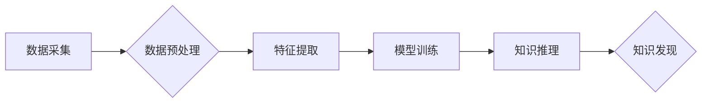

                 

## 知识发现引擎助力程序员职业发展

> 关键词：知识发现引擎、程序员职业发展、代码分析、学习推荐、个性化学习、人工智能、软件工程

## 1. 背景介绍

在当今科技飞速发展的时代，软件开发行业竞争日益激烈。程序员需要不断学习新技术、掌握新技能，才能保持竞争力，实现职业发展。传统的学习方式，例如阅读书籍、参加培训课程，虽然有效，但效率有限，难以满足程序员个性化学习的需求。

知识发现引擎 (Knowledge Discovery Engine，简称 KDE) 作为一种人工智能技术，能够从海量数据中挖掘出隐藏的知识和模式。近年来，KDE 在软件工程领域得到了广泛应用，例如代码分析、缺陷预测、软件推荐等。

## 2. 核心概念与联系

知识发现引擎的核心是利用机器学习算法从数据中学习知识。它通常包含以下几个关键模块：

* **数据采集:** 从各种数据源，例如代码库、文档、论坛等，收集相关数据。
* **数据预处理:** 对收集到的数据进行清洗、转换、格式化等处理，使其适合机器学习算法的训练。
* **特征提取:** 从数据中提取有价值的特征，例如代码结构、语法、注释等，这些特征可以用来描述代码的性质和行为。
* **模型训练:** 利用机器学习算法，例如决策树、支持向量机、神经网络等，对提取的特征进行训练，建立知识模型。
* **知识推理:** 基于训练好的知识模型，对新的数据进行分析，发现新的知识和模式。

**Mermaid 流程图:**



## 3. 核心算法原理 & 具体操作步骤

### 3.1  算法原理概述

知识发现引擎常用的算法包括：

* **关联规则挖掘:** 发现数据中频繁出现的项集之间的关联关系，例如哪些代码片段经常一起出现。
* **分类算法:** 将数据分类到不同的类别，例如根据代码风格、功能等进行分类。
* **聚类算法:** 将数据聚类到不同的组，例如根据代码相似度进行聚类。
* **预测算法:** 预测未来事件的发生概率，例如预测代码中的缺陷。

### 3.2  算法步骤详解

以关联规则挖掘为例，其具体步骤如下：

1. **构建频繁项集:** 从数据中找出频繁出现的项集，例如代码片段、函数调用等。
2. **计算支持度:** 计算每个项集在整个数据集中的出现频率，称为支持度。
3. **计算置信度:** 计算两个项集之间的关联强度，称为置信度。
4. **筛选关联规则:** 根据预设的支持度和置信度阈值，筛选出满足条件的关联规则。

### 3.3  算法优缺点

**优点:**

* 能够发现数据中隐藏的知识和模式。
* 可以帮助程序员理解代码结构、行为和关系。
* 可以用于代码推荐、缺陷预测、代码重构等任务。

**缺点:**

* 需要大量的训练数据。
* 算法的复杂度较高，需要专业的知识和技能。
* 发现的知识可能存在局限性，需要结合实际情况进行判断。

### 3.4  算法应用领域

* **代码分析:** 分析代码结构、语法、风格等，发现潜在的缺陷和问题。
* **代码推荐:** 根据程序员的编程习惯和需求，推荐相关的代码片段和库。
* **缺陷预测:** 预测代码中的缺陷，帮助程序员提前进行修复。
* **代码重构:** 分析代码结构，建议进行重构，提高代码质量和可维护性。

## 4. 数学模型和公式 & 详细讲解 & 举例说明

### 4.1  数学模型构建

关联规则挖掘的数学模型通常基于**支持度**和**置信度**的概念。

* **支持度:** 某个项集在整个数据集中的出现频率，用公式表示为：

 $$
 Support(X) = \frac{Count(X)}{Total\_Count}
 $$

其中，$X$ 是一个项集，$Count(X)$ 是 $X$ 在数据集中的出现次数，$Total\_Count$ 是数据集的总记录数。

* **置信度:** 两个项集之间的关联强度，用公式表示为：

 $$
 Confidence(X \rightarrow Y) = \frac{Count(X \cup Y)}{Count(X)}
 $$

其中，$X$ 和 $Y$ 是两个项集，$Count(X \cup Y)$ 是 $X$ 和 $Y$ 同时出现的次数，$Count(X)$ 是 $X$ 出现的次数。

### 4.2  公式推导过程

支持度和置信度的公式推导过程相对简单，主要基于概率论的计算。

* **支持度:** 

支持度本质上是某个项集在整个数据集中的概率。

* **置信度:** 

置信度可以理解为，在 $X$ 出现的情况下，$Y$ 出现的概率。

### 4.3  案例分析与讲解

假设我们有一个数据集，包含以下代码片段：

* 代码片段 A: 函数调用 `print()`
* 代码片段 B: 函数调用 `input()`
* 代码片段 C: 函数调用 `while()`

如果我们发现代码片段 A 和 B 经常一起出现，并且支持度高于某个阈值，那么我们可以推断出这两个代码片段之间存在关联关系。

例如，如果 $Count(A \cup B) = 100$，$Count(A) = 200$，那么 $Confidence(A \rightarrow B) = \frac{100}{200} = 0.5$。

## 5. 项目实践：代码实例和详细解释说明

### 5.1  开发环境搭建

* **操作系统:** Linux 或 macOS
* **编程语言:** Python
* **库:** pandas, scikit-learn, matplotlib

### 5.2  源代码详细实现

```python
import pandas as pd
from sklearn.feature_extraction.text import TfidfVectorizer
from sklearn.metrics.pairwise import cosine_similarity

# 加载代码数据
data = pd.read_csv("code_data.csv")

# 提取代码文本
code_text = data["code"]

# 使用 TF-IDF 向量化代码文本
vectorizer = TfidfVectorizer()
code_vectors = vectorizer.fit_transform(code_text)

# 计算代码之间的余弦相似度
similarity_matrix = cosine_similarity(code_vectors)

# 寻找相似度最高的代码片段
for i in range(len(code_text)):
    similar_indices = similarity_matrix[i].argsort()[:-6:-1]
    similar_codes = [code_text[j] for j in similar_indices]
    print(f"代码片段 {i}: {code_text[i]}")
    print(f"相似代码片段: {similar_codes}")
```

### 5.3  代码解读与分析

* **数据加载:** 从 CSV 文件中加载代码数据。
* **文本提取:** 从代码数据中提取代码文本。
* **TF-IDF 向量化:** 使用 TF-IDF 向量化技术将代码文本转换为向量表示。
* **余弦相似度计算:** 计算代码向量之间的余弦相似度，表示代码之间的相似程度。
* **相似代码查找:** 寻找相似度最高的代码片段。

### 5.4  运行结果展示

运行代码后，会输出每个代码片段及其相似代码片段的列表。

## 6. 实际应用场景

* **代码推荐:** 根据程序员的编程习惯和需求，推荐相关的代码片段和库。
* **代码复用:** 帮助程序员发现和复用已有代码，提高开发效率。
* **代码缺陷预测:** 分析代码结构和行为，预测代码中的潜在缺陷。
* **代码重构:** 分析代码结构，建议进行重构，提高代码质量和可维护性。

### 6.4  未来应用展望

* **个性化学习:** 基于程序员的学习记录和编程习惯，推荐个性化的学习资源和训练计划。
* **代码生成:** 利用知识发现引擎，自动生成代码片段，帮助程序员快速完成开发任务。
* **代码安全分析:** 分析代码中的安全漏洞，帮助程序员提高代码安全性。

## 7. 工具和资源推荐

### 7.1  学习资源推荐

* **书籍:**
    * "Data Mining: Concepts and Techniques" by Jiawei Han, Micheline Kamber, and Jian Pei
    * "Introduction to Machine Learning" by Ethem Alpaydin
* **在线课程:**
    * Coursera: Machine Learning by Andrew Ng
    * edX: Data Mining by University of California, San Diego

### 7.2  开发工具推荐

* **Python:** 
    * pandas: 数据处理和分析
    * scikit-learn: 机器学习算法
    * matplotlib: 数据可视化
* **其他工具:**
    * Apache Spark: 大数据处理框架
    * TensorFlow: 深度学习框架

### 7.3  相关论文推荐

* "Frequent Pattern Mining: Mining Association Rules" by Rakesh Agrawal, Tomasz Imielinski, and Arun Swami
* "A Survey of Association Rule Mining Algorithms" by Jian Pei, Jiawei Han, and Beishui Wang

## 8. 总结：未来发展趋势与挑战

### 8.1  研究成果总结

知识发现引擎在软件工程领域取得了显著成果，例如代码分析、缺陷预测、代码推荐等。

### 8.2  未来发展趋势

* **深度学习:** 利用深度学习算法，挖掘更深层次的代码知识和模式。
* **自然语言处理:** 将自然语言处理技术应用于代码分析，提高代码理解和分析能力。
* **云计算:** 利用云计算平台，构建更强大的知识发现引擎，处理更大的代码数据集。

### 8.3  面临的挑战

* **数据质量:** 知识发现引擎依赖于高质量的数据，而代码数据往往存在噪声和不完整性。
* **算法复杂度:** 一些知识发现算法的复杂度较高，需要更强大的计算资源。
* **解释性:** 知识发现引擎发现的知识往往难以解释，需要进一步的研究和改进。

### 8.4  研究展望

未来，知识发现引擎将继续在软件工程领域发挥重要作用，帮助程序员提高开发效率、提高代码质量、实现更智能的软件开发。


## 9. 附录：常见问题与解答

* **Q1: 知识发现引擎需要多少数据才能有效工作？**

* **A1:** 知识发现引擎需要大量的训练数据才能有效工作。数据量的大小取决于具体的算法和应用场景。一般来说，需要至少几千条数据才能开始训练。

* **Q2: 知识发现引擎可以替代程序员吗？**

* **A2:** 知识发现引擎可以帮助程序员提高开发效率，但不能完全替代程序员。程序员仍然需要进行设计、规划、测试等工作，而知识发现引擎只能提供辅助支持。

* **Q3: 知识发现引擎的应用场景有哪些？**

* **A3:** 知识发现引擎的应用场景非常广泛，例如代码分析、缺陷预测、代码推荐、代码重构等。

* **Q4: 如何选择合适的知识发现引擎？**

* **A4:** 选择合适的知识发现引擎需要根据具体的应用场景和需求进行选择。需要考虑算法的性能、数据量、计算资源等因素。

* **Q5: 知识发现引擎的未来发展趋势是什么？**

* **A5:** 知识发现引擎的未来发展趋势包括深度学习、自然语言处理、云计算等。这些技术将使知识发现引擎更加智能、高效、强大。


作者：禅与计算机程序设计艺术 / Zen and the Art of Computer Programming 
<end_of_turn>

