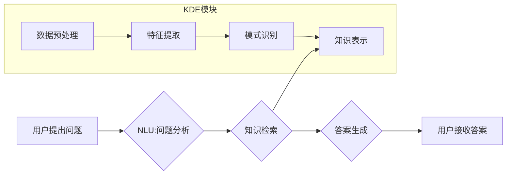

                 

# 知识发现引擎的智能问答系统集成

> 关键词：知识发现引擎、智能问答系统、自然语言处理、机器学习、深度学习、知识图谱、问答系统架构、应用场景

## 1. 背景介绍

随着海量数据的爆炸式增长，从数据中提取有价值的知识变得越来越重要。知识发现引擎 (Knowledge Discovery Engine, KDE) 正是在此背景下应运而生，它旨在从海量数据中自动发现模式、趋势和关系，并将其转化为可理解和可利用的知识。智能问答系统 (Intelligent Question Answering System, IQA) 则致力于理解用户自然语言问题，并从知识库中准确地找到答案。

将知识发现引擎与智能问答系统集成，可以构建更强大的知识获取和应用平台。这种集成可以实现以下优势：

* **更精准的知识发现:** KDE 可以从数据中发现更深层次、更细粒度的知识，为 IQA 提供更丰富、更准确的知识基础。
* **更智能的回答:** IQA 可以利用 KDE 发现的知识，更好地理解用户问题，并给出更全面、更精准的答案。
* **更灵活的应用:** 集成后的系统可以支持更复杂、更灵活的知识应用场景，例如个性化推荐、智能决策支持等。

## 2. 核心概念与联系

**2.1 知识发现引擎 (KDE)**

KDE 是一个用于从数据中发现知识的系统，它通常包含以下几个核心模块：

* **数据预处理:** 对原始数据进行清洗、转换和格式化，使其适合后续的知识发现过程。
* **特征提取:** 从数据中提取有意义的特征，例如文本中的关键词、图像中的物体、时间序列中的趋势等。
* **模式识别:** 利用机器学习、深度学习等算法，从特征数据中发现模式、趋势和关系。
* **知识表示:** 将发现的知识转化为可理解和可利用的形式，例如知识图谱、规则等。

**2.2 智能问答系统 (IQA)**

IQA 是一个能够理解用户自然语言问题，并从知识库中找到答案的系统。它通常包含以下几个核心模块：

* **自然语言理解 (NLU):** 对用户问题进行分析，识别出问题类型、关键信息等。
* **知识表示:** 将知识库中的知识表示为可查询的形式，例如知识图谱、语义网络等。
* **知识检索:** 根据用户问题，从知识库中检索出相关知识。
* **答案生成:** 根据检索到的知识，生成自然语言形式的答案。

**2.3 KDE与IQA的集成**

将 KDE 与 IQA 集成，可以实现以下流程：



## 3. 核心算法原理 & 具体操作步骤

### 3.1 算法原理概述

KDE 和 IQA 的核心算法原理主要包括：

* **机器学习:** 利用统计方法和算法，从数据中学习模式和规律。常用的机器学习算法包括决策树、支持向量机、神经网络等。
* **深度学习:** 一种更高级的机器学习方法，利用多层神经网络来学习更复杂的模式和关系。
* **自然语言处理 (NLP):** 处理和理解自然语言文本，包括词法分析、语法分析、语义分析等。
* **知识图谱:** 将知识表示为图结构，其中节点代表实体，边代表关系。

### 3.2 算法步骤详解

**3.2.1 KDE 算法步骤:**

1. **数据收集和预处理:** 收集相关数据，并进行清洗、转换和格式化。
2. **特征提取:** 利用 NLP 技术和机器学习算法，从数据中提取有意义的特征。
3. **模式识别:** 利用机器学习算法，例如决策树、支持向量机、神经网络等，从特征数据中发现模式、趋势和关系。
4. **知识表示:** 将发现的知识转化为可理解和可利用的形式，例如知识图谱、规则等。

**3.2.2 IQA 算法步骤:**

1. **用户问题接收:** 收集用户提出的自然语言问题。
2. **自然语言理解 (NLU):** 对用户问题进行分析，识别出问题类型、关键信息等。
3. **知识检索:** 根据用户问题，从知识库中检索出相关知识。
4. **答案生成:** 根据检索到的知识，生成自然语言形式的答案。

### 3.3 算法优缺点

**3.3.1 KDE 算法:**

* **优点:** 可以从海量数据中发现隐藏的知识，并将其转化为可理解的形式。
* **缺点:** 需要大量的训练数据和计算资源，并且发现的知识可能难以解释和理解。

**3.3.2 IQA 算法:**

* **优点:** 可以理解用户自然语言问题，并给出准确的答案。
* **缺点:** 需要庞大的知识库，并且难以处理复杂、开放式的问答问题。

### 3.4 算法应用领域

* **KDE:** 医疗诊断、金融风险评估、市场营销分析、科学研究等。
* **IQA:** 智能客服、搜索引擎、教育辅助系统、游戏等。

## 4. 数学模型和公式 & 详细讲解 & 举例说明

### 4.1 数学模型构建

**4.1.1 知识图谱表示:**

知识图谱可以表示为一个三元组 (实体, 关系, 实体)，例如 (张三, 工作于, 公司A)。

**4.1.2 向量化表示:**

实体和关系可以分别用向量表示，例如实体可以用词嵌入技术表示，关系可以用关系向量表示。

**4.1.3 知识推理:**

可以使用逻辑推理规则或深度学习模型进行知识推理，例如从已知知识推导出新的知识。

### 4.2 公式推导过程

**4.2.1 向量化知识表示:**

假设实体 $e_i$ 的词嵌入向量为 $v_i$，关系 $r$ 的关系向量为 $v_r$，则实体 $e_i$ 与关系 $r$ 结合的向量表示为：

$$v_{e_i, r} = v_i + v_r$$

**4.2.2 知识图谱嵌入:**

可以使用 TransE 等模型进行知识图谱嵌入，将实体和关系映射到低维向量空间，并学习实体和关系之间的语义关系。

### 4.3 案例分析与讲解

**4.3.1 实体关系推理:**

假设知识图谱中包含以下三元组:

* (张三, 工作于, 公司A)
* (公司A, 位于, 北京)

可以使用知识推理规则或深度学习模型推导出新的知识:

* (张三, 位于, 北京)

**4.3.2 知识问答:**

用户提问: “张三在哪里工作？”

IQA 系统可以根据知识图谱中的信息，找到答案: “张三在公司A工作”。

## 5. 项目实践：代码实例和详细解释说明

### 5.1 开发环境搭建

* **操作系统:** Ubuntu 20.04 LTS
* **编程语言:** Python 3.8
* **深度学习框架:** TensorFlow 2.0
* **其他工具:** Jupyter Notebook, Git

### 5.2 源代码详细实现

```python
# 知识图谱构建
import networkx as nx

# 创建知识图谱
graph = nx.DiGraph()

# 添加实体和关系
graph.add_node("张三")
graph.add_node("公司A")
graph.add_node("北京")
graph.add_edge("张三", "工作于", "公司A")
graph.add_edge("公司A", "位于", "北京")

# 知识检索
def retrieve_knowledge(question):
    # ...

# 答案生成
def generate_answer(knowledge):
    # ...
```

### 5.3 代码解读与分析

* **知识图谱构建:** 使用 NetworkX 库构建知识图谱，并添加实体和关系。
* **知识检索:** 根据用户问题，从知识图谱中检索出相关知识。
* **答案生成:** 根据检索到的知识，生成自然语言形式的答案。

### 5.4 运行结果展示

当用户提问 “张三在哪里工作？” 时，系统会从知识图谱中检索出相关知识，并生成答案 “张三在公司A工作”。

## 6. 实际应用场景

**6.1 智能客服:**

KDE 可以帮助智能客服系统发现用户常见问题和解决方案，提高客服效率。

**6.2 搜索引擎:**

KDE 可以帮助搜索引擎更好地理解用户搜索意图，并提供更精准的搜索结果。

**6.3 教育辅助系统:**

KDE 可以帮助教育辅助系统自动生成个性化学习内容，并提供智能答疑服务。

**6.4 未来应用展望:**

* **个性化推荐:** KDE 可以分析用户的兴趣和偏好，并推荐个性化的商品、服务或内容。
* **智能决策支持:** KDE 可以帮助企业分析数据，并提供智能决策建议。
* **医疗诊断辅助:** KDE 可以帮助医生分析患者数据，并辅助诊断疾病。

## 7. 工具和资源推荐

### 7.1 学习资源推荐

* **书籍:**
    * “深度学习” by Ian Goodfellow, Yoshua Bengio, and Aaron Courville
    * “自然语言处理” by Jurafsky and Martin
* **在线课程:**
    * Coursera: Deep Learning Specialization
    * Udacity: Natural Language Processing Nanodegree

### 7.2 开发工具推荐

* **Python:** 
    * TensorFlow
    * PyTorch
    * SpaCy
* **知识图谱工具:**
    * Neo4j
    * RDF4J

### 7.3 相关论文推荐

* “Knowledge Graph Embedding: A Survey” by Wang et al.
* “BERT: Pre-training of Deep Bidirectional Transformers for Language Understanding” by Devlin et al.

## 8. 总结：未来发展趋势与挑战

### 8.1 研究成果总结

KDE 和 IQA 的集成取得了显著的成果，为知识发现和应用提供了新的途径。

### 8.2 未来发展趋势

* **更强大的知识表示:** 探索更灵活、更丰富的知识表示形式，例如图神经网络、知识图谱融合等。
* **更智能的推理能力:** 开发更强大的知识推理模型，能够处理更复杂、更开放式的问答问题。
* **更个性化的应用:** 将 KDE 和 IQA 应用于更个性化的场景，例如个性化推荐、智能教育等。

### 8.3 面临的挑战

* **数据质量:** KDE 和 IQA 的性能依赖于数据质量，如何获取高质量的知识数据仍然是一个挑战。
* **知识可解释性:** 发现的知识可能难以解释和理解，如何提高知识可解释性是一个重要问题。
* **计算资源:** KDE 和 IQA 的训练和推理需要大量的计算资源，如何降低计算成本是一个关键挑战。

### 8.4 研究展望

未来，KDE 和 IQA 将继续朝着更智能、更强大、更可解释的方向发展，为人类提供更便捷、更智能的知识获取和应用体验。

## 9. 附录：常见问题与解答

**9.1 KDE 和 IQA 的区别是什么？**

KDE 主要用于从数据中发现知识，而 IQA 主要用于理解用户问题并给出答案。

**9.2 KDE 和 IQA 的集成有什么优势？**

KDE 和 IQA 的集成可以实现更精准的知识发现、更智能的回答和更灵活的应用。

**9.3 如何构建一个 KDE 系统？**

构建一个 KDE 系统需要以下步骤: 数据收集和预处理、特征提取、模式识别、知识表示。

**9.4 如何构建一个 IQA 系统？**

构建一个 IQA 系统需要以下步骤: 自然语言理解、知识表示、知识检索、答案生成。


作者：禅与计算机程序设计艺术 / Zen and the Art of Computer Programming 
<end_of_turn>

