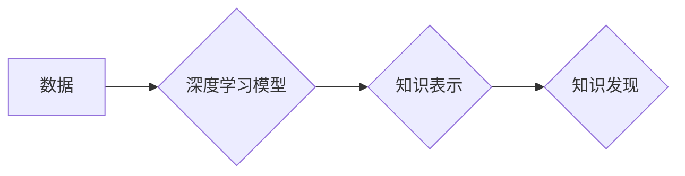

                 

## 知识发现引擎的深度学习应用

> 关键词：深度学习、知识发现、知识图谱、自然语言处理、推荐系统、机器学习、数据挖掘

## 1. 背景介绍

在海量数据时代，从海量数据中挖掘有价值的知识已成为一个重要的研究方向。传统的数据挖掘方法主要依赖于统计学和规则挖掘，但对于复杂、非结构化的数据，其效果往往有限。深度学习作为一种强大的机器学习方法，凭借其强大的学习能力和对复杂模式的建模能力，为知识发现带来了新的机遇。

知识发现引擎（Knowledge Discovery Engine，KDE）是专门用于从数据中发现知识的系统。传统的KDE主要依靠规则引擎和统计模型，但深度学习的应用为KDE带来了新的可能性。深度学习可以自动学习数据中的复杂模式和关系，从而发现更深层次、更具洞察力的知识。

## 2. 核心概念与联系

### 2.1 知识发现

知识发现是指从数据中提取、识别和解释有价值的知识的过程。它涉及到数据清洗、数据预处理、数据分析、知识表示和知识解释等多个步骤。

### 2.2 深度学习

深度学习是一种基于人工神经网络的机器学习方法。它通过多层神经网络来学习数据中的复杂模式和关系。深度学习模型可以自动学习特征，无需人工特征工程，这使其在处理复杂数据方面具有优势。

### 2.3 知识图谱

知识图谱是一种结构化的知识表示形式，它以实体和关系为节点，通过连接关系来表示知识。知识图谱可以帮助我们更好地理解和组织知识，并为知识发现提供更丰富的语义信息。

**Mermaid 流程图**



## 3. 核心算法原理 & 具体操作步骤

### 3.1 算法原理概述

深度学习在知识发现中的应用主要包括以下几种算法：

* **图神经网络 (Graph Neural Networks, GNN)**：GNN 可以学习知识图谱中的实体和关系之间的复杂关系，用于知识推理、链接预测等任务。
* **自然语言处理 (Natural Language Processing, NLP)**：NLP 可以用于从文本数据中提取知识，例如关系抽取、文本分类、问答系统等。
* **深度嵌入 (Deep Embedding)**：深度嵌入可以将实体和关系映射到低维向量空间，从而捕捉它们的语义相似性和关系模式。

### 3.2 算法步骤详解

以图神经网络为例，其在知识发现中的应用步骤如下：

1. **构建知识图谱**: 将数据转化为知识图谱的形式，包括实体、关系和属性。
2. **特征提取**: 对知识图谱中的实体和关系进行特征提取，例如实体的类型、属性值、关系的类型等。
3. **模型训练**: 使用图神经网络模型对知识图谱进行训练，学习实体和关系之间的关系模式。
4. **知识推理**: 利用训练好的模型进行知识推理，例如预测缺失的关系、发现新的实体关系等。

### 3.3 算法优缺点

**优点:**

* 能够学习复杂数据中的复杂模式和关系。
* 自动学习特征，无需人工特征工程。
* 能够处理海量数据。

**缺点:**

* 需要大量的训练数据。
* 模型训练时间较长。
* 难以解释模型的决策过程。

### 3.4 算法应用领域

* **推荐系统**: 基于用户行为和商品属性的知识图谱，构建个性化推荐系统。
* **搜索引擎**: 利用知识图谱理解用户查询意图，提供更精准的搜索结果。
* **问答系统**: 基于知识图谱构建问答系统，能够回答用户关于特定领域的知识问题。
* **医疗诊断**: 利用医学知识图谱辅助医生进行诊断，提高诊断准确率。

## 4. 数学模型和公式 & 详细讲解 & 举例说明

### 4.1 数学模型构建

图神经网络的数学模型主要基于图卷积操作。图卷积操作可以将图结构信息融入到神经网络中，从而学习图结构中的特征和关系。

**图卷积操作公式:**

$$
h_i^{(l+1)} = \sigma \left( \sum_{j \in N(i)} \frac{e_{ij}}{ \sqrt{d_i d_j}} W^{(l)} h_j^{(l)} + b^{(l)} \right)
$$

其中:

* $h_i^{(l)}$ 表示节点 $i$ 在第 $l$ 层的特征向量。
* $N(i)$ 表示节点 $i$ 的邻居节点集合。
* $e_{ij}$ 表示节点 $i$ 和节点 $j$ 之间的边权重。
* $d_i$ 表示节点 $i$ 的度数。
* $W^{(l)}$ 表示第 $l$ 层的权重矩阵。
* $b^{(l)}$ 表示第 $l$ 层的偏置向量。
* $\sigma$ 表示激活函数。

### 4.2 公式推导过程

图卷积操作的推导过程基于对图结构的表示和对特征向量的线性变换。

1. **图结构表示**: 图结构可以表示为一个邻接矩阵，其中每个元素表示两个节点之间是否存在边。
2. **特征向量线性变换**: 对每个节点的特征向量进行线性变换，得到新的特征向量。
3. **邻居节点信息聚合**: 将邻居节点的特征向量进行加权求和，并将权重设置为邻居节点之间的边权重。
4. **激活函数**: 对聚合后的特征向量应用激活函数，得到最终的节点特征向量。

### 4.3 案例分析与讲解

以社交网络为例，我们可以使用图神经网络来学习用户之间的关系和兴趣。

1. **构建知识图谱**: 将社交网络的用户和关系转化为知识图谱，其中用户为实体，关注关系为关系。
2. **特征提取**: 对用户进行特征提取，例如用户年龄、性别、兴趣爱好等。
3. **模型训练**: 使用图神经网络模型对知识图谱进行训练，学习用户之间的关系和兴趣模式。
4. **知识推理**: 利用训练好的模型进行知识推理，例如预测用户之间的关系、推荐用户感兴趣的内容等。

## 5. 项目实践：代码实例和详细解释说明

### 5.1 开发环境搭建

* Python 3.6+
* TensorFlow/PyTorch
* Jupyter Notebook

### 5.2 源代码详细实现

```python
import tensorflow as tf

# 定义图神经网络模型
class GNN(tf.keras.Model):
    def __init__(self, num_features, hidden_dim, num_classes):
        super(GNN, self).__init__()
        self.conv1 = tf.keras.layers.GraphConv(hidden_dim, activation='relu')
        self.conv2 = tf.keras.layers.GraphConv(num_classes, activation='softmax')

    def call(self, inputs):
        x = self.conv1(inputs)
        x = self.conv2(x)
        return x

# 构建图数据
# ...

# 实例化模型
model = GNN(num_features, hidden_dim, num_classes)

# 编译模型
model.compile(optimizer='adam', loss='categorical_crossentropy', metrics=['accuracy'])

# 训练模型
model.fit(graph_data, labels, epochs=10)

# 预测结果
predictions = model.predict(graph_data)
```

### 5.3 代码解读与分析

* **定义图神经网络模型**: 使用 TensorFlow 的 `GraphConv` 层构建图神经网络模型。
* **构建图数据**: 将社交网络的用户和关系转化为图数据格式。
* **实例化模型**: 实例化图神经网络模型。
* **编译模型**: 使用 Adam 优化器、交叉熵损失函数和准确率指标编译模型。
* **训练模型**: 使用训练数据训练模型。
* **预测结果**: 使用训练好的模型预测新的图数据。

### 5.4 运行结果展示

* 训练过程中，可以监控模型的损失值和准确率。
* 训练完成后，可以评估模型的性能，例如在测试集上的准确率。

## 6. 实际应用场景

### 6.1 知识图谱构建

深度学习可以用于自动构建知识图谱，例如从文本数据中提取实体和关系。

### 6.2 关系抽取

深度学习可以用于关系抽取任务，例如从文本中识别实体之间的关系。

### 6.3 知识推理

深度学习可以用于知识推理任务，例如预测缺失的关系、发现新的实体关系。

### 6.4 未来应用展望

* **个性化教育**: 基于学生知识图谱，构建个性化学习路径和推荐学习资源。
* **智能医疗**: 利用医学知识图谱辅助医生诊断疾病、制定治疗方案。
* **智慧城市**: 利用城市知识图谱进行城市规划、交通管理、公共安全等方面的决策支持。

## 7. 工具和资源推荐

### 7.1 学习资源推荐

* **书籍**:
    * Deep Learning with Python by Francois Chollet
    * Graph Neural Networks by William L. Hamilton
* **在线课程**:
    * Deep Learning Specialization by Andrew Ng (Coursera)
    * Graph Neural Networks Specialization by David Duvenaud (DeepLearning.AI)

### 7.2 开发工具推荐

* **TensorFlow**: 开源深度学习框架，支持图神经网络模型的构建和训练。
* **PyTorch**: 开源深度学习框架，也支持图神经网络模型的构建和训练。
* **DGL**: 图神经网络深度学习库，提供图数据处理和模型训练的工具。

### 7.3 相关论文推荐

* **Semi-Supervised Classification with Graph Convolutional Networks** by Thomas Kipf and Max Welling
* **Graph Attention Networks** by  Petar Veličković et al.
* **Inductive Representation Learning on Large Graphs** by  William L. Hamilton et al.

## 8. 总结：未来发展趋势与挑战

### 8.1 研究成果总结

深度学习在知识发现领域取得了显著的成果，例如在知识图谱构建、关系抽取、知识推理等任务上取得了优异的性能。

### 8.2 未来发展趋势

* **更强大的图神经网络模型**: 研究更强大的图神经网络模型，例如能够处理更大规模图数据的模型、能够学习更复杂关系模式的模型。
* **跨模态知识发现**: 将深度学习应用于跨模态知识发现，例如从文本、图像、音频等多种数据源中提取知识。
* **可解释性增强**: 研究更可解释的深度学习模型，以便更好地理解模型的决策过程。

### 8.3 面临的挑战

* **数据稀缺**: 许多领域的数据稀缺，这使得深度学习模型难以训练。
* **模型复杂度**: 深度学习模型的复杂度较高，训练和部署成本较高。
* **可解释性**: 深度学习模型的决策过程难以解释，这使得其在一些应用场景中难以接受。

### 8.4 研究展望

未来，深度学习在知识发现领域将继续发挥重要作用，并推动知识发现技术的进步。


## 9. 附录：常见问题与解答

* **Q1: 深度学习和传统数据挖掘方法相比有什么优势？**

* **A1:** 深度学习能够自动学习特征，无需人工特征工程，并且能够处理复杂数据，例如文本、图像等。

* **Q2: 如何选择合适的深度学习模型？**

* **A2:** 选择合适的深度学习模型需要根据具体任务和数据特点进行选择。例如，对于关系抽取任务，可以使用图神经网络模型；对于文本分类任务，可以使用循环神经网络模型。

* **Q3: 如何解决深度学习模型训练数据稀缺的问题？**

* **A3:** 可以使用半监督学习、迁移学习等方法来解决数据稀缺问题。

* **Q4: 如何提高深度学习模型的可解释性？**

* **A4:** 可以使用可解释机器学习方法，例如LIME、SHAP等，来解释模型的决策过程。


作者：禅与计算机程序设计艺术 / Zen and the Art of Computer Programming 
<end_of_turn>

