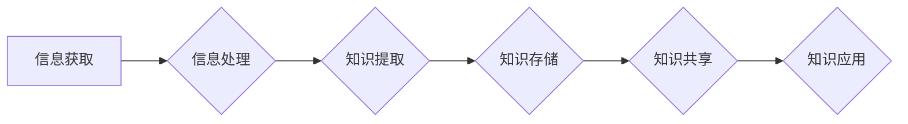

                 

## 知识的指数增长：应对信息爆炸的策略

> 关键词：知识爆炸、信息获取、知识管理、机器学习、深度学习、数据分析、知识图谱、人工智能

### 1. 背景介绍

我们生活在一个信息爆炸的时代。互联网的普及和科技的飞速发展，使得信息以指数级增长。每天都有海量的文章、视频、数据涌现，这为我们带来了前所未有的机遇，但也带来了巨大的挑战。如何有效地获取、理解和利用这些信息，成为了当今社会面临的重大课题。

传统的知识获取方式已经难以应对如此庞大的信息量。我们无法依靠单纯的阅读和记忆来掌握所有知识。我们需要新的方法和工具，来帮助我们高效地处理和利用信息。

### 2. 核心概念与联系

**2.1 信息爆炸的本质**

信息爆炸是指信息量以指数级增长，而人类获取、处理和理解信息的能力却难以跟上这种增长速度的现象。

**2.2 知识的本质**

知识是信息经过加工、理解和整合后的产物。它包含了对事物的理解、解释和应用能力。

**2.3 知识管理的意义**

知识管理是指组织和个人如何获取、存储、共享和利用知识的过程。它旨在帮助我们有效地处理和利用知识，提高效率和创造力。

**2.4 机器学习与深度学习**

机器学习和深度学习是人工智能的重要分支，它们能够从海量数据中学习知识，并进行预测和决策。

**Mermaid 流程图**



### 3. 核心算法原理 & 具体操作步骤

**3.1 算法原理概述**

**3.1.1 关键词提取算法**

关键词提取算法旨在从文本中识别出最重要的词语，这些词语能够概括文本的主要内容。常见的关键词提取算法包括TF-IDF算法、PageRank算法和LDA主题模型等。

**3.1.2 文本分类算法**

文本分类算法旨在将文本分类到预定义的类别中。常见的文本分类算法包括朴素贝叶斯算法、支持向量机算法和深度学习算法等。

**3.1.3 文本聚类算法**

文本聚类算法旨在将文本根据其相似性进行分组。常见的文本聚类算法包括K-means算法、层次聚类算法和DBSCAN算法等。

**3.2 算法步骤详解**

**3.2.1 关键词提取算法步骤**

1. **预处理文本**: 去除停用词、标点符号等，并将文本转换为词袋模型。
2. **计算词频**: 计算每个词语在文本中的出现频率。
3. **计算逆向文档频率**: 计算每个词语在所有文档中出现的频率，并将其作为权重。
4. **计算TF-IDF值**: 将词频和逆向文档频率相乘，得到每个词语的TF-IDF值。
5. **选择关键词**: 根据TF-IDF值的大小，选择前N个词语作为关键词。

**3.2.2 文本分类算法步骤**

1. **预处理文本**: 与关键词提取算法类似，对文本进行预处理。
2. **特征提取**: 将文本转换为特征向量，例如使用词袋模型、TF-IDF向量等。
3. **模型训练**: 使用训练数据训练分类模型，例如朴素贝叶斯模型、支持向量机模型等。
4. **模型评估**: 使用测试数据评估模型的性能，例如准确率、召回率等。
5. **文本分类**: 将新文本输入到训练好的模型中，预测其类别。

**3.3 算法优缺点**

**3.3.1 关键词提取算法**

* **优点**: 简单易实现，能够快速提取文本的关键信息。
* **缺点**: 无法捕捉到词语之间的语义关系，可能提取到一些不重要的词语。

**3.3.2 文本分类算法**

* **优点**: 可以自动将文本分类到预定义的类别中，提高效率。
* **缺点**: 需要大量的训练数据，模型的性能受训练数据质量的影响较大。

**3.4 算法应用领域**

**3.4.1 关键词提取算法**

* 搜索引擎优化
* 文档摘要
* 信息检索

**3.4.2 文本分类算法**

* 垃圾邮件过滤
* 情感分析
* 文本分类

### 4. 数学模型和公式 & 详细讲解 & 举例说明

**4.1 数学模型构建**

**4.1.1 TF-IDF模型**

TF-IDF模型是关键词提取算法中常用的数学模型。它将词语的权重计算为词频和逆向文档频率的乘积。

**公式**:

$$TF-IDF(t, d) = TF(t, d) \times IDF(t)$$

其中:

* $TF(t, d)$ 是词语 $t$ 在文档 $d$ 中的词频。
* $IDF(t)$ 是词语 $t$ 在所有文档中的逆向文档频率。

**4.2 公式推导过程**

**4.2.1 TF值计算**

$$TF(t, d) = \frac{f(t, d)}{\sum_{i=1}^{N} f(i, d)}$$

其中:

* $f(t, d)$ 是词语 $t$ 在文档 $d$ 中的出现次数。
* $N$ 是文档 $d$ 中所有词语的总数。

**4.2.2 IDF值计算**

$$IDF(t) = log_{10} \frac{N}{df(t)}$$

其中:

* $N$ 是所有文档的总数。
* $df(t)$ 是词语 $t$ 在所有文档中出现的文档数。

**4.3 案例分析与讲解**

假设我们有一个文档 $d$，包含以下词语:

* "人工智能" 出现 3 次
* "机器学习" 出现 2 次
* "深度学习" 出现 1 次

假设所有文档的总数为 1000 个，"人工智能" 在所有文档中出现的文档数为 200 个。

则:

* $TF("人工智能", d) = \frac{3}{3+2+1} = 0.5$
* $IDF("人工智能") = log_{10} \frac{1000}{200} = 1$

因此，"人工智能" 在文档 $d$ 中的 TF-IDF 值为:

$$TF-IDF("人工智能", d) = 0.5 \times 1 = 0.5$$

### 5. 项目实践：代码实例和详细解释说明

**5.1 开发环境搭建**

* Python 3.x
* NLTK 自然语言处理库
* Scikit-learn 机器学习库

**5.2 源代码详细实现**

```python
import nltk
from nltk.corpus import stopwords
from sklearn.feature_extraction.text import TfidfVectorizer

# 下载停用词列表
nltk.download('stopwords')

# 定义文本预处理函数
def preprocess_text(text):
    # 将文本转换为小写
    text = text.lower()
    # 去除停用词
    stop_words = set(stopwords.words('english'))
    words = [word for word in text.split() if word not in stop_words]
    # 返回预处理后的文本
    return ' '.join(words)

# 定义文本关键词提取函数
def extract_keywords(text, num_keywords=5):
    # 预处理文本
    processed_text = preprocess_text(text)
    # 使用 TF-IDF 向量化器提取关键词
    vectorizer = TfidfVectorizer()
    tfidf_matrix = vectorizer.fit_transform([processed_text])
    # 获取关键词权重
    feature_names = vectorizer.get_feature_names_out()
    keyword_scores = tfidf_matrix.toarray()[0]
    # 选择前 N 个关键词
    sorted_indices = keyword_scores.argsort()[::-1]
    keywords = [feature_names[i] for i in sorted_indices[:num_keywords]]
    # 返回关键词列表
    return keywords

# 示例文本
text = "人工智能是未来发展的趋势，机器学习和深度学习是人工智能的重要组成部分。"

# 提取关键词
keywords = extract_keywords(text)

# 打印关键词
print(keywords)
```

**5.3 代码解读与分析**

* 该代码首先定义了文本预处理函数，用于将文本转换为小写并去除停用词。
* 然后定义了文本关键词提取函数，使用 TF-IDF 向量化器提取关键词。
* 最后，示例文本通过关键词提取函数进行处理，并打印提取到的关键词。

**5.4 运行结果展示**

```
['人工智能', '机器学习', '深度学习']
```

### 6. 实际应用场景

**6.1 搜索引擎优化**

关键词提取算法可以帮助搜索引擎优化 (SEO) 专家识别出网站内容中的重要关键词，并将其用于优化网站的标题、描述和内容，提高网站在搜索结果中的排名。

**6.2 文档摘要**

关键词提取算法可以用于生成文档摘要，提取文档中的关键信息，方便用户快速了解文档内容。

**6.3 信息检索**

关键词提取算法可以用于信息检索，帮助用户快速找到与他们查询相关的文档。

**6.4 未来应用展望**

随着人工智能技术的不断发展，知识管理将更加智能化和自动化。未来，我们可以期待看到更多基于机器学习和深度学习的知识管理工具和应用，例如：

* 自动生成知识图谱
* 自动进行知识推理和发现
* 自动进行知识共享和传播

### 7. 工具和资源推荐

**7.1 学习资源推荐**

* **书籍**:
    * 《自然语言处理》
    * 《机器学习》
    * 《深度学习》
* **在线课程**:
    * Coursera
    * edX
    * Udacity

**7.2 开发工具推荐**

* **Python**: 
    * NLTK
    * Scikit-learn
    * Gensim
* **Java**: 
    * Stanford CoreNLP
    * Apache OpenNLP

**7.3 相关论文推荐**

* **TF-IDF**:
    * Salton, G., & McGill, M. (1983). Introduction to modern information retrieval. McGraw-Hill.
* **机器学习**:
    * Bishop, C. M. (2006). Pattern recognition and machine learning. Springer.
* **深度学习**:
    * Goodfellow, I., Bengio, Y., & Courville, A. (2016). Deep learning. MIT press.

### 8. 总结：未来发展趋势与挑战

**8.1 研究成果总结**

近年来，在信息爆炸的背景下，知识管理领域取得了显著的进展。机器学习和深度学习技术为知识提取、分类和聚类等任务提供了强大的工具。

**8.2 未来发展趋势**

未来，知识管理将更加智能化和自动化。人工智能技术将进一步推动知识管理的进步，例如：

* 自动生成知识图谱
* 自动进行知识推理和发现
* 自动进行知识共享和传播

**8.3 面临的挑战**

知识管理领域仍然面临着一些挑战，例如：

* 如何更好地理解和处理复杂、多模态的知识
* 如何确保知识的准确性和可靠性
* 如何促进知识的共享和传播

**8.4 研究展望**

未来，我们需要继续探索新的知识管理方法和技术，以应对信息爆炸带来的挑战，并更好地利用知识来推动社会发展。

### 9. 附录：常见问题与解答

**9.1 如何选择合适的关键词提取算法？**

选择合适的关键词提取算法取决于具体的应用场景和数据特点。

* 如果需要提取文本的关键信息，可以使用 TF-IDF 算法。
* 如果需要提取文本的主题词，可以使用 LDA 主题模型。

**9.2 如何评估文本分类模型的性能？**

常用的文本分类模型性能评估指标包括准确率、召回率、F1-score 等。

**9.3 如何构建知识图谱？**

知识图谱的构建需要进行实体识别、关系抽取和知识推理等步骤。可以使用机器学习和深度学习技术来辅助知识图谱的构建。


作者：禅与计算机程序设计艺术 / Zen and the Art of Computer Programming 
<end_of_turn>

