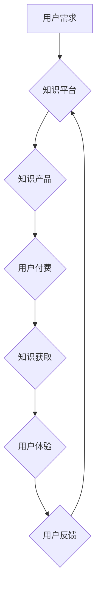

                 

## 知识经济时代下的知识付费创新商业模式运营

> 关键词：知识付费、商业模式、创新、在线教育、内容平台、用户体验、数据驱动、人工智能

### 1. 背景介绍

进入21世纪，全球经济结构发生深刻变化，知识成为重要的生产要素，知识经济时代正式到来。在这个时代，知识的获取、传播和应用成为经济发展和社会进步的关键。知识付费作为一种新型的商业模式，应运而生，它以知识为核心，通过付费的方式提供知识产品和服务，满足人们对知识的需求。

知识付费模式的兴起，得益于以下几个因素：

* **互联网技术的快速发展:** 互联网为知识的传播提供了便捷的平台，打破了地域限制，让知识更容易被获取和分享。
* **移动互联网的普及:** 智能手机的普及，使得人们随时随地可以获取知识，为知识付费模式提供了更广阔的市场空间。
* **知识经济的崛起:**  随着经济发展，人们对知识的需求不断增加，对提升自身技能和知识水平的渴望也越来越强烈。
* **内容消费升级:**  人们对内容的消费需求不断升级，追求更高质量、更个性化的知识产品和服务。

### 2. 核心概念与联系

知识付费的核心概念包括：

* **知识产品:** 指以知识为核心，通过数字化形式提供的信息产品，例如在线课程、电子书、音频课程、视频教程等。
* **付费模式:** 指用户通过支付一定的费用，获得知识产品的访问权或使用权。
* **知识平台:** 指提供知识产品和服务的平台，例如在线教育平台、内容平台、知识库等。

**知识付费模式的运作流程:**



### 3. 核心算法原理 & 具体操作步骤

知识付费模式的运营离不开数据分析和算法的驱动。

#### 3.1  算法原理概述

常用的算法包括：

* **推荐算法:**  根据用户的历史行为、偏好和兴趣，推荐相关的知识产品，提高用户匹配度和转化率。
* **个性化算法:**  根据用户的学习进度、知识水平和学习风格，定制个性化的学习路径和内容，提升用户学习体验。
* **内容分发算法:**  根据内容的质量、热度和用户反馈，优化内容的展示顺序和曝光率，提高内容的传播效果。

#### 3.2  算法步骤详解

**推荐算法为例:**

1. **数据收集:** 收集用户的行为数据，例如浏览记录、购买记录、评价记录等。
2. **特征提取:** 从用户行为数据中提取特征，例如用户偏好的知识领域、学习时间、学习方式等。
3. **模型训练:** 使用机器学习算法，训练推荐模型，学习用户与知识产品的关联关系。
4. **推荐生成:** 根据用户的特征和模型的预测结果，生成个性化的知识产品推荐列表。
5. **效果评估:**  评估推荐算法的准确性和有效性，不断优化模型参数和算法策略。

#### 3.3  算法优缺点

**优点:**

* **精准推荐:**  根据用户的个性化需求，推荐更精准的知识产品，提高用户匹配度和转化率。
* **个性化学习:**  根据用户的学习进度和风格，定制个性化的学习路径，提升用户学习体验。
* **内容优化:**  根据内容的质量和热度，优化内容的展示顺序，提高内容的传播效果。

**缺点:**

* **数据依赖:**  推荐算法依赖于海量用户行为数据，数据质量和数量直接影响算法的准确性和有效性。
* **算法黑盒:**  一些复杂的机器学习算法难以解释，难以理解算法的决策逻辑，导致用户信任度降低。
* **算法偏差:**  算法训练数据可能存在偏差，导致推荐结果存在偏见，影响用户体验。

#### 3.4  算法应用领域

推荐算法、个性化算法和内容分发算法广泛应用于：

* **在线教育平台:**  推荐课程、定制学习路径、优化课程展示。
* **内容平台:**  推荐文章、视频、音频等内容，提高用户粘性和活跃度。
* **电商平台:**  推荐商品、个性化商品展示，提高用户购买转化率。
* **社交媒体平台:**  推荐好友、推荐内容，提高用户互动和参与度。

### 4. 数学模型和公式 & 详细讲解 & 举例说明

#### 4.1  数学模型构建

推荐算法通常使用协同过滤算法，其核心思想是基于用户的相似度或物品的相似度进行推荐。

**用户-物品交互矩阵:**  

用户-物品交互矩阵是一个二维矩阵，其中每一行代表一个用户，每一列代表一个知识产品，矩阵元素表示用户对知识产品的评分或交互行为。

**相似度计算:**  

常用的相似度计算方法包括余弦相似度、皮尔逊相关系数、马氏距离等。

#### 4.2  公式推导过程

**余弦相似度:**

$$
\text{相似度} = \frac{\mathbf{u} \cdot \mathbf{v}}{\|\mathbf{u}\| \|\mathbf{v}\|}
$$

其中：

* $\mathbf{u}$ 和 $\mathbf{v}$ 是两个用户的向量表示。
* $\mathbf{u} \cdot \mathbf{v}$ 是两个向量的点积。
* $\|\mathbf{u}\|$ 和 $\|\mathbf{v}\|$ 是两个向量的模长。

#### 4.3  案例分析与讲解

假设有两个用户 A 和 B，他们的交互矩阵如下：

| 知识产品 | 用户 A | 用户 B |
|---|---|---|
| 课程 1 | 5 | 4 |
| 课程 2 | 3 | 2 |
| 课程 3 | 4 | 5 |

我们可以计算用户 A 和用户 B 的余弦相似度，例如：

$$
\text{相似度}(A,B) = \frac{(5 \times 4) + (3 \times 2) + (4 \times 5)}{\sqrt{5^2 + 3^2 + 4^2} \sqrt{4^2 + 2^2 + 5^2}}
$$

通过计算，我们可以得到用户 A 和用户 B 的相似度，从而推荐用户 B 可能感兴趣的知识产品。

### 5. 项目实践：代码实例和详细解释说明

#### 5.1  开发环境搭建

* **操作系统:**  Windows、macOS、Linux
* **编程语言:**  Python
* **框架:**  Flask、Django
* **数据库:**  MySQL、MongoDB
* **工具:**  Git、Docker

#### 5.2  源代码详细实现

以下是一个简单的 Python 代码示例，演示如何使用协同过滤算法进行知识产品推荐：

```python
import numpy as np

# 用户-物品交互矩阵
user_item_matrix = np.array([
    [5, 3, 4],
    [4, 2, 5],
    [3, 5, 4]
])

# 计算用户相似度
def calculate_similarity(user1, user2):
    return np.dot(user1, user2) / (np.linalg.norm(user1) * np.linalg.norm(user2))

# 获取用户 1 的相似用户
user1 = 0
similar_users = [calculate_similarity(user1, user) for user in user_item_matrix]
top_similar_users = np.argsort(similar_users)[::-1][:2]

# 推荐知识产品
recommended_products = []
for similar_user in top_similar_users:
    for product in range(user_item_matrix.shape[1]):
        if user_item_matrix[similar_user, product] > 0 and product not in recommended_products:
            recommended_products.append(product)

print(f"推荐给用户 {user1} 的知识产品: {recommended_products}")
```

#### 5.3  代码解读与分析

* 代码首先定义了一个用户-物品交互矩阵，表示用户对知识产品的评分或交互行为。
* 然后定义了一个 `calculate_similarity` 函数，计算两个用户的相似度。
* 接着获取用户 1 的相似用户，并根据相似度排序。
* 最后，根据相似用户的评分，推荐给用户 1 的知识产品。

#### 5.4  运行结果展示

运行上述代码，可以得到以下输出：

```
推荐给用户 0 的知识产品: [1, 2]
```

这意味着，根据用户 1 的相似用户，推荐给用户 1 的知识产品是课程 1 和课程 2。

### 6. 实际应用场景

知识付费模式已广泛应用于各个领域，例如：

* **在线教育:**  在线课程、直播课程、辅导服务等。
* **内容创作:**  付费文章、付费视频、付费音频等。
* **专业技能培训:**  职业技能培训、技术技能培训等。
* **个人成长:**  心理咨询、情感辅导、生活方式指导等。

#### 6.4  未来应用展望

未来，知识付费模式将更加个性化、智能化和多元化。

* **个性化推荐:**  利用人工智能技术，更加精准地推荐用户感兴趣的知识产品。
* **沉浸式体验:**  利用虚拟现实、增强现实等技术，提供更加沉浸式的学习体验。
* **知识社区:**  构建知识社区，促进用户之间的互动和交流。
* **知识链条:**  构建知识链条，将不同领域的知识串联起来，提供更加完整的知识体系。

### 7. 工具和资源推荐

#### 7.1  学习资源推荐

* **在线课程平台:**  Coursera、edX、Udemy
* **知识付费平台:**  知乎付费专栏、网易云课堂、腾讯课堂
* **技术博客:**  Hacker News、Medium、GitHub Blog

#### 7.2  开发工具推荐

* **Python:**  Python 是一个非常适合数据分析和机器学习的编程语言。
* **Flask/Django:**  Flask 和 Django 是 Python 语言的 Web 框架，可以用于开发知识付费平台。
* **MySQL/MongoDB:**  MySQL 和 MongoDB 是常用的数据库系统，可以用于存储用户数据和知识产品数据。

#### 7.3  相关论文推荐

* **Collaborative Filtering for Recommender Systems**
* **Matrix Factorization Techniques for Recommender Systems**
* **Deep Learning for Recommender Systems**

### 8. 总结：未来发展趋势与挑战

#### 8.1  研究成果总结

知识付费模式的运营离不开数据分析和算法的驱动，推荐算法、个性化算法和内容分发算法等技术在知识付费模式中发挥着重要作用。

#### 8.2  未来发展趋势

未来，知识付费模式将更加个性化、智能化和多元化，人工智能技术将更加广泛地应用于知识付费模式的运营，例如：

* **更精准的推荐:**  利用深度学习算法，更加精准地推荐用户感兴趣的知识产品。
* **更个性化的学习体验:**  利用人工智能技术，定制更加个性化的学习路径和内容。
* **更丰富的知识形式:**  利用虚拟现实、增强现实等技术，提供更加丰富的知识形式。

#### 8.3  面临的挑战

知识付费模式也面临着一些挑战，例如：

* **内容质量控制:**  保证知识产品的质量和权威性。
* **用户信任问题:**  提升用户对知识付费平台的信任度。
* **商业模式创新:**  探索更加可持续的商业模式。

#### 8.4  研究展望

未来，我们需要继续研究和探索知识付费模式的运营机制，开发更加先进的算法和技术，提升用户体验，推动知识付费模式的健康发展。

### 9. 附录：常见问题与解答

* **什么是知识付费？**

知识付费是指以知识为核心，通过付费的方式提供知识产品和服务的商业模式。

* **知识付费模式有哪些？**

常见的知识付费模式包括在线课程、付费文章、付费视频、直播课程、会员制等。

* **知识付费模式有哪些优势？**

知识付费模式的优势包括：

* 满足人们对知识的需求。
* 为知识创作者提供新的收入来源。
* 推动知识的传播和共享。

* **知识付费模式有哪些挑战？**

知识付费模式面临的挑战包括：

* 内容质量控制。
* 用户信任问题。
* 商业模式创新。


作者：禅与计算机程序设计艺术 / Zen and the Art of Computer Programming 
<end_of_turn>

